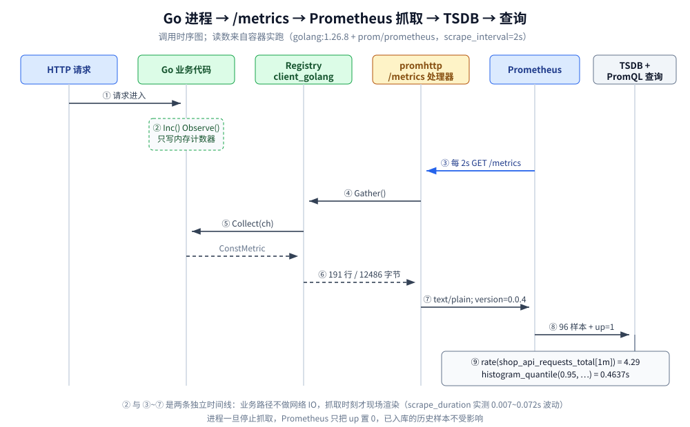
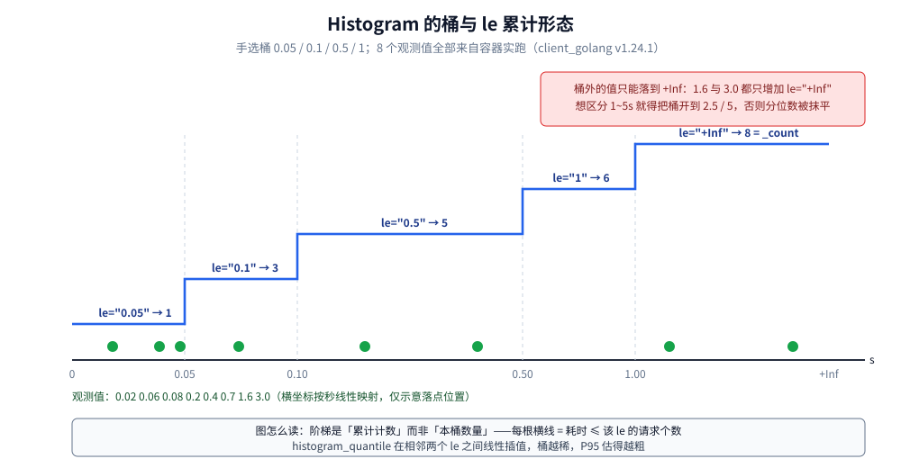
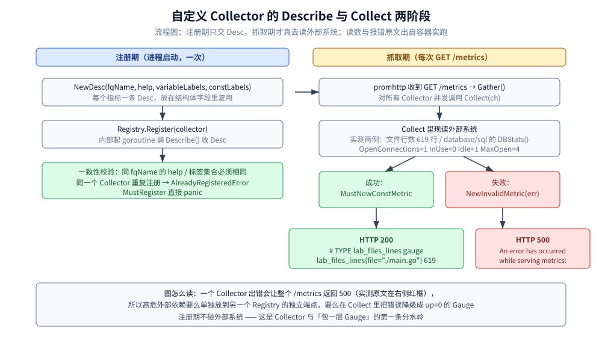

# 手写 Prometheus 导出器

> Go 侧用 `client_golang` 手写 Prometheus 导出器（exporter / metrics 埋点）的完整手册：注册表与四种指标类型、`/metrics` 处理器、命名与标签基数规范、进程自带指标、自定义 Collector、注册表隔离、抓取与推送的分工、埋点落点判据，以及与 Prometheus 侧闭环验证的做法。
>
> 内容整理自个人学习笔记，素材见 [素材清单.md](../../../素材清单.md)。
>
> ⚠️ 本篇全部读数来自容器 `golang:1.26-alpine`（`go version go1.26.8 linux/amd64`）+ `prom/prometheus` + `prom/pushgateway` 真跑，`client_golang` 解析到 **v1.24.1**；抓取链路是「导出器容器 + 独立 Prometheus 容器」实测抓到的，不是构造的样例。
>
> ⚠️ Prometheus 组件本体（架构、PromQL、服务发现、存储与选型）不在本篇：指标层横向对比见 [可观测性选型对比.md](../../../03-数据与中间件/中间件/可观测性/可观测性选型对比.md)，Prometheus 数据模型 / 抓取 / remote write 的背景与替代路线见 [与Prometheus生态的关系.md](../../../03-数据与中间件/数据存储/时序数据库/VictoriaMetrics/与Prometheus生态的关系.md)。本篇**只讲 Go 进程怎么把指标暴露出来**。

---

## 一、导出器和埋点是同一件事吗？

**本节要点**：是同一件事的两侧。「埋点」是在业务代码里改内存计数器，「导出器」是把这些计数器渲染成一个 HTTP 端点让外部来抓。Go 侧两者都由 `client_golang` 提供，**没有独立进程、没有 agent、不需要 sidecar**。

一句话模型：

| 角色 | 谁做 | Go 侧对应 |
| --- | --- | --- |
| 记录数值 | 业务代码 | `Counter.Inc()` / `Gauge.Set()` / `Histogram.Observe()` / `Summary.Observe()` |
| 保存数值 | 进程内存 | `Registry`（默认 `prometheus.DefaultRegistry`） |
| 渲染文本 | HTTP handler | `promhttp.Handler()` / `promhttp.HandlerFor(reg, opts)` |
| 拉取 / 存储 / 告警 | 外部进程 | Prometheus Server（**本篇不讲**） |

三条边界，先划清楚再往下读：

1. **业务路径上没有任何网络 IO**。`Inc()` 只是往内存里加一个数；只有被抓取时才遍历注册表渲染文本。这是 pull 模型最大的优点，也是本篇所有实测的第一条结论（见本节末尾的时序图）。
2. **指标名与标签一旦上线就很难改**。抓取端按 `__name__` + 标签全集来区分时间序列，改名等于新序列，历史数据不会跟过来。所以命名规范（第四节）比代码写法更值得先定下来。
3. **⚠️ `03-数据与中间件/中间件/可观测性/` 下目前没有 Prometheus 本体篇**（写本篇时逐目录核对过），组件层的架构 / PromQL / 服务发现只能落在上面链接的两篇里；本篇不重复讲这些。



图怎么读：左半区（①②）是业务时间线，右半区（③~⑨）是抓取时间线，两条互不阻塞。⑥ 的「191 行 / 12486 字节」与 ⑧ 的「96 样本 + up=1」是真实抓取读数；⑨ 的两个查询值是同一套容器里跑出来的返回值。

---

## 二、最小组件链怎么搭起来？

**本节要点**：`Registry` + 指标对象 + `promhttp.HandlerFor()` 三段就够了。`promauto` 只是「注册这步帮你省掉」的语法糖，它固定用默认注册表。

### 2.1 依赖与最小可运行代码

```bash
# 实验目录 .workbuddy/tmp/exp/promexporter/client/
go get github.com/prometheus/client_golang@latest   # 实测解析到 v1.24.1
```

```go
reg := prometheus.NewRegistry()

requests := prometheus.NewCounterVec(prometheus.CounterOpts{
	Namespace: "shop", Subsystem: "api", Name: "requests_total",
	Help: "Total HTTP requests handled by the demo service.",
}, []string{"handler", "code"})
inflight := prometheus.NewGauge(prometheus.GaugeOpts{
	Namespace: "shop", Subsystem: "api", Name: "inflight_requests",
	Help: "Requests currently being served.",
})
latency := prometheus.NewHistogram(prometheus.HistogramOpts{
	Namespace: "shop", Subsystem: "api", Name: "request_duration_seconds",
	Help:    "Request latency in seconds.",
	Buckets: []float64{0.005, 0.01, 0.05, 0.1, 0.5, 1},
})
size := prometheus.NewSummary(prometheus.SummaryOpts{
	Namespace: "shop", Subsystem: "api", Name: "request_size_bytes",
	Help:       "Request body size in bytes.",
	Objectives: map[float64]float64{0.5: 0.05, 0.9: 0.01, 0.99: 0.001},
	MaxAge:     10 * time.Minute,
})
reg.MustRegister(requests, inflight, latency, size)
```

打值与暴露：

```go
requests.WithLabelValues("list", "200").Add(120)
requests.WithLabelValues("detail", "404").Add(3)
inflight.Set(7)
for _, v := range []float64{0.003, 0.008, 0.07, 0.09, 0.3, 1.4} {
	latency.Observe(v)
}
for _, v := range []float64{120, 900, 8500} {
	size.Observe(v)
}

mux := http.NewServeMux()
mux.Handle("/metrics", promhttp.HandlerFor(reg, promhttp.HandlerOpts{}))
// 用默认注册表时可以直接：mux.Handle("/metrics", promhttp.Handler())
```

`promauto.NewCounter(...)` 等价于 `prometheus.NewCounter(...)` + `prometheus.DefaultRegisterer.MustRegister(...)`，好处是不漏注册，代价是**只能往默认注册表里塞**——需要隔离注册表时（第七节）就不能用它。

### 2.2 容器里 `curl /metrics` 的真实输出

上面那段代码在容器里渲染出的响应体（`# HELP` / `# TYPE` 行原样抄，未删减）：

```text
HTTP 200  Content-Type="text/plain; version=0.0.4; charset=utf-8; escaping=underscores"

# HELP shop_api_inflight_requests Requests currently being served.
# TYPE shop_api_inflight_requests gauge
shop_api_inflight_requests 7
# HELP shop_api_request_duration_seconds Request latency in seconds.
# TYPE shop_api_request_duration_seconds histogram
shop_api_request_duration_seconds_bucket{le="0.005"} 1
shop_api_request_duration_seconds_bucket{le="0.01"} 2
shop_api_request_duration_seconds_bucket{le="0.05"} 2
shop_api_request_duration_seconds_bucket{le="0.1"} 4
shop_api_request_duration_seconds_bucket{le="0.5"} 5
shop_api_request_duration_seconds_bucket{le="1"} 5
shop_api_request_duration_seconds_bucket{le="+Inf"} 6
shop_api_request_duration_seconds_sum 1.871
shop_api_request_duration_seconds_count 6
# HELP shop_api_request_size_bytes Request body size in bytes.
# TYPE shop_api_request_size_bytes summary
shop_api_request_size_bytes{quantile="0.5"} 900
shop_api_request_size_bytes{quantile="0.9"} 8500
shop_api_request_size_bytes{quantile="0.99"} 8500
shop_api_request_size_bytes_sum 9520
shop_api_request_size_bytes_count 3
# HELP shop_api_requests_total Total HTTP requests handled by the demo service.
# TYPE shop_api_requests_total counter
shop_api_requests_total{code="200",handler="list"} 120
shop_api_requests_total{code="404",handler="detail"} 3
```

四个读点：

- **CounterVec 只输出被实际用过的那两个 label 组合**——没调用过的组合不会预先生成序列。⚠️ 副作用：`code="500"` 在第一次 5xx 之前**完全没有序列**，`sum(rate(x[5m])) by (code)` 就看不到错误率从 0 抬起来的那一下。要监控「首次出现」就必须在启动时把 label 组合预热一遍（`WithLabelValues(...).Add(0)`）。
- **`le` 是累计计数**，不是本桶数量：0.005→1、0.01→2、0.1→4 单调不减，`le="+Inf"` 恒等于 `_count`。形态见第三节末尾那张桶图。
- **`# TYPE` 决定抓取端怎么解析**，同族每行的类型必须一致，`_bucket` / `_sum` / `_count` 是 Histogram 的固定后缀。
- **`escaping=underscores` 在纯合法名字上也会出现**：v1.24.1 的 promhttp 无条件带上这个后缀，不是「你有非法字符」的信号（第四节实测了它真正的语义）。

---

## 三、四种指标类型怎么选？

**本节要点**：判据是「查询时要不要跨实例 / 跨时间做聚合」。能聚合的（Counter / Gauge / Histogram）优先，不能聚合的（Summary）慎用。

| 类型 | 语义 | 输出形态 | 能跨实例合并吗 | 典型用法 |
| --- | --- | --- | --- | --- |
| `Counter` / `CounterVec` | 只增不减的累计量 | 一行一个 label 组合，后缀 `_total` | ✅ `sum(rate(...))` | 请求数、错误数、已处理条数 |
| `Gauge` / `GaugeVec` | 可上可下的瞬时值 | 一行一个 label 组合 | ⚠️ 求和看语义，求平均用 `avg` | 队列长度、在线数、连接池空闲数、配置值 |
| `Histogram` / `HistogramVec` | 观测值落进预设桶 | 每序列 `N 个 _bucket` + `_sum` + `_count` | ✅ 分位数可跨实例合并 | 延迟、请求体大小 |
| `Summary` / `SummaryVec` | 进程内算好的分位数 | 每序列 `M 个 quantile` + `_sum` + `_count` | ❌ **分位数不可合并** | 只要单机 P95 且不需要聚合时 |

两条关键判据：

1. ⚠️ **`Summary` 在 Prometheus 生态里默认不要用**。分位数是**进程内**算出来的（滑动窗口 + 加权），抓取端拿到的已经是「某个窗口的 P95 数字」，多副本时只能 `avg(P95)`——而**分位数不能平均**，取 `max` 也只是最粗的保守上界。本篇实测只有一个副本，所以第二节那次渲染里 `quantile="0.99"` 就是 `8500`（三个观测值里的最大值，样本太少时 objective 会塌到同一个值，这正是不稳定的表现）。要「服务端算 P95、多副本可合并」就用 `Histogram` + `histogram_quantile()`。
2. **Gauge 别用来记事件次数**。Gauge 的两次采样之间没有信息，进程重启就归零；`Set()` 覆盖、`Add()` 增量，但抓取端无法判断两次值之间发生过什么。计数一律 Counter，配合 `rate()` / `increase()` 才是可聚合的。

补充一条实践细节：Gauge 的「陈旧值」问题——业务协程退出后 Gauge 会一直保持最后一次值，Prometheus 会把它当作「仍然有效」直到超时。所以**瞬时值型 Gauge 要由定时刷新协程写入，或者用 `NewGaugeVec` + 显式 `DeleteLabelValues()` 收回**；否则副本下线后老序列还能读到旧数字。

Histogram 的桶形态图（数据来自本篇容器实跑，观测值 `[0.02 0.06 0.08 0.2 0.4 0.7 1.6 3]`）：



图怎么读：横线是「耗时 ≤ 该 `le` 的累计个数」，与实测原文 `le="0.05"→1`、`le="0.1"→3`、`le="0.5"→5`、`le="1"→6`、`le="+Inf"→8` 一致；绿色圆点是 8 个观测值的落点（横轴按秒线性映射，位置仅示意）。

---

## 四、指标名和标签该怎么起名？

**本节要点**：命名规范不是洁癖——名字不合规不会报错，但会**静默丢数据**；标签多一个高基数维度，序列数就乘一个量级。

### 4.1 `BuildFQName` 的拼接规则（源码 + 实测）

`client_golang` v1.24.1 `prometheus/metric.go` 里的实现（用 `sed -n '/^func BuildFQName/,/^}/p'` 从模块缓存里原样取出）：

```go
func BuildFQName(namespace, subsystem, name string) string {
	if name == "" {
		return ""
	}

	sb := strings.Builder{}
	sb.Grow(len(namespace) + len(subsystem) + len(name) + 2)

	if namespace != "" {
		sb.WriteString(namespace)
		sb.WriteString("_")
	}

	if subsystem != "" {
		sb.WriteString(subsystem)
		sb.WriteString("_")
	}

	sb.WriteString(name)

	return sb.String()
}
```

它只负责用下划线拼接，实测四条：

```text
BuildFQName("shop","api","requests_total")       = shop_api_requests_total
BuildFQName("shop","","node_bytes")              = shop_node_bytes
BuildFQName("","","go_goroutines")               = go_goroutines
BuildFQName("shop","api","duration_seconds")     = shop_api_duration_seconds
```

约定形式是 `<namespace>_<subsystem>_<name>_<unit>`，其中单位用 **base unit**：秒（不是毫秒）、字节（不是 MB）、比例（0~1）。实测里 `go_memstats_heap_alloc_bytes`、`shop_api_request_duration_seconds`、`process_resident_memory_bytes` 都遵循这条。

### 4.2 ⚠️ 非法名字不在注册期报错，而是在渲染时「降级成下划线」

这一段是本篇最重要的踩坑实测。给指标名塞一个斜杠：

```go
weird := prometheus.NewGauge(prometheus.GaugeOpts{Namespace: "shop", Name: "api/requests", Help: "slash"})
normal := prometheus.NewGauge(prometheus.GaugeOpts{Namespace: "shop", Subsystem: "api", Name: "requests", Help: "underscore"})
reg := prometheus.NewRegistry()
fmt.Println(reg.Register(weird))   // 带斜杠： <nil>
reg.MustRegister(normal)           // 两个都注册成功
```

注册阶段**没有任何错误**（实测 `带斜杠： <nil>`）。渲染时两者都变成同一个文本名：

```text
# HELP shop_api_requests slash
# TYPE shop_api_requests gauge
shop_api_requests 1
# HELP shop_api_requests underscore
# TYPE shop_api_requests gauge
shop_api_requests 2
```

Prometheus 抓取这个端点的实测结果（两条查询的返回原文）：

```text
scrape_samples_scraped{job="go-badname"} → 2        # 两个样本都被解析
{__name__=~"shop_api_requests", job="go-badname"}
  -> {'__name__': 'shop_api_requests', 'instance': 'host.docker.internal:18080', 'job': 'go-badname'} 2
  (series=1)
```

**两个样本被合并进同一条序列，`weird` 的值 1 被覆盖，静默丢失**——目标状态还是 `up`，不报任何错。结论：命名规范的第一条硬约束是「只用 `[a-zA-Z0-9_]`」，因为违反它的代价不是启动失败而是数据悄悄没了；同名不同 help 也会走这条降级路径。

### 4.3 标签基数：塞进 `user_id` 之后的真实数字

同一个 `CounterVec`，4 个 handler × 3 个 code，区别只在有没有 `user_id` 标签（实测 2000 个用户 ID）：

```text
handler+code               指标族=1  序列=12     /metrics 字节=725      行数=15
handler+code+user_id(2000) 指标族=1  序列=24000  /metrics 字节=1624774  行数=24003
```

一个标签维度把 725 字节撑到 **1.6 MB**（约 2240 倍），序列数从 12 涨到 24000。抓取端侧的代价（每个序列在 TSDB 里常驻索引）见 [与Prometheus生态的关系.md](../../../03-数据与中间件/数据存储/时序数据库/VictoriaMetrics/与Prometheus生态的关系.md) 里「标签基数就是成本本身」那一节，本篇不重讲。

Histogram 还会再乘一次：

```text
4 个 handler 的默认桶直方图：指标族=1 序列=4 /metrics 字节=3402
```

序列数写的是 4（按 label 组合计数），但每个 handler 展开成 **11 个桶 + 1 个 `+Inf` + `_sum` + `_count`**，所以字节数是 Counter 版的 3402/725 ≈ 4.7 倍。**判据：`直方图序列数 ≈ label 组合数 × (桶数 + 3)`**——先估这个乘积再决定要不要加标签或加桶。

对照本篇常驻服务（`/metrics` 渲染 191 行、`curl` 实测 12486 字节；这两个数字会随运行期新出现的 label 组合缓慢上浮，复跑拿到 192 行 / 12619 字节是正常的，下面两条计数才不会变）：

```text
scrape_samples_scraped{job="go-app"} → 96    # 一次抓取解析出的样本数
count({job="go-app"})                → 101   # 活跃序列数
```

多出来的 5 条是抓取端自己合成的 `up` 与四条 `scrape_*`——**导出器不产出它们，但它们在 Prometheus 侧一样占序列**。

### 4.4 桶选择：默认桶覆盖什么、漏判什么

`DefBuckets`（v1.24.1 `prometheus/histogram.go` 第 271 行原样）：

```go
var DefBuckets = []float64{.005, .01, .025, .05, .1, .25, .5, 1, 2.5, 5, 10}
```

同一批观测值 `[0.02 0.06 0.08 0.2 0.4 0.7 1.6 3]`，默认桶 vs 手选桶 `[0.05 0.1 0.5 1]` 的实测输出：

```text
shop_d1_duration_seconds_bucket{le="0.005"} 0    # 默认桶
shop_d1_duration_seconds_bucket{le="0.01"} 0
shop_d1_duration_seconds_bucket{le="0.025"} 1
shop_d1_duration_seconds_bucket{le="0.05"} 1
shop_d1_duration_seconds_bucket{le="0.1"} 3
shop_d1_duration_seconds_bucket{le="0.25"} 4
shop_d1_duration_seconds_bucket{le="0.5"} 5
shop_d1_duration_seconds_bucket{le="1"} 6
shop_d1_duration_seconds_bucket{le="2.5"} 7
shop_d1_duration_seconds_bucket{le="5"} 8
shop_d1_duration_seconds_bucket{le="10"} 8
shop_d1_duration_seconds_bucket{le="+Inf"} 8
shop_d1_duration_seconds_count 8
shop_d1_duration_seconds_sum 6.0600000000000005
shop_d2_duration_seconds_bucket{le="0.05"} 1     # 手选桶
shop_d2_duration_seconds_bucket{le="0.1"} 3
shop_d2_duration_seconds_bucket{le="0.5"} 5
shop_d2_duration_seconds_bucket{le="1"} 6
shop_d2_duration_seconds_bucket{le="+Inf"} 8
shop_d2_duration_seconds_count 8
shop_d2_duration_seconds_sum 6.0600000000000005
```

三点读法：

- `_sum` 与 `_count` 与桶**完全无关**，两种配置都是 6.06 / 8 —— 平均值随便算，分位数才受桶影响。
- 0.06 和 0.08 在两组里都落进 `le="0.1"`，**同一个桶内无法区分**；`histogram_quantile` 会在 `le="0.05"` 与 `le="0.1"` 之间线性插值，桶越宽估得越粗。
- 手选桶只到 1，于是 1.6 与 3.0 都只加 `le="+Inf"`：**桶的上限必须盖住最慢的那一档**，否则 P95 直接顶到 `+Inf`、变成「未知的某个大数」。默认桶覆盖 5ms~10s，适合绝大多数 HTTP 接口；批处理、导出任务这类要自己扩到几十秒。

---

## 五、进程自带的 Go / 进程指标要不要全开？

**本节要点**：`promhttp.Handler()` 用的默认注册表里已经挂着 GoCollector 和 ProcessCollector，一行埋点不写就有 39 个指标族；它们有价值也有代价，裁剪入口是 `collectors.NewGoCollector(opts...)`。

### 5.1 默认就有的读数（容器实测）

```text
DefaultRegisterer 默认就有 39 个指标族 / 39 条序列（未写一行埋点代码）

# HELP go_goroutines Number of goroutines that currently exist.
# TYPE go_goroutines gauge
go_gc_duration_seconds{quantile="0"} 0.00015686
go_gc_duration_seconds{quantile="0.25"} 0.000278027
go_gc_duration_seconds{quantile="0.5"} 0.000280427
go_gc_duration_seconds{quantile="0.75"} 0.000291325
go_gc_duration_seconds{quantile="1"} 0.000405295
go_gc_duration_seconds_count 5
go_gc_duration_seconds_sum 0.001411934
go_goroutines 142
go_memstats_alloc_bytes_total 3.9243824e+07
go_memstats_heap_alloc_bytes 2.8115288e+07
go_memstats_heap_sys_bytes 3.702784e+07
go_threads 6
process_cpu_seconds_total 0.39
process_max_fds 1.048576e+06
process_network_receive_bytes_total 0
process_network_transmit_bytes_total 0
process_open_fds 6
process_resident_memory_bytes 4.4089344e+07
process_start_time_seconds 1.79143605339e+09
process_virtual_memory_bytes 1.306804224e+09
process_virtual_memory_max_bytes 1.8446744073709552e+19
shop_queue_depth 42
```

`go_goroutines 142` 是这次演示里手动起了 137 个休眠协程的结果（基线约 5 个）——它配合 [协程泄漏与死锁.md](../并发编程/协程泄漏与死锁.md) 的「只涨不落」判据用。

| 指标 | 对应什么 | 什么时候有用 |
| --- | --- | --- |
| `go_goroutines` | 当前 goroutine 数（`runtime.NumGoroutine()`） | 泄漏排查；配合告警 `> 阈值` |
| `go_threads` | OS 线程数（`runtime` 的线程创建数） | cgo 调用把线程撑爆时 |
| `go_memstats_heap_alloc_bytes` | 堆上活跃对象字节（`MemStats.HeapAlloc`） | 判断「是不是真的在涨」 |
| `go_memstats_heap_sys_bytes` | 堆向 OS 要到的字节（`HeapSys`） | 判断 RSS 里有多少还给了 OS |
| `go_memstats_alloc_bytes_total` | 累计分配量（Counter 语义） | 分配速率 = `rate()`，看 GC 压力 |
| `go_gc_duration_seconds` | **Summary**：GC STW 暂停分位数 | 尾延迟怀疑 GC 时 |
| `process_cpu_seconds_total` | 进程累计 CPU 秒（Counter） | `rate()` 得核数占用 |
| `process_resident_memory_bytes` | RSS | 容器 OOM 前的水位 |
| `process_open_fds` / `process_max_fds` | 已用 / 上限文件描述符 | 连接泄漏、fd 打满 |
| `process_start_time_seconds` | 进程启动时间戳 | 判断「刚才是不是重启过」 |
| `process_network_*_bytes_total` | Linux 下由 procfs 提供，实跑为 0 | 进程级网络量在本环境不可用 |

`go_memstats_*` 就是 `runtime.MemStats` 那套字段搬进 Prometheus，字段含义与「哪些会骗人」见 [runtime调试与trace.md](../运行时/runtime调试与trace.md)——本篇不重讲。

### 5.2 裁剪与新增：两套 API 的取舍

```text
NewGoCollector() 默认（MemStats 风格）   指标族=  29 序列=  29 /metrics 字节=   6751
关闭 MemStats 风格                      指标族=   8 序列=   8 /metrics 字节=   1856
只留 /sched 的 runtime/metrics          指标族=  20 序列=  20 /metrics 字节=   9403
全量 runtime/metrics（MetricsAll）      指标族= 139 序列= 139 /metrics 字节=  53531
```

```go
r := prometheus.NewRegistry()
r.MustRegister(
	// 只要调度器那组 runtime/metrics，不要 MemStats 风格的老指标
	collectors.NewGoCollector(
		collectors.WithGoCollectorMemStatsMetricsDisabled(),
		collectors.WithGoCollectorRuntimeMetrics(collectors.MetricsScheduler),
	),
	collectors.NewProcessCollector(collectors.ProcessCollectorOpts{}),
)
```

三条结论（前两条来自 v1.24.1 源码注释，第三条是上面那组实测数字）：

- ⚠️ **`prometheus.NewGoCollector` 已废弃**，源码注释原文：`// Deprecated: Use collectors.NewGoCollector instead.`；同理 `collectors.WithGoCollections(GoCollectionOption)` 也标了 Deprecated（原文 `// Deprecated: Use WithGoCollectorRuntimeMetrics() and WithGoCollectorMemStatsMetricsDisabled() instead to control metrics.`）。**新代码只用 `WithGoCollectorRuntimeMetrics` + `WithGoCollectorMemStatsMetricsDisabled`**。
- `MetricsAll`（正则 `/.*` 匹配全部 `runtime/metrics`）会把 29 族扩到 **139 族 / 53531 字节**——一次抓取多 8 倍量。默认注册表里那 39 族已经包含常用一组，**没必要全开**；`/gc/gogc:percent`、`/sched/*` 这类调试指标按需单开。
- 全量 GoCollector 单次渲染成本很低（本篇抓取实测 `scrape_duration_seconds` 0.007~0.072s 区间，含业务指标），**瓶颈不在渲染而在抓取端的序列数**——与第四节同一条红线。

---

## 六、什么时候必须手写 Collector？

**本节要点**：需要「**在抓取那一刻**去问一个我没有缓存的东西」时才写 Collector；平时能 `Set()` 的就用 Gauge。



图怎么读：左列注册期只做 Desc 一致性校验、不碰外部系统；右列抓取期才真去读数，成功走 `MustNewConstMetric`、失败走 `NewInvalidMetric`。右侧红框的 HTTP 500 是本篇实测的响应，原文见 6.3。

### 6.1 两个可直接照抄的 Collector

```go
// fileCollector：抓取时刻现读本地文件行数
type fileCollector struct {
	path string
	desc *prometheus.Desc
}

func newFileCollector(path string) *fileCollector {
	return &fileCollector{path: path, desc: prometheus.NewDesc(
		prometheus.BuildFQName("lab", "files", "lines"),
		"Number of lines in a watched file, sampled at scrape time.",
		[]string{"file"}, nil,
	)}
}

func (c *fileCollector) Describe(ch chan<- *prometheus.Desc) { ch <- c.desc }

func (c *fileCollector) Collect(ch chan<- prometheus.Metric) {
	n, err := countLines(c.path)
	if err != nil {
		ch <- prometheus.NewInvalidMetric(c.desc, fmt.Errorf("read %s: %w", c.path, err))
		return
	}
	ch <- prometheus.MustNewConstMetric(c.desc, prometheus.GaugeValue, float64(n), c.path)
}
```

```go
// dbStatsCollector：把 database/sql 的连接池指标搬进 Prometheus
func (c *dbStatsCollector) Collect(ch chan<- prometheus.Metric) {
	st := c.db.Stats()
	ch <- prometheus.MustNewConstMetric(c.descs["open"], prometheus.GaugeValue, float64(st.OpenConnections), c.dbs)
	ch <- prometheus.MustNewConstMetric(c.descs["inuse"], prometheus.GaugeValue, float64(st.InUse), c.dbs)
	ch <- prometheus.MustNewConstMetric(c.descs["idle"], prometheus.GaugeValue, float64(st.Idle), c.dbs)
	ch <- prometheus.MustNewConstMetric(c.descs["max"], prometheus.GaugeValue, float64(st.MaxOpenConnections), c.dbs)
	ch <- prometheus.MustNewConstMetric(c.descs["waited"], prometheus.CounterValue, float64(st.WaitCount), c.dbs)
	ch <- prometheus.MustNewConstMetric(c.descs["waitdur"], prometheus.CounterValue, st.WaitDuration.Seconds(), c.dbs)
}
```

渲染结果（`Describe()` 交出的 Desc 决定 HELP/TYPE，`Collect()` 决定值；实测原文）：

```text
HTTP 200
# HELP lab_files_lines Number of lines in a watched file, sampled at scrape time.
# TYPE lab_files_lines gauge
lab_files_lines{file="./main.go"} 619
# HELP lab_sql_connections_idle Idle connections in the pool.
# TYPE lab_sql_connections_idle gauge
lab_sql_connections_idle{db="orders"} 1
# HELP lab_sql_connections_in_use Connections checked out by queries.
# TYPE lab_sql_connections_in_use gauge
lab_sql_connections_in_use{db="orders"} 0
# HELP lab_sql_connections_max_open Configured max open connections.
# TYPE lab_sql_connections_max_open gauge
lab_sql_connections_max_open{db="orders"} 4
# HELP lab_sql_connections_open Open connections in the pool.
# TYPE lab_sql_connections_open gauge
lab_sql_connections_open{db="orders"} 1
# HELP lab_sql_connections_wait_seconds_total Time blocked waiting for connections.
# TYPE lab_sql_connections_wait_seconds_total counter
lab_sql_connections_wait_seconds_total{db="orders"} 0
# HELP lab_sql_connections_waited_total Connections waited for.
# TYPE lab_sql_connections_waited_total counter
lab_sql_connections_waited_total{db="orders"} 0
```

`WaitCount` / `WaitDuration` 为 0 说明连接池从没等过（`MaxOpenConns=4` 够用）；一旦 `lab_sql_connections_in_use` 常年贴着 4、`waited_total` 开始涨，就是池子小了——这两个指标配成告警对，比看 CPU 直接。

⚠️ 实测细节：`lab_files_lines` 在两次不同的运行里读出 **587** 与 **619**（中间我改了 `main.go` 的行数），同一个指标在常驻服务上每次抓取还可能不同——因为每次抓取都真的重新 `open+scan` 了一遍文件。**这就是 Collector 的语义：抓取时刻的现值**，与 Gauge 的「最后一次写入值」含义完全不同。

### 6.2 Collector 还是包一层 Gauge？

| 情况 | 选择 | 原因 |
| --- | --- | --- |
| 值来自本进程的内存状态（队列长度、in-flight） | **Gauge** | 变化点就在你代码里，直接 `Set()` 最省 |
| 值是事件次数（已处理、失败、重试） | **Counter**（必要时 GaugeVec + `Delete`） | 需要 `rate()` 才可聚合 |
| 值要向外部系统现问（`sql.DB.Stats()`、`/proc`、SDK 的 `PoolStats()`） | **Collector** | 只在抓取时才问，不占用业务路径 |
| 值来自另一个进程 / 另一语言的服务 | **独立 exporter 进程**（Collector 是它的主体） | 生命周期与故障域要隔离 |
| 一个第三方库只给了「当前数量」的 getter，且你不想定时轮询 | **Collector** | 免去 ticker + goroutine |
| 同一份数据被抓取频率远高于 1 次/15s（例如本地要 diff） | **Gauge + ticker 缓存** | Collector 每次抓取都重算，昂贵查询会被放大 |

判据一句话：**Collector 把「取数」推迟到抓取时刻**，代价是抓取路径上的耗时与失败会直接影响 `/metrics` 是否 500；Gauge 把取数放在业务/定时路径上，代价是要自己维护刷新协程与陈旧值。

### 6.3 Collector 里报错，`/metrics` 会整个失败

`NewInvalidMetric` 是 Collector 唯一的报错出口。实测原文（真实 HTTP 响应，不是模拟）：

```text
HTTP/1.1 500 Internal Server Error
Content-Type: text/plain; charset=utf-8
X-Content-Type-Options: nosniff
Content-Length: 264

An error has occurred while serving metrics:

error collecting metric Desc{fqName: "lab_external_up", help: "1 when the external system answered, 0 otherwise.", unit: "", constLabels: {}, variableLabels: {}}: dial redis:127.0.0.1:6399: connect: connection refused
```

对应 Prometheus 侧的 target 状态：

```text
go-broken | down | server returned HTTP status 500 Internal Server Error
up{job="go-broken"} 0
```

三条后果与对策：

1. **一个 Collector 失败 = 整个端点 500 = 这个 target 全部指标消失**，不是「少一个指标」；
2. 高危依赖（要连 Redis / 外部 HTTP 才能算出来的值）**必须单独放一个 Registry、单独一个端点、单独一个 job**（第七节），别混在业务 `/metrics` 里；
3. 想保留端点又暴露故障，就在 Collect 里**降级**：把探测失败写成 `external_up 0`（Gauge）而不用 `NewInvalidMetric`。

`promhttp` 的这段行为在源码里是硬编码的（`promhttp/http.go`，`sed -n '/^func httpError/,/^}/p'` 原样取出）：

```go
func httpError(rsp http.ResponseWriter, err error) {
	rsp.Header().Del(contentEncodingHeader)
	http.Error(
		rsp,
		"An error has occurred while serving metrics:\n\n"+err.Error(),
		http.StatusInternalServerError,
	)
}
```

注意它先 `Del(contentEncodingHeader)`——500 的错误正文**一定不压缩**，方便直接读原文。

---

## 七、注册表怎么隔离？重复注册为什么会 panic？

**本节要点**：`Registry` 是「一次渲染的边界」；默认注册表是全进程共享的，库作者尤其不要往里塞东西。

### 7.1 隔离实测：同进程两个端点

```go
biz := prometheus.NewRegistry()
biz.MustRegister(queueDepth)                       // 业务指标
runtimeReg := prometheus.NewRegistry()
runtimeReg.MustRegister(collectors.NewGoCollector()) // 运行时指标

mux.Handle("/metrics", promhttp.HandlerFor(biz, promhttp.HandlerOpts{}))
mux.Handle("/metrics/runtime", promhttp.HandlerFor(runtimeReg, promhttp.HandlerOpts{}))
```

```text
业务端点字节=95 序列=1；runtime 端点字节=6752 序列=29；合并端点字节=6848
```

两个端点各渲染各的（95 + 6752 = 6847 ≈ 合并的 6848，只差一个换行），所以**分开注册不会重复计数**。隔离的实际动机有三个：

- **让库不污染应用**：`client_golang` 的库若偷偷 `promauto.NewXxx`，应用侧就再也拆不开；库应该只暴露 `Collector`，由调用方决定注册到哪个 Registry。
- **控制单个端点体积**：给 sidecar / 网关只暴露业务端点，runtime 端点单独抓，避免大端点每次抓取都全量渲染。
- **限制故障域**：6.3 的高危 Collector 放独立 Registry，它 500 时业务指标仍在。

### 7.2 重复注册：三种错误原文

```text
同一个 Collector 实例注册两次：err=duplicate metrics collector registration attempted
errors.As 命中 AlreadyRegisteredError=true，ExistingCollector 非空=true

不同 Collector 产出同名指标：err= a previously registered descriptor with the same
fully-qualified name as Desc{fqName: "shop_api_calls_total", help: "different collector,
same fqName", unit: "", constLabels: {}, variableLabels: {}} has different label names
or a different help string

MustRegister 遇到同样情况直接 panic：
panic: duplicate metrics collector registration attempted
```

`AlreadyRegisteredError` 的定义就是两个 Collector 字段（源码原样）：

```go
type AlreadyRegisteredError struct {
	ExistingCollector, NewCollector Collector
}
```

所以「多次注册同一个 Collector」应当**被容忍**：

```go
var are prometheus.AlreadyRegisteredError
if err := reg.Register(c); err != nil {
	if errors.As(err, &are) {
		c = are.ExistingCollector // ⭐ 复用已注册的那个，别报错
	} else {
		return err
	}
}
```

⚠️ 但**不同类型**的同名注册（第一种 vs 第二种错误）不是 `AlreadyRegisteredError`，`errors.As` 不命中，必须让它显式失败——那是真正的「两个东西抢同一个指标名」。这类冲突在 `MustRegister` 下会直接 panic 并把**全部**已注册的 Desc 列出来，读第一行就知道是谁抢了谁。

### 7.3 promhttp 的压缩协商

```text
无 Accept-Encoding             Content-Encoding=""     响应体字节=6847
gzip                          Content-Encoding="gzip" 响应体字节=1637
gzip;q=1.0, identity;q=0.5    Content-Encoding="gzip" 响应体字节=1637
```

真实端点上同一次抓取的两个数字：`12486` 字节 → gzip 后 `2554` 字节（压缩率约 5 倍，文本协议重复前缀多）。

- Prometheus 抓取默认带 `Accept-Encoding: gzip`，**不需要配置**；`HandlerOpts{DisableCompression: true}` 才能关掉。
- ⚠️ 别在前端给 `/metrics` 加「强制解 gzip」或 gzip-on-save 之类的中间件；跨层再压一次只会让抓取端解析失败。
- 端点保护与网关侧的处理见 [从零实现网关.md](../网络编程/从零实现网关.md)（它自己就是「不引 SDK 直接输出 Prometheus 文本」的一份实现）。

---

## 八、为什么是抓取而不是推送？

**本节要点**：进程生命周期短、网络方向不可达时才考虑推送；其余场景一律暴露端点，让抓取端来判定死活。

pull 模型的三个好处，其中第一条本篇实测过：

1. **死活判定是抓取端做的**，导出器自己不需要知道 Prometheus 在哪。停掉导出器容器后实测：

```text
go-app | down | Get "http://host.docker.internal:18080/metrics": dial tcp 192.168.65.254:18080: connect: connection refused
up{job="go-app"} 0
```

   重新启动后 `up{job="go-app"} 1`，而 `sum(shop_api_requests_total)` 变成 **45**（重启前是几百），说明 **Counter 归零了**——这是 pull 模型的固有现象，靠 `rate()` 处理计数器重置来消化，不要为了「保住累计值」去给 Counter 做持久化。
2. **配置集中在抓取端**：采样间隔、超时、重标签、告警都在 Prometheus 侧改，业务进程不动。
3. **导出器无状态**：挂了不影响数据链路判定，`up` 立刻变 0。

### 8.1 Pushgateway：只给「活不到被抓」的一次性 job

一次性任务（跑几十秒就退出的批处理、CronJob）来不及被 scrape_interval 抓到，才推到 Pushgateway，再由 Prometheus 抓 Pushgateway。

```go
err := push.New(pushURL, "nightly_report").Grouping("instance", "batch-1").
	Collector(rows).Collector(secs).Push()   // PUT：覆盖语义
// 换成 .Add() 就是 POST：累加语义
```

容器实跑（pushgateway 1.11.3，独立实例、映射 19091 端口）；下面是三次重复运行的**全部**读数：

```text
第一次 Push（覆盖语义）耗时 37ms：<nil>     # 第 1 轮
第二次 Add（累加语义）耗时 7ms：<nil>
第一次 Push（覆盖语义）耗时 31ms：<nil>     # 第 2 轮
第二次 Add（累加语义）耗时 3ms：<nil>
第一次 Push（覆盖语义）耗时 22ms：<nil>     # 第 3 轮
第二次 Add（累加语义）耗时 6ms：<nil>
```

即 `Push` 22~37ms（首次含容器冷启动与连接建立，只断言「毫秒级、远低于抓取间隔」）、`Add` 3~7ms。

```text
# HELP shop_nightly_report_rows_total Rows written by the one-shot nightly report job.
# TYPE shop_nightly_report_rows_total gauge
shop_nightly_report_rows_total{instance="batch-1",job="nightly_report"} 18432
# HELP shop_nightly_report_seconds_total Elapsed seconds of the one-shot nightly report job.
# TYPE shop_nightly_report_seconds_total counter
shop_nightly_report_seconds_total{instance="batch-1",job="nightly_report"} 75
```

`75` 是 `37.5 + 37.5` 的两次累加，`Push` / `Add` 的语义差别就在这一行上（每轮都是先 `Push` 复位到 37.5、再 `Add` 到 75，三轮结束后的最终读数仍是 `75`，说明 `Push` 的覆盖语义成立）。

把 Pushgateway 加成抓取任务后（配置热加载见第十节），查询返回：

```text
{'__name__': 'shop_nightly_report_rows_total',
 'exported_instance': 'batch-1', 'exported_job': 'nightly_report',
 'instance': 'host.docker.internal:19091', 'job': 'pushgateway'} 18432
```

⭐ 这是 Pushgateway 最反直觉的实测点：**推上去的 `job` / `instance` 被抓取时改写成 `exported_job` / `exported_instance`**，真正的 `job` 是抓取任务名（`pushgateway`）、`instance` 是 Pushgateway 地址。所有按 job 过滤的查询与告警都要用 `exported_job` 重写。

不该用 Pushgateway 的情况：常驻服务。它会让「死活」判定失效——实测那个 `--rm` 的推送容器**跑完就已退出**，但 `shop_nightly_report_rows_total 18432` 仍留在 Pushgateway 的 `/metrics` 里、并继续被抓进 Prometheus（`up{job="pushgateway"}` 一直为 1）：进程死了数值仍被抓成有效值。Pushgateway 只把指标存在内存里（实测 `/api/v1/status` 里 `"persistence.file":""`、`"persistence.interval":"5m0s"`），它自己重启即丢。

---

## 九、埋点该打在哪一层？

**本节要点**：HTTP/gRPC 的 QPS、延迟、错误率一律在**中间件里统一记**，业务 handler 只补业务语义指标。

| 落点 | 记什么 | 不记什么 |
| --- | --- | --- |
| HTTP 中间件（`ResponseWriter` 包装处） | `requests_total{handler,code}`、`request_duration_seconds{handler}`、`inflight_requests` | ⚠️ 别把 `path` 原样当 label（路径参数会把基数打爆），用路由模板名 |
| 出站客户端中间件 | `{target, code}` 计数 + 延迟直方图 | 别记 body 大小分布，除非真要容量规划 |
| 连接池 / 驱动 | Collector 拉 `DBStats()` | 不要在每条 SQL 上打点 |
| 队列 / 消费者 | `handled_total{result}`、`lag_seconds`、`queue_depth` | 别用 Gauge 记「累计处理数」 |
| 定时任务 | 起止 Counter + 一次 `Observe(duration)`；结束后可推 Pushgateway | 单次执行的分位数（样本数=1，分位数无意义） |
| 业务漏斗 | 少量枚举标签（`order_state="paid"`） | ⚠️ 任何「用户/订单/设备 ID」都不能进标签 |

三条红线：

1. **延迟要直方图，不要平均值**。平均值会被少量慢请求淹没：本篇实测同一批数据里 `_sum/_count` 两边都是 6.06/8（平均 0.7575s），而 `histogram_quantile(0.95, ...)` 在同一服务上实测跑出 **0.4637s**——两者讲的不是同一件事，只有分位数能定 SLO。
2. **高基数红线**：判断标准是「这个 label 的可能取值数量级」。`handler`（几十）、`code`（几个）、`method`（几个）安全；`user_id`、`order_id`、`ip`、`trace_id` 直接把 12 条序列变成 24000 条（第四节实测）。需要按用户排查就去查日志与 trace，见 [接入Jaeger.md](接入Jaeger.md)。
3. **`/metrics` 不要暴露到公网**。它是「把你的内部结构、量级、依赖名、文件名全交给对方」的端点（6.1 那个 Collector 就把 `file="./main.go"` 写进了标签值）。做法：独立监听端口只在内网 / 抓取网络暴露（本篇实测就是给 Prometheus 单独发布 `18080`），或用反向代理加 IP 白名单 / basic auth / mTLS，网关侧的处理见 [从零实现网关.md](../网络编程/从零实现网关.md)，端口与部署面见 [README.md](../../../03-数据与中间件/中间件/可观测性/README.md)。

---

## 十、怎么确认导出器真的被抓到了？

**本节要点**：验证顺序是「端点 → target 状态 → `up` → 查询返回值 → 热加载」。以下全部是本篇容器的真实读数。

### 10.1 实验的拉起方式

```bash
# 1) 导出器：Go 服务在容器里监听 8080，宿主机映射 18080
MSYS_NO_PATHCONV=1 docker run -d --name goexp-lab \
  -v D:/www/dev-notes:/w -w /w/.workbuddy/tmp/exp/promexporter/client \
  -p 18080:8080 golang:1.26-alpine ./app -mode serve -addr :8080

# 2) Prometheus：独立实例 + 独立端口，配置只读挂载
MSYS_NO_PATHCONV=1 docker run -d --name promexp-lab -p 19090:9090 \
  -v D:/www/dev-notes/.workbuddy/tmp/exp/promexporter/prometheus.yml:/etc/prometheus/prometheus.yml:ro \
  prom/prometheus --config.file=/etc/prometheus/prometheus.yml \
  --storage.tsdb.path=/prometheus --web.enable-lifecycle

# 3) 抓取目标用 host.docker.internal（实测通；容器名方式未验证）
#    job: go-app -> http://host.docker.internal:18080/metrics，scrape_interval: 2s
```

Prometheus 侧的 targets 状态（`/api/v1/targets`，含故意留坏的那个 job）：

```text
go-app     | http://host.docker.internal:18080/metrics        | up   |
go-runtime | http://host.docker.internal:18080/metrics/runtime| up   |
go-badname | http://host.docker.internal:18080/metrics/badname| up   |
go-broken  | http://host.docker.internal:18080/metrics/broken | down | server returned HTTP status 500 Internal Server Error
self       | http://localhost:9090/metrics                    | up   |
```

### 10.2 真实查询返回值

```bash
# ⚠️ 本机强制走代理，必须 --noproxy '*'，否则拿到的是代理错误页
curl --noproxy '*' -s --get --data-urlencode 'query=rate(shop_api_requests_total[1m])' \
  http://127.0.0.1:19090/api/v1/query
```

```text
up -> {'job': 'go-app', ...} 1     {'job': 'go-broken', ...} 0     （5 条序列）
count(shop_api_requests_total) -> 8
count({job="go-app"})          -> 101
sum(rate(shop_api_requests_total[1m])) -> 4.292646188951172
rate(shop_api_requests_total[1m]) -> handler="cart"/code="200" 0.9244
                                    handler="pay"/code="200"   1.4051
                                    handler="cart"/code="500"  0.0370
histogram_quantile(0.95, sum by (le) (rate(shop_api_request_duration_seconds_bucket[1m]))) -> 0.4637597475643359
scrape_samples_scraped{job="go-app"} -> 96
scrape_duration_seconds{job="go-app"} -> 0.007059 ~ 0.071759（14 个样本区间，波动来自宿主机磁盘/网络）
go_goroutines -> go-app 12 / go-runtime 10 / self 45
```

读点：`rate()` 出来的四条 200 序列相加约等于 `sum(rate(...))` 的 4.29（流量发生器约 4~5 QPS）；`up` 只有那个 500 的 job 是 0；`scrape_samples_scraped` 96 与 101 条活跃序列的量级差来自 relabel 前的样本与序列定义不同，不要混用。

⚠️ 复跑时的波动（本篇写完后同一套容器再跑一遍的对照）：`count({job="go-app"})`、`count(shop_api_requests_total)`、`scrape_samples_scraped` 三条**每次都一样**（101 / 8 / 96，序列数由代码里的 label 组合决定，不随时间变）；`sum(rate(shop_api_requests_total[1m]))` 跟着流量发生器的实际 QPS 走（复跑拿到 8.31、8.40）；`histogram_quantile(0.95, ...)` 在 0.4637~0.4672 之间浮动（同一批桶、观测值继续累积）。所以能当结论用的是**序列数、桶的累计单调性、`up` 的真假**这三类，rate/分位数的具体数字只用于说明量级。

### 10.3 配置热加载

给 `prometheus.yml` 追加一个抓取 Pushgateway 的 job 后：

```bash
curl --noproxy '*' -s -X POST http://127.0.0.1:19090/-/reload -w "RELOAD_HTTP=%{http_code}\n"
# RELOAD_HTTP=200
```

```text
go-app | up | 2s
go-badname | up | 2s
go-broken | down | 2s
go-runtime | up | 2s
pushgateway | up | 2s     # ⭐ 不重启就出现了
self | up | 2s
```

⚠️ `--web.enable-lifecycle` 没开时 `/-/reload` 不生效；改 Go 侧的指标定义（改名、加标签）不需要 reload，但抓取端要等 Counter 重置后 `rate()` 才能恢复，改标签会新建序列、老序列在 5 分钟无样本后被判定过期。

---

## 使用：给一个 HTTP 服务手写导出器

**本节要点**：下面是可直接照搬的最小导出器骨架（实测程序 `serve` 模式的整理版，业务 handler 与 `statusWriter` 的实现省略），中间件统一记 QPS / 延迟 / 错误率，运行时与连接池指标由 Collector 现取。

```go
package main

import (
	"database/sql"
	"log"
	"net/http"
	"time"

	"github.com/prometheus/client_golang/prometheus"
	"github.com/prometheus/client_golang/prometheus/collectors"
	"github.com/prometheus/client_golang/prometheus/promhttp"
)

type metrics struct {
	requests *prometheus.CounterVec
	latency  *prometheus.HistogramVec
	inflight prometheus.Gauge
}

func newMetrics(reg *prometheus.Registry, db *sql.DB) *metrics {
	m := &metrics{
		requests: prometheus.NewCounterVec(prometheus.CounterOpts{
			Namespace: "shop", Subsystem: "api", Name: "requests_total",
			Help: "Total HTTP requests handled by the demo service.",
		}, []string{"handler", "code"}),
		latency: prometheus.NewHistogramVec(prometheus.HistogramOpts{
			Namespace: "shop", Subsystem: "api", Name: "request_duration_seconds",
			Help:    "HTTP request latency in seconds.",
			Buckets: []float64{0.01, 0.05, 0.1, 0.5, 1, 5},
		}, []string{"handler"}),
		inflight: prometheus.NewGauge(prometheus.GaugeOpts{
			Namespace: "shop", Subsystem: "api", Name: "inflight_requests",
			Help: "Requests currently being served.",
		}),
	}
	reg.MustRegister(m.requests, m.latency, m.inflight,
		collectors.NewGoCollector(),
		collectors.NewProcessCollector(collectors.ProcessCollectorOpts{}),
		newDBStatsCollector(db, "orders"), // 第六节那个 Collector
	)
	// 可选：预热关键 label 组合，避免首次 5xx 前没有序列
	for _, code := range []string{"200", "500"} {
		m.requests.WithLabelValues("list", code).Add(0)
	}
	return m
}

// instrument 是所有 HTTP handler 的统一包装点
func (m *metrics) instrument(name string, h http.HandlerFunc) http.HandlerFunc {
	return func(w http.ResponseWriter, r *http.Request) {
		start := time.Now()
		m.inflight.Inc()
		defer func() {
			m.inflight.Dec()
			m.latency.WithLabelValues(name).Observe(time.Since(start).Seconds())
		}()
		rw := &statusWriter{ResponseWriter: w, code: 200}
		h(rw, r)
		m.requests.WithLabelValues(name, codeLabel(rw.code)).Inc()
	}
}

func main() {
	reg := prometheus.NewRegistry() // ⭐ 独立注册表，别用默认的
	db := openDB()
	m := newMetrics(reg, db)

	// 业务端口与导出端口分开：metricsAddr 只在内网/抓取网络可达
	app := http.NewServeMux()
	app.HandleFunc("/api/list", m.instrument("list", listHandler))
	exp := http.NewServeMux()
	exp.Handle("/metrics", promhttp.HandlerFor(reg, promhttp.HandlerOpts{}))
	exp.Handle("/metrics/runtime", promhttp.HandlerFor(runtimeOnly(), promhttp.HandlerOpts{}))

	go http.ListenAndServe(":8080", app)
	log.Fatal(http.ListenAndServe(":9090", exp))
}
```

被真实抓到的证据（同一个进程的常驻服务，导出端点 `/metrics`，由 `promexp-lab` 抓）：

```text
# TYPE shop_api_request_duration_seconds histogram
shop_api_request_duration_seconds_bucket{handler="cart",le="0.01"} 2
shop_api_request_duration_seconds_bucket{handler="cart",le="0.05"} 10
shop_api_request_duration_seconds_bucket{handler="cart",le="0.1"} 17
shop_api_request_duration_seconds_bucket{handler="cart",le="0.5"} 39
shop_api_request_duration_seconds_bucket{handler="cart",le="1"} 39
shop_api_request_duration_seconds_bucket{handler="cart",le="5"} 39
shop_api_request_duration_seconds_bucket{handler="cart",le="+Inf"} 39
shop_api_request_duration_seconds_sum{handler="cart"} 4.177310241000001
shop_api_request_duration_seconds_count{handler="cart"} 39
lab_files_lines{file="./main.go"} 619
lab_sql_connections_idle{db="orders"} 1
```

`le="1"` 到 `le="5"` 到 `+Inf` 都是 39 —— 这一版没有比 1s 更慢的请求；`_count` 与最高桶相等，说明桶覆盖足够，不需要扩桶。

上面的代码是实测程序的骨架，`statusWriter` / `listHandler` / `codeLabel` / `runtimeOnly` / `openDB` 是配套的普通函数，未在本篇重复列出；实测完整文件在 `.workbuddy/tmp/exp/promexporter/client/main.go`（该目录已 gitignore，只在本机存在）。

---

## 延伸追问

- **`promauto` 和 `NewRegistry` + `MustRegister` 该用哪个？** → 单进程、只用默认注册表时 `promauto` 省事（漏注册的风险没了）。需要隔离端点、给库提供可插拔的 Collector、或者控制单个 `/metrics` 体积时，必须自己 `NewRegistry()`——`promauto` 固定往 `DefaultRegisterer` 里塞，塞进去就拿不出来。
- **Summary 到底什么时候能用？** → 只在「单副本、分位数只在本地有意义、且不需要跨实例合并」时。多副本下 `avg(P95)` 在数学上就是错的，`max(P95)` 只是保守上界。需要服务端算分位数就用 Histogram + `histogram_quantile()`，代价是桶要提前定好、序列数乘 `(桶数+3)`。
- **指标名写错了会不会报错？** → 不会。实测 `Name: "api/requests"` 注册成功、渲染时按 `escaping=underscores` 降级成 `shop_api_requests`，与合法的同名指标合流成一条序列（`scrape_samples_scraped=2` 但 `count(...) = 1`，另一条被静默覆盖）。所以命名约束要写在代码评审清单里，不能指望编译器。
- **标签加一个 `user_id` 为什么会贵？** → 时间序列数按标签取值笛卡尔积增长。实测同一个 CounterVec 从 12 条 / 725 字节涨到 24000 条 / 1.6 MB；抓取端的索引与 TSDB 内存按序列数计费。Histogram 更贵，因为每条序列还要展开成桶行。
- **Collector 与 Gauge 怎么选？** → 抓取那一刻才去问外部系统就用 Collector（`DBStats()`、`/proc`、文件行数），业务路径零开销；变化点在自己代码里就用 Gauge + 显式刷新。Collector 的失败会走 `NewInvalidMetric`，让**整个端点返回 500**，高危依赖要单独放一个 Registry 与端点。
- **为什么我的 5xx 告警第一次不触发？** → CounterVec 只输出被用过的 label 组合，第一次 5xx 之前 `code="500"` 这条序列不存在，`rate()` 拿不到从 0 抬升的沿。修法：启动时对关键组合 `WithLabelValues(...).Add(0)` 预热。
- **重复注册怎么办？** → 先 `Register()` 再 `errors.As(&AlreadyRegisteredError{})`，命中就取 `ExistingCollector` 复用；但「不同 Collector 抢同名指标」的错误不是这个类型（实测原文是 `a previously registered descriptor with the same fully-qualified name ... has different label names or a different help string`），必须让它失败，别一起吞掉。
- **`/metrics` 要不要鉴权？** → 不要暴露公网。它是内部结构、依赖名、文件路径的完整清单。做法：指标走独立监听端口且只在内网/抓取网络可达，或在反向代理上加 IP 白名单 / basic auth / mTLS。
- **一次性 job 怎么埋点？** → 活不到被抓就推 Pushgateway：`push.New(url, job).Grouping(...).Collector(...).Push()` 是覆盖、`.Add()` 是累加（实测 37.5→75）。⚠️ 记住推上去的 `job`/`instance` 会被改写成 `exported_job`/`exported_instance`，查询和告警都要按这个重写。
- **进程重启把 Counter 清零会不会算错 QPS？** → 不会，`rate()` / `increase()` 会识别计数器重置。真正要注意的是重启期间抓不到（`up=0`），`rate` 的分母窗口内数据缺口会让曲线出现空洞，而不是给出 0。

---

## 关联

- [接入Jaeger.md](接入Jaeger.md) — 同目录姊妹篇：Trace 侧的 Go 接入手册；指标看趋势、链路看单请求，按用户/订单排查走 trace 而不是加高基数标签
- [接入Skywalking.md](接入Skywalking.md) — Go 侧走编译期注入的路线，与本篇「手动埋点 + 自己暴露端点」的分工对照
- [可观测性选型对比.md](../../../03-数据与中间件/中间件/可观测性/可观测性选型对比.md) — 指标 / 日志 / 链路三条信号栈的选型与 Prometheus / VictoriaMetrics 的容量判据（活跃序列数）
- [与Prometheus生态的关系.md](../../../03-数据与中间件/数据存储/时序数据库/VictoriaMetrics/与Prometheus生态的关系.md) — Prometheus 数据模型、抓取与服务发现、PromQL 与 TSDB 的背景，以及「标签基数就是成本本身」
- [README.md](../../../03-数据与中间件/中间件/可观测性/README.md) — 可观测性目录导读与版本坐标；`/metrics` 端点的部署面保护
- [从零实现网关.md](../网络编程/从零实现网关.md) — 不引 SDK 直接输出 Prometheus 文本格式的一份完整实现，以及中间件里统一记 QPS / 延迟 / 错误率的落点
- [runtime调试与trace.md](../运行时/runtime调试与trace.md) — `go_memstats_*` 背后的 `runtime.MemStats` 字段含义与「哪些数字会骗人」
- [垃圾回收机制.md](../运行时/垃圾回收机制.md) — `go_gc_duration_seconds` 与 GC 暂停、GOGC 的对应关系
- [协程泄漏与死锁.md](../并发编程/协程泄漏与死锁.md) — `go_goroutines` 只涨不落时的排查路径
- [xxl-job接入.md](../工程实践/定时任务/xxl-job接入.md) — 一次性 / 定时任务的执行结果指标推送场景
- [素材清单.md](../../../素材清单.md) — 本篇出处登记
> 反向引用（本篇被下列文档引到）：[数据访问与连接池.md](../工程实践/数据访问与连接池.md)
