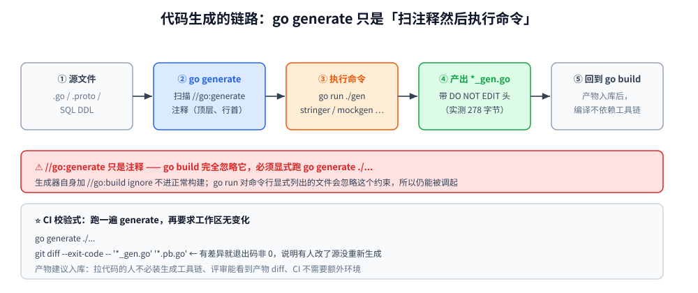

# 代码生成与资源嵌入

> 本篇覆盖 Go 的**"自动生成代码"与"把资源编进二进制"**两条线：
> `go:generate` 的约定与四类常见生成器、用 **`go/ast` + `go/parser` + `go/format`** 手写生成器（实测跑通一个枚举 → `String()` 生成器）、
> **`//go:embed` 的三种形态与路径约束**、生成代码的**提交策略与 CI 校验**。
> ⭐ 与 [泛型.md](../类型与语法/泛型.md) 是对照关系：那篇讲"编译期复用"，本篇讲"编译前生成"与"把外部资源变成代码的一部分"。
>
> 内容整理自个人学习笔记，实测为容器 `golang:1.26-alpine`（go1.26.8 linux/amd64），素材见 [素材清单.md](../../../素材清单.md)。

---

## 一、Go 没有"宏"，但有三条自动生成代码的路

**本节要点**：Go 刻意不做宏、不做注解处理器。它给的是三个"外部工具"级别的口子 ——
判据是**"这份代码该在什么时候被确定"**。

### 1.1 三条路与判据

| 路线 | 什么时候确定 | 典型产物 | 判据 |
|---|---|---|---|
| **泛型** | **编译期实例化** | 通用容器 / 算法 | 逻辑相同、只是类型不同（见 [泛型.md](../类型与语法/泛型.md)） |
| **代码生成** | **编译前（生成时）** | `stringer`、`mockgen`、`wire`、`protoc-gen-go` | 需要"看起来像手写的"重复代码，或要从 `.proto`/SQL 表结构产出 |
| **反射** | **运行时** | `encoding/json`、ORM、配置绑定 | 写代码时不知道类型（见 [反射与unsafe.md](../运行时/反射与unsafe.md)） |

⭐ 一句话判据：

```text
能用泛型 → 泛型（最轻）
需要"每个类型一份手写般的代码"或"从 schema 产出" → 代码生成
写代码时连类型都不知道 → 反射
```

⚠️ 代码生成的三个真实成本，决定它值不值：

1. **多一个构建步骤**（忘记跑 generate 就会用旧产物）；
2. **产物要不要入库**（见第五节，这是个有争议但必须明确的决定）；
3. **生成器本身也是代码**（要维护、要测）。

### 1.2 为什么需要它

三类最常见的触发场景：

- **消除"结构化重复"**：枚举的 `String()` / `MarshalJSON`、错误码表、常量 ↔ 字符串的双向映射；
- **从 schema 产出类型**：`.proto` → `*.pb.go`、SQL DDL → model、OpenAPI → client；
- **替手写 mock**：接口 → 桩实现（`mockgen`）。



---

## 二、`go:generate`：一个约定，不是编译器指令

**本节要点**：`//go:generate` **只是注释** —— 编译器完全忽略它，
只有你手动跑 `go generate ./...` 时它才生效。这是它最容易被误解的地方。

### 2.1 写法与执行

```go
//go:generate go run ./gen -type Status
//go:generate stringer -type=Status
package demo
```

```bash
go generate ./...        # 扫整个模块
go generate ./demo       # 只扫一个包
go generate -n ./...     # ⭐ 只打印要执行的命令，不真的跑（先看看再动手）
```

执行时 `go generate` 会为每条指令提供几个环境变量：

| 变量 | 含义 |
|---|---|
| `$GOFILE` | 当前文件名 |
| `$GOLINE` | 该条 `//go:generate` 所在行号 |
| `$GOPACKAGE` | 当前包名 |
| `$GOARCH` / `$GOOS` | 目标平台 |

### 2.2 四条约定

1. **注释必须在顶层**（写在函数体里不会被扫到）；
2. **`go:generate` 与目标之间必须有一个空格**，且它必须是**行首注释**（行尾的不算）；
3. **顺序 = 文件里的出现顺序**，包内多文件按文件名字典序；
4. **⚠️ 它不会自动跑** —— 提交前、CI 里都得显式调用（见第五节）。

### 2.3 四类常见生成器

| 生成器 | 产出 | 备注 |
|---|---|---|
| `stringer`（`golang.org/x/tools`） | 枚举的 `String()` | ⭐ 本篇实测手写了一个等价的最小实现 |
| `mockgen`（`go.uber.org/mock`） | 接口的 mock | 两种模式：reflect（运行时）/ source（静态） |
| `protoc-gen-go` | `.pb.go` | 由 `protoc` 驱动（⚠️ 无 protoc 的替代方案见 [不使用protoc的gRPC.md](../网络编程/不使用protoc的gRPC.md)） |
| `wire`（`google/wire`） | 依赖注入的装配代码 | 见 [依赖注入.md](依赖注入.md) |

⭐ 生成器的组织惯例：用 `//go:build ignore` 把它排除出正常构建，
这样它不会被 `go build ./...` 当成包的一部分：

```go
//go:build ignore

package main
// ... 生成器实现 ...
```

---

## 三、手写生成器：AST 三件套

**本节要点**：`text/template` 能生成代码，但它"看不见"你的源码结构。
**要按源码结构生成，就得用 `go/ast`**。

### 3.1 三件套的分工

| 包 | 干什么 |
|---|---|
| `go/parser` | 把 `.go` 源文件解析成 AST |
| `go/ast` | AST 的节点类型与遍历（`ast.Inspect`） |
| `go/format` | 把拼出来的字符串**格式化成标准 Go 代码**（`format.Source`） |

⭐ `go/format` 是这套里最省事的一件：**你只管把代码拼对，排版交给它** ——
它等价于 `gofmt`，所以生成出来的产物天然符合格式。

### 3.2 实测：一个能跑通的枚举生成器

输入（`demo/input.go`）：

```go
package demo

type Status int

const (
	StatusPending Status = iota
	StatusRunning
	StatusDone
	StatusFailed
)
```

生成器（① parser ② `ast.Inspect` ③ 拼串 ④ `format.Source` ⑤ 写盘）的实测输出：

```text
② ast.Inspect 找到 4 个常量：[StatusPending StatusRunning StatusDone StatusFailed]

③ format.Source 之后的输出（可直接写盘）：
------------------------------------------
// Code generated by gen. DO NOT EDIT.

package demo

func (s Status) String() string {
	switch s {
	case StatusPending:
		return "Pending"
	case StatusRunning:
		return "Running"
	case StatusDone:
		return "Done"
	case StatusFailed:
		return "Failed"
	}
	return "unknown"
}
------------------------------------------
生成 275 字节
④ 已写入 ../demo/status_gen.go
```

⭐ **生成出来立刻能用** —— 这是生成式方案最实在的验证：

```text
  go build ./demo  → 通过（生成的代码是合法 Go）
Pending Running Done Failed
值 = 2，String() = "Done"
未知值 = "unknown"
```

⚠️ 三条实操要点：

1. **`ast.Inspect` 是深度优先遍历**，返回 `true` 继续、`false` 剪枝；
   判断节点类型用类型断言（`n.(*ast.ValueSpec)`）。
2. **`iota` 的值要小心**：本例只取了常量**名字**，没取值。
   要取值得解析 `vs.Values`，而 `iota` 的表达式需要自己求值 —— 这是手写生成器最容易出错的地方。
3. **`// Code generated ... DO NOT EDIT.` 这一行不是装饰** ——
   很多 linter 与代码评审工具靠它识别生成文件并跳过检查。

### 3.3 与 `text/template` 的取舍

| | `go/ast` | `text/template` |
|---|---|---|
| **能不能"看见"源码** | ✅ 能（这就是它的用途） | ❌ 不能（你得自己喂数据） |
| **适合** | 按已有 Go 结构产出 | 按**外部 schema**（proto / SQL / yaml）产出 |
| **复杂度** | 要理解 AST 节点类型 | 模板语法简单 |
| **出错表现** | 遍历逻辑写错 → 漏生成 | 模板拼错 → 生成非法代码 |

⭐ 判据：**输入是 Go 源码 → 用 `go/ast`；输入是别的 schema → 用 `text/template`**。

---

## 四、`//go:embed`：把文件编进二进制

**本节要点**：`embed` 解决的是"部署时要不要把一堆静态文件跟着二进制一起发" ——
用了它，**一个二进制就是全部**，不需要挂载目录、也不怕路径写错。

### 4.1 三种形态

```go
import "embed"

//go:embed version.txt
var version string          // 形态一：string

//go:embed version.txt
var versionBytes []byte     // 形态二：[]byte

//go:embed assets
var assets embed.FS         // 形态三：embed.FS（只读文件系统）
```

实测：

```text
=========== 形态一：string ===========
  version = "v1.2.3\n"  长度 = 7

=========== 形态二：[]byte ===========
  长度 = 7  首字节 = "v"

=========== 形态三：embed.FS（目录树） ===========
  assets/ 下有 2 项：[a.txt(6 B) b.txt(5 B)]
  ReadFile("assets/a.txt") = "alpha\n"
  ReadFile("assets/b.txt") = "beta\n"
```

⭐ 四条从读数里直接读出来的结论：

1. **`string` 形态原样保留内容，含末尾换行**（`"v1.2.3\n"`）—— **不做 trim**，
   所以版本号这类场景通常要自己 `strings.TrimSpace`；
2. **`[]byte` 形态适合二进制**（模板、图片、SQL 迁移脚本）；
3. **`embed.FS` 是只读的 `io/fs` 实现**，可以直接喂给 `http.FileServer` / `template.ParseFS`；
4. **用 `embed.FS` 时必须 `import "embed"`**（不是 `_`，因为用到了 `embed.FS` 类型）；
   只用 string / []byte 形态时写 `import _ "embed"` 即可。

### 4.2 路径约束与错误原文

实测两条违规：

```text
bad1/main.go:6:12: pattern ../outside.txt: invalid pattern syntax
bad2/main.go:6:12: pattern no-such-file.txt: no matching files found
```

⚠️ `embed` 的**四条硬约束**：

1. **不能逃出当前目录**（禁止 `..`）；
2. **不能是绝对路径**（不能以 `/` 开头）；
3. **每个 pattern 必须至少命中一个文件**（目录要非空）；
4. **`//go:embed` 必须紧邻它修饰的变量**（中间不能有空行），且变量必须是**包级**的。

⭐ 另外两条实际会遇到的：

- **空目录会被拒绝**（可以放一个 `.gitkeep`，但要确认它也被 embed 进去；
  或者干脆把目录改成显式列出文件）；
- **`embed.FS` 里的路径不含前导 `./`**，读的时候写 `assets/a.txt` 而不是 `./assets/a.txt`。

![//go:embed 的三种形态（string / []byte / embed.FS）各自声明方式与实测读数，以及四条路径约束与对应的错误原文](images/embed三形态与路径约束.svg)

### 4.3 与"读外部文件"的取舍

| | `embed` | 运行时读文件 |
|---|---|---|
| **部署** | 一个二进制搞定 | 要挂目录 / 要保证路径存在 |
| **改配置要不要重编** | ⚠️ **要** | 不用 |
| **体积** | 二进制变大 | 不变 |
| **适合** | 模板、迁移脚本、前端静态资源 | 需要运维热改的配置 |

⭐ 判据：**"改了它要不要重新发版"** —— 要的话用 embed，不要的话走配置文件
（本仓的 [配置热重载与快照.md](配置热重载与快照.md) 就是后一种）。

---

## 五、生成代码的提交策略与 CI 校验

**本节要点**：这是代码生成里**唯一有争议、必须团队明确**的问题。

### 5.1 产物要不要入库？

⭐ **本仓建议：入库。** 三条理由：

1. **`go build` 不依赖生成工具链** —— 拉代码的人不需要装 `protoc` / `mockgen` 就能编译；
2. **code review 能看到产物变化** —— 改了接口，mock 跟着变，diff 里一览无余；
3. **CI 不需要额外的环境准备**。

⚠️ 不入库的代价：构建前必须先跑一遍 generate，而 generate 本身依赖工具版本 ——
工具版本漂移会导致"同一份代码、两个人生成出不同产物"。

### 5.2 CI 怎么保证产物是最新的

```yaml
# CI 里加一步：跑一遍 generate，然后要求工作区没有变化
- run: go generate ./...
- run: git diff --exit-code -- '*_gen.go' '*.pb.go'
#      ↑ 有差异就退出码非 0，说明有人改了源但没重新生成
```

⭐ 判据：**"`go generate` 之后再 `git diff --exit-code`"** 是这套流程的标准校验式。

### 5.3 命名与头注释

| 约定 | 为什么 |
|---|---|
| 文件名以 `_gen.go` 结尾 | 一眼看出是产物 |
| 首行 `// Code generated by <tool>. DO NOT EDIT.` | linter / 评审工具靠它跳过检查 |
| 产物与源文件**同目录同包** | 避免引入新包只为放产物 |

---

## 六、踩坑清单

**本节要点**：这些坑的共同点是"看起来省事了，实际埋了雷"。

| # | 坑 | 后果 | 正确做法 |
|---|---|---|---|
| 1 | 以为 `//go:generate` 会自动跑 | 产物是旧的，但编译通过 | 提交前 / CI 里显式跑（5.2） |
| 2 | 生成的文件没有 `DO NOT EDIT.` 头 | 被人手工改动，下次生成被覆盖 | 头注释是约定，不是装饰（3.2） |
| 3 | `//go:embed` 与变量之间有空行 | **静默失效**（不会报错，变量是空的） | 必须紧邻 |
| 4 | embed 了目录但目录里没文件 | `no matching files found` | 保证非空 |
| 5 | 用 `string` 形态直接当版本号 | 末尾带着换行 | `strings.TrimSpace`（4.1 实测） |
| 6 | 生成器放在正常构建里 | `go build ./...` 把生成器也编进去 | 加 `//go:build ignore`（2.3） |

⭐ 第 3 条最隐蔽：**`embed` 失效不会报错，变量只是空的**，
症状是"功能突然没内容了"，而构建一路绿灯。

---

## 使用：一份可抄的生成器骨架

**本节要点**：把 3.1 的三件套收成一个能直接改的模板。

```go
//go:build ignore

// 用法：//go:generate go run gen.go -type Status
package main

import (
	"bytes"
	"flag"
	"go/ast"
	"go/format"
	"go/parser"
	"go/token"
	"log"
	"os"
	"strings"
)

func main() {
	typeName := flag.String("type", "", "要处理的类型名")
	out := flag.String("out", "", "输出文件（默认 <type>_gen.go）")
	flag.Parse()

	// ① parser：解析当前目录
	fset := token.NewFileSet()
	pkgs, err := parser.ParseDir(fset, ".", nil, parser.AllErrors)
	if err != nil {
		log.Fatal(err)
	}

	// ② ast.Inspect：收集该类型的常量名
	var pkgName string
	var names []string
	for name, pkg := range pkgs {
		pkgName = name
		for _, f := range pkg.Files {
			ast.Inspect(f, func(n ast.Node) bool {
				vs, ok := n.(*ast.ValueSpec)
				if !ok {
					return true
				}
				for _, id := range vs.Names {
					if strings.HasPrefix(id.Name, *typeName) && id.Name != *typeName {
						names = append(names, id.Name)
					}
				}
				return true
			})
		}
	}
	if len(names) == 0 {
		log.Fatalf("没有找到 %s* 常量", *typeName)
	}

	// ③ 拼字符串
	var b bytes.Buffer
	b.WriteString("// Code generated by gen.go. DO NOT EDIT.\n\n")
	b.WriteString("package " + pkgName + "\n\n")
	b.WriteString("func (s " + *typeName + ") String() string {\n\tswitch s {\n")
	for _, n := range names {
		b.WriteString("\tcase " + n + ":\n\t\treturn " + strconvQuote(strings.TrimPrefix(n, *typeName)) + "\n")
	}
	b.WriteString("\t}\n\treturn \"unknown\"\n}\n")

	// ④ format.Source：把拼出来的东西格式化成标准 Go
	src, err := format.Source(b.Bytes())
	if err != nil {
		log.Fatalf("生成的代码不合法：%v\n---\n%s", err, b.String())
	}

	// ⑤ 写盘
	dst := *out
	if dst == "" {
		dst = strings.ToLower(*typeName) + "_gen.go"
	}
	if err := os.WriteFile(dst, src, 0o644); err != nil {
		log.Fatal(err)
	}
	log.Printf("已生成 %s（%d 字节，%d 个常量）", dst, len(src), len(names))
}

func strconvQuote(s string) string { return "\"" + s + "\"" }
```

⭐ **上面这份骨架是实测跑过的**（容器 go1.26.8，在 `demo/` 下执行 `go run ../skel/gen.go -type Status`）：

```text
2026/10/08 15:49:57 已生成 status_gen.go（278 字节，4 个常量）
```

生成之后 `go run ./demo_check` 输出 `Pending Running Done Failed`，`String()` 正常生效。

⚠️ 两个要点：

1. 日志里的**时间戳每次不同**，稳定的是「278 字节、4 个常量」；
2. **`//go:build ignore` 不会让 `go run` 拒绝它** —— `go run` 对命令行上**显式列出**的文件会忽略这个约束，
   这正是「生成器不进正常构建、但能被 `go generate` 调起」的惯例做法。

**五条可以固化进团队规范的**：

1. **产物入库 + CI 校验**（`go generate` 后 `git diff --exit-code`，第五节）；
2. **生成文件必须有 `DO NOT EDIT.` 头注释**；
3. **生成器加 `//go:build ignore`**，不进正常构建；
4. **输入是 Go 源码 → `go/ast`；输入是别的 schema → `text/template`**（3.3）；
5. **`embed` 紧邻变量写**，且 `string` 形态记得 `TrimSpace`（4.1 / 4.2）。

---

## 延伸追问

- **`//go:generate` 是编译器指令吗？** → **不是**，它只是一行注释。
  `go build` 完全忽略它，只有你跑 `go generate` 时才被执行（第二节）。
- **为什么生成的代码要用 `format.Source`？** → 你只负责把代码拼**正确**，排版交给它
  （它等价于 `gofmt`）。实测生成 275 字节的合法 Go 并直接编译通过（3.2）。
- **`go/ast` 和 `text/template` 选哪个？** → 输入是 **Go 源码**用 `go/ast`（它能"看见"结构）；
  输入是 **proto / SQL / yaml** 用 `text/template`（3.3）。
- **`//go:embed` 的路径能用 `..` 吗？** → 不能，实测 `pattern ../outside.txt: invalid pattern syntax`；
  也不能是绝对路径，且每个 pattern 必须至少命中一个文件（4.2）。
- **为什么 embed 进来的版本号后面有换行？** → `string` 形态**原样保留文件字节**，
  不做 trim（实测 `"v1.2.3\n"`，长度 7）。用之前自己 `TrimSpace`（4.1）。
- **生成的代码要不要提交到 git？** → 本仓建议**要**。理由是拉代码的人不必装生成工具链、
  评审能看到产物 diff、CI 不需要额外环境（5.1）。
- **怎么保证产物没过期？** → CI 里跑一遍 `go generate ./...` 再 `git diff --exit-code`（5.2）。
- **`embed` 与配置文件热重载怎么选？** → **"改了要不要重新发版"**：要 → embed；不要 → 配置文件
  （后者的完整机制见 [配置热重载与快照.md](配置热重载与快照.md)）。

## 关联

- [泛型.md](../类型与语法/泛型.md) — **对照篇**：泛型 vs 反射 vs 代码生成三条复用路线的判据（该篇 3.3 节）
- [反射与unsafe.md](../运行时/反射与unsafe.md) — 运行时那条路：三条反射法则、`CanSet`、反射为什么慢
- [依赖注入.md](依赖注入.md) — `wire` 这类"生成装配代码"方案的取舍
- [不使用protoc的gRPC.md](../网络编程/不使用protoc的gRPC.md) — 没有 `protoc` 时怎么绕开"必须生成"
- [配置热重载与快照.md](配置热重载与快照.md) — **embed 的反面**：需要热改的配置走这条
- [项目结构.md](项目结构.md) — 生成文件放哪、包怎么切
- [测试与Mock.md](测试与Mock.md) — `mockgen` 与"手写 mock"的取舍
- [编译与gcflags.md](编译与gcflags.md) — 生成 / embed 之后的编译环节
- [README.md](../README.md) — 本目录导读
- [素材清单.md](../../../素材清单.md) — 素材来源登记
