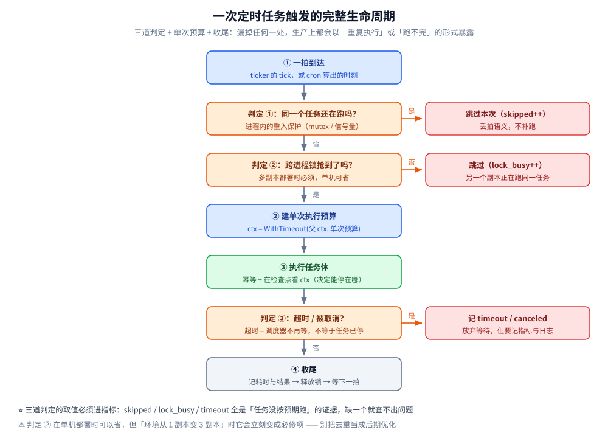
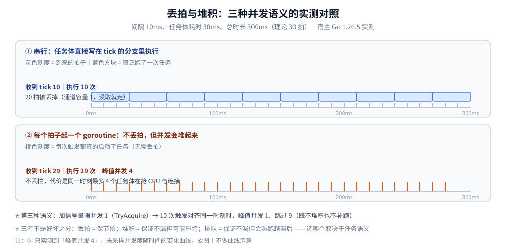
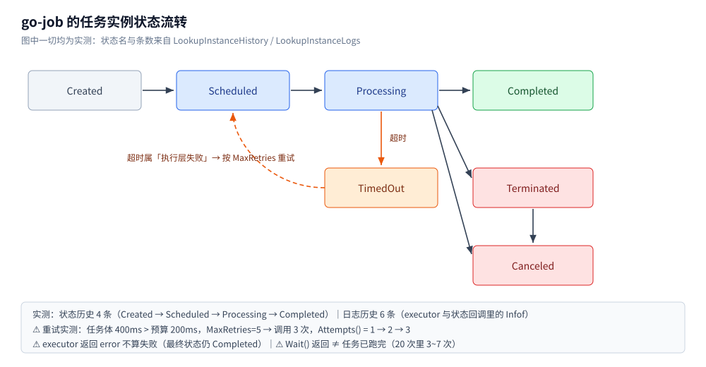

# Go 定时任务

> Go 进程内定时任务：五种写法的取舍、六个**必须先回答的语义问题**
> （丢拍 / 漂移 / 漏跑 / 重入 / 取消 / 多副本重复），以及一个可以直接抄的调度骨架；
> 最后回答「什么时候不该自己写，而该上调度平台」。
>
> ⭐ 边界先说清：本篇讲**进程内怎么实现**（Go 语言侧）。
> 中心化调度平台（任务分片 / 失败重试 / Web 管理 / 执行器注册）见
> [xxl-job.md](../../../03-数据与中间件/中间件/任务调度/xxl-job.md)；
> 定时任务的**链路埋点**（无上游请求时要自建根 span）见 [接入Jaeger.md](../接入Jaeger.md) 第 7.2 节；
> `context` 本身（超时预算怎么传）见 [context.md](context.md)；
> 跨进程互斥的组件侧细节（`SET NX`、释放锁的竞态）见 [分布式锁.md](../../../03-数据与中间件/数据存储/NoSQL/Redis/分布式锁.md)。
>
> 内容整理自个人学习笔记；素材见 [素材清单](../../../素材清单.md)。
>
> 📎 **实测口径**：宿主 **Go 1.26.5（windows/amd64）**，五个程序 —— 前三个**零第三方依赖**
> （`exp_job_det.go` 只打印计数与判定 / `exp_job_time.go` 计时与竞态 / `exp_job_lock.go` 8 个真实子进程）；
> 第九节另有两个**引第三方库**的（`lib-lab/gocron`：`netresearch/go-cron` **v0.16.1**；
> `lib-lab/gojob`：`cybergarage/go-job` **v1.2.3**，均由 `go mod` 实读）。
> ⚠️ 本机 **Docker Desktop 未运行，未跑容器版**（`golang:1.26-alpine` 版待补）——
> 计时项跨平台有差异，本篇读数只用于**量级判断**。
> **只打印计数与判定的项：连跑两遍逐行相同**；**含计时的项：5 轮中位数 + 区间**；
> 竞态类项（取消时机、陈旧锁接管、库的等待时机）报**分布**而不是单值。

---

## 一、Go 里有哪些实现定时任务的写法？

**本节要点**：先把五种写法与它们的**失效形态**对上号 —— 选错写法的代价不是「慢」，而是「重复执行」或「永远跑不完」。

| 写法 | 关键代码 | 节拍性质 | 典型失效形态 |
|---|---|---|---|
| `time.Sleep` 死循环 | `for { do(); time.Sleep(d) }` | 间隔 = d + 任务耗时 | **漂移累积**；无法响应退出 |
| `time.After` 链 | `<-time.After(d)` 放循环里 | 每次重新计时，同样累积 | 同上；且每次分配一个 Timer |
| **`time.Ticker`** | `for range tk.C` | **固定墙钟节拍**（任务慢不改节拍） | 任务比间隔慢时**丢拍**（通道容量 1） |
| `cron` 库 | `c.AddFunc("*/5 * * * *", f)` | 按**日历表达式**触发 | 默认每次触发起新 goroutine → **任务重叠** |
| 调度平台（xxl-job 等） | 执行器注册 handler | 中心化调度 | 引入外部依赖与运维面 |

⭐ **判据**：只需「隔一段时间跑一次」→ `Ticker`；要「每天 02:00」这种**墙钟语义** → cron 表达式；要「失败重试 / 分片 / 可视化」→ 调度平台。

**一次触发要过几道关**，是后面四节的展开地图：



> ⚠️ 上图的「判定①②③」不是可选项：判定①漏了会**重入**，判定②漏了会**多副本重复执行**，
> 判定③漏了会**长任务把整个调度循环拖住**。三者都不在 `Ticker` 里，得自己写。

---

## 二、任务比间隔还慢时，到底该丢拍还是该排队？

**本节要点**：这是写定时任务第一个要拍定的事。实测会告诉你：**丢拍和堆积其实是同一枚硬币的两面**。



### 2.1 实测：串行丢拍 vs 起 goroutine 堆积

间隔 `10ms`、任务体耗时 `30ms`、总时长 `300ms`（理论 30 拍）：

| 写法 | 收到的 tick | 实际执行 | 峰值并发 |
|---|---|---|---|
| 任务直接写在 `tick` 的分支里（串行） | **10** | **10** | 1 |
| 每个 tick 起一个 goroutine | **29** | **29**（不丢拍） | **4** |

⭐ 两个数字都很说明问题：

- 串行写法下，**30 拍只跑了 10 次** —— 通道容量是 1，任务在跑的时候到来的 tick 没人取，直接作废（丢 20 拍）。
- 起 goroutine 的写法**一次不丢**，但代价是同一时刻最多 **4 个**任务体在抢 CPU / 连接（峰值并发；只测到峰值，未采样并发随时间的变化曲线）。

### 2.2 三种语义与选择轴

| 语义 | 实现 | 保证 | 代价 |
|---|---|---|---|
| **丢拍** | 信号量 `TryAcquire`（容量 1） | 节拍稳定 | 必然漏执行（10 次触发对齐同一时刻 → 峰值并发 **1**、**跳过 9**） |
| **堆积** | 每次触发无脑起 goroutine | 不漏 | 并发涨到不可控（实测峰值 4，任务更慢会继续涨） |
| **排队** | 阻塞获取信号量 / 加队列 | 不漏、并发可控 | 任务越跑越滞后，队列会无限增长 |

⭐ **选择轴只有一个问题**：**这个任务「漏跑一次」和「并发跑两次」哪个更不可接受？**

- 指标聚合、缓存预热 → 丢拍可以接受（下一次马上就来）；
- 订单超时关闭、账单落库 → 不能漏，也不能重入 —— 用**排队 + 幂等**；
- 任何情况下都不要选「无脑起 goroutine」：它把「并发度」交给上游流量决定，是最容易出事的一种。

---

## 三、定时间隔为什么会漂移？

**本节要点**：`Ticker` 对齐的是**墙钟**；「任务跑完再等一会儿」对齐的是**任务自己** —— 差一轮就累积一轮。

### 3.1 实测对照

跑 20 轮，间隔 `50ms`、任务体 `20ms`：

| 写法 | 20 轮总耗时（5 轮中位 / 区间） |
|---|---|
| `Ticker`：固定节拍，任务耗时**不改变**节拍 | **1020 ms**（1020~1021） |
| 任务结束后再等一个间隔（等价于 `Sleep(interval + cost)`） | **1412 ms**（1410~1414） |

⭐ **约 1.4 倍**，而且**轮数越多差距越大** —— 这就是漂移的实质：第二种写法每轮多欠 `20ms`。
1.4 倍不算惊天动地，但换算到「每小时跑一次」的场景，就是**第 20 次触发比预期晚 6 分钟**。

### 3.2 哪些场景必须对齐墙钟

- **对账 / 报表**：晚 6 分钟没影响，但**跨天/跨月**会串账期；
- **窗口计算**：`[今天 00:00, 明天 00:00)` 这类边界，必须落在真实时刻上；
- **对外可预期**：运维按「每天 2 点」排班排查，你 2:20 才跑，问起来就很难解释。

> 判据：**需求里出现「每天 / 每小时整点」→ 用 cron 表达式或 `Ticker` 对齐墙钟**；
> 只说「隔 N 分钟」→ `Ticker` 就够。`Sleep` 累积式写法只在「任务极其轻、对时刻无要求」时可用。

---

## 四、cron 表达式是怎么算出下一次触发的？

**本节要点**：cron 库的行为差异大多来自**字段语义**（尤其是「日」和「周」同时出现时）与**时区**，不是 API。

### 4.1 五个字段与 dom/dow 的「或」规则

```text
┌──────── 分钟 0-59
│ ┌────── 小时 0-23
│ │ ┌──── 日   1-31
│ │ │ ┌── 月   1-12
│ │ │ │ ┌ 周   0-6（0 = 周日）
* * * * *
```

⚠️ **最容易踩的一条**：**「日」和「周」都受限时，两者是「或」而不是「与」**（Vixie cron 传统语义）——
`0 0 1 * 1` 表示「每月 1 号**或**每周一」，不是「每月 1 号且是周一」。想要「且」，得在两个字段里二选一表达。

> ⭐ **但库之间的口径并不统一**：实测 `robfig/cron` 沿用上面的 **OR**，而它的活跃 fork
> **`netresearch/go-cron` 改成了 AND** —— 同一个 `0 0 1 * 1`，两者给出的下一次触发相差**数月**。
> 换库/迁移前务必确认这一条，它是整套配置语义里最容易被咬到的地方（实测见第九节 ①）。

### 4.2 实测：下次触发时刻（自写解析器，基准 `2026-10-07 12:03:17`，周三）

| 表达式 | 下次触发 | 距基准 | 该日触发次数 |
|---|---|---|---|
| `* * * * *` | 2026-10-07 12:04:00 | +43s | **1440** |
| `*/5 * * * *` | 2026-10-07 12:05:00 | +1m43s | **288** |
| `0 2 * * *` | 2026-10-08 02:00:00 | +13h56m43s | 1（次日） |
| `30 1 * * 1` | 2026-10-12 01:30:00 | +109h26m43s | 0（当天是周三） |
| `0 0 1 * *` | 2026-11-01 00:00:00 | +587h56m43s | 0（跨月） |
| `0,15,30,45 9-18 * * 1-5` | 2026-10-07 12:15:00 | +11m43s | **40** |

⭐ 顺带一个算术校验：`*/5` 一天 **288** 次（1440/5）、工作日 9–18 点每刻钟 **40** 次（10 小时 × 4）——
**这两个数是可以手算验证的**，写定时任务时用它们核对「配置有没有生效」比看日志快。

### 4.3 选库 / 用库时看哪几点

| 关注点 | 说明 |
|---|---|
| **段数** | 5 段（分 时 日 月 周）是传统写法；6 段（多一个「秒」）通常是库的扩展，**别把两种混用** |
| **时区** | 容器默认 UTC｜`0 2 * * *` 在 UTC 容器里是北京时间 **10 点**，必须显式指定时区（`CRON_TZ=` 或库的 location 选项） |
| **并发语义** | 多数库**默认每次触发起新 goroutine**，任务慢就会重叠 —— ⭐ **重入保护是本篇第二节那套，库不管** |
| **漏跑语义** | 进程停了一天再起来，是补一次、全补、还是只跑当前？见下节 |

> ⚠️ 上面是**通用关注点**，具体库的段数、descriptor（`@daily`、`@every 5m`）与时区选项
> **以该库文档为准**；本篇未实测第三方 cron 库，只实测了自写的 5 字段解析器。

---

## 五、漏跑了怎么办？

**本节要点**：进程被重启、机器休眠、发布导致错过触发 —— 这不是异常，是**常态**。你需要先拍定策略，再选库/写代码。

### 5.1 三种策略的实测计数

场景：本应触发 **11 拍**（t0~t10），但进程直到 t10 才醒过来。

| 策略 | 醒来后共执行 | 适用 |
|---|---|---|
| **skip**（只跑当前这一拍） | **1 次** | 指标采集、缓存刷新：错过的那几次没有意义 |
| **catch-up once**（补跑一次，再跑当前） | **2 次** | 对账：中间态可以合并，但至少要跑过一次 |
| **burst**（缺几拍就补几拍） | **11 次** | 极少适用：会瞬间打满下游，通常只在「有严格连续性要求」时用 |

⭐ **不是「越全越好」**：burst 在「进程停了一天、任务又是全表扫描」时等于自杀。

### 5.2 拍定策略的三个问题

1. **任务幂等吗**？不幂等就先别谈补跑 —— 补跑 = 重复写。
2. **漏掉的那几次有意义吗**？指标是「末值有用」，账务是「每一笔都要」。
3. **补跑会不会打死下游**？如果会，就限速补跑或干脆 skip + 告警人工处理。

> ⭐ 无论选哪种，**「跳过了几次」必须进指标与日志**：漏跑静默发生，是定时任务最经典的线上事故形态。

---

## 六、取消粒度决定了「会不会留半成品」

**本节要点**：`ctx.Done()` 收到之后停在哪，取决于**你在哪里检查它** —— 这件事在退出发布时天天发生。

### 6.1 三种取消点的模型推演（取消在「第 3 条处理完」送达）

| 检查点 | 最终已处理 |
|---|---|
| 每条之间检查 `ctx.Err()` | **3** 条 |
| 只在批边界检查（每批 5 条） | **5** 条 |
| 从不检查（只在退出时等） | **10** 条（全部跑完） |

### 6.2 真实竞态：停在第 3 条还是第 4 条？

上面的 3 是**理想值**。真实运行时，取消送达时任务正卡在第 4 条的处理里，于是 200 轮实测：

| 停在哪 | 轮数 |
|---|---|
| 第 4 条 | **199 / 200** |
| 第 3 条 | 1 / 200 |

⭐ **结论**：取消点决定「允许停在哪」，**实际停在哪儿由到达时刻决定** —— 所以
**任务必须幂等或可重入**（重跑一次不会写坏数据），不能用「反正会停在第 N 条」去做对账设计。

### 6.3 优雅退出模板（顺序不能变）

```go
ctx, stop := signal.NotifyContext(context.Background(), os.Interrupt, syscall.SIGTERM)
defer stop()

// ① 收到信号 → ctx 取消 → 各任务循环退出（不再接新触发）
// ② WaitGroup 等在飞的任务收尾（给一个兜底超时，避免进程卡住不退出）
// ③ 关闭连接池 / 上报最后一批指标
cancelAt := time.AfterFunc(30*time.Second, func() { os.Exit(1) })
_ = cancelAt
```

⚠️ 三个常见错法：

- **直接 `os.Exit`**：在飞的任务被硬切，可能留下写了一半的数据；
- **只 cancel 不等待**：调度循环退了，任务体还在跑，连接池已被关 → 报一堆假错；
- **无限等**：任务卡住，进程永远不退出，发布卡在滚动更新。

> 无上游请求的任务**不会自动产生 trace** —— 要在任务入口手动创建根 span，见 [接入Jaeger.md](../接入Jaeger.md) 第 7.2 节。

---

## 七、多副本部署下，任务会重复执行几次？

**本节要点**：这是唯一一个**「代码完全正确、部署就出错」**的问题：单机跑得好好的任务，扩到 3 副本后每次都执行 3 次。

### 7.1 实测：8 个独立进程同时触发

用 `os.Mkdir` 做跨进程锁（目录创建是原子操作），8 个真实子进程同一时刻触发：

| 场景 | 执行任务的进程 | 跳过 |
|---|---|---|
| 无锁 | **8**（同一份数据被写了 8 次） | 0 |
| 目录锁（抢不到就跳过本次） | **1**（持锁 1） | **7** |

⭐ **进程内 mutex 完全解决不了这个问题** —— 它只能挡住同一个进程里的并发，挡不住另外 7 个进程。

### 7.2 跨进程去重的三种做法

| 做法 | 原理 | 失效形态（要提前想清楚） |
|---|---|---|
| **原子创建**（`os.Mkdir` / `O_CREATE\|O_EXCL` 文件） | 文件系统保证只有一个成功 | 进程崩溃后锁不释放 → 必须带**过期时间**，而清理过期锁本身又是一次竞争（见 7.3） |
| **Redis `SET NX` + 过期**（或带自动续期的实现） | 存储端原子 | 时钟漂移 / 续期失败 / 锁过期后被第二个副本接管 → 两个副本同时跑 |
| **数据库唯一键 / 抢行**（如 `INSERT ... ON CONFLICT DO NOTHING`，更新 `next_run_at`） | 数据库事务 | 增加库压力；要注意隔离级别与「抢到但任务失败」的回收 |

⭐ **无论哪种，任务都必须幂等** —— 锁只能把「必然重复」降成「极小概率重复」，不能降到 0。

### 7.3 ⚠️ 陈旧锁「删掉重建」会发生什么（实测）

模拟常见写法：8 个副本发现锁过期（或锁文件残留）→ 各自「先删掉、再重建」。
20 轮实测，每轮有几个人认为自己拿到了锁：

| 同时认为自己持锁 | 20 轮中出现的轮数（5 次实验的区间） |
|---|---|
| 1 人 | 12 ~ 19 轮 |
| **2 人** | 1 ~ 6 轮 |
| **3 人** | 0 ~ 2 轮 |

⭐ **「删了再建」把一次原子操作拆成了两次非原子操作** —— 别人刚建的锁会被你删掉，于是出现**多人同时持锁**。
正确做法是**原子替换 + 校验 owner**（`rename` 覆盖 / `SET` 带 value 校验 + Lua 释放），而不是 `RemoveAll` 后重建。
释放锁的竞态在 [分布式锁.md](../../../03-数据与中间件/数据存储/NoSQL/Redis/分布式锁.md) 里有同源实测。

---

## 八、任务没按预期跑，怎么发现？

**本节要点**：「任务跑了但不对」几乎不会自曝 —— 必须靠指标与日志把它变成可观测事实。

### 8.1 每一次判定都要有计数器

| 指标 | 说明 | 异常信号 |
|---|---|---|
| `job_runs_total{job,result}` | 执行次数，`result` = ok / failed / **timeout** | 某任务长时间没有增长 = 停了 |
| `job_duration_seconds` | 单次耗时**分位数** | P99 接近预算 = 快了 |
| `job_skipped_total{job,reason}` | `reason` = **still_running** / **lock_busy** | 持续上涨 = 丢拍或有副本在抢 |
| `job_last_success_timestamp` | 上次成功时刻 | ⭐ **最有用的一条告警**：超过 2 个周期没成功就报警 |
| 漏跑 / 补跑次数 | 对应第五节的三种策略 | burst 突然变大 = 下游会被打满 |

### 8.2 单次执行预算：调度器放手 ≠ 任务停止

实测：任务体需要 `100ms`，单次预算设 `20ms` → 按预算返回 **`DeadlineExceeded`**。

⚠️ 关键认知：**超时只让调度器不再等**。任务体如果自己不看 `ctx`，它会**继续跑到底** ——
于是「调度器已经放弃、任务还在写库」，下一个周期的任务又起来了，两者开始互相覆盖。
所以：**预算要传进任务体，任务体要在检查点看它**（第六节）。

---

## 九、换成现成库：go-cron 与 go-job 各实现一遍

**本节要点**：库不替你做决定，它只是把前八节的六个语义问题**换成一组默认值**。所以换库前要看清两件事 —— 这些问题的默认是什么，以及哪些问题它**压根不管**。

### 9.1 先确认是哪两个库（名字有坑）

| 本篇叫法 | 实际模块（实测版本） | ⚠️ 容易混淆的 |
|---|---|---|
| **go-cron** | [`github.com/netresearch/go-cron`](https://github.com/netresearch/go-cron) · **v0.16.1** | GitHub 上没有知名库正好叫 `go-cron`；包名是 `gocron` 的 `go-co-op/gocron/v2` 是**另一个库** |
| **go-job** | [`github.com/cybergarage/go-job`](https://github.com/cybergarage/go-job) · **v1.2.3** | 同名项目还有 `goliatone/go-job`（脚本式执行器，从 shell / JS / SQL 注释里抽调度配置），与本篇这个不是一回事 |

`netresearch/go-cron` 是 **`robfig/cron` 的活跃维护 fork**：上游自 v3.0.1（2020）后基本冻结，这个 fork 沿用它的 API（换 import 一行即可）并修了若干 bug，**要求 Go 1.25+**。

| 库 | 定位 | 调度模型 | 相对突出的是 |
|---|---|---|---|
| go-cron | **调度器** | cron 表达式 / `@every` / `@triggered` | 漏跑策略、per-entry context、运行时改期、工作流依赖 |
| go-job | **任务平台**（调度 + 队列 + 观测） | 立即 / 延迟 / 定点 / crontab | 优先级队列 + worker 池、状态与日志历史、可插拔 Store |

### 9.2 六个语义问题，两个库各给什么答案

| 本篇的问题 | go-cron 的答案 | go-job 的答案 |
|---|---|---|
| 丢拍还是堆积（§2） | `SkipIfStillRunning` / `DelayIfStillRunning` 包一层 | **无同义配置**；靠 worker 池 + 队列天然「排队」 |
| 定时间隔漂移（§3） | 与 `Ticker` 同为固定墙钟节拍，不漂 | 同左 |
| cron 解析（§4） | 5 段（可选秒）；⚠️ **dom/dow 是 AND**，与 robfig 的 OR 相反 | `WithCrontabSpec("0 2 * * *")` |
| 漏跑（§5） | `WithMissedPolicy`：Skip / RunOnce / RunAll，另有 `WithMissedGracePeriod` | **默认不补**，错过的就错过 |
| 取消粒度（§6） | per-entry context（`FuncJobWithContext`）；`Stop()` 返回 context 等收尾 | `WithTimeout` 到期置 `TimedOut`；`CancelInstances` 取消排队中的任务 |
| 多副本重复（§7） | 提供 `Locker` / `Elector` **扩展点**，实现要自己接 | 提供可插拔 `Store`，多节点协同要自己接 |
| 观测（§8） | `WithObservability` 钩子，自己转成指标 | **内建**状态历史 + 日志历史，可直接查 |

⭐ **一句话**：它们把「**怎么触发**」包得很好，但「**重入语义选哪种**」和「**多副本怎么互斥**」这两件最要命的事，仍然是你拍。


### 9.3 go-cron 实测

#### ① DOM/DOW：它和 robfig 给的答案不一样

同一批表达式、同一基准（2026-10-07 12:00 周三），各取接下来 4 次触发：

| 表达式 | go-cron（**AND**） | robfig（**OR**） |
|---|---|---|
| `0 0 1 * 1` | 2027-02-01、2027-03-01、2027-11-01、2028-05-01 | 2026-10-12、10-19、10-26、2026-11-01 |
| `0 0 25-31 * FRI` | 2026-10-30、11-27、12-25、2027-01-29 | 2026-10-09、10-16、10-23、**10-25** |
| `0 0 1-7 * MON` | 2026-11-02、12-07、2027-01-04、02-01 | 2026-10-12、10-19、10-26、2026-11-01 |
| `0 0 13 * FRI` | 2026-11-13、2027-08-13、2028-10-13、2029-04-13 | 2026-10-09、**10-13**、10-16、10-23 |

⭐ 两个最有用的读法：

- `0 0 25-31 * FRI` 在 go-cron 里是「**每月最后一个周五**」，在 robfig 里是「每周五 **或** 每月 25 号」；
- `0 0 13 * FRI` 在 go-cron 里是「**13 号且是周五**」（黑色星期五），在 robfig 里则每次都算。

⚠️ 这也**反过来限定**了本篇第四节的结论：那里写的 OR 是 **robfig / Vixie cron 口径**，不是「所有 cron 库都这样」。fork 的文档里把它列为**有意的行为变更**，迁移时要按 MIGRATION 文档逐条核。

#### ② 交叉验证：自写解析器的结果可信吗

用 go-cron 复算本篇第四节那张表（基准 `2026-10-07 12:03:17` 周三）：

| 表达式 | 下次触发（两者一致？） | 该日触发次数 · go-cron / 本篇自写 |
|---|---|---|
| `* * * * *` | 10-07 12:04:00 ✅ | **1439** / 1440 |
| `*/5 * * * *` | 12:05:00 ✅ | **287** / 288 |
| `0 2 * * *` | 10-08 02:00:00 ✅ | 1 / 1 ✅ |
| `30 1 * * 1` | 10-12 01:30:00 ✅ | 0 / 0 ✅ |
| `0 0 1 * *` | 11-01 00:00:00 ✅ | 0 / 0 ✅ |
| `0,15,30,45 9-18 * * 1-5` | 10-07 12:15:00 ✅ | 40 / 40 ✅ |

⭐ **「下次触发」6/6 完全一致；「该日次数」有 2 项差 1** —— 差的不是解析，是**区间的左端点含不含**：把统计窗口起点往前挪 1 秒（`10-06 23:59:59`）后，同样的调用给出 **1440 / 288**，两个口径立刻对齐。⭐ 这类「差 1」在日志里看起来像 bug，**先怀疑窗口边界，别怀疑解析器**。

#### ③ 漏跑：库把三种策略都实现了

场景：启动时声明「上次运行在 09:47」而此刻 10:00（每分钟任务，区间内应触发 **12** 次）：

| `WithMissedPolicy` | 实际执行次数 |
|---|---|
| `MissedSkip`（默认） | **0** |
| `MissedRunOnce` | **1** |
| `MissedRunAll` | **12**（另有安全上限 100 次） |

⭐ 正好对应本篇第五节的三种策略，且**默认是最保守的 Skip** —— 换库不会悄悄帮你补跑，这点比多数人的预期要好。

#### ④ 重入保护：库确实替你做了

间隔 1s、任务体 1200ms、观察 4s：

| 写法 | 4s 内执行 | 峰值并发 |
|---|---|---|
| 无保护 | **4** | **2** |
| `WithChain(SkipIfStillRunning(...))` | **2** | **1** |

（5 轮完全一致，两遍逐行相同。）②③④ 三项与本节前面 7 项**连跑两遍逐行相同**，属确定性读数。

#### 可直接抄的骨架

```go
c := cron.New(cron.WithChain(cron.SkipIfStillRunning(cron.DefaultLogger)))
_, err := c.AddFunc(
	"0 2 * * *", // 见第四节字段语义；⚠️ 本库 dom/dow 是 AND
	dailyReport,
	cron.WithName("daily-report"),
	cron.WithMissedPolicy(cron.MissedRunOnce), // 见第五节；默认 MissedSkip
	cron.WithMissedGracePeriod(2*time.Hour),   // 超过 2 小时的漏跑不再补
)
if err != nil {
	return err
}
c.Start()

// 运行时改期 / 暂停 / 手工触发（都在跑着就能调）
_ = c.UpdateJobByName("daily-report", "0 3 * * *")
_ = c.PauseEntryByName("daily-report")
_ = c.TriggerEntryByName("daily-report")

<-c.Stop().Done() // Stop 返回 context：等所有在飞任务收尾
```

⚠️ 它的 `Workflow`（DAG 依赖）、`CircuitBreaker`、`Jitter`、`DelayIfStillRunning` 本篇**只读 API 未实测**，用前请自己验一遍。

### 9.4 go-job 实测

#### ① 优先级队列：数值越小越优先

worker 数设 1（串行），一次性入队 **low(10) → high(0) → medium(5)**：

| 提交顺序 | 实际执行顺序（5 轮一致） |
|---|---|
| low → high → medium | **high → medium → low** |

⭐ 与 Unix `nice` 同向：`HighPriority = 0`、`MediumPriority = 5`、`LowPriority = 10`，**默认是 Medium**。

#### ② 重试的触发条件（这里有两个坑，都是实测踩出来的）

| 实验 | 配置 | 结果 |
|---|---|---|
| **B1** executor 返回 `("", error)` | `WithMaxRetries(3)` | 调用 **1** 次，最终状态 **Completed** |
| **B2** executor 第 1、2 次超时（任务体 400ms > 预算 200ms） | `WithMaxRetries(5)` | 调用 **3** 次（`Attempts()` = 1→2→3），最终 **Completed** |

⭐ B1 是反直觉的那个：**executor 返回的 `error` 不会让任务失败** —— 源码里 `Execute()` 把函数的**全部返回值（含 error）一起塞进结果集**，自己只在不满足反射调用时才报错。所以「业务失败」在这个库里**不能用返回 error 表达**；能触发重试的是**执行层失败**（超时、取消）。

⭐ 另一个坑更硬：**不给 `WithCompleteProcessor` 会 panic** —— 实测任务第一次成功完成时就崩在库内部（`worker.go` 调用了一个 nil 函数），而 `WithKind` / `WithExecutor` 都不报错。**注册任务时把完成处理器一并写上**。

#### ③ 内建观测：状态与日志是现成的

| 读法 | 实测结果（5 轮一致） |
|---|---|
| `LookupInstanceHistory(query)` | **4** 条：`Created → Scheduled → Processing → Completed` |
| `LookupInstanceLogs(query)` | **6** 条（executor 与状态回调里 `ji.Infof` 的记录） |



⚠️ 但它的 `Wait(ctx)` **不等于「等任务跑完」**：源码里 `Wait` 只在 worker「**正在处理**」时循环等待。实测调度后立刻 `Wait`，20 次里有 **3~7 次**返回时任务仍是排队/处理中（5 轮：7、4、4、3、3 次）。**要判定「跑完了」得自己轮询状态**，别把 `Wait` 当同步屏障用。

#### 可直接抄的骨架

```go
mgr, err := job.NewManager(job.WithNumWorkers(2))
if err != nil {
	return err
}
j, err := job.NewJob(
	job.WithKind("daily-report"),
	job.WithExecutor(func(ji job.Instance) string {
		ji.Infof("attempt=%d", ji.Attempts()) // 进实例日志历史
		return "ok"
	}),
	// ⚠️ 必须给：不设它，任务完成时库内部会调用 nil 函数 panic（实测）
	job.WithCompleteProcessor(func(ji job.Instance, res []any) {}),
	job.WithTimeout(30*time.Second), // 超时是「执行层失败」，会触发重试
	job.WithMaxRetries(2),
)
if err != nil {
	return err
}
if err := mgr.RegisterJob(j); err != nil {
	return err
}
if err := mgr.Start(); err != nil {
	return err
}

inst, err := mgr.ScheduleRegisteredJob("daily-report",
	job.WithCrontabSpec("0 2 * * *"),
	job.WithPriority(job.HighPriority), // 0 = 最高；数值越小越优先
)
if err != nil {
	return err
}

// 观测：按实例查状态历史与日志
hist, _ := mgr.LookupInstanceHistory(job.NewQuery(job.WithQueryInstance(inst)))
logs, _ := mgr.LookupInstanceLogs(job.NewQuery(job.WithQueryInstance(inst)))
_ = hist
_ = logs
defer mgr.Stop()
```

### 9.5 什么时候该换成库

| 判据 | 结论 |
|---|---|
| 任务数只有一两个、间隔固定、无墙钟要求 | **别引依赖** —— 第八节那 30 行骨架就够 |
| 要「每天 2 点」这类墙钟语义、且需要运行时改期 / 暂停 / 手工触发 | **go-cron** |
| 已经有 `robfig/cron` 资产、想原地拿护栏（重复执行、漏跑、超时） | **go-cron**（换 import + 逐条核行为差异） |
| 任务多、要优先级与并发度控制、要现成的执行历史可查 | **go-job** |
| 需要多副本互斥 | **两个库都只给扩展点** —— 仍要自己接 Locker / Store，见第七节 |

⭐ 最后一条最容易被忽略：**库能消灭的是「调度代码」，消灭不了「分布式任务的那几个固有难题」**。第七节的多副本重复、第六节的幂等，换哪个库都得自己交代清楚。

---

## 使用：一个可直接抄的进程内调度骨架

**本节要点**：把第二节（重入）、第三节（节拍）、第六节（取消）、第八节（指标）拼在一起的最小可编译骨架。

```go
type Job struct {
	Name     string
	Interval time.Duration                   // 节拍
	Budget   time.Duration                   // 单次执行预算（超时即放弃等待）
	Run      func(ctx context.Context) error // 任务体：幂等，且自己要检查 ctx
}

type Scheduler struct{ Jobs []Job }

func (s *Scheduler) Run(ctx context.Context) {
	var wg sync.WaitGroup
	for _, j := range s.Jobs {
		wg.Add(1)
		go func(j Job) { defer wg.Done(); s.loop(ctx, j) }(j)
	}
	wg.Wait() // 等所有任务收到取消并退出
}

func (s *Scheduler) loop(ctx context.Context, j Job) {
	tk := time.NewTicker(j.Interval)
	defer tk.Stop()
	running := make(chan struct{}, 1) // 容量 1 = 重入保护，且是「丢拍」语义
	for {
		select {
		case <-ctx.Done():
			return
		case <-tk.C:
			select {
			case running <- struct{}{}:
			default: // 上一轮还没跑完：跳过本次，别排队堆积
				slog.Warn("job skipped: still running", "job", j.Name)
				continue
			}
			go func() { // 起 goroutine：不阻塞 ticker；并发由上面的信号量兜住
				defer func() { <-running }()
				s.runOnce(ctx, j)
			}()
		}
	}
}

func (s *Scheduler) runOnce(parent context.Context, j Job) {
	ctx, cancel := context.WithTimeout(parent, j.Budget)
	defer cancel()
	start := time.Now()
	switch err := j.Run(ctx); {
	case err == nil:
		slog.Info("job ok", "job", j.Name, "cost", time.Since(start))
	case errors.Is(err, context.DeadlineExceeded):
		slog.Error("job timeout", "job", j.Name, "budget", j.Budget)
	default:
		slog.Error("job failed", "job", j.Name, "err", err)
	}
}
```

配套的启动与退出（信号 → 取消 → 等待）：

```go
func main() {
	ctx, stop := signal.NotifyContext(context.Background(), os.Interrupt, syscall.SIGTERM)
	defer stop()
	s := &Scheduler{Jobs: []Job{{
		Name:     "clean-expired-orders",
		Interval: time.Second,
		Budget:   500 * time.Millisecond,
		Run: func(ctx context.Context) error {
			time.Sleep(100 * time.Millisecond) // 真实任务：分页处理，每页前检查 ctx
			return nil
		},
	}}}
	s.Run(ctx)
	slog.Info("scheduler exited cleanly")
}
```

⭐ 上面两段是**独立可编译**的（`go vet` / `go build` 均通过，`signal.NotifyContext` 在 Windows 上同样可用）。
把它接上真实项目时，按顺序补三件事：

1. **换成 cron 表达式**（要墙钟语义时）：把 `Ticker` 换成库的调度循环，重入与预算那两层**保持不变**；
2. **加跨进程锁**（多副本时）：在 `running` 之前的判定位置上加，抢不到就 `continue`；
3. **接指标**：`job_runs_total` / `job_last_success_timestamp` / `job_skipped_total` 三个计数器先上，其余按需。

⚠️ **什么时候不要自己写**：任务需要**分片执行、失败重试、依赖编排、可视化管理、跨语言执行器**时，
自己写会一路补到调度平台的功能集 —— 直接上 [xxl-job.md](../../../03-数据与中间件/中间件/任务调度/xxl-job.md) 这类平台更省事（代价是多一套中间件与运维面）。

---

## 延伸追问

- **`Ticker` 为什么会丢拍？** → 它的通道容量是 1，且**只在消费者取走时才补充**；任务在跑的时候到来的 tick 没人取，就直接作废 —— 这是「保证节拍」而不是「保证次数」的设计。
- **`time.After` 放在循环里为什么不好？** → 它每次创建一个新 Timer、且语义是「任务结束再等」→ 间隔 = 间隔 + 任务耗时，误差逐轮累积（实测 20 轮差 **1.4 倍**）。
- **cron 库默认会帮我防重入吗？** → 一般不会：多数库每次触发起新 goroutine。⭐ 重入保护（信号量、`TryAcquire` 还是排队）**是你自己的选择**，库不替你决定。
- **单机能跑好的任务，为什么一上 3 副本就出错？** → 每个副本都会触发一次。实测 8 个进程无锁时**全部执行**、加锁后固定 1 执行 —— 必须跨进程互斥，进程内 mutex 无效。
- **跨进程锁一加就万事大吉了吗？** → 不是。锁有**过期与陈旧**问题：实测「删掉重建」的陈旧锁清理会出现**2~3 人同时认为自己持锁**。所以任务必须幂等。
- **任务超时了，是不是就不用管它了？** → ⚠️ 超时只是「调度器不再等」。任务体不看 `ctx` 会继续跑，下个周期的任务叠上来就会互相覆盖 —— 预算必须传进任务体。
- **为什么上线后「任务没跑」很难发现？** → 因为它不报错。必备一条 `job_last_success_timestamp` 告警（超过 2 个周期没成功即报警），比看日志可靠得多。
- **换个 cron 库，配置需要重新核吗？** → ⚠️ 要。实测同一个 `0 0 1 * 1` 在 `robfig/cron` 是「1 号**或**周一」、在 `netresearch/go-cron` 是「1 号**且**周一」—— **dom/dow 的 AND/OR 在库之间并不一致**，迁移前逐条核（第九节 ①）。
- **用了库，任务还需要幂等吗？** → 更需要。重入、漏跑、超时这些语义都由库的**默认值**决定了，你对「会不会跑两次」的直觉更容易失效（第六节、第九节 ②）。
- **库把任务标成「成功」就真的成功了吗？** → ⚠️ 不一定。实测 `cybergarage/go-job` 里 executor 返回 `error` 时最终状态仍是 `Completed`（源码把全部返回值当结果集）。**别拿调度库的状态当业务成功的判据**，要另设业务指标。

---

## 关联

- [context.md](context.md) — 超时预算怎么传、`WithTimeout` 与 `select` 的配合（第六节的模板基础）
- [依赖注入.md](依赖注入.md) — 用 `fx.Invoke` 这类手段注册与启动任务（副作用触发点）
- [Kratos框架.md](Kratos框架.md) — 框架下任务服务的位置与常见接入错误
- [接入Jaeger.md](../接入Jaeger.md) — 定时任务无上游请求，入口要自建根 span，否则 SQL 全是孤立 trace
- [xxl-job.md](../../../03-数据与中间件/中间件/任务调度/xxl-job.md) — 中心化调度平台：分片、重试、可视化管理，以及 Go 执行器的接入
- [分布式锁.md](../../../03-数据与中间件/数据存储/NoSQL/Redis/分布式锁.md) — `SET NX` 与「比对后再删」的组件侧实测（第七节的同源问题）
- [稳定性三件套.md](../../../04-架构与系统/分布式/服务治理/稳定性三件套.md) — 限流 / 熔断 / 降级：任务要不要受它们约束
- [缓存应用场景.md](../../../03-数据与中间件/数据存储/缓存/缓存应用场景.md) — 另一类「定时相关」的用法：延迟队列与定时排行榜快照
