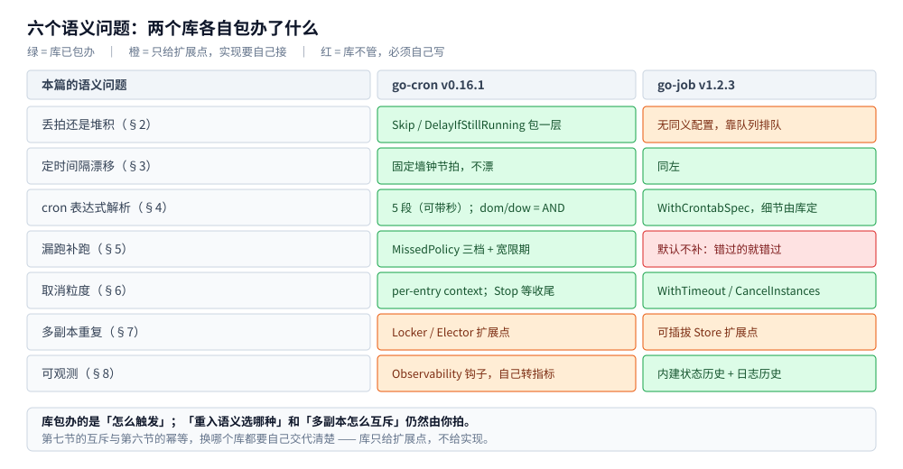

# 定时任务

> Go 侧定时任务的**四种实现路线**对照与导航：标准库自实现、go-cron、go-job，
> 以及中心化调度平台 xxl-job 的执行器接入。每条路线都配本机实测读数。
>
> 内容整理自个人学习笔记；素材见 [素材清单](../../../../素材清单.md)。

---

## 一、四种路线各解决什么问题？

**本节要点**：先按「任务对时刻的要求」和「治理需求」两条轴选路线 —— 越往右能力越全，代价是引入的依赖与运维面越大。

| 路线 | 定位 | 一句话判据 | 分册 |
|---|---|---|---|
| **标准库自实现** | 进程内、**零依赖** | 任务只有一两个、间隔固定、无墙钟要求 | [标准库实现.md](标准库实现.md) |
| **go-cron** | 进程内**调度器** | 要「每天 2 点」这类墙钟语义，且要运行时改期 / 暂停 / 手工触发 | [go-cron实现.md](go-cron实现.md) |
| **go-job** | 进程内**任务平台**（调度 + 队列 + 观测） | 任务多、要优先级与并发度控制、要现成的执行历史可查 | [go-job实现.md](go-job实现.md) |
| **xxl-job（Go 执行器）** | **中心化调度平台** | 要分片广播、失败重试、可视化管理、跨语言执行器 | [xxl-job接入.md](xxl-job接入.md) |

⭐ 后两条与中间两条的分界是：**库管「怎么触发」，「平台」管「调度 + 治理」**。
平台把「多副本重复执行」这个进程内无解的问题从根上解决掉（调度中心只派发一次），代价是多一套中间件与运维面。

⭐ 阅读顺序建议：**先读《标准库实现》** —— 它把六个必须回答的语义问题讲透了，
后三篇都是「这些问题的答案换成了什么」，先读原理再看库的默认值才不会被动。

---

## 二、六个语义问题，四种路线各给什么答案？

**本节要点**：写定时任务要回答的问题**只有那六个**（丢拍 / 漂移 / cron 解析 / 漏跑 / 取消 / 多副本重复），
换实现路线的本质就是「把这六个换成一组默认值」。下表是四路线的答案对照。

| 语义问题 | 标准库自实现 | go-cron | go-job | xxl-job |
|---|---|---|---|---|
| **丢拍还是堆积** | 自己写容量 1 的信号量 | `SkipIfStillRunning` / `DelayIfStillRunning` | 靠 worker 池 + 队列天然「排队」 | 阻塞策略（`SERIAL` / `DISCARD_LATER` / `COVER_EARLY`）由**中心**配置 |
| **定时间隔漂移** | `Ticker` 对齐墙钟（任务慢不改节拍） | 同左 | 同左 | 中心 60 槽时间轮，**精度秒级** |
| **cron 解析** | 自己写 5 字段解析器 | 5 段（可选秒）；⚠️ **dom/dow 是 AND** | `WithCrontabSpec("0 2 * * *")` | 中心的 cron 配置 |
| **漏跑** | 自己实现 skip / once / burst | `WithMissedPolicy`：Skip / RunOnce / RunAll | **默认不补** | `misfire_strategy`（`DO_NOTHING` / `FIRE_ONCE_NOW`） |
| **取消粒度** | 在检查点看 `ctx.Err()` | per-entry context（`FuncJobWithContext`） | `WithTimeout` 到期置 `TimedOut` | 中心超时后调 `/kill`，执行器 `ctx.Done()` |
| **多副本重复** | 自己加跨进程锁（目录锁 / Redis / DB） | 只提供 `Locker` / `Elector` **扩展点** | 只提供可插拔 `Store` | **中心单播，从根上解决** |
| **观测** | 自己接指标（`job_last_success_timestamp` 最有用） | `WithObservability` 钩子，自己转成指标 | **内建**状态历史 + 日志历史 | 控制台 + 执行日志回拉 + `xxl_job_log` |

⭐ 一句话：**换库/换平台能消灭「调度代码」，消灭不了「任务幂等」**。
第六节（取消）与第七节（多副本）在 [标准库实现.md](标准库实现.md) 里讲的是固有难题，换哪条路线都得自己交代清楚。

> 下图只覆盖 **go-cron / go-job 两个库**的覆盖情况（哪些是库包办的、哪些只给扩展点、哪些必须自己写），
> 是上面这张表其中两列的展开：

---

## 三、两个库的名字都有坑，怎么避免引错？

**本节要点**：Go 生态里 `go-cron` / `go-job` 都不是唯一名字 —— **引依赖前先核对 module path**，否则很容易搬来一份名字像、行为完全不同的代码。

| 本篇叫法 | 实际模块（实测版本） | ⚠️ 容易混淆的 |
|---|---|---|
| **go-cron** | [`github.com/netresearch/go-cron`](https://github.com/netresearch/go-cron) · **v0.16.1** | GitHub 上没有知名库正好叫 `go-cron`；包名是 `gocron` 的 `go-co-op/gocron/v2` 是**另一个库** |
| **go-job** | [`github.com/cybergarage/go-job`](https://github.com/cybergarage/go-job) · **v1.2.3** | 同名项目还有 `goliatone/go-job`（脚本式执行器，从 shell / JS / SQL 注释里抽调度配置），与本篇这个不是一回事 |

`netresearch/go-cron` 是 **`robfig/cron` 的活跃维护 fork**：上游自 v3.0.1（2020）后基本冻结，
这个 fork 沿用它的 API（换 import 一行即可）并修了若干 bug，**要求 Go 1.25+**。

| 库 | 定位 | 调度模型 | 相对突出的是 |
|---|---|---|---|
| go-cron | **调度器** | cron 表达式 / `@every` / `@triggered` | 漏跑策略、per-entry context、运行时改期、工作流依赖 |
| go-job | **任务平台**（调度 + 队列 + 观测） | 立即 / 延迟 / 定点 / crontab | 优先级队列 + worker 池、状态与日志历史、可插拔 Store |

⚠️ **换库前最容易咬人的一条**：`dom` / `dow` 两个字段的 **AND / OR 语义在库之间并不一致**
（`robfig/cron` 是 **OR**、`netresearch/go-cron` 是 **AND**，同一个 `0 0 1 * 1` 的下一次触发能差**数月**），
实测见 [go-cron实现.md](go-cron实现.md) 第 1.1 节。

---

## 四、什么时候该换成库，什么时候该上平台？

**本节要点**：判据只有两条 —— **任务对「墙钟语义」的需求**，以及**要不要「治理」**（重试 / 分片 / 可视化 / 跨语言）。

| 判据 | 结论 |
|---|---|
| 任务数只有一两个、间隔固定、无墙钟要求 | **别引依赖** —— [标准库实现.md](标准库实现.md) 的骨架就够 |
| 要「每天 2 点」这类墙钟语义，且需要运行时改期 / 暂停 / 手工触发 | **go-cron** |
| 已经有 `robfig/cron` 资产、想原地拿护栏（重复执行、漏跑、超时） | **go-cron**（换 import + 逐条核行为差异） |
| 任务多、要优先级与并发度控制、要现成的执行历史可查 | **go-job** |
| 需要多副本互斥 | 两个库**都只给扩展点** —— 仍要自己接 `Locker` / `Store`（见 [标准库实现.md](标准库实现.md) 第七节） |
| 要**分片广播**（千万级数据横向拆到 N 台跑）、失败重试与告警、控制台可视化管理、跨语言执行器 | **xxl-job** 这类中心化平台（见 [xxl-job接入.md](xxl-job接入.md)） |

⭐ 最后一条最容易被忽略：**库能消灭的是「调度代码」，消灭不了「分布式任务的那几个固有难题」**。
多副本重复、任务幂等这两件事，换哪个库都得自己交代清楚；要彻底解决，只能把调度收归中心（平台路线）。

---

## 延伸追问

- **先读库还是先读原理？** → 先读原理。六个语义问题是**你**要拍的事，库只是把它们换成默认值 —— 不知道默认值对应哪一问，看文档也看不出「它替我省了什么、又留了什么坑」。
- **用了库，任务还需要幂等吗？** → 更需要。重入、漏跑、超时这些语义都由库的**默认值**决定了，你对「会不会跑两次」的直觉更容易失效。
- **换库要重新核什么？** → 至少三样：`dom`/`dow` 的 AND/OR、漏跑的默认策略、重入的默认行为。前两样在 [go-cron实现.md](go-cron实现.md) 有实测，第三样见 [标准库实现.md](标准库实现.md) 第二节。
- **什么时候必须上平台，而不是加个锁凑合？** → 出现这几种需求之一时：任务要**分片并行**、失败要**自动重试 + 告警**、运维要**在控制台看执行历史并手工触发**、执行器要**跨语言**。自己一路补下去，最后补出来的就是平台的功能集。

---

## 关联

- [标准库实现.md](标准库实现.md) — 六个语义问题的原理与本机实测（推荐先读）
- [go-cron实现.md](go-cron实现.md) — 换成现成 cron 库：护栏交给库，`dom`/`dow` 语义有坑
- [go-job实现.md](go-job实现.md) — 换成带队列与优先级的任务平台
- [xxl-job接入.md](xxl-job接入.md) — Go 执行器接入中心化调度平台（含全链路容器实测）
- [xxl-job.md](../../../../03-数据与中间件/中间件/任务调度/xxl-job.md) — 平台本体篇：架构、路由与阻塞策略、部署、Java 执行器与选型对比
- [中间件选型.md](../../../../03-数据与中间件/中间件/中间件选型.md) — 分布式定时任务的横向选型（速查 + 详见专篇）
- [分布式与微服务.md](../../../../04-架构与系统/分布式/分布式与微服务.md) — 分布式定时任务在微服务基础设施里的位置
- [分布式锁.md](../../../../03-数据与中间件/数据存储/NoSQL/Redis/分布式锁.md) — 进程内换成跨进程互斥时的组件侧实测
