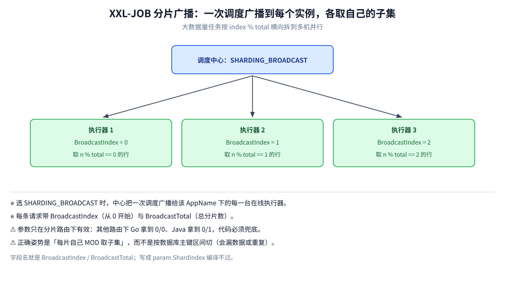

# xxl-job 接入

> XXL-JOB 的 **Go 执行器**（`github.com/xxl-job/xxl-job-executor-go` **v1.2.0**）完整接入：
> 执行器配置与任务注册、分片广播、失败与重试的处理约定、托管生命周期的写法，
> 以及把 **MySQL + xxl-job-admin 3.4.2 + 双执行器**跑起来后的五条链路实测读数。
>
> ⭐ 边界：本篇只讲 **Go 侧怎么接**。平台本体（核心概念、调度架构、部署、路由与阻塞策略、
> 跨语言能力对照、选型对比）见 [xxl-job.md](../../../../03-数据与中间件/中间件/任务调度/xxl-job.md)。
> 进程内方案见 [README.md](README.md) 的另外三篇。
>
> 内容整理自个人学习笔记；素材见 [素材清单](../../../../素材清单.md)。
>
> 📎 **实测口径**：本机 Docker Desktop，镜像 `xuxueli/xxl-job-admin:3.4.2` + `mysql:8.0`；
> 执行器为宿主交叉编译的 linux 二进制（`GOOS=linux`），两个实例跑在 `golang:1.26-alpine` 容器里、
> 与 admin 同一自定义 docker network。版本号由 `go mod` 与 jar 内 `admin_version` 实读。

---

## 一、执行器怎么配置、任务怎么注册？

```bash
go get github.com/xxl-job/xxl-job-executor-go
```

| `xxl` 选项函数 | 作用 | 默认值 / 说明 |
| --- | --- | --- |
| `xxl.ServerAddr(addr)` | 调度中心地址 | 2.x 形如 `http://127.0.0.1:8080/xxl-job-admin`（**带 context-path**）；⚠️ **3.x 起改为 `http://127.0.0.1:8080`**（实测 3.4.2，见第四节） |
| `xxl.AccessToken(token)` | 通讯令牌 | 与中心 `xxl.job.accessToken` 一致（⚠️ 实测 3.4.2 该配置键**未改名**，不带 / 带错 token 都会被拒：`The access token is wrong.`） |
| `xxl.ExecutorIp(ip)` | 执行器注册 IP | 默认 `ipv4.LocalIP()`；多网卡 / 容器**必须显式指定** |
| `xxl.ExecutorPort(port)` | 执行器监听端口 | 默认 `9999` |
| `xxl.RegistryKey(name)` | **执行器 AppName** | 默认 `golang-jobs`；须与中心「执行器管理」的 AppName 完全一致 |
| `xxl.SetLogger(l)` | 自定义日志 | 实现 `Info(format string, a ...interface{})` / `Error(...)` 的 `xxl.Logger` |

> ⚠️ Go 客户端**没有** `SetAddresses` / `SetAccessToken` / `SetRegistry` 这类 setter（那是部分博客的臆造或他语言写法），只有上面这些 `Option` 函数；也**不支持可插拔注册中心**，固定走 DB 注册表。

```go
package main

import (
	"context"
	"log"
	"time"

	xxl "github.com/xxl-job/xxl-job-executor-go"
)

func main() {
	exec := xxl.NewExecutor(
		xxl.ServerAddr("http://127.0.0.1:8080"), // ⚠️ 3.x 不带 context-path（2.x 才需要 /xxl-job-admin）
		xxl.AccessToken("default_token"),                      // = 中心 xxl.job.accessToken
		xxl.ExecutorIp("192.168.1.10"),                        // 对中心可达的 IP，务必显式写
		xxl.ExecutorPort("9999"),                              // 默认 9999
		xxl.RegistryKey("xxl-job-executor-sample"),            // = 中心「执行器管理」的 AppName
	)
	exec.Init()                 // 必须在 RegTask / Run 之前，内部会拉起注册协程
	exec.LogHandler(logHandler) // 控制台看「执行日志」时回拉，见下

	exec.RegTask("demoJobHandler", demoJobHandler) // 名字须与中心 JobHandler 一致
	exec.RegTask("shardingJobHandler", shardingJobHandler)
	// Run() 阻塞至 SIGINT/SIGTERM，自动向中心摘除注册后返回（无需自己 signal.Notify）
	if err := exec.Run(); err != nil {
		log.Fatalf("executor exit: %v", err)
	}
}

// 任务签名固定：func(ctx context.Context, param *xxl.RunReq) string
func demoJobHandler(ctx context.Context, param *xxl.RunReq) string {
	log.Printf("handler=%s param=%q logId=%d timeout=%ds",
		param.ExecutorHandler, param.ExecutorParams, param.LogID, param.ExecutorTimeout)
	for i := 0; i < 5; i++ {
		select {
		case <-ctx.Done(): // 中心超时 / 人工 kill 会 cancel，必须处理
			return "demo canceled: " + ctx.Err().Error()
		default:
		}
		time.Sleep(time.Second)
	}
	return "demo done"
}

// 实现后控制台「执行日志」才能看到内容；不实现则用内置的本地日志文件读取
func logHandler(req *xxl.LogReq) *xxl.LogRes {
	return &xxl.LogRes{Code: xxl.SuccessCode, Content: xxl.LogResContent{
		FromLineNum: req.FromLineNum, LogContent: "在此接入日志文件或日志采集系统",
		IsEnd: true, // 必须为 true，否则控制台会不停分页拉取
	}}
}
```

**优雅停止**：`exec.Run()` 内部已注册信号监听，收到 `SIGINT/SIGTERM/SIGQUIT/SIGKILL` 后调 `registryRemove()` 再返回。若要把执行器嵌进已有 `http.Server` 或交给框架托管生命周期，可只用 `exec.Init()`，后续手动 `exec.Stop()`。

**中间件**（统一日志、耗时统计、panic 兜底、链路透传）：`exec.Use(mw1, mw2)`，签名 `func(xxl.TaskFunc) xxl.TaskFunc`。注意 `Use` 是**整体覆盖**而非追加，多个中间件要在一次调用里传完。

## 二、分片广播怎么用？



路由策略选 `SHARDING_BROADCAST` 时，中心会把任务**广播给该 AppName 下的每一台执行器**，并在 `RunReq` 里带上：

| 字段 | 含义 | 说明 |
| --- | --- | --- |
| `param.BroadcastIndex` | 当前分片序号 | **从 0 开始**，0 表示第一片 |
| `param.BroadcastTotal` | 执行器总实例数（总分片数） | 路由策略不是分片广播时为 **0** |

> ⚠️ 字段名就是 `BroadcastIndex` / `BroadcastTotal`（`int64`），语义等同 Java 的 `shardIndex` / `shardTotal`。大量博客写成 `param.ShardIndex`，那是**错的**，编译不过。

```go
// shardingJobHandler：每个执行器实例只处理自己那一份数据（需 import "context" / "fmt" / "log"）
// 典型场景：把千万级待处理行横向拆到 N 台机器并行跑
func shardingJobHandler(ctx context.Context, param *xxl.RunReq) string {
	idx, total := int(param.BroadcastIndex), int(param.BroadcastTotal)
	if total <= 1 { // total<=0 说明本次不是分片广播路由（如被改成 ROUND），退化为单机全量
		idx, total = 0, 1
	} else if idx < 0 || idx >= total {
		return fmt.Sprintf("invalid shard param: %d/%d", idx, total)
	}

	rows := loadIDs() // 业务侧自行分页拉取「待处理行」
	handled := 0
	for n, id := range rows {
		if n%total != idx { // 不属于本分片的直接跳过
			continue
		}
		select {
		case <-ctx.Done(): // 超时或人工 kill，立刻让出，避免脏写
			return fmt.Sprintf("shard %d/%d canceled, handled=%d", idx+1, total, handled)
		default:
		}
		if err := process(ctx, id); err != nil {
			// ⚠️ 单行失败不要直接 return，否则本分片剩余数据全部漏跑；记录明细后 continue
			log.Printf("shard %d/%d process id=%d err=%v", idx+1, total, id, err)
			continue
		}
		handled++
	}
	return fmt.Sprintf("shard %d/%d done, handled=%d", idx+1, total, handled)
}
func loadIDs() []int64                          { return []int64{1, 2, 3, 4, 5, 6, 7, 8, 9, 10} }
func process(_ context.Context, id int64) error { _ = id; return nil }
```

分片广播的**正确姿势**是「每片自己 `MOD` 取子集」，而不是「按数据库主键区间切」——区间方案在实例上下线时会漏数据或重复。中心不感知数据，只保证每个在线实例各收到一次、且带正确的 index / total。

## 三、业务失败怎么表达，中心才会重试？

Go 客户端**最容易踩的坑**：`Task.Run` 的逻辑是——**函数正常返回 → 一律回调 `code=200`（成功）；只有 `panic` 才回调 `code=500`（失败）**。任务函数返回的字符串只是 `handleMsg`（日志内容），**不是状态码**。

| 业务结果 | Go 侧写法 | 中心表现 |
| --- | --- | --- |
| 成功 | `return "done"` | `handleCode=200`，绿色 |
| 业务失败，需重试 / 告警 | **必须 `panic(err)`**，或用中间件把错误约定转成 panic | `handleCode=500`，按 `executor_fail_retry_count` 重试 + 告警 |
| 超时 | 不 panic；中心按 `executor_timeout` 判失败并调 `/kill` | cancel 掉 `ctx`，函数应尽快返回 |

```go
// 用中间件把「返回以 ERROR: 开头的字符串」统一转成 panic，避免业务里到处 panic（需 import "strings"）
func failFastMiddleware(next xxl.TaskFunc) xxl.TaskFunc {
	return func(ctx context.Context, param *xxl.RunReq) string {
		msg := next(ctx, param)
		if strings.HasPrefix(msg, "ERROR:") { // 约定：以 ERROR: 开头即业务失败
			panic(msg)                          // 触发回调 code=500 → 中心重试 / 告警
		}
		return msg
	}
}

// exec.Use(failFastMiddleware)，任务里只需： return "ERROR: 库存扣减失败, orderId=123"
```

> ⚠️ 重试 = **业务会被重复执行**。所有任务按「至少一次」设计：业务幂等键（如 `bizKey + 业务日期`）、DB 唯一索引、状态机前置判断。
> ⚠️ `panic` 会被 `recover` 住并打印堆栈，不会让进程挂掉；但**别**用 panic 表达可恢复的单行错误（见第二节的 `continue`）。

---

## 四、全链路实测：从注册到回调要过哪几道关？

**本节要点**：上面三节都是「怎么写」，这一节是「真的跑起来长什么样」。用 **MySQL 8.0 + xxl-job-admin 3.4.2 + 两个 Go 执行器实例**（独立容器、同一 docker network）把五条链路各跑了一遍。

### 4.1 实测坐标（先说清楚跑的是什么版本）

| 项 | 值 |
|---|---|
| 调度中心 | `xuxueli/xxl-job-admin:3.4.2`（jar 内 `admin_version=3.4.2`），Tomcat 监听 8080 |
| 建表脚本 | 必须取 **tag 对应版本**的 `doc/db/tables_xxl_job.sql`（`v3.4.2`）；⚠️ 用 master 分支的脚本会因 `job_desc` 列缺失而持续报 `Unknown column 't.job_desc'` |
| 执行器 | `github.com/xxl-job/xxl-job-executor-go` **v1.2.0**，两个实例（`172.29.0.4:9999` / `172.29.0.5:9999`） |
| 数据库 | MySQL 8.0，库 `xxl_job` |

⚠️ **3.4.2 与 2.x 的两个地址差异（实测）**：

| 项 | 2.x | 3.4.2 实测 |
|---|---|---|
| 控制台路径 | `http://host:8080/xxl-job-admin` | **`http://host:8080/`**（Tomcat 日志：`context path '/'`；访问 `/xxl-job-admin` 返回 **404**） |
| 登录入口 | `/toLogin` | **`/auth/login`**（根路径 302 跳到这里） |

⭐ 所以 `xxl.ServerAddr(...)` 在 3.4.2 下**不要再带 `/xxl-job-admin`**。

### 4.2 链路一：执行器注册（20s 心跳）

执行器起来后立刻注册，之后每 20s 续约：

```text
2026/10/07 06:02:59 LAB boot app=xxl-job-executor-sample admin=http://joblab-admin:8080 port=9999
2026/10/07 06:02:59 [CLIENT] Starting server at 172.29.0.4:9999
2026/10/07 06:03:00 [CLIENT] 执行器注册成功:{"code":200,"data":null,"msg":"Success","success":true}
```

落库（`xxl_job_registry`）：

| id | registry_group | registry_key | registry_value |
|---|---|---|---|
| 1 | EXECUTOR | xxl-job-executor-sample | `http://172.29.0.4:9999` |
| 13 | EXECUTOR | xxl-job-executor-sample | `http://172.29.0.5:9999` |

⭐ 两个实例注册后，中心把存活地址刷新回分组（`xxl_job_group.address_list`）：

```text
http://172.29.0.4:9999,http://172.29.0.5:9999
```

⚠️ 注册的地址是**执行器自己的 IP**（这里是容器 IP）—— 中心要能反向访问它，所以容器必须在同一 network。

### 4.3 链路二：一次调度 → 回调

`FIRST` 路由、`0 * * * * ?` 每分钟触发：

```text
[CLIENT] 任务参数:&{5 demoJobHandler  SERIAL_EXECUTION 0 1 1791353040505 BEAN  1791324230000 0 1}
[CLIENT] 任务[5]开始执行:demoJobHandler
[MW] handler=demoJobHandler logId=1 shard=0/1 cost=601 ms msg="demo done param=\"\""
[CLIENT] 任务回调成功:{"code":200,"data":null,"msg":"Success","success":true}
```

`xxl_job_log`：

| id | job_id | executor_handler | trigger_code | handle_code | msg |
|---|---|---|---|---|---|
| 1 | 5 | demoJobHandler | 200 | 200 | `demo done param=""` |

⭐ **`trigger_code` 与 `handle_code` 必须分开看**：前者是「中心有没有成功把请求打到执行器」，后者是「任务体跑得成不成功」。触发成功但执行失败是常态（见 4.4）。

⚠️ ⚠️ **一个极易误读的日志**：执行器每次都会打印「**任务回调成功**」——那说的是「回调这个 HTTP 动作成功了」（中心返回 200），**不是「任务成功了」**。任务失败的证据在 `handle_code=500`。

### 4.4 链路三：业务失败 → 中心重试

按第三节的约定，任务返回 `ERROR:` 前缀 → 中间件转 `panic`，`Task.Run` 的 `recover` 捕获后回调 **500**：

```text
[MW] handler=panicJobHandler logId=5 shard=0/1 cost=0 ms msg="ERROR: simulated business failure"
[CLIENT] 任务ID[5]任务名称[panicJobHandler]参数: panic: ERROR: simulated business failure
...（debug.PrintStack 的堆栈）...
[CLIENT] 任务回调成功:{"code":200,...}
```

`executor_fail_retry_count=2` 时，一次调度在 `xxl_job_log` 里留下 **3 条记录**（1 次执行 + 2 次重试）：

| id | job_id | handle_code | msg |
|---|---|---|---|
| 3 | 5 | 500 | `task panic:ERROR: simulated business failure` |
| 4 | 5 | 500 | 同上 |
| 5 | 5 | 500 | 同上 |

⭐ **重试 = 业务被重复执行**，所以第三节那条「任务必须幂等」不是建议，是前提。

### 4.5 链路四：分片广播

路由策略改 `SHARDING_BROADCAST`、两个实例在线，**一次调度产生两条日志**，各实例只处理自己那一片：

| id | shard（执行器侧） | 处理的行 | handle_code |
|---|---|---|---|
| 9 | `0/2`（172.29.0.4） | `[1 3 5 7 9]` | 200 |
| 10 | `1/2`（172.29.0.5） | `[2 4 6 8 10]` | 200 |

```text
（exec1）[MW] handler=shardingJobHandler logId=9  shard=0/2 cost=0 ms msg="shard 0/2 handled=[1 3 5 7 9]"
（exec2）[MW] handler=shardingJobHandler logId=10 shard=1/2 cost=0 ms msg="shard 1/2 handled=[2 4 6 8 10]"
```

⚠️ ⚠️ **一条实测修正**：非分片路由下，Go 执行器拿到的分片参数是 **`BroadcastIndex=0` / `BroadcastTotal=1`**（实测 `FIRST` 路由，打印 `shard=0/1`）。所以第二节代码里那句兜底注释要按实测理解：
`total <= 1` 覆盖的是 **「非分片路由拿到 0/1」** 与 **「单实例分片拿到 0/1」** 两种情况 —— 它比「`0/0`」这个流传更广的说法更贴近实际。

### 4.6 链路五：超时（⚠️ 两端的计时是分开的）

`executor_timeout=3`（秒），配合**两个只有一处差别**的任务体：

| 组 | 任务体 | 实测耗时 | `handle_code` |
|---|---|---|---|
| A：任务体**会检查 `ctx`**（内层 `select` 等 `ctx.Done()`） | `slowJobHandler` | **3000 ms** | **200** |
| B：任务体**完全不看 `ctx`**（硬睡 90 秒） | `stubbornJobHandler` | **90000 ms** | **200** |

A 组的执行器日志（3 秒就被取消）：

```text
[SLOW] ctx done err=context deadline exceeded
[MW] handler=slowJobHandler logId=13 shard=0/1 cost=3000 ms msg="slow canceled: context deadline exceeded"
```

B 组的执行器日志（`executor_timeout=3` 形同虚设，一路跑满 90 秒）：

```text
[MW] handler=stubbornJobHandler logId=23 shard=0/1 cost=90000 ms msg="stubborn finished (ctx ignored)"
```

⭐⭐ **两组在 `xxl_job_log` 里都是 `handle_code=200`** —— 也就是说，**本机 3.4.2 上「超时后中心标记失败并调 `/kill`」这条链路没有被观察到**：90 秒的任务（`timeout=3`）既没被标记失败，也没收到 `/kill`。

⭐ 所以 `executor_timeout` 真正确定的语义只有一条：**它被客户端转成 `context.WithTimeout` 交给任务体**（`executor.go:166-170`）。
落到写法上就是 —— **任务体必须自己检查这个 ctx**：检查了，3 秒就停（A 组）；不检查，它会一路跑到底（B 组）。

⚠️ B 组还顺带暴露了一个排查要点：任务体跑 90 秒期间，下一分钟的触发被执行器**按阻塞策略拒绝**（`DISCARD_LATER`），中心记成 **`trigger_code=500`**：

| id | trigger_code | handle_code | 说明 |
|---|---|---|---|
| 23 | 200 | 200 | 任务体跑满 90 秒后正常返回 |
| 24 | **500** | 0 | 上一次还在跑 → 执行器回 `There are tasks running`，本次不执行 |

⭐ 所以 **`trigger_code=500` 不等于「网络不通」**：它同时覆盖「执行器主动拒绝」（**任务未注册** / **阻塞策略**）与「连不上执行器」两类。实测中两种都出现过 —— 前者的 `handle_msg` 是 `Task not registered` / `There are tasks running`，后者执行器侧**完全无日志**。排查时不能只看这个码。


---

## 使用：把执行器接进已有的 HTTP 服务

**本节要点**：多数服务不希望执行器独占 `main`，而是要挂在已有的 `http.Server` 或框架生命周期上。

原文第一节用的 `exec.Run()` 会**阻塞并自己接管信号**（收到 `SIGINT/SIGTERM/SIGQUIT/SIGKILL` 后摘除注册再返回）。要托管生命周期，改成只用 `Init()`：

```go
exec := xxl.NewExecutor(
	xxl.ServerAddr("http://127.0.0.1:8080"), // 3.x 不带 context-path
	xxl.AccessToken(os.Getenv("XXL_JOB_TOKEN")),
	xxl.ExecutorPort("9999"),
	xxl.RegistryKey("xxl-job-executor-sample"),
)
exec.Init() // 内部会拉起注册协程并开始 20s 心跳；不会阻塞

exec.RegTask("demoJobHandler", demoJobHandler)

// 把你的 http.Server 起起来（执行器自己监听 :9999，两者不冲突）
go func() { _ = srv.ListenAndServe() }()

// 退出时摘除注册，否则中心要等 90s（DEAD_TIMEOUT）才把本实例剔出地址列表
defer exec.Stop()
```

⚠️ 三点：

- `Init()` 只是拉起注册协程，**不会**替换 `os.Exit` 路径 —— 自己 `defer exec.Stop()` 才摘得干净；
- 不调 `Stop()` 直接退出，注册表里的地址会滞留至多 **90s**，这期间路由可能打到已经没了的实例（表现为「触发失败但执行器无日志」）；
- `Use(...)` 是**整体覆盖**而非追加，多个中间件必须在**一次调用**里传完。

---

## 延伸追问

- **执行器注册的粒度是什么？** → 是 **AppName**（`xxl.RegistryKey`），不是机器 IP。同一个 AppName 下所有实例共享一个地址列表，路由策略在这个列表上挑目标；AppName 与中心「执行器管理」里配的不一致时，任务绑定不上。
- **中心是怎么找到执行器的？** → 执行器**主动注册**：`POST {admin}/api/registry`（Header 带 `XXL-JOB-ACCESS-TOKEN`），之后每 **20s** 续约。中心每 30s 扫描注册表，删掉 90s 未续约的地址（`DEAD_TIMEOUT = BEAT_TIMEOUT × 3`）。
- **为什么「执行器能访问中心」还不够？** → 因为触发方向是 **中心 → 执行器 `:9999`**（HTTP 反向触发）。只放通出方向会出现「注册成功、但任务永远不执行」，且执行器侧没有任何日志。
- **超时后任务真的会停吗？** → 不一定会。实测（4.6）：会看 `ctx` 的任务 3s 就被取消并**正常返回 200**；不看 `ctx` 的任务会跑到底。中心只在「超时后仍未回调」时才标记失败并调 `/kill`。
- **怎么让中心知道业务失败？** → Go 客户端**只能靠 panic**（返回 error 不管用）：`Task.Run` 正常返回一律回调 200，只有 `panic` 被 `recover` 后才回调 500。所以要么在业务里 `panic`，要么用中间件把错误约定（如 `ERROR:` 前缀）统一转成 panic。
- **一次调度会写几条日志？** → 单播路由 **1 条**；`SHARDING_BROADCAST` 路由**每个在线执行器各 1 条**（实测双实例 = 2 条，见 4.5）。

---

## 关联

- [README.md](README.md) — 四方案对照：标准库 / go-cron / go-job / xxl-job 的能力覆盖矩阵与选型判据
- [标准库实现.md](标准库实现.md) — 进程内实现时那六个语义问题（本篇的「平台版答案」）
- [xxl-job.md](../../../../03-数据与中间件/中间件/任务调度/xxl-job.md) — 平台本体篇：核心概念、路由与阻塞策略、部署、Java 实现、选型对比
- [中间件选型.md](../../../../03-数据与中间件/中间件/中间件选型.md) — 分布式定时任务的横向选型（速查）
- [接入Jaeger.md](../../可观测性/接入Jaeger.md) — 执行器侧任务的链路埋点：无上游请求，入口要自建根 span
- [分布式与微服务.md](../../../../04-架构与系统/分布式/分布式与微服务.md) — 分布式定时任务在微服务基础设施里的位置
> 反向引用（本篇被下列文档引到）：[go-cron实现.md](go-cron实现.md)、[go-job实现.md](go-job实现.md)
