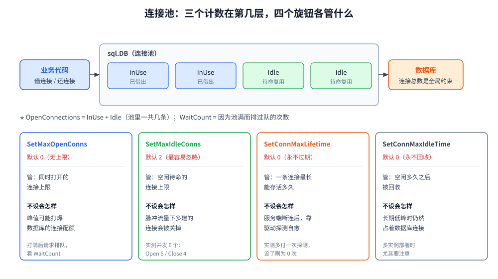
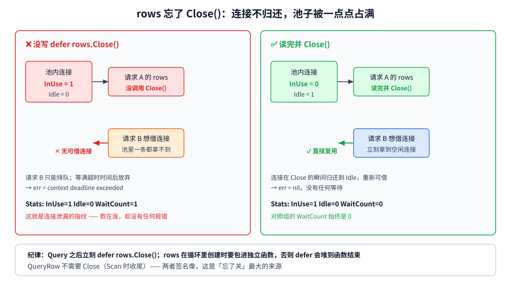

# 数据访问与连接池

> 本篇覆盖 Go 的 `database/sql`：**`sql.DB` 为什么是"池"而不是"连接"**、四个旋钮的默认值里藏着哪些事故、
> `Query` / `QueryRow` / `Exec` 的分工与 `rows` 的生命周期、`context` 超时打断在哪一步、池该开多大，
> 以及它和 GORM 的关系。
> ⭐ 全部读数来自 **容器 `golang:1.26-alpine`（go1.26.8）+ MySQL 8.0 容器**；机制部分用一个**自写 driver** 精确数出「连接开了几次、关了几次」。
>
> 内容整理自个人学习笔记，素材见 [素材清单.md](../../../素材清单.md)。

---

## 一、`sql.DB` 不是连接，是池

**本节要点**：这是理解一切池行为的前提 —— `sql.DB` 是一个**并发安全的连接池句柄**，
`sql.Open` **不建立任何连接**，第一个真正需要连接的操作才会建。把它当成"一个连接"来用，后面所有旋钮都会用错。

### 1.1 惰性建连：`sql.Open` 什么也没做

```text
=========== 实验一：sql.Open 不建连接（惰性） ===========
刚 sql.Open 完：OpenConnections=0 InUse=0 Idle=0
调用一次 Ping 之后：OpenConnections=1 InUse=0 Idle=1
```

⭐ 两个直接推论：

1. **`sql.Open` 的错误只代表"参数不合法"**（比如驱动名写错、DSN 解析失败），
   **不代表数据库连得上**。所以启动时要做一次 `Ping`/`PingContext` 来验证连通性 —— 但也别无条件 Ping：
   如果数据库暂时不可用，业务可能希望"服务先起来、等数据库恢复"。
2. **`sql.Open` 可以且应该只调用一次**，把返回的 `*sql.DB` 当成**长生命周期对象**共享（含传给各 repository / GORM）。

### 1.2 池的三个计数

`db.Stats()` 给出的核心三个数：

| 计数 | 含义 | 什么时候会看它 |
|---|---|---|
| `OpenConnections` | **总共**打开着多少连接（含忙的和闲的） | 是否触及 `MaxOpenConns` 上限 |
| `InUse` | 正被借出、还没归还的 | 判断"是不是有地方忘了归还" |
| `Idle` | 空闲在池里待命的 | 判断连接复用率、空闲上限是否生效 |

⚠️ 另外两个更少被注意但很关键：

- `WaitCount`：**因为池满而排队等过连接的次数**。这个数一旦持续增长，说明 `MaxOpenConns` 是瓶颈。
- `MaxIdleClosed` / `MaxLifetimeClosed`：因为**空闲上限**或**存活上限**被主动关掉的连接数 —— 它们是"参数生效了"的直接证据。

### 1.3 它要长期持有，不要"用完就关"

```go
// ❌ 反模式：每次请求都 Open 一个
func handler(w http.ResponseWriter, r *http.Request) {
    db, _ := sql.Open("mysql", dsn)
    defer db.Close() // 每次都把池拆了重建
    ...
}
```

`sql.DB` 内部维护着空闲连接队列和后台清理协程。**频繁 `Open`/`Close` 等于把池的意义全部作废** ——
连接反复"建了又拆"，同时并发限制也失去作用。

---

## 二、四个旋钮：默认值里藏着事故

**本节要点**：`database/sql` 的默认值是为"安全"而不是为"性能"选的。其中 **`MaxIdleConns = 2`** 是最容易被忽略的一个 ——
它会让你的服务在高并发之后**把多建的连接全关掉**，下次峰值再重新建。

### 2.1 旋钮总表

| 方法 | 默认值 | 管什么 | 不设会怎样 |
|---|---|---|---|
| `SetMaxOpenConns(n)` | **0（无上限）** | 同时打开的连接上限 | 峰值时可能打爆数据库的 `max_connections` |
| `SetMaxIdleConns(n)` | **2** | 空闲待命连接的上限 | 峰值过后**多余连接被关掉**，下次峰值重新建（实测见 2.2） |
| `SetConnMaxLifetime(d)` | **0（永不过期）** | 一条连接的**最长存活时间** | 遇到服务端断连 / 中间件超时会拿到坏连接（实测见 2.4） |
| `SetConnMaxIdleTime(d)` | **0（永不回收）** | 一条连接**空闲多久后被回收** | 长期低峰时占着连接不放 |

⚠️ 注意 `MaxOpenConns = 0` 是"无上限"，**不是"0 个连接"** —— 这是最常被读反的一行文档。
实测：未显式设置时 `MaxOpenConnections=0`，`SetMaxOpenConns(8)` 之后读出 `8`。



### 2.2 `MaxIdleConns` 默认 2：并发 6 个，关掉 4 个

先看**自写 driver** 的精确计数（它能数出 `driver.Conn.Close()` 被调了几次，真库看不到这个）：

```text
=========== 实验一：串行查询 —— 连接是复用的 ===========
串行 5 次查询：驱动 Open 被调用 1 次、Close 0 次、真查询 5 次
  Stats: Open=1 InUse=0 Idle=1 WaitCount=0

=========== 实验二：并发 6 次，看空闲连接保留几个（MaxIdleConns 默认值） ===========
并发 6 次查询：Open 6 次、Close 4 次、查询 6 次
  查询刚结束时 Stats: Open=2 InUse=0 Idle=2 WaitCount=0

=========== 实验三：显式把 MaxIdleConns 提到 6 ===========
并发 6 次查询：Open 6 次、Close 0 次、查询 6 次
  查询刚结束时 Stats: Open=6 InUse=0 Idle=6 WaitCount=0
```

⭐ **实验二和实验三唯一的差别就是 `SetMaxIdleConns(6)` 这一行，结果 `Close` 从 4 变成 0**：

- 默认（空闲上限 2）：并发 6 个请求把池撑到 6 条连接，**请求结束瞬间关掉 4 条**，只留 2 条待命；
- 显式设为 6：6 条全部留着待命，下次峰值直接复用。

⚠️ 后果不是"错"，而是**性能抖动**：如果你的流量是"脉冲式"（定时任务、批处理、峰值场景），
默认值会让**每一波脉冲都重新建连接**（TCP 握手 + 认证 + 服务端分配会话）。
一个常见的经验配置是 `MaxIdleConns = MaxOpenConns`，让池"只增不减"，避免反复重建。

⭐ 反过来，**如果实例很多而数据库连接数有限**，`MaxIdleConns` 反而要压低 —— 否则"空闲连接"会把数据库的连接数配额占满。
**它是一个"拿数据库资源换自己延迟"的旋钮**。

### 2.3 `MaxOpenConns`：打满就排队

```text
=========== 实验四：MaxOpenConns = 2，并发 6 个查询 ===========
Open 2 次、Close 0 次、查询 6 次
  最终 Stats: Open=2 InUse=0 Idle=2 WaitCount=4
  6 个查询 × 100ms，上限 2 个连接 → 必须分 3 批跑完（理论最少 3 × 100ms = 300ms）
  → 上限打满后请求会排队：WaitCount=4 就是「6 个请求里有 4 个等过连接」
```

⭐ **`WaitCount=4` 是"池满了"的直接证据**：6 个请求，2 个立即拿到连接，另外 4 个排过队。

⚠️ 排队期间**请求是阻塞的**，而且这个等待**不受 `context` 以外任何机制控制** ——
如果 `MaxOpenConns` 设小了，表现就是"接口整体变慢但错误率为 0"，非常难查。
排查时先看 `WaitCount` 是否持续增长。

### 2.4 `ConnMaxLifetime`：为什么必须设

服务端（或中间的负载均衡、防火墙）会**单方面关掉空闲太久的连接**。MySQL 的默认 `wait_timeout` 是 28800 秒（8 小时），
所以这个问题往往**上线很久之后**才暴露。

实测把服务端的 `wait_timeout` 压到 2 秒，客户端睡 4 秒后再查：

```text
=========== 实验六：没设 ConnMaxLifetime 时，睡过 wait_timeout 再查 ===========
① 首查（建立连接）→ err = <nil>
   客户端入睡 4 秒（> 服务端 2 秒）……
② 睡醒再查 → err = <nil>
   驱动日志里「坏空闲连接」提示出现 1 次：closing bad idle connection: unexpected read from socket
   这次查询失败了吗？ false  ← 驱动在把连接交出去之前探测到它已断，主动关掉并换了新连接

=========== 实验七：对照组 —— 设了 ConnMaxLifetime(1s) 的同一场景 ===========
① 首查（建立连接）→ err = <nil>
   客户端入睡 4 秒（清理协程会在此期间淘汰超龄连接）……
② 睡醒再查 → err = <nil>
   本阶段驱动日志里「坏空闲连接」提示出现 0 次 ← 旧连接已被主动淘汰，没轮到服务端动手
   这次查询失败了吗？ false
```

⭐ **这里有一处预期被实测推翻**：我原本以为不设 `ConnMaxLifetime` 会直接报 `invalid connection`，
但实测中**查询成功了** —— `go-sql-driver/mysql` 在把连接交出去之前做了探测，发现服务端已断，
于是主动关掉它并换了新连接（日志原文 `closing bad idle connection: unexpected read from socket`）。

**所以正确的结论不是"会报错"，而是**：

1. **新版 MySQL 驱动会自愈**，代价是**多一次探测 + 一次重建连接**（实验六那次白跑了一趟）；
2. **对照组（设了 `ConnMaxLifetime`）连这次探测都没发生**（日志 0 次）—— 连接在被服务端判定"过期"之前，
   客户端已经主动把它淘汰了；
3. ⚠️ **不要依赖驱动的自愈能力**：这个检测发生在"复用之前"，如果连接是在**查询执行过程中**被断掉
   （服务端重启、中间件超时、网络抖动），仍然会以错误的形式暴露。`ConnMaxLifetime` 是**主动规避**，比"事后自愈"可靠。

⭐ 实践口径：`ConnMaxLifetime` 设成比服务端 `wait_timeout` **明显更短**的值（例如服务端 8 小时，客户端设 30 分钟 ~ 1 小时），
并配上 `SetConnMaxIdleTime` 让长期空闲的连接也被回收。

---

## 三、查询姿势与 `rows` 的生命周期

**本节要点**：`rows` 不是普通的返回值 —— 它**持有连接**。忘了 `Close`，那条连接就一直不归还，
池子迟早被占满，表现为"服务整体卡住但没有任何报错"。

### 3.1 三个方法的分工

| 方法 | 用在 | 返回 | 注意 |
|---|---|---|---|
| `Query` | 预期**多行** | `*sql.Rows` | ⚠️ **必须** `Close()`（见 3.2） |
| `QueryRow` | 预期**零或一行** | `*sql.Row`（延迟取数） | 错误由 `Scan` 返回；零行 → `sql.ErrNoRows` |
| `Exec` | **不返回行**（INSERT/UPDATE/DELETE） | `sql.Result` | 取 `RowsAffected` / `LastInsertId` 仍需检查 err |

⭐ 常见误区：**`QueryRow` 不需要 `Close`**（它内部在 `Scan` 时收尾），而 **`Query` 必须**。
两者的签名很像，这是"忘了关"的最大来源。

### 3.2 忘 `rows.Close()` 会怎样

```text
=========== 实验四：忘记 rows.Close() 会怎样 ===========
① 不 Close 就再查一次 → err = context deadline exceeded
   Stats: Open=1 InUse=1 Idle=0 WaitCount=1
   → 唯一连接被那行「没关闭的 rows」占着，新请求只能排队直到超时
② 读完并 Close 后再查一次 → err = <nil>
   Stats: Open=1 InUse=1 Idle=0 WaitCount=0
```

⭐ 读 `Stats` 的方式：`InUse=1, Idle=0` 表示**唯一的连接还在外面**，
`WaitCount=1` 表示**有请求为它排过队** —— 这两个数合起来就是"连接泄漏"的典型指纹。

⚠️ 这个 bug 的可怕之处在于**没有任何报错**：不 Close 的那次查询本身是成功的，
后续查询只是"变慢"，直到池被耗尽才表现为超时。

**三个防线**：

1. **`defer rows.Close()`** —— 但要注意它必须紧跟 `Query` 之后（见下）；
2. **`rows.Err()`** —— 遍历结束后检查，捕获"读到一半失败"；
3. **监控 `db.Stats().InUse` 持续贴近 `MaxOpenConns`** —— 这是泄漏的外部体征。

```go
rows, err := db.QueryContext(ctx, "SELECT ...")
if err != nil {
    return err
}
defer rows.Close() // ⭐ 紧跟 Query，别写在 for 里或靠后
for rows.Next() {
    // scan ...
}
return rows.Err() // ⭐ 别忘
```

⚠️ 一个更隐蔽的坑：**提前 `return` 时 `defer` 仍然生效**（这是 Go 的保证），
但如果 `rows` 是在**循环里**创建的（`for` 内 `Query`），`defer` 会堆到函数结束才执行 ——
这时连接全被占住。这种情况要在**循环内显式 `Close`**（用一个小函数包住）。



### 3.3 `ErrNoRows` 不是"错误"

```text
=========== 实验二：空结果 vs sql.ErrNoRows ===========
QueryRow(...).Scan 空结果 → err = sql: no rows in result set
  errors.Is(err, sql.ErrNoRows) = true
Query(...) 空结果 → err = <nil>（不报错）
  rows.Next() 第一次返回 = false（表示没有行）
```

⭐ 判据：

- **`QueryRow(...).Scan(...)`**：零行是一种**错误**（`sql.ErrNoRows`），必须显式区分
  "没查到"和"真的出错"（用 `errors.Is(err, sql.ErrNoRows)`）；
- **`Query(...)`**：零行**不是错误**，`err` 还是 `nil`，只是 `rows.Next()` 第一次就返回 `false`。

⚠️ 把 `ErrNoRows` 当成"查询失败"往上抛，是分页 / 详情接口最常见的错误来源之一 ——
"没找到"在业务上往往应该是 **404 或空列表**，而不是 **500**。

---

## 四、`context` 与超时

**本节要点**：`database/sql` 的 `*Context` 系列方法让超时"打断在途查询"。
它和 HTTP 客户端的超时逻辑不同 —— **超时后那条连接不会再被复用**。

### 4.1 超时打断在哪一步

```text
=========== 实验三：context 超时打断在途查询 ===========
SELECT SLEEP(2) 配 200ms 超时 → err = context deadline exceeded
  errors.Is(err, context.DeadlineExceeded) = true
  实际用时 < 1s ? true（证明客户端主动放弃，没等满 2 秒）
```

⭐ 注意错误文本是 **`context deadline exceeded`**，不是 `sql: ...` —— 所以判断超时要 `errors.Is(err, context.DeadlineExceeded)`。

### 4.2 超时之后那条连接去哪了

客户端主动放弃后，会向服务端发 **KILL** 把查询停掉，然后把这条连接**标记为不可复用**（直接关闭而不是放回池）。
这是"宁可少一条连接，也不要留一条状态不明的连接"的取舍。

⚠️ 所以：**大量超时 = 连接被大量重建**，池会更频繁地触顶。
如果你的服务超时率很高，`MaxOpenConns` 要留出余量。

### 4.3 三个超时的分工

| 超时 | 设在哪 | 管什么 |
|---|---|---|
| **DSN 的 `timeout`** | 连接串（如 `?timeout=5s`） | **建立 TCP 连接**的最长时间 |
| **DSN 的 `readTimeout` / `writeTimeout`** | 连接串 | 单次读 / 写的**网络层**超时 |
| **`context.WithTimeout`** | 调用点 | **整个操作**（含排队等连接 + 执行 + 读取结果） |

⭐ 实践判据：**用 `context` 控制业务超时**（它能覆盖排队时间，这是 DSN 超时做不到的），
DSN 的 `timeout` 只作为"连不上时别卡死"的兜底。

---

## 五、池该开多大

**本节要点**：`MaxOpenConns` 不是"越大越好"。它是**每个实例**的上限，而数据库的连接总数是**全局**约束。

一个可用的起点：

```text
单实例 MaxOpenConns ≈ 数据库可承受连接数 / 实例数 × 0.8
```

⭐ 关键判断顺序：

1. **先算数据库侧上限**：MySQL 的 `max_connections`（还要给运维 / 备份 / 其它服务留余量）；
2. **再除以实例数**（含滚动发布时的"新老并存"，那一刻实例数会翻倍）；
3. **最后看峰谷比**：脉冲式流量把 `MaxIdleConns` 提到与 `MaxOpenConns` 相同，避免反复重建。

⚠️ 三个常见反模式：

| 反模式 | 症状 |
|---|---|
| `MaxOpenConns` 设得远大于数据库能承受的量 | 高峰期数据库 `Too many connections`，**整个集群**受影响 |
| `MaxIdleConns` 保持默认 2 而 `MaxOpenConns` 很大 | 每波峰值都重建连接，延迟毛刺（2.2 实测） |
| 完全不设 `ConnMaxLifetime` | 长时间运行后偶发坏连接（2.4 实测口径） |

---

## 六、与 GORM 的关系

**本节要点**：GORM **不替代** `database/sql` —— 它是后者的**上层封装**，最终仍走同一个连接池。

```go
gormDB, err := gorm.Open(mysql.Open(dsn), &gorm.Config{})
// ...
sqlDB, err := gormDB.DB()      // ⭐ 拿到底层 *sql.DB
sqlDB.SetMaxOpenConns(50)      // 池的旋钮仍然在这里设
sqlDB.SetMaxIdleConns(50)
sqlDB.SetConnMaxLifetime(time.Hour)
```

⭐ 三条判据：

1. **池的行为完全由 `*sql.DB` 决定** —— 在 GORM 层找不到"连接池配置"，必须 `DB()` 拿到底层句柄；
2. **GORM 的 `Session` / 事务同样是"借出一条连接"** —— 长事务会长时间占住连接，和 3.2 的泄漏本质相同；
3. **出问题时先看 `sql.DB.Stats()`** —— 它能直接回答"是池满了、还是连接泄漏了"。

---

## 使用：一份可抄的初始化与规范

**本节要点**：把上面所有旋钮和纪律收在一个可执行的文件里。

```go
package db

import (
	"context"
	"database/sql"
	"errors"
	"time"

	_ "github.com/go-sql-driver/mysql"
)

// Open 建立全局唯一的连接池句柄（进程内调用一次）
func Open(dsn string) (*sql.DB, error) {
	db, err := sql.Open("mysql", dsn) // ① 惰性：这里不建立任何连接
	if err != nil {
		return nil, err
	}

	db.SetMaxOpenConns(50)                  // ② 数据库配额 / 实例数 × 0.8
	db.SetMaxIdleConns(50)                  // ③ 与上限相同：脉冲流量下不反复重建
	db.SetConnMaxLifetime(30 * time.Minute) // ④ 明显短于服务端 wait_timeout
	db.SetConnMaxIdleTime(10 * time.Minute) // ⑤ 长期空闲的连接也回收掉

	ctx, cancel := context.WithTimeout(context.Background(), 5*time.Second)
	defer cancel()
	if err := db.PingContext(ctx); err != nil { // ⑥ 启动时验证连通性
		return nil, err
	}
	return db, nil
}

// QueryOne 演示正确的 rows 生命周期（这篇最容易出错的地方）
func QueryOne(ctx context.Context, db *sql.DB, id int64) (string, error) {
	var name string
	err := db.QueryRowContext(ctx, "SELECT name FROM t WHERE id = ?", id).Scan(&name)
	if errors.Is(err, sql.ErrNoRows) { // ⑦ 「没找到」是业务语义，不是错误
		return "", ErrNotFound
	}
	return name, err
}

// QueryMany 演示多行查询的收尾
func QueryMany(ctx context.Context, db *sql.DB) ([]string, error) {
	rows, err := db.QueryContext(ctx, "SELECT name FROM t")
	if err != nil {
		return nil, err
	}
	defer rows.Close() // ⑧ 紧跟 Query，别拖到函数中段

	var out []string
	for rows.Next() {
		var s string
		if err := rows.Scan(&s); err != nil {
			return nil, err
		}
		out = append(out, s)
	}
	return out, rows.Err() // ⑨ 遍历结束必须检查
}
```

**五条可以固化进团队规范的**：

1. **`sql.DB` 进程内唯一 + 长期持有**，禁止在请求处理函数里 `Open`/`Close`；
2. **四个旋钮必须显式设置**（尤其 `MaxIdleConns` 和 `ConnMaxLifetime` 不要用默认值）；
3. **`Query` 之后立刻 `defer rows.Close()`**，循环里创建的 `rows` 要有独立函数包住；
4. **`sql.ErrNoRows` 映射到业务语义**（404 / 空列表），不要当 500；
5. **监控 `db.Stats()`**：`WaitCount` 持续增长 = 池是瓶颈；`InUse` 贴近上限 = 可能有泄漏。

---

## 延伸追问

- **`sql.Open` 返回 nil 错误，就能直接用吗？** → 不能。它只校验参数，**不建连接**（1.1 实测）。
  要用 `PingContext` 验证连通性，但也要想清楚"数据库暂时不可用时，服务该不该启动"。
- **`MaxOpenConns` 设 0 是什么意思？** → **无上限**，不是"零个连接"。生产环境几乎总要显式设置，
  否则峰值会打爆数据库。
- **为什么并发结束后连接会从 6 掉到 2？** → `MaxIdleConns` 默认 2（2.2 实测：`Open 6 / Close 4 / Idle 2`）。
  想保留就把它提到与 `MaxOpenConns` 相同。
- **忘了 `rows.Close()` 会报错吗？** → **不会报错**，只会让连接不归还，
  直到池被占满才表现为"后续请求超时"（3.2 实测：`InUse=1 / Idle=0 / WaitCount=1`）。
- **`ConnMaxLifetime` 不设会怎样？** → 实测中**查询仍然成功**（驱动会探测到坏连接并自愈），
  但要多付一次探测 + 重建；而且自愈只覆盖"复用前"，查询中途断连仍会报错（2.4）。
- **`context` 超时后连接能复用吗？** → 不能。客户端会 KILL 在途查询并把连接关闭，
  大量超时会导致连接被大量重建（4.2）。
- **GORM 怎么设连接池？** → `gormDB.DB()` 拿到底层 `*sql.DB` 再设；GORM 本身不提供池配置（第六节）。
- **`QueryRow` 也要 `Close` 吗？** → 不需要。它在 `Scan` 时自动收尾；
  **`Query` 才必须 `Close`**。两者签名相似，是"忘了关"的主要来源（3.1）。

## 关联

- [context.md](context.md) — `WithTimeout` / `WithDeadline` 的派生与级联取消（第四节的超时都建立在它之上）
- [配置热重载与快照.md](配置热重载与快照.md) — 配置里的 DSN / 池参数怎么做到热重载不重建连接
- [测试与Mock.md](测试与Mock.md) — 数据访问层怎么测：`sqlmock` 与真库两种口径
- [日志与错误规范.md](日志与错误规范.md) — 数据库错误怎么分层、谁打日志
- [手写Prometheus导出器.md](../可观测性/手写Prometheus导出器.md) — ⭐ `db.Stats()` 怎么变成 Prometheus 指标（连接池监控的落地）
- [Kratos框架.md](框架/微服务/Kratos框架.md) — 框架里数据层的装配位置
- [项目结构.md](项目结构.md) — 数据访问层在分层里的边界
- [README.md](../README.md) — 本目录导读
- [素材清单.md](../../../素材清单.md) — 素材来源登记
