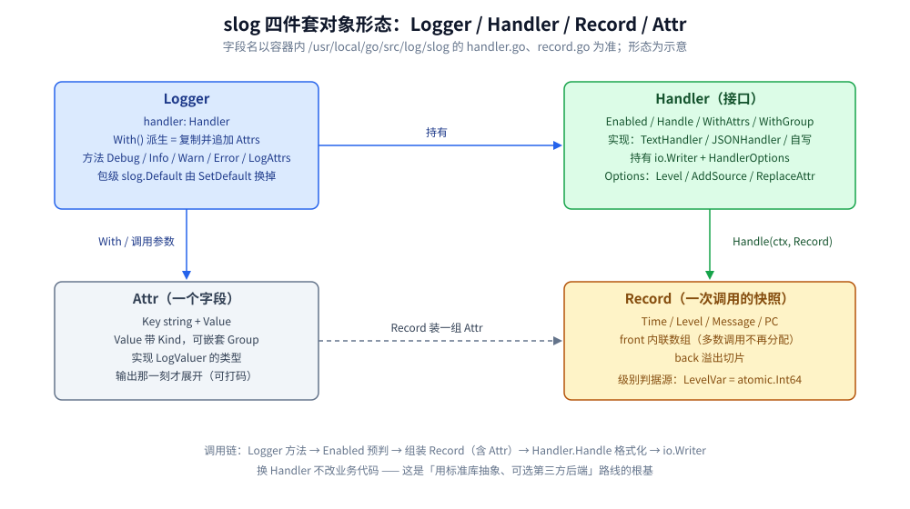
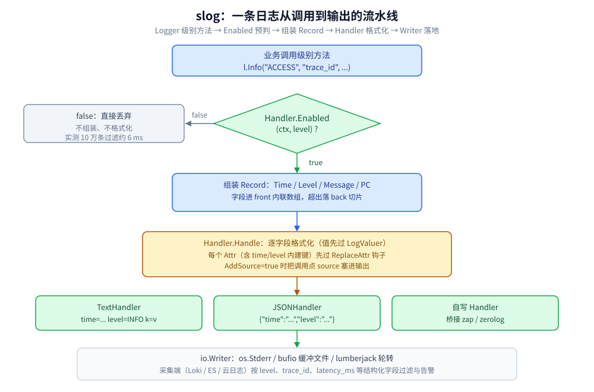

# 日志与错误规范

> 日志体系怎么落地：`slog` 四件套的分工、级别语义与动态调级、结构化字段的命名与必带字段集、
> 标准库与 zap / zerolog / logr 的选型判据、输出落地（轮转 / flush / 防双写），以及日志怎么支撑告警口径。
> 错误只展开「错误 → 日志的映射规则」这一节；`errors.Is/As/Join` 包装链与 panic/recover 机制本身在
> [错误处理.md](../类型与语法/错误处理.md)，本篇不重讲。
>
> 内容整理自个人学习笔记，素材见 [素材清单.md](../../../素材清单.md)。
>
> ⚠️ 本篇全部读数来自容器 `golang:1.26-alpine`（`go version go1.26.8 linux/amd64`）真跑；
> 实验代码在本机 `.workbuddy/tmp/exp/sloglab/`（gitignore，不入仓库），复现命令见第六节。

---

## 一、老 `log` 标准库哪里不够用，才引出 `slog`？

**本节要点**：三条老限制 —— 时间戳只能在固定 flag 组合里选、没有级别、和 `fmt` 各写一路流；
外加一类真实事故：新旧代码双写，同一条故障在日志里出现两行。

### 1.1 时间戳只给几个 flag，不给模板

```go
log.Println("default flags: date + time")
log.SetFlags(log.Lmicroseconds | log.LUTC)
log.Println("Lmicroseconds | LUTC")
```

容器 stderr 原文：

```text
2026/10/07 18:53:47 default flags: date + time
18:53:47.931690 Lmicroseconds | LUTC
```

读法：默认是「`YYYY/MM/DD 时:分:秒`」，不带时区、不带毫秒；换成 `Lmicroseconds | LUTC` 后
**连日期都没了**——flag 是位标志的组合开关，不是格式模板；想输出 RFC3339，
标准库根本没有给格式定制留口子。

### 1.2 没有级别，也就没有过滤

`log.Print*` / `log.Fatal*` 是同一层输出，想让某类消息「线上默认闭嘴、排障时打开」，
只能靠 `if` 手工包裹调用点。级别缺失直接导致两件事做不了：运行时动态调级（第三节）和
按级别过滤的成本优化（3.3 实测被滤掉的一条只有真实输出的约 1/30）。

### 1.3 与 `fmt` 混用：两路流交错 + 双写现场

`log` 默认写 stderr，`fmt.Println` 写 stdout。把两路合并抓（`2>&1`）时，实测里
stdout 的标题行和 stderr 的日志行**互相插队**（同进程缓冲刷新时机不同），照抄顺序都会乱。
更疼的是双写：老代码一行 `log.Println`、新代码一行 `slog.Warn`，同一条故障两行：

```text
legacy line: db query slow
time=2026-10-07T18:53:47.931Z level=WARN msg="slog line: db query slow"
```

第一行是 `log.Println`（无时间戳无级别，因为 demo 前面把 flags 清了），第二行是 `slog`。
聚合端看到的是「一个故障两条记录、字段还不一样」，错误率统计直接失真。

另外注意 `slog` 未 `SetDefault` 时包级函数也能用，但输出是定死的：

```text
INFO via slog.Default uid=42
```

默认 handler 是 TextHandler 写 stderr、级别 Info 起——能用，但等于又一次「隐式出口」，
规范里应当要求显式构造（见第七节）。

### 1.4 桥接老代码：`slog.NewLogLogger`（Go 1.24+）

有些第三方老库只认 `*log.Logger`，不给你注入 handler 的机会。桥接实测：

```go
bridge := slog.NewLogLogger(sl.Handler(), slog.LevelInfo)
bridge.SetPrefix("[legacy-lib] ")
bridge.Println("第三方老库只会用 *log.Logger")
```

```text
time=2026-10-07T18:53:47.931Z level=INFO msg="[legacy-lib] 第三方老库只会用 *log.Logger"
time=2026-10-07T18:53:47.931Z level=INFO msg="prefix 清空后再看，字段里没有 [legacy-lib] 的痕迹"
```

**桥接丢了什么**：`SetPrefix` 的内容被并进 msg 文本（slog 没有 prefix 概念，见下条实测对照行）；
调用点信息指向桥接器内部，`AddSource` 对这类行没有意义。级别则被定死为构造时传的
`LevelInfo`——老库自己「以为」它打的是警告，slog 全记成 INFO。

## 二、slog 的四件套怎么分工？

**本节要点**：`Logger` 管 API、`Handler` 管格式与去向、`Record` 是一次调用的中立快照、
`Attr` 是字段本身；**换 Handler 不改业务代码**是整个体系能立住的根基。

先看对象关系：



**图怎么读**：左上 `Logger` 只持有两样东西——一个 `Handler` 和一组 `With()` 攒下的字段，
`With()` 派生时复制自己再追加；右上 `Handler` 接口只有四个方法，`TextHandler` / `JSONHandler` /
自写实现都塞在这个口子里，实现内部持有 `io.Writer` 和 `HandlerOptions{Level, AddSource, ReplaceAttr}`；
左下 `Attr` 是一个键值对，值带 Kind、可以嵌套 Group，实现 `LogValuer` 的类型到输出那一刻才展开；
右下 `Record` 是单次调用的快照（Time / Level / Message / PC + 一组 Attr），
其中内联数组让多数调用不再额外分配。图内字段命名对照容器内 `log/slog` 源码（2.2、2.3 节原文）。

### 2.1 分工一句话表

| 角色 | 管什么 | 你平时怎么打交道 |
|---|---|---|
| `Logger` | 级别方法入口 + 自带字段的复制 | `slog.New(handler)`、`With()` 派生 |
| `Handler` | 格式化 + 写出目的地 + 级别闸门 | 选 Text/JSON、传 `HandlerOptions`、或自写 |
| `Record` | 一次调用的全部输入的中立表示 | 自写 handler 时才直接接触 |
| `Attr` | 一个结构化字段（键 + 带 Kind 的值） | `slog.String/Int/Any/Group` |

### 2.2 `Handler` 接口：格式化与去向收敛到的唯一出口

`log/slog/handler.go`（容器内 `/usr/local/go`，go1.26.8）的方法签名原样抄录，注释略、行号 33-92：

```go
type Handler interface {
	Enabled(context.Context, Level) bool
	Handle(context.Context, Record) error
	WithAttrs(attrs []Attr) Handler
	WithGroup(name string) Handler
}
```

四条签名各自对应一条工程含义：

- `Enabled` 在**任何参数被处理之前**被调用——这就是过滤便宜的原因（3.3 实测）；
- `Handle` 只在 `Enabled` 为真时被调用，返回的 error **会被 Logger 丢弃**（源码注释明说，
  要感知写失败得自己包一层）；
- `WithAttrs` / `WithGroup` 说明 `With()` 的派生发生在 handler 侧，返回新 handler 而不是改旧的。

### 2.3 `Record`：一次调用的参数快照

`log/slog/record.go` 的字段原样抄录（注释略，行号 20-51）：

```go
type Record struct {
	Time time.Time
	Message string
	Level Level
	PC uintptr
	front [nAttrsInline]Attr
	nFront int
	back []Attr
}
```

值得记住的是 `front` / `back` 这对手写注释里叫「Allocation optimization」的字段：
少量字段直接放在 Record 值里的内联数组，装不下了才落 `back` 切片——
`Logger` 方法按值把 `Record` 传给 `Handle`，配合这个设计才有「典型日志调用几乎零分配」
（6.1 实测每次调用整体只有 1 alloc）。`PC` 是调用点程序计数器，
`AddSource` 打开时 handler 用它换算出 `source` 字段。

### 2.4 一条日志的流水线



**图怎么读**：从上到下是一条 `l.Info(...)` 的真实路径。第一道闸是 `Handler.Enabled`，
返回 false 就直接丢弃、连字段都不格式化（图内「约 6 ms / 10 万条」是 6.3 节的容器实测值，
对比真实输出同量的 165–185 ms）；过了闸才组装 `Record`，每个字段（包括 `time` / `level`
这类内建键）先过 `ReplaceAttr` 钩子再格式化，最后写进 `io.Writer`。
右侧三种 handler 是并列实现——目的地与格式在这里和代码解耦。

### 2.5 `TextHandler` vs `JSONHandler`：同一调用，两种输出

同一句 `Info("user login", "uid", 42, slog.String("ip", "10.0.0.1"))`，容器实测：

```text
time=2026-10-07T18:43:54.721Z level=INFO msg="user login" uid=42 ip=10.0.0.1
{"time":"2026-10-07T18:43:54.722846785Z","level":"INFO","msg":"user login","uid":42,"ip":"10.0.0.1"}
```

三个可对照的细节：text 的时间截到毫秒、json 保留纳秒原值；text 里值带空格和引号转义
（`msg="user login"`），json 是标准 JSON 引号；两者字段顺序都是「内建在前、用户字段在后」。
`AddSource` 打开后的实测行：

```text
{"time":"2026-10-07T18:43:54.722909994Z","level":"INFO","source":{"function":"main.main","file":"/w/.workbuddy/tmp/exp/sloglab/std/main.go","line":26},"msg":"with source"}
```

级别过滤（`HandlerOptions.Level: slog.LevelWarn`）实测：上一行的
`Info("这条不会出现")` 完全没有输出，`WARN` 这行是那次进程里 `warn` logger 唯一的一行。

### 2.6 `ReplaceAttr`：先探测类型，再写断言

需求很常见：level 打小写、时间换格式。第一版照「文档印象」写 `a.Value.Any().(*slog.Level)`，
**静默没生效**——实测输出仍是 `"level":"INFO"`。于是先在钩子里打印类型再写断言：

```text
probe groups=[] key=time valuetype=time.Time
probe groups=[] key=level valuetype=slog.Level
probe groups=[] key=msg valuetype=string
probe groups=[] key=uid valuetype=int64
{"time":"2026-10-07T18:53:47.931835669Z","level":"INFO","msg":"probe builtins","uid":42}
```

go1.26.8 容器里 level 的 `Value.Any()` 是**值** `slog.Level` 而不是指针。改成值断言后（实测输出）：

```go
case slog.LevelKey:
	if lvl, ok := a.Value.Any().(slog.Level); ok {
		a.Value = slog.StringValue(strings.ToLower(lvl.String()))
	}
case slog.TimeKey:
	a.Value = slog.StringValue(a.Value.Time().Format("2006-01-02 15:04:05.000"))
```

```text
{"time":"2026-10-07 18:53:47.931","level":"info","msg":"lowercase level","uid":42}
```

两条规矩：`ReplaceAttr` 会被**每个 Attr（含内建 time/level/msg）加每个用户字段**各调一次，
别在里面做重活；类型断言先探再写——静默失败的断言比 panic 难查得多。

## 三、级别语义怎么定？运行时能不能改？

**本节要点**：Debug / Info / Warn / Error 四级各管一类事；`LevelVar` 让调级不动进程；
过滤是免费的，昂贵字段构造要配 `Enabled` 预判。

### 3.1 四级判据表

| 级别 | 什么时候用 | 不该用的场景 |
|---|---|---|
| Debug | 排障时才想看的中间量：分支走向、外部响应体、缓存命中 | 线上默认开着（量会把磁盘刷穿） |
| Info | 业务事实：请求完成（ACCESS）、任务开始 / 结束、配置生效 | 把每个函数入口都打 Info |
| Warn | 没失败但不对劲：重试成功、降级生效、4xx、接近阈值 | 真正的故障（那是 Error） |
| Error | 该次操作失败且需要人看：5xx、落库失败、错误到了最终处理者 | 每个 `err != nil`（8.1 的一错只打一次） |

判据的核心一句话：**级别是「谁来消费这条日志」的分类**——Debug 给改这段代码的人，
Info 给查这笔业务的人，Warn / Error 给值守告警的人。

### 3.2 `LevelVar`：无锁的动态调级

```go
lv := new(slog.LevelVar) // 默认 LevelInfo
dyn := slog.New(slog.NewJSONHandler(os.Stdout, &slog.HandlerOptions{Level: lv}))
dyn.Debug("debug 被吞")
lv.Set(slog.LevelDebug)
dyn.Debug("LevelVar.Set 后可见")
```

容器实测，第一行**没有任何输出**，第二行：

```text
{"time":"2026-10-07T18:43:54.723021212Z","level":"DEBUG","msg":"LevelVar.Set 后可见"}
```

为什么敢在请求路径上随时读级别？`level.go` 里 `LevelVar` 的实现原样抄录（行 167-169）：

```go
type LevelVar struct {
	val atomic.Int64
}
```

就是一个 `atomic.Int64`，读级别无锁。把它当**全局唯一的级别开关**，配一个 admin 接口或
配置监听去 `Set`，就得到「线上出事时 30 秒打开 Debug、事后关掉」的能力；
级别开关若要跟着配置文件走，与重载快照怎么配合见
[配置热重载与快照.md](配置热重载与快照.md)（同一个「可变配置编译成原子快照」的套路）。

### 3.3 过滤有多便宜：`Enabled` 与 `Logger.Enabled`

`Logger` 在组装任何字段前先问 `Enabled`（2.2 说过它在参数处理之前被调用）。实测
（10 万条四字段 Info，`Level=Warn` 全部滤掉 vs 真实输出，容器）：

```text
JSON Level=Warn（Info 全滤掉）            6.153882ms
JSON → io.Discard                  185.398302ms
```

同脚本第二轮为 6.270337ms vs 165.101018ms——
**过滤一条约 60 ns，真实输出一条约 1.7 µs，差约 26~30 倍**。
所以「Debug 日志多了拖性能」的说法只对一半：被滤掉的 Debug 几乎免费，
花钱的是它真的开着的时候。

另一半是**昂贵字段**：`l.Debug("dump", "payload", buildHugeString())` 里
`buildHugeString()` 在进入 `Debug` 前就已经执行了，`Enabled` 拦不住参数构造。要拦得自己预判：

```go
if req.Enabled(nil, slog.LevelDebug) {
	req.Debug("expensive", "payload", dumpHuge())
}
```

实测这条 `expensive` 从未输出（级别是 Info 时），`dumpHuge()` 一次都没被调用。

### 3.4 别把级别用满

自定义级别（`LevelInfo+1` 之类）语法上合法、`String()` 会显示成 `INFO+1`，但采集端的
过滤、告警、看板全是按四档建的——自定义级别在第一跳就被当成 INFO 或丢掉。规范里直接禁掉更省事。

## 四、结构化字段要守什么规矩？

**本节要点**：命名风格二选一全仓统一；msg 只放稳定的事件名，变量全进字段；
错误文本是字段不是 msg；敏感类型实现 `LogValuer`；请求必带 `trace_id` / `latency_ms` 等可检索字段集。

### 4.1 命名风格：`snake_case` 或 `camelCase`，二选一并全仓锁死

同一字段两种写法在结构化查询里是**两个字段**：`latency_ms` 和 `latencyMs` 在 Loki / ES 里
各算各的，聚合查询查不到全量。slog 本身不校验键名风格（上面实测里 `order_id`、`uid`
照打不误），所以这条只能靠 lint 守：自定义一条「Attr 键名匹配 `^[a-z][a-z0-9_]*$`」
的静态检查（本笔记选 `snake_case`，与 Prometheus 标签习惯一致；选 `camelCase` 也行，
关键是全仓一个）。

### 4.2 msg 是事件名，不是句子

msg 会被聚合端拿来做分组和告警 key，所以它必须**稳定、少变量**。对比实测两行：

```text
{"time":"2026-10-07T18:43:54.723002509Z","level":"INFO","msg":"order created","request_id":"r-7","user":{"id":7,"pwd":"***"},"amount":99}
```

`"msg":"order created"` 是事件名，变量全在字段里。反面写法是
`msg="order 10086 created"`——每条 msg 都不同，按 msg 聚合等于没聚合，告警只能退化成关键字匹配（8.3）。

### 4.3 错误进字段，不进 msg，也别整段塞字符串

```text
{"time":"2026-10-07T18:43:54.722863687Z","level":"ERROR","msg":"db down","err":"file does not exist"}
```

`slog.Any("err", err)` 会把 error 的 `Error()` 文本存进字段。两条分寸：
**别把错误文本拼进 msg**（同 4.2，破坏聚合）；**别把整段堆栈或多行文本塞进单字段**——
一行一条日志是采集端的硬前提，多行内容会断流，栈只在 panic 边界打一次（规矩在
[错误处理.md](../类型与语法/错误处理.md) 第七节）。带结构化的错误（比如业务 code）就在字段里
显式拆：`slog.Int("biz_code", be.Code)`，别让查询端去正则。

### 4.4 敏感字段：`LogValuer` 打码

```go
type Secret string

func (s Secret) LogValue() slog.Value { return slog.StringValue("***") }
```

实测（连同 4.2 那行）：`slog.Any("pwd", Secret("hunter"))` 输出 `"pwd":"***"`——
明文永远到不了 writer。`LogValuer` 是**输出那一刻才调用**的（2.4 流程图黄色框），
所以打码逻辑写在类型上比写在调用点可靠：调用点会忘，类型不会。

### 4.5 请求日志必带字段集

| 字段 | 谁负责加 | 为什么必须有 |
|---|---|---|
| `trace_id` | 入口中间件 `With()`（9.2 样例的 trace-0001） | 跨服务串日志、和 trace 系统对跳（8.2） |
| `user_id` / `tenant_id` | 鉴权中间件 | 「这个用户报错率」类查询的入口 |
| `method` / `path` / `status` | 访问日志中间件 | 错误率、流量、路由维度聚合 |
| `latency_ms` | 访问日志中间件 | P99 直接从日志算，不必等指标系统 |
| `err` | 错误最终处理者 | 8.1：一条错误日志没有 err 等于没打 |

### 4.6 `With()` 派生：分组 logger 与请求级 logger

```go
req := json.With(
	slog.String("request_id", "r-7"),
	slog.Group("user", slog.Int("id", 7), slog.Any("pwd", Secret("hunter"))),
)
```

两种正典用法：**模块级**（`storeLogger := base.With("component", "store")`，
每条自带出处）与**请求级**（在中间件里 `base.With(trace_id...)` 派生一个，随 ctx 传下去，
见「使用」一节与 [context.md](context.md) 的传递套路）。logger 本身并发安全、派生是复制，
所以请求级 logger 不需要 pool。`With()` 攒的字段进 handler 侧（2.2 的 `WithAttrs`），
不在每条调用时重算。

## 五、标准库还是第三方：logr / zap / zerolog 怎么摆？

**本节要点**：四库连字段命名都不统一，切换/混用即看板重写；`logr` 是生态抽象、`slog` 是抽象本身；
要 zap 的性能可以走「自写 handler 桥接」而不必放弃 `slog` 门面。

### 5.1 四库冒烟：同一个事件，四种 JSON

容器实测（同样的 uid=42、status=paid 一条 INFO，各库默认 JSON 输出）：

```text
{"level":"info","ts":1791398995.8493378,"msg":"zap smoke","uid":42,"status":"paid"}
{"level":"info","msg":"logrus smoke","status":"paid","time":"2026-10-07T18:49:55Z","uid":42}
{"level":"info","uid":42,"status":"paid","time":"2026-10-07T18:49:55Z","message":"zerolog smoke"}
{"time":"2026-10-07T18:49:55.850417286Z","level":"INFO","msg":"slog smoke","uid":42,"status":"paid"}
```

时间键 `ts` / `time` 两种、值的形态三种（秒级浮点 / RFC339 截秒 / 纳秒字符串）、
消息键 `msg` / `message` 两种、级别大小写两种、字段顺序都不保证。
**换库 = 全部看板和告警查询重写**，这是选型里比性能硬得多的理由。

### 5.2 logr 与 slog：抽象层 vs 抽象本身

`logr` 是 Kubernetes 生态先做的「结构化日志门面」（`WithName` / `WithValues` / `Info(msg, keysAndValues...)`），
概念和 slog 几乎一一对应，但**没有级别**（只有 V(n) 的 verbosity 整数）。
2026 年的位置判断：新代码直接用 `slog`；存量 k8s 系组件继续 logr，两者有官方互转桥
（logr 可配 slog 后端、slog 可包成 logr），不存在「必须选边」的场景。

### 5.3 想要 zap / zerolog 的速度，两条路

1. **自写 `Handler` 桥接**：实现 2.2 的四方法，`Handle` 里把 `Record` 的字段翻译成
   `zap.Field` / zerolog 事件链——业务代码继续面对 `slog.Logger`，性能与 encoder 生态用 zap 的；
   市面上已有现成桥接包，写之前先搜（**本篇未实测该路线**，只给形态判据）。
2. **zap 侧手写 encoder**：不碰 slog，直接定制 `zapcore.Encoder`，把字段名对齐团队规范（5.1 的教训）。
   代价是团队从此要守两套门面。另外 zap v1.28.0 **没有 `zap.WriteTo` 选项**（容器实测编译错误原文：
   `third/main.go:23:33: undefined: zap.WriteTo`），指写目的地要走 `zapcore.NewCore(enc, zapcore.AddSync(w), lvl)`。

### 5.4 用不用标准库判据表

| 场景 | 选择 | 理由 |
|---|---|---|
| 新服务、日志走 stdout 被采集端接管 | `log/slog` + JSONHandler | 无第三方字段命名税，接口即规范 |
| 存量 zap / zerolog 深度用户（采样、自定义 encoder） | 原库 + 自写 slog handler 对外露 slog 门面 | 沉没资产在 handler 侧，不在调用侧 |
| k8s 生态组件 | logr（可配 slog 后端） | 生态约定 |
| logrus 存量 | 尽快迁 slog 或 zap | 6.2 实测它是最慢档且无结构化优势 |

## 六、性能差距有多大？哪部分才值得省？

**本节要点**：格式化层的差距（ns 级）真实存在但通常不是瓶颈；
`AddSource` 与「逐条 write 不打缓冲」才是实测里看得见的 2~3 倍。

复现命令（所有读数都出自这条命令族的各次运行）：

```bash
MSYS_NO_PATHCONV=1 docker run --rm -v D:/www/dev-notes:/w -w /w/.workbuddy/tmp/exp/sloglab \
  -e GOMODCACHE=/w/.workbuddy/tmp/exp/sloglab/gomodcache -e GOCACHE=/tmp/c \
  golang:1.26-alpine sh -c 'go test -run=NONE -bench . -benchmem ./benchtest'
```

### 6.1 并行 benchmark：看分配次数，别看绝对耗时

`go test -bench`（`-4` 并行，CPU 为 Docker Desktop 虚拟机分到的 i7-6700HQ 核），
统一负载「一条 INFO + 4 字段」，**连跑 3 轮**，B/op 与 allocs/op 三轮完全稳定，ns/op 波动很大：

| 基准 | ns/op（3 轮区间） | B/op | allocs/op |
|---|---|---|---|
| `slog` TextHandler | 1139 ~ 2652 | 13 | 1 |
| `slog` JSONHandler | 1270 ~ 2091 | 13 | 1 |
| zap JSON | 876 ~ 1948 | 256 | 1 |
| zerolog | 143.6 ~ 196.1 | 0 | 0 |

可断言的趋势只有两条：**zerolog 比其余三者快一个量级且零分配**（builder 链复用缓冲）；
slog 与 zap 每次调用各 1 alloc，但字节数差约 20 倍——slog 每条 13 B、zap 每条 256 B
（分配落在哪一侧本篇没有下钻源码，只报读数）。slog vs zap 的先后**三轮里互相反超**（第 1 轮 zap 最快、
第 3 轮 zap 最慢），不许下「谁快多少」的结论。

### 6.2 单进程 10 万条：顺序会被波动搅

手写计时循环（非并行，10 万条四字段 INFO → `io.Discard`），**3 次独立运行**的区间：

| 库 | 10 万条耗时（3 次区间） |
|---|---|
| zerolog | 26.0 ~ 109.2 ms |
| zap | 103.3 ~ 364.1 ms |
| slog JSON | 173.0 ~ 564.7 ms |
| logrus JSON | 564.7 ms ~ 2.437 s |

波动 3~4 倍（宿主机负载所致，容器读数惯例），可断言的只有 **zerolog 始终最快、logrus 始终最慢**（对三次运行而言），
slog 与 zap 互有先后（与 6.1 一致）。logrus 慢是因为
`WithFields(map)` 每条重建排序——它连负载都和别人不一样。

### 6.3 实测里真正看得见的 2~3 倍：源头与出口

同一负载（10 万条）在 slog 内部的对比，两轮运行区间：

| 变体 | 耗时区间 | 相对成本 |
|---|---|---|
| JSON → `io.Discard` | 165 ~ 185 ms | 基准 |
| Text → `io.Discard` | 182 ~ 183 ms | 持平（text/json 格式化差距可忽略） |
| JSON + `AddSource` | 317 ~ 332 ms | **约 1.8 ~ 1.9 倍**：每条 runtime.Callers |
| JSON `Level=Warn` 滤掉 | 6.2 ms | **约 1/28**（3.3 的出处） |
| JSON → 文件，逐条 write | 491 ~ 776 ms（约 13.6 MB） | IO 主导，波动最大 |
| JSON → bufio(256KB) → 文件 | 178 ~ 343 ms | 比逐条 write 快 2.2 ~ 2.9 倍 |

结论顺序清楚了：**先管出口**（加缓冲 / 交给采集端），**再管数量**（级别过滤），
最后才轮到格式化和库的选择。

### 6.4 性能该不该成为「不用 slog」的理由

按 6.3 的单线程口径（格式化到 writer 前约 1.7 µs/条）估算：QPS=1 万、每请求 2 条日志，
约吃掉 4% 单核——值得优化的是**条数**（把 Debug 关掉、ACCESS 别打两遍）而不是换库；
真到了每请求几十条日志的量级，该做的是采样与限流，换库救不了设计。

## 七、输出落地：轮转、flush、防双写

**本节要点**：文件轮转交给 lumberjack（实测切分）或干脆只写 stdout 让采集端管；
带缓冲就必须优雅关闭前 Flush（实测否则最后几行没了）；出口全局唯一 + 桥接旧流是防双写的两板斧。

### 7.1 轮转实测：lumberjack 按 1 MB 切文件

`slog → bufio → lumberjack{Filename:"/tmp/rot/app.log", MaxSize:1, MaxBackups:2}`，
写约 2.8 MB 后容器内 `ls` 实测：

```text
  app-2026-10-07T18-49-59.385.log  1048576 bytes
  app-2026-10-07T18-49-59.426.log  1048576 bytes
  app.log  709569 bytes
```

两个备份精确切在 1048576 B（MaxSize=1 MB），当前文件续写；备份名是「主名-时间戳.log」。
超出 `MaxBackups` 的旧备份会被删（这是文档行为，本次实测只切出 2 个备份、没触发删除）。
若部署本来就是容器 + stdout 被采集端接管（12-factor 路线），
**更简单的做法是不落盘**：`JSONHandler(os.Stdout)` 直接交出去，轮转归容器运行时管——
lumberjack 留给「必须本地落文件」的场景（宿主机进程、审计要求）。

### 7.2 带缓冲就要 flush：实测顺序自证

「使用」一节的 demo 里，handler 的写出端包了一层 `bufio`（6.3 实测快 2 倍多的代价就是
数据会在内存里滞留）。实测输出里，三行 `GET ... ->` 客户端回显在**最前面**，
五条 JSON 日志全部堆在它们之后——因为日志在缓冲区里，直到 `srv.Shutdown` 之后
`out.Flush()` 才落地，最后一条是关闭流程自己打的：

```text
{"time":"2026-10-07T19:00:49.232709335Z","level":"INFO","msg":"shutdown: buffer flushed"}
```

规范：**进程退出路径（signal handler / `Shutdown` 之后）必须 Flush**；
被 SIGKILL 时缓冲里的行必丢，所以崩溃前最关键的几条（如 5xx 的 ERROR）要么不打缓冲、
要么缓冲足够小。

### 7.3 防双写：出口唯一 + 旧流收编

1.2 实测过双写现场。防法两条：
**出口唯一**——全进程只构造一个 `*slog.Logger`（main 里造，沿 [依赖注入.md](依赖注入.md)
的路子注入），任何包不许自己 `slog.New(...)` 写 stderr；
**旧流收编**——`log.SetOutput` 指到 `slog.NewLogLogger(handler, level)`（1.4 实测的桥），
让 std log 系（以及只认 `*log.Logger` 的第三方库）从同一个 handler 流出。
两条都做到，1.3 那种「同一故障两行不同格式」就不可能出现。

## 八、日志、错误、可观测性怎么分工？

**本节要点**：错误 → 日志只有一条映射规则（谁处理谁打，一错只打一次）；
`trace_id` 是日志与 trace 系统对跳的唯一钥匙；告警按结构化字段算，别按关键字匹配。

### 8.1 错误 → 日志的映射规则

包装链怎么建、`Is/As/Join` 怎么用、recover 边界怎么打栈，全部在
[错误处理.md](../类型与语法/错误处理.md)（尤其其第七节「项目里错误处理要守哪些规矩」）。
本篇只取其中与日志有关的一条并给出 demo 实测：
**日志打在「这条错误不再往上抛」的那个点，中间层只包装不打**。
demo 实测（见「使用」一节输出）：

- `/users/2`（404 业务错）：没有 ERROR 行，访问日志以 **Warn** 级打了一行 `ACCESS status=404`——
  业务层与 handler 都没打错误日志，最终处理者把「打过一次」落实在访问日志里；
- `/users/3`（底层连库失败）：恰两行——`service failure`（ERROR，带完整 `err` 链文本）
  + `ACCESS status=500`（ERROR）。两行各管一事：前者给排障的人看原因，后者给统计的人算错误率。

「同一个错误在中间层打一次、出口再打一次」是被实测否定的反模式：聚合端会把这条故障计成 2~N 次。

### 8.2 trace id 怎么进日志

demo 里 `trace_id` 是中间件自增编号（够演示字段结构）。真实链路应当从 trace 上下文取：
接入 [接入Jaeger.md](../可观测性/接入Jaeger.md) 或 [接入Skywalking.md](../可观测性/接入Skywalking.md)
之后，入口中间件从 span context 取 trace id，`base.With(slog.String("trace_id", ...))`
挂到请求级 logger 上——**日志字段名与 trace 系统里的 trace_id 必须同值同键名**，
否则「从告警跳到调用链」这一跳只能靠时间戳肉眼对。跨服务时上游的 trace id 从
`traceparent` 头延续，别自己新开一条。

### 8.3 告警口径：按字段，不按关键字

| 告警 | 正确写法 | 关键字匹配的死法 |
|---|---|---|
| 错误率 | `count(level=ERROR) / count(*)`，或 `status>=500` 的行数占比 | msg 文案一改（`db down` → `database unavailable`）告警哑火 |
| 慢请求 | `latency_ms > 500` 计数 | 没有 `latency_ms` 字段就没法算——4.5 表的意义 |
| 某接口炸了 | `path="/users/{id}" and level>=ERROR` | 双写时期同一故障被计两次（1.3），阈值时灵时不灵 |
| panic | 按 recover 边界的专用事件名 msg 计数 | 按 `goroutine` 文本匹配会把栈样本计成事件 |

错误率类告警的阈值断言要带时间窗（如 5 分钟窗口内错误率 > 1%），单条 ERROR 不叫故障——
这条与 8.1 配合：正因为「一错只打一次」，按条计的错误率才是可信的。

## 九、团队规范要定死哪几条？

**本节要点**：八条能进 checklist 的硬规矩，每条给「为什么」和「怎么检查」；
最后放一张真实请求日志样例作为「合格线」。

### 9.1 八条硬约定

| # | 约定 | 为什么 | 怎么检查 |
|---|---|---|---|
| 1 | 线上只打 JSON、只写 stdout（或唯一文件出口） | 采集端不写正则；双写失控 | grep `NewTextHandler` 出现即打回（本地调试豁免） |
| 2 | msg 用固定事件名（`ACCESS`、`order created`），变量进字段 | msg 是聚合与告警的 key（4.2） | 抽样按 msg 分组，高基数 msg 点名 |
| 3 | 键名风格全仓统一 `snake_case` | 两种写法=两个字段（4.1） | lint 规则 `^[a-z][a-z0-9_]*$` |
| 4 | 错误进 `err` 字段且带完整包装链文本，不进 msg、不塞栈 | 8.1 与采集端一行一条前提 | code review；grep `msg.*err.Error()` |
| 5 | 请求级 logger 在中间件 `With(trace_id)` 创建，随 ctx 传递 | 没有 trace_id 的日志无法定位单次请求 | 查 ACCESS 行是否含 trace_id 字段 |
| 6 | 一错只打一次：中间层只包装返回，最终处理者打 | 8.1，实测反模式计 2~N 次 | 同一 trace_id 同 err 文本出现 >1 即告警演练失败 |
| 7 | 敏感类型实现 `LogValuer`，级别线上默认 Info、Debug 走 `LevelVar` 动态开 | 4.4 类型不会忘；3.2 开 Debug 不重启 | grep 明文口令字段；查 admin 接口有无调级 |
| 8 | `AddSource` 线上不开（约 1.8 ~ 1.9 倍成本，6.3）；缓冲写出必须挂进关闭流程 Flush | 6.3 / 7.2 | main 里检查 `Flush` 是否在 `Shutdown` 之后 |

### 9.2 一条请求的日志应该长什么样

上面八条全过之后，一次 500 请求在日志里应当恰好是两行（摘自「使用」一节容器实测输出）：

```text
{"time":"2026-10-07T19:00:49.232238189Z","level":"ERROR","msg":"service failure","trace_id":"trace-0003","err":"query user 3: dial tcp 127.0.0.1:3306: connect: connection refused"}
{"time":"2026-10-07T19:00:49.232277092Z","level":"ERROR","msg":"ACCESS","trace_id":"trace-0003","method":"GET","path":"/users/3","status":500,"latency_ms":0.061}
```

对着核：JSON 一行一条（规矩 1）；msg 是事件名（2）；键名 snake_case（3）；
错误全文在 `err` 字段且只有最终处理者打了这一次（4、6）；两行同 `trace_id` 可对跳（5）；
`latency_ms`、`status` 供告警直接消费（8.3）。

## 使用：给一个 HTTP handler 接上 slog 请求日志

完整 demo（`sloglab/httpdemo`，140 行，按文件顺序拆三段引用；容器内 `go run ./httpdemo` 实测）。
错误分层与 [错误处理.md](../类型与语法/错误处理.md)「使用」一节同构，本篇关注日志挂在哪：

```go
package main

import (
	"bufio"
	"context"
	"errors"
	"fmt"
	"io"
	"log/slog"
	"net"
	"net/http"
	"os"
	"sync/atomic"
	"time"
)

var errUserNotFound = errors.New("user not found")

// BizError：带对外 code 的语义错误（包装链规矩见错误处理篇）
type BizError struct {
	Code int
	Err  error
}

func (e *BizError) Error() string { return e.Err.Error() }
func (e *BizError) Unwrap() error { return e.Err }

// 存储层：只包装，不打日志
func loadUser(id string) (map[string]any, error) {
	switch id {
	case "1":
		return map[string]any{"id": 1, "name": "alice"}, nil
	case "2":
		return nil, fmt.Errorf("user %s: %w", id, errUserNotFound)
	default:
		return nil, fmt.Errorf("query user %s: %w", id,
			errors.New("dial tcp 127.0.0.1:3306: connect: connection refused"))
	}
}

// 业务层：换成语义错误，仍然不打日志
func GetUser(id string) (map[string]any, error) {
	u, err := loadUser(id)
	if err != nil {
		if errors.Is(err, errUserNotFound) {
			return nil, &BizError{Code: 404, Err: err}
		}
		return nil, &BizError{Code: 500, Err: err}
	}
	return u, nil
}
```

```go
type ctxKey int

var logKey ctxKey

type statusWriter struct {
	http.ResponseWriter
	code int
}

func (w *statusWriter) WriteHeader(c int) { w.code = c; w.ResponseWriter.WriteHeader(c) }

// 请求级 logger：进中间件先 With(trace_id)，错误日志与访问日志共用
func accessMW(base *slog.Logger, next http.Handler) http.Handler {
	var seq atomic.Uint64
	return http.HandlerFunc(func(w http.ResponseWriter, r *http.Request) {
		traceID := fmt.Sprintf("trace-%04d", seq.Add(1))
		l := base.With(slog.String("trace_id", traceID))
		sw := &statusWriter{ResponseWriter: w, code: 200}
		start := time.Now()
		next.ServeHTTP(sw, r.WithContext(context.WithValue(r.Context(), logKey, l)))
		lat := time.Since(start)
		attrs := []any{slog.String("method", r.Method), slog.String("path", r.URL.Path),
			slog.Int("status", sw.code), slog.Float64("latency_ms", float64(lat.Microseconds())/1000)}
		switch {
		case sw.code >= 500:
			l.Error("ACCESS", attrs...)
		case sw.code >= 400:
			l.Warn("ACCESS", attrs...)
		default:
			l.Info("ACCESS", attrs...)
		}
	})
}
```

```go
var routes = func() http.Handler {
	mux := http.NewServeMux()
	mux.HandleFunc("GET /users/{id}", func(w http.ResponseWriter, r *http.Request) {
		u, err := GetUser(r.PathValue("id"))
		l, _ := r.Context().Value(logKey).(*slog.Logger)
		if err != nil {
			var be *BizError
			if !errors.As(err, &be) {
				be = &BizError{Code: 500, Err: err}
			}
			if be.Code >= 500 { // 最终处理者只在这里打一次错误日志
				l.Error("service failure", slog.Any("err", err))
			}
			w.Header().Set("Content-Type", "application/json")
			w.WriteHeader(be.Code)
			if be.Code >= 500 {
				io.WriteString(w, `{"code":500,"msg":"读取用户失败"}`)
			} else {
				io.WriteString(w, `{"code":404,"msg":"用户不存在"}`)
			}
			return
		}
		w.Header().Set("Content-Type", "application/json")
		fmt.Fprintf(w, `{"code":0,"data":%q}`, fmt.Sprint(u))
	})
	return mux
}()

func main() {
	out := bufio.NewWriterSize(os.Stdout, 64*1024)
	base := slog.New(slog.NewJSONHandler(out, nil))
	srv := &http.Server{Handler: accessMW(base, routes)}
	ln, err := net.Listen("tcp", "127.0.0.1:18080")
	if err != nil {
		panic(err)
	}
	go srv.Serve(ln)
	time.Sleep(100 * time.Millisecond)
	cli := &http.Client{Timeout: 2 * time.Second}
	for _, p := range []string{"/users/1", "/users/2", "/users/3"} {
		resp, _ := cli.Get("http://127.0.0.1:18080" + p)
		body, _ := io.ReadAll(resp.Body)
		resp.Body.Close()
		fmt.Printf("GET %s -> %d %s\n", p, resp.StatusCode, body)
	}
	ctx, cancel := context.WithTimeout(context.Background(), 2*time.Second)
	defer cancel()
	if err := srv.Shutdown(ctx); err != nil {
		panic(err)
	}
	out.Flush() // 先冲掉请求期攒在缓冲里的行
	base.Info("shutdown: buffer flushed")
	out.Flush()
}
```

容器实测（stdout；stderr 为空；三条 `GET` 回显先出、日志行因缓冲统一后出，7.2 讲过原因）：

```text
GET /users/1 -> 200 {"code":0,"data":"map[id:1 name:alice]"}
GET /users/2 -> 404 {"code":404,"msg":"用户不存在"}
GET /users/3 -> 500 {"code":500,"msg":"读取用户失败"}
{"time":"2026-10-07T19:00:49.230849353Z","level":"INFO","msg":"ACCESS","trace_id":"trace-0001","method":"GET","path":"/users/1","status":200,"latency_ms":0.029}
{"time":"2026-10-07T19:00:49.231775744Z","level":"WARN","msg":"ACCESS","trace_id":"trace-0002","method":"GET","path":"/users/2","status":404,"latency_ms":0.013}
{"time":"2026-10-07T19:00:49.232238189Z","level":"ERROR","msg":"service failure","trace_id":"trace-0003","err":"query user 3: dial tcp 127.0.0.1:3306: connect: connection refused"}
{"time":"2026-10-07T19:00:49.232277092Z","level":"ERROR","msg":"ACCESS","trace_id":"trace-0003","method":"GET","path":"/users/3","status":500,"latency_ms":0.061}
{"time":"2026-10-07T19:00:49.232709335Z","level":"INFO","msg":"shutdown: buffer flushed"}
```

对着 9.2 的合格线逐条验：404 没有额外的 ERROR 行、500 恰好两行、
响应体里 `connection refused` 一个字都没泄漏（对外只映射 code 的规矩在
[错误处理.md](../类型与语法/错误处理.md)）。demo 里 `accessMW` 的 `seq` 是闭包内计数，
真实服务要放中间件实例级（demo 单入口安全）。

## 延伸追问

- **为什么 `Record` 按值传还号称几乎零分配？** → 因为 `Record` 带一块内联数组（2.3 的
  `front [nAttrsInline]Attr`），字段少时装配不用另开切片；实测每条调用整体只有
  1 alloc / 13 B（6.1）。
- **Debug 日志写多了到底贵不贵？** → 被 `Enabled` 滤掉的约 60 ns/条，真实输出的约
  1.7 µs/条（3.3 实测，差约 30 倍）。贵的是「开着还打得多」，不是「代码里写了」。
- **为什么不用 `log.Print` 加前缀模拟级别？** → 前缀是文本、闸门是运行时行为：
  `log` 没有 `Enabled` 这类预判口（1.2），过滤只能靠调用点 `if`，动态调级无从挂起；
  级别在 slog 里是 handler 的字段（3.2 的 `LevelVar`），不是字符串。
- **想把 zap 换成 slog 门面，业务代码动多少？** → 调用点几乎不动（方法一一对应），
  动的是构造侧：写一个 `Handle` 把 `Record` 翻译成 `zap.Field`（5.3），
  前提是想清楚 5.1 的字段名对齐问题。
- **桥接 std log 会丢什么？** → `SetPrefix` 被并入 msg 文本、调用点指向桥接器内部、
  级别定死为构造参数（1.4 三条实测对照）。
- **进程被 SIGKILL，缓冲里的日志还保得住吗？** → 保不住（7.2）。要减少损失就缩小缓冲
  或关键级别绕过缓冲；「先 Flush 再退出」只能覆盖有序关闭。
- **`latency_ms` 为什么用 float64 不用 `Duration.String()`？** → 数值字段才能直接
  `> 500` 告警（8.3）；字符串要查询端再解析。demo 里 0.013 ~ 0.061 ms 即
  微秒数除以 1000，两位内精度对毫秒级业务够用。

## 关联

- [错误处理.md](../类型与语法/错误处理.md) — 错误侧的姊妹篇：包装链、`Is/As/Join`、recover 闸门与「一错只打一次」的完整论证在其第七节
- [context.md](context.md) — 请求级 logger 随 `context.Context` 传递的同款套路
- [配置热重载与快照.md](配置热重载与快照.md) — 级别开关跟着配置快照走的落地方式
- [依赖注入.md](依赖注入.md) — 「出口唯一」的实现路径：logger 作为注入依赖
- [接入Jaeger.md](../可观测性/接入Jaeger.md) — 日志里 `trace_id` 的真实来源与对跳方式
- [接入Skywalking.md](../可观测性/接入Skywalking.md) — Skywalking 路线下日志与链路的关联
- [可观测性选型对比.md](../../../03-数据与中间件/中间件/可观测性/可观测性选型对比.md) — 日志 / 指标 / trace 三支柱的分工与组件选型
> 反向引用（本篇被下列文档引到）：[数据访问与连接池.md](数据访问与连接池.md)、[HTTP服务端与优雅关停.md](../网络编程/HTTP服务端与优雅关停.md)
