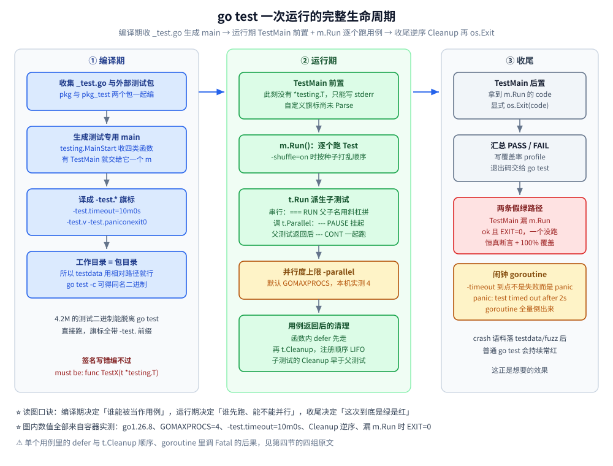

# 测试与Mock

> Go 测试的四类函数与 `go test` 旗标、表驱动与并行子测试、`*testing.T` 的 API 边界、覆盖率与基准的真实读数，以及 Mock 的三条路线怎么选
>
> 内容整理自个人学习笔记，素材见 [素材清单.md](../../../素材清单.md)。
>
> ⚠️ 本篇全部读数来自容器 `golang:1.26-alpine`（`go version go1.26.8 linux/amd64`，`nproc=4`，`cpu: Intel(R) Core(TM) i7-6700HQ CPU @ 2.60GHz`）真跑；
> 编译错误与 panic 原文同样出自该容器的 stderr，基准读数连跑 3 轮取区间并标注波动。

---

## 一、一个 `_test.go` 文件里能写哪四类函数？

**本节要点**：四类函数的**签名是硬约定**，写错了不是"跑不起来"，而是**根本不被当成测试**——静默不执行比报错更危险。
本节的报错原文都是在容器里真写错、真编译出来的。

### 1.1 四类函数与它们的职责

| 类型 | 签名 | 被识别的条件 | 用来验证什么 |
|---|---|---|---|
| 测试 | `func TestXxx(t *testing.T)` | `Test` + 大写字母或数字开头 | 这段逻辑的**结果对不对** |
| 基准 | `func BenchmarkXxx(b *testing.B)` | `Benchmark` + 同上 | 这段逻辑**多快、分配多少** |
| 示例 | `func ExampleXxx()` | `Example` + 后接包里**真实存在**的标识符 | 文档里的用法**是否还和实现一致** |
| 模糊 | `func FuzzXxx(f *testing.F)` | `Fuzz` + 同上 | 输入空间里**有没有没想到的崩溃** |

配套规则：

- 文件名必须以 `_test.go` 结尾，否则编译器不会把 `testing` 的约定套上去；
- 每个测试包的测试文件会被编译成**一个可执行文件**，`main` 由 `go test` 侧的模板生成
  （`cmd/go/internal/load/test.go`，10.4 引了它的原文）；
- `go test -c` 能把这个二进制单独留下（实测 4.2M），直接跑它等价于跑 `go test`：

```text
$ go test -c ./basics/ -o /tmp/basics.test
$ ls -lh /tmp/basics.test
4.2M /tmp/basics.test
$ /tmp/basics.test -test.run "TestPayable/VIP满减" -test.v
=== RUN   TestPayable
=== RUN   TestPayable/VIP满减
--- PASS: TestPayable (0.00s)
    --- PASS: TestPayable/VIP满减 (0.00s)
PASS
```

这条链路解释了后面很多现象：**`go test` 的旗标会被翻译成 `-test.*` 传给测试二进制**，
而测试二进制的**工作目录是被测包自己的目录**（见 2.3）。

### 1.2 签名写错时，编译器的原文

`func TestNoParam()` 这种"少了 `*testing.T`"的写法，实测报错：

```text
/w/.workbuddy/tmp/exp/gotest/exmpl/wrong_sig_test.go:9:1: wrong signature for TestNoParam, must be: func TestNoParam(t *testing.T)
FAIL	example.com/gotest/exmpl [setup failed]
```

⚠️ 加 `-vet=off` **同样报这一行**（实测原文一字不差）——说明这条检查在 `go test` 解析测试文件的阶段，
不在 `go vet`，想绕过它只能把函数名改掉。改名叫 `noParamHelper()` 就"合法"了，代价是**它永远不会被执行**，
而覆盖率报告看起来一切正常。

### 1.3 Example 的 `// Output:` 是真断言

```go
// Package exmpl 演示 Example 函数：// Output: 注释里的文本会被逐行比对，不等就 FAIL。
package exmpl

import "fmt"

// Pay 被测函数：分 → 人民币字符串。
func Pay(fen int64) string {
	return fmt.Sprintf("¥%.2f", float64(fen)/100)
}

// ExamplePay 名字是 Example + 函数名：它不是 Test，但 Output 注释会被真的校验。
func ExamplePay() {
	fmt.Println(Pay(9900))
	fmt.Println(Pay(0))
	fmt.Println(Pay(-1))
	// Output:
	// ¥99.00
	// ¥0.00
	// ¥-0.01
}

// ExamplePay_unordered Output 前面加一行标记，就只比对集合不比对顺序。
func ExamplePay_unordered() {
	fmt.Println(Pay(100))
	fmt.Println(Pay(200))
	// Unordered output:
	// ¥2.00
	// ¥1.00
}
```

真跑（`go test ./exmpl/ -v`）：

```text
=== RUN   ExamplePay
--- PASS: ExamplePay (0.00s)
=== RUN   ExamplePay_unordered
--- PASS: ExamplePay_unordered (0.00s)
PASS
```

期望故意写错一分（`-tags exmismatch`）：

```text
=== RUN   ExamplePay_wrong
--- FAIL: ExamplePay_wrong (0.00s)
got:
¥99.00
want:
¥99.01
FAIL
```

`Example` 的命名也不是随便起：写成 `ExampleUnordered()`（包里没有 `Unordered` 这个标识符）时，
`go vet` 报 `exmpl/example_test.go:23:1: ExampleUnordered refers to unknown identifier: Unordered`。

---

## 二、`go test` 的常用旗标分别管什么？

**本节要点**：默认值全部取自容器里的 `go help testflag`，效果全部真跑过。
记住一条主线：**旗标决定"跑哪些、跑几遍、用什么并发度、要不要插桩"**，不改变被测代码本身。

### 2.1 速查表（默认值 + 实测效果）

| 旗标 | 默认值 | 管什么 | 实测证据 |
|---|---|---|---|
| `-run regex` | 全部 | 按 `父/子` 路径逐级匹配测试函数 | `-run "TestPayable/VIP满减"` 只跑那一条子测试 |
| `-v` | 关 | 打印每个用例的 `RUN/PASS/FAIL` 与 `t.Log` | 见 1.1 |
| `-count n` | 1 | 跑几遍；`-count=0` 只做编译检查 | `-count=2` 两轮全绿，包耗时 0.009s |
| `-cpu list` | GOMAXPROCS | 依次以不同 GOMAXPROCS 跑 | `-cpu=1,2` 输出两组结果 |
| `-parallel n` | **GOMAXPROCS**（容器里 4） | 限制调用 `t.Parallel` 的用例并发数 | `-parallel 1` 整包 0.094s；`-parallel 4` 0.073s |
| `-timeout d` | **10m** | 单个测试二进制的时间预算，超了 panic | TestMain 里打印到 `-test.timeout=10m0s` |
| `-short` | 关 | 让 `testing.Short()` 返回 true | 同一用例 `-short` 下 `--- SKIP` |
| `-shuffle off\|on\|N` | off | 打乱用例顺序并打印随机种子 | `-shuffle=on` 打印 `-test.shuffle 1791397208512277841` |
| `-list regex` | — | 只列名字不执行（**TestMain 仍会跑**） | 列出 5 个 Test，不含 Benchmark/Example |
| `-race` | 关 | 竞态检测插桩 | 需要 cgo（见 2.2） |
| `-cover` / `-coverprofile=f` | 关 | 语句覆盖率 | 见第五节 |
| `-bench regex` | 不跑基准 | 跑基准 | 见第六节 |
| `-benchtime t` | **1s** | 每个基准的目标时长，`Nx` 表示固定次数 | `-benchtime=100x` 的读数被一次性开销污染 |
| `-fuzz regex` / `-fuzztime t` | 关 / **一直跑** | 开启模糊测试 | 见第七节 |

`-list` 有个容易被忽略的细节：**它会完整执行 TestMain**，前置的"连库、建临时目录"照样会跑一遍。

### 2.2 `-race` 在 Alpine 镜像里默认跑不起来

`golang:1.26-alpine` 不带 C 工具链，直接 `-race` 会报：

```text
go: -race requires cgo; enable cgo by setting CGO_ENABLED=1
```

两条出路（第一条是本篇读数的原始来路，第二条是 2026-10-08 复跑时的验证路径）：

```bash
# 出路一：alpine 内现装工具链（要有网；本轮复跑时 apk 拉包超时，未能再次验证）
apk add --no-cache gcc musl-dev
CGO_ENABLED=1 go test -race ./race/

# 出路二：换 Debian 基础镜像，gcc 自带，直接就能跑（本轮用的就是这条）
MSYS_NO_PATHCONV=1 docker run --rm -v D:/www/dev-notes:/w -w /w/.workbuddy/tmp/exp/gotest \
  golang:1.26-bookworm sh -c 'CGO_ENABLED=1 go test -race ./race/'
```

两个镜像里 `go version` 都是 `go1.26.8 linux/amd64`，**下面的报告原文本轮在 `golang:1.26-bookworm` 里复现过**，
除地址与 goroutine 编号外逐行一致（`--- FAIL: TestCounterRace (0.00s)` / `race detected during execution of test`）。

竞态报告原文（刻意留的无锁计数器）：

```text
WARNING: DATA RACE
Read at 0x00c00009a018 by goroutine 9:
  example.com/gotest/race.(*Counter).Add()
      /w/.workbuddy/tmp/exp/gotest/race/race_test.go:12 +0x9c
  example.com/gotest/race.TestCounterRace.func1()
      /w/.workbuddy/tmp/exp/gotest/race/race_test.go:38 +0x97

Previous write at 0x00c00009a018 by goroutine 10:
  example.com/gotest/race.(*Counter).Add()
      /w/.workbuddy/tmp/exp/gotest/race/race_test.go:12 +0xae
      ...
--- FAIL: TestCounterRace (0.00s)
    testing.go:1712: race detected during execution of test
```

两个判读要点：

1. **报告是"一次读 + 一次先前写"的配对**，`Goroutine 9 (running) created at:` 往下会告诉你两个 goroutine 分别是谁起的；
2. ⚠️ **这一轮 `c.n` 恰好等于 2000**（丢更新没发生），FAIL 完全来自 `-race` 而不是断言。
   **竞态 ≠ 一定出错值**，所以"跑一遍结果对"不能当并发安全的证据，必须 `-race`。

加锁版同一形状的用例 `-race` 安静通过（`ok ... 1.091s`）——**耗时从 0.02s 涨到 1.09s 是插桩开销**，不是代码变慢了。

### 2.3 工作目录是被测包目录

`go test` 在**每个包自己的目录**里执行该包的测试二进制。实测一个断言 `os.Stat("go.mod")` 的子测试：

```text
=== RUN   TestSkipAndFatal/必须成功
    main_test.go:122: 工作目录不对：stat go.mod: no such file or directory
--- FAIL: TestSkipAndFatal/必须成功 (0.00s)
```

`go.mod` 在上一级，所以读不到。要读测试数据请用 `testdata/`（`go build`/`go vet` 都会忽略它）：
本篇 golden file 用例就是 `filepath.Join("testdata", t.Name()+".golden")`，直接命中。

---

## 三、表驱动测试怎么写？并行子测试有什么坑？

**本节要点**：表驱动不是"把用例塞进切片"，而是**用名字把用例变成可筛选、可并行、可定位的单位**。

### 3.1 标准骨架

```go
// TestPayableStrong 表驱动：一行一个用例，字段带名字，期望值来自业务规则。
func TestPayableStrong(t *testing.T) {
	tests := []struct {
		name   string
		amount int64
		vip    bool
		want   int64
	}{
		{name: "非VIP原价", amount: 100, vip: false, want: 100},
		{name: "VIP满减", amount: 100, vip: true, want: 90},
		{name: "VIP小额不减", amount: 50, vip: true, want: 50},
	}
	for _, tt := range tests {
		t.Run(tt.name, func(t *testing.T) {
			if got := Payable(tt.amount, tt.vip); got != tt.want {
				t.Errorf("Payable(%d, %v) = %d, want %d", tt.amount, tt.vip, got, tt.want)
			}
		})
	}
}
```

四个约定：

- **字段带名字**（`name:` / `want:`）—— 加字段时不用数位置，读的人也知道 90 是什么；
- **`name` 用中文短语**，子测试名直接进 `-run` 正则，能单独重跑那一条；
- **断言写在 `if` 里而不是引入断言库**，失败信息必须自带"输入 + 实际 + 期望"三件套；
- **循环变量副本不用手写**：Go 1.22 起 `for` 每轮一个新变量（见 [for-range.md](../类型与语法/for-range.md)），
  老代码里的 `tt := tt` 可以删。

### 3.2 `t.Parallel()` 的真实调度：PAUSE / CONT

子测试调 `t.Parallel()` 会**先挂起**，等父测试把所有子测试注册完再一起放行。实测（两个子测试分别 sleep 60ms / 20ms）：

```text
=== RUN   TestParallelSafe/慢
=== PAUSE TestParallelSafe/慢
=== RUN   TestParallelSafe/更快
=== PAUSE TestParallelSafe/更快
=== CONT  TestParallelSafe/慢
=== CONT  TestParallelSafe/更快
    main_test.go:85: 跑了 更快，耗时 20ms
=== NAME  TestParallelSafe/慢
    main_test.go:85: 跑了 慢，耗时 60ms
--- PASS: TestParallelSafe (0.00s)
    --- PASS: TestParallelSafe/更快 (0.02s)
    --- PASS: TestParallelSafe/慢 (0.06s)
```

读法：

- `=== NAME` 是**日志归属被切换**的标记——并行时 A 的日志会插在 B 的输出中间，框架用它声明"接下来这几行属于谁"；
- 父测试显示 `(0.00s)`，但整包耗时是 `-parallel` 的函数：
  `-parallel 1` → `ok example.com/gotest/basics 0.094s`；`-parallel 4` → `ok ... 0.073s`（80ms 的两个用例叠成约 60ms）；
- ⚠️ 子测试自己的 `(0.06s)` 不受 `-parallel` 影响——**它是这个用例的墙钟时间，不是它独占 CPU 的时间**。

### 3.3 共享变量坑：并行用例不许碰父级可变状态

`-parallel 4` 下两个子测试同时在跑，任何父级 slice/map 都是共享写。反面形状：在父测试里 `var rec = &Recorder{}`，
子测试 `t.Parallel()` 后各自 `rec.Add(...)` → 这就是 `-race` 报告里那种"两个 goroutine 写同一地址"。
正确形状是**每个子测试自己 new 一份**（实测 `-race` 通过，`ok example.com/gotest/basics 1.095s`）：

```go
func TestSharedStateWithParallel(t *testing.T) {
	t.Run("A", func(t *testing.T) {
		t.Parallel()
		rec := &Recorder{} // 每个子测试独立实例
		rec.Add("A")
		if rec.N() != 1 {
			t.Errorf("N = %d, want 1", rec.N())
		}
	})
	t.Run("B", func(t *testing.T) {
		t.Parallel()
		rec := &Recorder{}
		rec.Add("B")
		if rec.N() != 2 {
			t.Errorf("N = %d, want 2", rec.N())
		}
	})
}
```

三条相关约束（都有实测原文，见第四节）：

1. 并行用例**不能调 `t.Setenv`**（进程级环境变量是全局状态）；
2. 并行子测试**不能对父 `t` 调 `Fatal` 系列**；
3. 并行子测试里的 `t.Cleanup` 会**在父测试结束之后**才跑——它注册的清理属于那个子测试自己的 goroutine。

### 3.4 什么时候值得并行

| 场景 | 建议 |
|---|---|
| 用例纯计算、微秒级 | **不要并行**，`t.Run` 就够，PAUSE/CONT 反而加噪声 |
| 用例要等外部响应（httptest、DB、文件 IO） | 并行，收益按等待时间算 |
| 用例改全局状态（env、临时目录、包级变量、单例） | 禁止并行 |
| CI 上整包耗时已成瓶颈 | 先拆包（包之间天然并行），再谈 `t.Parallel` |

---

## 四、`*testing.T` 的哪些 API 容易用错？

**本节要点**：`testing` 的 API 不多，但**每一个都有"用错就静默失效"或"用错就崩"的边界**。
下面每条都有容器原文。

### 4.1 `t.Helper()`：不加就把失败甩锅给工具函数

同一个断言，差别只在有没有 `t.Helper()`（行号注释标的是原文件 `tapi/faildemo_test.go` 的真实行号）：

```go
// assertEqNoHelper 忘了 t.Helper()：日志行号落在 helper 内部。
func assertEqNoHelper(t *testing.T, got, want int) {
	if got != want {
		t.Errorf("got %d, want %d", got, want) // 原文件第 16 行
	}
}

// assertEqWithHelper 加了 t.Helper()：日志行号回到调用方。
func assertEqWithHelper(t *testing.T, got, want int) {
	t.Helper()
	if got != want {
		t.Errorf("got %d, want %d", got, want) // 原文件第 24 行
	}
}

func TestHelperLineReport(t *testing.T) {
	t.Run("没有Helper", func(t *testing.T) {
		assertEqNoHelper(t, 1, 2) // 原文件第 31 行
	})
	t.Run("有Helper", func(t *testing.T) {
		assertEqWithHelper(t, 1, 2) // 原文件第 34 行，日志就打在这一行
	})
}
```

实测输出（两个子测试都失败，只有 file:line 不同）：

```text
=== RUN   TestHelperLineReport/没有Helper
    faildemo_test.go:16: got 1, want 2
=== RUN   TestHelperLineReport/有Helper
    faildemo_test.go:34: got 1, want 2
```

`16` 是 `t.Errorf` 那一行（工具函数内部），`34` 是 `assertEqWithHelper(t, 1, 2)` 那一行（用例自己的位置）。
**结论：任何会调 `t.Errorf`/`t.Fatalf` 的辅助函数都必须第一行 `t.Helper()`**，
否则全仓几百个用例的失败信息会全指向同一个文件同一行。

### 4.2 `Errorf` / `Fatalf` / `Fatal`：会不会继续执行

| API | 效果 | 什么时候用 |
|---|---|---|
| `t.Errorf` / `t.Error` | 标记失败，**继续执行**，同一用例能积累多个错误 | 断言后续步骤不依赖这次的值 |
| `t.Fatalf` / `t.Fatal` | `FailNow()` → `runtime.Goexit()`，**本函数立刻终止** | 再往下必然 panic（解引用、取下标） |
| `t.Skipf` / `t.Skip` | 标记跳过并终止本函数 | 前置条件不满足（缺环境变量、`-short`） |
| `t.Logf` | 只记日志；只在 `-v` 或该用例失败时可见 | 别把断言写成 Log |

实测（`Errorf` 后的 `Logf` 出现、`Fatalf` 后的 `Logf` 消失）：

```text
=== RUN   TestFatalVsError/Errorf继续跑
    faildemo_test.go:41: 第一条 Errorf：只标记失败
    faildemo_test.go:42: 第二条 Logf：这行一定会打印 —— Errorf 不终止函数
=== RUN   TestFatalVsError/Fatalf立刻终止
    faildemo_test.go:45: 第一条 Fatalf：内部是 FailNow → runtime.Goexit
```

失败消息本身也是接口的一部分，`%+v` 打结构体字段名最省解释成本：

```text
    faildemo_test.go:56: 订单不符
          got = {ID:o-1 Amount:95}
         want = {ID:o-1 Amount:90}
```

### 4.3 `t.Cleanup` 是 LIFO，而且**晚于函数内的 `defer`**

`Cleanup` 的注册顺序决定执行顺序（后注册先执行）。实测：

```text
    api_test.go:31: 用例内 TempDir = /tmp/TestCleanupOrder775835940/001
    api_test.go:14: cleanup 实际触发顺序 = [确认TempDir已删 B A]
```

注册顺序是「打印列表 → A → B → 检查目录已消失 →（`t.TempDir()` 自己注册的删除清理）」，
于是执行顺序倒过来：先删目录，再验证目录没了，再 B、A，最后打印。

⚠️ **真实踩坑（MySQL 集成测试）**：用 `defer db.Close()` 关连接池，
删表清理注册在 `t.Cleanup` 里，就会拿到已关闭的句柄：

```text
    mysql_test.go:43: 删表失败: sql: database is closed
--- FAIL: TestOrderUpsert (0.11s)
```

改成"关闭也写 `t.Cleanup`，且**注册在最前面**"之后，两轮 `-count=2` 全绿。
记忆口径：**函数体 `defer` → 测试自身的清理 → `t.Cleanup` 链**，
所以资源释放要么全用 `defer`，要么全用 `t.Cleanup` 且注意注册顺序，别混着放。

### 4.4 `t.Setenv` 与 `t.Parallel` 互斥

```text
--- FAIL: TestSetenvAfterParallel (0.00s)
panic: testing: test using t.Setenv, t.Chdir, or cryptotest.SetGlobalRandom can not use t.Parallel [recovered, repanicked]
```

这是**设计上的取舍**而不是实现偷懒：环境变量是进程级全局状态，并行用例改它必然互相干扰。
`Setenv` 的自动恢复实测有效（子测试改 `inner`，结束后父测试读到 `outer`）。

### 4.5 在 goroutine 里调 `Fatal` 系列：两种结局，都不是你以为的

**结局一：不崩，但只有那个 goroutine 死了**（`t.Fatalf` 起在 `go func` 里）：

```text
=== RUN   TestFatalInGoroutine
    crashtest_test.go:19: 在子 goroutine 里调用 Fatal 系列
    crashtest_test.go:22: 主测试 goroutine 还在跑
--- FAIL: TestFatalInGoroutine (2.00s)
```

`runtime.Goexit` 终止的是**调用它的 goroutine**：错误被记进 `t`、用例被标记失败，
但测试主流程照常跑完那 2 秒 sleep。也就是说 **`Fatal` 在子 goroutine 里的"立刻停止本次测试"承诺根本不成立**。

**结局二：真崩**（在子测试函数体里对**父测试的 `t`** 调 `Fatal`——并行/等待回调场景的常见写法）：

```text
=== NAME  TestParentFatalFromSubtest
    crashtest_test.go:46: 在子测试里对父测试的 t 调用 Fatal
=== NAME  TestParentFatalFromSubtest/child
    testing.go:1913: test executed panic(nil) or runtime.Goexit: subtest may have called FailNow on a parent test
--- FAIL: TestParentFatalFromSubtest (0.00s)
```

**正确做法**：goroutine 里只往 channel 发错误，由测试主 goroutine 收到后决定 `t.Fatal`；
`wg.Wait()` 之后再断言。（Goexit 与 panic 的机制见 [defer.md](../类型与语法/defer.md)，
协程泄漏的后果见 [协程泄漏与死锁.md](../并发编程/协程泄漏与死锁.md)。）

**顺带一个反直觉读数**：拿着**已经结束的子测试的 `t`** 继续 `t.Log`，**不会报错也不会 panic**——
日志被静默挂到父测试名下（实测 `--- PASS`）。这类"错但不报"的 API 泄漏只能靠 review 拦。

### 4.6 测试超时的原文长什么样

`-timeout=2s` 跑一个 sleep 10s 的用例：

```text
panic: test timed out after 2s
	running tests:
		TestSleepy (2s)

goroutine 5 [running]:
testing.(*M).startAlarm.func1()
	/usr/local/go/src/testing/testing.go:2802 +0x354
created by time.goFunc
	/usr/local/go/src/time/sleep.go:215 +0x2d
```

`running tests:` 这一段是**唯一直接告诉你"谁卡住"的信息**，后面的全量 goroutine dump 用来定位它卡在哪个调用上。
默认 10m 对单包通常够；集成测试（起容器、灌数据）建议显式 `-timeout=5m` 并在 `TestMain` 里做前置，
而不是让每个用例各自等。

---

## 五、覆盖率能证明什么？为什么说 100% 覆盖不等于测对了？

**本节要点**：覆盖率统计的是**语句被执行过**（`-covermode=set`），它不知道你有没有断言。
下面是一个实测的 100% 绿灯 + 潜伏 bug 的最小样本。

### 5.1 反例：100% 覆盖、断言恒真、bug 全绿

被测代码故意留了个 bug（业务规则是 VIP 满 100 减 10，实现写成减 5）：

```go
// Payable 应付金额。
func Payable(amount int64, vip bool) int64 {
	if vip && amount >= 100 {
		return amount - 5
	}
	return amount
}

// IsVIP level > 0 即 VIP。
func IsVIP(level int) bool {
	return level > 0
}
```

"只断言金额不为负"的弱测试（断言写在测试文件的辅助函数里，不进覆盖率统计）：

```go
func TestPayableWeak(t *testing.T) {
	cases := []struct {
		amount int64
		vip    bool
	}{
		{50, false},
		{100, false},
		{50, true},
		{100, true},
	}
	for _, c := range cases {
		got := Payable(c.amount, c.vip)
		nonNegative(t, got)
	}
	nonNegative(t, Payable(100, IsVIP(1)))
}

func nonNegative(t *testing.T, v int64) {
	t.Helper()
	if v < 0 {
		t.Errorf("金额 %d 为负", v)
	}
}
```

实跑：

```text
=== RUN   TestPayableWeak
--- PASS: TestPayableWeak (0.00s)
PASS
coverage: 100.0% of statements
ok  	example.com/gotest/cover	0.009s	coverage: 100.0% of statements
```

**100.0%，全绿，bug 一个没抓到。** 同一份代码换成期望值正确的表驱动测试（3.1 那份）：

```text
=== RUN   TestPayableStrong/VIP满减
    strong_test.go:21: Payable(100, true) = 95, want 90
--- FAIL: TestPayableStrong (0.00s)
    --- PASS: TestPayableStrong/非VIP原价 (0.00s)
    --- FAIL: TestPayableStrong/VIP满减 (0.00s)
    --- PASS: TestPayableStrong/VIP小额不减 (0.00s)
```

⚠️ 更扎心的一点：**两个测试一起跑时覆盖率仍然是 100.0%**——覆盖率只说"语句被跑过"，
它既不会因为断言变强而升高，也不会因为红灯而降低。**覆盖率和断言强度是两个正交的维度。**

### 5.2 读覆盖率的两条命令

```bash
go test ./cover/ -run TestPayableWeak -coverprofile=/tmp/cover.out
go tool cover -func=/tmp/cover.out
```

实测：

```text
example.com/gotest/cover/impl.go:6:	Payable		100.0%
example.com/gotest/cover/impl.go:14:	IsVIP		100.0%
total:					(statements)	100.0%
```

profile 文件本身是**按代码块区间**记录的，换成 `-covermode=count` 就能看到执行次数：

```text
mode: count
example.com/gotest/cover/impl.go:6.44,7.26 1 5
example.com/gotest/cover/impl.go:7.26,9.3 1 2
```

第二列是语句块，第三列是命中次数——`count` 模式能看出"这条分支只被一个用例走过吗"，
`set` 只说明"走过没有"。默认模式是 `set`，**开了 `-race` 会自动变 `atomic`**（`go help testflag` 原文）。

### 5.3 覆盖率的三个统计陷阱

| 陷阱 | 说明 |
|---|---|
| 测试文件不计入 | `nonNegative` 这类断言辅助函数永远不出现在报告里，别以为"没覆盖" |
| `-coverpkg` 才会跨包 | 默认只统计**被测包自己的语句**；集成测试跑的是 `service` 层，DAO 层算不进去时要用 `-coverpkg=./...` |
| 语句 ≠ 判定 | `if vip && amount >= 100` 是一个语句块，短路条件的**四种组合**要靠表驱动自己铺 |

判断"覆盖率高有没有用"只看一件事：**把被测代码里的一个常量改错，测试会不会红**。
这个 mutation 动作可以手工做一次，比任何百分比数字都可靠。

---

## 六、基准测试怎么读？两个微基准陷阱

**本节要点**：`b.N` / `b.Loop` 的区别是"计时语义"，两个微基准陷阱的本质都是**编译器把你要量的东西优化没了**。
读数连跑 3 轮取区间，只断言趋势。

### 6.1 计时相关的 API

| API | 语义 | 什么时候必须用 |
|---|---|---|
| `for i := 0; i < b.N; i++` | 经典写法，`b.N` 由框架逐步放大 | 需要 `StopTimer` 前后做准备工作时 |
| `for b.Loop()` | Go 1.24+，编译器知道"这就是被测次数"，准备段天然在外 | 新代码默认用这个；同一函数里**不能和 `b.N` 混用** |
| `b.ResetTimer()` | 把之前的时间清零 | `b.N` 写法下，构造输入数据的耗时不算进读数 |
| `b.StopTimer()` / `b.StartTimer()` | 暂停/恢复计时 | 并行基准里给"分配 worker"这类开销让路 |
| `b.ReportAllocs()` | 附带 `B/op`、`allocs/op` | 任何关心分配的基准（等价于 `-benchmem`） |
| `b.RunParallel(func(pb *testing.PB))` | 按 GOMAXPROCS 铺开并发 | 量锁、原子操作、并发容器 |
| `testing.AllocsPerRun(n, f)` | 直接给出**每次调用的分配次数** | 想在普通 `Test` 里断言"零分配"时 |

跑法（`-run '^$'` 表示不跑任何测试函数，只跑基准）：

```bash
go test ./bench/ -run "^$" -bench=. -benchmem
```

### 6.2 陷阱①：接口调用会被去虚化

同一件事写三种，看编译器给了什么价：

```go
type Adder interface{ Add(a, b int) int }

type adderA struct{}

func (adderA) Add(a, b int) int { return a + b }

type adderB struct{}

func (adderB) Add(a, b int) int { return a + b + 1 }

//go:noinline
func sinkInt(v int) int { return v }

//go:noinline
func pickAdder(i int) Adder {
	if i%2 == 0 {
		return adderA{}
	}
	return adderB{}
}

// singleAdder 全程序只被赋过一种具体类型。
var singleAdder Adder = adderA{}

func BenchmarkConcreteAdd(b *testing.B) {
	b.ReportAllocs()
	for b.Loop() {
		_ = sinkInt(adderA{}.Add(3, 4))
	}
}

func BenchmarkIfaceSingleImpl(b *testing.B) {
	b.ReportAllocs()
	for b.Loop() {
		_ = sinkInt(singleAdder.Add(3, 4))
	}
}

func BenchmarkIfaceTwoImpls(b *testing.B) {
	b.ReportAllocs()
	var i int
	for b.Loop() {
		i++
		_ = sinkInt(pickAdder(i).Add(3, 4))
	}
}
```

三轮实测（ns/op，越低越快）：

| 基准 | 第 1 轮 | 第 2 轮 | 第 3 轮 | 区间 |
|---|---|---|---|---|
| `BenchmarkConcreteAdd` | 2.254 | 2.675 | 2.224 | 2.224–2.675 |
| `BenchmarkIfaceSingleImpl` | 5.071 | 4.592 | 4.748 | 4.592–5.071 |
| `BenchmarkIfaceTwoImpls` | 6.330 | 6.621 | 6.158 | 6.158–6.621 |

趋势是稳定的：**具体类型直调 < 单一实现的接口调用 < 多实现交替的接口调用**。
中间那一档之所以便宜，是因为只有一种动态类型时编译器能把虚调用折成直接调用（去虚化）；
一旦接口值来自 `//go:noinline` 的函数、且有两种具体类型交替，itab 间接调用才会被量到。

⚠️ **这就是"用基准证明接口有额外开销"最容易失败的写法**：
如果被测对象是包级变量、全程序只见过一种实现，你会量到接近 0 的额外成本，
从而得出"接口没有开销"的错误结论。**要量虚调用，就必须让动态类型对优化器不可知**。

### 6.3 陷阱②：常量装箱会被优化掉

```go
//go:noinline
func boxAny(v any) any { return v }

var boxSink any

func BenchmarkBoxConst(b *testing.B) {
	b.ReportAllocs()
	for b.Loop() {
		_ = boxAny(42)
	}
}

func BenchmarkBoxSmallRuntime(b *testing.B) {
	var n int
	b.ReportAllocs()
	for b.Loop() {
		n++
		boxSink = boxAny(n & 63)
	}
}

func BenchmarkBoxLargeRuntime(b *testing.B) {
	var n int64 = 1 << 40
	b.ReportAllocs()
	for b.Loop() {
		n++
		boxSink = boxAny(n)
	}
}
```

| 基准 | 第 1 轮 | 第 2 轮 | 第 3 轮 | B/op | allocs/op |
|---|---|---|---|---|---|
| `BenchmarkBoxConst` | 2.677 | 4.212 | 2.586 | 0 | 0 |
| `BenchmarkBoxSmallRuntime` | 5.087 | 4.882 | 4.791 | 0 | 0 |
| `BenchmarkBoxLargeRuntime` | 32.36 | 24.95 | 38.42 | 8 | 1 |

三档各有原因：

- **常量装箱**：值和时间都来自编译期，装箱结果可以直接进静态数据 → 0 分配、几乎 0 耗时。
  **你以为在量装箱，其实在量一个被折掉的表达式**；
- **运行期小整数**：`runtime.staticuint64s` 预分配表覆盖 0~64，装箱不分配 → 0 allocs；
- **运行期大整数**：超出预分配表，`convT64` 真的分配 8 字节 → 1 allocs/op，耗时高一到两个数量级。

`testing.AllocsPerRun` 能直接在 `Test` 里复现这个对比（实测原文）：

```text
=== RUN   TestAllocsPerRun
    bench_test.go:219: 常量装箱 = 0 次分配/调用；运行期装箱 = 1 次分配/调用
--- PASS: TestAllocsPerRun (0.00s)
```

**两个陷阱是同一条纪律的两面：值必须以参数形式传进 `//go:noinline` 的函数、结果必须真的被消费掉**
（`boxSink =` 这种包级写入），否则 `for b.Loop()` 会被判定为无副作用。
另外，内联与优化本身可以用编译旗标关掉再对照，见 [编译与gcflags.md](编译与gcflags.md)。

### 6.4 并行基准与 `-cpu` 阶梯

```bash
go test ./bench/ -run "^$" -bench "ParallelMap|ShardedMap" -benchtime=2s -cpu=1,2,4
```

实测（ns/op，同一台机器、同一容器，波动明显，只看趋势）：

| 基准 | cpu=1 | cpu=2 | cpu=4 |
|---|---|---|---|
| `BenchmarkParallelMap`（全局一把锁） | 43.10 | 89.90 | 109.1 |
| `BenchmarkShardedMap`（16 片 + 填充） | 55.02 | 92.15 | 80.23 |

- 单锁版本随并行度**单调变差**：4 个 P 都在同一把锁上排队；
- 分片版本 4 P 时反超单锁（80.23 < 109.1），但**分片自己引入了新的共享写**
  （全局 `atomic.Uint64` 取序号），所以差距远没有理论上的 16 倍；
- ⚠️ 单个数字不要当结论用：这组读数在三轮之间的摆动可以到 ±40%。

**伪共享不在本篇重讲**：分片结构体为什么要填充到 64 字节、以及"填充前 40.24 ns/op、
填充后 8.632 ns/op"那组对照读数，见 [atomic操作.md](../并发编程/atomic操作.md)；
本篇的分片基准只是**用它给出的形状**去量锁竞争，**两组数字不可混用、不可互相换算**。

### 6.5 `-benchtime=100x` 与"校准轮次"的坑

固定次数模式适合"量一个有副作用、不能反复跑的操作"，代价是**一次性开销不再被摊薄**：

```text
BenchmarkParallelMap-4   	     100	       236.0 ns/op	      27 B/op	       0 allocs/op
BenchmarkShardedMap-4    	     100	       179.0 ns/op	      51 B/op	       0 allocs/op
```

对比 6.4 里 `-benchtime=2s` 的 109.1 / 80.23 ns/op——同样的代码，次数一少读数就整体抬高，
`B/op` 也从 0 变成 27/51（首轮建 map 的分配）。**固定次数模式下的 `B/op` 不能拿来断言"零分配"。**

⚠️ 更隐蔽的是**校准轮次**：`b.RunParallel` 在做正式测量前会用极小的 `b.N` 试跑一轮。
如果在 `b.StopTimer()` 之后断言"16 个分片都被写过"，会在那一轮直接失败：

```text
--- FAIL: BenchmarkShardedMap
    bench_test.go:199: 非空分片数 = 1, want 16
```

修法是把累计量断言**加上 `b.N` 门槛**（实测修复后能同时打印两轮：
`本轮 b.N=1，非空分片 1 个` / `本轮 b.N=100，非空分片 16 个`）：

```go
b.StopTimer()
total := 0
for i := range pads {
	total += len(pads[i].m)
}
// 校准轮次 b.N 可能只有 1，这时"16 个分片都被写过"根本不成立。
if b.N >= shards && total != shards {
	b.Fatalf("非空分片数 = %d, want %d", total, shards)
}
```

同一道理适用于任何"在基准末尾检查累计状态"的写法：**基准的循环次数是框架决定的，不是你决定的**。

---

## 七、Fuzz 测试怎么跑？崩溃语料放哪里？

**本节要点**：fuzz = 种子语料 + 覆盖率引导的变异 + **崩溃即回归用例**。
本节的 crash 文件是容器里真跑出来的（5 秒预算，0.05 秒命中）。

### 7.1 一个真的有 bug 的函数

```go
// SplitAfterFirst 按 sep 切开，返回前半段与"分隔符之后的第一个字符"；没有 sep 时返回整串与尾字符。
// ⚠️ bug：入参是空串时 s[len(s)-1] 越界 panic；sep 命中但后半段为空时 tail[0] 同样越界。
func SplitAfterFirst(s, sep string) (string, byte) {
	head, tail, found := strings.Cut(s, sep)
	if !found {
		return head, s[len(s)-1]
	}
	return head, tail[0]
}

// FuzzSplitAfterFirst 种子只是起点，fuzz 引擎会在种子上做变异。
func FuzzSplitAfterFirst(f *testing.F) {
	f.Add("order-id=1001", "=")
	f.Add("a,b,c", ",")
	f.Fuzz(func(t *testing.T, s, sep string) {
		if sep == "" {
			t.Skip("空分隔符不在函数契约内")
		}
		SplitAfterFirst(s, sep)
	})
}
```

不写 `func Fuzz` 只跑普通测试时，`f.Add` 的种子会被当成用例逐个执行（实测）：

```text
=== RUN   FuzzSplitAfterFirst/seed#0
=== RUN   FuzzSplitAfterFirst/seed#1
--- PASS: FuzzSplitAfterFirst (0.00s)
    --- PASS: FuzzSplitAfterFirst/seed#0 (0.00s)
    --- PASS: FuzzSplitAfterFirst/seed#1 (0.00s)
```

**种子全绿不代表函数安全**——种子只是"你想得到的输入"。

### 7.2 开跑：`-fuzz` + `-fuzztime`

```bash
go test ./fuzz/ -fuzz=FuzzSplitAfterFirst -fuzztime=5s
```

真实输出（给 5 秒预算，0.05 秒就命中）：

```text
fuzz: elapsed: 0s, gathering baseline coverage: 0/2 completed
fuzz: elapsed: 0s, gathering baseline coverage: 2/2 completed, now fuzzing with 4 workers
fuzz: elapsed: 0s, execs: 11 (231/sec), new interesting: 0 (total: 2)
--- FAIL: FuzzSplitAfterFirst (0.05s)
    --- FAIL: FuzzSplitAfterFirst (0.00s)
        testing.go:1927: panic: runtime error: index out of range [0] with length 0
            goroutine 27 [running]:
            ...
            example.com/gotest/fuzz.SplitAfterFirst({0xb1a94e1a4b7, 0x1}, {0x6702a0?, 0x4?})
            	/w/.workbuddy/tmp/exp/gotest/fuzz/fuzz_test.go:16 +0xbf
            example.com/gotest/fuzz.FuzzSplitAfterFirst.func1(0xb1a9810cb48, {0xb1a94e1a4b7, 0x1}, {0x6702a0, 0x1})
            	/w/.workbuddy/tmp/exp/gotest/fuzz/fuzz_test.go:27 +0x10b
    Failing input written to testdata/fuzz/FuzzSplitAfterFirst/00e15d22123489fd
    To re-run:
    go test -run=FuzzSplitAfterFirst/00e15d22123489fd
```

读法：

- `now fuzzing with 4 workers` = GOMAXPROCS；`execs: 11 (231/sec)` 是执行速率；
- `new interesting: 0 (total: 2)` 说的是**新发现的"能走到新代码路径"的输入**有几个，这是覆盖率引导的核心；
- `fuzz_test.go:16` 精确指到越界那一行（`return head, tail[0]`），`{0xb1a94e1a4b7, 0x1}` 是当时的实参（长度 1 的串）。

### 7.3 最小化与语料目录

框架命中崩溃后会先**把输入缩小**再落盘，落盘文件全文如下（`0x`/`00e15d...` 是内容哈希）：

```text
testdata/fuzz/FuzzSplitAfterFirst/00e15d22123489fd
```

```text
go test fuzz v1
string("0")
string("0")
```

`("0", "0")` 就是最小反例：`strings.Cut("0", "0")` 命中分隔符、后半段为空串，`tail[0]` 越界。
最小化的预算由 **`-fuzzminimizetime`（默认 60s）** 控制，每个 crasher 都要花这段时间尝试缩小；
批量 fuzz 时常常被调小到 `-fuzzminimizetime=1s`（实测这样能跑，代价是反例可能不够小）。

语料的三层存放位置，作用各不相同：

| 位置 | 内容 | 谁写谁读 |
|---|---|---|
| `f.Add(...)`（代码里） | 种子语料 | 你写；`go test` 不带 `-fuzz` 时也会逐个执行 |
| `testdata/fuzz/FuzzXxx/*` | **用例语料**，含 crasher | 框架写、你审；**要提交进版本库** |
| `$GOCACHE/fuzz/<模块>/<目标>` | 覆盖语料缓存 | 框架自用，跨机器不共享，别提交 |

### 7.4 crasher 落地之后，它就是一条普通回归用例

只要 `testdata/fuzz/FuzzSplitAfterFirst/00e15d22123489fd` 还在，**不带 `-fuzz` 的普通 `go test` 也会红**：

```text
=== RUN   FuzzSplitAfterFirst/00e15d22123489fd
    --- FAIL: FuzzSplitAfterFirst/00e15d22123489fd (0.00s)
panic: runtime error: index out of range [0] with length 0 [recovered, repanicked]
```

再开 `-fuzz` 时，框架会**先回放语料**，一发现旧 crasher 就停：

```text
fuzz: elapsed: 0s, gathering baseline coverage: 0/3 completed
failure while testing seed corpus entry: FuzzSplitAfterFirst/00e15d22123489fd
```

所以正确顺序是：**先修被测函数，再删语料文件，最后重跑 fuzz 确认没有新 crasher**。
别把"CI 变红"当成 fuzz 的副作用——它正是 fuzz 唯一有价值的产出。

补两条实测原文（两个坏包藏在 `-tags faildemo` 后面，`go test ./fuzzsig/ ./fuzzsig2/ -tags faildemo` 才编译）：
**目标函数的参数类型不在支持列表里**、以及 **`f.Add` 的实参类型和目标不一致**。

参数用了结构体（`f.Fuzz(func(t *testing.T, p pair) ...)`）——编译期就被 vet 拦下，并给出完整白名单：

```text
fuzzsig2/bad_test.go:14:30: fuzzing arguments can only have the following types: string, bool, float32, float64, int, int8, int16, int32, int64, uint, uint8, uint16, uint32, uint64, []byte
FAIL	example.com/gotest/fuzzsig2 [build failed]
```

目标签名收 `int`、但 `f.Add` 只给了两个 `string`（`f.Add("0", "0")`）——报的是**两边不匹配**，不是"不支持 `int`"：

```text
fuzzsig/bad_test.go:13:13: mismatched type in call to (*testing.F).Add: string, fuzz target expects int
FAIL	example.com/gotest/fuzzsig [build failed]
```

⚠️ 两条都是 `[build failed]`，也就是**在编译/vet 阶段就红**，不会等到跑起来才炸；
支持的类型只有那 14 种（`[]byte` 与 `string` 各自算一种），要模糊更复杂的输入就自己编码成 `string` 再解。

---

## 八、Mock 有三条路线，怎么选？

**本节要点**：mock 的成本不是"写不写得出来"，而是**"它错了会不会骗过你"**。
三条路线的失真度依次降低、搭建成本依次升高。

### 8.1 路线①：手写 interface 假实现（默认推荐）

被测的 service 只依赖接口，这就是可测性的起点：

```go
// ErrNotFound 仓储层的「不存在」语义错误。
var ErrNotFound = errors.New("user not found")

// UserRepo 用户仓储接口：service 只认这个契约。
type UserRepo interface {
	Get(id int64) (name string, err error)
	Save(id int64, name string) error
}

// Greet 把 NotFound 转成「陌生人」，其它错误加上下文向上抛。
func (s *Service) Greet(id int64) (string, error) {
	name, err := s.repo.Get(id)
	if errors.Is(err, ErrNotFound) {
		return "陌生人", nil
	}
	if err != nil {
		return "", fmt.Errorf("查询用户 %d 失败: %w", id, err)
	}
	return "你好，" + name, nil
}
```

假实现只要 12 行，而且**"可编程返回值 + 记录调用序列"两个能力一起到位**：

```go
type fakeRepo struct {
	names map[int64]string
	err   error // 故障注入用
	calls []string
}

func (f *fakeRepo) Get(id int64) (string, error) {
	f.calls = append(f.calls, fmt.Sprintf("Get(%d)", id))
	if f.err != nil {
		return "", f.err
	}
	if n, ok := f.names[id]; ok {
		return n, nil
	}
	return "", ErrNotFound
}

func (f *fakeRepo) Save(id int64, name string) error {
	f.calls = append(f.calls, fmt.Sprintf("Save(%d,%s)", id, name))
	if f.err != nil {
		return f.err
	}
	f.names[id] = name
	return nil
}
```

表驱动三个分支（命中 / NotFound / 仓储故障）全绿，并且能断言协作方式（实测）：

```text
--- PASS: TestGreet (0.00s)
    --- PASS: TestGreet/命中用户 (0.00s)
    --- PASS: TestGreet/用户不存在被业务吞掉 (0.00s)
    --- PASS: TestGreet/仓储故障要上抛 (0.00s)
    fake_test.go:114: 调用序列 = [Get(1)]
--- PASS: TestGreetDoesNotWrite (0.00s)
```

`-race` 下同样通过（`ok example.com/gotest/mockdemo 1.034s`）。
手写假的两个隐性优势：**能顺手断言"读操作里绝不能有写"**（`calls` 里没有 `Save` 前缀），
以及**接口一改编译器立刻在所有假实现上报缺方法**——生成器要重跑才知道。

### 8.2 路线②：代码生成（go.uber.org/mock / mockery）

⚠️ 依赖下载只设 `GOPROXY`，**不要设 `GOSUMDB=off`**（设了会报 `checksum database disabled`）。
容器里实测两种模式都通得过：

```bash
GOPROXY=https://goproxy.cn,direct go run go.uber.org/mock/mockgen@latest \
  -source=mockdemo/repo.go -destination=mockdemo/mocks/mock_userrepo.go -package=mocks

GOPROXY=https://goproxy.cn,direct go run go.uber.org/mock/mockgen@latest \
  -destination=mockdemo/mocks2/mock_userrepo.go -package=mocks2 example.com/gotest/mockdemo UserRepo
```

第一条是 **source 模式**（解析源文件，不需要目标包能被构建），第二条是 **reflect 模式**
（编译目标包再反射接口，能覆盖"接口定义在别的包里"的情形，但要求包能编译通过）。
实拉依赖：`go.uber.org/mock v0.6.0` + `golang.org/x/{mod,tools,sync}`。
产物头部会留命令回执，这就是复现依据：

```go
// Code generated by MockGen. DO NOT EDIT.
// Source: mockdemo/repo.go
//
// Generated by this command:
//
//	mockgen -source=mockdemo/repo.go -destination=mockdemo/mocks/mock_userrepo.go -package=mocks
```

用法与实测读数：

```go
ctrl := gomock.NewController(t) // Go 1.14+ 不用手写 ctrl.Finish()，Cleanup 会自动校验
repo := mocks.NewMockUserRepo(ctrl)
repo.EXPECT().Get(int64(7)).Return("张三", nil).Times(1)
repo.EXPECT().Save(gomock.Any(), gomock.Any()).Times(0)

got, err := mockdemo.NewService(repo).Greet(7)
```

```text
    gomock_test.go:31: 期望由 controller 的 cleanup 校验：Times(1) 与 Times(0) 都已核对
--- PASS: TestGreetWithGomock (0.00s)
    gomock_test.go:44: 错误原文 = 查询用户 1 失败: connection refused
--- PASS: TestGomockFaultInjection (0.00s)
--- PASS: TestGomockDoAndReturn (0.00s)
```

gomock 的价值在**两类校验是自动的**（实测原文）：

```text
    repo.go:30: Unexpected call to *mocks.MockUserRepo.Get([9]) at .../mockdemo/repo.go:30 because: there are no expected calls of the method "Get" for that receiver
--- FAIL: TestUnexpectedCall (0.00s)
    controller.go:97: missing call(s) to *mocks.MockUserRepo.Save(is equal to 1 (int64), is equal to 张三 (string)) .../gomockfail_test.go:28
    controller.go:97: aborting test due to missing call(s)
--- FAIL: TestMissingCall (0.00s)
```

"没声明就被调"和"声明了没被调"都能抓到；`DoAndReturn` 还能把 mock 变成可编程的小机器。

⚠️ 三个必须提前知道的成本：

1. **生成物要进版本库**，否则别人 clone 下来跑不了测试；CI 里应加一条"重新生成后 diff 必须为空"的检查；
2. **接口方法一多，期望的书写量线性增长**，` gomock.Any()` 用多了就等于什么都没断言；
3. **测试文件的包名必须是外部包** `package mockdemo_test`：生成的 `mocks` 包 import 了 `mockdemo`，
   若测试文件写 `package mockdemo` 就会撞上"测试包 import 依赖自身的包 = 循环导入"。

（依赖本身该怎么组织成接口 + 构造函数注入，见 [依赖注入.md](依赖注入.md)。）

### 8.3 路线③：真容器集成测试（不 mock 数据库）

约定：**单元测试永远不起容器，集成测试用 build tag 隔离**。

```go
//go:build integration

package dbdemo

func TestOrderUpsert(t *testing.T) {
	dsn := os.Getenv("MYSQL_DSN")
	if dsn == "" {
		t.Skip("未设置 MYSQL_DSN：跳过真容器集成测试")
	}
	db, err := sql.Open("mysql", dsn)
	if err != nil {
		t.Fatalf("sql.Open: %v", err)
	}
	// ⚠️ 关闭也写成 t.Cleanup，并且注册在最前面：
	// 函数内的 defer 先于所有 t.Cleanup 执行，用 defer db.Close() 会让后面的删表清理拿到已关闭的句柄。
	t.Cleanup(func() { db.Close() })
	...
}
```

没设环境变量时它们只是跳过，默认 `go test ./...` 依旧是绿的：

```text
=== RUN   TestOrderUpsert
    mysql_test.go:19: 未设置 MYSQL_DSN：跳过真容器集成测试
--- SKIP: TestOrderUpsert (0.00s)
```

起一次性实例（独立名字、独立网络、独立端口，绝不复用已有实例）：

```bash
docker network create gotest-net
docker run -d --name gotest-redis --network gotest-net redis:7-alpine
docker run -d --name gotest-mysql --network gotest-net \
  -e MYSQL_ROOT_PASSWORD=gotest123 -e MYSQL_DATABASE=gotest \
  -e MYSQL_USER=gotest -e MYSQL_PASSWORD=gotest123 mysql:8.0
```

测试容器和中间件容器**同网络**，直接用容器名当主机（不是 `127.0.0.1`——那是测试容器自己）：

```bash
MYSQL_DSN="gotest:gotest123@tcp(gotest-mysql:3306)/gotest?parseTime=true" \
REDIS_ADDR=gotest-redis:6379 \
go test ./dbdemo/ -tags integration -v
```

真实读数（`-count=2` 两轮全绿，0.06s / 0.08s）：

```text
    mysql_test.go:37: 真 MySQL 版本 = 8.0.46
    mysql_test.go:61: UPSERT amount=9900 → RowsAffected=1, 回读=9900（1=插入, 2=更新）
    mysql_test.go:61: UPSERT amount=12345 → RowsAffected=2, 回读=12345（1=插入, 2=更新）
```

```text
    redis_test.go:64: 真 Redis 读数：value="订单-9900" ttl=30s 两次往返耗时=805.187µs（会波动）
    redis_test.go:65: 不存在的 key 返回的哨兵错误 = redis: nil
```

`RowsAffected` 那两行是真容器才能给的语义：**MySQL 的 upsert 在"更新"路径上返回 2 而不是 1**。
手写假实现永远不会告诉你这件事，这正是集成测试存在的理由。
`ttl=30s` 是精确读数，`805.187µs` 是波动读数（落盘与网络受宿主机影响），断言时只断前者。

### 8.4 三条路线的判据表

| 维度 | 手写假实现 | 代码生成 mock | 真容器集成 |
|---|---|---|---|
| 依赖成本 | 零 | 生成器 + 依赖入库 | 起镜像 + 网络 + 端口 |
| 单次跑耗时 | 毫秒 | 毫秒 | 百毫秒~秒（本例 MySQL 0.06s，还要算容器启动） |
| 能抓的 bug | 业务逻辑、协作方式 | 协作契约（调用次数/参数/顺序） | SQL 语义、驱动行为、真实默认值、TTL/超时 |
| 骗过你的方式 | 假的实现和真的不一致 | `Any()` 泛滥、忘了重跑生成 | 只在本机绿、CI 上没有该环境 |
| 适合放在 | 每个包的单元测试 | 接口稳定但实现复杂、要断调用序列 | 仓储层、迁移脚本、协议适配层 |
| 组织方式 | `xxx_test.go` | 生成物 + `xxx_test.go` | `//go:build integration` + 无 DSN 就 `t.Skip` |

落地节奏（本项目实测过的顺序）：**先用手写 fake 把业务分支测住** →
**接口要断"调用序列"时才上生成器** →
只有"语言的契约说不清、必须问实现"的那些（SQL 方言、驱动、TTL、时区）**才起真容器**。

---

## 九、`net/http/httptest` 的两种用法分别测什么？

**本节要点**：一句话判据——**被测方是 handler 就用 `NewRecorder`**（不发网络请求），
**被测方是"会发请求的客户端"就必须用 `NewServer`**（真起监听）。

### 9.1 `httptest.NewServer`：测客户端侧

```go
srv := httptest.NewServer(downstream())
defer srv.Close()
t.Logf("httptest.NewServer 监听地址 = %s", srv.URL)

c := &Client{BaseURL: srv.URL, HTTP: srv.Client()}
name, err := c.GetUser(42) // 200 分支
_, err = c.GetUser(7)      // 404 分支
```

实测读数：

```text
    httpmock_test.go:85: httptest.NewServer 监听地址 = http://127.0.0.1:42303
    httpmock_test.go:101: 404 分支的错误原文 = 下游返回 404: {"error":"user not found"}
    httpmock_test.go:102: 下游累计被调用 2 次
```

三个只有真 server 才能测到的东西：**真实 URL 与端口**、**状态码分支的响应体**、**调用次数**（`hits.Add(1)` 在 handler 里数）。
下游"挂了"的情形也是真连接被拒：

```text
    httpmock_test.go:120: 下游已关闭后的错误原文 = 请求下游失败: Get "http://127.0.0.1:38359/users/42": dial tcp 127.0.0.1:38359: connect: connection refused
```

需要 https（测证书、TLS 配置、中间件跳过校验的逻辑）时换 `NewTLSServer` + `srv.Client()`，
默认 client 会被自签证书拦下（实测两组原文）：

```text
    httpmock_test.go:167: NewTLSServer 地址 = https://127.0.0.1:35605
    httpmock_test.go:183: 默认 client 的错误原文 = 请求下游失败: Get "https://127.0.0.1:35605/users/42": tls: failed to verify certificate: x509: certificate signed by unknown authority
```

⚠️ `srv.Client()` 的 Transport 带着 `InsecureSkipVerify`，**只用于测试**；
另外 TLS 用例会在 stderr 留一行 `http: TLS handshake error from ...: remote error: tls: bad certificate`，
那是**预期日志**，不是失败。

### 9.2 `httptest.NewRecorder`：测 handler 侧

```go
rec := httptest.NewRecorder()
req := httptest.NewRequest(http.MethodGet, "/hello?name=Li", nil)
req.Header.Set("X-Request-Id", "rid-1")
g.ServeHTTP(rec, req)
t.Logf("rec.Code=%d rec.Header=%v rec.Body=%s", rec.Code, rec.Header(), rec.Body.String())
```

实测：

```text
    httpmock_test.go:133: rec.Code=200 rec.Header=map[Content-Type:[application/json]] rec.Body={"msg":"hi Li","upstream":"127.0.0.1:9000"}
    httpmock_test.go:151: 400 响应体 = "name required"
    httpmock_test.go:159: rec.Result() 得到 proto=HTTP/1.1 status=200 OK contentlength=-1
```

`NewRecorder` 的边界要清楚：

- 它只是一个 `http.ResponseWriter` 的实现，**不经过监听端口、没有真实连接**，所以测不到 keep-alive、超时、TLS；
- `WriteHeader` 之后的**第二次 `WriteHeader` 不会报错也不会生效**（真实 `net/http` 会打 `superfluous response.WriteHeader call`），
  这类问题只能靠 `NewServer` 或 `httptest.NewRecorder()` 换成 `rec.Result()` 之后的响应再检查；
- `rec.Result().ContentLength` 是 `-1`——Recorder 只存 body 字节，不设长度头，断言要写 `len(rec.Body.Bytes())`。

### 9.3 handler / 网关该怎么测

| 要测的东西 | 用什么 | 断什么 |
|---|---|---|
| 路由与参数解析 | `NewRecorder` + `NewRequest` | `rec.Code`、`rec.Body` |
| 中间件链（鉴权、限流、重试） | `NewServer` 包一层真 `http.Server` | 响应头透传、下游调用次数 |
| 超时与取消传播 | `NewServer` + `srv.CloseClientConnections()` | `errors.Is(err, context.DeadlineExceeded)` |
| 并发安全（共享 map 计数、连接池） | 任一 + `-race` | 无 `WARNING: DATA RACE` |
| 上游真实故障（慢响应、半关闭） | 自定义 handler 里 `time.Sleep` / `panic` + `httptest.NewRecorder` | 降级分支是否被走到 |

网关侧的落地写法（转发、熔断、灰度）在
[从零实现网关.md](../网络编程/从零实现网关.md) 与
[网关路由匹配.md](../网络编程/网关路由匹配.md) 里；
`context` 的取消传播口径见 [context.md](context.md)。本篇只补一句：
**测试里给 handler 造的 `*http.Request` 必须用 `httptest.NewRequest`，不要手写 `&http.Request{}`**——
后者 `URL`/`Body` 缺省会让 handler 在第一行 panic。

---

## 十、测试文件与目录该怎么组织？

**本节要点**：可见性有**两套正交的规则**——`internal` 管"谁能 import"，`_test` 后缀管"测试能看到多少"。

### 10.1 同包测试与外部包测试：编译器逐字告诉你差别

```go
// 同包测试：包名不带 _test 后缀 → 直接访问未导出标识。
package vis

func TestSamePackageCanReachUnexported(t *testing.T) {
	if secret != "inner-token" { // 未导出包级变量：可读
		t.Errorf("secret = %q", secret)
	}
	tbl := NewTable("sku", 12)
	tbl.costMs = 99 // 未导出字段：甚至可写
}
```

```go
// 外部包测试：包名带 _test 后缀 → 只能看到导出面。
package vis_test

import "example.com/gotest/vis"
```

把未导出标识写进外部包测试（用 build tag 藏起来，`-tags broken` 才编译），实测编译错误原文：

```text
vis/lib_ext_broken_test.go:13:10: name secret not exported by package vis
vis/lib_ext_broken_test.go:14:18: vis.Table{}.costMs undefined (cannot refer to unexported field costMs)
FAIL	example.com/gotest/vis [build failed]
```

| 写法 | 能看到什么 | 适合测什么 |
|---|---|---|
| `package foo`（同包） | 全部未导出符号 | 内部算法、状态机、需要摆中间态的白盒用例 |
| `package foo_test`（外部包） | 只有导出 API | **默认选它**：测的就是外部用户能用的那部分，重构不会连带改测试 |

一个实践折中：**同一目录两种文件并存**，`lib_same_test.go` 走白盒、`lib_ext_test.go` 走黑盒，
用文件名就说清意图（本节的 `vis/` 就是这么放的）。

### 10.2 `internal` 的可见性是按 import 路径判定的

`example.com/gotest/vis/internal/token` 只允许 `example.com/gotest/vis` **子树内**的代码 import。
同子树内的 `vis_test` 文件 import 它——实测通过：

```text
    internal_ok_test.go:14: 同子树 import internal 包成功：tok
```

兄弟目录 `notvis` import 它——实测被构建系统直接拒绝（不是链接错误、不是 vet）：

```text
# example.com/gotest/notvis
package example.com/gotest/notvis (test)
	notvis/import_broken_test.go:7:2: use of internal package example.com/gotest/vis/internal/token not allowed
FAIL	example.com/gotest/notvis [setup failed]
```

⚠️ 这条规则对**测试文件同样生效**，且判定用的是**包路径**而不是目录：
外部测试包 `vis_test` 仍算 `vis` 子树的一员，所以 10.1 里它能 import 这个内部包；
把 mock、fake、testutil 放进 `internal/` 里是安全的做法——它们不会被外部当 API 依赖。

### 10.3 `testdata` 与 golden file

约定：`testdata/` 目录被 `go build` / `go vet` 忽略；文件名用 `t.Name()` 拼，用例与基线一一对应。

```go
var update = flag.Bool("update", false, "重新生成 testdata 下的基线文件")

func TestBillGolden(t *testing.T) {
	got := Bill("o-1", []string{"sku-a", "sku-b"}, 9900)
	path := filepath.Join("testdata", t.Name()+".golden")
	if *update {
		if err := os.WriteFile(path, []byte(got), 0o644); err != nil {
			t.Fatalf("写基线失败: %v", err)
		}
	}
	want, err := os.ReadFile(path)
	if err != nil {
		t.Fatalf("基线 %s 读不到（先跑 go test -update）: %v", path, err)
	}
	if got != string(want) {
		t.Errorf("输出与基线不一致\n got: %q\nwant: %q", got, string(want))
	}
}
```

三段真实读数（第一次没基线 → `-update` 生成 → 之后纯比对）：

```text
    golden_test.go:35: 基线 testdata/TestBillGolden.golden 读不到（先跑 go test -update）: open testdata/TestBillGolden.golden: no such file or directory
--- FAIL: TestBillGolden (0.00s)
```

```text
    golden_test.go:30: 已写入基线 testdata/TestBillGolden.golden
--- PASS: TestBillGolden (0.02s)
```

基线文件内容（41 字节，人可读、可 diff、可 review）：

```text
order=o-1
items=sku-a+sku-b
amount=99.00
```

golden file 适合**输出是大文本**的场合（渲染结果、SQL 执行计划、序列化报文）；
输出是一两个字段时，直接写 `want` 常量比基线文件更好审查。
自定义旗标（`-update`）注册在包级 `var` 里就够了——`m.Run()` 会替你 `flag.Parse()`。
⚠️ 但解析发生在 `m.Run()` **内部**，所以 `TestMain` 前置里读不到自定义旗标的值。实测（`go test -v -custom=从命令行来的`）：

```text
[TestMain] m.Run() 之前：-custom="默认值"（此时已解析=false）
=== RUN   TestSeeFlag
    main_test.go:22: 用例里读到 -custom="从命令行来的"
--- PASS: TestSeeFlag (0.00s)
PASS
[TestMain] m.Run() 之后：-custom="从命令行来的"
```

要在前置里按旗标决定建什么资源，就自己先调一次 `flag.Parse()`——`m.Run()` 里那句是
`if !flag.Parsed() { flag.Parse() }`（`/usr/local/go/src/testing/testing.go`），已经解析过就不会重复解析。

### 10.4 `TestMain` 与一次 `go test` 的完整生命周期

```go
func TestMain(m *testing.M) {
	// 前置：m.Run() 之前没有 *testing.T 可用，只能往 os.Stderr 打。
	fmt.Fprintf(os.Stderr, "[TestMain] 前置开始 flag.Parse 前 args=%v\n", os.Args[1:])
	code := m.Run() // 必须调用：它才是"跑所有用例"那一步，返回值就是用例的汇总退出码
	fmt.Fprintf(os.Stderr, "[TestMain] 后置结束，退出码=%d\n", code)
	os.Exit(code)   // 建议显式调用：见下面的两组实测
}
```

实测 TestMain 收到的参数（`go test -v` 时）：

```text
[TestMain] 前置开始 flag.Parse 前 args=[-test.testlogfile=/tmp/go-build2204993795/b001/testlog.txt -test.paniconexit0 -test.timeout=10m0s -test.v=true]
```

`os.Exit(code)` 到底是不是必需的？两个真实用例（都是故意写坏的 TestMain，靠 `-tags faildemo` 才参与编译）：

一是**只 `return`、不调 `os.Exit`**（`go test ./exitcode/ -tags faildemo -v`）：

```text
=== RUN   TestDeliberateFail
    main_test.go:18: 故意失败一次，用来看 TestMain 只 return 时的退出码
--- FAIL: TestDeliberateFail (0.00s)
FAIL
[TestMain] m.Run() 返回 code=1，接下来只 return
FAIL	example.com/gotest/exitcode	0.006s
FAIL
EXIT=1
```

结论：**不会**把失败变成通过——`go test` 生成的 `main` 在 `TestMain(m)` 返回后自己取 `m` 的退出码，
`/usr/local/go/src/cmd/go/internal/load/test.go` 里的模板原文就是：

```go
	TestMain(m)
	os.Exit(int(reflect.ValueOf(m).Elem().FieldByName("exitCode").Int()))
```

二是**忘了调 `m.Run()`**（这才是真的会静默变绿，`go test ./norun/ -tags faildemo`）：

```text
[TestMain] 我忘了调 m.Run()，直接退出
ok  	example.com/gotest/norun	0.005s
EXIT=0
```

一个都没跑却报 `ok`：`exitCode` 只在 `m.Run()` 里被赋值，没跑过就恒 0。
所以真正必须的是 **`m.Run()`**，`os.Exit(code)` 属于「显式表达、别依赖模板细节」。

参数里那个 `-test.paniconexit0` 是配套的保险：**`m.Run()` 期间**有人调 `os.Exit(0)` 会被 panic 拦下，
避免用例跑到一半直接退出把失败吞掉（`testing.go` 里是 `m.before()` 设 `SetPanicOnExit0(true)`、`m.after()` 再关掉）。
上面那个 `norun` 用例照样 `os.Exit(0)` 却没被拦，就是因为它**从没进过 `m.Run()`**——保险只在跑测试时生效。

一图看懂从 `go test` 到 `os.Exit` 之间发生了什么：



图怎么读：左边是**编译期**（`_test.go` 与 `xxx_test` 外部包一起编、生成测试专用 `main`、
把 `go test` 的旗标译成 `-test.*`、工作目录切到包目录），
中间是**运行期**（TestMain 前置 → `m.Run()` 逐个 Test → `t.Run` 派生子测试，调 `t.Parallel` 的先 PAUSE 再 CONT，
并行度受 `-parallel` 管 → 用例返回后先走函数内 `defer`，再按 **逆序**跑 `t.Cleanup`），
右边是**收尾**（`os.Exit(code)` → 汇总 PASS/FAIL → 写覆盖率 profile；`-timeout` 的闹钟 goroutine 一直在跑着，超时就 panic）。
图里 `10m0s`、`GOMAXPROCS=4`、`LIFO`、`漏 m.Run 时 EXIT=0` 都是本篇实测过的值。

**TestMain 该放什么**：跨用例共享的重量级前置（连一次库、建一次临时目录、启动一次容器）。
**不该放**：单个用例的条件——那属于 `t.Skip` 和子测试。
`TestMain` 里 `m.Run()` 之前**不会**有 `t` 可用，写日志要用 `fmt.Fprintf(os.Stderr, ...)`（实测原文就是这么打的）。

---

## 十一、什么该测、什么不该测？

**本节要点**：判据不是"这段代码重要"，而是**"这段逻辑出错时，我能不能在测试里确定地复现它"**。
不可确定的东西要**先变成可注入的，再测**。

### 11.1 三类"看起来不该测"的东西，其实都该测

| 依赖 | 错误做法 | 正确做法 | 本仓实测样例 |
|---|---|---|---|
| **时间** | `time.Sleep` 之后断言 | 注入 `now func() time.Time` | `svc`：`WithClock(fixedClock)`，`ExpireAt` 精确等于固定钟 + 24h |
| **随机** | 断言"长度对就行" | 注入 `io.Reader` | `svc`：`WithRand(strings.NewReader("\x0a\xff"))` → 券码确定是 `CP0AFF` |
| **外部网络** | 真打第三方接口 / 直接跳过 | `httptest.NewServer` 或注入 BaseURL | `httpmock`：`srv.URL` 当 BaseURL，404 分支断状态码原文 |

`sleep + 断言`的真正问题不是慢，而是**它在负载高的机器上会随机红**，
团队最后会把它标记成"已知抖动"然后忽略——一个没人相信的测试等于没有测试。

### 11.2 该测与不该测的判据表

| 该测 | 为什么 | 不该测 | 为什么 |
|---|---|---|---|
| 分支与边界（空、零、负、超长、并发） | 事故都在这里 | 标准库自身的行为 | 已由 std 测试覆盖，重复测只是刷覆盖率 |
| 错误路径与包装链（`%w`、`errors.Is`） | 线上排错全靠它 | private 方法的**实现细节** | 重构即失败；要测就通过公开入口测效果 |
| 幂等、重试、超时、降级 | 是"分布式假设"的落地 | 序列化库的字段顺序 | 除非它是你的对外契约（那时用 golden file） |
| 并发协作（谁先谁后、取消是否传播） | 单跑看不出来，`-race` 才有 | 精确耗时/精确吞吐 | 机器抖动 ±40%，断言趋势即可（见 6.4） |
| 迁移与 SQL 语义 | 假实现给不了真语义 | 第三方 API 的真实返回 | 集成测试环境不稳；要么 contract test，要么 mock |
| 数据不变量（金额不能为负、券码格式） | 直接对应资损 | 覆盖率数字本身 | 把 80% 写进 CI 门槛会逼人写恒真断言（第五节的反例） |

### 11.3 分层：一个包的测试配比怎么定

```text
纯函数 / 规则          → 表驱动单测，1 个用例 1 条断言，毫秒级
有状态对象（缓存、池）  → 表驱动 + t.Cleanup 释放，并发形状加 -race
handler               → httptest.NewRecorder（快）+ NewServer（真链路）各一组
仓储 / DAO            → 集成测试（build tag）：一次真容器，断方言与驱动行为
端到端               → 少量、稳定、只跑主干；出问题时最先被怀疑的是它自己
```

---

## 使用：给一个 service 层补齐测试

**本节要点**：拿一个"看起来没法测"的发券 service 走完全程——
注入时间与随机、手写假仓储、表驱动含错误路径、`-race` 跑绿。

被测代码（要点是 `now` / `rnd` 两个注入点，通过 `Option` 暴露）：

```go
// Coupon 优惠券。
type Coupon struct {
	Code     string
	ExpireAt time.Time
}

// Repo 存储契约。
type Repo interface {
	Save(c Coupon) error
}

// Service 发券：有效期 = now + 24h，券码 = "CP" + 2 字节随机数的十六进制。
type Service struct {
	repo Repo
	now  func() time.Time
	rnd  io.Reader
}

// Option 构造选项。
type Option func(*Service)

func WithClock(f func() time.Time) Option { return func(s *Service) { s.now = f } }
func WithRand(r io.Reader) Option         { return func(s *Service) { s.rnd = r } }

// New 构造：默认 time.Now + crypto/rand。
func New(repo Repo, opts ...Option) *Service {
	s := &Service{repo: repo, now: time.Now, rnd: rand.Reader}
	for _, o := range opts {
		o(s)
	}
	return s
}

// Issue 发一张券并落库。
func (s *Service) Issue() (Coupon, error) {
	var b [2]byte
	if _, err := io.ReadFull(s.rnd, b[:]); err != nil {
		return Coupon{}, fmt.Errorf("生成券码失败: %w", err)
	}
	c := Coupon{
		Code:     fmt.Sprintf("CP%02X%02X", b[0], b[1]),
		ExpireAt: s.now().Add(24 * time.Hour),
	}
	if err := s.repo.Save(c); err != nil {
		return Coupon{}, fmt.Errorf("保存券 %s 失败: %w", c.Code, err)
	}
	return c, nil
}
```

补齐的测试（固定钟 + 固定随机流 + 假仓储，四条用例覆盖成功、随机源不足、随机源为空、存储故障）：

```go
func fixedClock() time.Time {
	return time.Date(2026, 10, 8, 12, 0, 0, 0, time.UTC)
}

func TestIssue(t *testing.T) {
	tests := []struct {
		name       string
		rnd        io.Reader
		repoErr    error
		wantCode   string
		wantExpire time.Time
		wantErr    string
		wantSaved  int
	}{
		{name: "正常发放", rnd: strings.NewReader("\x0a\xff"),
			wantCode: "CP0AFF", wantExpire: fixedClock().Add(24 * time.Hour), wantSaved: 1},
		{name: "随机源字节不够", rnd: strings.NewReader("\x0a"),
			wantErr: "生成券码失败: unexpected EOF"},
		{name: "随机源直接空", rnd: strings.NewReader(""),
			wantErr: "生成券码失败: EOF"},
		{name: "仓储故障", rnd: strings.NewReader("\x0b\x0c"), repoErr: errors.New("db down"),
			wantErr: "保存券 CP0B0C 失败: db down"},
	}
	for _, tt := range tests {
		t.Run(tt.name, func(t *testing.T) {
			repo := &fakeRepo{err: tt.repoErr}
			s := New(repo, WithClock(fixedClock), WithRand(tt.rnd))

			got, err := s.Issue()
			if tt.wantErr != "" {
				if err == nil || err.Error() != tt.wantErr {
					t.Fatalf("err = %v, want %q", err, tt.wantErr)
				}
			} else {
				if err != nil {
					t.Fatalf("不该出错: %v", err)
				}
				if got.Code != tt.wantCode {
					t.Errorf("Code = %q, want %q", got.Code, tt.wantCode)
				}
				if !got.ExpireAt.Equal(tt.wantExpire) {
					t.Errorf("ExpireAt = %s, want %s", got.ExpireAt, tt.wantExpire)
				}
			}
			if len(repo.saved) != tt.wantSaved {
				t.Errorf("落库次数 = %d, want %d", len(repo.saved), tt.wantSaved)
			}
		})
	}
}
```

跑法与真实输出：

```bash
go test ./svc/ -race -v
```

```text
--- PASS: TestIssue (0.00s)
    --- PASS: TestIssue/正常发放 (0.00s)
    --- PASS: TestIssue/随机源字节不够 (0.00s)
    --- PASS: TestIssue/随机源直接空 (0.00s)
    --- PASS: TestIssue/仓储故障 (0.00s)
    order_test.go:109: 生产随机源两次读数：CPC271 / CPA7C6
--- PASS: TestIssueIsRandomInProduction (0.00s)
PASS
ok  	example.com/gotest/svc	1.026s
```

补齐一份 service 测试的顺序（本篇所有小节都对应其中一步）：

1. **先看它有没有接缝**：依赖是具体类型 → 先按 [依赖注入.md](依赖注入.md) 改成接口 / 函数字段，
   再谈 mock（没有接口时，代码生成器也无从下手）；
2. **把不可确定的东西换成注入**（时间、随机、BaseURL），这样断言才能写精确值（11.1）；
3. **表驱动铺分支**，`want` 来自业务规则而不是当前实现（第五节反例说的就是这件事）；
4. **错误路径与包装链单独一条用例**，断 `err.Error()` 原文（本节 `"保存券 CP0B0C 失败: db down"`）；
5. **加 `-race` 跑一遍**，有并发形状的用例尤其不能只看结果对不对（2.2）；
6. **需要真语义的部分单独用 build tag 走集成测试**，没有环境就 `t.Skip`（8.3）；
7. 最后再考虑基准（第六节）与 fuzz（第七节）——**它们的前提是"上面六步已经让函数不会 panic"**。

---

## 延伸追问

- **`t.Fatal` 和 `t.Error` 的区别只在于会不会停止执行吗？** → 不止。`Fatalf` 内部是 `FailNow` → `runtime.Goexit()`，
  它**只终止当前这个 goroutine**，所以只能在测试主 goroutine（或其 `t.Run` 子测试 goroutine）里对**自己的 `t`** 用；
  实测在子 goroutine 里用只把 `t` 标成失败、主流程继续跑完，实测在子测试里对父 `t` 用则直接 panic。

- **为什么 `-race` 通过的并发测试还不能保证没问题？** → `-race` 只报告**这次执行里真实发生过的**冲突读写；
  没触发到竞争路径就等于没测。要让它有意义，得先把并发度、迭代次数铺到能撞上（本仓 2.2 那对用例就是刻意撞上的形状）。

- **覆盖率 100% 的包为什么还是出了 bug？** → 覆盖率只统计语句是否执行过，不看断言强度。
  实测：恒真断言（"金额不小于 0"）跑出 `coverage: 100.0%` 全绿，同时实现里减 5 / 减 10 的差别完全不被发现。
  判断办法是做一次变异测试：把一个常量改错，看测试会不会红。

- **基准测试为什么不能断言"精确小于某个值"？** → 同一份代码三轮 `BenchmarkBoxLargeRuntime` 读数 22.79 / 24.95 / 38.42 ns/op，
  摆动可到 ±40%。可靠的断言是**单调趋势**（分片后 4P 优于单锁）与**确定性事实**（`allocs/op`、`B/op`）。

- **`b.Loop()` 比 `for i := 0; i < b.N; i++` 好在哪？** → 前者让编译器明确知道"这些迭代就是要量的"，
  准备代码天然落在计时外，也不会出现"循环体无副作用被整段删掉"；后者需要 `b.ResetTimer()` 手工排除准备段。
  两者不能在同一函数里混用。

- **mockgen 的 source 模式和 reflect 模式怎么选？** → source 模式解析源码，**不要求包能编译**，适合 CI 环境受限的场景；
  reflect 模式要编译目标包再反射接口，能处理"接口定义在依赖包里"的情形，但编译不过就生成不了。
  两种模式本篇都在容器里实跑成功（`go.uber.org/mock v0.6.0`）。

- **为什么集成测试要用 `//go:build integration` 而不是只靠 `t.Skip`？** → `t.Skip` 已经保证"没环境不红"，
  build tag 进一步保证**默认构建连编译都不做**（少一个依赖、少一份编译时间），
  也避免带 tag 的文件在普通 CI 上因缺依赖而把整包构建拖失败。

- **`testdata` 目录有什么特殊？** → `go build` / `go vet` / 覆盖率统计都会跳过它，
  所以测试数据、基线文件、fuzz 语料放这里既不会被打进产物，也不会被当成"未测试的代码"。

- **同一个包里既有 `package foo` 又有 `package foo_test` 的测试文件，会不会冲突？** → 不会，
  这是 `go test` 明确支持的两种形态（实测两类文件同目录并存、同时通过）。
  外部测试包看不到未导出符号，编译器会逐字拒绝（`name secret not exported by package vis`）。

---

## 关联

- [依赖注入.md](依赖注入.md) — 可测性的前提是"有接缝"：这一篇讲怎么装配真实现，本篇讲怎么换成假的
- [编译与gcflags.md](编译与gcflags.md) — 基准想排除内联/优化时用的编译旗标，本篇只链接不重讲
- [atomic操作.md](../并发编程/atomic操作.md) — 伪共享与填充的对照读数（40.24 → 8.632 ns/op）在那篇，本篇分片基准只借它的形状
- [协程泄漏与死锁.md](../并发编程/协程泄漏与死锁.md) — 测试里 goroutine 泄漏、`wg.Wait` 漏调用的后果
- [goroutine实战模式.md](../并发编程/goroutine实战模式.md) — "错误通过 channel 回传、由主 goroutine 决定终止"的标准形状
- [defer.md](../类型与语法/defer.md) — `runtime.Goexit` 与 defer 的交互，解释 `t.Fatalf` 为什么只杀掉当前 goroutine
- [for-range.md](../类型与语法/for-range.md) — Go 1.22 起循环变量每轮独立，表驱动里不再需要 `tt := tt`
- [接口.md](../类型与语法/接口.md) — itab 间接调用与去虚化的机制层解释（第六节只给读数）
- [内存分配器.md](../运行时/内存分配器.md) — 装箱为什么在小整数上是 0 分配（`staticuint64s` 预分配表）
- [context.md](context.md) — 测试里的超时与取消传播要基于 ctx 派生，集成测试的等待也必须可取消
- [调试与IDE配置.md](调试与IDE配置.md) — 用例红灯之后怎么进 dlv / `-test.run` 单点复现
- [从零实现网关.md](../网络编程/从零实现网关.md) — 网关 handler 的被测对象，第九节的 `Gateway` 是它的简化版
- [网关路由匹配.md](../网络编程/网关路由匹配.md) — 路由表这类纯函数的表驱动用例来源
> 反向引用（本篇被下列文档引到）：[数据访问与连接池.md](数据访问与连接池.md)、[项目结构.md](项目结构.md)、[Go内存模型.md](../并发编程/Go内存模型.md)、[HTTP服务端与优雅关停.md](../网络编程/HTTP服务端与优雅关停.md)
