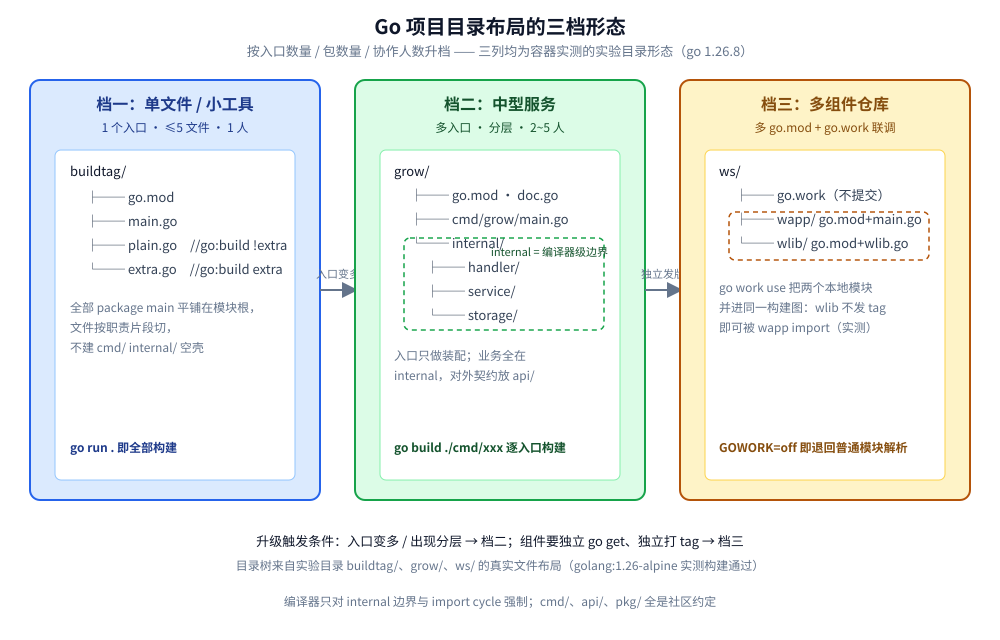
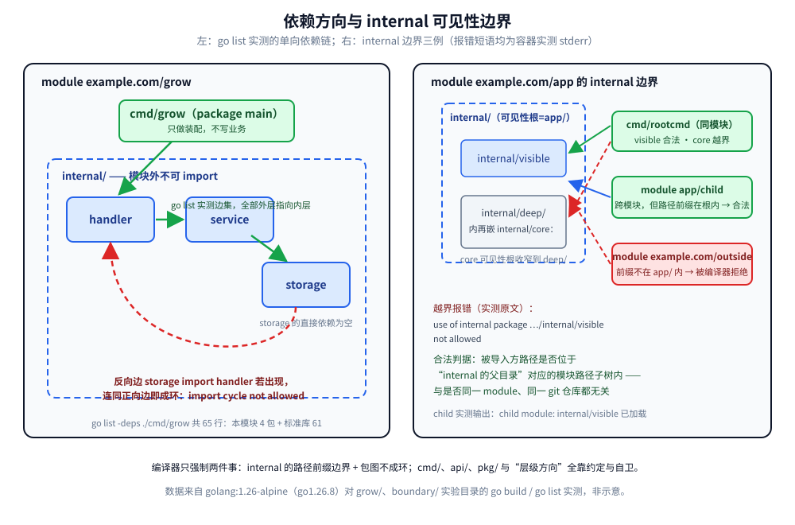

# 项目结构

> 项目目录布局的三档形态与判据、`cmd/`、`internal/`、`pkg/` 的编译器级边界、包怎么切、循环依赖怎么解、依赖方向怎么守、多模块与 `go.work`、`go.mod` 的依赖卫生
>
> 内容整理自个人学习笔记，素材见 [素材清单.md](../../../素材清单.md)。
>
> ⚠️ 本篇全部读数来自容器 `golang:1.26-alpine`（`go version go1.26.8 linux/amd64`）真跑；编译错误原文同样出自该容器的 `go build` stderr。文中的每一棵目录树、每一条报错与输出，都是在 `.workbuddy/tmp/exp/goproj-lab/` 实验目录里亲手 `mkdir` 出来再编译出来的，不是抄网络模板。

---

## 一、项目多大规模该用哪种目录布局？

**本节要点**：目录布局没有"标准答案"，只有**规模匹配**。Go 官方不规定布局（`go mod init` 之后放哪都行），社区真正沉淀下来的判据是：**入口数量、包数量、协作人数**三个维度到了哪一档，就用哪一档的形态，跳档和欠档都是债。

### 1.1 档一：单文件 / 小工具 —— `main.go` + 少量同级文件

判据：**一个可执行入口、不超过 3~5 个文件、作者一人**。这时候建 `cmd/`、`internal/` 属于过度设计。实验目录 `buildtag/` 就是这一档的真实形态（第七节 `//go:build` 实验用）：

```text
buildtag/
├── go.mod        # module example.com/buildtag
├── main.go       # func main() { fmt.Println("impl =", impl()) }
├── plain.go      # //go:build !extra 的默认实现
└── extra.go      # //go:build extra 的备选实现
```

这一档连包名都可以只有一个 `package main`，文件按"职责片段"切（`parse.go`、`render.go`）即可。

### 1.2 档二：中型服务 —— `cmd/ + internal/ (+ api/)`

判据：**一到多个入口、包开始分层、两三个人协作、要写单测**。标准形态是 `cmd/` 放入口、`internal/` 放全部业务包、`api/` 放对外契约（IDL / proto）。实验目录 `grow/` 是从零 `mkdir` 出来的真实形态（见本文「使用」一节）：

```text
grow/
├── doc.go                        # package root：整模块的文档包
├── go.mod                        # module example.com/grow
├── cmd/
│   └── grow/
│       └── main.go               # 唯一的 main，只做装配
└── internal/
    ├── handler/handler.go        # 最外层，只 import service
    ├── service/service.go        # 中间层，只 import storage
    └── storage/storage.go        # 最内层，谁都不 import
```

框架骨架（Kratos 的 `cmd/app + internal/{conf,data,biz,service,server}`）就是这一档的模板化版本，装配方式见 [依赖注入.md](依赖注入.md) 第五节；仓库实验目录 `shop/` 是另一变体（`api/proto/v1 + cmd/shop + internal/{domain,service,storage,transport/httpapi}`）。

### 1.3 档三：大型 / 多组件仓库 —— 多模块 + `go.work`

判据：**多个要独立发版的组件、跨团队复用、或一个组件带自己的私有依赖策略**。每个组件一个 `go.mod`，仓库根用 `go.work` 把它们串起来联调。实验目录 `ws/` 的真实形态：

```text
ws/
├── go.work       # go 1.26.8 + use (./wapp, ./wlib)
├── wapp/
│   ├── go.mod    # module example.com/wapp
│   └── main.go   # import example.com/wlib
└── wlib/
    ├── go.mod    # module example.com/wlib（本地未发布，无 tag）
    └── wlib.go
```

### 1.4 三档速查判据表

| 触发信号 | 用哪档 | 别做什么 |
|---|---|---|
| 一个入口、≤5 个文件、一个人 | 档一：`main.go` + 同级文件 | 别建 `cmd/`、`internal/`、`pkg/` 空壳 |
| 多入口 / 有单测 / 2~5 人 / 分层出现 | 档二：`cmd/ + internal/ (+ api/)` | 别急着拆第二个 `go.mod` |
| 组件要独立 `go get`、独立打 tag | 档三：多模块 + `go.work` | 别把 workspace 文件提交进发布产物、别用 `pkg/` 表达"公共" |



**图怎么读**：三列从左到右是规模递增。蓝列是档一，所有文件平铺在模块根；绿列是档二，`cmd/`（入口）与 `internal/`（业务分层）分开，虚线框表示 `internal` 的编译器级边界；黄列是档三，根上多一个 `go.work` 把两个独立 `go.mod` 框进同一个工作区。列间箭头标注的是"升级触发条件"：入口变多升档二，组件要独立发版升档三。

---

## 二、cmd/、internal/、pkg/ 到底约束了什么？

**本节要点**：`cmd/` 和 `api/` 只是**约定**（给目录分类，编译器不管）；`internal/` 是 Go **唯一的目录级访问控制**，由编译器在构建期强制执行；`pkg/` 连约定都算不上，只是"我承诺这是稳定公共 API"的语义信号。四组实测把 `internal` 的边界钉死。

### 2.1 规则本体：可见性根是 internal 的父目录

官方规则一句话：**`internal` 目录下的包，只能被"位于该 `internal` 的父目录（及其子目录）"代码 import**——按**导入路径**判断，不按磁盘位置判断。实验模块 `boundary/base/`（`module example.com/app`）里埋了四个观察点：

- `internal/visible/`：根 `internal`，可见性根是模块根 → 模块内谁都能用；
- `internal/deep/internal/core/`：第二层 `internal`，可见性根收窄到 `internal/deep/`；
- `cmd/rootcmd/main.go`：同模块，但位于 `internal/deep/` 之外；
- `internal/outsider/outsider.go`：也在 `internal/deep/` 之外。

容器里 `go build ./...`，同模块内越界的两个文件一起被拒（`visible` 的导入没有报错，合法）：

```text
package example.com/app/cmd/rootcmd
	cmd/rootcmd/main.go:7:2: use of internal package example.com/app/internal/deep/internal/core not allowed
package example.com/app/internal/outsider
	internal/outsider/outsider.go:4:8: use of internal package example.com/app/internal/deep/internal/core not allowed
```

### 2.2 跨模块：判断依据是模块路径前缀，不是"同一个仓库"

`boundary/outside/`（`module example.com/outside`）想 import `example.com/app/internal/visible`，`go build .` 报错原文：

```text
package example.com/outside
	main.go:7:2: use of internal package example.com/app/internal/visible not allowed
```

但反转来了：`boundary/child/` 是**另一个独立模块**（`module example.com/app/child`，用 `replace` 指回 `../base`），它的模块路径落在可见性根 `example.com/app/` **之内**，import 合法——容器真跑：

```text
child module: internal/visible 已加载
```

所以 `internal` 的准确判据是：**被导入方的路径是否在"internal 父目录对应的模块路径子树"里**。同不同 module、在不在同一个 git 仓库，都不重要；路径前缀才重要。这也解释了为什么拆多模块时 `internal` 会跟着"继承"：子模块只要挂在上层路径下就仍在边界内。



**图怎么读**：左面板是 `grow/` 的单向依赖链——绿色实线箭头来自 `go list` 实测边集（`cmd/grow → handler → service → storage`，`storage` 的直接依赖为空），红色虚线是假设出现的反向边 `storage import handler`，它与正向边合起来就是第四节的 `import cycle not allowed`；蓝色虚线框是 `internal/` 的可见性根。右面板是 `boundary/` 实测的三种访客：同模块的 `cmd/rootcmd` 用 `visible` 合法、用嵌套的 `deep/internal/core` 被拒；跨模块但路径前缀在 `example.com/app/` 之内的 `app/child` **合法**；前缀对不上的 `example.com/outside` 得到图下方引用的 `not allowed` 报错。图内模块路径、行数与报错短语均来自容器实测，非示意。

### 2.3 cmd/ 与 api/：纯约定

`cmd/` 的约定价值在于：**每个子目录一个可执行入口，目录名 = 二进制名**，`go build ./cmd/shop` 就能单独构建；入口里的 `main` 只做"解析参数 + 调装配函数"，业务一概不放进来（装配写法见 [依赖注入.md](依赖注入.md)）。`api/` 常放 protobuf / OpenAPI 定义（实验目录 `shop/api/proto/v1/order.go` 就是这么用的），它是**契约**不是实现，生成的代码进 `api/`，手写的进 `internal/`。这两个目录**都没有任何编译器特权**——和 2.1 的 `internal` 是两个性质。

### 2.4 pkg/ 为什么近年被建议慎用

`pkg/` 曾经流行是因为 golang-standards 那版指南推荐它表示"可被外部复用的公共库代码"。近年风向反转，理由有三：

| 批评 | 说明 |
|---|---|
| 没有任何强制语义 | 编译器不认 `pkg/`，`internal` 的反义词不是它——不放 `internal` 就是公共，`pkg/` 只是注释 |
| 承诺过重 | 放进 `pkg/` 等于宣告"这是要维护向后兼容的公共 API"，多数项目做不到 |
| 二选一已足够 | 现代共识：要么 `internal/`（不想给人用），要么直接摆出来（欢迎用），不需要第三种标签 |

判据：**新仓库默认 `cmd/ + internal/`，要对外发库才把公开包从 `internal/` 挪出来**；`pkg/` 只在"仓库确实同时含库和应用、且愿意为库负责兼容"时再出现。

---

## 三、包怎么切？按分层切还是按领域切？

**本节要点**：目录决定"谁能见"，包决定"谁能循环"。切包只有两条硬规则（**一个目录只能一个包名**、**包之间不能成环**），其余全是取舍。

### 3.1 一目录一包：编译器级，实测

在临时模块里往同一目录塞 `package aa` 与 `package bb` 两个文件，`go build ./...` 的 stderr：

```text
go: to add module requirements and sums:
	go mod tidy
found packages aa (x.go) and bb (y.go) in /tmp/p2/a1
```

第二行才是关键报错：**同一目录两个包名直接不可构建**（唯一的例外是 `xxx_test.go` 可以用 `package a1_test`，见 [测试与Mock.md](测试与Mock.md)）。所以"目录名 = 包名"不是风格洁癖，是省掉每次 import 后改别名的摩擦——`grow/` 里每个目录都遵守这条。

### 3.2 按分层切 vs 按领域切

| 切法 | 形态 | 优点 | 代价 | 适用 |
|---|---|---|---|---|
| 按分层 | `internal/{handler,service,storage}`（`grow/` 即此） | 依赖方向天然单向、好加横切中间件 | 一个功能的代码散三层，改功能跳 3 个目录 | 分层稳定的 CRUD / API 服务 |
| 按领域 | `internal/{user,order,payment}`，每个领域内部再分层 | 功能内聚、包边界≈团队边界、方便拆微服务 | 领域间共享逻辑易成环，需要先抽 `internal/platform` 层 | 领域多、业务规则复杂的系统 |

两者不冲突：**外层按领域、领域内按分层**是大型单体更稳的形态；小服务直接按分层切即可。判据：改一个需求平均要动几个包——老是同一组包被一起改，就该合并成一个领域包。

### 3.3 一个包该多大

经验判据（无编译器约束，靠 review）：单包源码超过 ~1500 行或文件超过 ~10 个就考虑拆；导出符号列表在 `go doc` 里滚屏超过半屏，说明包在替两个包干活；**拆的落点优先是"数据"而不是"行为"**（见 4.2 的解法二），因为行为好拆、共享数据类型拆错了会立刻成环。

### 3.4 包名与目录名的坑：实测报错原文

实验目录 `trap/` 专门埋了一个坑：包目录叫 `internal/transport/http/`，包名也写了 `package http`，而 `main.go` 同时要 import 标准库 `net/http`。`go build ./...` 报错原文：

```text
# example.com/trap
./main.go:6:2: http redeclared in this block
	./main.go:4:2: other declaration of http
./main.go:6:2: "example.com/trap/internal/transport/http" imported and not used
./main.go:10:28: undefined: http.Index
```

两个 `http` 撞名，编译器报的是 `http redeclared in this block`——注意这是**同一个文件内两个导入标识符冲突**，不是"目录名=包名"被违反（那个约束是 3.1）。修复三选一：给一方起导入别名（`transporthttp "…/transport/http"`）、把包名改成不与标准库短名冲突的名字（`transport` 或 `httpapi`，`shop/` 里就叫 `httpapi`）、或让标准库那侧加前缀使用。Go 惯例：**包名要短、全小写、不带下划线，且避开 `http`、`json`、`errors` 这类被到处 import 的短名**。

### 3.5 doc.go 与 util / common 垃圾包

`doc.go` 是只有包文档注释、几乎无代码的文件——`grow/doc.go` 实测就参与编译（`go build -v ./...` 的输出里有 `example.com/grow` 一行）。它的价值：给"一个包散在多个文件"提供统一综述入口，`go doc` 会取它做包文档。

`util/`、`common/`、`helper/` 的问题不是"不该有公共代码"，而是**它们是依赖图的黑洞**：谁都能 import、方向不受控、改不动也删不掉。判据：写不进任何领域包的东西先问"它真的无状态吗"——配置进 [配置热重载与快照.md](配置热重载与快照.md) 讲的位置、日志归装配、类型进领域包；剩下的再进明确的 `internal/platform/…`，且名字要具体（`idgen`、`money`），不叫 `util`。

---

## 四、import cycle 怎么复现、怎么解？

**本节要点**：循环依赖是 Go 编译期错误，不是 lint 警告；三种标准解法全部实测编译通过，各有代价。

### 4.1 复现：报错原文

实验模块 `cycle/`：`a` 包 import `b`，`b` 包 import `a`。容器内 `go build ./a`：

```text
package example.com/cycle/a
	imports example.com/cycle/b from a.go
	imports example.com/cycle/a from b.go: import cycle not allowed
```

报错形态固定是三段：环起点包 → 逐跳 import 链 → 终点短语 `import cycle not allowed`。**它只发生在构建期，测试/运行期不会"侥幸"绕过**——`go test` 同样编译不过。

### 4.2 三种解法与实测

`cyclefix/` 模块为三种解法各建了一棵子树，`go build -v ./... && go vet ./...` 全部通过，`-v` 输出的编译顺序（依赖先行）：

```text
example.com/cyclefix/fx3/base
example.com/cyclefix/fx2/model
example.com/cyclefix/fx1/notify
example.com/cyclefix/fx2/alert
example.com/cyclefix/fx1/user
example.com/cyclefix/fx3/helper
example.com/cyclefix/fx2/user
example.com/cyclefix/fx3/upper
```

| 解法 | 做法（实验形态） | 代价 |
|---|---|---|
| ① 抽接口 | `fx1/`：`user` 需要调 `notify`，`notify` 又需要回调 `user` 的能力 → 把回调契约抽成接口 `notify.Notifier` 放在**被依赖侧**，`user` 实现它、`notify` 只认接口 | 多一层间接；接口方法选错会反复改接口。与 DIP 同源，接口定义位置的讨论见 [依赖注入.md](依赖注入.md) 与 [接口.md](../类型与语法/接口.md) |
| ② 下沉数据 | `fx2/`：`alert` 与 `user` 都想用彼此的常量/类型 → 把共享的 `Prefix` 常量沉到第三方包 `fx2/model`，两边各自 import `model`，互不认识 | 最直接；但**数据类型一旦下沉就可能变成"上帝包"**，`model` 只放真正共享的最小集合 |
| ③ 拆包 | `fx3/`：`upper` 与 `helper` 成环，真实原因是 `helper` 只需要 `upper` 里的一小块 → 把那块拆成无依赖的 `fx3/base`，`helper` 依赖 `base` 而不是 `upper` | 拆出来的 `base` 归属要讲清楚，否则只是把 `util` 换了个名字 |

### 4.3 怎么选

先看报错链条里**谁真的需要谁**：如果只是常量/类型互引 → 解法②；如果是"下层要回调上层" → 解法①；如果是"上层包太大、被依赖的只是一角" → 解法③。三个都用不上时（A、B 确实互相需要），答案是**它们本就该是同一个包**。

---

## 五、依赖方向怎么守住单向？

**本节要点**：`handler → service → repo` 这种单向性，Go 工具链**只保证不成环，不保证方向**；能落地的做法是用 `go list` 把真实依赖边打出来看，守卫工具按团队规模决定上不上。

### 5.1 go list：实测把依赖图打出来

`grow/` 的包间边集（`go list -f "{{.ImportPath}}: {{join .Imports \" \"}}" ./internal/... ./cmd/...`，容器实测）：

```text
example.com/grow/internal/handler: example.com/grow/internal/service
example.com/grow/internal/service: example.com/grow/internal/storage
example.com/grow/internal/storage: 
example.com/grow/cmd/grow: example.com/grow/internal/handler fmt
```

每行一个包、冒号后是它直接 import 的包——四个包三条业务边，全部从外层指向内层，`storage` 的边集为空（最内层）。第二条命令看**传递闭包**：`go list -deps ./cmd/grow` 实测共 **65 行，其中本模块 4 个包、标准库 61 个**（本模块四个被排在前面）：

```text
example.com/grow/internal/storage
example.com/grow/internal/service
example.com/grow/internal/handler
internal/goarch
unsafe
...（其余 60 行标准库，从略）
example.com/grow/cmd/grow
```

排查"谁把方向写反了"的方法就固化成一条命令：`go list -f` 打出边集，肉眼看是否存在 `storage: …handler` 这样的反向边；比 `go list -deps` 更适合找**具体是哪条边**。

### 5.2 archtest / depguard 类守卫值不值

| 方案 | 原理 | 成本 | 判据 |
|---|---|---|---|
| 什么都不上，靠 review | 2.1/2.2 的 `internal` 边界 + 4 的环检测兜底 | 零 | ≤20 个包、一个小团队，够用 |
| 自写 archtest（一个 `_test.go` 用 `go/packages` 读边集断言方向） | 测试期检查，CI 顺带跑 | 半天工时 | 包 >50、多团队共仓、出现过方向漂移——值得 |
| golangci-lint 的 depguard / import 规则 | lint 期黑名单 | 配置文件维护 | 已有 lint 基建的项目顺手加 |

注意两点：编译器对"包级可见性"无能为力，`internal` 管的是跨模块边界，**模块内方向全靠上面这些软手段**；archtest 断言要按"允许的边集合"白名单写，黑名单写不全就会漏。（archtest 与 depguard 本篇**未实测**，只给判据。）

---

## 六、什么时候开第二个 go.mod？go.work 实测怎么工作？

**本节要点**：多模块的动机只有一个——**某个组件要按自己的节奏独立发布/被引用**；日常联调体验交给 `go.work`。replace 是把双刃剑，忘删的事故有固定的报错形态。

### 6.1 拆第二个 go.mod 的判据

| 信号 | 是否拆 |
|---|---|
| 组件要被**别的仓库** `go get`、独立打 tag 发版 | 拆 |
| 同仓工具/库与主应用共享代码但**依赖策略不同**（一方能升 protobuf、一方锁死） | 拆 |
| 只是"看着清晰"、双方永远一起发布一起测试 | 不拆，留在一个模块的 `internal/` 里 |

### 6.2 go work init / use 实测

在临时目录里新建两个本地模块后：`go work init ./app` 生成的 `go.work`（实测内容）：

```text
go 1.26.8

use ./app
```

再执行 `go work use ./app` 文件不变（**幂等**）。已有实验 `ws/` 里的多行形态与关键读数：

```text
go 1.26.8

use (
	./wapp
	./wlib
)
```

```text
$ go env GOWORK
/w/.workbuddy/tmp/exp/goproj-lab/ws/go.work

$ go list -m
example.com/wapp
example.com/wlib

$ go run ./wapp
wapp: hello from wlib（本地未发布，无 tag）
```

workspace 模式一次性把多个本地模块并进同一个构建图（`go list -m` 直接列出两个），`wlib` 不用发 tag、不用 replace 就能被 `wapp` import。关掉它验证必要性——在 `wapp/` 目录里 `GOWORK=off go build .`：

```text
main.go:7:2: no required module provides package example.com/wlib; to add it:
	go get example.com/wlib
```

`go.work.sum`：实测中纯本地模块工作区、`go work sync` 之后、workspace 模式下 `go get` 之后，**都没有生成 `go.work.sum`**（本地模块无哈希要校验）。它的定位是"workspace 构建图里跨模块下载的校验和缓存"，本篇未构造出含外部依赖的触发场景，标注**未实测**。`go.work` 本身**不要提交进版本库**——它属于个人联调环境，CI 用发布版本或 replace。

### 6.3 replace 的三种用途与"忘删 replace"事故

| 用途 | 写法 | 生命周期 |
|---|---|---|
| 本地联调 | `replace example.com/app => ../base`（boundary 实验即用此） | 只在开发机有效，**不该进 CI** |
| 指向 fork / 内源镜像 | `replace 公原版 => gitlab.company.com/group/fork v1.2.3` | 长期存在，要注释写明原因 |
| 应急补丁 | `replace 坏版本 => 修复分支` | 上游合并后立即删 |

事故形态：本地联调用路径 replace，提交前忘了删，`go.mod` 里的 `require` 指向一个公网不存在的路径。CI 拿到只有 `require` 没有 `replace` 的 `childci/`，`go build .` 第一步报：

```text
missing go.sum entry needed to verify package example.com/app/childci is provided by exactly one module; to add:
	go mod download example.com/app
```

按提示补 `go mod download example.com/app`（实测，GOPROXY 走 goproxy.cn）才暴露真实病灶：

```text
go: unrecognized import path "example.com/app": reading https://example.com/app?go-get=1: 404 Not Found
```

关键认知：**`replace` 只对主模块生效**，别人依赖你的模块时你的 replace 不会带过去——所以路径 replace 永远救不了解析问题，只会把失败推迟到 CI。防呆：CI 里跑 `go mod verify` + `diff <(git show HEAD:go.mod) go.mod`，或者干脆用 `go.work` 联调、`go.mod` 里永不写路径 replace（这是 `go.work` 被发明的直接动机）。

---

## 七、go.mod 的依赖卫生怎么查？

**本节要点**：`go` 行、`toolchain`、MVS、vendor、tidy 五件事决定了"同事和 CI 构建出的东西和你是不是一致"。全部容器实测。

### 7.1 go 行的双重语义与 toolchain 指令

`go.mod` 里 `go 1.26.8` 同时干两件事：**语言版本门禁**（低于它则 `//go:build` 之外的新语法/新标准库按旧语言集检查）和**工具链选择依据**（go ≥1.21 起，本地工具链低于它时 `GOTOOLCHAIN=auto` 会自动下载切换）。实测把 go 行改成 `go 1.99`（超出现有一切工具链）：

```text
go: go.mod requires go >= 1.99 (running go 1.26.8; GOTOOLCHAIN=local)
```

括号里同时给出运行版本与 `GOTOOLCHAIN` 值——该镜像默认值是 `local`（`go env GOTOOLCHAIN` 实测返回 `local`，`GOROOT=/usr/local/go`），即**不自动下载新工具链，直接拒绝构建**。`toolchain go1.26.8` 指令则在 `go` 行之上再钉一个"最低期望工具链"，CI 里配 `GOTOOLCHAIN=auto` 时可自动升级、配 `local` 时报同款错误（`auto` 下载成功路径本篇**未实测**）。`-lang` 编译旗标与这里不同：那是单文件语言级别开关，见 [编译与gcflags.md](编译与gcflags.md)。

另外 `//go:build` 标签与目录布局无关但同属"构建选择"，实测对照（`buildtag/`）：

```text
$ go run .
impl = plain (default build)

$ go run -tags extra .
impl = extra (with -tags extra)
```

`extra.go` 带 `//go:build extra`、`plain.go` 带 `//go:build !extra`，同一符号 `impl()` 两版实现按标签二选一——这是 wire 用 `wireinject` 标签把声明文件挡出真实构建的同款机制（见 [依赖注入.md](依赖注入.md) 3.2）。

### 7.2 MVS：最小可用版本只升不降，实测

模块 `mvs3/` 直接依赖 `cobra v1.8.0` 与 `pflag v1.0.3`，而 cobra 自己的 go.mod 要求 `pflag v1.0.5`。`go mod tidy`（GOPROXY=goproxy.cn）的下载记录里两个版本都被拉取：

```text
go: downloading github.com/spf13/cobra v1.8.0
go: downloading github.com/spf13/pflag v1.0.3
go: downloading github.com/inconshreveable/mousetrap v1.1.0
go: downloading github.com/spf13/pflag v1.0.5
```

tidy 后的 `go.mod` 把直接依赖**改写成了 v1.0.5**：

```text
module example.com/mvs3

go 1.26.8

require (
	github.com/spf13/cobra v1.8.0
	github.com/spf13/pflag v1.0.5
)

require github.com/inconshreveable/mousetrap v1.1.0 // indirect
```

依赖图边（`go mod graph | grep pflag`）：

```text
example.com/mvs3 github.com/spf13/pflag@v1.0.5
github.com/spf13/cobra@v1.8.0 github.com/spf13/pflag@v1.0.5
```

`go.sum` 里 pflag 只留下 v1.0.5 两行（v1.0.3 的哈希被裁掉）。三点结论：**MVS 取所有要求的最大值**（选"最小可用"，不选"最新"）；`go mod tidy` 会把"被传递依赖抬起来的版本"**回写进直接依赖行**；要降版本只能让所有要求方一起降，单改自己那行会被 tidy 打回。

### 7.3 vendor：一致性检查有牙齿

`mvs2/`（带 `vendor/` 的 cobra 实验）里 `go build .` 静默成功——go ≥1.14 检测到 `vendor/modules.txt` 与 go.mod 一致就**自动进入 vendor 模式**。把 `modules.txt` 里 cobra 的标记版本手动改成 v1.7.0（go.mod 仍是 v1.8.0）后，`cp` 出的 `mvsbreak/` 构建即失败，报错原文：

```text
go: inconsistent vendoring in /w/.workbuddy/tmp/exp/goproj-lab/mvsbreak:
	github.com/spf13/cobra@v1.8.0: is explicitly required in go.mod, but not marked as explicit in vendor/modules.txt
	github.com/spf13/cobra@v1.7.0: is marked as explicit in vendor/modules.txt, but not explicitly required in go.mod

	To ignore the vendor directory, use -mod=readonly or -mod=mod.
	To sync the vendor directory, run:
		go mod vendor
```

判据：**库不 vendor**（下游自己做依赖管理）；**应用要可离线/可复现构建才 vendor**，且把 `vendor/` 一起提交、CI 直接 `go build -mod=vendor`；改依赖后统一 `go mod tidy && go mod vendor` 一条龙，别手改 `modules.txt`。

### 7.4 go mod tidy 的删留判据，实测

`tidydemo/` 三个模块都 `require example.com/tidylib v0.0.0`（replace 到本地 `lib/`），差别只在**谁 import 它**：t1 的 `main.go` 用了、t2 只有 `say_test.go` 用了、t3 谁都没用。各跑一次 `go mod tidy` 后 go.mod：

```text
--- t1（main.go 引用）---
require example.com/tidylib v0.0.0     # 保留
--- t2（仅测试文件引用）---
require example.com/tidylib v0.0.0     # 保留
--- t3（无任何引用）---
（require 行消失，只剩 module/go/replace）
```

结论：**"主模块自己的测试"算引用**，所以 t2 保得住；"没有任何文件引用"必被裁掉（t3）；而**依赖的依赖的测试引用**从 go 1.17 起被图裁剪不再进 go.mod——这正是 mvs3 的 `go list -m all` 会列出 `gopkg.in/check.v1`、`go-md2man` 等 8 个模块、go.mod 却只有 3 行的原因：`list -m all` 是"构建+测试"全闭包，go.mod 只记"构建必需 + 图保留边"。

---

## 八、配置、日志、中间件这些公共件放哪？

**本节要点**：这三样在多数项目里"看起来像 `pkg/` 素材"，实际各有归属——本篇只给落点判据，实现细节全部指路，不重讲。

| 公共件 | 落点 | 为什么 | 细节在哪 |
|---|---|---|---|
| 配置 | `internal/conf/`（结构体 + 加载函数） | 配置是**部署属性**不是业务逻辑，不对外发；多环境文件放根 `configs/` | [配置热重载与快照.md](配置热重载与快照.md) |
| 日志 | 装配层创建、以接口注入各包（接口定义在使用方） | logger 是横切依赖，放进 `util/` 会变成全局单例黑洞 | [依赖注入.md](依赖注入.md) 的接口在使用方模式 |
| HTTP 中间件 | `internal/transport/http/`（或对应入口包） | 中间件绑定的是**传输层语义**，跟 handler 同层同包 | [context.md](context.md)（请求上下文传递） |
| 定时任务装配 | `internal/task/` 或独立 `cmd/cron/` 入口 | 有独立入口就进 `cmd/`，共享库逻辑留 `internal/` | [标准库实现.md](定时任务/标准库实现.md) |

一句话判据：**"公共"先问是不是"跨入口共享"**——共享的只有 `cmd/a` 和 `cmd/b` 两个入口，放 `internal/` 就对了；真被外部仓库引用，才谈"从 internal 挪出来变公共包"。

---

## 九、拿到一个新仓库先看什么？

**本节要点**：排查顺序固定五步，每步一条命令一个判据，10 分钟内建立"这仓库怎么长起来的"心智图。

| 顺序 | 看什么 | 命令/动作 | 能得出什么 |
|---|---|---|---|
| 1 | `go.mod` | 看 `module` 路径、`go` 行版本、`toolchain`、require 数量、有无 `replace` | 定位档位（1.4）、依赖体量、有没有忘删的本地 replace（6.3） |
| 2 | 入口 | `ls cmd/`；无 `cmd/` 则找根 `main.go` | 几个二进制、分别是什么进程 |
| 3 | 包图与方向 | `go list -f '{{.ImportPath}}: {{join .Imports " "}}' ./...`；`go env GOWORK` 看是否 workspace 中 | 分层还是分领域、有没有反向边（5.1）、是否多模块联调态（6.2） |
| 4 | 构建与守卫 | Makefile / `.golangci.yml` / CI 配置里有没有 `go vet`、`-tags`、`-mod=vendor`、archtest | 团队实际执行的构建口径（7.1、7.3） |
| 5 | 测试布局 | `find . -name '*_test.go'` 看黑盒/白盒比例与测试替身放哪 | 边界怎么被 fake 的，决定你能改哪 |

顺带三查：`git log --oneline -10` 看演进方向；`go build ./... && go test ./...` 一把梭验证"仓库本身是绿的"；`go version -m <已提交二进制>`（若有）对出构建时工具链版本。

---

## 使用：把一段脚本级代码长成中型服务项目

把档一的单文件工具升级成档二服务，全过程在容器真跑（`grow/` 即产物）。第一步，建目录与骨架：

```bash
mkdir -p grow/cmd/grow grow/internal/handler grow/internal/service grow/internal/storage
cd grow && go mod init example.com/grow     # 生成 go.mod：module + go 1.26
```

第二步，四个文件按"从外到内"写，每个包只 import 紧邻内层（完整源码在实验目录，此处只列关键行）：

```go
// cmd/grow/main.go：入口只做装配
func main() { fmt.Println(handler.Serve("world")) }

// internal/handler/handler.go：只认 service
func Serve(name string) string { return service.Greet(name) }

// internal/service/service.go：只认 storage
func Greet(name string) string { return storage.Load(name) + "!" }

// internal/storage/storage.go：终点，不 import 任何内部包
func Load(name string) string { return "hello " + name }
```

第三步，构建、运行、验证依赖方向：

```text
$ go build -v ./...
internal/goarch
internal/unsafeheader
example.com/grow
example.com/grow/internal/storage
internal/byteorder
...（-v 逐包打印编译记录，其余行从略）
example.com/grow/cmd/grow

$ go run ./cmd/grow
hello world!

$ go list -f "{{.ImportPath}}: {{join .Imports \" \"}}" ./internal/... ./cmd/...
example.com/grow/internal/handler: example.com/grow/internal/service
example.com/grow/internal/service: example.com/grow/internal/storage
example.com/grow/internal/storage: 
example.com/grow/cmd/grow: example.com/grow/internal/handler fmt
```

`-v` 输出里 `example.com/grow`（`doc.go` 的 root 包）与三个 internal 包、`cmd/grow` 共 5 个自有包全部编译通过；`go list` 边集证明方向单向。之后的自然演进路径：加测试（[测试与Mock.md](测试与Mock.md)）→ 加配置注入（[依赖注入.md](依赖注入.md)）→ 入口多了第二个 `cmd/report` → 出现成环苗头回到本文第四节。

---

## 延伸追问

- **`internal` 能防住反射或恶意代码吗？** → 防不住。它是**构建期 import 检查**，防的是"不小心依赖了不稳定接口"，不是安全边界；运行期动态加载、`go:linkname`、源码级拷贝都不受它约束。
- **单段模块路径（`module p1`）能构建吗？** → 实测 `go mod init p1` + `go build .` 成功且无告警：模块路径只有在**被别人 import** 时才需要是可解析的完整域名；纯本地/私有应用用单段路径不影响构建，但会堵住"将来发出去"的路。
- **一个功能要动 handler、service、storage 三个包，是不是说明该按领域切？** → 是常见信号（3.2 的判据）。但先在包内收敛：如果三个包里被动的字段/方法总是同一组数据，考虑把"数据 + 行为"合到一个领域包，传输层只留薄壳。
- **`go.work` 能提交到 git 吗？** → 官方答案是否：它记录的是**本机相对路径**，队友路径不同就失效。要提交的是每个模块自己的 `go.mod`；CI 不设 workspace（或临时 `GOWORK=off`，报错形态见 6.2 实测）。
- **`replace` 会传递给我的下游吗？** → 不会，replace 只被**主模块**的 go.mod 承认。下游拿到的仍是原来的 `require` 路径，所以 fork 补丁要么发 tag、要么要求下游自己再写一条 replace（6.3 事故形态的根源）。
- **vendor 之后还需要 go.sum 吗？** → 需要，`-mod=vendor` 模式下校验走 `vendor/modules.txt`，但 go.sum 保留着才能在 `-mod=mod` 之间来回切；7.3 的 `mvsbreak` 报错就是 modules.txt 与 go.mod 对不上的形态。
- **`go mod tidy` 会不会把 CI 需要的依赖裁掉？** → 会裁"当前构建图里没人引用的"。典型翻车：用 build tag 挡住的测试依赖（`//go:build integration`），tidy 时不带同 tag → 被裁。对策：`go mod tidy -e` 观察，或 CI 前用同 tag 跑 tidy；tag 机制本身见 7.1 实测。

---

## 关联

- [依赖注入.md](依赖注入.md) — 装配层怎么写、接口为什么定义在使用方；本篇管目录与包边界，注入管类型接线
- [编译与gcflags.md](编译与gcflags.md) — `-lang` 与编译旗标；本篇 7.1 的 go 行是模块级语言门禁，两者互补
- [配置热重载与快照.md](配置热重载与快照.md) — `internal/conf` 落点之后的加载与热更实现
- [测试与Mock.md](测试与Mock.md) — `_test.go` 黑盒/白盒双包名（3.1 唯一例外）的展开
- [context.md](context.md) — 入口层到内层的请求上下文传递，与 5.1 的依赖方向正交
- [标准库实现.md](定时任务/标准库实现.md) — 定时任务在 `cmd/` 与 `internal/` 之间的落位实例
- [接口.md](../类型与语法/接口.md) — 解环三法中"抽接口"的语言机制
- [素材清单.md](../../../素材清单.md) — 本篇素材出处登记
> 反向引用（本篇被下列文档引到）：[数据访问与连接池.md](数据访问与连接池.md)
