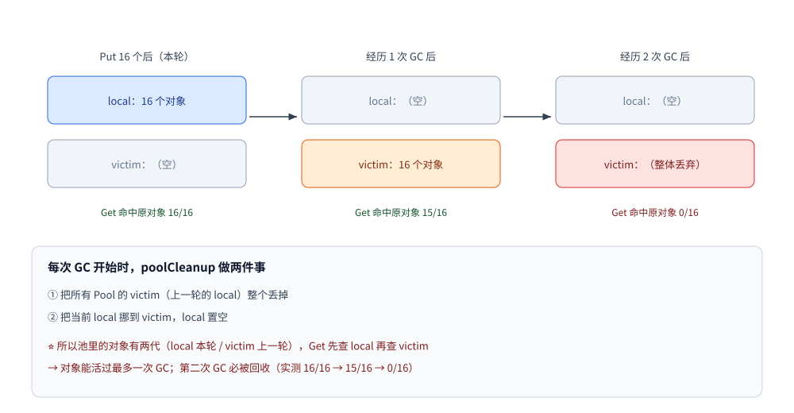
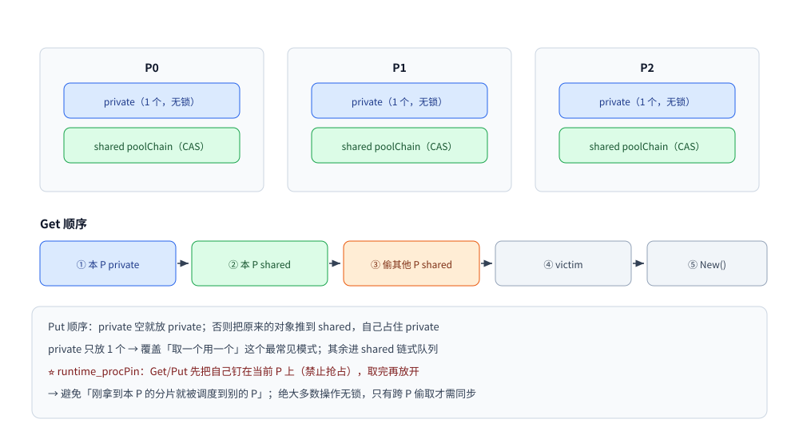

# sync.Pool

> 临时对象复用的正确姿势：与 GC 的交互（victim cache）、按 P 分片与偷取、必须重置、以及"不要把它当缓存"
>
> 内容整理自大厂 Go 后端面试真题，参考资料与原始素材见 [素材清单](../../../素材清单.md)。
>
> 池化只是"减少分配"的一种手段，减少 GC 压力的全貌（GOGC / GOMEMLIMIT / 指针密度）见 [垃圾回收机制.md](../运行时/垃圾回收机制.md)。

---

## 一、`sync.Pool` 是什么？它和"缓存"是一回事吗？

**本节要点**：这题的分水岭就是这一句 —— **"Pool 不是缓存"**。答成缓存，后面全错。

### 1.1 一句话定位

| | `sync.Pool` | 缓存（如 LRU / Redis） |
|---|---|---|
| 存什么 | **临时对象**，持有者不关心它是不是原来的那一个 | **有价值的数据**，必须能按 key 找回来 |
| 对象何时消失 | **随时可能被 GC 清掉**（下一节实测） | 只受容量/过期策略控制 |
| 命中率是目标吗 | ❌ 不是，**"取不到就新建"是设计预期** | ✅ 是 |
| 解决什么 | **减少分配 → 减少 GC 压力** | 减少对下游（DB/服务）的访问 |

> ⭐ 一句话：**`sync.Pool` 是"减少分配次数的垃圾桶"，不是"保证能取回数据的仓库"。**

### 1.2 它真正解决的问题

分配一个新对象（尤其是**带切片的缓冲区**）有三层代价：向分配器要内存、初始化、**以及最贵的——让 GC 多扫一份垃圾**。
Pool 的作用是把"用完就扔"改成"用完还回去，下次接着用"，直接把**分配次数与 GC 扫描量**压下来。

⚠️ **先想清楚"值不值得池化"**：如果对象很小（比如一个 `int`），分配器处理它只需几纳秒，
而进出 Pool 要走**按 P 分片 + 接口装箱**，反而更慢（实测见第三节）。

---

## 二、池里的对象会被 GC 清掉吗？⭐

**本节要点**：这题直接考"你有没有读过 `sync/pool.go`"。正确答案是**会，而且有个"缓刑一轮"的 victim cache**。

### 2.1 实测：连续三次测量

```go
p := &sync.Pool{New: func() any { seq++; return &Buf{id: 1000 + seq} }}
orig := make(map[*Buf]bool)
var bufs []*Buf
for i := 0; i < 16; i++ {
    seq++
    b := &Buf{id: seq}
    orig[b] = true
    bufs = append(bufs, b)
}
putAll := func() { for _, b := range bufs { p.Put(b) } }
countHits := func() int {
    hit := 0
    for i := 0; i < 16; i++ {
        if v, ok := p.Get().(*Buf); ok && orig[v] { hit++ }
    }
    return hit
}

putAll()
fmt.Printf("Put 16 个后立刻 Get 16 次：命中原对象 %d/16\n", countHits())
putAll()
runtime.GC()
fmt.Printf("经历 1 次 GC 后 Get 16 次：命中原对象 %d/16\n", countHits())
putAll()
runtime.GC()
runtime.GC()
fmt.Printf("经历 2 次 GC 后 Get 16 次：命中原对象 %d/16\n", countHits())
```

```text
Put 16 个后立刻 Get 16 次：命中原对象 16/16
经历 1 次 GC 后 Get 16 次：命中原对象 15/16 —— 从 victim cache 里捡回来
经历 2 次 GC 后 Get 16 次：命中原对象 0/16 —— victim 被丢弃，全是新建的
```

### 2.2 为什么会"缓刑一轮"

每次 GC 开始时，运行时执行 `poolCleanup`：

```text
① 把所有 Pool 的 victim（上一轮的 local）整个丢掉
② 把当前 local 挪到 victim，local 置空
```



所以池里的对象有**两代**：`local`（本轮）和 `victim`（上一轮）。
`Get` 先查 local，查不到再查 victim —— **对象能活过最多一次 GC，第二次必被回收**。

### 2.3 ⚠️ 顺带解释"为什么是 15/16 而不是 16/16"

差的那一个是 `Put` 落在某个 P 的 `private` 槽里，而 `Get` 时**当前 P 变了** ——
`getSlow` 找 victim 时，`private` 只查**当前 P 对应的那一片**，其他 P 的 private 不查（只查它们的 `shared`）。
所以池里的对象在**跨 P 之后**命中率会掉一点。这不是 bug，是"分片 + 无锁"的必然代价。

---

## 三、Pool 到底能省多少？

**本节要点**：不能只说「更快」。要能说出**省的是分配次数**（`allocs/op`、`B/op`），并解释「为什么存 slice 会多出 24 字节」。

### 3.1 实测（4 KB 缓冲区，反复借还）

```text
BenchmarkAlloc4K-8       809912    1701 ns/op    4096 B/op    1 allocs/op
BenchmarkPool4K-8      15337658      72.48 ns/op    24 B/op    1 allocs/op
BenchmarkNewBuffer-8     811857    1719 ns/op    4096 B/op    1 allocs/op
BenchmarkPoolBuffer-8  44528149      25.09 ns/op     0 B/op    0 allocs/op
```

| 做法 | 耗时 | 每次分配 | 结论 |
|---|---|---|---|
| 每次 `make([]byte, 0, 4096)` | 1701 ns | 4096 B | 基线 |
| 走 Pool 借 `[]byte` | **72.5 ns（23×）** | **24 B** | 快很多，但**还剩 24 B** |
| 每次 `bytes.NewBuffer` | 1719 ns | 4096 B | 基线 |
| 走 Pool 借 `*bytes.Buffer` | **25.1 ns（68×）** | **0 B** | 完全零分配 |

### 3.2 ⭐ 那 24 B 是哪来的？—— 接口装箱

Put/Get 的签名是 `any`，而 `[]byte` 是 **24 字节的 slice header**（指针 + len + cap），
比一个机器字（8 字节）大 —— **装不进接口的数据字里，必须额外分配 24 字节把它拷进去**。

```go
// ❌ 每次 Put 都要装箱 24 字节
p.Put(buf[:0])                       // []byte → any：分配 24 B

// ✅ 存指针，指针正好一个机器字，装箱零成本
p.Put(bufPtr)                        // *bytes.Buffer → any：不分配
```

> ⭐ **实践结论**：**Pool 里存指针，不要存大结构体或 slice**。
> 这也是标准库的做法 —— `fmt` 的 `ppFree` 存 `*pp`、`encoding/json` 的 encoder cache 存指针。

---

## 四、为什么 `Get` 出来的对象必须重置？

**本节要点**：核心是实际踩过没有。脏数据不只是正确性问题——**带敏感数据时是跨请求泄漏的安全问题**。

### 4.1 实测：不重置就会拿到脏数据

```go
p2 := &sync.Pool{New: func() any { return bytes.NewBuffer(make([]byte, 0, 64)) }}
buf := p2.Get().(*bytes.Buffer)
buf.WriteString("上一次的脏数据")
p2.Put(buf)
reused := p2.Get().(*bytes.Buffer)
fmt.Printf("复用到未重置的 Buffer，里面已经有 %d 字节：%q\n", reused.Len(), reused.String())
```

```text
复用到未重置的 Buffer，里面已经有 21 字节："上一次的脏数据"
```

### 4.2 两条铁律

1. **还回去之前先清干净**（`buf.Reset()`、`slice[:0]`、把字段归零）——否则下一个人拿到脏数据；
2. **借出来之后不要假设它是干净的**——你无法保证上一个使用者按规矩做了。

⚠️ **更危险的是"带敏感数据"的缓冲区**：复用没清干净的 buffer 会导致**跨请求数据泄漏**（另一个用户的 token
残留在同一个 buffer 里）。所以"用完即清"不仅是正确性问题，还是**安全问题**。

---

## 五、内部结构：为什么 Pool 是无锁的？

**本节要点**：Pool 常被追问"高并发下会不会成为瓶颈"——答案是不会，因为它是**按 P 分片**的。

```text
每个 P 一份 poolLocal：
  ├─ private  any         ← 只属于这个 P，无锁，容量 1
  └─ shared   poolChain   ← 这个 P 的链式队列，pushHead / popHead 无锁（CAS），跨 P 偷取时才有锁

Get 顺序：本 P 的 private → 本 P 的 shared → 偷其他 P 的 shared → victim → New()
Put 顺序：private 空就放 private；否则把它原来的对象推到 shared，自己占住 private
```



| 设计 | 解决的问题 |
|---|---|
| **按 P 分片** | 绝大多数场景下**根本不用加锁**，不成为并发瓶颈 |
| **private 只放 1 个** | 最常见的使用模式是"取一个用一个"，1 个槽就覆盖了大部分请求 |
| **其余进 shared** | 一个请求要拿多个对象时（如嵌套编解码），后面的走链式队列 |
| **偷其他 P** | 负载不均时（某个 P 被抢占）也能拿到对象，避免"本地为空却全局有货" |

⭐ **`runtime_procPin` 的作用**：`Get`/`Put` 会先把自己**钉在当前 P 上**（禁止抢占），
取完再放开 —— 避免"刚拿到本 P 的分片就被调度到别的 P"。

---

## 六、哪些场景**不该**用 Pool？

**本节要点**：知道「什么时候不用」比知道「怎么用」更能说明你真的理解它——Pool 的开销在某些场景会大于收益。

| 场景 | 为什么不该用 |
|---|---|
| 对象很小（几个字节，如 `int`） | 分片 + 接口装箱的开销**大于**分配本身 |
| 对象存活时间很长（会被长期持有） | 不会被归还 → Pool 形同虚设，还白占内存 |
| 有状态、需要严格生命周期管理的对象 | 复用会让状态串味，容易出隐蔽 bug |
| 想当缓存用（要求"Put 了就能 Get 回来"） | **契约不成立**（第二节实测：两次 GC 后 0/16） |
| 对象大小差异极大 | Pool 不区分大小，大对象占着槽，反而浪费内存 |

⭐ 反过来，**最适合 Pool 的三类**：**固定大小的缓冲区**（`bytes.Buffer`、`[]byte`）、
**开销大的编解码中间对象**（JSON/Protobuf 的 encoder/decoder）、**高频分配的小结构体**（但要用指针）。

---

## 使用：把 Pool 用对的三条规则

### 规则一：只存指针，不存大对象

```go
// ✅ 推荐：存指针（装箱零成本、归还的是同一个对象）
var bufPool = sync.Pool{
	New: func() any { return bytes.NewBuffer(make([]byte, 0, 4096)) },
}

func handleJSON(data []byte) error {
	buf := bufPool.Get().(*bytes.Buffer)
	defer func() {
		buf.Reset()      // ⭐ 归还前必须清干净
		bufPool.Put(buf)
	}()
	return json.NewEncoder(buf).Encode(data)
}
```

### 规则二：`defer` 归还，但要先重置

```go
// ❌ 忘记重置：下一个人拿到脏数据（实测会残留 21 字节）
buf := pool.Get().(*bytes.Buffer)
buf.WriteString(resp)
pool.Put(buf)

// ✅ 先 Reset 再 Put
buf.Reset()
pool.Put(buf)
```

### 规则三：`New` 一定要给，避免空指针判断

```go
var p = sync.Pool{New: func() any { return &Item{} }}   // ⭐ 有 New，Get 永远不返回 nil
item := p.Get().(*Item)                                 // 不用判空

// 没有 New 时 Get 可能返回 nil，每个调用点都得判 —— 容易漏
```

### 附：三个可直接抄进项目的池模板

```go
// ① 缓冲区池（编解码、拼 SQL、日志格式化）
var bufPool = sync.Pool{New: func() any { return bytes.NewBuffer(make([]byte, 0, 4096)) }}

// ② 定长字节池（网络收发、压缩）
var bytePool = sync.Pool{New: func() any { b := make([]byte, 32<<10); return &b }}

// ③ JSON 编解码器池（避免反复反射初始化）
var encPool = sync.Pool{New: func() any { return json.NewEncoder(io.Discard) }}
```

### 怎么验证"池化真的有用"

```bash
go test -bench=. -benchmem -run=^$ ./...     # 看 allocs/op 与 B/op 是否真的降下来
```

⭐ **判据不是"更快"，而是 `allocs/op` 与 `B/op` 降下来** —— 单次 ns 只说明这一台机器，
而分配次数下降才意味着**GC 压力真的变小了**（全局收益）。

---

## 延伸追问

- **`sync.Pool` 是缓存吗？** → 不是。它是"减少分配次数的池"，**不保证 Put 进去还能 Get 回来**（两次 GC 后实测 0/16）；要能按 key 取回数据请用 LRU/Redis。
- **池里的对象什么时候会被回收？** → **每次 GC 都会清**；但因为有 **victim cache**（上一轮的 local 会挪到 victim），对象能"活过一轮"，所以实测"1 次 GC 后仍能命中 15/16、2 次后 0/16"。
- **为什么对象能活过一轮 GC？** → `poolCleanup` 在 GC 开始时把 local 挪到 victim，`Get` 会兜底查 victim；第二次 GC 时 victim 被整体丢弃。
- **`Get` 一定返回同一个对象吗？** → 不保证。可能拿到别的 P 的对象，也可能拿到 `New()` 新建的 —— **代码不能依赖对象身份**。
- **`Get` 出来的对象需要重置吗？** → **必须**。实测复用未重置的 `bytes.Buffer` 会带回 21 字节脏数据；带敏感数据时会**跨请求泄漏**。
- **Pool 为什么并发性能好？** → **按 P 分片**：每 P 有 `private` + 链式 `shared`，绝大多数操作**无锁**（`runtime_procPin` 钉住 P），只有跨 P 偷取时才需要同步。
- **Pool 里存 slice 和存指针有区别吗？** → 有，而且很大。`[]byte` 是 24 字节的 header，比机器字大 → **每次 Put 都要额外分配 24 B 装箱**；存指针 `*bytes.Buffer` 则是 **0 B/op**（实测 24 B/op vs 0 B/op）。
- **什么时候不该用 Pool？** → 小对象（开销大于分配）、长生命周期对象（不会归还）、有严格生命周期的状态对象、把它当缓存用。
- **Pool 化一定更快吗？** → 不一定。判据是 **`allocs/op` 与 `B/op` 降下来**；单次 ns 受机器影响，而分配次数下降才真正减轻 GC。

---

## 关联

- [goroutine实战模式.md](goroutine实战模式.md) — 「用协程池还是信号量」的实测取舍

- [垃圾回收机制.md](../运行时/垃圾回收机制.md) — Pool 服务的对象：GOGC / GOMEMLIMIT / 分配压力
- [接口.md](../类型与语法/接口.md) — Put/Get 的 `any` 装箱成本与 24 字节分配从哪来
- [并发同步原语.md](并发同步原语.md) — Mutex / RWMutex / Once / WaitGroup / atomic 的取舍
- [内存分配器.md](../运行时/内存分配器.md) — 不用 Pool 时，小对象走哪条分配路径
- [goroutine.md](goroutine.md) — 每个 goroutine 的成本，以及"用协程池还是信号量"的取舍
