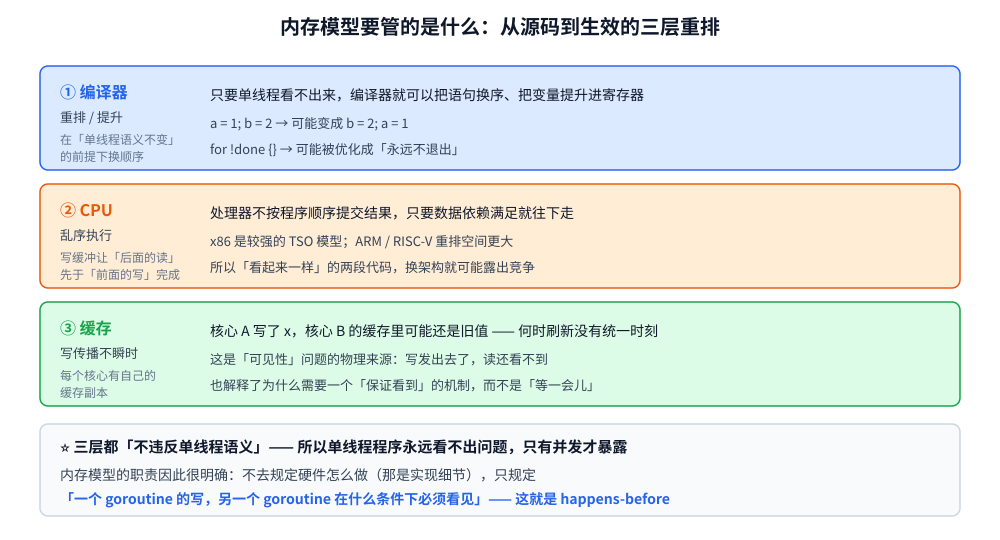
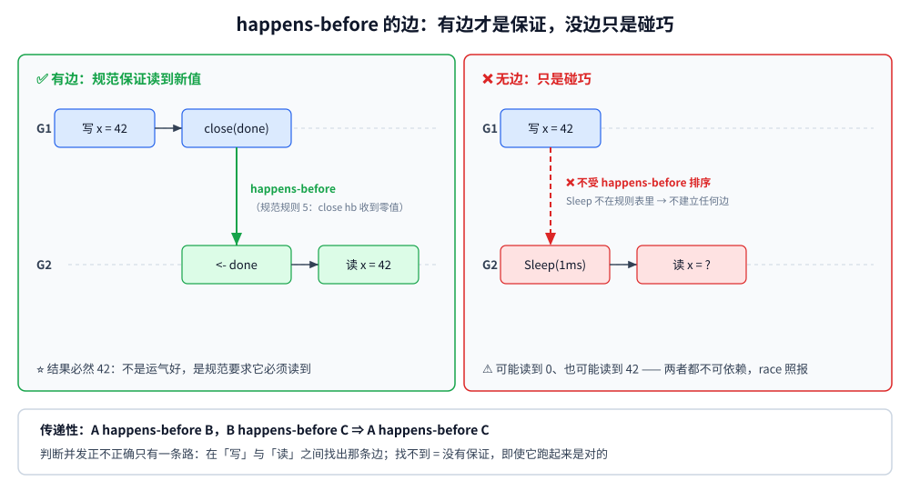

# Go 内存模型与 happens-before

> 本篇覆盖 Go 内存模型：**编译期与硬件层面的三层重排**、**spec 定义的 happens-before 边**、
> **数据竞争为什么是"未定义行为"而不是"偶尔算错"**，以及 Go 在 atomic 上的特有立场（顺序一致）、
> `-race` 能测什么、与 Java JMM 的逐条对照。
> ⭐ 本篇是 [README.md](../README.md) 里「同一主题（锁、并发容器、**内存模型**）与 Java 侧各一篇」承诺的 **Go 侧那一篇**
> —— 对照阅读 [JMM与内存屏障.md](../../java/并发/JMM与内存屏障.md)。
>
> 内容整理自个人学习笔记，并按 [go/README.md](../README.md) 的承诺补齐；素材见 [素材清单.md](../../../素材清单.md)。

---

## 一、内存模型到底在解决什么问题？

**本节要点**：内存模型不是"内存怎么布局"，而是**多核之间的一份合同** —— 它规定「一个 goroutine 的写，另一个 goroutine 在什么条件下**必须**看见」。
看不见"合同"这两个字，就会把内存模型当成"背几条规则"，然后在 `time.Sleep` 上栽跟头。

### 1.1 三层重排：为什么"代码顺序"不等于"执行顺序"

你写的语句顺序，从源码到真正生效，要穿过三层可能改变顺序的东西：

| 层 | 会做什么 | 例子 |
|---|---|---|
| **编译器** | 在**单线程语义不变**的前提下重排语句、把变量提升进寄存器 | `a = 1; b = 2` 可能变成 `b = 2; a = 1`；循环里的 `for !done {}` 可能被优化成死循环 |
| **CPU** | 乱序执行（out-of-order）、写缓冲（store buffer） | 后面的读先于前面的写完成 |
| **缓存 / 内存系统** | 每个核心有自己的缓存，写的传播**不是瞬间的** | 核心 A 写了 `x`，核心 B 的缓存里还是旧值 |

⭐ 这三层**都不违反单线程语义** —— 所以单线程程序永远看不出问题，**只有并发才暴露**。
内存模型的作用就是：**不去规定硬件怎么做（那是实现细节），只规定"什么情况下你能看到别人的写"**。



### 1.2 数据竞争（data race）的定义

Go 内存模型给出了这个领域最简洁的定义（[go.dev/ref/mem](https://go.dev/ref/mem)）：

> A data race is defined as two accesses to the same memory location, at least one of which is a write,
> that are not ordered by happens-before.

翻成中文，三个条件**同时满足**才叫数据竞争：

1. **同一个内存位置**；
2. **至少一个是写**（两个都是读不算）；
3. **它们之间没有被 happens-before 排序**。

⚠️ 注意第 3 条：**不是"同时发生"，而是"没有顺序保证"**。两条 goroutine 即使事实上错开跑了，只要规范上没有建立 happens-before，它就是数据竞争。

### 1.3 Go 的立场：有竞争 = 未定义行为

规范原文只有一句，但分量极重：

> programs that contain data races have undefined behavior.

**"未定义"不是"随机数"，也不是"一定会崩"** —— 它意味着编译器和运行时**可以假设不存在竞争**，
然后基于这个假设做优化。后果可以有三种，**而且往往是最坏的那种**：

- 算出错误结果（最常见的直觉）；
- **算出正确结果**（最危险 —— 你会以为代码是对的，见第五节实测）；
- 程序行为完全偏离（编译器把循环优化成死循环之类）。

⭐ 一句话记住：**有竞争的程序，"能跑对"和"能跑错"是同一件事 —— 都是没保证。**

---

## 二、happens-before：唯一合法的推理工具

**本节要点**：判断"这个并发写法对不对"，唯一能依靠的不是读代码猜、也不是跑一万遍看，而是**在图上找出从写到读的那条 happens-before 路径**。
找不到路径 = 没保证，即使它"跑起来是对的"。

### 2.1 它不是"时间上的先后"

"happens before" 这个名字很容易误导。它**不是**"在时间上更早发生"，而是两个断言：

1. **顺序**：A 的执行结果在 B 之前**可见**；
2. **可见性**：B 之后一定能看到 A 的写。

两个必须同时成立。更重要的一点：**它是偏序（partial order），不是全序** ——
两段操作完全可以互不可比（谁也没 hb 谁），此时它们就是**真并发**，规范上不做任何承诺。

⭐ 它有一条极其有用的性质：**传递性**。

```text
A happens-before B，B happens-before C   ⇒   A happens-before C
```

这条把零散的规则串成了可推理的链：你只要在"写"和"读"之间找到一条由规范规则连起来的路径，就安全。

### 2.2 spec 给的边，一共就这么几类

Go 内存模型列出的 happens-before 来源（go1.26 口径，逐条对应 [go.dev/ref/mem](https://go.dev/ref/mem)）：

| # | 规则 | 说明 |
|---|---|---|
| 1 | **init** | 包的 `init` 完成 hb 该包被使用；`main` 的 `init` 完成 hb `main` 函数开始 |
| 2 | **goroutine 创建** | `go` 语句 hb 该 goroutine 的**执行开始** |
| 3 | **goroutine 退出** | goroutine 的执行结束 hb **任何因它而继续的事**（如 `WaitGroup.Wait` 返回） |
| 4 | **channel 发送** | 对某 channel 的发送 hb **对应的**接收完成 |
| 5 | **channel 关闭** | `close(ch)` hb 因关闭而**收到零值**的接收 |
| 6 | **无缓冲 channel 接收** | 接收 hb **对应的**发送完成（双向） |
| 7 | **Mutex / RWMutex** | 第 n 次 `Unlock` hb 第 m 次 `Lock`（m > n）；`RLock` 的同理 |
| 8 | **sync.Once** | `once.Do(f)` 中 `f` 的返回 hb **任意一次** `once.Do(f)` 的返回 |
| 9 | **sync/atomic** | 见第四节：原子操作之间是**顺序一致**的 |

⚠️ 这张表就是全部 —— **不在表里的东西都不建立 happens-before**。这句话能直接解释掉大部分并发 bug：
`time.Sleep` 不在表里、`runtime.Gosched` 不在表里、"日志打了一行"不在表里、"变量恰好是 volatile 的"（Go 没有这个关键字）不在表里。



### 2.3 实测：三类同步原语确实建立了边

口径：容器 `golang:1.26-alpine`（go1.26.8 linux/amd64），8 核。写侧先写变量、再做同步动作；读侧先做对应的同步动作、再读变量。

```text
=========== 实验三~五：三类同步原语建立的 happens-before ===========
  channel close/recv：读到 x=42，等于写入值？ true
  WaitGroup Wait：   读到 x=7，等于写入值？ true
  Mutex Lock/Unlock：读到 x=99，等于写入值？ true
```

三种写法都稳定读到新值 —— 这不是"碰巧"，而是规范**要求**它们必须读到。

反过来，同一份程序把同步换成 `time.Sleep`，`-race` 立刻报错（见 5.3）——
**形式上相似的"等一等"和"建立同步"是两回事。**

---

## 三、逐条看：每类同步到底建立了什么

**本节要点**：把第二节的表展开成"写代码时怎么用"。⭐ 每一条后面都跟着**它不管什么** —— 那才是踩坑的地方。

### 3.1 goroutine 的创建与退出

```go
x = 1
go func() {
    fmt.Println(x) // ✅ 安全：go 语句 hb 这个 goroutine 的开始
}()
```

反向就不成立：

```go
go func() { x = 1 }()
fmt.Println(x) // ❌ 竞争：没有任何边从 goroutine 内部连回来
```

**退出方向的边是"条件性"的** —— 只有通过某个同步动作"因它而继续"时才有边：

| 写法 | 有边吗 | 因为哪条规则 |
|---|---|---|
| `go f()` 后 `wg.Wait()` 返回 | ✅ | 规则 3（goroutine 退出 hb 继续者） |
| `go f()` 后 `<-ch`（f 里 close） | ✅ | 规则 5 |
| `go f()` 后 `time.Sleep(...)` | ❌ | Sleep 不在表里 |
| `go f()` 后直接读 | ❌ | 没有任何边 |

⚠️ 这也是「`main` 返回不等 goroutine」的规范依据：`main` 返回时，没被同步等到的 goroutine **直接消失**，
它们写的东西不保证可见（实测见 [goroutine实战模式.md](goroutine实战模式.md)）。

### 3.2 channel：最常用的一组边

channel 建立边的方式是**成对**的，而且是「**第 k 次**」级别的配对，不是"只要收发过就行"：

| 形态 | 边的方向 | 注意 |
|---|---|---|
| 无缓冲 | 发送 hb 接收 **且** 接收 hb 发送完成 | 双向，握手最紧 |
| 有缓冲（容量 C） | 第 k 次发送 hb 第 k 次接收完成 | ⚠️ 缓冲区空/满时才会阻塞；不阻塞时**没有额外同步** |
| close | `close(ch)` hb 收到零值的接收 | close 也是"最后一次发送"的语义 |

⭐ 最实用的一条推论：**channel 不只是"传数据"，它是"传数据 + 建立边"的打包**。
把要共享的东西放进 channel 传过去，就不需要再单独考虑可见性 —— 这正是
[共享内存与CSP.md](共享内存与CSP.md) 里那句话「通过通信来共享内存」的规范依据。

### 3.3 Mutex / RWMutex / Once / WaitGroup

- **Mutex**：`Unlock` hb 后续的 `Lock` —— 所以「锁内写的、锁外读」是安全的（只要读也在锁内）。
  ⚠️ 它**只管临界区之间**：保护不到的字段照样竞争。
- **RWMutex**：`RUnlock` 与 `Lock` 之间的边同样存在；但**两个 `RLock` 之间没有边**（它们可以并行）——
  所以"用读锁保护"对**读**是安全的，对**写**没用。
- **Once**：`once.Do(f)` 中 `f` 的返回 hb 任意一次 `once.Do` 的返回。这是"单例初始化"能安全发布的规范依据。
- **WaitGroup**：`Done`（即计数归零）hb `Wait` 返回。⚠️ **`Add` 必须在 `go` 之前**调用，
  否则 `Wait` 可能看不到计数而提前返回（详见 [goroutine实战模式.md](goroutine实战模式.md)）。

### 3.4 sync/atomic：最强也最贵的一档

Go 内存模型对 atomic 的表述是**一句特例**：所有原子操作**表现得像按某个顺序一致的全序执行**。
这句话的强度很高 —— 它比 Java 的 `volatile`、比 C++ 的 `relaxed` 都强。下一节展开。

---

## 四、Go 的 atomic 是「顺序一致」的

**本节要点**：Go **没有**"宽松（relaxed）原子"这个概念 —— `sync/atomic` 里的每个操作都是**顺序一致（sequentially consistent）**，也就是最强档。
这既是优点（不容易写错），也是代价（每次操作都带完整内存屏障）。

### 4.1 汇编证据：`LOCK` 前缀

同一份代码，一个用普通自增、一个用原子自增，编译后指令完全不同（`go tool objdump`，容器 go1.26.8）：

```text
TEXT main.plainInc(SB)
  main.go:9    INCQ main.g(SB)          ; ← 一条普通指令，无任何屏障

TEXT main.atomicInc(SB)
  main.go:12   MOVL $0x1, AX
  main.go:12   LEAQ main.g(SB), CX
  main.go:12   LOCK XADDQ AX, 0(CX)     ; ← LOCK 前缀 = 完整内存屏障
```

⭐ `LOCK` 前缀在 x86 上的语义是：**把该操作变成全局可见的原子操作，并清空写缓冲、使其他核心的对应缓存行失效**。
这就是"顺序一致"在指令层的落地 —— **不是编译器加的，是 CPU 指令自带的**。

### 4.2 与 C++ / Java 的对照

| 语言 | 提供了哪些内存序 | Go 对应物 |
|---|---|---|
| C++ | `relaxed` / `acquire` / `release` / `acq_rel` / `seq_cst` | **只有 `seq_cst`** |
| Java | 普通读写（可有重排）/ `volatile`（≈ acquire+release）/ `VarHandle` 显式指定 | `atomic` 比 `volatile` 更强 |
| Go | **全部顺序一致** | —— |

⚠️ 两个直接后果：

1. **Go 里没有"廉价原子"**：想用 atomic 省掉锁的开销，同时又要它像普通变量一样容易重排 —— 做不到。
   每次 `atomic.Add` 都是一条带 `LOCK` 的指令。
2. **跨语言移植时最容易错**：C++ 里成立的无锁算法，直接翻译成 Go 往往**更强**（不会更弱），
   所以通常"能跑"，但性能会差一截；反过来把 Go 的写法搬到 C++ 才是灾难。

### 4.3 那什么时候用 atomic

判据与 [atomic操作.md](atomic操作.md) 一致：**临界区只碰一个变量的单次读写**时用 atomic；
多字段要一起变时，用「`atomic.Pointer[T]` 发布**不可变快照**」而不是给每个字段各配一个 atomic
（后者只能保证单字段原子，字段之间的组合仍可能被看到"改了一半"）。
⭐ 这两处的机制与实测分别见 [atomic操作.md](atomic操作.md) 第二、六节，本篇不重讲。

---

## 五、实测：竞态到底会怎样

**本节要点**：竞态的可怕之处**不是"会算错"，而是"有时算对"**。下面用同一份逻辑跑出两种结果，说明为什么"我跑了一万遍都对"不能当证据。

### 5.1 atomic 计数器：结论必然是精确值

```text
=========== 实验一：atomic 计数器（同步正确性） ===========
口径：8 个 goroutine × 1000000 次递增，期望值 = 8000000
  atomic.Int64.Add 结果 = 8000000
  == 期望值？ true
```

8 个 goroutine 各加 100 万次，结果**恰好** 8000000 —— 这不是"运气好"，而是顺序一致语义**保证**了这个结果。

### 5.2 普通 `int++`：结果**不可预测**

同一份逻辑去掉 atomic，只把 `c++` 换成普通自增：

```text
=========== 实验二：普通 int++（竞态） ===========
对照组：单 goroutine 跑 8000000 次 —— 实测 8000000，== 期望？ true
实验组：8 个 goroutine 各跑 1000000 次 —— 实测值是随机量，不在此打印（见 stats/ 独立测量）
  → 竞争点在「读-改-写」三步之间：两条 goroutine 可能读到同一个旧值
  → ⚠️ 规范层面**不作任何保证**：既可能偏离，也可能偶然相等
  → 「这次跑对了」不能当作「这段代码是对的」——这才是竞态最危险的地方
```

**对照组说明一个容易搞错的事**：问题不在 `int++` 本身（单 goroutine 下它必然正确），
而在**"读-改-写"这三步不是原子的** —— 两条 goroutine 可能读到同一个旧值，各自加一后写回，丢掉一次增量。

再看波动量（独立程序 `stats/`，**含调度随机性，不参与"两遍逐行相同"的判定**）：

```text
期望值 = 8000000；连跑 10 轮，每轮「实测值 / 缺失量 / 缺失占比」：
  第  1 轮： 5511452  缺失  2488548  (31.1069%)
  第  2 轮： 8000000  缺失        0  (0.0000%)
  第  3 轮： 8000000  缺失        0  (0.0000%)
  第  4 轮： 8000000  缺失        0  (0.0000%)
  第  5 轮： 8000000  缺失        0  (0.0000%)
  第  6 轮： 6417610  缺失  1582390  (19.7799%)
  第  7 轮： 5788466  缺失  2211534  (27.6442%)
  第  8 轮： 6358791  缺失  1641209  (20.5151%)
  第  9 轮： 5323778  缺失  2676222  (33.4528%)
  第 10 轮： 5173741  缺失  2826259  (35.3282%)
```

⭐ **10 轮里有 4 轮缺失恰好为 0**。这不是 bug，也不是"机器有什么毛病" ——
只是那几轮调度恰好把两段临界区错开了。它恰恰证明了竞态的本质：

> **规范不作任何保证。既可能偏差 30%，也可能恰好完全正确 —— 两者都不可依赖。**

⭐ 所以正确的心态是：**要记住的不是"缺了多少"，而是"这个数字根本不该被观察"**。
一旦代码里存在竞争，任何一次运行结果都不构成证据。

### 5.3 `-race` 抓到了什么

`-race` 是编译期插桩的运行时检测器。它**不看结果对不对，只看"有没有不被 hb 排序的一对访问"** ——
所以它能抓住 5.2 里那些"恰好算对"的轮次。

⚠️ 口径：`-race` 需要 cgo，`golang:1.26-alpine` 上要先装 gcc；下面用 `golang:1.26-bookworm`（自带 gcc）。

两个 case：① 无同步的 `y++`；② **拿 `time.Sleep` 当同步**。

```text
WARNING: DATA RACE
Read at 0x00c00009e028 by goroutine 7:
      /lab/race/main.go:22 +0x99          ← case1 的 y++
      ...
WARNING: DATA RACE
Read at 0x0000005d0318 by main goroutine:
      /lab/race/main.go:38 +0xb0          ← case2 的 _ = x（Sleep 之后读）
      ...
Found 2 data race(s)
```

- ⚠️ **地址与 goroutine 编号每次运行都不同**（这里两次运行分别是 `0x00c00009e028` / goroutine 7 和 `0x00c0000180a8` / goroutine 8），
  引用时只取"报了几处、在哪一行"这类稳定信息。
- `go run -race` 检测到竞争时**退出码非零**（本次 `EXIT=1`）。

⭐⭐ **`-race` 的两条边界必须记住**：

1. **它只报"这次执行路径上观测到"的竞争** —— 没报**不等于**没有竞争（没跑到那条路径而已）。
   所以它适合"抓现行"，不能当"证明无罪"。
2. **它不给确定性**：同一份有竞争的程序，可能这次报、下次不报。

---

## 六、与 Java JMM 的逐条对照

**本节要点**：两个语言用的是同一个词（happens-before），但**具体规则和默认强度不一样**，
跨语言迁移时"看起来一样"往往就是出事的地方。

| 维度 | Go | Java |
|---|---|---|
| 规范出处 | [go.dev/ref/mem](https://go.dev/ref/mem)（Go 内存模型） | JLS 第 17 章（JMM）+ [JSR-133](https://jcp.org/en/jsr/detail?id=133) |
| 核心概念 | happens-before（偏序 + 传递） | happens-before（同一个词，规则集不同） |
| **有没有 `volatile`** | ⚠️ **没有这个关键字** | 有：≈ acquire / release 语义 |
| 原子类型的强度 | `sync/atomic` **全部顺序一致** | `AtomicInteger` 等基于 CAS，语义等同 `volatile` 读写 + 原子性 |
| 显式内存屏障 | ⚠️ 无 API（`LOCK` 由指令自带） | `VarHandle` 的 `acquire` / `release` / `fullFence` |
| 安全发布惯用法 | `atomic.Pointer[T]` 发不可变快照、channel 传递 | `final` 字段冻结、`volatile`、同步块 |
| 普通字段的初始化可见性 | 靠 `init` 与 goroutine 创建边 | 靠 `final` 字段的冻结语义 |
| 竞争检测 | `-race`（编译期插桩，官方支持） | JMM 无官方检测器，靠压力测试 / 工具 |
| 竞争后果 | **undefined behavior**（规范原文） | 数据竞争同样导致"可观察行为不可预测"，但 `final` 等仍有额外保证 |

⭐ 最值得记的两条差异：

1. **Go 没有 `volatile`** —— 想"单个变量跨 goroutine 可见又不想用锁"，**只有 atomic 一条路**；
   而在 Java 里 `volatile` 是轻量选项。反过来，Go 的 atomic 比 Java 的 `volatile` **更强**（顺序一致 vs acquire/release）。
2. **Java 的 `final` 有"安全发布"语义**（构造完成前不会被看到半成品），**Go 的字段没有对应物** ——
   所以在 Go 里发布"构造好的一坨配置"，正确姿势是**构造完再整体原子替换指针**。

⚠️ Java 侧的机制细节（内存屏障类型、`volatile` 的字节码、`final` 冻结）不在此重讲，
见 [JMM与内存屏障.md](../../java/并发/JMM与内存屏障.md)；本仓两篇的分工是**同一主题的语言对照**，互不重复。

---

## 七、最容易写错的五个点

**本节要点**：这五条全部是"看起来建立了同步、实际没有"的写法。

| # | 写法 | 为什么错 | 正确做法 |
|---|---|---|---|
| 1 | `time.Sleep(...)` 当同步等写入 | **Sleep 不建立 happens-before**（不在 2.2 表里）。实测被 `-race` 抓到 | 用 channel / WaitGroup / Mutex |
| 2 | 先启动 goroutine，再在主流程置"就绪"标志，让 goroutine 自旋等 | 没有从主流程到 goroutine 的边（`go` 语句只覆盖**它自己之前**的操作） | 启动前就备好数据；或用 channel 传过去 |
| 3 | 缓冲 channel 以为"发过就有同步" | 只有**第 k 次发送 hb 第 k 次接收**；不阻塞时不额外建立顺序 | 明确需要同步时用无缓冲，或另加同步 |
| 4 | 多字段各配一个 atomic，以为能保证"整体一致" | 单字段原子 ≠ 组合原子，读者仍可能看到"改了一半" | `atomic.Pointer[T]` 发布不可变快照 |
| 5 | `-race` 通过就认为"没有竞争" | 它只报**本次路径**上观测到的 | 代码审查时按 2.2 的表逐条找边 |

⭐ 追加一条心态上的坑：**"我跑了很久都没事"不是证据**（5.2 实测 10 轮里 4 轮完全正确）。
判断并发正确性只能靠**推理出那条边**，不能靠观察。

---

## 使用：把规则落进代码

**本节要点**：一个可直接抄的"启动 → 就绪 → 运行 → 收尾"四段式，每个环节都点明它依赖哪条 happens-before 边。

```go
package main

import (
	"context"
	"fmt"
	"sync"
	"sync/atomic"
	"time"
)

// 共享配置：构造完成后整体原子替换，读者永远看到"某一份完整快照"
type Config struct {
	Timeout time.Duration
	Retries int
}

var cfg atomic.Pointer[Config]

func loadConfig(file string) *Config {
	// 这里可能做 IO —— 所以"读配置"和"启动 worker"必须分两段，不能并行
	return &Config{Timeout: 3 * time.Second, Retries: 2}
}

func main() {
	// ① 就绪：所有共享状态在 goroutine 启动之前构建完成
	//    依据：规则 1（init）+ 规则 2（go 语句 hb goroutine 开始）
	cfg.Store(loadConfig("app.yaml"))

	ctx, cancel := context.WithCancel(context.Background())
	defer cancel()

	// ② 运行：N 个 worker
	//    依据：规则 2 —— go 之前的写（含 cfg.Store）对 worker 可见
	var wg sync.WaitGroup
	for i := 0; i < 4; i++ {
		wg.Add(1) // ⚠️ 必须在 go 之前调用（规则 3 成立的前提）
		go func(id int) {
			defer wg.Done()
			for {
				select {
				case <-ctx.Done(): // 规则：ctx 取消靠 close(done) 广播 → 规则 5
					return
				default:
				}
				c := cfg.Load() // 无锁读快照，不存在"读到一半"的状态
				_ = c.Timeout
			}
		}(i)
	}

	// ③ 触发：用 channel 而不是 Sleep 来"等一等"
	ready := make(chan struct{})
	go func() {
		// ... 做一些准备 ...
		close(ready) // close hb 收到零值（规则 5）
	}()
	<-ready // ✅ 有边；换成 time.Sleep 就没有

	// ④ 收尾：wg.Wait 返回 hb 所有 worker 的写（规则 3）
	wg.Wait()
	fmt.Println("all workers stopped")
}
```

**四条可以固化进团队规范的**：

1. **不要用 `time.Sleep` 同步** —— 它不在 happens-before 表里，写了也不算数；
   CI 里跑一遍带 `-race` 的测试（口径见 [测试与Mock.md](../工程实践/测试与Mock.md)）。
2. **共享状态"先就绪、后启动"**：凡是 goroutine 要读的东西，都在 `go` 之前准备好。
3. **要"整体一致"就发快照**：用 `atomic.Pointer[T]` 换整份指针，不要给每个字段配 atomic。
4. **判断正确性靠找边**：写完并发代码，对着 2.2 的表问一句"从写到读的边在哪"。

---

## 延伸追问

- **`happens-before` 和时间上的先后是什么关系？** → 它是**偏序**：有边则"顺序 + 可见性"都保证；
  无边则**两者都不保证**（可能真的并发，也可能只是碰巧错开）。所以"日志里 A 在 B 前面"推不出 happens-before。
- **`time.Sleep` 到底为什么不算同步？** → 它不是规范列出的同步动作（2.2 表里没有），
  所以不建立边；它"看起来管用"只是因为执行时间恰好够长 —— 这是**用时间赌正确性**。实测里 `-race` 照样报错。
- **Go 有 `volatile` 吗？** → **没有**。需要"跨 goroutine 可见的单变量"时用 `sync/atomic`。
  ⚠️ 而且 Go 的 atomic 是**顺序一致**的，比 Java 的 `volatile` 更强、也更贵。
- **`-race` 没报竞争，是不是就没问题？** → 不是。它只覆盖**本次执行到的路径**。
  它的正确用法是"抓现行"，而不是"证明无罪"；能不能并发正确，只能靠 happens-before 推理。
- **为什么 `-race` 需要 cgo？** → race detector 基于 ThreadSanitizer，需要 C 工具链链接运行时。
  `golang:1.26-alpine` 默认没有 gcc，要么 `apk add gcc musl-dev`，要么换 `golang:1.26-bookworm`（本次实测口径）。
- **原子操作一定比锁快吗？** → 不一定。`LOCK` 前缀会独占缓存行，竞争激烈时反而比 Mutex 慢；
  判据见 [atomic操作.md](atomic操作.md) 第一节与第四节（伪共享实测）。

## 关联

- [atomic操作.md](atomic操作.md) — 本主题的**工具篇**：两套 API、64 位对齐、CAS 与 ABA、伪共享实测、不可变快照发布
- [共享内存与CSP.md](共享内存与CSP.md) — 「通过通信来共享内存」的规范依据与两条路线的失败模式
- [并发同步原语.md](并发同步原语.md) — Mutex / RWMutex / Once / WaitGroup 的语义与相容矩阵
- [goroutine实战模式.md](goroutine实战模式.md) — `main` 返回不等协程、`WaitGroup.Add` 位置、令牌位置的实测
- [channel原理与底层实现.md](channel原理与底层实现.md) — `hchan` 结构与收发流程（规则 4~6 的实现层）
- [协程泄漏与死锁.md](协程泄漏与死锁.md) — 泄漏与死锁的排查（本篇讲"正确性"，那篇讲"卡住"）
- [测试与Mock.md](../工程实践/测试与Mock.md) — `-race` 在容器里的实测口径与 CI 接入
- [JMM与内存屏障.md](../../java/并发/JMM与内存屏障.md) — **Java 侧对照篇**：内存屏障、`volatile`、`final` 冻结
- [README.md](../README.md) — 本目录导读与两处版本口径说明
- [素材清单.md](../../../素材清单.md) — 素材来源登记
