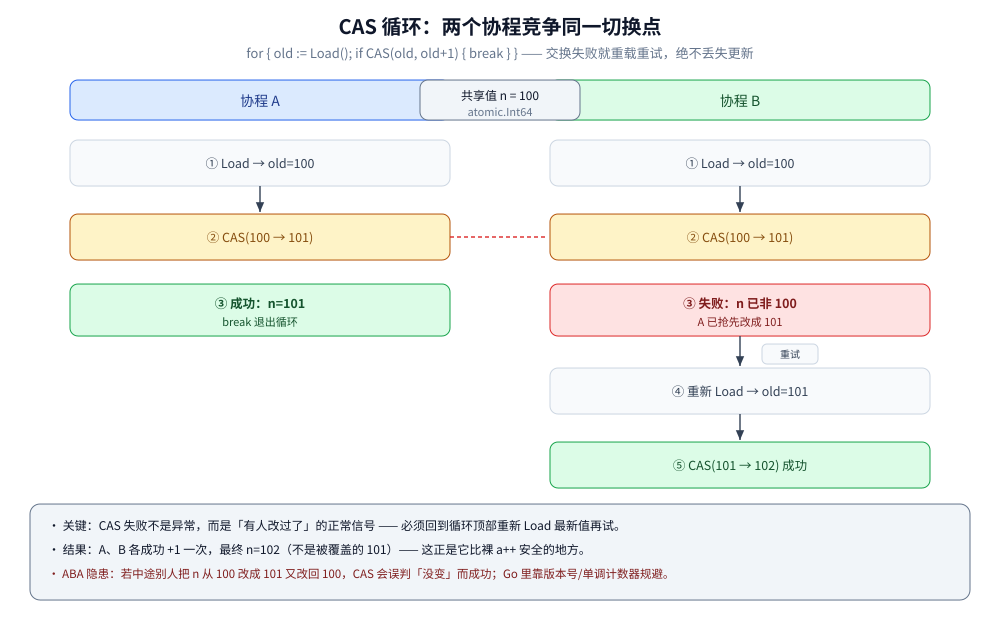

# atomic操作

> 本篇覆盖 atomic 的定位与判据、Go 1.19 类型族 vs 老函数族、64 位对齐坑、CAS 循环与 ABA、顺序一致的内存序、atomic.Value / Pointer[T] 发布不可变快照。
>
> 内容整理自个人学习笔记，素材见 [素材清单.md](../../../素材清单.md)。

---

## 一、atomic 到底解决什么？它和 Mutex 怎么取舍？

**本节要点**：atomic 和锁是**两种互补的同步**——锁靠**阻塞**（抢不到就挂起），atomic 靠**不阻塞**（单条 CPU 原子指令 / CAS 原地重试）。判据只有一条：**临界区是不是"只碰一个变量的一次读 / 写"**。

### 1.1 根本区别

| 维度 | `sync/atomic` | `sync.Mutex` |
|---|---|---|
| 实现 | 单条 CPU 原子指令（x86 上带 `LOCK` 前缀 / `XCHG`） | 状态位 + 信号量，抢不到就**挂起 goroutine** |
| 抢不到时 | **不阻塞**，CAS 循环在用户态空转重试 | **阻塞**，让出 P 去跑别的 goroutine |
| 保护范围 | **一个变量**（或塞得进一个机器字的一组数据） | **一段临界区**（多个变量、多处操作） |
| 典型用途 | 计数器、标志位、一次性发布、无锁栈 | 复合不变量、多字段一致性、含 IO 的长临界区 |

> ⭐ 一句话：**atomic 是"给一个变量上保险"，Mutex 是"给一段代码上保险"**。要"读-改-写多个字段都不被插队"，atomic 救不了你 —— 那必须用锁。

### 1.2 取舍判据

- 临界区**只有一条指令级的读或写**（一个 int64 自增、一个 bool 置位、一个指针替换）→ **atomic**；
- 临界区是**多指令的"读→判断→写"、或跨多个字段、或里面有函数调用 / IO** → **Mutex**；
- 竞争**极其激烈**时，CAS 反复重试会**空转烧 CPU**，此时 Mutex"抢不到就挂起、让出 P"反而更划算。


**图怎么读**：从"要保护的临界区长啥样"出发，只碰**一个对齐变量**就往右走到绿色"atomic 类型族"；否则往下判断"有没有 IO / 多字段一起变"，有就往右走到红色"Mutex"；两者都不是（要等条件、只初始化一次、传所有权）落到灰色"sync 原语"。图下半段是关键警示：**atomic.Load 只保证这一次读原子，读到和据此去做之间状态可能已变**，要整段不被插队只能上锁。

---

## 二、两套 API：老函数族 vs Go 1.19 类型族

**本节要点**：Go 1.19（2022）为 `sync/atomic` 加了一整套**类型**（`atomic.Int64` 等），从此**新代码应该用类型族**，而不是 `atomic.AddInt64(&x, 1)` 这种函数族。两者性能相同（实测见 2.4），差别全在**安全性**。

### 2.1 老函数族（一直就有）

```go
var n int64
atomic.AddInt64(&n, 1)                    // 原子加，返回新值
v := atomic.LoadInt64(&n)                 // 原子读
atomic.StoreInt64(&n, 0)                  // 原子写
old := atomic.SwapInt64(&n, 9)            // 原子交换，返回旧值
swapped := atomic.CompareAndSwapInt64(&n, 0, 1) // 值等于 0 才换成 1
```

每个类型一套后缀：`Int32 / Int64 / Uint32 / Uint64 / Uintptr / Pointer`。

### 2.2 Go 1.19 类型族（推荐）

| 类型 | 方法 | 引入 |
|---|---|---|
| `atomic.Int32` / `Int64` / `Uint32` / `Uint64` / `Uintptr` | `Add` / `Load` / `Store` / `Swap` / `CompareAndSwap`（64 位版另有 `And`/`Or`） | **Go 1.19** |
| `atomic.Bool` | `Load` / `Store` / `Swap` / `CompareAndSwap` | **Go 1.19** |
| `atomic.Pointer[T]` | `Load` / `Store` / `Swap` / `CompareAndSwap` | **Go 1.19** |
| `atomic.Value` | `Load` / `Store` / `Swap` / `CompareAndSwap` | 更早已存在 |

```go
var cnt atomic.Int64
cnt.Add(1)
v := cnt.Load()

var ready atomic.Bool
ready.Store(true)

var cfg atomic.Pointer[Config]
cfg.Store(&Config{})
```

go1.26.8 `go doc sync/atomic.Int64` 原样：

```text
type Int64 struct {
	// Has unexported fields.
}
    An Int64 is an atomic int64. The zero value is zero.

    Int64 must not be copied after first use.

func (x *Int64) Add(delta int64) (new int64)
func (x *Int64) Load() int64
func (x *Int64) Store(val int64)
func (x *Int64) Swap(new int64) (old int64)
func (x *Int64) CompareAndSwap(old, new int64) (swapped bool)
```

### 2.3 为什么推荐类型族

go1.26.8 `go doc sync/atomic.AddInt64` 自己就在劝退函数式写法（原文）：

```text
AddInt64 atomically adds delta to *addr and returns the new value.
Consider using the more ergonomic and less error-prone Int64.Add instead
(particularly if you target 32-bit platforms; see the bugs section).
```

类型族同时提供三件事：

1. **自带对齐保证** —— `Int64` / `Uint64` 内部用 `align64` 标记强制 8 字节对齐，32 位平台上不会因偏移错位而 panic（见第三节）；
2. **方法式 API，不会漏 `&`** —— 函数族要求你每次都写 `&x`，写成 `atomic.AddInt64(x, 1)` 或对着拷贝出来的副本做原子操作，是隐蔽 bug；类型族把状态封在结构里、`must not be copied`，拷贝会被 `go vet` 的 `copylocks` 拦下；
3. **可发现性** —— `x.Add(1)` 比 `atomic.AddInt64(&x, 1)` 更不容易"忘了原子性"。

### 2.4 实测与一处诚实更正

- 容器 go1.26.8 里 `atomic.Int64`、`atomic.Bool`、`atomic.Pointer[T]`、`atomic.Value` 均可编译、可运行；函数族与类型族在"自增竞争"场景实测同量级（见使用节的 Add 对比，约 `17 ns/op`）。
- ⚠️ **常见资料会列 `atomic.CAS64` / `atomic.Swap64` 两个接口**：但在本机 go1.26.8 用 `go doc -all sync/atomic` 与 `grep` 源码**均查无此符号**。本篇只列实测确认存在的类型族，**不要往代码里写 `atomic.CAS64`**。

---

## 三、对齐坑：64 位原子操作为什么要 8 字节对齐

**本节要点**：这是 Go 1.19 引入类型族的**直接动因**。规则来源是 `sync/atomic` 的文档注释与源码里的 `align64`，**下面两段都是 go1.26.8 源码原文**；至于"未对齐会 panic"这个运行时后果，**本机是 64 位环境，未在 32 位平台实测复现**，特此说明。

### 3.1 规则原文（`sync/atomic` 包文档 BUG 段，go1.26.8）

```text
On ARM, 386, and 32-bit MIPS, it is the caller's responsibility to arrange
for 64-bit alignment of 64-bit words accessed atomically via the primitive
atomic functions (types Int64 and Uint64 are automatically aligned).
The first word in an allocated struct, array, or slice; in a global
variable; or in a local variable (because on 32-bit architectures, the
subject of 64-bit atomic operations will escape to the heap) can be
relied upon to be 64-bit aligned.
```

拆开读：

| 说法 | 含义 |
|---|---|
| `On ARM, 386, and 32-bit MIPS` | **只在 32 位平台**才有这个坑；64 位平台天然 8 字节对齐 |
| `caller's responsibility ... via the primitive atomic functions` | 用**函数族**时**你自己**要保证对齐 |
| `types Int64 and Uint64 are automatically aligned` | 用**类型族**时**编译器替你保证** |
| `The first word in an allocated struct, array, or slice; in a global variable ...` | 可依赖对齐的位置：**结构体第一个字段 / 全局变量 / 切片首元素** |

### 3.2 struct 里的实践规则

在 32 位平台，一个 `int64` 字段如果前面有 `uint32`、`bool` 之类，它的**偏移可能是 4**（不是 8 的倍数），对它调 `atomic.AddInt64` 就会出问题。规避：

```go
// ❌ 32 位平台上 n 可能未对齐
type Bad struct {
	pad uint32
	n   int64 // 前面 4 字节 → n 偏移 = 4，不是 8 的倍数
}

// ✅ 方案一：把 64 位原子字段放结构体第一个（可依赖对齐）
type Good1 struct {
	n   int64 // 首字段，8 字节对齐
	pad uint32
}

// ✅ 方案二（推荐）：直接用类型族，对齐由编译器负责
type Good2 struct {
	pad uint32
	n   atomic.Int64 // 自带对齐保证
}
```

### 3.3 align64 源码注释原文

`sync/atomic` 用下面这个空结构体做对齐标记（`type.go`，go1.26.8 原样）：

```go
// align64 may be added to structs that must be 64-bit aligned.
// This struct is recognized by a special case in the compiler
// and will not work if copied to any other package.
type align64 struct{}
```

`Int64` / `Uint64` 的定义里第一个字段就是 `_ align64`（源码 `type.go` 实测）—— 编译器看到这个标记就把整个结构 8 字节对齐。**这就是"类型族自带对齐"的实现根据**。

> ⚠️ **诚实标注**：本节关于"32 位平台未对齐 → panic"的**运行时后果来自源码注释与包文档，本机 go1.26.8 跑在 linux/amd64（64 位），未做 386/ARM 实测复现**。结论的权威依据是上面两段原文，不是本地读数。

### 3.4 ⚠️ 伪共享：对齐不只影响"能不能跑"，还影响"跑多快"

对齐坑的第二层代价在**性能**上：原子操作保证的是**逻辑正确**，但**吞吐会被 cache line 拖累**。
如果两个高频写的变量落在**同一条 64 字节缓存行**上，两个核会不停地把这条 cache line 抢来抢去
（每次写都要让对方的缓存失效），这就是 **false sharing（伪共享）**。

实测：两个 goroutine 各自原子自增一个计数器 —— 一个版本让两个计数器紧挨着，另一个用 56 字节填充把它们推到不同缓存行：

```go
type Counters struct {     // 两个计数器落在同一条 cache line 上
    a atomic.Int64
    b atomic.Int64
}

type Padded struct {       // 56 字节填充，把 b 推到下一条 cache line
    a atomic.Int64
    _ [56]byte
    b atomic.Int64
}
```

```text
BenchmarkAtomicFalseSharing-8   25866472    40.24 ns/op    0 B/op    0 allocs/op
BenchmarkAtomicPadded-8        139777624     8.632 ns/op    0 B/op    0 allocs/op
```

⭐ **同样的逻辑，只改内存布局，快了 4.7 倍**（40.24 → 8.632 ns/op；⚠️ 时序类读数，同机复跑会有波动，**只主张"拉开缓存行更快"这个趋势**，别把倍数当 SLA）。

工程含义与 3.2 的实践规则是同一条：**高频写的字段要拉开距离**（每个 worker 一份计数、定期汇总），
不要把所有计数器放进同一个 struct 挨着写。`sync.Pool` 按 P 分片、GMP 里 P 自带 padding（`key align64`）
都是同一味药，见 [GMP调度.md](../运行时/GMP调度.md) 与 [sync.Pool.md](sync.Pool.md)。

---

## 四、CAS 循环怎么写？ABA 在 Go 里怎么暴露

**本节要点**：`CompareAndSwap`（CAS）是无锁结构的原语：**值等于预期才换成新值，否则失败**。因为它"只试一次"，所以真正的更新几乎都写在一个 `for` 重试循环里。

### 4.1 循环骨架

```go
// 把共享计数器自增一次（用 CAS 而非 Add，演示循环写法）
for {
	old := cnt.Load()             // ① 取当前值
	next := old + 1               // ② 基于它算新值
	if cnt.CompareAndSwap(old, next) { // ③ 只有没被人改过才写成功
		break                     // ④ 成功 → 退出
	}
	// ③ 失败说明中途有人改过 → 回到 ① 重新 Load 最新值再试
}
```

- **失败不是异常**，而是"有人抢先改了"的正常信号；
- **必须回到循环顶部重新 Load**，不能拿旧的 `old` 反复试 —— 那样永远不等、永远失败；
- 竞争越激烈、重试次数越多 → 这就是 1.2 里"高竞争 CAS 空转烧 CPU"的来源。

### 4.2 ABA：值转一圈又变回原样



**图怎么读**：两个协程在同一条 `CAS` 上竞争。左列 A、右列 B 都 `Load` 到 `old=100`；A 先 `CAS(100→101)` **成功**并 `break`；B 的 `CAS(100→101)` **失败**（此刻 n 已是 101），于是 B 走"重新 Load→101→CAS(101→102)→成功"。两次 +1 都保留，最终 `n=102` —— 这正是 CAS 循环比裸 `a++`（见 [线程安全.md](线程安全.md) 第二节丢失更新）安全的地方。

**ABA 问题**：若某协程把值从 `A` 改成 `B` 又改回 `A`，另一协程的 `CAS(A→…)` 会**误判"没变过"而成功**。

在 Go 里的**实际暴露面**（不是理论，是这几类真场景）：

| 场景 | 为什么可能 ABA | 规避 |
|---|---|---|
| 对**指针**做 CAS（无锁链表 / 栈） | 节点被释放又被复用，地址相同 | Go 有 GC，"被 free 后地址复用"比 C 少见，但仍可能撞上对象池复用 |
| 状态机 / 版本号用同一个字编码 | 序号回绕后回到同一值 | **加单调版本号**：CAS 比对 (值, 版本) 而非裸值 |
| `CompareAndSwapInt64` 比对时间戳 / 计数 | 值恰好回到原数 | 把"代数 / epoch"拼进同一 64 位一起比 |

> ⭐ Go 没有 C++ 那种手动内存回收，ABA 触发概率低；**但凡你在对指针 / 复合状态做 CAS，就带一个单调递增的版本号**，把它和真正的值绑在一起比 —— 这是标准解法。

### 4.3 实测：能一条 Add 搞定的，就别写 CAS 循环

容器 go1.26.8（4 核，`RunParallel`）各跑 3 次的区间：

| 写法 | ns/op（3 次区间） | 说明 |
|---|---|---|
| `cnt.Add(1)` | ~15 – 22 | 硬件直接完成 |
| CAS 循环自增 | ~27 – 32 | 每轮多一次 `Load` + 可能的重试 |

> 结论：**自增这种"只加一个数"的语义用 `Add` 就够，别用 CAS 循环** —— CAS 是给"基于旧值算新值、且要保证没人中途改过"的场景准备的。

---

## 五、内存序：Go 的 atomic 是"顺序一致"的

**本节要点**：Go 的原子操作**不是** C++ 里的 `relaxed` —— 它是 **sequentially consistent（顺序一致）**，最强的内存序。这意味着**你不能拿它当"廉价的、只保证可见性不保证顺序的可变共享变量"**。

go1.26.8 `go doc sync/atomic`（包文档原文）：

```text
In the terminology of the Go memory model, if the effect of an atomic
operation A is observed by atomic operation B, then A "synchronizes before"
B. Additionally, all the atomic operations executed in a program behave as
though executed in some sequentially consistent order. This definition
provides the same semantics as C++'s sequentially consistent atomics and
Java's volatile variables.
```

逐点解读：

| 原文 | 含义 |
|---|---|
| `A "synchronizes before" B` | 一次原子写**happens-before** 观察到它的原子读 —— 这是它"能当同步用"的依据 |
| `sequentially consistent order` | 所有原子操作像有一个全局总顺序，**没有 relaxed** |
| `same semantics as ... Java's volatile variables` | 语义 = Java `volatile`，强序 |

> ⚠️ 直接后果：**Go 没给你"关掉内存序换性能"的旋钮**（不像 C++ 的 `memory_order_relaxed`）。所以别指望"我用 atomic 是因为它比锁便宜"里的"便宜"是无条件的 —— 顺序一致要插内存屏障，真正的极致优化不属于标准库 atomic 的定位。**需要原子性就正常用；需要"廉价标志位"也用它，但别脑补它是 relaxed**。

---

## 六、atomic.Value 与 atomic.Pointer[T]：发布不可变快照

**本节要点**：读多写少地发布"一份完整配置 / 路由表"时，正确姿势是**写侧原子替换整个指针、读侧无锁取用**，读者永远看到"某一份完整快照"，绝不会读到"改了一半"。`atomic.Value` 能做但有硬限制；Go 1.19 起 `atomic.Pointer[T]` 更好。

### 6.1 atomic.Value 的两条硬限制（实测 panic 原文）

容器 go1.26.8 真跑 `atomic.Value`：

```go
var v atomic.Value
v.Store(42)               // 先存一个 int
fmt.Println(v.Load())      // 42
v.Store("换个类型")        // 存 string → panic
var nv atomic.Value
nv.Store(nil)             // 存 nil → panic
```

```text
存了 int 之后 Load = 42
再存 string → panic: sync/atomic: store of inconsistently typed value into Value
存 nil → panic: sync/atomic: store of nil value into Value
```

两条限制（`go doc sync/atomic.Value` 也印证"A consistently typed value"）：

1. **类型必须始终一致** —— 第一次 `Store` 就把类型定死，之后存不同类型直接 panic；
2. **不能存 `nil`** —— `Store(nil)` panic；`Load` 在从未 Store 过时返回 `nil`。

所以 `atomic.Value` 的定位很窄：**"同一种类型反复整体替换"**（配置、路由表）。

### 6.2 atomic.Pointer[T]：具体类型的首选

存"某个具体类型的指针"时，`atomic.Pointer[T]` 比 `Value` 更好：**类型安全、免断言、可存 nil**。

```go
var cfg atomic.Pointer[Config]

// 写侧：原子替换整个指针（读者永远看到某一份完整配置）
cfg.Store(&Config{Timeout: 5, Retries: 3})

// 读侧：无锁、无拷贝，拿到的指针指向一个不再变的快照
c := cfg.Load()
```

> ⭐ **存放进去的那个值必须是"之后不再被任何人改"的不可变快照**：写侧每次 `Store` 一个**新建的** `*Config`，而不是改已有的那份 —— 否则读侧正遍历、写侧就地改，原子指针也救不了（它只保证"指针替换"原子，不保护指向内容）。

### 6.3 与热重载 / 熔断 / 限流的关系（只写关系，不重讲）

- **配置热重载**用 `atomic.Pointer` 发布快照的完整工程约定（重载时哪些状态该保留、失败如何回退旧配置），见 [配置热重载与快照.md](../工程实践/配置热重载与快照.md)；本篇不重复讲那套契约。
- **限流器 / 熔断器**里的"在线数 / 计数 / 是否打开"这类单值状态，正是 atomic 的典型落点：见 [限流器.md](限流器.md) 与 [熔断器.md](../../../04-架构与系统/分布式/服务治理/熔断器.md)。本篇只讲"用什么原语"，具体算法在那两篇。

---

## 使用：读多写少的不可变快照发布（最小实现 + benchmark）

**本节要点**：一个可抄的"发布最新配置快照"最小实现，并给读侧真实读数。

```go
package snapshot

import "sync/atomic"

type Config struct {
	Timeout int
	Retries int
	Debug   bool
}

// 全局只读快照：读侧 Load，写侧整块替换指向的新对象。
var current atomic.Pointer[Config]

func init() {
	current.Store(&Config{Timeout: 3, Retries: 2}) // 保证首次 Load 非 nil
}

// 读侧：无锁、无拷贝，拿到的指针指向不可变的一份。
func Get() *Config { return current.Load() }

// 写侧：构造全新对象再 Store —— 绝不就地改 Get() 拿到的旧对象。
func Update(timeout, retries int, debug bool) {
	current.Store(&Config{Timeout: timeout, Retries: retries, Debug: debug})
}
```

对照写法（用 `RWMutex` 保护一个指针）：`mu.RLock(); c := p; mu.RUnlock()`。两者功能等价，但 atomic.Pointer 读侧更省。

实测读侧（容器 go1.26.8，4 核，`RunParallel`，各 3 次区间，均 0 alloc）：

| 读侧方式 | ns/op（3 次区间） |
|---|---|
| `atomic.Pointer.Load` | ~19 – 22 |
| `RWMutex` + 普通读 | ~34 – 52 |

> ⭐ 读多写少地发布快照，`atomic.Pointer[T]` 读侧大约省一半时间（且区间整体更低）；写侧成本几乎不变（都要换指针）。**关键纪律仍是：被发布的对象必须不可变**（6.2）。

---

## 延伸追问

- **atomic 能替代 Mutex 吗？** → 不能。atomic 只保护**一个变量的一次读/写**；多个字段要一起变、或临界区含 IO / 较长代码时，必须用锁（atomic 给不了临界区语义）。
- **新代码该用 `atomic.AddInt64(&x,1)` 还是 `atomic.Int64`？** → 用类型族 `atomic.Int64`（Go 1.19 起）。它自带对齐保证、方法式 API 不漏 `&`、还带 noCopy 防拷贝；函数族在 32 位平台要你自己对齐。
- **atomic.Int64 是什么时候加的？** → **Go 1.19**（同批还有 `Bool`、`Pointer[T]`、`Uint64` 等）。`atomic.Value` 更早就有。
- **`atomic.CAS64` / `atomic.Swap64` 存在吗？** → 在本机 go1.26.8 用 `go doc -all sync/atomic` 与 `grep` 源码**查无此符号**，不要往代码里写。
- **64 位原子为什么要对齐？在哪才会出问题？** → 只在 **32 位平台（ARM/386/32 位 MIPS）**：用函数族时，struct 里 `int64` 字段的偏移若不为 8 的倍数会出问题；把 64 位原子字段放结构体**首字段**、或直接用 `atomic.Int64`（内部 `align64` 标记）可保证对齐。该结论引自 go1.26.8 源码注释，本机 64 位未实测运行时 panic。
- **CAS 循环为什么要重新 Load？** → `CompareAndSwap` 失败说明值已被别人改过，旧 `old` 不再匹配，**必须回循环顶部取最新值再比**；拿旧值反复试永远失败。
- **什么是伪共享？和 atomic 有什么关系？** → 两个高频写的变量落在同一条 64 字节 cache line 上，多核互相使缓存失效，**逻辑对但吞吐被拖死**；解决办法是 padding 拉开或每 worker 一份再汇总，实测 40.24 → 8.632 ns/op（趋势，见 3.4）。
- **ABA 在 Go 里严重吗？** → 有 GC，"释放后地址复用"比 C 少见，但对指针/复合状态做 CAS 仍可能撞上；**带一个单调版本号**、把 (值, 版本) 一起比是标准解法。
- **Go 的 atomic 是 relaxed 的吗？** → 不是，是 **sequentially consistent**（等价 C++ 顺序一致原子、Java volatile）。Go 不提供关闭内存序的旋钮，别把它当"只保证可见性的廉价变量"。
- **`atomic.Value` 有什么限制？** → **类型必须始终一致**（先存 int 再存 string 直接 panic）、**不能存 nil**；只适合"同一类型整体替换"。具体类型改用 `atomic.Pointer[T]`：类型安全、免断言、可存 nil。
- **发布快照时能就地改已发布对象吗？** → 不能。写侧每次 `Store` 一个**新建的**对象；就地改会让正读取的协程看到"改了一半"，原子指针只保证"指针替换"原子，不保护指向内容。

---

## 关联

- [并发同步原语.md](并发同步原语.md) — Mutex / RWMutex / Once / WaitGroup 与本篇一、五节的"阻塞 vs 不阻塞"对照
- [线程安全.md](线程安全.md) — 裸 `a++` 丢失更新（本图用 CAS 循环规避），及"三类线程安全类型"
- [sync.Map.md](sync.Map.md) — 同样"为并发特化"的标准库件；sync.Map 底层也用原子读
- [配置热重载与快照.md](../工程实践/配置热重载与快照.md) — `atomic.Pointer` 发布配置快照的工程契约（本篇不重讲）
- [限流器.md](限流器.md) — 计数器 / 令牌数用 atomic 的具体落点
- [熔断器.md](../../../04-架构与系统/分布式/服务治理/熔断器.md) — "是否打开"状态位的发布落点
- [测试与Mock.md](../工程实践/测试与Mock.md) — 原子性与伪共享的实测要配 -race / -bench，测试架与旗标口径在彼
