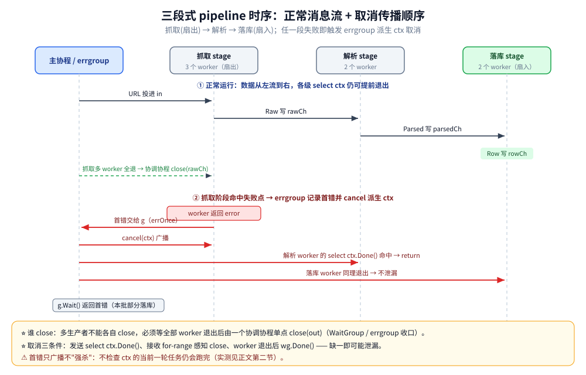

# errgroup 与 pipeline

> errgroup 的取消 + 首错传播 + Wait 三件事、三个 API 的硬约束、SetLimit 与首错语义的实测边界，
> 以及把 pipeline（扇出 / 扇入 / 分阶段）讲成一套独立体系 —— channel 谁来 close、取消为什么不泄漏。
>
> 内容整理自个人学习笔记，素材见 [素材清单.md](../../../素材清单.md)；
> 所有读数在容器 go1.26.8（`golang:1.26-alpine`）真跑，errgroup 用 `golang.org/x/sync v0.23.0`。
> goroutine 的起法 / 限并发 / worker 池本身见 [goroutine实战模式.md](goroutine实战模式.md)，本篇不重复。

---

## 一、errgroup 到底解决什么问题？和 WaitGroup 差在哪？

**本节要点**：先钉住 errgroup 的定位 —— 它是**一组 goroutine 的「取消 + 首个错误传播 + Wait」三合一**，
而 `sync.WaitGroup` 只负责"等齐"这一件事。谁该负责"失败即终止"，是区分两者的唯一判据。

### 1.1 一句话定义

`golang.org/x/sync/errgroup` 的包注释原文（容器内 `go doc` 抄录）：

```text
Package errgroup provides synchronization, error propagation, and Context
cancellation for groups of goroutines working on subtasks of a common task.

[errgroup.Group] is related to [sync.WaitGroup] but adds handling of tasks
returning errors.
```

拆开就是三件事：**同步（等齐）**、**错误传播（收敛首错）**、**context 取消（一错全停）**。
它和 `WaitGroup` 是"亲缘关系"，但多包了后两件。

### 1.2 谁负责"失败即终止"

| 能力 | `sync.WaitGroup` | `errgroup.Group` |
|---|---|---|
| 等一批协程结束 | ✅ `Add` / `Done` / `Wait` | ✅ 内部就是 `WaitGroup` |
| 收集错误 | ❌ 要自己 `mutex` + `slice` | ✅ `Wait` 返回首个非 nil error |
| 失败即取消其余 | ❌ 要自己 `WithCancel` + 传下去 | ✅ `WithContext` 派生的 ctx 首错即 cancel |

> 判据一句话：**只要"等齐"用 `WaitGroup`；要"一错全停 + 收敛错误"才升级到 `errgroup.WithContext`**。
> 手写 `WaitGroup` + `cancel` + 错误聚合也能拼出这套，但极容易漏掉"取消"那一半 —— 这正是 [goroutine实战模式.md](goroutine实战模式.md)
> 案例 4 反复强调的点，本篇把它讲透。

### 1.3 一个最常见的落地形态：请求入口的多段独立查询

一个详情接口要拼汇总 / 流水 / 标签三段互不依赖的查询，串行跑就是多次 RTT 相加：

```go
g, gctx := errgroup.WithContext(ctx) // 派生自请求 ctx → 客户端断开就全停
g.Go(func() error { var e error; sum, e = repo.Summary(gctx, q); return e })
g.Go(func() error { var e error; list, e = repo.List(gctx, q); return e })
g.Go(func() error { var e error; tags, e = repo.Tags(gctx, q); return e })
if err := g.Wait(); err != nil {
    return err // 任一段失败，其余请求随 gctx 一起被取消
}
```

⚠️ `gctx` 必须派生自请求 ctx，否则客户端已断开、后端还在空跑（取消与超时的语义见
[context.md](../工程实践/context.md) 第五节）。各段耗时之和要明显大于最慢那段，并发才有意义 ——
三段各 10ms 的查询并发起来只会更慢。

### 延伸追问

- **errgroup 能替代 WaitGroup 吗？** → 单向可以：errgroup 内部含 WaitGroup；但纯"等齐"用 errgroup 是过度设计。
- **errgroup 会等所有任务返回才取消吗？** → 不会。首错一出现就 `cancel`，其余任务只要检查 ctx 就能提前收工。
- **一个 Group 能复用给下一批任务吗？** → 不能。包注释明确「A Group should not be reused for different tasks」。

---

## 二、三个 API 的硬约束是什么？

**本节要点**：`Go` / `Wait` / `WithContext` 各有一条不能违反的契约，
其中「`Go` 必须早于 `Wait`」最容易被并发写法踩破。原文全部来自容器内 errgroup 源码。

### 2.1 `WithContext`：派生一个"首错即取消"的 ctx

```text
WithContext returns a new Group and an associated Context derived from ctx.

The derived Context is canceled the first time a function passed to Go
returns a non-nil error or the first time Wait returns, whichever occurs first.
```

实现上它调的是 `context.WithCancelCause`（Go 1.20+），所以 `Wait` 返回后该 ctx **一定**已被取消 ——
用了 `WithContext` 就**不需要**再额外 `defer cancel()`。

```go
g, ctx := errgroup.WithContext(parent)
```

### 2.2 `Go` 与 `Wait`：⚠️ 第一个 Go 必须发生在 Wait 之前

`Go` 的注释里钉死了这条（容器源码原样抄录）：

```text
Go calls the given function in a new goroutine.

The first call to Go must happen before a Wait.
It blocks until the new goroutine can be added without the number of
goroutines in the group exceeding the configured limit.

The first goroutine in the group that returns a non-nil error will
cancel the associated Context, if any. The error will be returned
by Wait.
```

为什么是硬约束：`Go` 内部第一步就是 `g.wg.Add(1)`，而 `sync.WaitGroup` 的契约是
"**计数从 0 变正的那次 Add，必须发生在 Wait 之前**"。如果一边 `Wait` 一边从别的协程 `Go`，
就是在违反 WaitGroup 的 Add/Wait 顺序 —— 轻则 `Wait` 提前返回、漏等任务，
重则触发运行时的 WaitGroup 误用检查。

⚠️ 关于"并发调用 `Go` 与 `Wait` 会不会报 `-race`"：**本机容器 `golang:1.26-alpine` 无 gcc、`-race` 需要 cgo，
实测无法启用**（`-race requires cgo`）。因此这一条我不给 race 报告，直接引用上面 errgroup 官方注释原文
「The first call to Go must happen before a Wait」作为权威依据 —— 文档已经把它定为**契约级错误**，
不需要 race 报告来证明。

正确的"全部 Go 完再 Wait"形态就是 1.3 与本篇「使用」段那种：**先把循环里的 `g.Go` 全部提交完，再调一次 `g.Wait()`**。

### 2.3 `SetLimit` 的硬约束：active 期改上限会 panic（实测）

`SetLimit` 注释最后一行：

```text
The limit must not be modified while any goroutines in the group are active.
```

它的实现判的是 `len(g.sem) != 0` —— 只有"**已经设过 limit（sem 非 nil）且令牌被占着**"才会命中。
所以反例要这样构造才触发得出来：先 `SetLimit` → `Go` 占住令牌 → 再 `SetLimit`。容器真跑：

```go
var g errgroup.Group
g.SetLimit(2)                      // 先建 sem，容量 2
g.Go(func() error {
    time.Sleep(200 * time.Millisecond) // 占住一个令牌，保持 active
    return nil
})
time.Sleep(50 * time.Millisecond)   // 确保令牌已被占用
g.SetLimit(4)                       // ← active 期改上限 → panic
```

```text
尝试在协程 active 时再改 limit …
panic: errgroup: modify limit while 1 goroutines in the group are still active

goroutine 1 [running]:
golang.org/x/sync/errgroup.(*Group).SetLimit(...)
	.../golang.org/x/sync@v0.23.0/errgroup/errgroup.go:148 +0xe7
main.main()
	.../errgroup-lab/setlimitpanic/main.go:22 +0x94
exit status 2
```

> ⚠️ 顺带一个反直觉细节：对**零值 Group** 直接 `SetLimit` 不会 panic —— 因为 `g.sem` 还是 nil，
> `len(nil)==0` 检不到 active。必须"先设过 limit 又跑起来了"才落入误用窗口。

### 延伸追问

- **`g.Go` 里能直接 `return nil` 然后靠别处判错吗？** → 能，但错误就丢了；要收敛就 `return` 出去。
- **能在任务运行中调 `SetLimit` 吗？** → 不能（见 2.3），只能在还没有 active 协程时设。
- **`Wait` 之后还能 `Go` 吗？** → 不能，违反「first call to Go before a Wait」，Group 也不该复用。

---

## 三、SetLimit 怎么把"并发上限"与"任务总数"解耦？

**本节要点**：`SetLimit(n)` 让 `Go` 在协程数达到 n 时**阻塞在提交处**，
于是"总共发多少任务"和"同时最多跑几个"变成两个独立旋钮。

`SetLimit` 的行为：

```text
SetLimit limits the number of active goroutines in this group to at most n.
A negative value indicates no limit.
A limit of zero will prevent any new goroutines from being added.

Any subsequent call to the Go method will block until it can add an active
goroutine without exceeding the configured limit.
```

注意"**subsequent call to the Go will block**" —— 阻塞发生在**投递侧的 `g.Go`**，不是在协程内部。
这一点和 [goroutine实战模式.md](goroutine实战模式.md) 案例 5 里"令牌必须拿在 `go` 之前"的实测结论是**同一个道理**：
背压要作用在"创建"这一步，才能真正压住峰值协程数。

容器实测（10 个任务、每个睡 30ms、`SetLimit(3)`，用原子计数取在飞峰值）：

```text
10 个任务、SetLimit(3) → 实测同时在飞的最大任务数 = 3
```

### 3.1 SetLimit vs 手写 worker 池：取舍

| 维度 | `errgroup` + `SetLimit` | 手写 worker 池（`jobs` / `results` 双 channel） |
|---|---|---|
| 并发上限 | 一个数字搞定，投递即阻塞 | 固定 N 个 worker 抢 `jobs` |
| 任务从哪来 | 编译期/循环里已有一批 | 可持续投递（生产者长跑） |
| 错误与取消 | 自带首错 + ctx 级联 | 要自己收错误、自己 cancel |
| 常驻复用 | 用完即弃（Group 不复用） | worker 长期存活，省启停 |
| 适用 | 固定一组、跑完就收 | 任务持续到达、要控常驻协程数 |

> 判据：**"固定一组任务、跑完就完"用 `SetLimit`；任务持续产生、需要长期限流或复用协程用 worker 池**。
> 池的写法、以及"令牌拿在 go 之前 vs 里面"的实测差 60~70 倍，都在
> [goroutine实战模式.md](goroutine实战模式.md) 案例 5 与用法三，本篇不重讲。

### 延伸追问

- **`SetLimit(0)` 是什么意思？** → 阻止任何新协程加入（`Go` 会永久阻塞），文档明确写了这条语义。
- **SetLimit 和信号量 channel 是一回事吗？** → 底层都是令牌桶，`SetLimit` 帮你把它包进 `Go` 的阻塞点，省了手写 `sem <- struct{}{}`。
- **要限"每秒请求数"能用 SetLimit 吗？** → 不能，它限的是**同时在飞数量**不是**速率**；速率控制见 [限流器.md](限流器.md)。

---

## 四、首错语义：cancel 之后到底会发生什么？

**本节要点**：三个必须讲清的边界 —— ① `Wait` 只返回**第一条**错误；
② cancel 是**广播信号**不是"强杀"，已提交任务的**当前一轮仍会跑完**；③"只取 N 个成功"得自己写。

### 4.1 实测：一错全停的完整时序

容器实测（5 个任务，时长分别 100/200/300/400/500ms，第 2 个在 200ms 主动返回业务错误）：

```text
  任务 1 完成（100ms）
  任务 3 被取消（context canceled，到点本应 300ms）
  任务 5 被取消（context canceled，到点本应 500ms）
  任务 4 被取消（context canceled，到点本应 400ms）
g.Wait() 返回：任务 2 失败（总耗时 209ms）
```

读三件事：**任务 1** 在失败点（200ms）之前已经跑完，不会被撤回；**任务 2** 的错误就是 `Wait` 的返回值；
**任务 3/4/5** 因为在 `select` 里检查了 ctx，一收到 cancel 就退出 —— 所以总耗时 ≈ 首错时间 200ms，而不是最长的 500ms。
被取消任务"到点本应 Xms"说明它们**没等满自己那段 sleep**，是被 ctx 提前唤醒的。

### 4.2 ⚠️ cancel 不强杀：不检查 ctx 的任务照样跑完

如果任务体里**根本不 select ctx**（比如就是一段 `time.Sleep` 或纯计算循环没查 ctx），
cancel 对它毫无影响 —— 它会把**当前这一轮**跑完，`Wait` 也得等它。容器实测：

```text
  慢任务仍跑完（不检查 ctx，150ms）
尽管首错已 cancel，未检查 ctx 的慢任务照样跑完 → Wait 到 150ms 才返回，err=快速失败
```

> 这与 [context.md](../工程实践/context.md) 反复强调的一致：**context 只负责"通知"，不负责"强杀"**。
> 想让任务能被提前叫停，就得把 ctx 一路传下去、在可中断点 `select ctx.Done()`。

### 4.3 错误聚合：`Wait` 只给首错，全量交给 errors.Join

`Wait` 的实现是 `errOnce.Do` 记第一条 —— 后续子任务的错误**被丢弃**。要保留全部错误，
得自己在每个 `g.Go` 里把错误收进一个带锁的切片，最后 `errors.Join` 起来。**`errors.Join` 是 Go 1.20 引入的**（不是 1.21）。

容器实测（3 个子任务各返回一个错误）：

```text
Wait 只返回首错：子任务 1 出错
errors.Join 聚合全部子错误：
子任务 1 出错
子任务 3 出错
子任务 2 出错
```

> 取舍：需要"任一失败就整体失败 + 快速取消" → 直接 `WithContext` 用首错；
> 需要"跑完所有、汇总全部错误"（比如批量校验）→ **别用 `WithContext`**（否则第一个错误会把其余任务取消掉，
> 你就拿不到完整错误列表了），用零值 `Group` + 自己聚合 + `errors.Join`。

### 4.4 "只取 N 个成功结果"要自己写

errgroup **不帮你筛"凑够 N 个成功就收"** —— 它只认"首错"。要做"取够即停"，得自己计数，
凑够 N 个后**主动返回一个哨兵错误**借 `WithContext` 的取消机制把其余任务叫停：

```go
g, ctx := errgroup.WithContext(context.Background())
const want = 3
var mu sync.Mutex
var ok int
var firstErr error
for id := 1; id <= 6; id++ {
    id := id
    g.Go(func() error {
        if id%2 != 0 {                 // 模拟奇数失败
            return fmt.Errorf("任务 %d 失败", id)
        }
        <-time.After(time.Duration(id) * 10 * time.Millisecond)
        mu.Lock(); ok++; got := ok; mu.Unlock()
        if got >= want {               // 凑够就返回哨兵错误 → 触发 ctx 取消
            mu.Lock(); if firstErr == nil { firstErr = errStopAll }; mu.Unlock()
            return errStopAll
        }
        return nil
    })
}
err := g.Wait()
```

```text
凑够 3 个成功就提前收摊：ok=3，Wait 返回 任务 1 失败
```

> ⚠️ 看清楚了：`Wait` 返回的是**首错**（"任务 1 失败"），不是你想要的"凑够了"信号 ——
> 所以"取 N 个成功"这套**语义上很别扭**，`errgroup` 并不是它的理想工具。
> 真要"取够即停"，用 `select` + 结果 channel + `context.WithCancel` 手写更直白（见 4.2 的教训：别指望它替你筛成功数）。

### 延伸追问

- **首错之后 `Wait` 会立刻返回吗？** → 不会，它等**所有已提交的 `g.Go` 任务**都返回（含不检查 ctx 的）才返回。
- **能拿到"所有"错误吗？** → `Wait` 只给首错；全量要靠自己在任务里收集 + `errors.Join`（Go 1.20+）。
- **"取 N 个成功"为什么用 errgroup 别扭？** → 它只有"首错即取消"的原语，没有"够数即停"的原语，只能拿哨兵错误硬凑。

---

## 五、pipeline：扇出 / 扇入 / 分阶段与 channel 生命周期

**本节要点**：这一节把 pipeline 当成**一套独立体系**来讲，而不是 errgroup 的附属。
核心是三个问题：**数据怎么在 stage 间流**、**每个 channel 谁来 close**、**缓冲开多大**。

### 5.1 三种基本形态

```text
扇出 fan-out：一个上游 → 多个同类 worker 并发消费同一 channel（拆分吞吐）
   producer ──┬─▶ worker1 ─┐
              ├─▶ worker2 ─┼─▶ 汇总
              └─▶ worker3 ─┘
扇入 fan-in：多个生产者 → 一个下游（合并）
   a ─┐
   b ─┼─▶ consumer
   c ─┘
分阶段 stage：抓取 → 解析 → 落库，每级一个（组）goroutine，串成流水线，级间用 channel 交接
```

扇出解决"单消费者处理不过来"，扇入解决"多来源要归一"，分阶段解决"不同环节耗时差异大、可以重叠"。
这三者叠加就是典型的"抓取(fan-out) → 解析 → 落库(fan-in)"三段 pipeline。

### 5.2 ⭐ channel 生命周期：谁来 close（多生产者不能各自 close）

这是 pipeline 最容易出错、也最容易被追问的点。规则只有一条：

> **一个 channel 只能由"确认所有发送方都已结束"的那一方 close，且只 close 一次。**
> **多个生产者各自 `close` 同一个 channel = panic（close of closed channel）；生产者都不 close、
> 由消费者 close = 同样错**。

所以多生产者 stage 的收口必须引入一个"协调协程"：用 `WaitGroup` 等齐所有 worker，再由**它一个**去 `close(out)`。
这正是 [channel实战模式.md](channel实战模式.md) 第三节"多生产者 + 单消费者两个同步点"的结论，本篇把它接到 errgroup 上：

```go
// 抓取有 fanout 个 worker，全部退出后才关 rawCh
var wgFetch sync.WaitGroup
for i := 0; i < fanout; i++ {
    wgFetch.Add(1)
    go func() {
        defer wgFetch.Done()
        for u := range in {            // in 关闭 → range 结束 → worker 退出
            out <- Raw{...}
        }
    }()
}
go func() {
    wgFetch.Wait()                     // 等齐所有 worker
    close(out)                         // ★ 单点 close，只关一次
}()
```

用 errgroup 收口多生产者也是同一套：把每个 worker 装进 `g.Go`，`g.Wait()` 返回即代表全部结束，
**在 `Wait` 之后**再 `close(out)`。关键区别：`WaitGroup` 版本你要手写"等齐"，`errgroup` 把"等齐 + 首错"打包了。

| 收口方式 | 谁 close(out) | 附带拿到什么 |
|---|---|---|
| `WaitGroup` + 协调协程 | 协调协程在 `wg.Wait()` 后关 | 只有"等齐" |
| `errgroup` + 协调 | `g.Wait()` 返回后关 | 等齐 + 首错 + 级联取消 |

### 5.3 背压与缓冲选择

stage 间的 channel 开多大缓冲，直接决定"上下游速度差怎么消化"：

| 缓冲设置 | 效果 | 何时用 |
|---|---|---|
| **无缓冲 `make(chan T)`** | 上下游严格同步：下游没接，上游发送即阻塞（天然背压） | 阶段耗时接近、要控内存峰值 |
| **小缓冲 `make(chan T, N)`** | 允许 N 个的"速度差"，削峰但不无限堆积 | 下游偶发抖动，想缓冲一批 |
| **大缓冲 / 不限量** | 上游一路狂奔把数据堆在 channel 里 → 内存 O(积压量) | ⚠️ 基本是反模式，等于放弃背压 |

> 判据：**缓冲是为了"吸收抖动"，不是为了"假装不阻塞"**。
> 需要真正的背压就用无缓冲或小缓冲，让"下游跟不上"这件事如实回传给上游 —— 机制细节见
> [channel原理与底层实现.md](channel原理与底层实现.md)。

### 5.4 取消时不能泄漏 goroutine

pipeline 一旦某 stage 停止接收（出错 / ctx 取消），**上游 worker 会永久阻塞在 `out <-` 上** ——
这就是最常见的协程泄漏现场。发送侧必须 `select ctx.Done()`：

```go
select {
case out <- item:      // 正常交接
case <-ctx.Done():     // ★ 取消 → 撒手退出，不卡发送
    return
}
```

容器实测的泄漏对照（`runtime.NumGoroutine()`，先 GC + sleep 稳定基线）：

```text
泄漏版：基线 2 → 跑一轮后 4（多出的 worker 卡在 out 发送上，收不回来）
取消版：基线 4 → cancel 后 4（worker 感知 ctx 自行退出，未泄漏）
```

三段式 pipeline 中途失败的收口实测（抓取阶段命中失败点）：

```text
取消路径：Wait 返回 抓取失败: zzz，本批只落库 5 行
协程数：进入前 5 → 收口后 4（差值应回落，未泄漏）
```

> ⚠️ 取消能"发信号"，但真正让 worker 退出的还是**发送/接收处的 `select ctx.Done()`** 和
> **worker 退出后 `wg.Done()`**。判据与十个泄漏现场见 [协程泄漏与死锁.md](协程泄漏与死锁.md)，本篇不重复列举。



图怎么读：上半区（①）是正常运行时数据从左向右流 —— 主协程投 URL、抓取写 rawCh、解析写 parsedCh、落库写 rowCh，
抓取多 worker 全退后由协调协程单点 `close(rawCh)`；下半区（②）是抓取某个 worker 返回 error 后，
首错交给 errgroup（errOnce）→ errgroup `cancel(ctx)` 广播 → 解析、落库 worker 的 `select ctx.Done()` 命中并 return，
最后 `g.Wait()` 返回首错、本批只落了部分行。红线是取消传播方向，与蓝/绿的数据流方向相反。

### 延伸追问

- **扇出后各级 worker 数量要一致吗？** → 不必；抓取 CPU/IO 密集可多开 worker，落库是单一有序流就只能 1 个（并发写出会乱序）。
- **中间 channel 满了会怎样？** → 上游发送阻塞 —— 这就是背压；要么加大缓冲（堆内存）要么让上游慢下来。
- **谁能接收已 close 的 channel？** → 所有人；读到零值 + `ok=false`，`for range` 自然结束（"关闭后仍可读"，见 [channel使用陷阱.md](channel使用陷阱.md)）。

---

## 使用：三段式 pipeline（抓取 → 解析 → 落库）+ errgroup 收敛

**本节要点**：一个完整可运行、容器真跑的 pipeline。
结构是：主协程投 URL → 抓取阶段**扇出** 3 个 worker → 解析 2 个 → 落库**扇入** → `errgroup.WithContext` 统一收敛取消。
每个 stage 的发送都 `select ctx.Done()`，多生产者的 `close` 全交给协调协程在 `WaitGroup` 等齐后单点执行。

```go
func runPipeline(ctx context.Context, urls []string, fanout int, failURL string) ([]Row, error) {
    in := make(chan string)
    rawCh := make(chan Raw)
    parsedCh := make(chan Parsed)
    rowCh := make(chan Row)
    var wgFetch, wgParse, wgStore sync.WaitGroup
    var fetchErr atomic.Value

    // 生产者：投 URL，投完 close(in)
    wgFetch.Add(1)
    go func() {
        defer wgFetch.Done()
        defer close(in)
        for _, u := range urls {
            select {
            case in <- u:
            case <-ctx.Done():
                return
            }
        }
    }()

    // 抓取阶段（扇出 fanout 个 worker，多生产者）
    for i := 0; i < fanout; i++ {
        wgFetch.Add(1)
        go func() {
            defer wgFetch.Done()
            for u := range in {
                if u == failURL {
                    fetchErr.Store(fmt.Errorf("抓取失败: %s", u))
                    return
                }
                select {
                case rawCh <- Raw{URL: u, Body: "html<" + u + ">"}:
                case <-ctx.Done():
                    return
                }
            }
        }()
    }
    // 抓取多生产者 → 等齐后单点 close(rawCh)
    wgParse.Add(1)
    go func() {
        defer wgParse.Done()
        wgFetch.Wait()
        close(rawCh)
    }()

    // 解析阶段 → 扇入前的等齐
    for i := 0; i < 2; i++ {
        wgParse.Add(1)
        go func() {
            defer wgParse.Done()
            for r := range rawCh {
                select {
                case parsedCh <- Parsed{URL: r.URL, Title: r.Body}:
                case <-ctx.Done():
                    return
                }
            }
        }()
    }
    wgStore.Add(1)
    go func() {
        defer wgStore.Done()
        wgParse.Wait()
        close(parsedCh)
    }()

    // 落库阶段（扇入：多 worker 写同一个 rowCh）
    for i := 0; i < 2; i++ {
        wgStore.Add(1)
        go func() {
            defer wgStore.Done()
            for p := range parsedCh {
                select {
                case rowCh <- Row{URL: p.URL, Title: p.Title, Stored: true}:
                case <-ctx.Done():
                    return
                }
            }
        }()
    }
    go func() { wgStore.Wait(); close(rowCh) }()

    // 读空 rowCh 后再取抓取阶段的错误，才可靠
    var rows []Row
    var err error
    for r := range rowCh {
        rows = append(rows, r)
    }
    if v := fetchErr.Load(); v != nil {
        err = v.(error)
    }
    return rows, err
}
```

主函数用 `errgroup.WithContext` 收敛（容器实测，两条路径都跑）：

```go
eg, ctx := errgroup.WithContext(context.Background())
eg.Go(func() error {
    rows, pipeErr = runPipeline(ctx, urls, 3, "") // 正常路径
    return pipeErr
})
if err := eg.Wait(); err != nil {
    // ...
}
```

正常路径（5 个 URL、无失败点）容器真跑输出：

```text
正常 pipeline：落库 5 行，err=<nil>
  {URL:a Title:html<a> Stored:true}
  {URL:b Title:html<b> Stored:true}
  {URL:c Title:html<c> Stored:true}
  {URL:d Title:html<d> Stored:true}
  {URL:e Title:html<e> Stored:true}
```

中途失败路径（6 个 URL，第 3 个是失败点 `zzz`，抓取扇出降到 2）容器真跑输出：

```text
取消路径：Wait 返回 抓取失败: zzz，本批只落库 5 行
协程数：进入前 5 → 收口后 4（差值应回落，未泄漏）
```

> ⚠️ 这个"本批只落库 5 行"要正确理解：`zzz` 被丢弃、其余 5 个成功落库；
> 命中失败点的抓取 worker 立即 `return`，其它 stage 在 `rowCh` 排空后收口 ——
> 它落了几行取决于调度时机，**不是确定的 N 行**。
> 另一个踩坑记录：最初我把 `fetchErr.Load()` 写在 `for range rowCh` **之前**，
> 因为那时抓取 worker 还没 Store，取到的是 nil ——
> **收口类错误必须在"全部 worker 确认退出后"再读**，这是 pipeline 排错最容易踩的一点。

---

## 延伸追问

- **errgroup 和 WaitGroup 到底怎么选？** → 只要"等齐"用 WaitGroup + 按下标写切片；
  要"一错全停 + 收敛错误 + 级联取消"才上 `errgroup.WithContext`。
- **`Go` 为什么必须早于 `Wait`？** → `Go` 内部第一步是 `wg.Add(1)`，而 WaitGroup 契约要求计数 0→正 的 Add
  必须早于 Wait；并发 `Go`/`Wait` 违反它，轻则漏等、重则触发运行时误用检查（官方注释：first call to Go before a Wait）。
- **SetLimit 能改并发数吗？** → 只能在**没有 active 协程时**改；active 期改会 panic（实测：`modify limit while 1 goroutines active`）。
- **首错后未检查 ctx 的任务会被杀吗？** → 不会，它跑完当前一轮才退，`Wait` 也等它 —— context 只通知不强杀。
- **要全部错误怎么办？** → `WithContext` 会取消掉其余任务、拿不全；改用零值 Group + 自收 + `errors.Join`（Go 1.20）。
- **"取 N 个成功"用 errgroup 合适吗？** → 不合适，它没有"够数即停"原语，只能塞哨兵错误硬凑，还常拿回首错；手写 select+ctx 更清楚。
- **pipeline 里多个生产者能各自 close 吗？** → 不能，会 panic；必须等齐后由一个协调协程单点 close（WaitGroup 或 `g.Wait()` 之后）。
- **取消时怎么保证不泄漏 goroutine？** → 发送处 `select ctx.Done()`、worker 退出 `wg.Done()`；
  实测泄漏版协程 2→4、取消版 4→4 不涨（判据见 [协程泄漏与死锁.md](协程泄漏与死锁.md)）。

---

## 关联

- [goroutine实战模式.md](goroutine实战模式.md) — 案例 4 是 errgroup 的最小用法、案例 5 的"令牌拿在 go 之前"与 SetLimit 同道理、用法三的手写 worker 池
- [channel实战模式.md](channel实战模式.md) — 扇出/扇入、生成器/future 五种范式，以及"多生产者 + 单消费者两个同步点"的 close 收口
- [context.md](../工程实践/context.md) — 第五节：`ctx.Done()` 作万能退出口、与 errgroup 配合的取消语义（本篇不重讲派生函数）
- [协程泄漏与死锁.md](协程泄漏与死锁.md) — 取消传不下去就会泄漏，十个现场与排查套路
- [限流器.md](限流器.md) — SetLimit 限的是"在飞任务数"，速率限制（每秒多少请求）是限流器的活，别混
- [channel原理与底层实现.md](channel原理与底层实现.md) — 无缓冲收发即背压的底层机制
- [channel使用陷阱.md](channel使用陷阱.md) — 关闭语义与"关闭后仍可读"，pipeline 收口的判据来源

> 反向引用（本篇被下列文档引到）：（本篇为新建，暂无）
