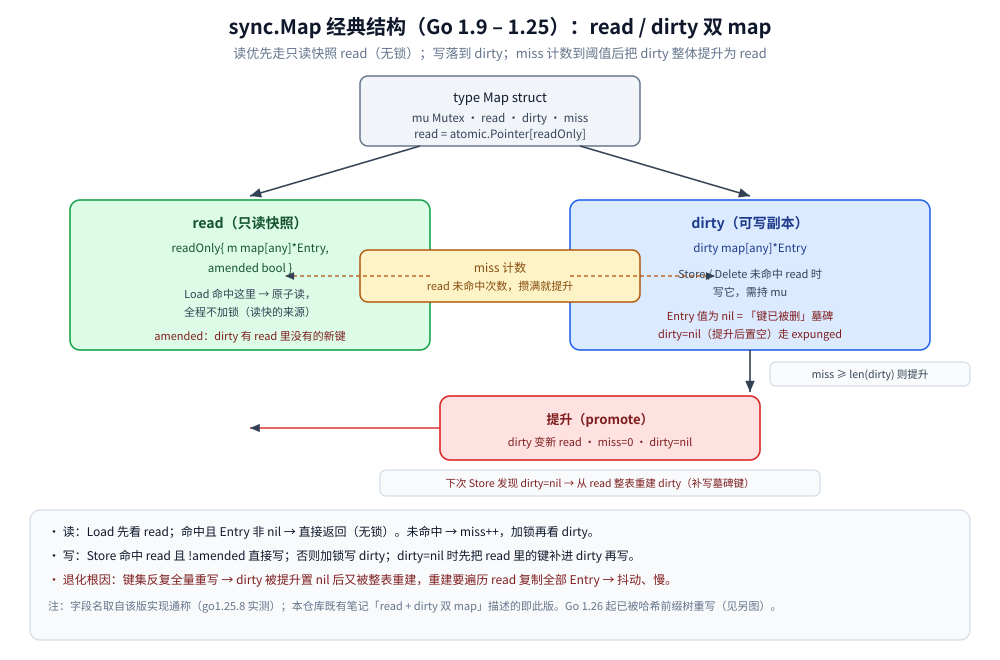
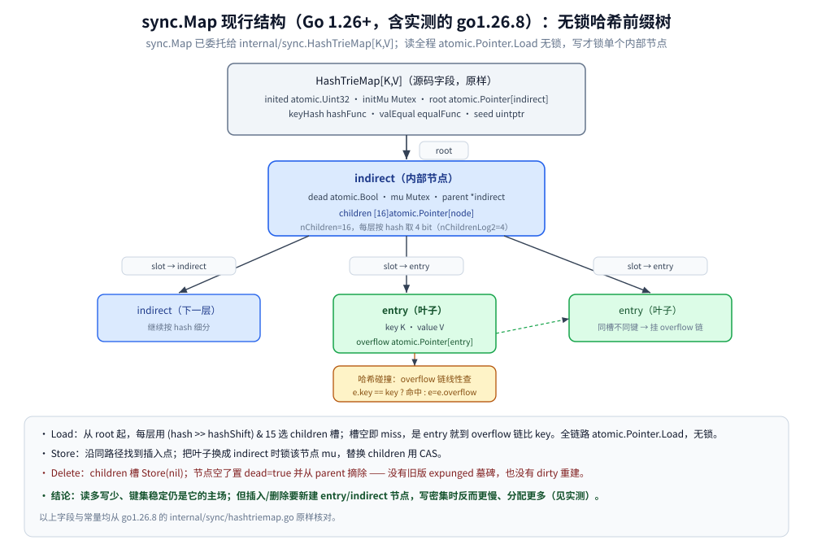
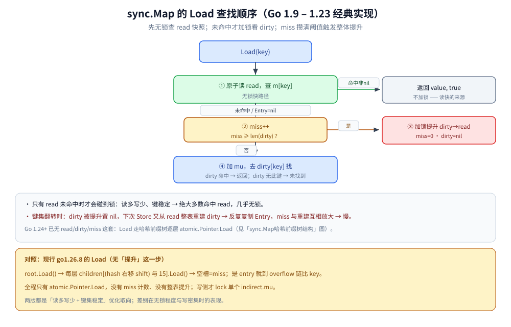

# sync.Map

> 本篇覆盖 sync.Map 的定位、两代内部结构（read/dirty 双 map 与哈希前缀树）、四个 API 的坑、三种场景实测与选型判据。
>
> 内容整理自个人学习笔记，素材见 [素材清单.md](../../../素材清单.md)。

---

## 一、sync.Map 是"更快的 map"吗？

**本节要点**：先破一个常见误解 —— **sync.Map 不是"性能更强的通用 map"，而是"读多写少 + 键集基本稳定"这一类场景的专用件**。把它当通用 map 无脑替换，多数时候是负优化。

### 1.1 官方文档自己怎么定位

go1.26.8 的 `go doc sync.Map` 原话（英文摘录）：

```text
Map is like a Go map[any]any but is safe for concurrent use by multiple
goroutines without additional locking or coordination.

The Map type is specialized. Most code should use a plain Go map instead,
with separate locking or coordination, for better type safety ...

The Map type is optimized for two common use cases: (1) when the entry for a
given key is only ever written once but read many times, as in caches that only
grow, or (2) when multiple goroutines read, write, and overwrite entries for
disjoint sets of keys.
```

逐句翻译成人话：

| 文档措辞 | 含义 |
|---|---|
| `specialized` / `Most code should use a plain Go map` | 它是**特化件**，大多数代码**该用普通 map + 锁** |
| 优化场景 (1)「写一次、读很多次，如只增缓存」 | **键集稳定 + 读远多于写** |
| 优化场景 (2)「多协程读写互不相交的键集」 | **不同协程碰不同 key**，几乎不冲突 |
| `significantly reduce lock contention` | 它省的是**锁争用**，不是省"读一个元素"的绝对时间 |

> ⭐ 一句话：**sync.Map 优化的前提是"命中只读快照"和"冲突极少"**。这两个前提一旦被破坏，它相对 `map + RWMutex` 不仅没优势，反而更慢、更费内存（见第四节实测）。

### 1.2 两条决定性能的前提

1. **读命中"只读快照"时无需加锁**：经典实现里读路径优先查只读的 `read`；现行哈希前缀树里每一跳都是 `atomic.Pointer.Load`。两种写法都靠**原子读**把"读"做得极便宜。
2. **键集基本不翻转**：经典实现靠 `miss` 计数触发"整表提升"；一旦键被反复增删，提升 / 重建互相放大，退化明显（第五节）。现行实现写路径要**新建叶子 / 内部节点**，写密集时分配更多。

---

## 二、内部结构长什么样？（两代分开看）

**本节要点**：**Go 1.26 把 sync.Map 整个重写了一次**。本仓库既有笔记 [并发同步原语.md](并发同步原语.md) 第一节讲的"read + dirty 双 map"，是 **Go 1.9 – 1.25** 的经典实现；而**本机实测用的 go1.26.8 已经是无锁哈希前缀树**。两代都要看懂 —— 经典版是绝大多数资料与"为什么读快 / 为什么会退化"的答案，现行版是你现在真正在跑的代码。

> ⚠️ **版本边界是容器里逐版本 grep 源码定的，不是抄博客的**（网上大量文章把这次重写记在 Go 1.24 名下，那是 `internal/sync.HashTrieMap` **进标准库**的版本，不是 `sync.Map` **换上它**的版本）：
>
> ```bash
> # 用 GOTOOLCHAIN 让同一台机器装多个工具链，逐版本看 sync/map.go 里到底是哪套字段
> docker run --rm -e GOPROXY=https://goproxy.cn,direct golang:1.26-alpine \
>   sh -c 'for v in go1.24.0 go1.25.8 go1.26.0; do R=$(GOTOOLCHAIN=$v go env GOROOT); \
>   echo "$v: read=$(grep -c "read atomic.Pointer" $R/src/sync/map.go) trie=$(grep -c "isync.HashTrieMap" $R/src/sync/map.go)"; done'
> ```
>
> ```text
> go1.24.0: read=1 trie=0
> go1.25.8: read=1 trie=0
> go1.26.0: read=0 trie=1
> ```
>
> `internal/sync/hashtriemap.go` 这个文件 **go1.24.0 就已经存在**（`ls $GOROOT/src/internal/sync/` 可见），
> 但直到 go1.26.0，`sync.Map` 才把实现整体委托给它。⚠️ 顺带一条工具链口径：
> **下载 toolchain 时不能设 `GOSUMDB=off`**（会报 `verifying module: checksum database disabled`），
> 只设 `GOPROXY=https://goproxy.cn,direct` 即可，校验和走代理自带的 sumdb。

### 2.1 经典版（Go 1.9 – 1.25）：read / dirty 双 map + miss + 墓碑

结构骨架（**下面几段原样复制自容器 `golang:1.26-alpine` 以 `GOTOOLCHAIN=go1.25.8` 取到的 `/usr/local/go/src/sync/map.go`**，注释一字未删——这是最后一个还用这套双 map 结构的版本）。
行文沿用资料里的常见简称 `miss` / `Entry`，**源码真名是 `misses` / `entry`**：

```go
type Map struct {
	_ noCopy

	mu Mutex

	// read contains the portion of the map's contents that are safe for
	// concurrent access (with or without mu held).
	//
	// The read field itself is always safe to load, but must only be stored with
	// mu held.
	//
	// Entries stored in read may be updated concurrently without mu, but updating
	// a previously-expunged entry requires that the entry be copied to the dirty
	// map and unexpunged with mu held.
	read atomic.Pointer[readOnly]

	// dirty contains the portion of the map's contents that require mu to be
	// held. To ensure that the dirty map can be promoted to the read map quickly,
	// it also includes all of the non-expunged entries in the read map.
	//
	// Expunged entries are not stored in the dirty map. An expunged entry in the
	// clean map must be unexpunged and added to the dirty map before a new value
	// can be stored to it.
	//
	// If the dirty map is nil, the next write to the map will initialize it by
	// making a shallow copy of the clean map, omitting stale entries.
	dirty map[any]*entry

	// misses counts the number of loads since the read map was last updated that
	// needed to lock mu to determine whether the key was present.
	//
	// Once enough misses have occurred to cover the cost of copying the dirty
	// map, the dirty map will be promoted to the read map (in the unamended
	// state) and the next store to the map will make a new dirty copy.
	misses int
}

type readOnly struct {
	m       map[any]*entry
	amended bool // true if the dirty map contains some key not in m.
}

// expunged is an arbitrary pointer that marks entries which have been deleted
// from the dirty map.
var expunged = new(any)

// An entry is a slot in the map corresponding to a particular key.
type entry struct {
	// p points to the interface{} value stored for the entry.
	//
	// If p == nil, the entry has been deleted, and either m.dirty == nil or
	// m.dirty[key] is e.
	//
	// If p == expunged, the entry has been deleted, m.dirty != nil, and the entry
	// is missing from m.dirty.
	//
	// Otherwise, the entry is valid and recorded in m.read.m[key] and, if m.dirty
	// != nil, in m.dirty[key].
	//
	// An entry can be deleted by atomic replacement with nil: when m.dirty is
	// next created, it will atomically replace nil with expunged and leave
	// m.dirty[key] unset.
	p atomic.Pointer[any]
}
```

三个要点从这份源码里直接读得出来：`read` 是**原子指针**（所以读侧不需要锁）、`dirty` 是**普通 map**（所以写侧要 `mu`）、
`misses` 只是**一个 int 计数**而不是数据结构；"墓碑"也不是特殊键，而是 `entry.p` 取 `nil` / `expunged` 两个哨兵值。



**图怎么读**：顶层是 `Map` 结构，`read` 用 `atomic.Pointer[readOnly]` 原子持有，左绿右蓝就是那两张 map。逐块看：

- 左边绿色 `read` 是**只读快照**，`Load` 命中它就走**无锁原子读**；`amended=true` 表示 dirty 里有 read 尚未收录的新键；
- 右边蓝色 `dirty` 是可写副本，`Store`/`Delete` 未命中 read 时**持 mu 写它**；`Entry` 值为 nil 充当"键已被删"的**墓碑**；
- 中间黄色 `miss` 累计 read 未命中次数，红框 `提升（promote）` 在 `miss ≥ len(dirty)` 时触发：**dirty 变新 read、miss 归零、dirty 置 nil**；随后第一次写发现 dirty=nil，又**从 read 整表重建 dirty** —— 这一步就是键集翻转时抖动的来源。

### 2.2 现行版（Go 1.26+，含本机 go1.26.8）：无锁哈希前缀树

go1.26.8 的 `sync.Map` 只剩一个字段，把活全交给 `internal/sync.HashTrieMap`。`sync/map.go` 里 `Map` 结构原样：

```go
type Map struct {
	_ noCopy

	m isync.HashTrieMap[any, any]
}
```

`HashTrieMap` 的结构（`internal/sync/hashtriemap.go`，**原样复制自 go1.26.8 源码**）：

```go
type HashTrieMap[K comparable, V any] struct {
	inited   atomic.Uint32
	initMu   Mutex
	root     atomic.Pointer[indirect[K, V]]
	keyHash  hashFunc
	valEqual equalFunc
	seed     uintptr
}

// 内部节点
type indirect[K comparable, V any] struct {
	node[K, V]
	dead     atomic.Bool
	mu       Mutex // Protects mutation to children and any children that are entry nodes.
	parent   *indirect[K, V]
	children [nChildren]atomic.Pointer[node[K, V]]
}

// 叶子
type entry[K comparable, V any] struct {
	node[K, V]
	overflow atomic.Pointer[entry[K, V]] // Overflow for hash collisions.
	key      K
	value    V
}

const (
	nChildrenLog2 = 4         // 每个内部节点 16 个孩子
	nChildren     = 1 << nChildrenLog2
	nChildrenMask = nChildren - 1
)
```



**图怎么读**：树根是 `root atomic.Pointer[indirect]`，`Load` 从它开始，**每层用 hash 的高位取 4 bit（`& 15`）选一个 children 槽**，`nChildren=16`。逐块看：

- 槽里要么是**下一层 indirect**（继续细分），要么是**entry 叶子**（`isEntry=true`）；
- 槽里要么是**下一层 indirect**（继续细分），要么是**entry 叶子**（`isEntry=true`）；
- 同一槽撞进多个键时，叶子之间用 `overflow atomic.Pointer[entry]` 串成链，`lookup` 沿链逐个比 `e.key`；
- 读路径全程只做 `atomic.Pointer.Load`，**没有锁**；只有把叶子换成 indirect、或改 children 槽时才短暂锁该节点的 `mu`；
- `Delete` 把槽 `Store(nil)`，节点空了置 `dead=true` 并从 parent 摘除 —— **没有旧版 expunged 墓碑，也没有 dirty 整表重建**。

### 2.3 两代对照：为什么 Go 要重写

| 维度 | 经典版 read/dirty（≤1.25） | 现行版哈希前缀树（1.26+） |
|---|---|---|
| 读 | 命中 read 无锁；未命中加锁看 dirty | 逐层 `atomic.Pointer.Load`，全程无锁 |
| 写 | 写 dirty；提升后 dirty=nil，再写要**整表重建** | CAS 换槽 / 锁单节点，**无整表重建** |
| 删除 | 写 `expunged` 墓碑，遍历回收 | 槽置 nil + `dead` 标记摘除 |
| 键集翻转 | **退化明显**（反复重建 dirty） | 仍要新建 entry/indirect，**写密集偏慢但无"整表"抖动** |
| Range | 需处理 read+dirty 两份 | 直接遍历树（见第 3.4 节：语义不变） |

> ⚠️ 结论：**"sync.Map 内部是 read/dirty 双 map"这句话，对 Go ≤1.25 成立、对 go1.26 已不成立**。选型判据（读多写少 + 键稳定）两代一致，但"退化"的具体机制不同。

### 2.4 Load 的查找顺序（经典版三跳）



**图怎么读**：这张图描述**经典版**（≤1.25）的读路径 —— 只有 read 未命中时才会碰到 `miss++` 和加锁，这正是"读多写少时几乎无锁"的由来。图下半部分对照写了 **go1.26.8 现行的 Load**：`root.Load()` 起、每层 `children[(hash>>shift)&15].Load()`、空槽即未命中、entry 走 overflow 链比 key，**没有 miss 计数也没有整表提升**。

---

## 三、四个常用 API 怎么用？各自的坑在哪？

**本节要点**：sync.Map 的方法都是 `any`↔`any`，**类型断言、覆盖写、墓碑删除、以及 Range 不保证一致性**这四件事是踩坑重灾区。下面逐个说。

### 3.1 Load / Store：值要断言，Store 是无条件覆盖

```go
var m sync.Map
m.Store("k", 100)                 // Store 就是给 key 赋值，覆盖旧值
v, ok := m.Load("k")              // v 是 any，ok 表示是否存在
n, isInt := v.(int)               // 取具体值必须类型断言
_ = isInt; _ = n
```

- `Load` 未命中返回 `(nil, false)`，**不是 panic**；
- `Store` **无条件覆盖**，不返回旧值 —— 想要"替换并拿旧值"用 `Swap`。

### 3.2 LoadOrStore：返回值永远非 nil，但要判 loaded

文档语义：present 返回既有值（`loaded=true`），否则存入并返回给定值（`loaded=false`）。

```go
actual, loaded := m.LoadOrStore("k", newItem())
// ⚠️ 坑：actual 要么是"库里原有的"要么是"你刚塞的"，永远不是 nil
if loaded {
    // 库里已有 → 你 new 出来的那个是垃圾，得丢弃（它没被存进去）
    release(newItem) // 若 newItem 来自池/连接，别忘回收
}
use(actual)          // 用 actual，别用你自己那个变量
```

> ⭐ 典型错误：以为 `LoadOrStore` 返回"是否新建成功"就丢掉了 `actual`，然后继续用自己 new 的对象 —— 于是库里存的和自己在用的是**两个对象**。要统一用返回的 `actual`。

### 3.3 Delete / LoadAndDelete：删除的两种姿势

```go
m.Delete("k")                       // 只删，不要旧值；键不存在则什么都不做
old, ok := m.LoadAndDelete("k")     // 删并把旧值取出来（old 是 any）
```

- 经典版：`Delete` 对已收录进 read 的键，先在 read 里写 `expunged` 墓碑，真正的清理等提升 / 重建时做；
- 现行版：`Delete` 直接把对应 children 槽 `Store(nil)`，空节点标 `dead`（源码原样，见 2.2）。

### 3.4 Range：不保证一致性，也不保证顺序

go1.26.8 `go doc sync.Map.Range` 原文（英文摘录）：

```text
Range does not necessarily correspond to any consistent snapshot of the
Map's contents: no key will be visited more than once, but if the value
for any key is stored or deleted concurrently (including by f), Range may
reflect any mapping for that key from any point during the Range call.
Range does not block other methods on the receiver; even f itself may call
any method on m.
```

拆成三条硬结论：

| 事项 | sync.Map.Range 的行为 |
|---|---|
| 并发写会不会被看到 | **可能看到、可能看不到** —— 它不是任何时刻的一致性快照 |
| 遍历顺序 | **无任何顺序保证**，别假设按插入或按 key 排 |
| 一个键会不会重复 | 不会重复访问，但同一次 Range 中它的值可能是"过程中任一时刻"的值 |
| f 里能不能改 m | 能（`f` 可调任意方法），但改完的结果对当前 Range 也不保证可见 |

```go
m.Range(func(k, v any) bool {
    // 不要在这里假设"读到的一定是最新值"，也不要假设遍历顺序
    fmt.Println(k, v)
    return true // 返回 false 立即停止；但即便提前停，Range 仍可能已付出 O(N) 代价
})
```

> ⚠️ 需要"一致快照"（比如统计全表、做一遍原子的迁移）时，**sync.Map 给不了** —— 要么先 `map + Mutex` 拷一份快照，要么用分段锁 / 单线程收口。

---

## 四、三种场景实测：sync.Map 到底什么时候更快？

**本节要点**：不能只说"读快写慢"。要用同一台机器、同一份代码，把 **纯读 / 覆盖写读 / 全新增删除** 三种场景下 sync.Map、`map+RWMutex`、`map+Mutex` 摆在一起比，并且明确指出**哪种场景 sync.Map 反而更慢**。

### 4.1 实测环境

- 容器镜像 `golang:1.26-alpine`，**容器内 go1.26.8**（宿主机是 1.26.5，两者同大版本不同补丁，本篇读数一律以容器 go1.26.8 为准）；
- 容器可见 **4 逻辑核**（`BenchmarkXxx-4`，`GOMAXPROCS=4`，i7-6700HQ），比常见 8 核机器并发度低，绝对值偏乐观，重点看**相对趋势**；
- 命令：`go test -bench=. -benchmem -count=3`；`-count=3` 连跑 3 次，下表给 **3 次的区间**；
- 键空间 4096，值 int；三种实现用同一套键。

### 4.2 读数（ns/op 取 3 次区间，B/op、allocs 取稳定值）

| 场景 | 实现 | ns/op（3 次区间） | B/op | allocs/op |
|---|---|---|---|---|
| **纯读**（键已填充，只 Load） | sync.Map | ~109 – 206 | 0 | 0 |
| | map + RWMutex | ~119 – 217 | 0 | 0 |
| | map + Mutex | ~125 – 151 | 0 | 0 |
| **覆盖写读**（1 写覆盖已有键 : 9 读） | sync.Map | ~81 – 207 | 6 | 0 |
| | map + RWMutex | ~185 – 217 | 0 | 0 |
| | map + Mutex | ~123 – 176 | 0 | 0 |
| **全新增 + 删除交替**（键集持续翻转，规模恒定） | sync.Map | ~1092 – 1694 | **126** | **4** |
| | map + RWMutex | ~846 – 1066 | 15 | 1 |
| | map + Mutex | ~443 – 771 | 15 | 1 |

（表里 `15 B / 1 alloc` 是三种实现共有的 `strconv.Itoa` 字符串分配基线；sync.Map 在此之上多出约 `111 B / 3 allocs`，来自插入时新建的 `entry` / 可能的 `indirect` 节点。）

### 4.3 逐场景解读

- **纯读**：三者区间高度重叠（都 ~110–215），**看不出 sync.Map 明显更快** —— 4 核下 `RWMutex` 的读锁争用还没压垮它。sync.Map 的读优势要在**更高并发 / 更多核**才拉得开。
- **覆盖写读（键稳定）**：sync.Map 与 map+锁大体同量级；sync.Map 出现 `6 B/op` 是它给已有键写值时新建 entry 的摊销，`allocs/op` 仍报 0（<1 次/op 的摊销被取整）。**这一档它没拖后腿，但也没赢多少**。
- **全新增 + 删除交替**：**这是 sync.Map 明确更慢的场景** —— ns/op 区间整体高于两个加锁版本，且 **分配是它的 8 倍（126 B vs 15 B）、allocs 是 4 倍**。原因：每插入一个"此前不存在"的键，树要新建 `entry`（必要时拆分 `indirect`）；删除又要 CAS 摘槽。写密集 + 键翻转把 sync.Map 的两个优化前提（写一次 / 键稳定）全破坏了。

> ⭐ **一句话选型**：读多、键稳定 → sync.Map 与 map+RWMutex 都行、sync.Map 省的是锁争用；**写多 / 键集频繁增删 → sync.Map 反而更慢更费内存，别用**。

---

## 五、键集翻转时它为什么会退化？

**本节要点**：把 4.3 第三条的"为什么"讲透。两代实现退化的机制不同，但结论一致：**反复全量重写 / 频繁增删键，是 sync.Map 的阿喀琉斯之踵**。

- **经典版（≤1.25）的退化链**：`Store` 一个 read 里没有的新键 → 需要 dirty；若 dirty 刚被提升置了 nil，就得**遍历整张 read、把每个键重新 `new(Entry)` 复制进 dirty**（重建）→ 再叠上 `miss` 计数很快再次触顶提升。键集翻转时"重建 ↔ 提升"来回做，**每次全表复制** → 延迟抖动、CPU 与内存双高。
- **现行版（哈希前缀树）的退化**：没有"整表重建"这一步了，但**每个新键都要在树上分配 entry 节点、必要时把叶子升级成一层 indirect 并重挂 16 个槽**；删除则 CAS 摘槽、空节点标 dead。**写路径的分配是实打实的** —— 实测 `126 B/op / 4 allocs/op`（vs map+Mutex 的 `15 B / 1 alloc`）就是这么来的。

> ⚠️ 一个反直觉点：**"键集翻转"不需要你显式清空整表**。会话表按 sessionID 不断新建、过期就删，天然就是"键一直翻"—— 这类"看起来是缓存、其实是高 turnover"的场景，**恰恰是 sync.Map 最不擅长的**。

---

## 六、选型判据：sync.Map、map+锁、分段锁怎么挑？

**本节要点**：给一张能直接照做的判据表，并记下那条最常见的反面教训。

### 6.1 判据表

| 场景特征 | 推荐 | 理由 |
|---|---|---|
| 读:写 极端悬殊、键**写一次读多次**（只增缓存、路由表） | **sync.Map** | 读无锁、省锁争用 |
| 多协程碰**互不相交**的键集 | **sync.Map** | 几乎不冲突 |
| 读多写少，但读写会碰同一批键、逻辑复杂 | **map + RWMutex** | 语义直观，可维护复合不变量 |
| 写多 / 读写都多 / **键频繁增删（翻转）** | **map + Mutex** | sync.Map 此时更慢更费内存（见第四节） |
| 高并发读写、键分散、要压锁争用 | **分段锁 map** | 见 [并发同步原语.md](并发同步原语.md) 第七节 |
| 要"一致性快照 / 原子统计全表" | **普通 map + 一把锁** | Range 给不了快照 |

### 6.2 反面教训：无脑把全局 map 换成 sync.Map 为什么是负优化

把"所有共享 map 都改 sync.Map"当银弹，会同时踩四个坑：

1. **丢类型安全**：值全是 `any`，读写都要断言，编译期查不出错 —— 官方文档明说 `plain Go map ... for better type safety`；
2. **写场景更慢**：只要不是"写一次读多次"，第四节的 `126 B / 4 allocs` 就会教你做人；
3. **维护不了伴随状态**：sync.Map 只管一个 key→value，你要在写 map 的同时更新计数 / 校验复合不变量，它帮不上，还不如一把锁包住；
4. **内存占用更高**：双 map（经典版）或树节点（现行版）都比一张扁平 map 费内存。

> ⭐ 正确姿势：**默认还是"普通 map + Mutex/RWMutex"，只有在确认命中 sync.Map 两个优化前提时才换**。判据来自实测，不是来自"它名字里带 concurrent 就一定快"。

---

## 使用：只增不改的配置缓存 / 会话表的最小写法

**本节要点**：给一段**贴合 sync.Map 主场**（写一次读多次、键只增）的最小可用实现，并标出与"错误用法"的分界。

```go
// 场景：进程内一份"按 host 缓存解析结果"的配置，写一次读很多次。
type Resolver struct {
	m sync.Map // key: string(host) → value: *HostInfo（只增、不改）
}

// 首次解析并存入；已有则直接复用库里的对象（用返回的 actual，不要用自己 new 的）。
func (r *Resolver) Get(host string) *HostInfo {
	if v, ok := r.m.Load(host); ok {
		return v.(*HostInfo)
	}
	newVal := parse(host) // 昂贵：只有第一次真正执行
	actual, _ := r.m.LoadOrStore(host, newVal)
	return actual.(*HostInfo)
}

// 只读遍历（注意：并发写的新键可能看到也可能看不到，且不保证顺序）。
func (r *Resolver) Snapshot() map[string]*HostInfo {
	out := make(map[string]*HostInfo)
	r.m.Range(func(k, v any) bool {
		out[k.(string)] = v.(*HostInfo)
		return true
	})
	return out
}
```

要点对照：

- **读走 `Load`、写只在缺失时 `LoadOrStore`** —— 命中"写一次读多次"前提，这是 sync.Map 的甜点；
- **`LoadOrStore` 之后统一用返回的 `actual`**（3.2 的坑）；
- **`Snapshot` 显式拷进一张普通 map**，避免调用方依赖 Range 的一致性（3.4 给不了）；
- 如果 `HostInfo` 会被**反复覆盖 / 频繁过期删除**（键集翻转），这个结构就该退回 `map + RWMutex`（第五、六节）。

---

## 延伸追问

- **sync.Map 是"更快的 map"吗？** → 不是。它是"读多写少 + 键集稳定"的专用件；官方文档明说大多数代码应先用普通 map + 锁。写多或键频繁增删时它反而更慢、更费内存（实测 `126 B / 4 allocs` vs 加锁版 `15 B / 1 alloc`）。
- **sync.Map 内部还是 read/dirty 双 map 吗？** → **不是了**。Go 1.26 起 `sync.Map` 整体委托给 `internal/sync.HashTrieMap`（无锁哈希前缀树），go1.26.8 的 `Map` 只剩 `m isync.HashTrieMap[any,any]` 一个字段。"read/dirty 双 map"适用于 Go ≤1.25。⚠️ 网上常见"Go 1.24 重写"的说法记的是 `internal/sync.HashTrieMap` **进标准库**的版本，不是 `sync.Map` **换上它**的版本（见第二节开头的逐版本 grep 判据）。
- **两种实现的读都快，差别在哪？** → 经典版命中只读 `read` 时 `atomic.Value` 无锁读；现行版逐层 `atomic.Pointer.Load` 无锁读。区别在**写侧**：经典版有"整表提升 + dirty 重建"的抖动，现行版是"新建 entry/indirect 节点"的分配开销。
- **`LoadOrStore` 返回的 actual 和 value 一定相同吗？** → 不一定。键已存在时返回库里既有值（`loaded=true`），你传进去的那个没被存；**要用返回的 actual**。
- **`Delete` 是真删还是写墓碑？** → 取决于版本：经典版对已入 read 的键先写 `expunged` 墓碑、清理留到重建时；现行版直接 `children` 槽 `Store(nil)` 并把空节点标 `dead`。
- **`Range` 是并发安全的快照吗？** → 不是。官方原文：它"不对应任何一致性快照"，并发 Store/Delete 的键可能看到也可能看不到，且不保证顺序；需要一致快照请自己拷进普通 map。
- **什么时候 sync.Map 明显吃亏？** → 键集持续翻转（不断新增又删除，如会话表 / 高 turnover 缓存）。实测该场景 sync.Map 的 ns/op、B/op、allocs 全面劣于 map+Mutex。
- **能不能用它做"原子更新某字段"？** → 单键的 CAS 有 `CompareAndSwap`/`CompareAndDelete`，但**跨键的原子性**（如两个键此消彼长）它保证不了，那要一把锁。
- **sync.Map 可以拷贝吗？** → 不可以，`Map` 内含 `noCopy`，首次使用后拷贝会被 `go vet` 拦下；一律用指针传。

---

## 关联

- [并发同步原语.md](并发同步原语.md) — 悲观/乐观锁取舍、分段锁 map，与本篇一、六节互补
- [线程安全.md](线程安全.md) — map 并发读写为何直接 panic，及"三类线程安全类型"
- [map.md](../类型与语法/map.md) — 原生 map 的结构与"为什么不能并发写"
- [sync.Pool.md](sync.Pool.md) — 同目录另一个"为特定并发模式而生"的组件：按 P 分片对象池
- [限流器.md](限流器.md) — 令牌桶里的计数 / 时间戳同样要选对同步原语
- [GMP调度.md](../运行时/GMP调度.md) — 加锁阻塞与自旋在调度器上的代价
> 反向引用（本篇被下列文档引到）：[atomic操作.md](atomic操作.md)、[并发容器.md](../../java/并发/并发容器.md)
