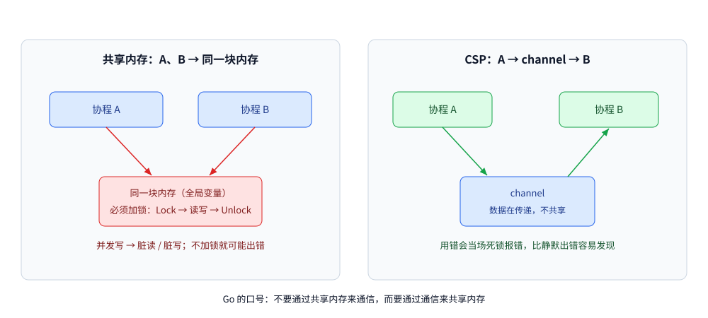
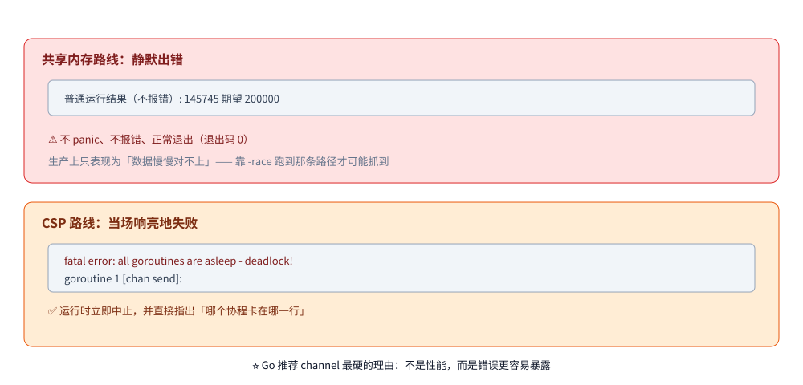

# 共享内存与 CSP

> Go 那句「不要通过共享内存来通信，而要通过通信来共享内存」到底在说什么，以及两条路线各自的适用边界。
>
> 内容整理自大厂 Go 后端面试真题，并按《Go 语言核心编程》（李文塔）5.4.1 CSP 简介 的相关章节**补充了机制分析与实测**；参考资料与原始素材见 [素材清单](../../../素材清单.md)。

---

## 一、共享内存 vs CSP：Go 为什么更推荐用 channel

**本节要点**：[channel使用陷阱.md](channel使用陷阱.md) / [channel实战模式.md](channel实战模式.md) 说了"channel 只用于协程间通信"，本题补上**反面对照**——
不加保护的共享内存到底会出什么事，channel 又是从哪个模型来的。

### 1.1 共享内存 = 全局变量；Go 里两种容器的并发行为完全不同

多个协程并发读写同一个全局变量（数组、`map`、结构体都算）→ 可能出现**脏读 / 脏写**；
经典解法是加锁：**加锁 → 读写 → 解锁**，锁区间内的代码只会被串行执行，不会并发。

| 类型 | 多协程并发读写的结果 |
|---|---|
| **数组 / slice** | **不报错**，但结果**不可预期**（每次跑都可能不一样） |
| **原生 `map`** | **直接 `fatal error`，进程崩溃**（运行时会检测到并发写） |
| **`sync.Map`** | 原生支持并发读写，并发场景可以直接用它 |

```go
var m = map[int]int{}
for i := 0; i < 4; i++ {
	go func(k int) { m[k] = k * k }(i) // ❌ 并发写原生 map
}
// fatal error: concurrent map writes —— 运行时直接中止，recover 也救不回来
```

**结论**：Go 对 `map` 的并发写是**零容忍**的——不是数据错乱，而是**直接崩进程**。
"多个协程随便读写全局 `map`"是最典型的错误写法。

### 1.2 CSP：换一种共享数据的方式

CSP（Communicating Sequential Processes，通信顺序进程）说白了就一句话：

> **多个协程之间总得共享数据——除了"共同读写一个全局变量"，还可以"通过管道把数据传过去"。**

即：**共享内存**是 `A、B → 同一块内存（必须加锁）`；**CSP** 是 `A → channel → B`（数据在传递，不共享）。

**所以 Go 的口号是"不要通过共享内存来通信，而要通过通信来共享内存"**——
channel 就是这句话的载体，[channel实战模式.md](channel实战模式.md) 的"生产者-消费者 / 协程池"就是它的落地形态。



## 延伸追问

- **并发写原生 `map` 会怎样？** → `fatal error: concurrent map writes`，
  进程直接崩溃；**它不是数据错乱，而是运行时主动中止，无法 recover**。
- **slice / 数组并发读写安全吗？** → **不崩，但结果不可预期**，
  比崩更隐蔽——必须自己加锁，或用 channel 把读写收口到单一协程。
- **channel 能代替锁吗？** → 不能一概而论：**协程间传数据 / 传信号**用 channel；
  单纯**保护一块共享数据**用 `sync.Mutex` / `atomic`（对应 [channel使用陷阱.md](channel使用陷阱.md)"先定住用途"）。

---

## 二、CSP 从哪来？Go 对它的取舍，以及两种路线的失败模式

**来源**：本节为补充内容 —— 按《Go 语言核心编程》（李文塔）5.4.1 CSP 简介、5.4.2/5.4.3 调度模型 整理，配套本机实测。

**本节要点**：第一节讲「CSP 是什么」，这一节讲 **「它从哪来、Go 为什么选它，以及选型的真正依据」**。能把结论落到「**两种路线的失败模式不同**」上，这题就从背书变成了判断力。

### 2.1 CSP 不是 Go 发明的：Hoare 1978

| 要点 | 内容 |
|---|---|
| 出处 | **Tony Hoare 1978 年的论文《Communicating Sequential Processes》** |
| 作者是谁 | 就是**快速排序的发明者**、后来的图灵奖得主 —— 他提出把「进程」和「通信」作为语言的一等概念 |
| 核心观点 | 顺序进程之间**不通过共享变量交互，只通过消息传递**同步与交换数据 |
| Go 的位置 | Go **不是它的第一个实现**（Occam、Erlang、Limbo 都更早），但 Go 让 CSP 进入了主流工程语言 |

> ⭐ 能顺口说出「CSP 是 Hoare 1978 年的论文提出的，比 Go 早 30 多年」，
> 效果远好于只重复那句口号 —— 说明你知道这是**一种并发模型**，而不是 Go 的语法糖。

### 2.2 Go 的取舍：并发是「一等公民」，但并没有排斥锁

Go 把并发做进了语言层（`go` 关键字、`chan` 内置类型、`select` 语句），这是它和 Java / C++ 最直观的差别。但要注意 Go 的取舍是 **「提供两条路」**：

| 层面 | 共享内存路线 | CSP 路线 |
|---|---|---|
| 语言语法 | 无关键字，靠库 | `go` / `chan` / `select` **是语言的一部分** |
| 标准库 | `sync.Mutex`、`sync.Map`、`sync/atomic` | channel 本身 |
| 官方立场 | 标准库 `sync` 包一直在演进（`sync.OnceValue`、`sync.WaitGroup.Go` 等新 API 不断加入） | ⭐ **两者都正式推荐** —— `go` / `chan` / `select` 是语言原语 |

> ⭐ 顺着这条线可以自然接上另一个高频题：**Go 的调度模型（G/M/P）正是为 CSP 服务的** ——
> 每个 goroutine 相当于一个"顺序进程"，调度器负责在它们之间切换、并在 channel 收发时挂起与唤醒（见 [GMP调度.md](../运行时/GMP调度.md)）。
> 书 5.4.2 / 5.4.3 讲的「调度模型」放在并发这一章，就是这个原因。

### 2.3 ⭐ 选型的真正依据：两种路线的**失败模式**不同

这是第一节表格之外、更值得记住的一层。实测同一件事的两条路出错时的样子：

```go
// 共享内存路线：两个协程各 +100000，无保护
var shared int
for i := 0; i < 2; i++ {
    go func() { for j := 0; j < 100000; j++ { shared++ } }()
}
fmt.Println("普通运行结果（不报错）:", shared, "期望 200000")
```

```text
普通运行结果（不报错）: 145745 期望 200000
fatal error: all goroutines are asleep - deadlock!

goroutine 1 [chan send]:
```

| 路线 | 出错时的表现 | 被发现的方式 |
|---|---|---|
| **共享内存** | 结果**静默出错**（`145745` 而不是 `200000`）—— **不 panic、不报错、正常退出** | 靠 `-race` 在测试里跑到那条路径才报；**生产上只会表现为"数据慢慢对不上"** |
| **CSP** | **死锁**：`fatal error: all goroutines are asleep - deadlock!`，还会打印**哪个协程卡在哪**（`goroutine 1 [chan send]`） | 运行时**立即**中止并指出位置 |



> ⭐ **这才是「Go 推荐用 channel」最硬的理由 —— 不是性能，而是错误更容易暴露。**
> channel 每次收发都有调度与内存屏障开销，纯性能上不如 atomic；但共享内存的错**是静默的**（上面那行输出连退出码都是 0），
> 而 CSP 用错时会**当场响亮地失败**。工程上"错了能立刻发现"往往比"快一点"更重要。
>
> ⚠️ **本项 `-race` 未做实测**：本机未装 gcc，`go run -race` 直接报 `-race requires cgo`。
> 上表关于 race 的描述来自文档与工具行为，**不是本机跑出来的**。（第一行「静默出错」与死锁那两行是本机实测。）

> 📖 顺带一条实践建议：无论选哪条路线，**测试都加 `-race` 跑**，跨协程的代码尤其要。
> 但要清楚它的局限 —— 它只在**实际执行到的路径**上检测，没跑到的竞争它一样看不见。

---

## 三、实测：三种同步写法正确性等价，代价差一个数量级

**本节要点**：这一节给第二节的"选型依据"补上数。**正确性上三条路是等价的** ——
真正的差别在代价，而且**channel 并不是免费的**。

### 3.1 场景与四种写法

同一个需求：**8 个 goroutine 各把计数器加 50000 次，期望值 400000**。

| 写法 | 路线 |
|---|---|
| ① 共享变量、**无同步** | 共享内存（错的那一种） |
| ② 共享变量 + `Mutex` | 共享内存 + 锁 |
| ③ 共享变量 + `atomic` | 共享内存 + 原子操作 |
| ④ 把"加 1"这件事**交给一个 goroutine** | **CSP**（channel 交接） |

### 3.2 正确性实测

```text
=========== 三种同步写法的结果 ===========
  ② 共享内存 + Mutex   → 400000，等于期望？ true
  ③ 共享内存 + atomic  → 400000，等于期望？ true
  ④ CSP（channel 交接）→ 400000，等于期望？ true
  → 三种写法在正确性上等价 —— 差别在代价，见 timing/
```

⭐ 结论一：**只要建立了正确的同步，"用共享内存还是用 channel"在正确性上没区别** ——
选型的依据只能是**代价与可读性**，不是"哪个更安全"。

### 3.3 关于"无同步"那一版

```text
无同步共享变量，期望 400000；连跑 10 轮：
  第  1 轮：  226185  缺失   173815（43.45%）
  第  2 轮：  400000  缺失        0（0.00%）
  第  3 轮：  400000  缺失        0（0.00%）
  第  4 轮：  219455  缺失   180545（45.14%）
  第  5 轮：  263817  缺失   136183（34.05%）
  第  6 轮：  292878  缺失   107122（26.78%）
  第  7 轮：  298266  缺失   101734（25.43%）
  第  8 轮：  261368  缺失   138632（34.66%）
  第  9 轮：  240339  缺失   159661（39.92%）
  第 10 轮：  400000  缺失        0（0.00%）
→ 10 轮里恰好等于期望的有 3 轮
```

⭐⭐ 这 10 轮里**有 3 轮完全正确** —— 它证明的不是"会丢多少"，而是
**结果不可预测**：既可能丢掉 45%，也可能恰好一次不丢。

⚠️ 因此：**"我跑了一遍是对的"不能作为"这段代码是对的"的证据**。
这也解释了为什么「无同步」的错误最难查 —— 它在测试环境可能一直"对"。
（机制解释见 [Go内存模型.md](Go内存模型.md)）

### 3.4 代价：含计时，只主张量级

同一份负载，每种写法跑 5 轮取最快一轮：

```text
  atomic                 最快一轮 4ms
  Mutex                  最快一轮 31ms
  channel（CSP 交接）        最快一轮 73ms
```

⚠️ **这两组数字含计时，随机器负载波动，不要当性能指标用**。
稳定的是**量级关系**：**为了"改一个整数"而走 channel，代价是数量级的**
（这里 channel 约为 atomic 的十几倍）。

⭐ 结论二（这才是选型的真正依据）：

| 场景 | 该用 |
|---|---|
| 状态就是一个整数 / 一个指针，操作是单次读写 | **`atomic`**（最轻） |
| 状态是一组字段、要"一起改" | **`Mutex`** |
| 状态需要**跨 goroutine 交接所有权**（谁生产、谁消费） | **channel** |
| 需要在多个 worker 之间**分发任务 / 收集结果** | **channel**（这是它的主场） |

### 3.5 ⭐ 什么时候**不该**用 channel

这是本节最实用的一条。以下三种情况用 channel 是**过度设计**：

1. **只是要保护一个计数器 / 一个标志位** → `atomic`（实测：4ms vs 73ms，差一个数量级）；
2. **只是要保护一组字段的一致性** → `Mutex`（实测：31ms vs 73ms）；
3. **状态只有一个 goroutine 会碰** → **什么都不用**（不需要任何同步）。

⚠️ 反过来也成立：**下面这些才是 channel 真正的主场**，用锁反而绕：
扇出分发任务、扇入收集结果、流水线（pipeline）分阶段、把"所有权"从 A 交给 B、
用 select 做多路复用与超时。

### 延伸追问

- **用 channel 是不是比用锁"更安全"？** → **不是**。实测三种同步写法在正确性上完全等价（3.2）。
  差别在**代价与表达力**，所以"为了安全而用 channel"是个错误的理由。
- **那为什么 Go 说"不要通过共享内存来通信"？** → 它讲的是**表达力**：
  交接所有权、分发任务、流水线这些场景用 channel 写起来直白得多。
  但这条口号**不是**"禁止用锁"（见 2.2）。
- **无同步到底会不会出错？** → **不可预测**。实测 10 轮里 3 轮完全正确、7 轮最多丢 45%（3.3）。
  所以"跑一遍是对的"不能当证据。
- **我只是改一个计数，用 channel 行不行？** → 能跑，但**代价是数量级的**
  （实测 atomic 4ms vs channel 73ms，3.4）。这种场合用 `atomic`。
- **什么时候连锁都不需要？** → **状态只有一个 goroutine 会碰时**（3.5 第 3 条）——
  这时候加任何同步都是纯粹的多余开销。

---

## 使用：同一需求的两种写法，怎么选

两种风格解决的是同一件事（多协程安全地共享一个状态），差别在**同步发生在哪一层**：

| 维度 | 共享内存（Mutex / atomic / sync.Map） | CSP（channel） |
|---|---|---|
| 状态在哪 | 就在结构体里，**直接读** | 被某个协程独占，别人只能通过管道问它 |
| 同步点 | 每次读写都要过锁/原子操作 | 只在收发消息时同步 |
| 谁保证正确 | 调用方自己（忘加锁就出错，且**可能不带检测**） | 语言机制保证，越界使用会直接死锁报错 |
| 适合的场景 | 读多写少、临界区极小（计数器、开关、缓存命中统计） | 有明确的数据流与所有权移交（任务队列、流水线、扇入扇出） |
| 不适合的场景 | 复杂状态机（锁的粒度会失控） | 高频小消息（每次收发都是一次调度 + 内存屏障） |
| 出错时的表现 | 数据竞争（`-race` 才能抓到） | 死锁 / 协程泄漏 |

**选型口诀**：

- 「一块状态、多个读，偶尔写」→ **共享内存 + `RWMutex` 或 `atomic`**；
- 「一条数据从 A 流到 B，所有权随之转移」→ **channel**；
- 「不确定」→ 先用锁把正确性做出来，再用 `-race` 与压测判断是否值得改成管道；**不要为了「Go 味」硬把简单状态改成 channel**。

> ⭐ Go 那句名言后半句常被忽略：**「不要通过共享内存来通信」针对的是「用锁保护复杂数据流」这种写法**，而不是禁止使用锁。`sync.Mutex`、`atomic` 本身就在标准库里，官方从没说要取代它们。

## 关联

- [channel原理与底层实现.md](channel原理与底层实现.md) — CSP 路线在本项目里的实现载体
- [channel使用陷阱.md](channel使用陷阱.md) — 使用 channel 的代价与常见反模式
- [并发同步原语.md](并发同步原语.md) — 共享内存路线的原语（Mutex / atomic / sync.Map）
- [进程与线程.md](../../../02-计算机基础/linux/进程与线程.md) — 协程轻量化的量化对照
- [goroutine.md](goroutine.md) — 被调度的实体本身：栈、创建成本与生命周期
> 反向引用（本篇被下列文档引到）：[Go内存模型.md](Go内存模型.md)、[JMM与内存屏障.md](../../java/并发/JMM与内存屏障.md)
