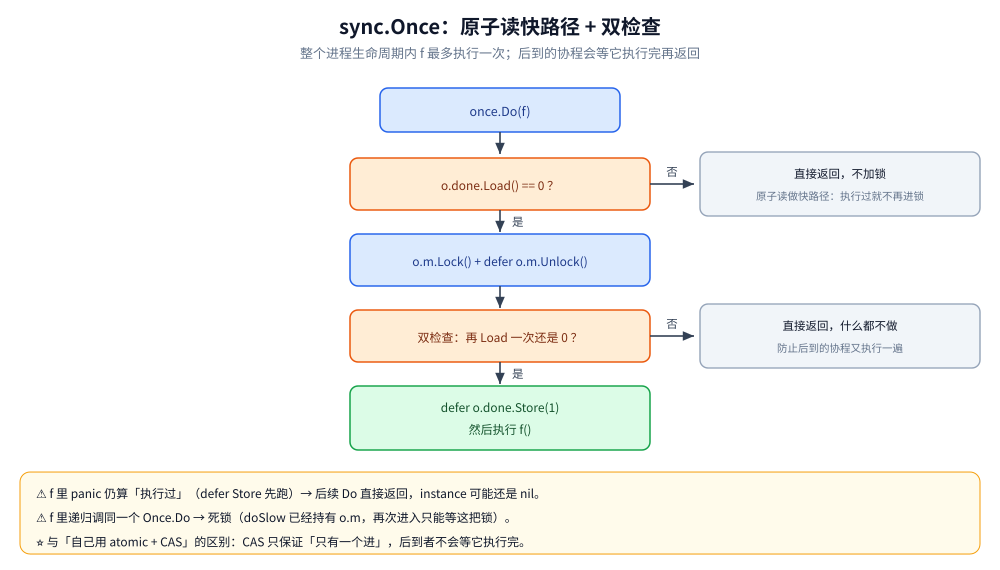
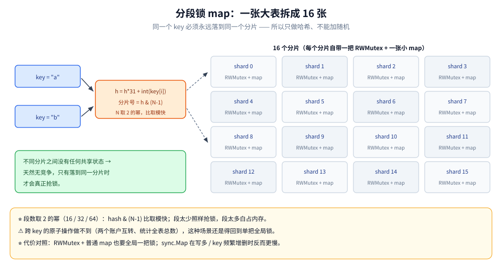

# Go 并发同步原语

> Mutex / RWMutex / Once / WaitGroup 的语义与致命误用、协程间通信五法、分段锁 map、
> 锁与原子操作的取舍判据（`sync.Map` 与 `sync/atomic` 的机制与实测已各成一篇，见 [sync.Map.md](sync.Map.md) 与 [atomic操作.md](atomic操作.md)）
>
> 内容整理自大厂 Go 后端面试真题，并按《Go 语言核心编程》（李文塔）5.1.4 WaitGroup、5.1.5 select 的相关章节**补充了机制分析与实测**；参考资料与原始素材见 [素材清单](../../../素材清单.md)。

---

## 一、map 手动加锁和 sync.Map 有什么区别？

**本节要点**：这一节**只留判据**——sync.Map 的内部结构（两代实现）、四个 API 的坑、三种场景实测与选型表已独立成篇。

> **一句话**：手动加锁是**悲观锁**（先设防再操作），`sync.Map` 是**乐观锁的用法**（先假设不冲突、冲突了 CAS 重试）。
> ⚠️ 严格说 `sync.Map` 底层**同时包含互斥锁和原子变量**，"纯乐观锁"只是使用方式上的比喻，不是实现描述。

| 场景 | 选择 | 原因 |
|---|---|---|
| 绝大多数情况不冲突：读多写少、key 稳定、各协程碰**不同** key | **`sync.Map`** | 多数读走只读侧的原子读，**不加锁**，没有加锁开销 |
| 绝大多数情况会冲突：多协程碰**同一** key、写多、key 频繁增删 | **`Mutex` + 原生 `map`** | 乐观锁的自旋会**反复空转烧 CPU**，不如直接上锁 |
| 要**一致快照**（统计全表、把整份数据原子迁移） | **`Mutex`** 或分段锁 | `sync.Map` **给不了整表快照**；自己造并发 map 的路线见本篇第七节 |

细节全部在 [sync.Map.md](sync.Map.md)，本篇不重讲：

- **内部结构两代分开看**——read / dirty 双 map 的换代流程，以及新版换成哈希前缀树后的形态；
- **键集翻转时为什么会退化**（写多 / key 频繁增删那一档的实测）；
- **四个常用 API 各自的坑**（`Load`/`Store`/`Delete`/`LoadAndDelete` 与 `Range` 的一致性语义）；
- **只增不改的配置缓存 / 会话表的最小写法**（`## 使用` 节）。

---

## 二、Mutex 是乐观锁还是悲观锁？

**本节要点**：一箭双雕——既考锁的定位，又考**乐观锁/悲观锁的取舍判断**。

### 一句话答案

> **`sync.Mutex` 是悲观锁。**

### 用"性本善 / 性本恶"理解两者（照应第六节的讲法）

| | **悲观锁** | **乐观锁** |
|---|---|---|
| **人性假设** | **性本恶** | **性本善** |
| **信念** | 认为**任何情况下数据都可能被其他线程修改** | 认为**数据不太可能被其他协程修改** |
| **行为** | 对身边的"任何人"都**设防** → **一开始就加锁** | 对陌生人**不设防** → **先操作，出问题再补救** |

**关键在于"取决于场景"**（不是哪个绝对更好）：

| 场景 | 更适合 | 原因 |
|---|---|---|
| **写操作多** | **悲观锁** | 绝大多数情况都会冲突 → **加锁反而更划算** |
| **读多写少** | **乐观锁** | 典型如缓存：**写一次、读很多次**，绝大多数情况不会冲突 |

### 代码实现对比（以"服务部署 + 版本号递增"为例）

**悲观锁写法**：

```go
// 不管 300011 是什么，直接加锁 —— 说白了就是"我要独占"
mu.Lock()
defer mu.Unlock()
// 因为担心数据在操作过程中被其他协程修改，所以一上来就加锁
version.Add(1)   // 版本号递增
```

> **代价**：只要加锁，性能**通常**低于不加锁（不是绝对的——见下方结论）。

**乐观锁写法**：

```go
for {
    v := version.Load()               // ① 获取当前版本
    if version.CompareAndSwap(v, v+1) { // ② 对比并更新
        break                         // 成功：数据没被改过，直接跳出
    }
    // ③ 失败：数据发生了变化，进入下一轮循环继续尝试（自旋）
}
```

### ⚠️ 核心结论（这题的真正考点）

> **乐观锁不一定比悲观锁性能更好，必须看场景。**

| 场景 | 乐观锁的实际表现 |
|---|---|
| **读多写少** | 绝大多数情况下**一次 CAS 就成功**，无锁开销，性能好 |
| **写多读少** | 每次判断**大概率都不通过**，只能**不断循环、不断自旋重试**，<br>**性能可能比悲观锁更差** |

> **所以：用错场景的乐观锁，不但没优势，反而更糟。**
> 反过来，本该用悲观锁的场景用了乐观锁，也会因为"检查 → 可能重复检查 / 自旋"而性能不佳。

### 对比表格（面试可以直接画这个）

| 维度 | 悲观锁（Mutex） | 乐观锁（CAS） |
|---|---|---|
| **加锁时机** | **操作前就加锁** | **不加锁**，操作后靠 CAS 校验 |
| **适用场景** | 写多、冲突概率高 | 读多写少、冲突概率低 |
| **性能开销** | 加锁/解锁开销 + 可能的阻塞等待 | 无锁开销，但冲突时**自旋重试**开销 |
| **实现复杂度** | 简单（Lock/Unlock） | 较复杂（需要循环重试） |
| **典型实现** | `sync.Mutex`、`sync.RWMutex` | `sync/atomic` 的 `CompareAndSwap`、`sync.Map` |

### 延伸追问

- **Go 的 Mutex 是公平锁吗？** → 有**正常模式**和**饥饿模式**：正常模式下允许新来的协程插队，
  等待超过 **1ms** 切换到饥饿模式，锁**直接交给队首等待者**，避免饿死。
- **CAS 的 ABA 问题怎么解决？** → 加**版本号/时间戳**（这也正是上面例子里用 `version` 的原因）。
- **`sync.Map` 属于哪种？** → **使用方式上是乐观锁**，但底层**同时用了互斥锁和原子变量**，
  不能说它是纯乐观锁。（详见本册第六节）

---

---

## 三、Go 中协程间通信有哪些方法？

**本节要点**：核心是**对 Go 并发工具的全局认知**——
能不能一次性列出全部手段，并说清各自的适用场景。

### 3.1 先背下这句话（Go 并发哲学的核心）

> **"通过通信去共享内存，而不是通过内存去通信。"**

这就是 Go 推崇的 **CSP 模型**——**用 channel 去共享内存，而不是用共享内存去通信**。
（对应 Go 官方格言：*Do not communicate by sharing memory; instead,
share memory by communicating.*）

### 3.2 五种协程间通信的方式

#### ① CSP 模型：通过 channel 通信

```go
ch := make(chan int)
go func() { ch <- 42 }()
v := <-ch
```

**最符合 Go 哲学的做法**，也是**首选**。

#### ② 共享内存 + 互斥锁 / 读写锁

```go
var (
    mu sync.RWMutex
    m  = make(map[string]int)
)
mu.Lock()
m["k"] = 1
mu.Unlock()
```

> **读多写少用 `RWMutex`**（读之间不互斥），否则用 `Mutex`。

#### ③ 原子操作（`sync/atomic`）

**适用场景**：**计数器之类的操作**。

```go
var counter int64
atomic.AddInt64(&counter, 1)
```

**⭐ 为什么值得单独列出来（这是加分点）**：

> **channel 通信和"内存 + 锁"这两种方式，内部实现上都是有锁的**
> （channel 的 `hchan` 里有互斥锁，`Mutex` 本身就是锁）。
>
> 而**原子操作是无锁化（lock-free）的**——
> 靠 CPU 的 CAS 指令完成，**开销更小**。
>
> 所以**纯粹的计数场景，用原子操作比加锁更高效**。

#### ④ context 上下文

**两个用途**：

| 用途 | 说明 |
|---|---|
| **在父子协程之间携带信息** | 传递请求级别的数据（trace id、用户身份等） |
| **控制子协程生命周期** | **超时控制**、**取消信号**——控制协程何时退出 |

```go
ctx, cancel := context.WithTimeout(context.Background(), time.Second)
defer cancel()
```

> **为什么 context 也算协程间通信**：
> 它本质上也是**通过 channel（内部的 `Done()` channel）传递信号**——
> 父协程取消时，**所有派生的子协程都能收到通知并退出**，这正是"一对多广播"的典型应用。

#### ⑤ `sync.Cond`（条件变量）

**用法**：让协程进入等待状态，另一个协程处理完数据后**广播唤醒**等待的协程。

```go
cond := sync.NewCond(&sync.Mutex{})

// 等待方
cond.L.Lock()
for !ready {          // ★ 必须用 for 循环判断，防止虚假唤醒
    cond.Wait()
}
cond.L.Unlock()

// 通知方
cond.L.Lock()
ready = true
cond.Broadcast()      // 唤醒所有等待者（Signal 只唤醒一个）
cond.L.Unlock()
```

**适用场景**：需要"**等待某个条件成立**"而不是"等待一次数据到达"的场景，
例如**连接池等待可用连接**。

### 3.3 汇总对比表（面试可以直接说）

| 方式 | 适用场景 | 是否有锁 |
|---|---|---|
| **channel** | 协程间传递数据/信号，CSP 首选 | 内部有互斥锁 |
| **Mutex / RWMutex** | 保护共享数据结构（map、slice 等） | 有锁 |
| **atomic** | **计数器、标志位**等单值操作 | **无锁**（CAS） |
| **context** | 父子协程间传值 + 超时/取消控制 | 内部基于 channel |
| **sync.Cond** | **等待条件成立**后继续（广播唤醒） | 有锁 |

### 延伸追问

- **什么时候该用 channel，什么时候该用锁？** →
  **传递数据所有权 / 编排多个协程的协作** → channel；
  **保护一个被多方读写的共享状态（尤其是 map/struct）** → 锁更简单直接。
- **channel 一定比锁慢吗？** → 不一定。无竞争的 channel 收发很快，
  但**高竞争下 channel 内部也要加锁**；此时用 `atomic` 或**分片锁**可能更好。
- **`sync.Cond` 为什么必须用 `for` 而不是 `if` 判断条件？** →
  防止**虚假唤醒（spurious wakeup）**，以及被唤醒后发现条件又不成立了。
- **`context` 应该传业务参数吗？** → **不应该**。
  `context` 只适合传**请求作用域的元数据**（trace id、超时），
  **业务参数应走函数入参**——这是常见的反模式。

---

## 四、Mutex 最多支持多少个协程排队？正常模式和饥饿模式有什么区别？

**本节要点**：从"一个数字"一路问到 `state` 的**位布局**——
为什么状态和排队人数要挤在同一个 `int32` 里，
以及"**公平 vs 吞吐**"这对矛盾在 Mutex 里是怎么落地的。

### 一句话答案

> **理论上是 2²⁸ − 1 个等待者，再加 1 个持锁者。**
> 这个数字不是"设计"出来的，而是 **`state` 是 `int32`、低 3 位又被状态位占掉** 的必然结果。

### 4.1 一把锁，两个字段

```go
type Mutex struct {
    state int32   // 状态位 + 等待者计数，位复用
    sema  uint32  // 供 runtime 挂起/唤醒的信号量标识
}
```

**关键**：Go 把"锁状态"和"排队人数"**塞进了同一个 `int32`**，靠位来切分——
这就是所有"排队上限"问题的源头。

### 4.2 低 3 位：状态位（`sync/mutex.go` 的真实常量）

```go
const (
    mutexLocked      = 1 << iota // 1 → 001 已加锁
    mutexWoken                   // 2 → 010 有等待者被唤醒
    mutexStarving                // 4 → 100 饥饿模式
    mutexWaiterShift = iota      // 3 → 等待者计数从第 3 位开始
)
```

三个位互不冲突，所以状态可以**按位或叠加**——三种状态全占就是 `001|010|100 = 111 = 7`。

### 4.3 高位：等待者计数（每来一个排队者 +8）

> **每多一个协程排队，`state` 就 `+= 1 << mutexWaiterShift`，也就是 `+8`。**
> 协程数从二进制第 4 位（"千位"）开始累加，低 3 位永远留给状态。
> 所以 **`state >> 3` 就是当前排队人数**——源码判"有没有人在排队"用的正是
> `old>>mutexWaiterShift != 0`。

模拟"**第一个协程加锁后一直不解锁，后面的协程不断来加锁**"，变化就是：

| 场景 | `state`（二进制） | 值 |
|---|---|---|
| 第 1 个协程持锁 | `001` | 1 |
| 第 2 个协程排队 | `1001` | 9 |
| 第 3 个协程排队 | `10001` | 17 |
| 第 N 个协程排队 | 低 3 位不变，高位每次 +1（即 +8） | — |


### 4.4 ⭐ 排队的上限从哪来？超过会怎样？

**上限是"位宽算出来的"**：

```text
state 是 int32
  → 32 位里有 1 位符号位，只剩 31 位有效
  → 低 3 位被状态位占掉（Locked / Woken / Starving）
  → 留给等待者计数的只有 31 − 3 = 28 位
  → 最多 2²⁸ (≈ 2.68 亿) 个排队协程，再加当前持锁的那 1 个
```

**超过会怎样？**

| 后果 | 说明 |
|---|---|
| **计数推进到符号位** | `state` 变成**负数**，`state>>3` 的语义直接失效（算出的"排队人数"是负的） |
| **CAS 逻辑被污染** | 状态位与计数字段互相串味，快速路径 `CompareAndSwapInt32(&state, 0, mutexLocked)` 不再可信 |
| **但工程上永远到不了** | 一个 goroutine 初始栈就有 2KB，2²⁸ 个等待协程**光栈内存就是数百 GB 级别**，早就 OOM 了 |

> **所以标准库在 `Mutex` 这条路径上并没有做"排队溢出"的显式检查**——
> 它是一个**理论上存在、工程上不可能触及**的边界。对比 `sync.RWMutex` 就有显式常量
> `rwmutexMaxReaders = 1 << 30`——因为那边必须把"读者计数"和"有写者等待"
> 塞进同一个 `readerCount int32`，越界会直接 `fatal`。
>
> **一句话点透**：**"上限来自位宽复用，不是来自设计约束**；
> **真正会先撞到的墙是内存，不是 int32 的边界。"**

### 4.5 正常模式 vs 饥饿模式（`mutexStarving`）

**为什么需要两种模式**：**公平和吞吐是矛盾的**。

| | **正常模式（默认）** | **饥饿模式** |
|---|---|---|
| **谁能拿到锁** | 被唤醒的等待者要**和新来的协程再抢一次**；<br>新协程已在 CPU 上跑着、天然占优 → **允许插队** | 锁**直接从解锁者手里交给队首等待者**，新来的不许抢 |
| **队列行为** | FIFO，但被唤醒者抢输就**回到队首** | 严格 FIFO，先来先得 |
| **优点** | **整体吞吐更高**（省掉大量无谓的挂起/唤醒） | **避免个别协程被无限饿死** |
| **代价** | 极端情况下**队尾可能长时间拿不到锁** | 交接开销更大，吞吐略降 |

> **切换阈值**：`starvationThresholdNs = 1e6`（**1ms**）。等待超过 1ms 还没拿到锁 →
> 该等待者置位 `mutexStarving`，锁进入饥饿模式；等队列里只剩最后一个等待者（或它已拿到锁），
> **再切回正常模式**（源码里 `old>>mutexWaiterShift == 1` 时就把 `mutexStarving` 清掉）。

### 4.6 加锁的快慢两条路径

```text
快速路径：CAS(state, 0, mutexLocked) 成功 → 直接持锁返回（无竞争时只有一条原子指令）
慢路径 lockSlow()：自旋几轮 → 抢置 mutexWoken → 等待计数 +1（饥饿模式同时置位）
                  → CAS 写入成功后 runtime_Semacquire(&m.sema) 挂起自己
```

> **自旋的意义**：Mutex 的"慢"不在锁本身，而在**挂起 + 唤醒的上下文切换**。
> 自旋就是用**几轮空转**赌**不用做这次切换**，临界区极短时很划算。
> 自旋的副条件是 `old&(mutexLocked|mutexStarving) == mutexLocked`——
> 即**饥饿模式下不允许自旋**（要公平就不能再赌）。

### 4.7 `sync.Mutex` 还是 `sync.RWMutex`？

| 场景 | 选择 | 原因 |
|---|---|---|
| **读远多于写**（读:写 几十倍以上） | **`RWMutex`** | 读之间**不互斥**，并发读能真正并行 |
| **其余情况**（写多，或读写都多但临界区短） | **`Mutex`** | `RWMutex` 内部**仍持有一把互斥锁**（`w Mutex`）外加两个信号量，<br>读侧还要多做原子计数 → **无竞争时反而比 Mutex 慢** |

> **一句话**：**"读多写少才用 RWMutex，否则 Mutex 更快"**——
> RWMutex 本质是"**用一把更贵的锁，换取读的并行度**"。

### 延伸追问

- **同一协程能重复 `Lock()` 一把 Mutex 吗？** → **不能**。Go 的 Mutex **不可重入**，
  二次 `Lock` 会**永久阻塞自己**（见本册"协程泄漏与死锁"篇的案例）。
- **`state` 为什么把状态和计数塞进一个字段？** → 为了**原子性**：两者必须**一起**被 CAS 修改；
  拆开就得多加锁或再加原子变量，**"无竞争只需一次 CAS"的优势就没了**。
- **`sema` 里到底存的什么？** → 一个 `uint32`，被 runtime 当作**信号量的身份标识**
  （用来定位等待队列），**不是计数上限**；真正的排队人数在 `state` 里，
  "谁在排队"由 runtime 的等待队列（`sudog` 链表）维护。

---

## 五、`sync.RWMutex` 的读锁和写锁到底怎么相容？

**本节要点**：素材里花了很长一段讲"读锁能共存、写锁不能"——面试官要的是把**相容矩阵**一次说清，
并且知道 **Go 的 RWMutex 不是"读优先"**。

### 一句话答案

> **写锁排他：和谁都不能共存；读锁共享：读锁之间可以共存。**
> **有读锁时写锁上不了，有写锁时读锁也上不了。**

### 5.1 相容矩阵（背这一张表就够了）

| 已持有 \ 有人申请 | **写锁 `Lock`** | **读锁 `RLock`** |
|---|---|---|
| **没人持锁** | ✅ 拿到 | ✅ 拿到 |
| **有人持写锁** | ❌ **阻塞**（写锁排他） | ❌ **阻塞**（写锁没放，读也进不来） |
| **有人持读锁（1 个或多个）** | ❌ **阻塞**（必须等**所有**读锁释放） | ✅ **相容**，直接拿到 |

素材里的原话可以这么理解：**读锁"排斥写锁、兼容读锁"**——
一旦上了读锁，写锁只能在外面等；但别的协程想再上读锁是允许的，
所以**同一瞬间可以有多个协程同时持读锁**。

### 5.2 三条必须知道的规范

1. **成对使用，不能混用**：`Lock`/`Unlock` 一对，`RLock`/`RUnlock` 一对。
   用 `RLock` 之后调 `Unlock` 会直接 panic（`sync: RUnlock of unlocked RWMutex`）。
2. **不支持锁升级**：同一协程拿着读锁再调 `Lock()`，会**自己把自己等死**（死锁）。
3. **禁止递归读锁**：同一协程连调两次 `RLock()`，在"没有写者"时能跑通；
   但只要中间出现一个**正在等待的写者**，第二次 `RLock` 就会永久阻塞——官方文档明确禁止这种用法。

### 5.3 ⚠️ 实现细节：写者一开始排队，后面的读者也得等

> 官方文档（`sync.RWMutex` 注释，意译）：**如果某个协程持有读锁，而另一个协程正在等写锁**，
> **那么此后任何新的读锁都会被阻塞**。
> 源码依据：`RLock` 对 `readerCount` 做 `Add(1)`，**结果为负就说明有写者在排队**，
> 此时新读者直接进入等待。

**这就是 Go 对"写饥饿"的处理**：**写者一旦开始等，就不会被源源不断到来的读者无限饿死**。
代价是**读多写少时，偶发的写请求会短暂堵住后面的读**——它并不是"读优先锁"。

### 延伸追问

- **RWMutex 无竞争时为什么反而比 Mutex 慢？** → 读侧多一次原子计数，内部还压着一把普通
  `Mutex`（见第四节第七节）；所以**读:写不到几十倍就别用它**。
- **持读锁的协程能修改共享数据吗？** → **不应该**。读锁只保证"没有写者"，
  多个读者之间照样互相踩（数据竞争），读锁**不是"只读保证"**。
- **能做"写锁降级为读锁"吗？** → 标准库**没有**这个能力，也没有对应 API；
  真有这种需求，得自己用 `Mutex` + 条件变量拼。

---

## 六、`sync.Once` 怎么保证"只执行一次"？单例怎么写？

**本节要点**：`Once` 的 API 一分钟就能讲完，真正拉开差距的是三件事——
**多个协程同时调 `Do` 会怎样**、**`f` 里 panic 了算不算执行过**、**能不能用 CAS 自己替代**。

### 一句话答案

> `once.Do(f)` 保证 `f` 在**整个进程生命周期内最多执行一次**：
> 并发调用时**只有一个协程真正进入 `f`**，其余协程**在 `Do` 里等它执行完再返回**，
> 之后再来的调用直接返回。素材里的说法很直白：**"打开文件、建数据库连接这类只想做一次的资源初始化**，
> **就塞进 `Once.Do`；第二次再来，它发现已经执行过，就不执行了。"**

### 6.1 源码骨架（很短，值得看一眼）

```go
func (o *Once) Do(f func()) {
	if o.done.Load() == 0 { // 快路径：原子读，执行过就直接返回，不加锁
		o.doSlow(f)
	}
}

func (o *Once) doSlow(f func()) {
	o.m.Lock()
	defer o.m.Unlock()
	if o.done.Load() == 0 {   // 双检查：抢到锁后必须再确认一次
		defer o.done.Store(1) // ★ defer：f 即使 panic，也已被标记为"执行过"
		f()
	}
}
```



三个细节：**原子读做快路径**（执行过之后 `Do` 不再加锁）、**双检查**（防止后到的协程又执行一遍）、
**`defer Store`**（它决定了下面第 1 个坑的行为）。

### 6.2 单例：`Once` 最经典的用法

```go
type Config struct{ Name string }

var (
	once     sync.Once
	instance *Config
)

func GetConfig() *Config {
	once.Do(func() {
		instance = &Config{Name: "app"} // 只有这一处创建，且整个进程只创建一次
	})
	return instance
}
```

### 6.3 三个容易翻车的点

1. **`f` 里 panic，仍然算"执行过"**——因为 `defer o.done.Store(1)` 会先执行、panic 才继续往外传。
   于是后续 `Do` **直接返回**，`instance` 可能还是 `nil`。所以要让 `f` 自己不 panic（必要时内部 recover）。
2. **`f` 里递归调用同一个 `Once.Do` → 死锁**：`doSlow` 已经持有 `o.m`，再次进入只能等这把锁。
3. **`Do` 没有返回值**：结果要靠闭包写进外层变量。但**可见性是有保证的**——
   `Once` 规定"`f` 的返回 happens-before 任意一次 `Do` 的返回"，
   所以并发的 `Do` 调用者**不会读到半成品**。

### 延伸追问

- **多个协程同时 `Do`，会不会有人拿到 `nil`？** → 正常不会：后到者会**阻塞等待**第一个执行完再返回，
  这正是 `Once` 与"自己写 CAS"的本质区别；唯一的例外是 `f` panic（见上面第 1 点）。
- **能用 `atomic` + CAS 自己实现吗？** → 能保证"只有一个进"，但**后到的协程不会等它执行完**，
  可能拿到半成品；要补齐就得自己写一套等待逻辑——这正是 `Once` 存在的意义。
- **`Once` 能重置吗？** → 不能（Go 1.21+ 的 `sync.OnceFunc` / `OnceValue` 同样不可重置）。

---

## 七、`map` 并发读写的性能不够：分段锁 map 怎么写？

**本节要点**：素材里给了两个相当"工程化"的加分点——**按元素/字段分区并发修改**、
**借鉴 Java ConcurrentHashMap 的分段锁 map**。考点只有一个：**锁的粒度是可以调的**。

### 7.1 先划清"哪些容器能并发改"

| 容器 | 并发改**不同的**元素 / 字段 | 并发改**同一个**元素 / 整体 |
|---|---|---|
| **数组 / 切片** | ✅ 安全（互不相干） | ⚠️ 不 panic，但结果不可预期；`append` 触发扩容时更危险 |
| **struct** | ✅ 安全（不同 field 互不相干） | ⚠️ 同上 |
| **map** | ❌ **不允许**：并发读写直接 panic | ❌ 同左 |

> 所以素材里那个技巧值得记住：**两个协程分别只改 index 为奇数 / 偶数的元素**，
> 职责互不相交 → **既拿到并发效率，又没有脏写**（前提：不扩容，见《线程安全》第二节）。
>
> 而 map 的问题是**它的加锁粒度只能到整张表**——那就换个思路：既然不同协程碰不同的 key 本来就不冲突，
> **能不能让它们去碰不同的表？**

### 7.2 分段锁 map：把一张大表拆成 N 张

```go
const shardCount = 16 // 取 2 的幂，取模就能换成更快的按位与

type shard struct {
	mu sync.RWMutex
	m  map[string]int
}

type ShardedMap struct{ shards [shardCount]*shard }

func NewShardedMap() *ShardedMap {
	sm := &ShardedMap{}
	for i := range sm.shards {
		sm.shards[i] = &shard{m: make(map[string]int)}
	}
	return sm
}

// 同一个 key 必须永远落到同一个分片，所以这里只做哈希、不能加随机
func (s *ShardedMap) shardOf(key string) *shard {
	h := 0
	for i := 0; i < len(key); i++ {
		h = h*31 + int(key[i])
	}
	return s.shards[h&(shardCount-1)]
}

func (s *ShardedMap) Set(key string, val int) {
	sh := s.shardOf(key) // 先定位分片，再只锁这一片
	sh.mu.Lock()
	sh.m[key] = val
	sh.mu.Unlock()
}
```



**核心就一句话**：**不同分片之间没有任何共享状态，所以天然无竞争；只有落到同一分片时才会真正抢锁。**

### 7.3 三种方案的取舍

| 方案 | 适合 | 代价 |
|---|---|---|
| `RWMutex` + 普通 map | 读多写少、逻辑复杂 | 全局一把锁，**读也要抢锁** |
| `sync.Map` | 读多写少、key 稳定（判据见第一节，机制与实测见 [sync.Map.md](sync.Map.md)） | 写多 / key 频繁增删时**更慢**，内存占用高 |
| **分段锁 map** | **读写都多、key 分散** | 实现复杂；16 个小 map + 16 把锁；<br>**遍历 / 统计总数要跨全部段分别加锁** |

### 延伸追问

- **段数怎么定？** → 取 **2 的幂**（16 / 32 / 64），这样 `hash & (N-1)` 比取模更快；
  段太少照样抢锁，段太多白占内存，按并发度调。
- **分段锁有什么做不到的？** → **跨 key 的原子操作**做不到（比如两个账户互转、统计全表总数），
  这种场景还是得回到单把全局锁。

---

---

## 八、`WaitGroup` 的内部机制与两个致命误用

**来源**：本节为补充内容 —— 按《Go 语言核心编程》（李文塔）5.1.4 WaitGroup 整理，配套本机实测。

**本节要点**：前面七节覆盖了 Mutex / RWMutex / sync.Map / Once。`WaitGroup` 是**并发编排最常用的原语**，但它有两个"编译期查不出、运行期才炸"的误用（尤其第一个），一旦被问到就是筛选点。

### 8.1 它靠什么等：一个计数器 + 一个信号量

书 5.1.4 用一句话概括过：`WaitGroup` 就是 **「计数归零才放行」**。到源码层面看，它只有两个字段：

| 字段 | 作用 |
|---|---|
| `state`（`atomic.Uint64`） | 高 32 位是 **counter**（待完成数），低 32 位是 **waiter**（等待者数），加一次 `Add` 就是给 counter 加一 |
| `sema`（`uint32`） | 一个**信号量**：`Wait` 在 counter 不为 0 时睡在它上面，最后一个 `Done` 把它唤醒 |

所以三件事都能解释了：

- `Add(n)` 就是 `counter += n`；`Done()` 就是 `Add(-1)`；
- **counter 归零的那个 `Done`** 负责唤醒所有 waiter（不是 `Wait` 自己轮询）；
- `waiters` 计数是为了避免"最后一个 Done 唤醒时已经没有等待者"的竞态。

### 8.2 误用 ①：`Done()` 多于 `Add()` —— 直接 panic

```go
var wg sync.WaitGroup
wg.Done()          // 没有对应的 Add
```

```text
3a_Done 多于 Add → panic: sync: negative WaitGroup counter
```

> ⚠️ 这个 panic **不是"计数变成负数继续跑"，而是运行时主动中止** ——
> 因为负数说明代码逻辑已经错乱（多 Done 了），继续跑只会让"等到的时机"彻底失去意义。
> 典型来源：**同一个 `Done` 被调用两次**（例如 defer 了 `Done` 又手动调一次）、或 goroutine 里 `return` 之外还有一条 `Done`。

### 8.3 误用 ②：`Add` 与 `Wait` 并发调用 —— 也会 panic

`Add` 和 `Wait` **不能并发**：如果 `Wait` 已经开始（counter 已是 0、马上要返回），此时另一个 goroutine 又 `Add`，运行时会报
`sync: WaitGroup misuse: Add called concurrently with Wait`。

| 写法 | 是否合法 |
|---|---|
| `Add` → 起 goroutine → `Wait` | ✅ 标准用法 |
| `Wait` 返回后，再 `Add` 复用 | ✅ 合法（**复用前必须确保上一轮 Wait 已返回**） |
| `Wait` 还没返回时，另一处 `Add` | ❌ panic |

```go
var wg2 sync.WaitGroup
wg2.Add(1)
go func() { defer wg2.Done() }()
wg2.Wait()                 // 上一轮结束
wg2.Add(1)                 // ✅ 复用：Wait 已返回，再加
go func() { defer wg2.Done() }()
wg2.Wait()
```

```text
3b_Wait 之后复用    : 合法（重用时 Add 要在 Wait 返回后）
```

> ⭐ 实践上更稳的两种写法：**① `Add` 紧贴着 `go` 写**（在同一行上下文里，别在 goroutine 内部 `Add`）；
> **② Go 1.25+ 直接用 `wg.Go(func(){...})`** —— 它把 `Add` 与 `go` 合并成一个调用，从 API 上消灭了"忘 Add / Add 晚了"的问题。

### 8.4 还有一条：`WaitGroup` 不可拷贝

与 `Mutex` 同理，`WaitGroup` **结构体字段里含信号量**，拷贝会导致两个副本各等各的。`go vet` 的 `copylocks` 检查会拦：

```text
$ go vet ./...
assignment copies lock value to wg2: sync.WaitGroup contains sync.noCopy
```

> 所以：**一律 `*sync.WaitGroup` 传递**，方法接收者用指针，别放进结构体值里。
> （这条与 [线程安全.md](线程安全.md) 第三节「带锁的结构体不能被拷贝」是同一个坑。）

### 延伸追问

- **`WaitGroup` 和 channel 都能等 goroutine，怎么选？** → **"等一批任务全做完"用 `WaitGroup`**（不关心结果顺序、只想等齐）；
  需要**收集返回值**、或要**取消/超时**，用 channel + `select`，或直接用 `errgroup`。
- **`Wait` 能被多次调用吗？** → 可以，多个 goroutine 同时 `Wait` 都会在 counter 归零时被唤醒。
- **`WaitGroup` 的计数器为什么不直接用普通 int？** → 因为它被多个 goroutine 并发读写（`Add`/`Done`/`Wait` 都会碰），必须原子操作 —— 这也是 `state` 用 `atomic.Uint64` 的原因。

## 九、`sync/atomic` 能替代 Mutex 吗？原子操作慢在哪、快在哪？

**本节要点**：前八节的原语都靠**阻塞**（Mutex 排队、channel 挂起），这一节补另一半：**不阻塞的同步**。
本篇**只留边界判据**——两套 API、对齐与伪共享、CAS 与 ABA、内存序、快照发布都在 [atomic操作.md](atomic操作.md)。

> ⭐ **一句话**：原子操作是"给**一个变量**上保险"，锁是"给**一段代码**上保险"。
> 需要"读-改-写多个字段都不被插队"时，原子操作救不了你 —— 那必须用锁。

| 场景 | 选择 | 为什么 |
|---|---|---|
| 单个计数器 / 指标 | `atomic.Int64` | 单条 CPU 原子指令，**抢不到也不挂起** |
| 单个标志位（是否关闭、是否就绪） | `atomic.Bool` | 读多写少，读侧零成本 |
| 一次性发布（配置、路由表、连接） | `atomic.Pointer[T]` / `sync.Once` | 指针替换是原子的，读者要么旧要么新 |
| **多字段必须一起变** | **Mutex** | 原子操作保不住复合不变量 |
| 临界区里有 IO / 调用别的函数 / 代码较长 | **Mutex** | 无锁重试会**空转烧 CPU** |
| 需要读写锁语义（多读少写） | `sync.RWMutex` | 见第五节 |
| 需要"等到某个条件成立" | `sync.Cond` / channel | 原子操作不会等你 |

⚠️ **最常见的一个坑**：用 `atomic.Load` 读完标志位再去做一堆事情 ——
**"读到"和"做"之间状态可能已经变了**。原子操作只保证**这一次读写**是原子的，
**它不提供临界区语义**，要多步检查必须上锁。

去 [atomic操作.md](atomic操作.md) 看的细节（本篇不重讲）：

- **两套 API**：老函数族 vs Go 1.19 类型族，以及"常见资料列了 `atomic.CAS64` / `atomic.Swap64`、go1.26.8 实际查无此符号"的更正；
- **64 位对齐坑**：`align64` 的实现根据，以及**伪共享**这条硬件税（只改内存布局就差数倍，实测见其 3.4）；
- **CAS 循环骨架与 ABA**：为什么失败后必须回到顶部重新 `Load`；
- **内存序**：Go 的 atomic 是**顺序一致**，不是 C++ 的 `relaxed`，不能当"只保证可见性的廉价变量"；
- **快照发布**：`atomic.Value` 的两条硬限制、`atomic.Pointer[T]` 的写法，以及和本篇第八节 `WaitGroup`、第七节分段锁的配合。

---

## 关联

- [channel原理与底层实现.md](channel原理与底层实现.md) — 协程间通信的另一条路
- [共享内存与CSP.md](共享内存与CSP.md) — 两条路线的适用边界
- [线程安全.md](线程安全.md) — map 并发读写的后果
- [map.md](../类型与语法/map.md) — sync.Map 与原生 map 的取舍
- [sync.Map.md](sync.Map.md) — 第一节的两代内部结构、API 坑与三种场景实测（本篇只留判据）
- [atomic操作.md](atomic操作.md) — 第九节的两套 API、对齐与伪共享、CAS/ABA、内存序与快照发布（本篇只留判据）
- [sync.Pool.md](sync.Pool.md) — 另一种「不阻塞的共享」：按 P 分片的对象池
- [GMP调度.md](../运行时/GMP调度.md) — 抢不到锁/被抢占时，goroutine 被怎么处理

> 反向引用（本篇被下列文档引到）：[goroutine.md](goroutine.md)、[goroutine实战模式.md](goroutine实战模式.md)、[协程泄漏与死锁.md](协程泄漏与死锁.md)、[并发控制实战.md](并发控制实战.md)、[JMM与内存屏障.md](../../java/并发/JMM与内存屏障.md)、[并发容器.md](../../java/并发/并发容器.md)、[锁与AQS.md](../../java/并发/锁与AQS.md)、[客户端负载均衡的Go实现.md](../../../04-架构与系统/分布式/服务治理/客户端负载均衡的Go实现.md)、[并发限制器.md](../../../04-架构与系统/分布式/服务治理/并发限制器.md)、[Go算法题.md](../../../07-面试/Go算法题.md)
