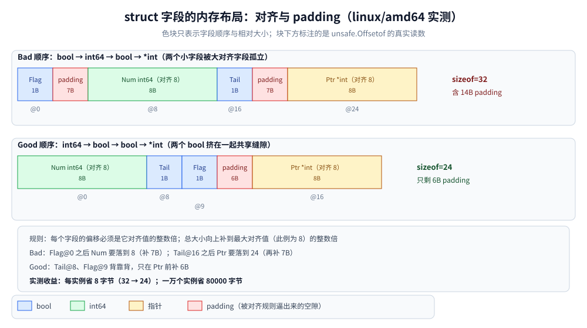

# struct与tag

> 覆盖 struct 的内存布局与字段对齐（padding）、字段重排的字节收益、
> `struct{}` 的零大小与用途、可比较规则（`==` 与 map key），以及 tag 的 reflect 读取机制、
> "tag 是字符串不是类型"与"tag 不随嵌入继承"两类实测坑、常用 tag 生态对照与 `omitempty` 组合语义。
>
> 内容整理自个人学习笔记，素材见 [素材清单.md](../../../素材清单.md)。
>
> ⚠️ 本篇全部读数来自容器 `golang:1.26-alpine`（`go version go1.26.8 linux/amd64`）真跑，
> 编译错误原文出自该容器的 `go build` stderr。
> struct 参与**类型同一性**（tag 不同即不同类型、转换可忽略 tag）已在 [类型系统.md](类型系统.md) 第三节讲透，本篇不重讲；
> 基础类型自身的占用与零值见 [基础类型与零值.md](基础类型与零值.md)。

---

## 一、struct 在内存里是怎么排的？padding 规则是什么？

**本节要点**：字段在内存里的位置不是"按声明顺序紧挨着放"——每个字段要挪到自己的对齐边界上，
空出来的就是 padding；struct 总大小还必须是整体对齐值的整数倍。规则本身一句话说得完，
但"省不省字节"必须拿 `unsafe` 实测说话。

### 1.1 三条规则

1. 第一个字段偏移为 0；
2. 每个字段的偏移必须是 **`unsafe.Alignof(该字段类型)` 的整数倍**，不够就插 padding；
3. struct 的 `Alignof` 取所有字段的最大对齐值，**总大小向上补到这个值的整数倍**（尾部 padding，
   保证数组里下一个元素的首字段仍对齐）。

64 位平台常见类型的对齐值实测（与大小不同，`int64/float64/指针` 对齐 8，`int32/float32` 对齐 4）：

```go
fmt.Printf("align: bool=%v int8=%v int16=%v int32=%v int64=%v float32=%v string头=%v [2]int32=%v\n",
	unsafe.Alignof(b), unsafe.Alignof(i8), unsafe.Alignof(i16), unsafe.Alignof(i32),
	unsafe.Alignof(i64), unsafe.Alignof(f32), unsafe.Alignof(s), unsafe.Alignof(arr))
```

```text
align: bool=1 int8=1 int16=2 int32=4 int64=8 float32=4 string头=8 [2]int32=4
```

### 1.2 实测：`sizeof` / `offsetof` 逐项核对

```go
type Bad struct {
	Flag bool
	Num  int64
	Tail bool
	Ptr  *int
}

type Good struct {
	Num  int64
	Tail bool
	Flag bool
	Ptr  *int
}

fmt.Printf("Bad  sizeof=%v align=%v  offsets: Flag=%v Num=%v Tail=%v Ptr=%v\n",
	unsafe.Sizeof(Bad{}), unsafe.Alignof(Bad{}),
	unsafe.Offsetof(Bad{}.Flag), unsafe.Offsetof(Bad{}.Num),
	unsafe.Offsetof(Bad{}.Tail), unsafe.Offsetof(Bad{}.Ptr))
fmt.Printf("Good sizeof=%v align=%v  offsets: Num=%v Tail=%v Flag=%v Ptr=%v\n",
	unsafe.Sizeof(Good{}), unsafe.Alignof(Good{}),
	unsafe.Offsetof(Good{}.Num), unsafe.Offsetof(Good{}.Tail),
	unsafe.Offsetof(Good{}.Flag), unsafe.Offsetof(Good{}.Ptr))
```

```text
Bad  sizeof=32 align=8  offsets: Flag=0 Num=8 Tail=16 Ptr=24
Good sizeof=24 align=8  offsets: Num=0 Tail=8 Flag=9 Ptr=16
```

对照读数走一遍规则：

- `Bad`：`Flag` 在 0，`Num` 要对齐 8 → 只能放到 8（1~7 是 7 字节 padding）；`Tail` 在 16；
  `Ptr` 又要对齐 8 → 跳到 24（17~23 又是 7 字节 padding），总 32。
- `Good`：`Num` 在 0，两个 bool 背靠背占 8、9，`Ptr` 从 16 开始（10~15 只 padding 6 字节），总 24。



**图怎么读**：上下两条带是同一个 struct 的两种字段顺序，色块按"bool 蓝、int64 绿、指针黄、padding 红"着色，
块下方标注的是实测的 `unsafe.Offsetof` 读数（色块宽度只表示顺序与相对大小）。上面 Bad 顺序里 `Flag`（偏移 0）
后面跟着 7 字节红色 padding 才能放下对齐 8 的 `Num`（偏移 8），`Tail`（偏移 16）后面又是一段 7 字节 padding；
下面 Good 顺序把两个 bool 挤到偏移 8、9 上背靠背，中间只剩 6 字节 padding，总大小从 `sizeof=32` 降到
`sizeof=24`——省掉的正是被"小字段孤立"逼出来的那 8 字节填充。底部灰框给出三条对齐规则与实测收益
（每实例省 8 字节，一万个实例省 80000 字节）。

### 1.3 padding 位置会变、总大小不一定变

实测第二组：`{int32, int8, int32}` 与重排后的 `{int32, int32, int8}`——

```text
Mix{int32,int8,int32} sizeof=12 offsets A=0 B=4 C=8
MixSorted{int32,int32,int8} sizeof=12 offsets A=0 C=4 B=8
```

两个都是 12 字节：4 字节对齐的小字段"夹缝"只有 3 字节，重排只是把 padding 从 B 后面挪到了尾部。
**判据：重排只有在"孤立小字段挤在大对齐字段中间"时才省字节**——把字段按对齐值从大到小排序是通用的省法，
但不保证有得省。

---

## 二、字段重排真的能省内存吗？省多少？

**本节要点**：能省，且省多少可以精确算——但要清楚**什么时候值得动**。

### 2.1 实测收益

```text
重排省下 8 字节（每实例），1 万个实例省 80000 字节
```

`Bad → Good` 每实例省 8 字节（32 → 24，即 1.2 节实测的两条 sizeof）。单个实例无感；
**放进切片、map value、缓存对象池**里就是可测量的差距——10 万个实例差 800 KB，
再叠加 [内存分配器.md](../运行时/内存分配器.md) 的 size class 效应，差距还可能被放大。

### 2.2 什么时候值得动

| 情况 | 建议 |
|---|---|
| 热点大数组 / 缓存里的对象、需要驻留几十万份 | 按对齐降序排字段，用 `Layout` 工具核 offset（见「使用」段） |
| 只在栈上活几个的临时 struct | 不动，**可读性优先** |
| 要和 C / mmap / 二进制协议对布局 | 不是"优化"问题，必须显式控制布局，考虑 `alignment` 注释或拆成定宽类型（见 [基础类型与零值.md](基础类型与零值.md) 2.1） |
| 频繁被整体复制的 struct 放进 interface | 越小越好——装箱按 `sizeof` 拷贝，见 [内存逃逸.md](../运行时/内存逃逸.md) |

⚠️ 重排**不改变类型身份以外的语义**，但会改变**同名字段的偏移**：如果有代码依赖 `unsafe` 偏移或
跨语言共享内存布局，重排就是破坏性变更。普通 Go 代码只按字段名访问，可以安全重排。

---

## 三、`struct{}` 大小是 0？那它有什么用？

**本节要点**：零大小是实测事实；它换来两类惯用法——"只当信号用的 chan"和"当集合用的 map"。

### 3.1 实测

```go
var e struct{}
ea := [3]struct{}{}
es := make([]struct{}, 3)
fmt.Printf("unsafe.Sizeof(struct{})=%v  [3]struct{}=%v  []struct{}头=%v len(es)=%d\n",
	unsafe.Sizeof(e), unsafe.Sizeof(ea), unsafe.Sizeof(es), len(es))
p1, p2 := &ea[0], &ea[1]
fmt.Printf("[3]struct{} 相邻元素地址差 = %v（零大小元素共享 runtime 的 zerobase 地址）\n",
	uintptr(unsafe.Pointer(p2))-uintptr(unsafe.Pointer(p1)))
```

```text
unsafe.Sizeof(struct{})=0  [3]struct{}=0  []struct{}头=24 len(es)=3
[3]struct{} 相邻元素地址差 = 0（零大小元素共享 runtime 的 zerobase 地址）
```

`struct{}` 本身 0 字节；`[3]struct{}` 也 0 字节，三个元素地址相同（都挂在 runtime 的零大小基址上）；
切片头仍是 24 字节（头是"指针+len+cap"三个字，与元素大小无关，见 [基础类型与零值.md](基础类型与零值.md) 6.2）。

### 3.2 两个惯用法

```go
done := make(chan struct{}) // 只传"发生了"这一个信号，不传数据
go func() { <-work; close(done) }()

seen := map[string]struct{}{} // 只要 key 的集合：value 不占空间
seen["a"] = struct{}{}
```

- `chan struct{}`：关闭/收到即事件，比 `chan bool` 语义更干净（不会问"true 和 false 各是什么意思"）；
- `map[K]struct{}`：set 的标准实现；比 `map[K]bool` 每 entry 少 1 字节 value，且**不存在"误读 value"的分支**。

---

## 四、什么样的 struct 能 `==` 比较、能当 map key？

**本节要点**：判据一条——**所有字段都可比较**。含 slice / map / func 字段就整体不可比较，编译期拦下；
可比较的 struct 才能当 map key（判据链条见 [map.md](map.md) 第七节，不重讲）。

### 4.1 实测：可比较的两例

```go
type Point struct{ X, Y int }

a, b := Point{1, 2}, Point{X: 1, Y: 2}
fmt.Printf("逐字段相同的可比较 struct：a==b 为 %v\n", a == b)

type Cfg struct {
	Name string
	Tags [2]int
}

c1 := Cfg{"x", [2]int{1, 2}}
c2 := Cfg{"x", [2]int{1, 2}}
fmt.Printf("含字符串与数组字段仍可比较：c1==c2 为 %v\n", c1 == c2)

m := map[Point]string{a: "origin"}
fmt.Printf("可比较 struct 能当 map key：m[b] = %q\n", m[b])
```

```text
逐字段相同的可比较 struct：a==b 为 true
含字符串与数组字段仍可比较：c1==c2 为 true
可比较 struct 能当 map key：m[b] = "origin"
```

数组字段可比较的前提是**元素可比较**；interface 字段可比较的前提是**动态类型可比较**——
后者是运行时才炸的 `panic: hash of unhashable type`，编译期拦不住（实测与机制在 [map.md](map.md) 第七节）。

### 4.2 编译错误原文：含 slice / func 字段

```go
type WithSlice struct {
	Name string
	Tag  []int
}

a := WithSlice{Name: "x"}
b := WithSlice{Name: "y"}
fmt.Println(a == b) // 报错
```

```text
.workbuddy/tmp/exp/structtag/fail_compare.go:13:14: invalid operation: a == b (struct containing []int cannot be compared)
```

```go
type WithFunc struct {
	Name string
	Fn   func()
}

m := map[WithFunc]int{} // 报错
```

```text
.workbuddy/tmp/exp/structtag/fail_mapkey.go:9:11: invalid map key type WithFunc
```

`==` 的报错**点名了拖后腿的字段类型**（`containing []int`），map key 的报错只到类型层——排错时前者直接、后者要自己翻字段。
需要"内容相同的 struct 判等"但含不可比较字段时，用 `reflect.DeepEqual` 或手写字段比较，别硬塞 map key。

---

## 五、tag 是什么机制？reflect 是怎么读它的？

**本节要点**：tag 是**编译进类型信息的字符串**，语言本身不解释它，解释者是 `reflect.StructTag` 和各个库。

### 5.1 语法与读取接口

tag 写在字段声明之后、**反引号**包裹：

```go
type User struct {
	Name  string `json:"name" yaml:"Name" gorm:"column:name;type:varchar(64)" validate:"required,max=64" db:"user_name"`
	Age   int    `json:"age,omitempty"`
	Score float64 `json:"score,string"`
	Priv  string `json:"-"`
}
```

`reflect` 侧的入口是 `StructField.Tag`（类型 `reflect.StructTag`，本质 `string`）：

- `Get("json")`：返回该 key 的原始串，不存在返回 `""`；
- `Lookup("json")`：多返回一个 `bool`，**区分"没有这个 key"和"key 存在但值为空"**；
- 格式约定：`key:"value"` 空格分隔；**value 必须带引号**，否则整个 tag 对该 key 不可见；
  一个字段上多个 key **互不干扰**，各库只认自己的。

实测（`User.Name` 一个字段挂五种 key）：

```go
f, _ := reflect.TypeOf(User{}).FieldByName("Name")
fmt.Printf("Name 的整串 tag：%s\n", f.Tag)
for _, k := range []string{"json", "yaml", "gorm", "validate", "db", "protobuf"} {
	v, hit := f.Tag.Lookup(k)
	fmt.Printf("  Get(%-9q) = %q 命中=%v\n", k, v, hit)
}
```

```text
Name 的整串 tag：json:"name" yaml:"Name" gorm:"column:name;type:varchar(64)" validate:"required,max=64" db:"user_name"
  Get("json"   ) = "name" 命中=true
  Get("yaml"   ) = "Name" 命中=true
  Get("gorm"   ) = "column:name;type:varchar(64)" 命中=true
  Get("validate") = "required,max=64" 命中=true
  Get("db"     ) = "user_name" 命中=true
  Get("protobuf") = "" 命中=false
```

value 内部再怎么拆是**各家库自己的规矩**：`encoding/json` 按逗号拆成 `name,omitempty,string`
（拆法见「使用」段实测）；`gorm` 用分号；`validate` 用逗号加等号。

### 5.2 tag 存在哪？——编译进类型元数据，运行时零成本可查

tag 不占实例内存（对比 1.2 节：`User{}` 的字段偏移里没有任何 tag 空间），它存在类型的
`structField` 元数据里，`reflect` 查询时才读。副作用：**tag 参与类型同一性**——两个字段相同、
tag 不同的匿名 struct 是不同类型，实测的编译错误原文在 [类型系统.md](类型系统.md) 3.2，不重讲。

---

## 六、"tag 只是字符串"与"tag 不随嵌入继承"各踩什么坑？

**本节要点**：编译器不校验 tag 的内容，拼错 key、写错格式都**静默失效**；嵌入结构体时外层的
reflect 视野里也**看不到**内层字段的 tag。两件事都有实测。

### 6.1 拼错 key 编译器不管（实测）

```go
type Typo struct {
	Name string `jsno:"name"` // json 拼成了 jsno
}

tf, _ := reflect.TypeOf(Typo{}).FieldByName("Name")
fmt.Printf("Typo.Name 的 tag=%q，Get(\"json\")=%q\n", string(tf.Tag), tf.Tag.Get("json"))
b, _ := json.Marshal(Typo{Name: "tom"})
fmt.Printf("json.Marshal(Typo) 输出 %s\n", b)
```

```text
Typo.Name 的 tag="jsno:\"name\""，Get("json")=""
json.Marshal(Typo) 输出 {"Name":"tom"}
```

没有编译错误、没有运行时警告，只是序列化的键**悄悄从 `name` 变成了 Go 字段名 `Name`**。
判据：改 tag 后跑一遍序列化测试看输出键名；或在 code review 里只认「库文档列出的 key 拼写」。

### 6.2 tag 不随嵌入继承（reflect 视野实测）

```go
type Inner struct {
	Secret string `json:"-"`
	Public string `json:"public"`
}

type Outer struct {
	Inner // 匿名嵌入，字段名就叫 "Inner"
	Own   string `json:"own"`
}
```

```text
类型 Outer：2 个可见字段
  [0] main.Inner 名=Inner    偏移= 0 PkgPath="" tag=""
      ↳ 匿名嵌入，字段名就是类型名 "Inner"；内层 tag 在内层类型上，外层 Field 列表看不到
  [1] string   名=Own      偏移=32 PkgPath="" tag="json:\"own\""
```

`reflect.TypeOf(Outer{}).Field(0)` 是**嵌入字段本身**（名字 = 类型名 `Inner`，tag 为空串），
`Inner` 里 `Secret/Public` 的 tag 留在 `Inner` 这个类型上，外层类型列表看不见它们。
访问内层字段要走 `FieldByName("Secret")`——reflect 会顺着嵌入展开查找，拿到的是**内层类型里的字段描述**，
tag 也来自内层。

### 6.3 但 `encoding/json` 会"提升"匿名嵌入的字段（实测）

```go
type Named struct {
	Inner Inner  `json:"inner"` // 命名嵌入：Inner 就是一个普通字段
	Own   string `json:"own"`
}

ob, _ := json.Marshal(Outer{Inner: Inner{Secret: "s", Public: "p"}, Own: "o"})
nb, _ := json.Marshal(Named{Inner: Inner{Secret: "s", Public: "p"}, Own: "o"})
fmt.Printf("匿名嵌入 json：%s\n", ob)
fmt.Printf("命名字段嵌入 json：%s\n", nb)
```

```text
匿名嵌入 json：{"public":"p","own":"o"}
命名字段嵌入 json：{"inner":{"public":"p"},"own":"o"}
```

三个读数合在一起的结论：

1. **匿名嵌入**：json 把内层导出字段提升到外层同一级序列化（`public` 和 `own` 平级），
   并且**内层 tag 照样生效**（`Secret` 因 `json:"-"` 消失）；
2. **命名嵌入**（`Inner Inner \`json:"inner"\``）：内层整体变成一个嵌套对象 `{"inner":{...}}`，
   外层 tag 决定这个嵌套的键名；
3. reflect 视野（6.2）里两者又都是"一个字段"——**"嵌入是否摊平"是库行为，不是语言行为**，
   换库（yaml、xml、gob）要重新确认它的提升规则；
4. **转换丢 tag**：`struct{A string \`json:"a"\`}` 强转成 `struct{A string}` 合法（[类型系统.md](类型系统.md) 3.3：转换忽略 tag），
   但结果类型没有 tag——用转换"洗"类型时 tag 一起被洗掉。tag 跟着**类型**走，不跟着字段值走。

---

## 七、`json` / `yaml` / `gorm` / `validate` / `db` 各家写法有什么差别？

**本节要点**：五家只认自己的 key、各有一套 value 语法；`encoding/json` 的
`-`、`,omitempty`、`,string` 三种组合最容易记混，全部实测。

### 7.1 生态对照表

| 库 | key | value 语法示例 | 说明 |
|---|---|---|---|
| `encoding/json` | `json` | `json:"name,omitempty,string"` | 逗号三段：名 / 选项 / 选项；`json:"-"` 整个跳过 |
| `gopkg.in/yaml.v3` | `yaml` | `yaml:"Name,omitempty,flow"` | 结构与 json 同族，但**零值默认照发**，omitempty 才省 |
| `gorm` | `gorm` | `gorm:"column:name;type:varchar(64);not null"` | 分号分隔的 `key:value` 对，字段语义是建表/映射 |
| `go-playground/validate` | `validate` | `validate:"required,max=64,email"` | 逗号分隔的规则串，规则内用 `=` 传参 |
| `sqlx` | `db` | `db:"user_name"` | 通常只有一段：列名；选项写成 `db:"id,fromdb"` 的少见 |

同一字段可以五种 key 同时挂（5.1 实测的 `User.Name` 就挂了五种），互不干扰；
**但各家 value 语法不通用**——`json:"age,omitempty"` 的逗号对 gorm 毫无意义，别交叉着抄。

### 7.2 `json` 的三种组合语义（实测）

```go
type Demo struct {
	Name    string            `json:"name"`
	Age     int               `json:"age,omitempty"`
	Score   float64           `json:"score,string"`
	Priv    string            `json:"-"`
	Tags    map[string]string `json:"tags,omitempty"`
	Created interface{}       `json:"created,omitempty"`
}

out, _ := json.Marshal(Demo{Name: "tom", Priv: "secret", Score: 9.5})        // Age/Tags/Created 全零值
out2, _ := json.Marshal(Demo{Name: "tom", Age: 3, Priv: "s", Score: 9.5,
	Tags: map[string]string{"k": "v"}, Created: 0})
fmt.Printf("Age=0 Tags=nil Created=nil 时：%s\n", out)
fmt.Printf("非零值时：%s\n", out2)
```

```text
Age=0 Tags=nil Created=nil 时：{"name":"tom","score":"9.5"}
非零值时：{"name":"tom","age":3,"score":"9.5","tags":{"k":"v"},"created":0}
```

逐条对读数：

- **`json:"-"`**：`Priv` 两次都消失——"整个字段跳过"，和值无关；
- **`json:",omitempty"`**：`Age=0`、`Tags=nil` 被吞（`"age"` 键不存在）；恢复非零值后照常出现；
- **`json:",string"`**：`Score` 输出成 `"9.5"`（带引号）——给前端传"数字字符串"的标准姿势；
- **名 + 选项可混写**：`json:"age,omitempty"` 里逗号前是名字、逗号后是选项；想保留 Go 字段名只加选项时，逗号前**留空**写成 `json:",omitempty"`。

### 7.3 ⚠️ `omitempty` 判的是"该类型零值"，且有盲区

```text
int 零值 + omitempty → {}；false/0/""/nil/空数组都会被 omitempty 吞掉
```

- **`false`、`0`、`""`、空 slice/map 全被吞**——"这个字段是 false"和"这个字段没传"在 JSON 里不可区分；
  布尔开关字段想表达 false 就别加 omitempty，或者用 `*bool`（nil 才是"没传"）；
- 实测第二行的暗坑：`Created interface{}` 装着 `0` 时 `"created":0` **照样输出**——
  omitempty 对 interface 字段只判 nil，不往里看。`json:"created,omitempty"` 挡不住"非 nil 的零值"。

---

## 使用：用 reflect 打印一个结构体的字段、tag 与偏移

排查"tag 到底生没生效、字段偏移是多少"时，下面这个工具直接打答案（泛型版，Go 1.21+ 都能跑）。

```go
package main

import (
	"fmt"
	"reflect"
	"strings"
	"unsafe"
)

type User struct {
	Name  string  `json:"name" gorm:"column:name"`
	Age   int     `json:"age,omitempty"`
	Score float64 `json:"score,string"`
	Priv  string  `json:"-"`
}

type Inner struct {
	Secret string `json:"-"`
	Public string `json:"public"`
}

type Outer struct {
	Inner
	Own string `json:"own"`
}

// Dump 打印一个 struct 类型的字段名 / 类型 / 偏移 / tag，并按 json 约定拆出 name 与选项
func Dump[T any]() {
	var z T
	t := reflect.TypeOf(&z).Elem()
	fmt.Printf("== %v == sizeof=%v alignof=%v\n", t, unsafe.Sizeof(z), unsafe.Alignof(z))
	for i := 0; i < t.NumField(); i++ {
		f := t.Field(i)
		name, opts := splitTag(f.Tag.Get("json"))
		fmt.Printf("  [%d] %-8s %-11s offset=%2v tag=%q json.name=%q json.opts=%q\n",
			i, f.Name, f.Type, f.Offset, string(f.Tag), name, opts)
	}
}

func splitTag(tag string) (string, string) {
	if tag == "" {
		return "", ""
	}
	p := strings.SplitN(tag, ",", 2)
	if len(p) == 1 {
		return p[0], ""
	}
	return p[0], p[1]
}

func main() {
	Dump[User]()
	Dump[Outer]()
	fmt.Printf("unsafe.Offsetof(Outer{}.Own)=%v（匿名嵌入的 Inner 整体内联，Own 排在 Inner 全部字段之后）\n",
		unsafe.Offsetof(Outer{}.Own))
}
```

```text
== main.User == sizeof=48 alignof=8
  [0] Name     string      offset= 0 tag="json:\"name\" gorm:\"column:name\"" json.name="name" json.opts=""
  [1] Age      int         offset=16 tag="json:\"age,omitempty\"" json.name="age" json.opts="omitempty"
  [2] Score    float64     offset=24 tag="json:\"score,string\"" json.name="score" json.opts="string"
  [3] Priv     string      offset=32 tag="json:\"-\"" json.name="-" json.opts=""
== main.Outer == sizeof=48 alignof=8
  [0] Inner    main.Inner  offset= 0 tag="" json.name="" json.opts=""
  [1] Own      string      offset=32 tag="json:\"own\"" json.name="own" json.opts=""
unsafe.Offsetof(Outer{}.Own)=32（匿名嵌入的 Inner 整体内联，Own 排在 Inner 全部字段之后）
```

**怎么用它**：

1. `json.name="jsno"` 之类拼错在 `tag=` 列一眼可见，`json.name=""` 但字段又确实有序列化差异 → 就是 6.1 的静默失效；
2. `Outer` 的 `[0]` 行印证 6.2：**reflect 视野里嵌入字段 tag 为空**，内层 tag 要找 `Inner` 自己 dump；
3. `offset=` 列配合 `sizeof=` 直接核 1.2 节三条规则，怀疑字段顺序亏内存时先跑它再决定重排。

---

## 延伸追问

- **struct 大小为什么不是字段大小之和？`{bool, int64, bool, *int}` 多大？** → 每个字段要落到自己的对齐边界，中间补 padding。实测 `Bad` 32 字节（两个 bool 各逼出 7 字节 padding），重排成 `Good` 24 字节。
- **怎么省 struct 内存？一定省吗？** → 字段按对齐值降序排。不保证：实测 `{int32,int8,int32}` 和 `{int32,int32,int8}` 都是 12 字节，padding 只是换了位置；小字段夹在大对齐字段中间时才有得省。
- **`struct{}` 占多少字节？两个元素的 `[2]struct{}` 呢？** → 都是 0 字节；实测 `[3]struct{}` 相邻元素地址差为 0（共享 zerobase）。用途是 `chan struct{}` 信号与 `map[K]struct{}` 集合。
- **含 slice 字段的 struct 能当 map key 吗？** → 不能，编译期报 `invalid map key type`；`==` 比较也报 `struct containing []int cannot be compared`（两版错误原文见 4.2）。含 interface 字段编译放行，但动态类型不可比较时运行时 panic。
- **tag 拼错 key 会报错吗？** → 不会。实测 `jsno:"name"` 被 json 无视，序列化键退回 Go 字段名——tag 是字符串，编译器不校验语义。
- **匿名嵌入时，外层类型能直接读到内层字段的 tag 吗？** → 不能。reflect 里外层只有"Inner"这一个字段且 tag 为空串（实测 dump）；但 `encoding/json` 会摊平内层导出字段**并应用内层 tag**——摊平是库行为不是语言行为。
- **`json:"-"` 和 `json:",omitempty"` 有什么区别？** → 前者无条件跳过字段；后者字段仍参与序列化，只在值等于该类型零值时省略键（实测 Age=0 时无 `"age"` 键）。
- **为什么布尔字段的 omitempty 危险？** → `false` 也是零值，会被吞——"传了 false"和"没传"不可区分；需要区分时用 `*bool`，nil 才表示没传。
- **interface 字段加 omitempty 能省掉包着 0 的值吗？** → 不能。实测 `Created interface{}` 装着 `0` 时输出 `"created":0`——omitempty 对 interface 只判 nil，不往里看。

---

## 关联

- [指针与引用.md](指针与引用.md) — 布局决定了拷贝成本：`unsafe.Offsetof`/字段偏移的实测在彼，值拷贝的四种症状与判据也在彼
- [类型系统.md](类型系统.md) — tag 参与类型同一性、转换忽略 tag 的实测与编译错误原文
- [基础类型与零值.md](基础类型与零值.md) — 字段类型各自的大小/对齐、omitempty 判的"零值"口径的出处
- [map.md](map.md) — 可比较类型才能当 key 的完整判据与 interface key 的运行时陷阱
- [接口.md](接口.md) — struct 装进接口的两字开销与装箱代价
- [内存分配器.md](../运行时/内存分配器.md) — struct 大小映射到 size class，重排收益的放大机制
- [内存逃逸.md](../运行时/内存逃逸.md) — 热点 struct 的尺寸如何影响堆分配成本
- [依赖注入.md](../工程实践/依赖注入.md) — reflect 读 tag 后按类型装配的工程应用
- [反射与unsafe.md](../运行时/反射与unsafe.md) — tag 的 reflect 读取机制在此只给字段遍历的形态，Type/Value 两件套、CanSet 判据与耗时实测在彼
