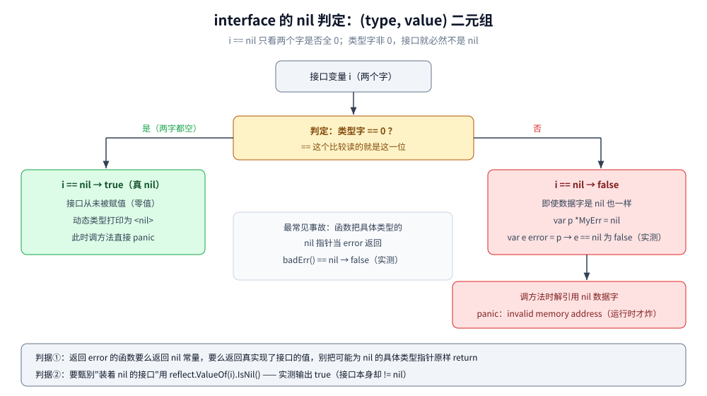

# 基础类型与零值

> 覆盖 Go 基础类型的三类声明方式与 `:=` 遮蔽、数值类型的位宽选择、
> 每种类型的零值与"零值能不能直接用"、`nil` 的六种形态与 interface 的 (type, value) 二元组判定、
> 常量与 `iota` 的求值规则、各类型的内存占用实测。
>
> 内容整理自个人学习笔记，素材见 [素材清单.md](../../../素材清单.md)。
>
> ⚠️ 本篇全部读数来自容器 `golang:1.26-alpine`（`go version go1.26.8 linux/amd64`）真跑；
> 编译错误原文同样出自该容器的 `go build` stderr。
> 类型本身的规则（命名/未命名类型、底层类型、转换合法性、方法集）归 [类型系统.md](类型系统.md)，本篇不重讲；
> struct 的内存布局与 tag 归 [struct与tag.md](struct与tag.md)。

---

## 一、`var`、`:=`、`const` 三种声明方式到底差在哪？

**本节要点**：三者不是"随便挑一个顺手的"——作用域要求、类型推导时机、能否遮蔽外层变量各不相同，判错会写出编译错误或静默的变量遮蔽 bug。

### 1.1 一张表先看差别

| 写法 | 能用在哪 | 类型怎么定 | 硬约束 |
|---|---|---|---|
| `var x T = v` / `var x T` | 包级、函数内都行 | 显式写 `T`；省略 `= v` 时拿**零值**（见第三节） | 声明了不用会报 `declared and not used`（仅函数内） |
| `var x = v` | 都行 | 由 `v` 推导；`v` 是无类型常量时取**默认类型**（`1` → `int`，`1.0` → `float64`） | 同上 |
| `x := v` | **只能函数内** | 同 `var x = v` | 左边**至少要有一个新变量** |
| `const x = v` | 都行 | 常量表达式，编译期求值、**任意精度**（见第五节） | 必须初始化，不能单独作变量使用 |

### 1.2 `:=` 的"复用 + 新建"与跨作用域遮蔽（实测）

```go
x := 1
px := &x // 先留一个指向外层 x 的指针，遮蔽后还能看到外层值
{
	x := 2 // 内层新变量，遮蔽外层
	x++
	fmt.Printf("内层 x=%d，同一时刻外层（经 px 观察）=%d\n", x, *px)
}
x++
fmt.Printf("出块后外层 x=%d（内层的 ++ 没有动到它）\n", x)

x, ok := 10, true // 同一作用域内 := 至少一个新变量（ok）即可，x 是复用赋值
ok = false
fmt.Printf("x,ok := 复用外层 x：%d，ok 新建后被改为 %v\n", x, ok)
```

```text
内层 x=3，同一时刻外层（经 px 观察）=1
出块后外层 x=2（内层的 ++ 没有动到它）
x,ok := 复用外层 x：10，ok 新建后被改为 false
```

**怎么读这三行**：

1. 内层 `x := 2` 建的是**另一个变量**，内层 `x++` 加到 3，外层经指针看仍是 1——遮蔽不是修改；
2. 出块后外层自己 `x++` 才变成 2；
3. `x, ok := 10, true` 在**同一作用域**合法，靠的是 `ok` 是新变量；此时 `x` 被**复用赋值**成 10，而不是新建。

### 1.3 判据

- 函数内、右边表达式已给出类型 → `:=`；包级变量、需要零值占位、需要显式宽类型（如 `var n int64 = math.MaxInt32 + 1`）→ `var`；
- ⚠️ 最常见的遮蔽事故：**`if` 或 `switch` 块内用 `:=` 重新声明 `err`**——块内判了新的 `err`，函数返回时外层的老 `err` 还挂着，错误被静默吞掉。判据：块结束后还要用某个变量，块内就**不要对它用 `:=`**（改用 `=` 单独赋值，或把新变量起别的名字）；
- 同作用域 `:=` 左边全是老变量会报 `no new variables on left side of :=`——这句话本身就是"复用还是新建"的编译器判据。

---

## 二、数值类型这么多，什么时候用 `int`、什么时候必须 `int64`？

**本节要点**：`int` / `uint` / `uintptr` 的位宽**由平台决定**，这决定了"落盘、跨语言传输、时间戳"三类场景不能偷懒全用 `int`。

### 2.1 位宽实测（第六节有完整的 `unsafe.Sizeof` 表）

容器内 `linux/amd64` 实测：`int=8 uint=8 uintptr=8 int32=4 int64=8`（字节）。
同一份代码在 32 位平台上 `int` 只有 **4 字节**——所以凡是要和"平台无关的格式"打交道的数字，**用定宽类型**：

| 场景 | 选择 | 原因 |
|---|---|---|
| 普通计数、下标、本进程内的量 | `int` | 语言与标准库的默认口径（`len`、`cap`、`make` 的 hint 都是 `int`），省一次转换 |
| 落盘 / 网络协议 / 跨语言序列化（protobuf、数据库 BIGINT） | `int32` / `int64` | 位宽必须钉死，不能随部署平台变 |
| 时间戳、雪花 ID、自增大 ID | `int64` | 毫秒级时间戳早已超过 `int32`（21 亿）上限 |
| 位图、掩码、需要无符号右移 | `uint64` / `uint` | 有符号右移是算术移位，符号位会污染高位 |
| 与 syscall / `unsafe` 交换"指针尺寸的整数" | `uintptr` | 见 2.3 |

### 2.2 `byte` 和 `rune` 不是新类型，是别名

```text
bool=1 byte=1 rune(int32)=4
```

`byte` 是 `uint8` 的别名、`rune` 是 `int32` 的别名（`type` 别名语法见 [类型系统.md](类型系统.md) 1.2）：
它们**不提供新能力，只表达意图**——`[]byte` 读作"字节序列"、`[]rune` 读作"码点序列"。
和字符串互转的代价（转换即拷贝、`[]rune` 还要按 UTF-8 解码）见第六节 6.3。

### 2.3 `uintptr` 是"数字"，不是"引用"

`uintptr` 只是一个和指针同宽的整数，**GC 不把它当引用**：拿着 `uintptr` 期间对象照样可以被回收，
"转出去再转回来"就可能是悬空地址。规则一句话：**`unsafe.Pointer` 用于持有对象，`uintptr` 只用于计算偏移和传给 syscall**。
日常业务代码不该出现 `uintptr`；出现了先问是不是该用指针。

### 2.4 浮点：`float32` 存 0.1 的真实值（实测）

```go
f32 := float32(0.1)
fmt.Printf("float32(0.1) 用 %v 打印：%v；FormatFloat 展开 20 位：%s\n",
	f32, strconv.FormatFloat(float64(f32), 'f', 20, 32))
```

```text
float32(0.1) 用 %v 打印：0.1；FormatFloat 展开 20 位：0.10000000149011611938（有类型后精度受限）
```

`%v` 打印的是"最短可还原表示"，把误差藏了起来；展开 20 位才看到二进制浮点存 `0.1` 的老问题。
工程判据：**金额用最小单位整数（分）存，或用 `big.Float`/字符串**；`==` 比较浮点前必须想清楚误差来源。
`complex64` / `complex128` 是实部+虚部（占用 8 / 16 字节），除科学计算外基本不碰。

---

## 三、每种类型的零值是什么？零值 map、nil slice 能不能直接用？

**本节要点**：Go 保证**声明即合法**——所有变量自动置零值，不存在"未初始化内存"。但"零值合法"不等于"零值可用"：nil map 写得 panic、nil slice 却随便 append，这组反差必须实测钉死。

### 3.1 零值总表（读数全部来自 3.2 的同一次实测）

| 类型 | 零值 | 零值直接用 |
|---|---|---|
| 各数值类型 | `0`（复数为 `(0+0i)`） | ✅ |
| `bool` | `false` | ✅ |
| `string` | `""`（空串，**不是 nil**） | ✅ 可 `len`、可拼接 |
| 指针 | `nil` | ❌ 解引用 panic |
| slice | `nil` | ✅ `len/cap/append/range` 全合法 |
| map | `nil` | ⚠️ 读、删、遍历安全；**写 panic** |
| chan | `nil` | ⚠️ 收、发会**永久阻塞**（只有 `select` 带 `default` 能走） |
| func | `nil` | ❌ 调用 panic |
| interface | `nil`（类型、值两个字都空） | ❌ 调方法 panic |
| 数组 `[N]T` | 每个元素各取 `T` 的零值 | ✅ |
| struct | 每个字段各取零值 | 视字段而定 |

### 3.2 实测：零值打印 + nil map 的 panic 原文

```go
var i int
var u uint
var f64 float64
var b bool
var s string
var c7 complex128
var r []int
var m map[string]int
var ch chan int
var fp *int
var fn func()
var iface interface{}
var arr [3]int
var st struct {
	A int
	B string
}
fmt.Printf("int=%v uint=%v float64=%v bool=%v string=%q complex128=%v\n", i, u, f64, b, s, c7)
fmt.Printf("slice=%v nil?=%v len=%d cap=%d\n", r, r == nil, len(r), cap(r))
fmt.Printf("map=%v nil?=%v len=%d\n", m, m == nil, len(m))
fmt.Printf("chan=%v ptr=%v func=%v iface=%v\n", ch, fp, fn, iface)
fmt.Printf("array=%v struct=%+v\n", arr, st)

v, ok := m["k"]
fmt.Printf("读 m[\"k\"] 得 %v，comma-ok=%v，len=%d\n", v, ok, len(m))
func() {
	defer func() {
		if rec := recover(); rec != nil {
			fmt.Printf("delete(nil map) 正常返回；写 nil map panic：%v\n", rec)
		}
	}()
	delete(m, "k")
	m["k"] = 1
}()
```

```text
int=0 uint=0 float64=0 bool=false string="" complex128=(0+0i)
slice=[] nil?=true len=0 cap=0
map=map[] nil?=true len=0
chan=<nil> ptr=<nil> func=<nil> iface=<nil>
array=[0 0 0] struct={A:0 B:}
读 m["k"] 得 0，comma-ok=false，len=0
delete(nil map) 正常返回；写 nil map panic：assignment to entry in nil map
```

nil map 的完整边界（为什么读安全、`flags` 检测、并发写是 fatal 而非 panic）已在
[map.md](map.md) 第八节讲透，这里只留一句话判据：**`var m map[K]V` 是"只读的空集合"，要写必须 `make`**。
注意实测里 `comma-ok=false`——nil map 读出的零值**区分不了"没这个 key"**，所以判存在永远用 `, ok`。

### 3.3 实测：append 到 nil slice 是合法的

```go
var ns []int
ns = append(ns, 1, 2)
fmt.Printf("append 之后 nil?=%v 内容=%v len=%d cap=%d\n", ns == nil, ns, len(ns), cap(ns))
```

```text
append 之后 nil?=false 内容=[1 2] len=2 cap=2
```

`append` 对 nil slice 的处理和空 slice 完全一样（nil 就是 `ptr=nil, len=0, cap=0` 的切片头），
第一次 append 时分配底层数组并返回新头。**所以 Go 里声明切片不需要"初始化"**，
`var s []T` 就是标准起手式——这与 map 恰好相反。

### 3.4 实测：nil slice 与空 slice 的三处差别

```go
var nilS []int
emptyS := []int{}
fmt.Printf("nilS==nil:%v emptyS==nil:%v len:%d/%d DeepEqual(nil,empty):%v\n",
	nilS == nil, emptyS == nil, len(nilS), len(emptyS), reflect.DeepEqual(nilS, emptyS))
jn, _ := json.Marshal(nilS)
je, _ := json.Marshal(emptyS)
fmt.Printf("JSON: nilS=%s emptyS=%s\n", jn, je)
var ap []int
ap = append(ap, 9)
fmt.Printf("append(nilS,...) 后（原 nilS 不变）：%v，nilS==nil 仍为 %v\n", ap, nilS == nil)
```

```text
nilS==nil:true emptyS==nil:false len:0/0 DeepEqual(nil,empty):false DeepEqual(nil,nil):true
JSON: nilS=null emptyS=[]
append(nilS,...) 后（原 nilS 不变）：[9]，nilS==nil 仍为 true
```

三处差别的工程含义：

| 判据 | `nilS` | `emptyS` |
|---|---|---|
| `== nil` | true | false |
| `reflect.DeepEqual` | 互不相等（**测 deep equal 时两种空要分开写**） | 同左 |
| `json.Marshal` | `null` | `[]` |

最后一行最容易出事：API 返回字段有时 `null` 有时 `[]`，客户端两种判空都得写。
**对外序列化的切片要么永远初始化为 `[]T{}`，要么在 Marshal 前统一判 `if s == nil { s = []T{} }`**。

### 3.5 零值可用是设计出来的

`bytes.Buffer`、`strings.Builder`、`sync.Mutex`、`sync.WaitGroup` 的**零值就是合法初始状态**，
`var buf bytes.Buffer` 直接能用。判据反过来也成立：**文档写"零值可用"的类型，初始化时写 `var x T` 而不是 `new`/工厂函数**，少一次分配。

---

## 四、`nil` 有几种形态？为什么装了 nil 指针的接口不等于 `nil`？

**本节要点**：`nil` 不是"空"的统称，它是**指针类类型的零值**。哪些类型能 `== nil` 是编译期定死的；
而 interface 的 nil 判定还要多看一个字——这是全仓库级最常见的 `err != nil` 误报根源。

### 4.1 能 / 不能与 `nil` 比较的类型（编译错误实测）

能和 `nil` 比较的：指针、slice、map、chan、func、interface。其余类型写 `x == nil` 直接编译失败：

```go
type Point struct{ X, Y int } // 任意 struct

var s string
var p Point
if s == nil {
}
if p == nil {
}
```

```text
.workbuddy/tmp/exp/basetypes/fail_nilcmp.go:10:10: invalid operation: s == nil (mismatched types string and untyped nil)
.workbuddy/tmp/exp/basetypes/fail_nilcmp.go:13:10: invalid operation: p == nil (mismatched types Point and untyped nil)
```

所以"`nil` 切片"成立、"`nil` 字符串"根本不成立——string 的零值是 `""`（见 3.2 实测第一行）。

### 4.2 六种 nil 各自的"能不能碰"

| 形态 | 零值本质 | 安全操作 | 出事的操作 |
|---|---|---|---|
| nil 指针 | 地址为 0 | `== nil` 判空 | 解引用 `*p` / `p.F` → panic |
| nil slice | 切片头 `{nil,0,0}` | len / range / append | 下标 `s[0]` → panic（和空 slice 一样越界） |
| nil map | 头指针为 nil | 读 / delete / range | 写 → panic（见 3.2） |
| nil chan | 指针为 nil | `== nil`、`close` 之外 | 收/发**永久阻塞**；`close(nil)` panic |
| nil func | 指针为 nil | 判空 | 调用 → panic |
| nil interface | **两个字都为 0** | `== nil` | 调方法 → panic |

前五行链接：切片见 [切片.md](切片.md)，map 见 [map.md](map.md)；nil chan 的阻塞语义在
并发篇里有专门实验，本篇只列判据不重复实验。

### 4.3 ⭐ interface 的 nil 判定看 (type, value) 二元组（实测）

接口变量占**两个字**：类型字 + 数据字（iface / eface 的完整结构见 [接口.md](接口.md)，此处不重讲）。
`i == nil` 只看"两个字是否**都**为 0"：

```go
type MyErr struct{ msg string }

func (e *MyErr) Error() string { return e.msg }

var p *MyErr          // nil 的*具体类型*指针
var e1 error = p      // 装进接口：类型字 = *main.MyErr，数据字 = nil
fmt.Printf("p==nil:%v  e1==nil:%v  e1 的动态类型=%v  reflect.ValueOf(e1).IsNil()=%v\n",
	p == nil, e1 == nil, reflect.TypeOf(e1), reflect.ValueOf(e1).IsNil())

// 经典事故现场：返回具体类型的 nil 指针
func badErr() error {
	var p *MyErr
	return p // 类型字被填上，接口从此"非 nil"
}
func goodErr() error {
	var p *MyErr
	if p == nil {
		return nil // 显式返回无类型的 nil 常量
	}
	return p
}
fmt.Printf("badErr() == nil ? %v\ngoodErr() == nil ? %v\n", badErr() == nil, goodErr() == nil)
var e2 error
fmt.Printf("error 零值 e2==nil ? %v，e2 的动态类型=%v\n", e2 == nil, reflect.TypeOf(e2))
```

```text
p==nil:true  e1==nil:false  e1 的动态类型=*main.MyErr  reflect.ValueOf(e1).IsNil()=true
badErr() == nil ? false（内部就是上面这个坑）
goodErr() == nil ? true
error 零值 e2==nil ? true，e2 的动态类型=<nil>
```

**判据三句话**：

1. `i == nil` 判的是**类型字**是否为 0，不是数据字——`(*MyErr)(nil)` 进接口后类型字是 `*main.MyErr`，永远判不成 nil；
2. 函数返回 `error` 时，**要么返回 `nil` 常量，要么返回一个真实现了接口的值**，别把"可能为 nil 的具体指针"原样 return；
3. 万不得已要识别"装着 nil 的接口"，用 `reflect.ValueOf(i).IsNil()`（实测输出 `true`），工具版见 [接口.md](接口.md) 的「使用」段。



**图怎么读**：图从上往下是一棵判定树。拿到 `i == nil ?` 先看接口变量内部（顶部灰框：接口占两个字），
在黄色判定框问"**类型字是否为 0**"：走左边绿色框的是两字全 0 的真 nil（接口从未赋值，`i == nil` 为 `true`，
动态类型打印 `<nil>`）；走右边红色框的是类型字非 0 的情况——哪怕数据字是 nil（实测现场：
`var p *MyErr = nil` 装进 `error`），`i == nil` 也是 `false`，而且后续调方法解引用那个 nil 数据字时
才炸出 `panic：invalid memory address`（右下红框）。中间灰框点是本篇 4.3 的事故根因：
函数把具体类型的 nil 指针当 `error` 返回（`badErr()` 实测 `== nil` 为 `false`）；
底部灰条给出两条判据——返回 `nil` 常量、或用 `reflect.ValueOf(i).IsNil()` 甄别"装着 nil 的接口"。

### 4.4 与 struct / 数组的对照

`var st struct{A int; B string}` 的零值是 `{A:0 B:}`（3.2 实测），数组 `[3]int` 是 `[0 0 0]`——
**聚合类型的零值是"递归的零值"**，不是 nil；所以 struct 和数组**不能** `== nil`（4.1 的编译错误），
但可以在零值上直接使用。

---

## 五、`iota` 每行到底加多少？常量为什么能算 `1 << 100`？

**本节要点**：`iota` 的三条规则（每行 +1、重复上一行表达式、显式赋值会"中断"自动延续）配两个实测反例；
再用真实的 `overflows` 编译错误说明"无类型常量编译期任意精度、落地才定宽"。

### 5.1 三条规则与实测

```go
type Weekday int

const (
	Sun Weekday = iota // 行 0：iota=0 → Sun=0
	Mon                // 行 1：重复上一行表达式，iota=1
	Tue
	Wed
	_  // 占位跳过，但 iota 照样计数
	Fri
)

type Flags uint

const (
	FlagA Flags = 1 << iota // iota=0 → 1
	FlagB                   // iota=1 → 2
	FlagC                   // iota=2 → 4
	FlagRead = 1 << 20      // 显式赋值：本行不用 iota，但 iota 继续计数（变成 3）
	FlagWrite               // iota=4？否——重复的是"上一行的表达式"1<<20 → 1048576
)
```

```text
Sun=0 Mon=1 Tue=2 Wed=3 Fri=5（_ 占位也消耗一次 iota）
FlagA=1 FlagB=2 FlagC=4 FlagRead=1048576 FlagWrite=1048576
```

三个易错点都被实测钉死了：

1. **`iota` 按"行"加**，`_` 占位行也消耗一次——所以 `Fri=5` 而不是 4；
2. 隐式延续重复的是**上一行 const 项的表达式**，不是"再套一次 iota 模板"——`FlagWrite` 跟着 `FlagRead`
   把 `1<<20` 抄了一遍，得 `1048576`（想让它等于 `1<<iota` 就得显式写出来）；
3. 显式赋值**中断序列但不中断计数**：`iota` 依旧每行 +1，只是那一行没人用它。

### 5.2 无类型常量：编译期任意精度（实测 + 编译错误原文）

```go
const maxI32Plus1 = math.MaxInt32 + 1 // 合法：常量表达式按精确值算 = 2147483648
var asInt64 int64 = maxI32Plus1        // 落地 int64，成功

const huge = 1 << 100 // 合法：没落地前多准都行
var asF float64 = huge
fmt.Printf("赋给 int64 变量成功：%d\n", asInt64)
fmt.Printf("const huge = 1<<100 编译期按任意精度算；落地到 float64 = %v\n", asF)
```

```text
math.MaxInt32+1 作无类型常量 = 2147483648，int 视角下它是 int64 可容纳的
赋给 int64 变量成功：2147483648
const huge = 1<<100 编译期按任意精度算；落地到 float64 = 1.2676506002282294e+30（int64 落地会报 overflows）
```

而一旦**落地到定宽类型**，超宽立刻编译失败（`go build` 真实 stderr）：

```go
var i32 int32 = math.MaxInt32 + 1
var i64 int64 = 1 << 100
```

```text
.workbuddy/tmp/exp/basetypes/fail_overflow.go:9:18: cannot use math.MaxInt32 + 1 (untyped int constant 2147483648) as int32 value in variable declaration (overflows)
.workbuddy/tmp/exp/basetypes/fail_overflow.go:10:18: cannot use 1 << 100 (untyped int constant 1267650600228229401496703205376) as int64 value in variable declaration (overflows)
```

**结论**：`math.MaxInt32 + 1` 在**常量表达式**里不会溢出（编译期是精确算术），但它**装不进 `int32`**；
"运行后才溢出"的场景（变量加法回绕，如 `uint8(255) + 1`）是另一回事——常量错误在编译期就拦住，
这比很多语言的静默截断安全得多。`1<<100` 能落到 `float64`（2 的幂可精确表示），落到 `int64` 报错，两条读数互相印证。

### 5.3 有类型常量 vs 无类型常量

```go
const kb = 1024             // 无类型：赋给 int8 之外的任意整数类型都行
const bigN int64 = 1 << 40  // 有类型：从定义起就定宽，参与混合运算按 int64 走
var n32 int32 = kb          // ✅ 无类型常量自动适配目标类型
// var m32 int32 = bigN     // ❌ int64 常量不能隐式收窄
```

无类型常量像"带默认类型的精确值"，**赋值时才按目标类型检查**；一旦显式标了类型，就变成定宽常量，
再参与运算就按该类型的边界来。写工具库的默认值、单位常量（如 `const timeout = 5 * time.Second`）用无类型更灵活。
2.4 节 `float32(0.1)` 的读数也是同一件事的另一面：无类型常量 `0.1` 是精确十进制，
**转换成有类型值那一刻**才舍入成 `0.10000000149011611938`。

---

## 六、各类型到底占多少内存？

**本节要点**：一张 `unsafe.Sizeof` 实测表收尾——顺带解释"切片头 24、string 头 16、接口头 16"这些数字在工程上意味着什么。

### 6.1 实测表（容器 go1.26.8，linux/amd64）

```go
fmt.Printf("bool=%v byte=%v rune(int32)=%v int=%v int8=%v int16=%v int32=%v int64=%v\n",
	unsafe.Sizeof(true), unsafe.Sizeof(byte(0)), unsafe.Sizeof(rune(0)),
	unsafe.Sizeof(0), unsafe.Sizeof(int8(0)), unsafe.Sizeof(int16(0)),
	unsafe.Sizeof(int32(0)), unsafe.Sizeof(int64(0)))
fmt.Printf("uint=%v uintptr=%v float32=%v float64=%v complex64=%v complex128=%v\n",
	unsafe.Sizeof(uint(0)), unsafe.Sizeof(uintptr(0)),
	unsafe.Sizeof(float32(0)), unsafe.Sizeof(float64(0)),
	unsafe.Sizeof(complex64(0)), unsafe.Sizeof(complex128(0)))
var s string
var sl []int
var m map[string]int
fmt.Printf("string头=%v slice头=%v map头=%v func头=%v iface头=%v\n",
	unsafe.Sizeof(s), unsafe.Sizeof(sl), unsafe.Sizeof(m),
	unsafe.Sizeof(func() {}), unsafe.Sizeof(interface{}(nil)))
```

```text
bool=1 byte=1 rune(int32)=4 int=8 int8=1 int16=2 int32=4 int64=8
uint=8 uintptr=8 float32=4 float64=8 complex64=8 complex128=16
string头=16 slice头=24 map头=8 func头=8 iface头=16
```

### 6.2 这组数字的工程含义

| 读数 | 结构 | 含义 |
|---|---|---|
| slice 头 = 24 | `ptr(8) + len(8) + cap(8)` | **拷贝/传参一个切片只动 24 字节**，与元素个数无关；底层数组见 [切片.md](切片.md) |
| string 头 = 16 | `ptr(8) + len(8)` | string 比 slice 少一个 cap（不可变所以不需要容量），赋值即拷头 |
| map / func 头 = 8 | 就是一个指针 | `map` 传参"看起来像引用"的根源；函数值指向 funcval |
| interface 头 = 16 | 类型字 + 数据字 | 第四节二元组的物理基础；**16 字节的接口装箱把小对象也带进堆分配**，见 [内存逃逸.md](../运行时/内存逃逸.md) |

`int` 是 8 还是 4 由平台决定（2.1），其余定宽类型在哪都一样。
struct 的大小不是字段大小之和——对齐与 padding 的完整规则和重排收益实测见
[struct与tag.md](struct与tag.md)；分配出来的对象归哪个 size class 见 [内存分配器.md](../运行时/内存分配器.md)。

### 6.3 字符串与 `[]byte` / `[]rune`：转换即拷贝（不重讲，只给判据）

`string ↔ []byte ↔ []rune` 三种转换**每一次都产生副本**（拷贝行为与"转换即分配"的实测在
[类型系统.md](类型系统.md) 4.4 已讲透）。这里只补两条判据：

- `len([]rune(s))` 是**码点数**、`len(s)` 是**字节数**，中文串两者不同——按字符数校验前先想清楚要哪个；
- 热路径上避免 `string(b)`：`bytes.Buffer.WriteString(b)`、`io.WriteString(w, s)`、
  `unsafe` 技巧（最后者破坏不可变假设，仅限只读场景）见 [零拷贝.md](../运行时/零拷贝.md)。

---

## 延伸追问

- **`var x int` 和 `x := 0` 有区别吗？** → 结果相同（都是 0），语义不同：前者是"声明取零值"，后者是"从字面量推导类型并赋初值"。函数内需要"先有合法空状态"时用 `var`；需要复制表达式结果时用 `:=`。
- **`x, ok := 1, true` 里 x 已经是老变量，这是新建还是复用？** → 复用赋值。`:=` 只要求左边**至少一个新变量**（实测 `x,ok :=` 后外层 `x` 变成 10），老变量不会被遮蔽成新副本。
- **为什么 nil slice 能 append，nil map 不能写？** → slice 头里 `ptr/len/cap` 全 0 也满足 append 的"分配再挂上"路径；map 写需要哈希表结构（桶数组、`hmap` 头），对 nil 头没有可落笔的地方，runtime 直接 panic `assignment to entry in nil map`（实测原文见 3.2）。
- **`len(nilS)` 和 `cap(nilS)` 各是多少？** → 都是 0（实测）。nil slice 和空 slice 在 len/cap/range/append 上行为完全一致，区别只在 `== nil`、`reflect.DeepEqual` 和 JSON 序列化（实测 `null` vs `[]`）。
- **`nil` 能赋给任何类型吗？** → 不能。只有指针、slice、map、chan、func、interface 六类（外加无类型常量 `nil` 自身的语境）；`s == nil` 对 string、struct、数值直接编译失败（实测错误原文见 4.1）。
- **`error` 返回值的函数为什么不能 `return (*MyErr)(nil)`？** → 接口 nil 判定看 (type, value) 二元组，具体类型 nil 指针装进接口后类型字非 0，`== nil` 恒为 false（实测 `badErr()` 行）。要么返回 `nil` 常量，要么返回后先用 `reflect.ValueOf(err).IsNil()` 甄别。
- **`iota` 在 `_` 占位行计数吗？** → 计。实测 `Sun=0 Mon=1 Tue=2 Wed=3` 之后一个 `_` 行消耗一次计数，`Fri=5`。
- **`const c = 1 << 100` 为什么不编译失败？** → 无类型常量在落地到具体类型前按任意精度算，`1<<100` 只是"还没找家的数"；`var x int64 = c` 才报 `overflows`（实测原文见 5.2）。
- **`int` 什么时候必须换 `int64`？** → 数字要离开本进程（落盘、序列化、跨语言协议）或可能超 21 亿（时间戳、自增 ID）；纯进程内的计数、下标用 `int` 最省转换。
- **string 比 slice 头少 8 字节说明什么？** → string 不可变所以不需要 cap；也解释了为什么"改字符串"只能整体替换或转 `[]byte` 再转回来（每次都是新副本）。

---

## 关联

- [指针与引用.md](指针与引用.md) — 姊妹篇：`*T` 的 nil 解引用真实 panic 与栈、`uintptr` 与 `unsafe.Pointer` 的分工、指针只比地址不比大小都在彼
- [类型系统.md](类型系统.md) — 命名/未命名类型、底层类型、转换规则与方法集；`string ↔ []byte` 拷贝行为的实测原文在它的 4.4
- [接口.md](接口.md) — iface / eface 两字的完整机制与"真 nil"甄别工具的使用版
- [切片.md](切片.md) — slice 头 24 字节的结构、append 扩容与共享底层数组
- [map.md](map.md) — nil map 边界的完整机制（第八节）与并发写的 fatal 区别
- [struct与tag.md](struct与tag.md) — struct 的零值是逐字段的、内存布局与对齐、tag 机制
- [内存逃逸.md](../运行时/内存逃逸.md) — 接口装箱与小对象逃逸的成本来源
- [内存分配器.md](../运行时/内存分配器.md) — 类型大小如何映射到 size class
- [零拷贝.md](../运行时/零拷贝.md) — 绕开 string ↔ []byte 拷贝的写法
