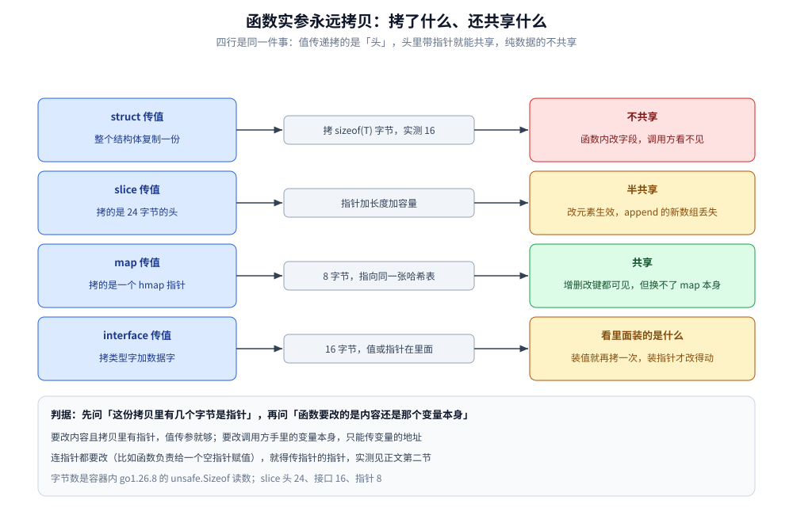
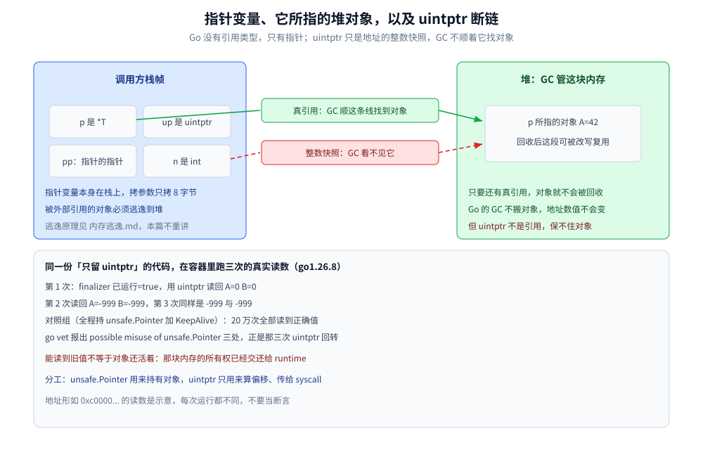

# 指针与引用

> 本篇覆盖 Go 的指针语义：`&` 与 `*`、`new(T)` 与 `&T{}` 的等价边界、值拷贝造成「改不到外面」的四种症状与判据、指针的比较与运算限制、取地址与逃逸的关系、nil 指针解引用，以及 `unsafe.Pointer` 与 `uintptr` 的分工。
>
> 内容整理自个人学习笔记，素材见 [素材清单.md](../../../素材清单.md)。

---

## 一、Go 有 C++ 那种引用吗？`&` 和 `*` 各做了什么？

**本节要点**：先钉死结论——**Go 没有引用类型，只有指针 + 值拷贝**。C++ 的 `T&` 那套「别名、不能为空、自动解引用」在 Go 里连语法都写不出来；`**T` 反而是合法且有用的。

### 1.1 没有引用类型：`&T` 当类型写就是语法错误

| 对比项 | C++ 的引用 `T&` | Go 的指针 `*T` |
|---|---|---|
| 能不能为空 | 不能 | 能，`nil` 是合法值 |
| 能不能重新绑定 | 不能 | 能，随便改 |
| 用的时候要不要显式解引用 | 不需要 | `*p` 显式，或 `p.字段` 自动 |

容器内 `go1.26.8` 实测「拿引用当类型写」的编译结果（`go build` 的 stderr 原文）：

```text
# exp/bad7
bad7/main.go:4:8: syntax error: unexpected &, expected type
# exp/bad8
bad8/main.go:3:14: syntax error: unexpected & in type declaration
```

前者是 `var r &int`，后者是 `type Alias = &int`。**`&` 只出现在表达式里（取地址），不是类型构造符。**

### 1.2 取地址、解引用与自动解引用

```go
a := 42
p := &a   // p 是 *int
pp := &p  // pp 是 **int
fmt.Printf("a=%d *p=%d **pp=%d ***(&pp)=%d\n", a, *p, **pp, ***&pp)
```

```text
1_& 与 * 与指针的指针 : a=42 *p=42 **pp=42 ***(&pp)=42
3_p.Name 与 (*p).Name 等价 : "via 显式解引用"
4_**User 逐级解引用 : (*pp).Name="via 显式解引用" (**&pp).Name="via 显式解引用"
```

后两行来自同一段对照代码：`q.Name = "via 指针选择器"` 紧跟 `(*q).Name = "via 显式解引用"`，最终值是后者——**`p.字段` 就是 `(*p).字段` 的语法糖，完全等价**，写哪种只是风格。

### 1.3 `new(T)` 与 `&T{}`：等价边界比想象中窄

`new(T)` 返回**指向 `T` 零值的 `*T`**。只对**能写复合字面量的类型**（struct / 数组 / slice / map）才有 `&T{}` 这个等价物；对 `int` 这类基础类型，`&int{}` 直接写不出来：

```text
# exp/bad3
bad3/main.go:4:7: invalid composite literal type int
```

实测两者都只保证「拿到一个非 nil、内容为零值的指针」：

```text
2_new(T) 与 &T{} : *n1=0(零值) *n2={Name: Age:0}(零值) 类型 *int *main.User
```

| 写法 | 能带初值吗 | 适用类型 | 典型用途 |
|---|---|---|---|
| `new(T)` | ❌ 只能零值 | 任意 `T` | 需要一个 `*int`、`*time.Time` 空壳 |
| `&T{字段: 值}` | ✅ | struct / 数组 / slice / map | 主流写法，构造即初始化 |
| `x := 0; &x` | 先赋后取 | 任意 `T` | 给基础类型造指针的替代写法 |

### 1.4 指针的指针：什么时候真的需要

不是炫技，而是**「要改的正是调用方手里那个指针本身」**时的唯一解：

```go
func badSingle(u *User) { u = &User{Name: "created"} } // 只改了形参副本
func lazyGet(dst **User) {
    if *dst == nil {
        *dst = &User{Name: "created"} // 改的是调用方那个变量
    }
}
```

```text
1_传 *T 但函数内重新赋值 : a==nil 仍然 true
2_传 **T 给被调函数改写 : b==nil false b=&{Name:created}
5_宽度实测 : sizeof(*User)=8 sizeof(User)=16 sizeof(**User)=8
```

`*T` 与 `**T` 都是 8 字节——**指针的宽度与所指对象无关**，多一层不更贵，只是更难读。C 接口里的 `void**` 参数在 Go 侧对应的就是 `**T`（或 `*unsafe.Pointer`），别为了少写一层而把「改指针」降级成「改内容」。链表插入里「找二级指针而不是找前驱节点」的经典技巧在 Go 里同样成立。

### 1.5 哪些东西不能取地址

`&` 要求操作数**可寻址（addressable）**。容器内实测三类非法形态：

```text
# exp/bad2
bad2/main.go:5:8: invalid operation: cannot take address of m["a"] (map index expression of type int)
# exp/bad4
bad4/main.go:6:8: invalid operation: cannot take address of f() (value of type int)
```

map 元素不可寻址是因为**它会随扩容搬迁**，取址等于留下悬空指针（见 [map.md](map.md) 第七节的追问）；函数返回值不可寻址是因为它是临时值。常量、`string` 的字节、`for range` 的循环变量同样取不了地址（最后这条在 [for-range.md](for-range.md) 有专门一节）。

### 延伸追问

- **`new` 会让对象一定逃逸到堆吗？** → 不一定，见第四节实测：决定权在「地址有没有交出去」，不在 `new`。
- **Go 里能不能说「传引用」？** → 口语能，语义不能。凡是说「传引用」的场合，实际都是「传值，但值是指针」或「值里含指针（slice / map / interface）」。
- **`**T` 能一直套下去吗？** → 语法上能（实测 `***(&pp)=42`），但三层以上是设计信号：应该改用「一个持有指针的结构体」来传。

---

## 二、函数实参永远拷贝——「改不到外面」的四种症状

**本节要点**：一条铁律（**实参进形参必然发生一次值拷贝**）+ 四种症状（struct、slice、map、interface）。症状不同，根因是同一句话：**拷贝出来的字节里有没有指针**。

### 2.1 判据：先数拷了多少字节，再看里面有没有指针

> 纯数据（struct 的值、数组）→ 全量复制，改了个寂寞；
> 含指针的头（slice 头、map、interface）→ 头被复制，头里的指针仍指向同一份底层数据；
> 指针（`*T`）→ 复制的只是地址，对象仍是同一个。

所以「改不到外面」只有两种真因：**① 拷的是纯数据；② 拷的是「头」，而你要改的正是头本身**（长度、指向），不是头所指的内容。



图怎么读：四行都是「左：调用方手里的东西 → 中：这次拷贝搬了多少字节 → 右：还共享不共享」。红色行（struct）改不到；两行黄色（slice、interface）是**半共享**——能改内容但改不了头；绿色行（map）几乎全共享，唯独换不掉 map 本身。

### 2.2 症状一：struct 传值

```go
func TouchStruct(u User)     { u.Name = "changed" }
func TouchStructPtr(u *User) { u.Name = "changed" }
```

```text
4a_struct 传值   : Name="origin"
4b_struct 传指针 : Name="changed"
```

### 2.3 症状二：slice 传值——改元素生效，append 丢失

这一条最容易被误当成「slice 是引用类型所以随便改」：

```go
func TouchSlice(s []int) {
    s[0] = 99          // 看得见：底层数组共享
    s = append(s, 4)   // 看不见：改的是形参这个头
}
```

```text
5a_slice 传值    : len=3 s=[99 2 3]
5b_传 *[]int     : len=4 s=[99 2 3 4]
```

`len` 仍是 3、`4` 没进来——**append 出来的新头没交回调用方**。要么传 `*[]int`（实测 5b），要么按 Go 的惯例用返回值交回：`s = append(s, 4)`（机制见 [切片.md](切片.md)）。

### 2.4 症状三：map 的 value 是 struct

```go
func TouchMap(m map[string]account) {
    a := m["k"]        // 取出来的是 value 的副本
    a.Balance += 100   // 改副本
}
```

```text
6a_map value 改字段 : Balance=1
6b_取副本后写回     : Balance=101
6c_value 换成指针   : Balance=101
```

`m` 本身是共享的（增删键调用方都看得见），但 `m[k]` 这个元素**不可寻址**，`&m[k]` 编译不过（原文见 1.5）。改法只有两条：取副本 → 改 → **写回**；或把 value 定义成 `*account`（6c）。

### 2.5 症状四：interface 里装的是值类型

```go
type box struct{ v int }

func (b box) SetVal(x int) { b.v = x } // 值接收者

type valSetter interface{ SetVal(int) }

func ViaSetter(s valSetter, x int) { s.SetVal(x) }
```

```text
7a_interface 装值 : b.v=1（SetVal 是值接收者，改的是接口里的副本）
7b_interface 装指针调同一个值接收者方法 : b.v=1（值接收者永远拷一份，装指针也救不回来）
7c_interface 装指针 + 指针接收者 : c.n=1
```

7b 是本节的关键：**接口里放指针 ≠ 方法能改到原对象**。只要接收者是值接收者，进方法那一刻照样复制。**要改必须同时满足两个条件**：装进接口的是 `*box`，且方法是指针接收者（7c）。

「值类型到底满不满足某个接口」由方法集规则决定，规则与实测在 [类型系统.md](类型系统.md) 第五节，本篇不重讲，只补一条症状层面的编译证据：

```text
# exp/bad6
bad6/main.go:15:6: cannot use c (variable of struct type counter) as incref value in argument to Use: counter does not implement incref (method Inc has pointer receiver)
```

### 2.6 那到底该传指针还是传值

| 该传指针 | 该传值 |
|---|---|
| 函数要修改调用方那个变量本身 | 小且不可变的数据（`int`、`bool`、小的 `[4]int`） |
| 结构体大，拷贝成本明显 | 语义上「拷贝才对」的值对象、DTO |
| 含不可拷贝字段（`sync.Mutex`、`sync.WaitGroup`） | 需要「各协程各一份」的隔离 |
| 要用 `nil` 表达「没有」 | 共享反而制造数据竞争的场景 |

⚠️ 含锁结构体传值会被 `go vet` 报 `copylocks`，这条比性能问题更硬，见 [类型系统.md](类型系统.md) 5.4 与 [线程安全.md](../并发编程/线程安全.md)。

### 延伸追问

- **为什么 `append` 的结果必须接回来？** → `append` 可能换一块底层数组，也可能只改长度；无论哪种，**新头只存在于被调函数的形参里**。
- **map 传进函数后 `delete` 生效吗？** → 生效。map 头里就一个 `hmap` 指针，增删改都作用在同一张表上；改不了的只是「让调用方换一张 map」。
- **返回大结构体是不是比返回指针贵？** → 是多拷一份，但这份拷贝留在栈上、返回即回收，**不产生堆分配**；返回指针看着省，却把对象推上堆、成本转给 GC（第四节）。

---

## 三、指针能比较、能运算吗？

**本节要点**：指针**可以** `==` / `!=`（比的是地址），**不可以**比大小、**不可以** `+1`；偏移计算是 `unsafe` 的地盘，Go 1.17 起有 `unsafe.Add`。

### 3.1 `==` 比的是地址，不是所指的值

```text
3_指针 == 比地址 : &x==&x → true
  值相同地址不同 : m1==m2 → false (*m1=5 *m2=5)
8_nil 指针可参与比较 : np==nil=true np!=nil=false
```

前两行分别是 `q1, q2 := &x, &x` 与两个各自 `new(int)`、内容都写成 5 的指针。**内容一模一样也不相等**。推论：**指针是可比较类型，所以能当 map 的 key、能进 `switch`**（map key 的类型限制见 [map.md](map.md) 第七节）。

### 3.2 比大小和指针算术一律非法

```text
# exp/bad5
bad5/main.go:6:8: invalid operation: &x < &y (operator < not defined on pointer)
# exp/bad1
bad1/main.go:6:7: invalid operation: p + 1 (mismatched types *int and untyped int)
```

这不是「暂时没实现」而是**刻意封死**：堆对象会被 GC 标记、栈会被复制移动，一旦允许按 C 的方式推算相邻元素地址，程序就会依赖根本不存在的地盘保证。遍历数组有 `range` 和 slice，不需要 `p+1`。

### 3.3 真要算偏移：`unsafe.Add`（Go 1.17 起）

`unsafe.Add(ptr, len)` 的语义是 `Pointer(uintptr(ptr) + uintptr(len))`，它把「绕 `uintptr` 一圈」这条合法路径封装成函数。容器内实测：

```go
type Row struct{ A, B, C int64 }

r := &Row{A: 11, B: 22, C: 33}
pB := unsafe.Add(unsafe.Pointer(r), unsafe.Offsetof(r.B))
fmt.Printf("期望 B=%d 实读=%d\n", r.B, *(*int64)(pB))
```

```text
1_宽度 : unsafe.Sizeof((*Row)(nil))=8 unsafe.Sizeof(uintptr(0))=8 unsafe.Sizeof(Row{})=24
2_unsafe.Add 读第二个字段 : 期望 B=22 实读=22
3_unsafe.Pointer 与 uintptr 打印出来同一个地址 : p=0x32c2ae926000 uintptr=0x32c2ae926000 相等=true
4_用 uintptr 做步长遍历数组（演示用，不保证安全）: 1 2 3 4
  用 unsafe.Add 遍历               : 1 2 3 4
```

⚠️ 第 3 行的地址数值（`0x32c2ae926000`）**每次运行都不同，只能当示意**；确定的是「两者数值相等」和「两种遍历都读出 1 2 3 4」。宽度那行是硬事实：指针和 `uintptr` 在 `linux/amd64` 上都是 8 字节。

`go doc unsafe.Pointer` 里与 3.2 呼应的一条限制（容器内原文，逐字抄）：

```text
Unlike in C, it is not valid to advance a pointer just beyond the end of its
original allocation:

    // INVALID: end points outside allocated space.
    var s thing
    end = unsafe.Pointer(uintptr(unsafe.Pointer(&s)) + unsafe.Sizeof(s))
```

**算出来的结果必须仍指在原对象内部**——C 里合法的「尾后指针」在 Go 里非法。

### 延伸追问

- **指针能排序吗？** → 不能直接用 `<`，也就不能按地址排序；要按顺序只能显式带下标。
- **两个变量的地址大小有规律吗？** → 没有可依赖的规律：栈、堆、全局区各有各的分配策略，别拿地址差判断「相邻」。
- **用了 `unsafe.Add` 就不算 `unsafe` 了？** → 不算。它只让写法符合合法模式，规则一条没松（见第六节）。

---

## 四、取地址是逃逸的头号诱因

**本节要点**：只讲**指针与逃逸的因果**。逃逸的定义、三条判定规则与五类场景已在 [内存逃逸.md](../运行时/内存逃逸.md) 第一、二节写透，这里**不重讲**，只补两件事：① 用 `-gcflags=-m` 把「取地址 → 逃逸」这条链钉成实测；② 说清「返回局部变量的指针为什么安全」。

### 4.1 一句话说清关系

> 值传参拷完就能忘 → 留在栈上；**把地址交出去（返回、存进全局、塞进 interface / channel / 闭包）→ 对象必须活得比这个栈帧久 → 逃逸到堆**。

所以「用指针」的真正代价不是那 8 字节的拷贝，而是**它往往顺手制造了一次堆分配和一份 GC 工作量**。

### 4.2 实测：同一份文件里的四种取地址写法

```go
func keep(v int) int { return v }
func onStack() int { x := 5; return keep(x) }            // 没取地址
func toHeap() *int { y := 7; p := &y; return p }         // 取了地址并交出去
func toHeap2() *T { return &T{A: 1} }                    // 复合字面量取地址，同理
func localPtrNotReturned() int { t := T{A: 3}; p := &t; return p.A } // 取地址但没出作用域
```

`go build -gcflags="-m -l" ./esc`（`-l` 关掉内联，输出才干净）的 stderr 原文，行号是容器内实际文件的行号：

```text
# exp/esc
esc/main.go:15:2: moved to heap: y
esc/main.go:21:9: &T{...} escapes to heap
esc/main.go:35:12: ... argument does not escape
esc/main.go:35:98: a escapes to heap
esc/main.go:35:101: *b escapes to heap
esc/main.go:35:106: c.A escapes to heap
esc/main.go:35:110: d escapes to heap
```

逐条对照，三件事同时成立：

| 函数 | 输出里有没有它 | 结论 |
|---|---|---|
| `toHeap`（`p := &y; return p`） | `moved to heap: y` | **取地址 + 交出去 = 逃逸** |
| `localPtrNotReturned`（`&t` 只在函数内用） | 一行都没有 | 取地址**本身**不必然逃逸 |
| `onStack` / `keep` | 一行都没有 | 没取地址，就没有这条诱因 |

后四行是 `fmt.Printf` 把值装箱进 `interface{}` 造成的逃逸（机制在 [接口.md](接口.md)）。不加 `-l` 时输出前面还会多一串 `can inline onStack` / `can inline toHeap`，逃逸行不变——**读 `-m` 前先想清楚内联会不会把函数抹平**（`-N -l` 组合见 [编译与gcflags.md](../工程实践/编译与gcflags.md)）。

想直接看到「是谁逼它上堆」，加一级 `-m -m`（原文）：

```text
esc/main.go:15:2: y escapes to heap in toHeap:
esc/main.go:15:2:   flow: p ← &y:
esc/main.go:15:2:     from &y (address-of) at esc/main.go:16:7
esc/main.go:15:2:     from p := &y (assign) at esc/main.go:16:4
esc/main.go:15:2: moved to heap: y
```

`flow: p ← &y` 这行把**取地址这个动作记进了因果链**——编译器给的证据，比任何经验法则都硬。

### 4.3 返回局部变量的指针是安全的（和 C 的分别）

C 里这是典型悬空指针：栈帧回收后那块内存随时被下一个调用覆盖。Go 不用担心，因为编译器**直接把变量搬到堆上**，实测这份代码跑通且读到的就是原值：

```text
返回局部变量指针真能读 : onStack=5 *toHeap=7 toHeap2.A=1 local=3
```

**代价是有的**：`y` 从「随栈帧免费回收」变成「等 GC 周期回收」。所以「随手返回局部变量指针」在 Go 里是**正确但不免费**的写法——需要暴露对象、需要 `nil` 语义、对象很大时才值这个价。小结构体（实测 `sizeof(User)=16`）传来传去该传值；热路径循环里反复 `&T{}` 会让 `allocs/op` 直接上升，改法是复用变量、传值或池化（[sync.Pool.md](../并发编程/sync.Pool.md)）。验证手段不是猜：改前改后各跑一次 `-gcflags=-m`，再看 benchmark 的 `allocs/op`。

### 延伸追问

- **`new(T)` 一定逃逸吗？** → 不。`new` 只是「要一个零值指针」，决定权在地址有没有交出去。
- **逃逸结论会随版本变吗？** → 会，它是编译期静态分析。所以本篇读数全部注明来自容器内 `go1.26.8`（宿主机 1.26.5，实测一律以容器为准）。

---

## 五、nil 指针解引用会发生什么？

**本节要点**：`nil` 指针**不是**「不能碰」，而是「**不能解引用**」。比较、当 map key、调不访问字段的方法都合法；一旦读写字段就是 `SIGSEGV`，而 panic 的动态类型是 `error`，正好和 `errors` 那套判定接上（见 [错误处理.md](错误处理.md) 第六节）。

### 5.1 真实 panic 原文与栈

```go
var p *Conf
fmt.Println("解引用之前：p == nil ?", p == nil) // true，这一步完全合法
fmt.Println(p.Addr)                              // 这一行炸
```

容器内 `go run` 的输出（stderr 原文）：

```text
解引用之前：p == nil ? true
panic: runtime error: invalid memory address or nil pointer dereference
[signal SIGSEGV: segmentation violation code=0x1 addr=0x0 pc=0x49e1ad]

goroutine 1 [running]:
main.main()
	/w/.workbuddy/tmp/exp/pointers/nilp/main.go:13 +0x6d
exit status 2
```

三个读数：**`addr=0x0`**（访问的就是地址 0，正是 `nil` 的字面值）、**`exit status 2`**（panic 的退出码）、**栈顶直接是出错行** `main.go:13`。`pc=0x49e1ad` 这类每次构建都可能变，不必记。

### 5.2 nil 指针合法的四件事、非法的那一件

```go
type Node struct{ Name string; next *Node } // next 小写：仅演示同包内引用

func (n *Node) Describe() string {
    if n == nil {
        return "nil 节点：方法照样能调，因为没解引用"
    }
    return "节点 " + n.Name
}

func (n *Node) NameLen() int { return len(n.Name) } // 访问字段 → 隐式解引用

var nilNode *Node
fmt.Println(nilNode == nil)          // ① 比较：合法
m := map[*Node]int{nil: 999}         // ② 当 key：合法
nilNode.Describe()                   // ③ 调方法：合法
nilNode.NameLen()                    // ④ ❌ panic
```

```text
1_nil 接收者调不碰字段的方法 : "nil 节点：方法照样能调，因为没解引用"
2_nil 指针当 map key : m[nil]=999，m[kx]=7
3_nil 指针参与比较 : nil==nilNode → true
4_nil 接收者访问字段 : panic=runtime error: invalid memory address or nil pointer dereference
```

③ 常被误认为「nil 调方法一定 panic」：其实**方法只是带接收者的函数**，`n == nil` 这个检查完全有效。真正炸的时机是**访问字段**（隐式 `(*n).字段`）——实测第 4 行就是 `NameLen()`。

### 5.3 它和「nil 接口」不是一回事

`var p *Conf` 是**指针为 nil**；`var err error = (*Conf)(nil)` 是**接口非 nil、里面装的数据字是 nil**。后者坑更深（`err != nil` 恒成立、调方法才 panic），已由 [接口.md](接口.md) 第三节整节实测讲透，本篇不重复。记住分工：**判「有没有对象」看指针，判「有没有错误」看接口**。各类 nil 能不能直接用的对照表在 [基础类型与零值.md](基础类型与零值.md) 第三节。

顺带一条量级差别：解引用 nil 是**普通 panic**，`defer + recover` 能接住（实测接住的原文见 5.2 第 4 行与 [defer.md](defer.md) 2.5）；`fatal error: concurrent map writes` 一类**接不住**，进程直接退出（见 [map.md](map.md) 8.4）。

### 延伸追问

- **为什么不在编译期拦住 nil 解引用？** → 编译器无法证明运行期一定非 nil，Go 选择「带检查，出错就 panic」，代价是一次判空分支。
- **`*T` 的 nil 和 `[]T` 的 nil 一样吗？** → 都能 `== nil`，但 slice 的 nil 可以 `len/append/range`，指针的 nil 一解引用就 panic。
- **怎么减少 nil panic？** → 构造函数负责填满字段；对外类型别留「必须先初始化才能用」的空壳；测试专门喂 `nil` 走一遍路径。

---

## 六、`unsafe.Pointer` 与 `uintptr`：分工、合法模式与 GC 保活

**本节要点**：两者同宽 8 字节，但一个是**引用**、一个是**整数**——GC 只认引用。这是本节唯一要记住的东西，其余全是它的推论。

### 6.1 区别对照

| 维度 | `unsafe.Pointer` | `uintptr` |
|---|---|---|
| 本质 | 指向任意类型的指针（`type Pointer *ArbitraryType`） | 无符号整数，宽度同指针 |
| GC 是否把它当引用 | ✅ 会顺着它标记、保活对象 | ❌ 完全看不见 |
| 能不能算术 | 不能（见 3.2） | 能，随便加 |
| 合法用途 | 持有对象、跨类型重解读 | 打印地址、算偏移、传给 `syscall` |

宽度实测见 3.3：`unsafe.Sizeof((*Row)(nil))=8`、`unsafe.Sizeof(uintptr(0))=8`。**同宽是「互转看起来无损」的根源，也是最容易骗人的地方。**

### 6.2 官方给的四种特殊操作与五种合法模式

容器内 `go doc unsafe.Pointer` 原文先列了 `Pointer` 独有的**四种特殊操作**：

```text
  - A pointer value of any type can be converted to a Pointer.
  - A Pointer can be converted to a pointer value of any type.
  - A uintptr can be converted to a Pointer.
  - A Pointer can be converted to a uintptr.
```

紧接着一句定调：`Pointer therefore allows a program to defeat the type system and read and write arbitrary memory. It should be used with extreme care.` 以及 **`The following patterns involving Pointer are valid. Code not using these patterns is likely to be invalid today or to become invalid in the future.`**

**「四条特殊操作」常被误记成「四条规则」**：文档里编号的合法模式是 **(1)～(5) 五种**（`go1.26.8` 的文档实测如此）。

| 模式 | 文档原意 | 落地写法 |
|---|---|---|
| (1) `*T1` → Pointer → `*T2` | `T2` 不大于 `T1` 且布局等价时才允许重解读（例：`math.Float64bits`） | 跨类型读同一块内存 |
| (2) Pointer → uintptr（**不许转回**） | 转出来只为**打印**；原文「A uintptr is an integer, not a reference」 | `fmt.Printf("%p", p)` |
| (3) Pointer → uintptr → 算术 → 转回 | **必须写在同一个表达式里**，结果仍指在原对象内 | `unsafe.Pointer(uintptr(p) + offset)`，或直接用 `unsafe.Add` |
| (4) 传给 `syscall.Syscall` 一类汇编实现的函数 | 转换必须出现在**调用表达式内部**，编译器才承诺调用期间保住对象 | `Syscall(SYS_READ, uintptr(fd), uintptr(unsafe.Pointer(p)), n)` |
| (5) `reflect.Value.Pointer` / `UnsafeAddr` 的返回值 | 它返回 `uintptr`，**必须立刻在同一表达式里转成 Pointer** | `(*int)(unsafe.Pointer(reflect.ValueOf(new(int)).Pointer()))` |

模式 (3) 里那句警告是整节的题眼（原文）：

```text
    // INVALID: uintptr cannot be stored in variable
    // before conversion back to Pointer.
    u := uintptr(p)
    p = unsafe.Pointer(u + offset)
```

### 6.3 实测：`uintptr` 不保活，而「读到旧值」毫无保证力

先看对照组——**20 万次全部读到正确值**，这恰恰是最危险的表象：

```text
1_只留 uintptr : trials=200000 读到原值=200000 读到别的值=0
3_全程持 unsafe.Pointer : trials=200000 正确=200000 错误=0
```

正确值不等于安全。改用 `finalizer` 直接证明「对象已被回收，而 `uintptr` 还握在手里」——同一份代码在容器里连跑三次，读数各不相同：

```text
--run 1--
finalizer 已运行=true ; 用 uintptr 读回 A=0 B=0
--run 2--
finalizer 已运行=true ; 用 uintptr 读回 A=-999 B=-999
--run 3--
finalizer 已运行=true ; 用 uintptr 读回 A=-999 B=-999
```

`-999` 是 finalizer 改写的，`0` 说明那块内存已被清零后交给别的分配。**地址数值没变（Go 的 GC 不搬对象），但「地址还在」和「对象还属于你」是两件事**。对照组里 `unsafe.Pointer` 全程被变量持有、并以 `runtime.KeepAlive` 收尾，同尺寸分配压力下 20 万次无一出错——差别只在「有没有引用」。



图怎么读：左边蓝框是栈帧，`p`（真引用）和 `up`（`uintptr`）都是 8 字节、数值相同，区别只在中间两个标签——绿色「真引用：GC 顺这条线找到对象」，红色虚线「整数快照：GC 看不见它」。右边绿框是堆对象，底部灰框把三次实跑的读数（`0/0`、`-999/-999`、`-999/-999`）与对照组 20 万次全对都列了出来。

### 6.4 `go vet` 会抓，但沉默不等于合法

上面那份错误写法被 `go vet` 逐处点出来了（容器内原文）：

```text
ugc/main.go:42:15: possible misuse of unsafe.Pointer
ugc/main.go:61:15: possible misuse of unsafe.Pointer
ugc/main.go:90:17: possible misuse of unsafe.Pointer
```

`go doc` 也说了另一面：silence from `go vet` is not a guarantee that the code is valid。所以能不用 `unsafe` 就别用——按字节读数据有 `encoding/binary`，反射有 `reflect`，减少拷贝有 `unsafe` 之外的路子（见 [零拷贝.md](../运行时/零拷贝.md)）。

### 延伸追问

- **`uintptr` 一无是处吗？** → 不是。打印地址、`syscall` 传参、与 C 的 `size_t` 对齐这类**纯数值**场景正是它的用途，见 [基础类型与零值.md](基础类型与零值.md) 第 2.3 节。
- **GC 现在不搬对象，是不是就能存 `uintptr`？** → 不能。「不搬」不等于「不回收」；而且文档明说模式之外的代码「可能今天无效，也可能将来失效」，GC 一旦改成移动式，存 `uintptr` 的代码立刻错。
- **`%p` 的地址能当对象身份用吗？** → 同一对象内可以，但拿它当引用用就落进模式 (2) 禁止的那一步。要比身份直接比 `*T`。

---

## 使用：指针用法的取舍清单

| 我要做的事 | 该写什么 | 依据 |
|---|---|---|
| 函数里要改调用方的变量 | 传那个变量的地址 `*T` | 2.2 实测 4b |
| 函数里要改调用方**手里的指针**（延迟初始化） | 传 `**T` | 1.4 实测 |
| 想让调用方换掉整个 slice / map | 用返回值交回 | 2.3、2.4 |
| 表示「可能没有」 | `*T` + `nil` | 第五节 |
| 传大对象又不想拷 | `*T`，并确认它没因此逃逸（跑 `-m`） | 第四节 |
| 结构体含 `sync.Mutex` / `WaitGroup` | **只能**指针传，方法统一指针接收者 | 2.6 + [类型系统.md](类型系统.md) 5.4 |
| 按偏移读另一类型的内存 | `unsafe.Add`，模式 (3)，并过 `go vet` | 3.3、6.2 |

指针真正的用武之地是**用指针串结构**：链表的 `next`、树的左右孩子、`map[id]*Node` 这类所有权关系，都靠「头里那个指针」成立。实测一份两节点链表：

```text
5_链表就是指针串起来的节点 : p.Name="a" p.next.Name="b" p.next.next=true
```

至于「什么时候该用连续内存（数组）而不是指针」——缓存局部性、序列化代价这些判据属于「数据怎么存」，见 [数据结构目录导读](../../../02-计算机基础/数据结构/README.md) 与 [数组与链表.md](../../../02-计算机基础/数据结构/线性结构/数组与链表.md)，本篇不展开。

## 延伸追问

- **Go 为什么不留一个引用类型？** → 引用类型的价值是「必须绑定、语法上看不出它改了原对象」；Go 的取舍是**让「会改原对象」在签名里显式可见**（`*T`），把隐式性去掉。
- **`&T{}` 和 `new(T)` 选哪个？** → 需要初值或 struct 就 `&T{...}`；只要一个零值指针（例如给 `*int` 字段赋值）用 `new(T)` 更短。两者都走逃逸分析，不存在「谁更省」。
- **指针传参一定快过值传参吗？** → 大对象上是；小对象上可能反而慢——要多一次间接寻址，而且更容易触发逃逸，把成本推给 GC。
- **为什么 `*T` 不能比较所指内容？** → Go 的 `==` 只作用于操作数本身；比内容要显式 `*p1 == *p2`（前提 `T` 可比较）。隐式深比较会掩盖 nil 问题。
- **能不能拿 `uintptr` 当对象池的 key？** → 不能。对象回收后同地址会复用给别的对象，key 会串；池化走 `sync.Pool`。
- **逃逸和悬空指针是一回事吗？** → 逃逸正是编译器**为了不制造悬空指针**而做的处理，见 [内存逃逸.md](../运行时/内存逃逸.md) 第 2.3 节那两条「内存分配基本原则」。
- **`unsafe` 代码要额外检查什么？** → ① 写法必须原样符合 6.2 的某个模式；② 过 `go vet`；③ 开 checkptr（`go build -gcflags=all=-d=checkptr`）或 `-race` 跑一遍；④ 指针宽度按目标平台实测，别照抄本篇的 8。

---

## 关联

- [内存逃逸.md](../运行时/内存逃逸.md) — 取地址为何是逃逸头号诱因：原理在彼、证据在此
- [编译与gcflags.md](../工程实践/编译与gcflags.md) — `-m` / `-m -m` / `-N -l` 输出的判读
- [类型系统.md](类型系统.md) — 方法集与接收者规则（本篇只给症状，规则在彼）
- [接口.md](接口.md) — nil 指针装进接口后 `err != nil` 恒成立的坑
- [基础类型与零值.md](基础类型与零值.md) — 各类 nil 的可用性对照、`uintptr` 的定位
- [切片.md](切片.md) — 症状二的完整机制：头的三个字段与 append 换底
- [map.md](map.md) — 元素为何不可寻址、并发写为何是 fatal
- [for-range.md](for-range.md) — 循环变量取地址这一类「不可寻址」陷阱
- [struct与tag.md](struct与tag.md) — 字段偏移与对齐，`unsafe.Offsetof` 的实测
- [函数调用与栈.md](函数调用与栈.md) — 实参拷贝发生在栈帧的哪一部分
- [defer.md](defer.md) — defer 与 recover 的语言机制，错误侧展开见 [错误处理.md](错误处理.md)
- [sync.Pool.md](../并发编程/sync.Pool.md) — 想靠复用对象压逃逸时的正解
- [线程安全.md](../并发编程/线程安全.md) — 含锁结构体为什么禁止值拷贝
- [零拷贝.md](../运行时/零拷贝.md) — `unsafe` 之外的减少拷贝手段
- [数组与链表.md](../../../02-计算机基础/数据结构/线性结构/数组与链表.md) — 指针串结构的形态与代价
- [错误处理.md](错误处理.md) — 姊妹篇：`runtime.Error` 与 nil 解引用 panic 的判定接点

> 反向引用（本篇被下列文档引到）：[错误处理.md](错误处理.md)
