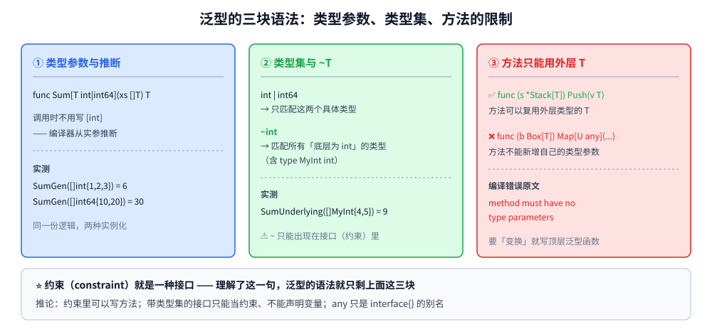
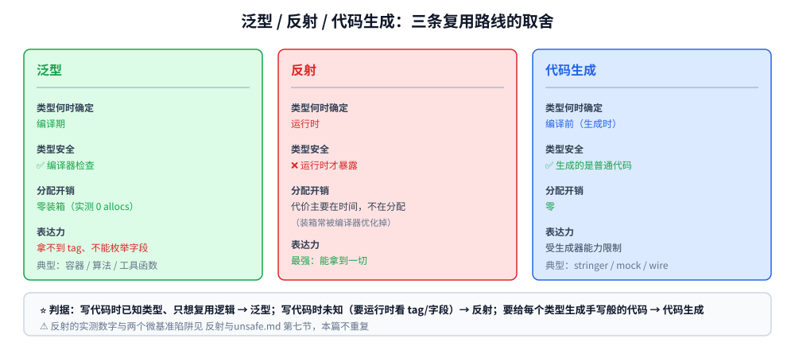

# 泛型

> 本篇覆盖 Go 泛型（1.18+）的**完整语法与取舍**：类型参数与推断、**约束就是一种接口**、
> `~T` 与类型集、`comparable`、**泛型类型上的方法**（以及为什么方法不能再加类型参数）、
> 泛型相对 `interface{}` 的**分配代价实测**、什么时候**不该**用泛型，以及泛型 / 反射 / 代码生成三条路线的判据。
> ⭐ [类型系统.md](类型系统.md) 第九节有泛型的引子（约 25 行），本篇是它的展开版。
>
> 内容整理自个人学习笔记，实测为容器 `golang:1.26-alpine`（go1.26.8 linux/amd64），素材见 [素材清单.md](../../../素材清单.md)。

---

## 一、泛型到底解决什么问题

**本节要点**：泛型解决的是**"同一份逻辑、多种类型"**这个老问题。在它之前，Go 只有两条路，
而且都要付代价 —— 判据就是"你愿不愿意付这个代价"。

### 1.1 三"复用"的代价

| 路线 | 怎么写 | 代价 |
|---|---|---|
| **复制粘贴** | 为 `int` / `int64` / `string` 各写一遍 | 维护成本，改一处要改 N 处 |
| **`interface{}`** | 参数收 `any`，函数体内断言 | **装箱分配** + 丢失编译期类型检查（实测见 3.1） |
| **反射** | `reflect` 在运行时看类型 | 最慢、最不安全（错误要等运行时才暴露） |
| **泛型** | `[T constraint]` | 编译期实例化，零装箱；✅ 但**有它自己的限制**（见第三节） |

⭐ 判据只有一条：**你的函数是不是"对多种类型做同一件事"**。
是 → 泛型；如果只有一两种类型、且逻辑本身会因类型而分叉，泛型反而让代码更难读。

### 1.2 一个必须先想清楚的前提

泛型**不是**"让 Go 变成 Java/C++ 的模板"。它有两个被刻意保留的限制：

1. **没有模板特化**（不能为特定类型写一份特殊实现）；
2. **方法不能引入自己的类型参数**（见 2.6）—— 这个限制直接决定了"泛型容器的方法集能长什么样"。

---

## 二、语法：类型参数、约束与类型集

**本节要点**：约束（constraint）**就是一种接口类型**。理解了这一句，泛型的语法就只剩下三件小事。

### 2.1 类型参数与推断

```go
// 类型集写法：三个具体类型的并集
func SumGen[T int | int64 | MyInt](xs []T) T {
	var s T
	for _, x := range xs {
		s += x
	}
	return s
}
```

实测（容器 go1.26.8）：

```text
=========== 实验一：类型推断与类型集 ===========
SumGen([]int{1,2,3})      = 6   ← 不用写 SumGen[int]，编译器能推断
SumGen([]int64{...})      = 30   ← 同一个函数、另一种实例化
SumGen([]MyInt{...})      = 9   ← MyInt 在类型集里
```

⭐ 调用时**不用写 `[int]`** —— 编译器从实参推断。只在推断不出来时（比如返回值需要指定）才显式写。

### 2.2 约束就是接口

```go
// 下面两种写法是同一件事：
func F[T io.Reader](r T)      {} // 约束用接口类型
func G[T any](v T)            {} // any = interface{} 的别名

// 自定义约束也是接口
type Number interface {
	~int | ~int64 | ~float64 // ⚠️ 类型集只能出现在接口里
}
```

⭐ 三条推论（都由"约束是接口"这一句导出）：

1. **约束里可以写方法**（`interface{ String() string }`）—— 满足性由编译器检查；
2. **`interface{ ~int }` 这种带类型集的接口，只能当约束用**，不能当普通接口类型声明变量；
3. **`any` 是 `interface{}` 的别名**，不是新类型（详见 [类型系统.md](类型系统.md) 第一节）。

### 2.3 `~T`：放行"底层类型相同"的自定义类型

```go
// 不用 ~：类型集里必须逐个列出具体类型
func SumGen[T int | int64 | MyInt](xs []T) T { ... }

// 用 ~：放行所有「底层类型是 int」的类型
func SumUnderlying[T ~int](xs []T) T { ... }
```

实测：

```text
=========== 实验二：~T 允许「底层类型相同」的自定义类型 ===========
SumUnderlying([]MyInt{4,5}) = 9   ← MyInt 不在类型集字面里，但 ~int 放行
SumUnderlying([]int{4,5})   = 9
```

⭐ **`~int` 的含义是"底层类型为 int 的所有类型"** —— 包括 `type MyInt int`、也包括 `int` 本身。

⚠️ `~` 的三条限制：

1. **`~` 只能出现在接口（约束）里**，不能写在别处；
2. **`~T` 的 T 必须是一个类型，且它的底层类型要能"被表示"** —— 把命名 struct 直接套 `~` 会报错（见第四节第三条）；
3. **类型集里不能有带方法的接口**（`~int | fmt.Stringer` 是非法的）。

### 2.4 `comparable`：预声明约束

```go
func Contains[T comparable](xs []T, v T) bool {
	for _, x := range xs {
		if x == v { // ⭐ 只有 comparable 才保证 == 可用
			return true
		}
	}
	return false
}
```

实测：

```text
=========== 实验三：comparable 约束 ===========
Contains([]int{1,2,3}, 2)        = true
Contains([]string{"a","b"}, "c") = false
```

⚠️ 用了不可比较的类型去实例化，编译期就报错（原文见第四节）。

⭐ **判据**：只要函数体里用了 `==` / `!=` / 当 map 的 key，约束就必须带 `comparable`。

### 2.5 泛型类型与它的方法

```go
type Stack[T any] struct{ items []T }

func (s *Stack[T]) Push(v T) { s.items = append(s.items, v) }
func (s *Stack[T]) Len() int { return len(s.items) }
func (s *Stack[T]) At(i int) T { return s.items[i] }
```

实测：

```text
=========== 实验四：泛型类型带方法 ===========
Stack[string]：Len=2 At(0)="first"
```

⭐ 方法**可以**使用外层类型的 `T`（`Push(v T)` 合法），
但**不能**引入自己的类型参数（下一条）。

### 2.6 ⚠️ 方法不能有自己的类型参数

```go
func (b Box[T]) Map[U any](f func(T) U) Box[U] { ... } // ❌
```

```text
bad1/main.go:6:20: syntax error: method must have no type parameters
```

⭐ 这是泛型最常被撞到的墙。想要"容器变换"（`Box[T] → Box[U]`），只能写成**泛型函数**：

```go
func MapBox[T, U any](b Box[T], f func(T) U) Box[U] { ... } // ✅
```



---

## 三、泛型的代价与限制

**本节要点**：泛型不是免费的午餐。它有明确的性能收益，也有明确的表达力上限。

### 3.1 分配代价：泛型 vs `interface{}`

实测（对 1000 个 `int` 求和；值都 > 256，避开 Go 对小整数的装箱缓存）：

```text
=========== B. 泛型 vs interface{} 的分配代价 ===========
  ⚠️ 只取 B/op 与 allocs/op（这两个是确定值）；ns/op 随机器波动，不列
  BenchmarkSumGeneric-4  0 B/op  0 allocs/op
  BenchmarkSumInterface-4  24384 B/op  1001 allocs/op
```

⭐ 差距的来源只有一件事：**`[]int` 装箱成 `[]any` 时，每个元素都要单独分配一次**（1000 次），
而泛型版本直接在 `[]int` 上算，**零分配**。

⚠️ 三条必须说清的细节：

1. **这 1001 次分配里，1000 次是"装箱"、1 次是 `[]any` 本身** —— 所以判据是：
   **热点路径上如果有大量 `any`/`interface{}` 中转，换成泛型能直接把分配打掉**；
2. **小整数（0~255）的装箱会被 Go 的 `staticuint64s` 缓存消掉** —— 造实验数据时如果不避开，
   会测出"接口版也不分配"的假结果；
3. **时间（ns/op）这里没给**，因为它随机器负载波动；做前后对比时**优先看 `B/op` 与 `allocs/op`**
   （口径见 [pprof性能分析.md](../运行时/pprof性能分析.md) 第二节）。

### 3.2 什么时候**不该**用泛型

实测对照：

```text
=========== 实验六：⭐ 什么时候不该用泛型 ===========
42
42
  → PrintAny[T any](v T) 与 PrintIface(v any) 在这里完全等价：
    函数体既没做类型相关操作、也没保存 T，上泛型只是多写一对 []
```

⭐⭐ 判据（这是本篇最实用的一条）：

> **如果函数体里既没有用 `T` 做类型相关的操作、也没有把 `T` 存进某个结构，**
> **那么 `[T any]` 参数的唯一作用就是让你多写一对方括号 —— 这时直接用 `any`。**

另外三种"不该上泛型"的情形：

| 情形 | 为什么 |
|---|---|
| **逻辑会因类型分叉**（`switch x.(type)`） | 那已经是反射/断言的场景，泛型帮不上忙 |
| **需要为个别类型写特殊实现** | Go **没有模板特化**，只能拆成多个函数 |
| **只有一两种固定类型** | 泛型带来的实例化与阅读成本 > 收益 |

### 3.3 泛型 / 反射 / 代码生成 三条路线的判据

| | 泛型 | 反射 | 代码生成 |
|---|---|---|---|
| **类型信息在什么时候确定** | **编译期** | 运行时 | 编译前（生成时） |
| **类型安全** | ✅ 编译期检查 | ❌ 运行时才暴露 | ✅ 生成的代码是普通代码 |
| **分配开销** | **零装箱** | 有装箱 + 查表 | 零 |
| **表达力** | 受约束限制（拿不到 tag、不能枚举字段） | **最强**（能拿到一切） | 受生成器能力限制 |
| **典型用途** | 容器 / 算法 / 工具函数 | 序列化、ORM、配置绑定 | `stringer`、mock、wire |

⭐ 一句话判据：

```text
类型在写代码时已知，只是想复用逻辑 → 泛型
类型在写代码时未知（要运行时看 tag / 字段） → 反射
要为每个类型生成一份"看起来是手写的"代码 → 代码生成
```

⚠️ **反射的实测数字不在本篇重复** —— 见 [反射与unsafe.md](../运行时/反射与unsafe.md) 第七节
（"反射慢多少？实测区间与两个微基准陷阱"）。
本篇只补一个实测观察：**`reflect.ValueOf` 的装箱常被编译器优化掉**，
导致基准里测出来是 `0 allocs/op` —— 所以**反射的代价主要在时间，不在分配**，
不能用分配数去论证"反射贵"。



### 3.4 还有一个代价：二进制体积与编译时间

泛型函数会为**每一组不同的类型实参**生成一份实例（Go 采用 GC shape stencil：
相同"内存形状"的类型共享一份代码，指针类类型再共享一份）。

⚠️ 后果：

- **代码膨胀**：给 20 种类型用同一个泛型函数，二进制里会有多份实例；
- **编译变慢**：实例化需要额外工作。

⭐ 判据：**热点路径 / 通用容器用泛型很值**；
但如果只是给两三个类型写工具函数，简单复制或走 `any` 反而更轻。

---

## 四、三类编译错误原文

**本节要点**：这三条是撞得最多的，而且错误信息都很短 —— 记住原文能省很多时间。

```text
--- 方法带自己的类型参数 ---
bad1/main.go:6:20: syntax error: method must have no type parameters

--- 用不可比较的类型实例化 comparable 约束 ---
bad2/main.go:14:11: F does not satisfy comparable

--- ~ 用在命名 struct 上 ---
bad3/main.go:7:21: invalid use of ~ (underlying type of MyStruct is struct{A int})
```

逐条说明：

1. **`method must have no type parameters`** —— 想给泛型类型写"变换方法"时必撞（解法见 2.6）；
2. **`F does not satisfy comparable`** —— `F` 含 slice 字段所以不可比较；
   修法是改用 `slices.IndexFunc` + 自定义相等函数，或让约束放宽成 `any` 并传入比较函数；
3. **`invalid use of ~`** —— `~MyStruct` 里 `MyStruct` 的底层类型是 `struct{A int}` 而不是它自己，
   编译器会直接把它的底层类型打在错误信息里。

⚠️ 另外一类常见的"错误"其实来自 **`-lang` 门控**：`go.mod` 里 `go` 行低于 1.18 时写泛型会报
`type parameter requires go1.18 or later` —— 判据与原文见 [类型系统.md](类型系统.md) 第 9.1 节。

---

## 使用：一份可以抄的泛型工具集

**本节要点**：把上面所有判据收成几个能直接用的函数。

```go
package g

import (
	"sort"
)

// Number：用 ~ 放行所有底层为这些数值类型的自定义类型
type Number interface {
	~int | ~int8 | ~int16 | ~int32 | ~int64 |
		~uint | ~uint8 | ~uint16 | ~uint32 | ~uint64 | ~uintptr |
		~float32 | ~float64
}

// Sum：对任意数值切片求和（零装箱）
func Sum[T Number](xs []T) T {
	var s T
	for _, x := range xs {
		s += x
	}
	return s
}

// Max：⚠️ 用 < 比较，所以约束里不能只写 comparable
func Max[T ~int | ~int64 | ~float64](xs []T) (T, bool) {
	if len(xs) == 0 {
		var z T
		return z, false
	}
	m := xs[0]
	for _, x := range xs[1:] {
		if x > m {
			m = x
		}
	}
	return m, true
}

// Keys：两个类型参数；⚠️ map 遍历顺序随机，需要稳定顺序时自己排序
func Keys[K comparable, V any](m map[K]V) []K {
	out := make([]K, 0, len(m))
	for k := range m {
		out = append(out, k)
	}
	return out
}

func SortedKeys[K comparable, V any](m map[K]V, less func(a, b K) bool) []K {
	ks := Keys(m)
	sort.Slice(ks, func(i, j int) bool { return less(ks[i], ks[j]) })
	return ks
}

// Contains：用到 ==，约束必须是 comparable
func Contains[T comparable](xs []T, v T) bool {
	for _, x := range xs {
		if x == v {
			return true
		}
	}
	return false
}

// Print：⭐ 反例 —— 函数体没用到 T 的任何类型信息，
//        这种场合 [T any] 纯属多写一对方括号，直接用 any 更好
// func Print[T any](v T) { fmt.Println(v) }   // ❌ 不要这样
func Print(v any) { println(v) } // ✅ 这样
```

**五条可以固化进团队规范的**：

1. **约束优先用 `~`**（放行自定义类型），别把具体类型一个个列进类型集；
2. **用到 `==` / 当 map key 就加 `comparable`**，用到 `<` `>` 就要用有序类型集（`comparable` 不够）；
3. **方法不能带类型参数** —— 需要"变换"就写成顶层泛型函数；
4. **别给"没用到 T 的函数"上泛型**（3.2 实测）—— 那是 `any` 的活；
5. **热点路径用泛型替代 `[]any` 中转**（3.1 实测：1001 allocs → 0）。

---

## 延伸追问

- **泛型的约束到底是什么类型？** → **就是接口**。所以接口的方法集、满足性规则全都适用；
  带类型集的接口（`interface{ ~int }`）只能当约束用，不能声明变量。
- **`~int` 和 `int` 在约束里有什么区别？** → `int` 只匹配 `int` 本身；
  `~int` 匹配**底层类型为 int 的所有类型**（实测：`SumUnderlying([]MyInt{4,5})` 通过，2.3）。
- **为什么我的方法加不了类型参数？** → Go 明确规定 `method must have no type parameters`（2.6 原文）。
  想要 `Box[T] → Box[U]` 就写成顶层函数 `MapBox[T, U any]`。
- **泛型比 `interface{}` 快在哪？** → **分配**：实测对 1000 个元素求和，泛型 `0 allocs/op`、
  接口版 `1001 allocs/op`（3.1）。⚠️ 差异主要来自"装箱"，不是"调用"。
- **为什么我测出来接口版也不分配？** → 你可能用了 0~255 的小整数 —— Go 有 `staticuint64s` 缓存，
  它们的装箱不分配。造数据时用 > 256 的值。
- **反射版测出来 `0 allocs/op`，是不是反射不慢？** → 不是。
  `reflect.ValueOf` 的装箱常被编译器优化掉，**反射的代价主要在时间**；
  实测数字见 [反射与unsafe.md](../运行时/反射与unsafe.md) 第七节。
- **什么时候不该用泛型？** → 函数体没用到 `T` 的类型信息、逻辑会因类型分叉、需要为个别类型特化 —— 三种都是（3.2）。
- **泛型会让二进制变大吗？** → 会。每个"类型实参组"会生成一份实例（Go 用 GC shape stencil 做了部分共享），
  所以别给几十种类型滥用同一个泛型函数（3.4）。

## 关联

- [类型系统.md](类型系统.md) — **引子所在**：第九节第 9.2 有泛型的最小示例与 `-lang` 门控判据（本篇是它的展开版）
- [接口.md](接口.md) — 约束就是接口：方法集、满足性、`iface`/`eface` 的布局
- [反射与unsafe.md](../运行时/反射与unsafe.md) — **反射侧对照**：三条反射法则、反射为什么慢（第七节实测）、什么时候不该用反射
- [pprof性能分析.md](../运行时/pprof性能分析.md) — 本篇 3.1 的基准口径（`B/op` / `allocs/op` 为什么比 `ns/op` 稳）
- [测试与Mock.md](../工程实践/测试与Mock.md) — `go test -bench` 的旗标与两个微基准陷阱
- [基础类型与零值.md](基础类型与零值.md) — `any` 与 `interface{}` 的别名关系、零值语义
- [README.md](../README.md) — 本目录导读
- [素材清单.md](../../../素材清单.md) — 素材来源登记
