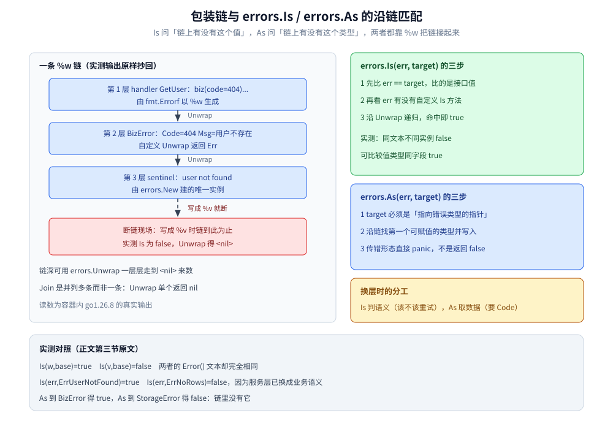
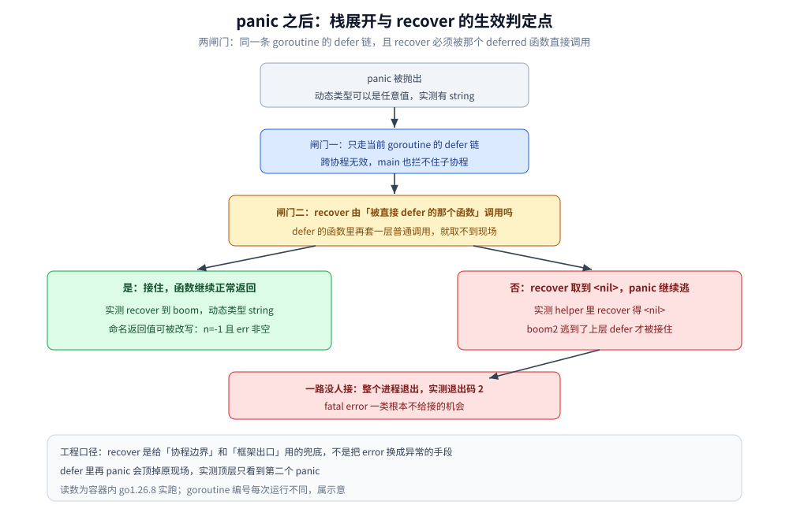

# 错误处理

> `error` 作为返回值的完整链路：接口与 nil 判定、`%w` 包装、`errors.Is` / `As` / `Unwrap` / `Join` 的匹配语义、哨兵错误与类型错误的取舍、panic 与 recover 的两道闸门与拦不住的 `fatal error`，以及分层项目里"谁处理谁打日志"的落地规矩。
>
> 内容整理自个人学习笔记，素材见 [素材清单.md](../../../素材清单.md)。
>
> ⚠️ 本篇全部读数来自容器 `golang:1.26-alpine`（`go version go1.26.8 linux/amd64`）真跑；编译错误原文同样出自该容器的 `go build` stderr。

---

## 一、Go 为什么把错误做成值，而不是异常？

**本节要点**：`error` 只是一个内置接口，"错误是值"决定了它**能被赋值、能被包装、能被聚合、能被单测断言**，也决定了控制流必须写在明面上。`panic` 是另一套机制，不要当异常用。

### 1.1 `error` 就三行，`errors.New` 就两行

`builtin.go` 里的定义原文（容器内 `/usr/local/go/src/builtin/builtin.go:315`）：

```go
// The error built-in interface type is the conventional interface for
// representing an error condition, with the nil value representing no error.
type error interface {
	Error() string
}
```

`errors.New` 与它的实现原文（`/usr/local/go/src/errors/errors.go:62`）：

```go
// New returns an error that formats as the given text.
// Each call to New returns a distinct error value even if the text is identical.
func New(text string) error {
	return &errorString{text}
}

// errorString is a trivial implementation of error.
type errorString struct {
	s string
}

func (e *errorString) Error() string {
	return e.s
}
```

**注释里那句 "Each call to New returns a distinct error value" 是整套设计的钥匙**：
`errors.New("dup")` 调两次得到的是两个不同实例，所以"文本一样"不等于"错误一样"，`==` 也判不出语义。
实测（`go run ./wrap`）：

```text
2_errors.New 同文本不同实例 : Is(a,b)=false a==b=false
  可比较的值类型同字段     : Is(codeErr{1},codeErr{1})=true 两个实例确实不同地址但值相等
```

这两行合起来说明：**能不能用 `==` 判，取决于错误类型可不可比较**（值类型 + 全可比较字段就行，指针类型比的是地址）。
`errors.Is` 的存在就是为了绕开这件事 —— 见第三节。

### 1.2 值模型与异常模型的分工

| 维度 | Go 的错误值 | try / catch 异常 |
|---|---|---|
| 控制流 | 正常返回的另一条路径，**分支写在调用点上** | 隐式跳出多层栈 |
| 签名能不能看出会出什么错 | 能，`error` 就在返回值里 | 一般看不出（unchecked 异常不声明） |
| 传递成本 | 一次接口赋值，包装时多一层对象（`%w` 每层一个包装值） | 展开栈、查表，常带栈快照 |
| 谁来决定处理位置 | 代码自己决定（就地处理或上抛） | 由最近的 `catch` 决定 |
| 测试 | 直接断言返回值 | 要断言"抛了没抛" |

> ⭐ 结论：**预期内的失败走 error，程序已经坏了才走 panic**。
> "用户 ID 不存在"、"Redis 连接超时"都是预期内；"索引越界"、"并发改 map"说明代码或前提已经不成立了。

### 1.3 `nil` 判定为什么反复出事

`err != nil` 判的是**接口值**，而接口值是 `(类型字, 数据字)` 二元组：装了个 `(*MyErr)(nil)` 进去，类型字非 0，整个接口就**不等于 nil**。

三条判据（现象与实测原文在 [接口.md](接口.md) 第 3.1 节，零值语义的成因在 [基础类型与零值.md](基础类型与零值.md)，本篇不重讲）：

- 函数返回 `error` 时，**不要**先声明一个具体错误类型的变量再无条件 `return` 它；
- 中间变量保持具体类型，**返回前判空**再决定返回 `nil` 还是那个指针；
- `errors.Is(err, nil)` 只在 `err` 真的是 nil 接口时为 true（实测 `4_Is(err,nil) : Is(w,nil)=false Is(nil,nil)=true`）。

### 1.4 编译器拦一半，`go vet` 拦另一半

编译期拦得住"这个类型根本没实现 `error`"——`Error()` 挂在指针接收者上时，值类型不满足接口（方法集规则见 [类型系统.md](类型系统.md) 第五节）：

```go
type BizError struct{ Code int }

func (e *BizError) Error() string { return fmt.Sprintf("biz(code=%d)", e.Code) }

var v BizError

func wrapValue() error {
	return v // 值类型 BizError 没实现 error
}
```

```text
# exp/cverr
cverr/main.go:22:9: cannot use v (variable of struct type BizError) as error value in return statement: BizError does not implement error (method Error has pointer receiver)
```

同理，"变量声明了却没用"也是**编译错误**而不是警告（实测原文：`misc/main.go:64:2: declared and not used: p1`）。
但**"拿到 err 却不处理"编译器不管**，能靠的是 `go vet`：

```text
vetprintf/main.go:11:32: fmt.Errorf format %w has arg 42 of wrong type int
isas/main.go:41:3: second argument to errors.As must be a non-nil pointer to either a type that implements error, or to any interface type
isas/main.go:56:48: second argument to errors.As should not be *error
```

> 这三条是容器内 `go vet ./...` 的原样输出（退出码 1）。
> 反过来，另外 13 个实验包 `go vet` 全部返回 0 —— 说明** `%w` 用错对象、`As` 传错形态这两类错误是静态可判的**，值得进 CI，而不是等线上 panic。

---

## 二、一个错误该怎么被表达？哨兵、类型、只比字符串三选一

**本节要点**：判据是**上层要语义还是要数据**。哨兵用来判"是不是这件事"，类型错误用来取 code / 重试时间 / 出错表名，比字符串只在拿不到可判定对象时用。

### 2.1 三种写法各自的真实代码

```go
// ① 哨兵错误：包对外承诺的一个"语义常量"
var ErrUserNotFound = errors.New("user not found")

// ② 类型错误：上层要从错误里拿字段，所以必须带 Unwrap 才能既取数据又续链
type BizError struct {
	Code int
	Msg  string
	Err  error
}

func (e *BizError) Error() string {
	return fmt.Sprintf("biz(code=%d): %s: %v", e.Code, e.Msg, e.Err)
}

func (e *BizError) Unwrap() error { return e.Err }

// ③ 只比字符串：对端只给了文本（第三方老库、日志检索、告警规则）
isDup := strings.Contains(err.Error(), "Duplicate entry")
```

### 2.2 判据表

| 上层要做的事 | 选哪种 | 代价 |
|---|---|---|
| 判断"是不是这类失败"（要不要重试、要不要转 404） | 哨兵 + `errors.Is` | 哨兵是包的公开契约，改名即破坏兼容 |
| 从错误里**取数据**（code、字段名、retryAfter） | 类型错误 + `errors.As` | 类型也是公开契约，且要自己维护 `Unwrap` |
| 既取数据又要保留底层原因 | 类型错误 + `%w` 或 `Unwrap` | 多一层，链深要靠 `Unwrap` 数 |
| 对端只给文本，没有可判定对象 | 比字符串 | 脆，见 2.3 |
| 一个错误要同时算作多个语义 | 自定义 `Is(error) bool` 方法 | 反射与判等逻辑变复杂，别乱用 |

### 2.3 只比字符串的两条崩法（实测）

```text
4_语义A 连接超时 : "dial tcp 10.0.0.1:6379: i/o timeout"  Contains("timeout")=true
  语义B 缓存超时 : "cache miss then read cache: timeout while waiting"  Contains("timeout")=true  ← 两种语义被同一条字符串判据混在一起
  哨兵文案改一个字的后果 : Is(errors.New("db error!"), ErrDB)=false，Error() 只差一个感叹号
```

- **语义撞车**：两条完全不同含义的错误共享关键词，`Contains` 会把它们混成一条 —— 于是缓存慢和连接超时被同一个重试策略处理；
- **文案漂移**：底层库把 `"db error"` 改成 `"db error!"`，字符串判据当场失效，而**编译器一声不吭**。
  第三条实测还反过来提醒一件事：哨兵错误本来就不该靠文本判，`Is` 返回 false 正是因为它们是**两个不同实例**。

### 2.4 标准库把三件套一起用（实测）

`os.Open` 一个不存在的路径，链上是三层：`*fs.PathError`（类型，带 `Op` / `Path`）→ `syscall.Errno`（可比较的值类型）→ `fs.ErrNotExist`（哨兵，靠 `Errno.Is` 方法命中）。

```text
4_os.ErrNotExist : Is(serr,os.ErrNotExist)=true Is(serr,fs.ErrNotExist)=true
  As 到 *fs.PathError : Op="open" Path="/definitely/not/exists/file.txt" Err=no such file or directory
  As 到 syscall.Errno : 值=2 文本="no such file or directory" 等于 ENOENT=true
  Is(serr, syscall.ENOENT)=true Is(serr, syscall.EACCES)=false
  serr 本体 : "open /definitely/not/exists/file.txt: no such file or directory"
```

三条结论：**同一个错误同时满足"哨兵判定 + 类型取值 + 值比较"三种用法**；`Is(serr, os.ErrNotExist)` 与 `Is(serr, fs.ErrNotExist)` 都为 true，因为 `os.ErrNotExist` 就是 `fs.ErrNotExist` 的别名；判 `ENOENT` 与 `EACCES` 用 `Is` 就够，不需要拆 `PathError`。

---

## 三、错误怎么一层层传出去还能被认出来？

**本节要点**：`%w` 把链续上，`errors.Is` 沿链问"链上有没有这个语义"，`errors.As` 沿链问"链上有没有这个类型"并**把数据取出来**。文案完全相同，写成 `%v` 就断链。

### 3.1 一条三层包装链（分层代码 + 实测）

```go
// 存储层：只描述底层事实
var ErrNoRows = errors.New("storage: 0 rows")

type StorageError struct {
	Op    string
	Table string
	Err   error
}

func (e *StorageError) Error() string { return fmt.Sprintf("storage %s on %s: %v", e.Op, e.Table, e.Err) }
func (e *StorageError) Unwrap() error { return e.Err }

// 业务层：把底层事实翻译成业务语义
var ErrUserNotFound = errors.New("user not found")

type BizError struct {
	Code int
	Msg  string
	Err  error
}

func (e *BizError) Error() string { return fmt.Sprintf("biz(code=%d): %s: %v", e.Code, e.Msg, e.Err) }
func (e *BizError) Unwrap() error { return e.Err }

func LoadUser(id string) (*row, error) {
	r, err := getUserRow(id) // id="404" 时返回 &StorageError{... Err: ErrNoRows}
	if err != nil {
		if errors.Is(err, ErrNoRows) {
			return nil, &BizError{Code: 404, Msg: "用户不存在", Err: ErrUserNotFound}
		}
		return nil, &BizError{Code: 500, Msg: "读取用户失败", Err: err}
	}
	return r, nil
}

// transport 层：只加自己的上下文
func handler(id string) error {
	_, err := LoadUser(id)
	if err != nil {
		return fmt.Errorf("handler GetUser: %w", err)
	}
	return nil
}
```

```text
包装链 : "handler GetUser: biz(code=404): 用户不存在: user not found"
errors.Is(err, ErrUserNotFound) = true
errors.Is(err, ErrNoRows)       = false  ← 服务层已把它换成业务语义，链里没有它了
errors.As(err, *BizError)       = true
errors.As(err, *StorageError)   = false
```



**图怎么读**：左上从上到下就是 3.1 那条链的三个节点，箭头是 `errors.Unwrap` 的方向，链尾是 `<nil>`；
那条虚线标出**断链现场** —— 把 `%w` 写成 `%v`，第三个节点之后就没有下一层了，`Unwrap` 直接得 `<nil>`。
右侧两块是 `Is` 与 `As` 的匹配步骤：`Is` 问"值对不对得上"，`As` 问"类型能不能赋值"，两者都沿同一条链走。
右下角三行读数原样来自上面的实测输出（`Is(w,base)` 与 `%v` 的对照来自 3.2 节）。

### 3.2 `%w` 与 `%v`：文案一样，链不一样

```text
1_%w 与 %v : Is(w,base)=true Is(v,base)=false Unwrap(v)=<nil>
  Error() 文本一样吗 : "dial 10.0.0.1:6379: connection refused" vs "dial 10.0.0.1:6379: connection refused" 相等=true
```

**最危险的地方在于日志看起来一模一样** —— 只有 `Is` / `Unwrap` 能暴露差别，人眼与告警规则都发现不了。
链深可以靠 `errors.Unwrap` 一层层走到 nil 来数（实测三层链）：

```text
5_三层 %w 链 : Is(l1,base)=true Unwrap 一层="B: C: connection refused"
```

Go 1.20 起，一条 `fmt.Errorf` 可以用**两个 `%w`**，此时结构从"链"变成"树"：

```text
6_一次包两个 %w : Error()="flush failed: disk full, also quota exceeded" Is(.,e1)=true Is(.,e2)=true
7_Unwrap() []error : Is(m,e1)=true Is(m,e2)=true
```

自定义类型只要能返回 `Unwrap() []error`，同样会被 `Is` 当作"并列多个"来深度优先遍历 —— 这正是 `errors.Join` 的实现方式（第四节）。

### 3.3 `errors.Is` 的算法与判定表

`errors.Is` 与内部循环的源码原文（容器内 `/usr/local/go/src/errors/wrap.go:45`）：

```go
func Is(err, target error) bool {
	if err == nil || target == nil {
		return err == target
	}

	isComparable := reflectlite.TypeOf(target).Comparable()
	return is(err, target, isComparable)
}

func is(err, target error, targetComparable bool) bool {
	for {
		if targetComparable && err == target {
			return true
		}
		if x, ok := err.(interface{ Is(error) bool }); ok && x.Is(target) {
			return true
		}
		switch x := err.(type) {
		case interface{ Unwrap() error }:
			err = x.Unwrap()
			if err == nil {
				return false
			}
		case interface{ Unwrap() []error }:
			for _, err := range x.Unwrap() {
				if is(err, target, targetComparable) {
					return true
				}
			}
			return false
		default:
			return false
		}
	}
}
```

三个判定顺序记住就行：**① `err == target`（target 不可比较时这步直接跳过）→ ② 有没有自定义 `Is` 方法 → ③ 沿 `Unwrap` 递归**。

判定表（每行都是容器内真实输出，包名 `wrap` / `misc`）：

| 判定式 | 结果 | 命中在哪一步 |
|---|---|---|
| `Is(fmt.Errorf("...: %w", base), base)` | `true` | 第 ③ 步沿链走到 |
| `Is(fmt.Errorf("...: %v", base), base)` | `false` | 链断，第 ③ 步无从展开 |
| `Is(errors.New("dup"), 另一个同文本实例)` | `false` | 第 ① 步 `==` 不等 |
| `Is(codeErr{1}, codeErr{1})`（可比较值类型） | `true` | 第 ① 步 `==` 相等 |
| `Is(sliceErr{...}, sliceErr{...})`（含 slice 字段） | `false` | target 不可比较，第 ① 步被跳过 |
| `Is(customIs{"x"}, sentinel{})`（自定义 `Is` 方法） | `true` | 第 ② 步 |
| `Is(fmt.Errorf("order pay: %w", aliasErr{}), ErrDB)` | `true` | 第 ② 步：链上并没有 `ErrDB`，靠方法声称等价 |
| `Is(err, nil)` / `Is(nil, nil)` | `false` / `true` | 入口的前置分支 |
| `Is(w, ErrNoRows)`（业务层已换语义） | `false` | 三步都不命中，链里确实没有 |

> 第 ② 步那条要留个心：**自定义 `Is` 方法可以让一个链上根本不存在的哨兵"被命中"**。
> 这是给兼容旧代码用的（`syscall.Errno.Is` 就是这么把 errno 映射成 `fs.ErrNotExist` 的），不要在业务里随手加，否则 `Is` 的结果就失去"链上有没有"这个直觉含义。

### 3.4 `errors.As`：命中就写值，传错形态直接 panic

`As` 的入口校验原文（`/usr/local/go/src/errors/wrap.go:102`）：

```go
func As(err error, target any) bool {
	if err == nil {
		return false
	}
	if target == nil {
		panic("errors: target cannot be nil")
	}
	val := reflectlite.ValueOf(target)
	typ := val.Type()
	if typ.Kind() != reflectlite.Ptr || val.IsNil() {
		panic("errors: target must be a non-nil pointer")
	}
	targetType := typ.Elem()
	if targetType.Kind() != reflectlite.Interface && !targetType.Implements(errorType) {
		panic("errors: *target must be interface or implement error")
	}
	return as(err, target, val, targetType)
}
```

实测（`go run ./isas`）—— 注意 **`As` 用错形态是 panic，不是返回 false**：

```text
1_errors.As 命中类型 : As=true 拿到 Resource="user" ID="42"
  As 未命中另一个类型 : As=false pm==nil true
2_As target 传成 nil 指针 : panic 文案="errors: target must be a non-nil pointer"
  target 指向没实现 error 的类型 : panic 文案="errors: *target must be interface or implement error"
3_As 到 error 接口 : As=true
```

> 后两条 panic 文案与上面源码里的 `panic(...)` 字符串**逐字相同**，
> 而且 `go vet` 在编译期就能报同一件事（见 1.4 节原文）—— 也就是说这类错误**没有任何理由留到线上**。

匹配的是**可赋值性**，值类型与指针类型不等价（实测）：

```text
5_AsType[aliasErr] ok=true 值=alias ; AsType[*aliasErr] ok=false（链上是值类型，指针形态取不到）
  对照 As(&aliasErr 的指针目标) : ok=true
```

链上存的是 `aliasErr{}`（值类型），`AsType[*aliasErr]` 取不到；换成 `AsType[aliasErr]` 或把目标指针的**元素类型**写成 `aliasErr` 就命中。
本容器的 go1.26.8 标准库里已经有泛型版 `AsType`（`/usr/local/go/src/errors/wrap.go:167`），
`errors` 包的包注释直接给了推荐写法（下面是原文）：

```go
if perr, ok := errors.AsType[*fs.PathError](err); ok {
	fmt.Println(perr.Path)
}
```

### 3.5 换层时 `Is` 与 `As` 的分工

| 想干什么 | 用什么 | 理由 |
|---|---|---|
| 决定"要不要重试 / 是不是超时" | `Is` | 语义判定，不需要数据 |
| 决定"返回哪个 code / 哪句人话" | `As` | 要从错误对象里取字段 |
| 判断"这错误是不是我这个包产生的" | `As` 到自己定义的类型 | 类型即归属 |
| 记录完整原因 | 直接 `log` 整个 `err`（`%v` 会把链拼成一句） | 链文本已经带上下文 |

实测的分工对照（3.1 那条链）：`Is(err, ErrUserNotFound)=true` 用来决定"这是业务上的不存在"，
`As(err, &be)` 拿到 `be.Code=404` 用来决定往响应里写什么状态码 —— **两者互不替代**。

---

## 四、多个错误怎么合成一个？`errors.Join` 是并列不是链

**本节要点**：`errors.Join`（Go 1.20 引入）返回的错误只实现 `Unwrap() []error`，所以 `errors.Unwrap` 对它返回 nil；
`Is` / `As` 能命中成员，但 `As` 只写第一个匹配的类型。

### 4.1 实现原文：`Join` 与它的文本

容器内 `/usr/local/go/src/errors/join.go:20`：

```go
func Join(errs ...error) error {
	n := 0
	for _, err := range errs {
		if err != nil {
			n++
		}
	}
	if n == 0 {
		return nil
	}
	e := &joinError{
		errs: make([]error, 0, n),
	}
	for _, err := range errs {
		if err != nil {
			e.errs = append(e.errs, err)
		}
	}
	return e
}

type joinError struct {
	errs []error
}

func (e *joinError) Error() string {
	// Since Join returns nil if every value in errs is nil,
	// e.errs cannot be empty.
	if len(e.errs) == 1 {
		return e.errs[0].Error()
	}

	b := []byte(e.errs[0].Error())
	for _, err := range e.errs[1:] {
		b = append(b, '\n')
		b = append(b, err.Error()...)
	}
	// At this point, b has at least one byte '\n'.
	return unsafe.String(&b[0], len(b))
}

func (e *joinError) Unwrap() []error {
	return e.errs
}
```

文本用 `'\n'` 拼接 —— 这一条直接决定了它**放进一行日志会炸成多行**（见 4.3 实测）。

### 4.2 实测：`Is` 命中成员，`Unwrap` 返回 nil

```text
1_errors.Join Error() : "read config failed\nconnect db failed\nconnect redis failed"
  Is 每个成员 : e1=true e2=true e3=true
  Is 未加入的 : false
2_errors.Unwrap(Join) : <nil> (类型 <nil>) —— Join 只有 Unwrap() []error，没有 Unwrap() error
  自己展开拿到 3 个子错误
  两个同类型成员 : As=true 拿到="user \"7\" not found"（Is 第二个=true）
4_Join 再被包一层 : Is(w,e2)=true
```

关键读数三条：**`errors.Unwrap(join)` 是 `<nil>`**（别用 `Unwrap` 遍历 Join 的结果，会以为它没内容）；
`Is` 对每个成员都命中，而**没被加入 Join 的那个同文本实例**判 false —— 依据仍然是 1.1 那条"每次 `errors.New` 都是独立实例"；
两个同类型成员时 `As` 只写第一个，但 `Is` 对第二个照样 true（`Is` 走完整棵树、`As` 命中即返回）。

### 4.3 四个边界（实测）

```text
3_Join 忽略 nil : "read config failed\nconnect db failed"
  Join(全部 nil) = <nil> (是 nil true)
6_errors.Join() 无参 : <nil>
7_放进一行日志 : log: read config failed
connect db failed
connect redis failed | 下一句
```

- 传进来的 nil 会被**剔除**，所以 `Join(nil, err)` 只含一个成员（此时 `Error()` 直接返回那一个的文本）；
- 全是 nil 或无参 → 返回 **nil 本身**，可以安全写成 `return errors.Join(errs...)`；
- 文本里的换行会把一行日志劈成多行 —— **结构化日志（slog 的 `error` 属性）里要自己压平**，否则一条日志变三条、字段解析全乱。

### 4.4 落点一：`defer` 里的 Close 错误（实测四种写法）

写文件 / 写 buffer 的场景，业务错误和 `Close` 错误可能同时存在，这是 `errors.Join` 最典型的用武之地：

```go
var (
	ErrCloseFailed = errors.New("close 阶段失败：数据可能没落盘")
	ErrBusiness    = errors.New("业务错误")
)

// ① 最经典：defer 里 Close 的返回值被丢掉
func businessDiscard(f *fakeRes) (err error) {
	defer f.Close()
	return ErrBusiness
}

// ② 命名返回值 + defer 里判 Close，但写成覆盖：业务错误没了
func businessOverwrite(f *fakeRes) (err error) {
	defer func() {
		if cerr := f.Close(); cerr != nil {
			err = cerr // ⚠️ 业务错误被彻底替换掉
		}
	}()
	return ErrBusiness
}

// ③ Go 1.20 起推荐：两个都留下
func businessJoin(f *fakeRes) (err error) {
	defer func() {
		if cerr := f.Close(); cerr != nil {
			err = errors.Join(err, cerr)
		}
	}()
	return ErrBusiness
}

// ④ 老写法：%w 只带一个，另一个降级成 %v
func businessWrapOne(f *fakeRes) (err error) {
	defer func() {
		if cerr := f.Close(); cerr != nil {
			if err == nil {
				err = cerr
			} else {
				err = fmt.Errorf("%w (close 也失败了: %v)", err, cerr)
			}
		}
	}()
	return ErrBusiness
}
```

```text
1_丢弃 Close : "业务错误" | Is(业务)=true Is(close)=false Unwrap=<nil>
2_Close 覆盖业务 : "close 阶段失败：数据可能没落盘" | Is(业务)=false Is(close)=true Unwrap=<nil>
3_Errors.Join    : "业务错误\nclose 阶段失败：数据可能没落盘" | Is(业务)=true Is(close)=true Unwrap=<nil>
4_%w 主 + %v close : "业务错误 (close 也失败了: close 阶段失败：数据可能没落盘)" | Is(业务)=true Is(close)=false Unwrap=业务错误
5_只有 Close 失败  : "close 阶段失败：数据可能没落盘" | Is(业务)=false Is(close)=true Unwrap=<nil>
6_Close 成功       : "业务错误" | Is(业务)=true Is(close)=false Unwrap=<nil>
7_os.Open 失败后 file.Close() : invalid argument
```

读法：**② 比 ① 更危险**（① 只是丢信息，② 把真正的业务故障替换成了清理故障，排障方向直接跑偏）；
只有 ③ 让 `Is` 对两个错误同时为 true；④ 保住了主错误的可判定性，close 错误只能看文本。
第 7 行提醒一个连带坑：`os.Open` 失败时拿到的是 nil `*os.File`，此时再 `Close` 会**另报一个错**，别把它当成业务错误。

### 4.5 落点二：并发任务的全量聚合

`errgroup` 的 `Wait` 只给首错，要拿全部错误就得自己收集再 `errors.Join` ——
具体取舍与实测见 [errgroup与pipeline.md](../并发编程/errgroup与pipeline.md) 第 4.3 节，本篇不重复讲。

---

## 五、panic 和 recover 的边界到底在哪？

**本节要点**：两道闸门 —— **同一条 goroutine 的 defer 链** + **`recover` 必须被那个被 defer 的函数直接调用**。
能捞 `panic`，捞不到 `fatal error`；`recover` 的唯一正当用途是**边界兜底**，不是控制流。

### 5.1 两道闸门（实测）

```go
// ① 直接 deferred：recover 生效
func direct() (out string) {
	defer func() {
		if r := recover(); r != nil {
			out = fmt.Sprintf("recover 到 %v (动态类型 %T)", r, r)
		}
	}()
	panic("boom")
}

// ② 隔了一层：defer 的是 wrap，wrap 里再调 helper，helper 的 recover 取不到现场
func helper() (r any) { return recover() }

func wrap() { fmt.Printf("   [helper 里 recover 取到] %v\n", helper()) }

func indirect() {
	defer wrap()
	panic("boom2") // 没人接住，继续往上层逃
}
```

```text
1_direct   : recover 到 boom (动态类型 string)
   [helper 里 recover 取到] <nil>
2_indirect : panic 逃到了这一层: boom2
```



**图怎么读**：从上到下是栈展开的必经顺序，两个菱形就是两道闸门；
左下绿色是"两闸都过"的结果（`recover` 到 `boom`、动态类型 string、命名返回值可被改写成 `n=-1` 且 `err` 非空），
右下红色是"卡在闸门二"的结果（helper 里 `recover` 得 `<nil>`，`boom2` 一路逃到上层 defer 才被接住）；
最底红框是"一路没人接"的终局：进程退出、实测退出码 2，并注明 `fatal error` 不进入这张图（它不给 defer 机会）。
图内数字与 5.1 / 5.4 的实测读数一致。

### 5.2 panic 的值可以是任何东西

`panic(v)` 不做类型检查，`recover()` 拿回的是 `any`（实测）：

```text
3_0_panic 值类型=string recover 到=字符串 panic
3_1_panic 值类型=int recover 到=42
3_2_panic 值类型=*errors.errorString recover 到=db error
3_3_panic 值类型=struct { Code int } recover 到={500}
```

所以 `recover` 之后**第一件事是把 `any` 归一成 error**：标准库的 panic 值本身就是 `error`（见 5.3），
自定义 panic 建议只抛 `error`，别让上层去 `switch v.(type)`。

### 5.3 哪些 runtime error 能捞（实测四类）

```text
5_整数除零         动态类型=runtime.errorString 是 error=true 是 runtime.Error=true
   文本="runtime error: integer divide by zero"
5_slice 越界     动态类型=runtime.boundsError 是 error=true 是 runtime.Error=true
   文本="runtime error: index out of range [5] with length 1"
5_类型断言失败       动态类型=*runtime.TypeAssertionError 是 error=true 是 runtime.Error=true
   文本="interface conversion: interface {} is string, not int"
5_nil 指针解引用    动态类型=runtime.errorString 是 error=true 是 runtime.Error=true
   文本="runtime error: invalid memory address or nil pointer dereference"
```

四类**全部是 `panic`，全部可被 `recover`**，且动态类型都实现了 `runtime.Error`（因此也实现 `error`）。
两个细节：`boundsError` 与 `errorString` 是**值类型**，`TypeAssertionError` 是**指针类型** —— 这正是 3.4 那条"值 / 指针要写对"的坑在 runtime 层的重现；
类型断言失败的文本**不带** `runtime error:` 前缀（`interface conversion: ...`），别按前缀做分类。

nil map 写入的那条 panic（`assignment to entry in nil map`）同属可 recover 的一类，
实测与成因在 [map.md](map.md) 第 8.1 节，本篇不重讲。

### 5.4 哪些根本不给捞的机会：`fatal error`

这四类走 `runtime.throw` —— **不展开 defer，不给 recover 机会**，进程直接终止。
读数口径：两条 map 并发现场各**连跑三次**（`fatal error: concurrent map writes` 3/3、`concurrent map read and map write` 3/3），
死锁与栈溢出各跑通一次，四次实验的退出码全是 **2**。

| 现场 | 真实输出 | 能否 recover | 退出码 |
|---|---|---|---|
| 两个协程并发写同一个 map | `fatal error: concurrent map writes` | ❌ | 2 |
| 一个协程读、一个协程写同一个 map | `fatal error: concurrent map read and map write` | ❌ | 2 |
| 所有协程都在等（channel 死锁） | `fatal error: all goroutines are asleep - deadlock!` | ❌ | 2 |
| 栈超限（无终止递归） | `fatal error: stack overflow` | ❌ | 2 |

```text
run1 exit=2 recovered_lines=0 finished=0
fatal error: concurrent map writes
```

```text
fatal error: all goroutines are asleep - deadlock!

goroutine 1 [chan receive]:
main.main()
	/w/.workbuddy/tmp/exp/errhandle/deadlock/main.go:5 +0x25
```

```text
runtime: goroutine stack exceeds 1000000000-byte limit
fatal error: stack overflow
```

`recovered_lines=0` 是这样量的：fatalmap 这个程序在**每个协程里都写了 `defer func(){ ... recover() ... }()` 并在恢复成功时打印一行**，
连跑三次一行都没印出来；栈溢出那个程序在 `main` 顶层也写了 `defer func(){ fmt.Println("顶层 recover 取到：", recover()) }()`，
同样一行输出都没有（`grep -c "recover 取到"` 得 0）—— 也就是说这两处的 defer 根本没被展开。

> ⚠️ **退出码的读数口径**：必须先 `go build -o` 再跑二进制。
> 用 `go run ./mainpanic` 时，shell 看到的 `echo $?` 是 **1**（那是 `go run` 自己的退出码），
> 程序自身是 **2**（`go run` 会把 `exit status 2` 打在 stderr 上）。这与"观测类实验先 build 再跑二进制"是同一条纪律。

并发写 map 的检测机制与替代方案（分片、`sync.Map`、加锁）见 [线程安全.md](../并发编程/线程安全.md)；
死锁那条的读法见 [协程泄漏与死锁.md](../并发编程/协程泄漏与死锁.md)。

### 5.5 main 里 panic 与子协程里 panic（实测）

`main` 协程里 panic、没人 recover：

```text
inner 的 defer 先跑
main 的 defer 也跑了
panic: boom in inner

goroutine 1 [running]:
main.inner()
	/w/.workbuddy/tmp/exp/errhandle/mainpanic/main.go:7 +0x59
main.main()
	/w/.workbuddy/tmp/exp/errhandle/mainpanic/main.go:12 +0x56
exit status 2
```

**defer 会先跑完**（两行都在），然后 panic 文本与栈打到 stderr，退出码 2。

另一个子协程 panic，`main` 里写了 `defer recover()`：

```text
子协程自己的 defer recover 取到： 子协程炸了(被自家 recover 接住)
panic: 子协程炸了(没人接)

goroutine 20 [running]:
main.main.func3()
	/w/.workbuddy/tmp/exp/errhandle/gp/main.go:26 +0x25
created by main.main in goroutine 1
	/w/.workbuddy/tmp/exp/errhandle/gp/main.go:25 +0x47
```

`main` 里那句"main 的 recover 取到……"**一行都没打印**，连"main 跑完了 sleep"那行也没来得及打 ——
闸门一只认当前协程的 defer 链，跨协程无效。工程结论与写法（后台协程必须自带 recover）见
[goroutine实战模式.md](../并发编程/goroutine实战模式.md) 案例 7。

### 5.6 recover 之后要立刻把现场转成 error

```go
func recoverAndValue() (n int, err error) {
	defer func() {
		if r := recover(); r != nil {
			err = fmt.Errorf("已恢复: %v", r)
			n = -1
		}
	}()
	panic(errors.New("内部炸了"))
}
```

```text
3_recover 改写命名返回值 : n=-1 err=已恢复: 内部炸了
4_anonReturn(匿名返回值，defer 只能靠命名返回值改) : 7
5_outer    : 顶层最终 recover 到: defer 里的第二个 panic
6_noPanic  : 没 panic 时 recover=<nil>
```

四条实测结论：

- **只有命名返回值能被 defer 改**（`3` 改成功、`4` 匿名返回值原封不动是 7）—— 机制在 [defer.md](defer.md) 第 2.2 节；
- **defer 里再 panic 会顶掉原现场**（`5` 顶层只看到第二个 panic），清理逻辑要么自己 recover、要么把错误并进返回值；
- **没 panic 时 `recover()` 返回 nil**（`6`），所以 `if r := recover(); r != nil` 这个写法不是风格问题，是必需的；
- **`runtime.Goexit()` 不是 panic**：defer 会跑，但 `recover` 取到 `<nil>`，协程照样结束（实测 `5_Goexit 里 defer 跑到了，recover=<nil>`，进程不受影响）。
  想靠 recover 拦住 `Goexit`（例如 `t.Fatal` 内部就是它）是徒劳的。

---

## 六、什么场景返回 error、什么场景 panic、什么场景只能让它崩？

**本节要点**：三档判据 —— **可预期 → error；程序写错了 → panic（但别指望 recover）；状态已被破坏 → 让它 fatal，重启比硬撑安全**。

### 6.1 三档判据表

| 场景 | 用什么 | 理由 |
|---|---|---|
| 用户输入非法、记录不存在、鉴权失败 | 返回 `error`（哨兵或类型错误） | 每天都在发生，是正常分支 |
| 下游超时、连接被拒、SQL 报错 | 返回 `error` 并 `%w` 保留链 | 要重试策略、要熔断统计 |
| 批量任务里部分条目失败 | 收集后 `errors.Join` | 一条都不能丢 |
| 配置缺失、启动时依赖不可用 | `panic` 或 `log.Fatal` + 非零退出 | 起不来就别起来，容器会重启；⚠️ `log.Fatal` **不执行 defer**，见 [defer.md](defer.md) 第 2.4 节 |
| 不可恢复的内部不变量（如 `switch` 的 `default` 分支不该到达） | `panic` 带足信息 | 说明代码错了，静默返回会掩盖 |
| 协程边界 / HTTP 框架出口 | `defer` + `recover` → 转 500 + 打一次栈 | 一个请求炸不能带走整个进程 |
| 并发读写 map、死锁、栈溢出 | 什么都不做，让它 `fatal error` | 捞不到（5.4），硬捞只会留下更烂的状态 |

### 6.2 `panic` 的三条正当用法

1. **写死在代码里的常量失败**：`regexp.MustCompile`、`template.Must` —— 模式串、模板这类内容编码期就能确定对不对，做成 `error` 只会让每个调用点重复写一遍 `if err != nil`；
2. **程序员错误的前置断言**：`panic("unreachable")`、参数不满足函数契约；
3. **边界兜底**：goroutine 入口、HTTP/RPC handler 中间件、定时任务框架的执行函数 —— 这三处的共同点是**"栈展开的终点"**，recover 完还能把这次失败结算掉。

标准库自己也按这条判据分两套 —— `regexp.Compile` 返回 error，`regexp.MustCompile` 把它变成 panic（实测）：

```text
1_Compile 返回 error : error parsing regexp: missing closing ]: `[`
2_MustCompile panic（动态类型 string）: regexp: Compile(`([`): error parsing regexp: missing closing ]: `[`
3_进程还活着，说明这次 panic 被边界接住了
```

注意第二行的动态类型是 **string**（不是 error）—— 这正是 5.2 那个坑的来源：上层只能自己 `switch` 类型，业务代码不要照抄这种 panic 值。

选哪个取决于"模式是代码里写死的还是运行时传来的"：写死的错了就是**程序员错误**，
用 Must 版让它在启动或测试阶段立刻炸；运行时传来的用 error 版，把决定权留给调用方。

### 6.3 不该 panic 的四类

| 反例 | 为什么错 | 正确做法 |
|---|---|---|
| 用 `panic` 传业务失败（"余额不足"） | 上层没有一个统一的 recover 边界，进程直接崩 | `return &BizError{Code: 400, ...}` |
| 在库函数里 panic 一个自定义结构 | 调用方无法用 `error` 接口处理，只能猜 `any` 的字段 | panic 值用 `error`（5.2） |
| 在 `defer` 里 panic | 顶掉原现场（5.6 实测第 5 条） | 清理错误并进返回值：`err = errors.Join(err, cerr)` |
| 用 `recover` 把 fatal 类问题"救活"继续跑 | 根本捞不到（5.4）；即便捞到 panic，状态也已不一致 | 让它退出，靠重启 + 健康检查 |

---

## 七、项目里错误处理要守哪些规矩？

**本节要点**：五条 —— **谁处理谁打日志**、**包装必须带上下文并用 `%w`**、**栈只在 panic 边界打一次**、**对外只映射 code**、**清理错误用 `Join` 留痕**。

### 7.1 规矩一：谁处理谁打日志，一个错误只打一次

分层里每个 `err != nil` 都 `log` 一遍，一条故障会在日志里出现 3~5 次且互相不完全相同，聚合与告警全乱。
判据：**日志打在"这条错误不再往上抛"的那个点**。

- 中间层（存储 / 业务）：只包装、只返回，**不打日志**；
- 最终处理者（handler、任务执行体、`main` 的启动检查）：打一条，带完整链文本 + 定位字段；
- 边界 recover 处：打一条 panic（带栈，见 7.4）。

实测（本篇「使用」那一节的 demo，6 次请求 → stderr 只有 5 行）：成功请求 0 行，错误请求各 1 行。

### 7.2 规矩二：`err != nil` 之后返回什么

| 情况 | 返回 | 说明 |
|---|---|---|
| 这一层能给出更好的语义 | 新的包装错误（`%w`），或换成语义错误 + `Err` 保留原因 | 3.1 的业务层就是"换语义"的例子 |
| 这一层只是路过 | 原样 `return err`，或 `fmt.Errorf("读配置 %s: %w", path, err)` 加一点上下文 | 上下文要**这一层才知道的信息**（路径、ID、表名） |
| 真的可以忽略 | `_ = f.Close()` 并**写明为什么** | 空 `if err != nil {}` 是最坏的一种 |
| 想让上层重试 | 保留底层哨兵（`%w`），不要把它换成新哨兵 | 换了就没有 `Is` 的依据了 |

包装的文本风格：链会被拼成一句（实测 `handler GetUser: biz(code=404): 用户不存在: user not found`），
所以**每段都小写开头、不加句号**，否则拼接后是"一句话里有三句标点"的怪东西。

### 7.3 规矩三：对外只映射 code，底层细节留在链里

映射点**只放一处**（transport 层的出口），用 `As` 取 code、取不到一律 500 + 通用文案。
实测（`使用` 那节）：`/users/500` 的响应体是 `{"code":500,"msg":"读取用户失败"}`，
链里那句 `dial tcp 127.0.0.1:3306: connect: connection refused` **没有出现在响应里**（`泄漏底层细节=false`）——
它只在服务端日志那一行。把内部 IP、表名、SQL 吐给公网是信息泄露，见 [Web攻击与防御.md](../../../06-工程实践/安全/Web攻击与防御.md)。

`Join` 要特别注意：它**不是** `BizError`，`As` 沿并列成员找不到 code 时会退到默认 500（实测 `id=multi` 那行）。
要在批量接口里逐条映射，得自己展开 `Unwrap() []error` 再对每个成员 `As`。

### 7.4 规矩四：调用栈只打一次，且只在 panic 边界

普通 `error` **没有栈**（`errors.New` 只存文本），排障靠的是包装时拼进去的上下文；
要栈就加 `runtime/debug`，但**只能在边界加一次**：

- 中间层既打日志又返回错误 → 上层再打一次 = 两条重复；
- 每个 recover 里都 `debug.Stack()` → 磁盘被栈刷满，且看不出哪条是根因。

实测：demo 里只有 `recoverMW` 打了栈（`stack_has_goroutine=true`），四条 `ACCESS` 行都不带栈。
需要给错误带栈的场景（例如异步任务），标准库 `errors` 帮不了你，要么自己实现 `StackFrames()`，要么换第三方包 —— 这是"错误是值"的代价之一。

### 7.5 规矩五：清理错误不吞、不覆盖

见 4.4 的四种写法与实测：默认用 `errors.Join(err, cerr)`（Go 1.20 起可用）；
更老的版本才退到 `fmt.Errorf("%w (close 也失败: %v)", err, cerr)`，代价是 close 错误只能看文本、`Is` 判不到。

### 7.6 反模式对照表

| 反模式 | 后果（有实测的就指实测） | 改法 |
|---|---|---|
| `if err != nil { return nil }` | 故障静默，数据静默丢 | 至少返回包装后的错误 |
| `if strings.Contains(err.Error(), "...")` | 文案漂移即失效（2.3 实测） | `errors.Is` / `As` |
| 每层都 `log` + `return err` | 一条错误 N 行日志 | 只在最终处理者打（7.1） |
| `%v` 当 `%w` 用 | 日志看不出差别，`Is` 全 false（3.2 实测） | 需要续链就写 `%w` |
| `errors.As(err, e)`（少了 `&`） | 运行时 panic（3.4 实测），`go vet` 能提前拦 | 目标写成 `&变量` 并进 CI |
| `err = errors.New(err.Error())` | 类型与链全丢，退化成文本 | 用 `fmt.Errorf("...: %w", err)` |
| 只在 `main` 里 recover | 子协程 panic 直接带走进程（5.5 实测） | 每个后台协程自带 recover |
| 超时用文本判断 | 漏判 | `errors.Is(err, context.DeadlineExceeded)`，见 [context.md](../工程实践/context.md) |

---

## 使用：把错误处理落到 HTTP handler 里

三段式分层 + 一个 recover 中间件，容器内起 `httptest` 真服务、真发 6 次请求。

存储层与业务层（只包装、不打日志）：

```go
var ErrNoRows = errors.New("storage: 0 rows")

type StorageError struct {
	Op    string
	Table string
	Err   error
}

func (e *StorageError) Error() string {
	return fmt.Sprintf("storage %s on %s: %v", e.Op, e.Table, e.Err)
}
func (e *StorageError) Unwrap() error { return e.Err }

func getUserRow(id string) (*user, error) {
	switch id {
	case "1":
		return &user{ID: "1", Name: "admin"}, nil
	case "404":
		return nil, &StorageError{Op: "SELECT", Table: "users", Err: ErrNoRows}
	case "500":
		return nil, &StorageError{Op: "SELECT", Table: "users",
			Err: errors.New("dial tcp 127.0.0.1:3306: connect: connection refused")}
	case "boom":
		return nil, fmt.Errorf("读取用户: %w", ErrNoRows)
	default:
		panic("handler 里 unexpected panic: id=" + id)
	}
}

var ErrUserNotFound = errors.New("user not found")

type BizError struct {
	Code int
	Msg  string
	Err  error
}

func (e *BizError) Error() string {
	return fmt.Sprintf("biz(code=%d): %s: %v", e.Code, e.Msg, e.Err)
}
func (e *BizError) Unwrap() error { return e.Err }

func LoadUser(id string) (*user, error) {
	u, err := getUserRow(id)
	if err != nil {
		if errors.Is(err, ErrNoRows) {
			return nil, &BizError{Code: http.StatusNotFound, Msg: "用户不存在", Err: ErrUserNotFound}
		}
		if errors.Is(err, ErrUserNotFound) {
			return nil, err
		}
		return nil, &BizError{Code: http.StatusInternalServerError, Msg: "读取用户失败", Err: err}
	}
	return u, nil
}
```

transport 层（唯一的 code 映射点 + 唯一的日志点）与边界 recover：

```go
func writeErr(w http.ResponseWriter, r *http.Request, err error) {
	var be *BizError
	status, msg := http.StatusInternalServerError, "internal error"
	if errors.As(err, &be) {
		status, msg = be.Code, be.Msg
	}
	// 只有这一处打日志：带完整链，不带调用栈
	log.Printf("ACCESS uri=%s status=%d err=%v", r.URL.Path, status, err)
	w.Header().Set("Content-Type", "application/json")
	w.WriteHeader(status)
	_ = json.NewEncoder(w).Encode(body{Code: status, Msg: msg})
}

func userHandler(w http.ResponseWriter, r *http.Request) {
	id := strings.TrimPrefix(r.URL.Path, "/users/")
	if id == "multi" {
		e1 := fmt.Errorf("user 404: %w", ErrUserNotFound)
		e2 := errors.New("send mq failed")
		writeErr(w, r, errors.Join(e1, e2)) // 批量：两个错误合成一个
		return
	}
	u, err := LoadUser(id)
	if err != nil {
		writeErr(w, r, err)
		return
	}
	_ = json.NewEncoder(w).Encode(u)
}

// 框架出口：整个进程唯一打调用栈的地方
func recoverMW(next http.Handler) http.Handler {
	return http.HandlerFunc(func(w http.ResponseWriter, r *http.Request) {
		defer func() {
			if rec := recover(); rec != nil {
				log.Printf("PANIC uri=%s rec=%v stack_has_goroutine=%v",
					r.URL.Path, rec, strings.Contains(string(debug.Stack()), "goroutine"))
				w.Header().Set("Content-Type", "application/json")
				w.WriteHeader(http.StatusInternalServerError)
				_ = json.NewEncoder(w).Encode(body{Code: 500, Msg: "internal error"})
			}
		}()
		next.ServeHTTP(w, r)
	})
}
```

驱动部分与实测输出（stdout 是客户端视角，stderr 是服务端日志视角，两条流分开跑）：

```go
srv := httptest.NewServer(recoverMW(http.HandlerFunc(userHandler)))
defer srv.Close()
for _, id := range []string{"1", "404", "500", "boom", "multi", "?"} {
	resp, _ := http.Get(srv.URL + "/users/" + id)
	b, _ := io.ReadAll(resp.Body)
	resp.Body.Close()
	leak := strings.Contains(string(b), "3306") || strings.Contains(string(b), "connection refused")
	fmt.Printf("id=%-6s HTTP=%d body=%s 泄漏底层细节=%v\n", id, resp.StatusCode, strings.TrimSpace(string(b)), leak)
}
```

```text
=== STDOUT
id=1      HTTP=200 body={"id":"1","name":"admin"} 泄漏底层细节=false
id=404    HTTP=404 body={"code":404,"msg":"用户不存在"} 泄漏底层细节=false
id=500    HTTP=500 body={"code":500,"msg":"读取用户失败"} 泄漏底层细节=false
id=boom   HTTP=404 body={"code":404,"msg":"用户不存在"} 泄漏底层细节=false
id=multi  HTTP=500 body={"code":500,"msg":"internal error"} 泄漏底层细节=false
id=?      HTTP=500 body={"code":500,"msg":"internal error"} 泄漏底层细节=false
=== STDERR
ACCESS uri=/users/404 status=404 err=biz(code=404): 用户不存在: user not found
ACCESS uri=/users/500 status=500 err=biz(code=500): 读取用户失败: storage SELECT on users: dial tcp 127.0.0.1:3306: connect: connection refused
ACCESS uri=/users/boom status=404 err=biz(code=404): 用户不存在: user not found
ACCESS uri=/users/multi status=500 err=user 404: user not found
send mq failed
PANIC uri=/users/ rec=handler 里 unexpected panic: id= stack_has_goroutine=true
```

逐条对着读数看这六次请求：

- `1` 成功：**一行日志都没有**（谁都没处理错误，就没有人打）；
- `404` / `500`：响应体只有 code + 人话，服务端各 1 行日志带完整链，`500` 那行里能看到 DB 的 `3306` 细节而响应体里没有；
- `boom`：业务层用 `Is(err, ErrNoRows)` 把它换成了 404 —— 存储层哨兵照样被识别；
- `multi`：`errors.Join` 的链里没有 `*BizError`，`As` 取不到 code → 退到 500 + `internal error`，
  日志那行因为 Join 的文本含换行而**劈成两行**（4.3 那条坑的真实现场）；
- `?`：走到 `panic` → `recoverMW` 接住 → 500，进程活着继续服务后面的请求（闸门一 + 闸门二都过了）。

网关这类跨协议出口还要多做一步"同一错误映射成 REST code 与 gRPC code"，那套落地写法在
[从零实现网关.md](../网络编程/从零实现网关.md)；框架层已经把 code 抽象成 `errors.Unauthorized(reason)` 这类 helper，见
[Kratos框架.md](../工程实践/框架/微服务/Kratos框架.md)。

## 延伸追问

- **`errors.Is` 和 `==` 什么时候等价？** → target 是指针类型且链上就是同一个实例时等价；`Is` 多做两件事：沿 `Unwrap` 走链、允许错误自己声明 `Is` 方法。实测同文本的两个 `errors.New` 用 `==` 和 `Is` 都是 false。
- **为什么 `%w` 换 `%v` 这种 bug 上线才发现？** → 两者生成的 `Error()` 文本完全相同（实测逐字相等），差别只在 `Unwrap` 返回 nil；日志、告警、人眼都看不出，只有 `Is`/`As` 会静默失效。靠 `go vet` + 单测断言兜。
- **`errors.Join` 的结果能用 `errors.Unwrap` 遍历吗？** → 不能，实测 `Unwrap(join)` 直接是 `<nil>`，它只有 `Unwrap() []error`。要遍历就自己断言 `interface{ Unwrap() []error }`。
- **一个错误想同时算两种语义怎么办？** → 类型错误加 `Err` 字段把底层原因续在链上，或者实现 `Is(error) bool`。实测靠自定义 `Is` 可以让链上并不存在的哨兵被命中 —— 但这是兼容手段，别当日常写法。
- **`recover` 为什么在 helper 里取到 nil？** → 闸门二：只有**被 defer 的那个函数**里直接调用 `recover` 才拿得到现场，隔一层普通调用就取不到（实测 helper 得 `<nil>`，panic 继续逃到上层 defer）。
- **并发写 map 能不能用 recover 兜住？** → 不能。实测连跑三次 `fatal error: concurrent map writes`，退出码 2，协程里的 recover 一次都没执行；它走 `runtime.throw`，不展开 defer。
- **panic 的值可以是字符串吗？** → 可以，实测能 recover 到 `string`、`int`、`struct { Code int }`。但上层拿到的是 `any`，所以只 panic `error` 是唯一舒服的约定。
- **`err != nil` 之后到底该打日志还是该返回？** → 只在该层"处理"时才打；中间层只 `%w` 包装并返回，最终处理者打一条。实测 6 次请求只有 5 行日志（成功 0 行）。
- **响应里要不要带上底层错误文本？** → 不要。未识别的错误一律 500 + 通用文案，底层细节留在服务端那一行日志里（实测 `泄漏底层细节=false`）。
- **`errors.New` 有成本吗？** → 从 1.1 的源码看，每次调用就是构造一个新的 `&errorString{text}`，`fmt.Errorf` 带 `%w` 时再多一层包装对象（**具体分配次数本篇未做基准实测**）；判据不依赖读数：**热点路径上不要把"业务上的正常不存在"做成错误对象**，用布尔或明确的返回值更省。
- **`runtime.Goexit()` 能 recover 吗？** → 不能，它不是 panic；实测 defer 会跑但 `recover` 得 `<nil>`，协程仍然结束。

## 关联

- [接口.md](接口.md) — 接口值是 `(类型字, 数据字)` 二元组，typed-nil 非 nil 的实测原文在彼
- [基础类型与零值.md](基础类型与零值.md) — `nil` 作为零值的语义，以及为什么"声明了不等于初始化"
- [defer.md](defer.md) — recover 依赖 defer、命名返回值才能被 defer 改写、defer 里再 panic 顶掉现场
- [类型系统.md](类型系统.md) — 方法集规则（值类型为什么不满足 `error` 接口）与接收者选择
- [函数调用与栈.md](函数调用与栈.md) — 栈展开到底在展开什么，`debug.Stack()` 的输出为什么长那样
- [map.md](map.md) — nil map 写 panic（可 recover）与并发写 fatal（不可 recover）的实测分工
- [线程安全.md](../并发编程/线程安全.md) — `fatal error: concurrent map writes` 的成因、检测机制与替代方案
- [协程泄漏与死锁.md](../并发编程/协程泄漏与死锁.md) — `all goroutines are asleep - deadlock!` 的读法与定位
- [goroutine实战模式.md](../并发编程/goroutine实战模式.md) — 案例 7：后台协程必须自带 recover
- [errgroup与pipeline.md](../并发编程/errgroup与pipeline.md) — 首错语义与 `errors.Join` 全量聚合的分工
- [context.md](../工程实践/context.md) — `context.Canceled` / `DeadlineExceeded` 同样用 `errors.Is` 判
- [从零实现网关.md](../网络编程/从零实现网关.md) — 同一错误映射成 REST 与 gRPC code 的实战落点
- [Kratos框架.md](../工程实践/框架/微服务/Kratos框架.md) — 框架层的统一错误 helper 与 code 约定
- [Web攻击与防御.md](../../../06-工程实践/安全/Web攻击与防御.md) — 错误文本外泄属于信息泄露
> 反向引用（本篇被下列文档引到）：[日志与错误规范.md](../工程实践/日志与错误规范.md)、[指针与引用.md](指针与引用.md)
