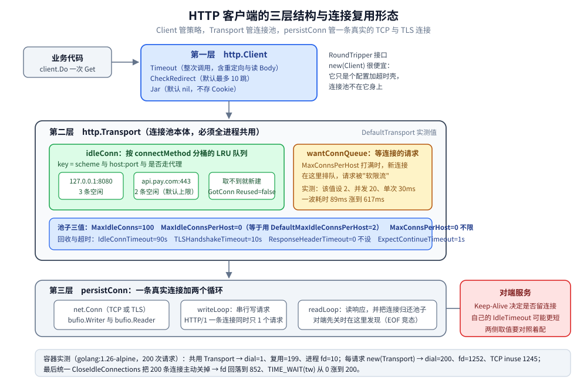
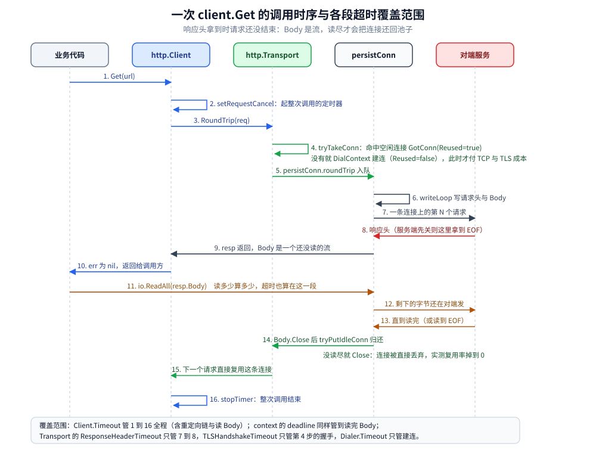

# HTTP客户端与连接池

> 覆盖 `net/http` 客户端的三层结构（`Client` → `Transport` → `persistConn`）、连接池参数的默认值与坑、三个超时各自打断在哪一步、`Response.Body` 的两条铁律、重定向与 Cookie 的默认行为、藏在标准库里的自动重试，以及一份能直接抄进服务的落地配置。
>
> 内容整理自个人学习笔记，素材见 [素材清单.md](../../../素材清单.md)。
>
> ⚠️ 本篇全部读数来自容器 `golang:1.26-alpine`（`go version go1.26.8 linux/amd64`）真跑；编译错误原文同样出自该容器的 `go build` stderr。

---

## 一、Client、Transport、persistConn 三层各管什么？

**本节要点**：三层分工很硬——`http.Client` 只管「一次调用」的语义（整次超时、重定向策略、Cookie jar），`http.Transport` 只管「连接怎么来、怎么还」（拨号、TLS、连接池、各阶段超时），真正握着 TCP 连接读写的是 `persistConn`。把超时写进 `Transport`、把池参数写进 `Client`，是这类问题里最常见的一类错。

### 1.1 三层的形状

`Client` 本身不含任何 socket，它只持有一个 `RoundTripper`：

```go
var DefaultClient = &Client{} // Timeout=0 CheckRedirect=nil Jar=nil，见 1.3 实测
// Client.Transport == nil 时走 http.DefaultTransport
```

`Transport` 里的池是三张 map + 一个 LRU，键都是 `connectMethodKey`：

```go
type Transport struct {
	idleConn     map[connectMethodKey][]*persistConn // most recently used at end
	idleConnWait map[connectMethodKey]wantConnQueue  // waiting getConns
	idleLRU      connLRU

	connsPerHostMu   sync.Mutex
	connsPerHost     map[connectMethodKey]int
	connsPerHostWait map[connectMethodKey]wantConnQueue // waiting getConns
	dialsInProgress  wantConnQueue
```

上面这段摘自容器内 `/usr/local/go/src/net/http/transport.go:100-115`，核验方式：
`docker run --rm golang:1.26-alpine sed -n '100,115p' /usr/local/go/src/net/http/transport.go`。

三个字段名已经把行为说完了：

- `idleConn` 是「按 key 分桶的空闲连接链表，尾端最新」，取的时候从尾端拿；
- `idleConnWait` / `connsPerHostWait` 是「拿不到连接就排队等」的两个 `wantConnQueue`，`MaxConnsPerHost` 的阻塞就发生在这里；
- `connectMethodKey` 里含 scheme、目标地址、是否走代理，所以换 host、换端口、`http` ↔ `https` 都是**不同的桶，各有一套池**，不会互相复用。



图怎么读：自上而下是三层，业务代码只碰 `http.Client`；`Client` 把请求交给 `Transport`；`Transport` 从 `idleConn` 桶里取一条 `persistConn`，取不到才 `DialContext` 建新的。图左侧参数条里的默认值是容器里打印出来的真值（见 1.3），底部那条对比（共用 → `dial=1`、`fd=10`；每请求新建 → `dial=200`、`fd=1252`、TCP `inuse` 1245）出自 3.1 那一轮实测。

### 1.2 DefaultTransport 的原文

摘自容器内 `/usr/local/go/src/net/http/transport.go:46-57`，一字未改：

```go
var DefaultTransport RoundTripper = &Transport{
	Proxy: ProxyFromEnvironment,
	DialContext: defaultTransportDialContext(&net.Dialer{
		Timeout:   30 * time.Second,
		KeepAlive: 30 * time.Second,
	}),
	ForceAttemptHTTP2:     true,
	MaxIdleConns:          100,
	IdleConnTimeout:       90 * time.Second,
	TLSHandshakeTimeout:   10 * time.Second,
	ExpectContinueTimeout: 1 * time.Second,
}

// DefaultMaxIdleConnsPerHost is the default value of [Transport]'s
// MaxIdleConnsPerHost.
const DefaultMaxIdleConnsPerHost = 2
```

`MaxIdleConnsPerHost` 没有出现在字面量里，因为它靠一个兜底函数生效（`transport.go:1050-1055`）：

```go
func (t *Transport) maxIdleConnsPerHost() int {
	if v := t.MaxIdleConnsPerHost; v != 0 {
		return v
	}
	return DefaultMaxIdleConnsPerHost
}
```

也就是说：**写 `0` 等于写 `2`，不写也是 `2`**，想「不限制」得显式写一个足够大的值——`0` 在 `MaxIdleConns`/`MaxConnsPerHost` 上是「不限」，在 `MaxIdleConnsPerHost` 上却是「用默认 2」，这一处语义不一致是踩坑的根源。

### 1.3 容器里打印出来的默认值

```text
DefaultClient: Timeout=0s CheckRedirect==nil true Jar==nil true
Transport{Proxy=ProxyFromEnvironment} MaxIdleConns=100 MaxIdleConnsPerHost=0 MaxConnsPerHost=0
  IdleConnTimeout=1m30s TLSHandshakeTimeout=10s ExpectContinueTimeout=1s ResponseHeaderTimeout=0s
  DisableKeepAlives=false DisableCompression=false ForceAttemptHTTP2=true Protocols=<nil>
  http.DefaultMaxIdleConnsPerHost=2 http.MaxHeaderBytes(DefaultMaxHeaderBytes)=1048576
  裸 &Transport{} 全零值: MaxIdleConns=0(0=不限) MaxIdleConnsPerHost=0(0→用默认 2) IdleConnTimeout=0s(0=不限) ForceAttemptHTTP2=false Protocols=<nil>
  httptest.Server 默认: IdleTimeout=0s ReadHeaderTimeout=0s ReadTimeout=0s WriteTimeout=0s
  DefaultTransport.Proxy(http://example.com) → <nil> err=<nil>
```

三个读数值得单独记：

- `Timeout=0s` —— 默认的 `http.Client` **没有任何超时**，`DefaultClient.Get()` 能对着一个挂死的对端一直等（只受 TCP 层 `KeepAlive` 探测影响，实测见 5.5）；
- `Jar==nil true` —— 默认**不带 cookie jar**，重定向时不会自动带上上一跳的 `Set-Cookie`；
- 裸 `&Transport{}` 的 `ForceAttemptHTTP2=false` 且 `Proxy=nil` —— 自己手搓 `Transport` 时，既不会自动协商 HTTP/2，也不会读 `HTTP_PROXY`/`NO_PROXY`。这一条最坑，因为很多服务的调试代理就是这么丢掉的。

⚠️ 顺带一个对照：`httptest.Server` 的 `IdleTimeout`/`ReadTimeout`/`WriteTimeout` 默认全是 `0s`（不超时）。也就是说本地单测里一切正常，上了真实网关/负载均衡（空闲连接 60s 被切）才开始报错，见 4.5。

## 二、一次 Get() 从调用到读完 body，中间发生了什么？

**本节要点**：`Client.Get` = 起整次调用的定时器 → `Transport.RoundTrip` 从池里取连接（取不到才拨号）→ 请求交给 `persistConn.writeLoop`、响应从 `readLoop` 回来 → `Response.Body` 是一个还没读的流 → 只有**读完或 Close 且连接干净**，它才会被 `tryPutIdleConn` 还回池子。下一次能复用，全靠最后这一步。

### 2.1 时序与每个超时覆盖的区间



图怎么读：五条泳道就是 1.1 的三层加对端服务，编号 1–16 是一次 `Get` 的真实步骤顺序；第 4 步分叉（命中空闲连接 `Reused=true` / 否则拨号）就是「快路径」和「慢路径」的差别。图底部那条覆盖范围带是本篇第五节的图解：`Client.Timeout` 管全程含读 body，`ResponseHeaderTimeout` 只管第 7–8 步，`TLSHandshakeTimeout` 只管第 4 步的握手。

### 2.2 「这条连接是复用的还是新拨的」怎么量出来

`net/http/httptrace` 的 `GotConn` 回调里带一个布尔值，这是判断复用率最直接的手段：

```go
trace := &httptrace.ClientTrace{
	GotConn: func(i httptrace.GotConnInfo) {
		if i.Reused {
			atomic.AddInt32(&reused, 1)
		} else {
			atomic.AddInt32(&fresh, 1)
		}
	},
}
resp, err := c.Do(req.WithContext(httptrace.WithClientTrace(req.Context(), trace)))
```

再配一个包了 `DialContext` 计数的 `Transport`（每次真拨号 +1）、服务端 `ConnState`（`StateNew` 计数 = 对端看到的连接数），两侧一对照，「谁在乱建连接」就藏不住了。同一次运行里两个请求的实测：

```text
    D=20ms 第二次请求：新=1 复用=1 dial=1 err=0 客户端错误=<nil>｜服务端多收到 1 个请求
    D=200ms 第二次请求：新=1 复用=0 dial=1 err=0 客户端错误=<nil>｜服务端多收到 1 个请求
```

第一行是 300ms 空闲后的正常复用（一次复用 + 一次重试新建），第二行连接已经被清出池子，只能新拨。

### 2.3 归还这一步是有条件的

还回池子前先查每主机上限，超了直接丢弃（`transport.go:1138-1153` 节选）：

```go
	idles := t.idleConn[key]
	if len(idles) >= t.maxIdleConnsPerHost() {
		return errTooManyIdleHost
	}
	...
	t.idleConn[key] = append(idles, pconn)
	t.idleLRU.add(pconn)
	if t.MaxIdleConns != 0 && t.idleLRU.len() > t.MaxIdleConns {
		oldest := t.idleLRU.removeOldest()
		oldest.close(errTooManyIdle)
		t.removeIdleConnLocked(oldest)
	}
	if t.IdleConnTimeout > 0 && pconn.alt == nil {
		...
		pconn.idleTimer = time.AfterFunc(t.IdleConnTimeout, pconn.closeConnIfStillIdle)
	}
```

三条线索都在这里：`MaxIdleConnsPerHost` 决定一个桶能留几条、`MaxIdleConns` 决定全局留几条（LRU 淘汰最旧）、`IdleConnTimeout` 给每条空闲连接挂一个定时器。另外注意 `pconn.alt == nil` 这个条件——`IdleConnTimeout` 在 HTTP/1 路径上由 `Transport` 管，HTTP/2 的空闲计时由 h2 自己管。

而**调用方能不能享受这套池，取决有没有把 body 读干净**，这是第六节的全部内容。

## 三、每个请求都 new 一个 http.Client 为什么是事故？

**本节要点**：`http.Client` 是**值很轻的结构体**，`http.Transport` 才是**持有连接池的重对象**。`&http.Client{}` 每次新建、但 `Transport` 仍走 `DefaultTransport`，实测几乎没有代价（dial=0、复用 199/200）；一旦把 `Transport` 也每次新建，200 次请求就变成 200 次 TCP 拨号 + 200 条同时存活的连接 + 412 个 fd。

### 3.1 五种写法的实测

同一轮运行（200 次请求，服务端是 `httptest` 回环），`dial` = 包在 `DialContext` 里的计数器，`fd` = `/proc/self/fd` 条目数，`inuse` = `/proc/net/sockstat` 的 TCP 行：

| 写法 | dial | 复用 | 同时存活峰值 | 进程 fd | TCP inuse 跑后 | 耗时 |
| --- | --- | --- | --- | --- | --- | --- |
| A 共用 Client + 共用 Transport（串行） | 1 | 199 | 1 | 10 | 3 | 319ms |
| B 每请求 `&http.Client{}`，Transport 仍是 `DefaultTransport` | 0 | 199 | 0 | 12 | 5 | 315ms |
| C 每请求 `&http.Client{}` + 每请求 `&http.Transport{}` | 200 | 0 | 200 | 412 | 405 | 476ms |
| D 共用 Client，并发 20×10 波 | 20 | 184 | 20 | 452 | 445 | 22ms |
| E 每请求新 Client + 新 Transport，并发 20×10 波 | 200 | 0 | 200 | 852 | 845 | 50ms |

原始输出片段（A 与 C 两段，原样抄）：

```text
--- A 全程共用一个 Client（Transport 也共用）（200 次请求，并发 1）---
  耗时=319ms 错误=0
  客户端侧: dial(新建连接)=1 新连接取用(fresh)=1 复用(idle)=199 已关闭=0 同时存活峰值=1
  服务端侧: 收到请求=200 新建连接(StateNew)=1
  进程 fd 数=10
--- C 每请求 new(http.Client)+new(Transport)（200 次请求，并发 1）---
  耗时=476ms 错误=0
  客户端侧: dial(新建连接)=200 新连接取用(fresh)=200 复用(idle)=0 已关闭=0 同时存活峰值=200
  服务端侧: 收到请求=200 新建连接(StateNew)=200
  进程 fd 数=412
```

三个趋势：

1. **B 和 A 一样好**：只 new `Client` 不 new `Transport`，池子还在 `DefaultTransport` 手里，dial 计数甚至是 0（第一次拨号发生在上一轮，那轮没被这次统计覆盖）；
2. **C 全崩**：每次新 `Transport` 就意味着每次新池 → 每次新连接，`存活峰值=200`、fd 从 10 涨到 412；
3. **D 说明池子该开多大**：并发 20 就拨 20 条，剩下 184 次全是复用，耗时 22ms 是串行复用的 1/14。

### 3.2 耗时是波动值，趋势才可信

上表的耗时只属于那一次运行。同一份程序**另外**连跑 3 次，耗时列单独看（计数列不与之混用）：

```text
run1 A=359ms B=381ms C=545ms D=21ms E=65ms
run2 A=311ms B=312ms C=486ms D=24ms E=83ms
run3 A=305ms B=310ms C=461ms D=23ms E=57ms
```

回环环境下 A/B 都在 0.3–0.4s，C 稳定比 A 慢约 1.4–1.5 倍，E 稳定比 D 慢 2.5–3.5 倍。真实网络里差距只会更大，因为每次新连接还要付 TLS 握手（1–2 个 RTT）和慢启动。

### 3.3 忘了 CloseIdleConnections：连接和 TIME_WAIT 都不会自己消失

C/E 那种写法跑完 200 次请求、把 200 个 `Transport` 都留在 slice 里（不让 GC 插手），实测：

```text
--- F 每请求 new(Transport)，最后统一 CloseIdleConnections ---
  200 次请求跑完（还没关任何连接）: 耗时=430ms dial=200 fd=1252 存活=200 TCP: inuse 1245 orphan 0 tw 0 alloc 1268 mem 5
  关闭后: fd=852 TCP: inuse 845 orphan 0 tw 200 alloc 870 mem 5（跑前 fd=852 TCP: inuse 845 orphan 0 tw 0 alloc 868 mem 5）
```

`CloseIdleConnections` 的原文定义在 `transport.go:893-897`：「closes any connections which were previously connected from previous requests but are now sitting idle in a "keep-alive" state. It does not interrupt any connections currently in use.」——只关空闲的，正在用的不碰。

关掉之后 fd 从 1252 回落到 852，TCP `inuse` 同步回落，但 `tw`（TIME_WAIT）从 0 涨到 200：本地主动关连接的一方要背 TIME_WAIT，这正是「每次新建 Transport」在真实环境里的第二种代价形态。TIME_WAIT 的机制本身见 [TCP四次挥手.md](../../../02-计算机基础/网络/tcp/TCP四次挥手.md)。

⚠️ 反过来也别指望「每次请求都 `CloseIdleConnections()`」来擦屁股：4.4 的实测里，那种写法照样是 100 次请求 100 次拨号 + 100 个 TIME_WAIT。

### 3.4 什么时候可以每次新建

| 场景 | 该不该复用 | 理由 |
| --- | --- | --- |
| 线上服务调下游 | 必须复用，进程级单例 | 每次新建等于每次付 TCP/TLS 握手，还制造 fd 与 TIME_WAIT |
| 一次性 CLI 脚本 / 只发几个请求 | 无所谓 | 池子活不过进程，复用收益是 0 |
| 单元测试里临时起的 client | 建议复用 + `defer CloseIdleConnections()` | 避免测试进程里堆 fd |
| 需要独立 TLS/代理/超时配置的某一条调用链 | 新建 `Transport` 是**对的** | 配置不同的目标本来就该分桶，见 10.2 |
| 按租户/下游分桶 | 桶要长期持有，不能每次请求新建 | 见 10.2 实测：两个下游 20 次请求只需 1 次拨号 |

## 四、Transport 的参数表里，哪些默认值会咬人？

**本节要点**：会咬人的是 `MaxIdleConnsPerHost`（默认 2，并发稍高就疯狂重连）和 `ForceAttemptHTTP2`/`Proxy`（手搓 `Transport` 时静默丢掉）；`MaxConnsPerHost` 是保护下游的阀门，代价是请求排队；`DisableKeepAlives` 是调试用的开关，生产别开。

### 4.1 主参数表

| 参数 | 默认值 | 管什么 | 踩坑表现 |
| --- | --- | --- | --- |
| `MaxIdleConns` | `100`（`DefaultTransport`） | 全局空闲连接上限，0=不限 | 下游 host 很多时按 LRU 淘汰，淘汰即关连接 |
| `MaxIdleConnsPerHost` | `0` → `DefaultMaxIdleConnsPerHost = 2` | 每个桶（scheme+地址+代理）留几条空闲 | 并发 20 打一个 host：每波都要重拨 18 条 |
| `MaxConnsPerHost` | `0`（不限） | 每 host **总**连接数上限（拨号中+活跃+空闲） | 设小了请求排队甚至超时；不设则下游被打挂 |
| `IdleConnTimeout` | `90s` | 客户端丢弃空闲连接的时限 | 比对端（LB/网关）空闲超时**长** → 拿到已死连接 |
| `DisableKeepAlives` | `false` | 完全不复用，每请求一条新连接 | 性能断崖 + TIME_WAIT 暴涨，只用于调试 |
| `ForceAttemptHTTP2` | `true`（裸 `&Transport{}` 是 `false`） | https 是否尝试 h2 | 手搓 Transport 后行为变了，排查半天 |
| `TLSHandshakeTimeout` | `10s` | 只管 TLS 握手这一段 | 0=不超时 |
| `ResponseHeaderTimeout` | `0`（不设） | 从写完请求到收到响应头 | 对「服务端 hang 住」比 `Client.Timeout` 精准，见 5.3 |
| `ExpectContinueTimeout` | `1s` | 发了 `Expect: 100-continue` 后等多久 | 服务端不回 100 时白等 1s 才推 body，见 4.6 |
| `Proxy` | `ProxyFromEnvironment`（裸 Transport 是 `nil`） | 按环境变量走代理 | 手搓后调试代理失效 |
| `DialContext` | `net.Dialer{Timeout: 30s, KeepAlive: 30s}` | 建连超时与 TCP keepalive | 30s 太长，服务内调用一般降到 1–3s |
| `Protocols` | `nil`（Go 1.24+ 字段） | 显式声明 h1/h2 | Go 1.26 里关 h2 的正确方式，见 7.5 |

### 4.2 MaxIdleConnsPerHost 默认 2：并发 20 × 5 波 = 100 请求

| 取值 | dial | 复用 | 服务端连接数 | 耗时（本轮） |
| --- | --- | --- | --- | --- |
| `0`（→ 默认 2） | 90 | 23 | 90 | 168ms |
| 显式 `2` | 87 | 31 | 87 | 190ms |
| `20`（=峰值并发） | 20 | 80 | 20 | 165ms |
| `100` | 20 | 86 | 20 | 197ms |

读数说明两件事：默认 2 时，100 次请求拨了 90 次号，服务端看到 90 条连接——**「keep-alive 开了但等于没开」**；把 `MaxIdleConnsPerHost` 提到峰值并发后，dial 直接掉到 20，服务端连接数也是 20。耗时这一列区分度不大（回环、服务端无额外延迟），另跑 3 次的波动区间：默认值 164–166ms、取 20 时 158–159ms，只看趋势。

⚠️ 「每请求拨号」在服务端侧的表现是连接数暴涨、TLS 会话复用率归零、LB 的 connection 指标告警；在客户端侧的表现不一定有耗时变化，所以**别用耗时当唯一指标，要用 dial/复用比**。

### 4.3 MaxConnsPerHost：它是阀门，不是优化

并发 20 × 2 波 = 40 请求，服务端每个请求 sleep 30ms：

```text
  MaxConnsPerHost=0   耗时=86ms 错误=0 dial=20 新=20 复用=20 存活峰值=20 服务端请求=40 服务端连接=20
  MaxConnsPerHost=2   耗时=632ms 错误=0 dial=2 新=2 复用=38 存活峰值=2 服务端请求=40 服务端连接=2
  MaxConnsPerHost=5   耗时=271ms 错误=0 dial=5 新=5 复用=35 存活峰值=5 服务端请求=40 服务端连接=5
```

限到 2 之后耗时从 86ms 涨到 632ms（另跑 3 次：615/617/618ms，稳定 7 倍），因为多出来的请求全在 `connsPerHostWait` 里排队。这是**故意的保护**：下游只有 2 个 worker 时，宁可排队也别把 20 个并发压过去。要配的是「限流 + 超时」组合，见 [限流器.md](../并发编程/限流器.md)。

### 4.4 DisableKeepAlives 与「每请求 CloseIdleConnections」

100 次串行请求的三种写法（同轮运行）：

```text
  DisableKeepAlives=true                     耗时=180ms 错误=0 dial=100 新=100 复用=0 存活峰值=1 服务端请求=100 服务端连接=100
    跑前 fd=151 TCP: inuse 144 orphan 0 tw 173 alloc 171 mem 0
    跑后 fd=151 TCP: inuse 144 orphan 0 tw 273 alloc 171 mem 0
  每请求 new(Transport)+CloseIdleConnections    耗时=168ms 错误=0 dial=100 新=100 复用=0 存活峰值=100 服务端请求=100 服务端连接=100
    跑前 fd=151 TCP: inuse 144 orphan 0 tw 273 alloc 171 mem 0
    跑后 fd=151 TCP: inuse 144 orphan 0 tw 373 alloc 171 mem 0
  共用 Transport（对照）                           耗时=80ms 错误=0 dial=1 新=1 复用=99 存活峰值=1 服务端请求=100 服务端连接=1
    跑前 fd=151 TCP: inuse 144 orphan 0 tw 373 alloc 171 mem 0
    跑后 fd=153 TCP: inuse 146 orphan 0 tw 373 alloc 173 mem 0
```

`DisableKeepAlives=true` 让连接用完即关，TIME_WAIT 净增 100；「每请求新建 Transport 再手动关」多了一个存活峰值 100（因为每次拨的新连接不一定马上进入 idle 状态就被关掉），TIME_WAIT 同样净增 100。共用那一列 fd 只 +2、tw 不动。耗时另跑 3 次的区间：前两种 54–64ms / 70–81ms，共用 16–34ms（回环下波动大，只看相对关系）。

### 4.5 IdleConnTimeout 与服务端先关空闲连接

客户端 300ms 一次请求打到 `IdleTimeout=120ms` 的服务端：

```text
  服务端 IdleTimeout=120ms，客户端 IdleConnTimeout=30s → 耗时=1.818s 错误=0 dial=6 新=6 复用=0 存活峰值=1 服务端请求=6 服务端连接=6 首次错误=<nil>
  服务端 IdleTimeout=120ms，客户端 IdleConnTimeout=60ms → 耗时=1.822s 错误=0 dial=6 新=6 复用=0 存活峰值=1 服务端请求=6 服务端连接=6 首次错误=<nil>
    同一条连接上改发 POST（不可回放 body）耗时=906ms 错误=0 dial=3 新=3 复用=1 存活峰值=0 服务端请求=4 服务端连接=3 首次错误=<nil>
```

关键读数不是超时参数救了多少，而是**复用=0 但错误=0**：对端把空闲连接关掉时，客户端的 `readLoop` 会立刻读到 EOF 并把这条连接摘出池子，所以下一次请求是「干净的新连接」而不是报错。真正的报错只出现在窗口里——客户端刚好把请求写出去、对端刚好关，见 8.4。

结论照旧：**客户端的 `IdleConnTimeout` 要比对端的空闲超时小**（LB/网关常见 60s，客户端就配 30s），这样连接永远是自己先放掉的，不用赌竞态。

### 4.6 ExpectContinueTimeout：1 秒的静默代价

带 `Expect: 100-continue` 的大请求体（200KB），服务端只读请求头、body 落地才计时：

```text
  服务端立刻回 100 Continue，ECT=1s（默认）         服务端读完请求头后 0ms 才收到完整 200KB body；客户端总耗时=1ms err=<nil>
  服务端不回 100，ECT=1s（默认）                   服务端读完请求头后 1002ms 才收到完整 200KB body；客户端总耗时=1.013s err=<nil>
  服务端不回 100，ECT=200ms                    服务端读完请求头后 202ms 才收到完整 200KB body；客户端总耗时=202ms err=<nil>
  服务端不回 100，ECT=0                        服务端读完请求头后 0ms 才收到完整 200KB body；客户端总耗时=1ms err=<nil>
```

`ExpectContinueTimeout=0` 的语义是「不等 100，直接开始推 body」，实测 0ms 就把 body 送到了，比默认值少 1 秒。**PUT 大文件到不实现 100-continue 的服务（很多对象存储/网关）时，把它设成 0 或很小**；设 1s 就等于给每个请求加 1s。

## 五、三个超时分别打断在哪一步？

**本节要点**：`Client.Timeout` 是**整次调用**的预算，包含重定向链和**读 body**；`context` 的 deadline 同样覆盖到读完 body；`Transport.ResponseHeaderTimeout` 只管「写完请求到收到响应头」，不碰 body。只要需要流式读（`io.Copy` 转发、SSE、大文件下载），就**不能用 `Client.Timeout`**。

### 5.1 覆盖范围

| 超时 | 作用对象 | 起点 → 终点 | 是否含读 Body |
| --- | --- | --- | --- |
| `Client.Timeout` | 整次 `Do` 调用（含重定向链） | 进 `Do` → body 读完/关 | **是** |
| `context.WithTimeout` + `req.Context()` | 整次调用 + 调用方持有 resp 的生命周期 | 建 req → ctx 取消 | 是 |
| `DialContext` 里 `net.Dialer.Timeout` | 仅 TCP 建连 | SYN → ESTABLISHED | 否 |
| `TLSHandshakeTimeout` | 仅 TLS 握手 | ClientHello → 握手完成 | 否 |
| `ResponseHeaderTimeout` | 写完请求头 → 读完响应头 | 不含 body | 否 |
| `ExpectContinueTimeout` | 等 `100 Continue` | 见 4.6 | 否 |
| `IdleConnTimeout` | 空闲连接被丢弃的时限 | 与单次请求无关 | — |

`Client.Timeout` 的实现方式就是给请求挂一个定时器再 `forkReq()`（`client.go` 里 `setRequestCancel` 之后那几行，见 9.1 的原文），所以它对「连接是不是新的」完全无所谓——但也因此，它会在你读 body 读得正爽的时候把连接掐掉。

### 5.2 Client.Timeout 打断流式读（实测）

服务端每 60ms 写一块、共 6 块（360ms），客户端 `Client.Timeout=200ms`：

```text
[1.2 Client.Timeout=200ms / 流式 6×60ms] 响应头已拿到，读 body 中途被打断：4 次非零读 / 28 字节，err=context deadline exceeded (Client.Timeout or context cancellation while reading body)
[1.3 ctx=200ms] 响应头已拿到，ReadAll 得到 28 字节后 err=context deadline exceeded
```

同一段流，`ResponseHeaderTimeout=100ms` 却完全不影响：

```text
[1.4 ResponseHeaderTimeout=100ms / 流式总时长 360ms] 照样读完：n=42 err=<nil>（该参数不覆盖 body）
[1.5 ResponseHeaderTimeout=120ms / 250ms 才回头] Get "http://127.0.0.1:34155": net/http: timeout awaiting response headers
```

⚠️ 两种错误原文要分清：`(Client.Timeout exceeded while awaiting headers)` 是没等到响应头；`(Client.Timeout or context cancellation while reading body)` 是**头拿到了、body 没读完**——后者往往已经被上游当成「成功」处理了一半，重试要格外小心（见 8.5）。

### 5.3 重定向链共用同一个预算

三跳、每跳服务端 sleep 100ms：

```text
[1.6 三跳 ×100ms，Client.Timeout=250ms] err=Get "http://127.0.0.1:36065/done": context deadline exceeded (Client.Timeout exceeded while awaiting headers) 耗时=250ms
[1.6 三跳 ×100ms，Client.Timeout=500ms] err=<nil> 耗时=300ms
```

`Client.Timeout` 不重置：它是**整条链**的预算，不是每跳的预算。300ms 是三个 100ms 之和，说明预算要按「跳数 × 单跳耗时」给。

### 5.4 对端不回包 / 只 hijack 不回

```text
[1.7 hijack 后一个字节不回，Client.Timeout=400ms] Get "http://127.0.0.1:45259": context deadline exceeded (Client.Timeout exceeded while awaiting headers)
[1.8 完全无超时的默认 Client（服务端 1.5s 后关连接）] Get "http://127.0.0.1:45259": EOF
```

第二行是「什么都不配」的真实结局：`DefaultClient` 没有超时，请求一直挂到对端把它关掉，拿到一个语义模糊的 `EOF`（而 `EOF` 在复用连接上还可能被静默重试，见 8.3）。

### 5.5 用哪个：判据表

| 需求 | 选它 | 别选它 |
| --- | --- | --- |
| 普通 RPC 式调用，要一个总预算 | `Client.Timeout` 或 `ctx` | `ResponseHeaderTimeout` 单独用（不含 body） |
| 流式/大文件/SSE/网关转发 | `ctx`（由调用方控制）+ 各阶段超时 | `Client.Timeout`（会砍断 body） |
| 只想防「下游 hang 住不回头」 | `ResponseHeaderTimeout` | `Client.Timeout` 设很大 |
| 只想防「连不上」 | `Dialer.Timeout`（`DialContext`） | `Client.Timeout`（DNS 慢也算在里面） |
| 每个请求预算不同 | `ctx` | 给每个请求 new 一个 `Client`（见 3.1） |

## 六、Response.Body 有哪两条铁律？

**本节要点**：铁律一 `resp.Body` **必须 Close**（不然连接不回收，fd 单调上涨）；铁律二 想要复用就**必须读尽**（哪怕内容不关心，`io.Copy(io.Discard, resp.Body)`）。实测里「只 Close 不读」把复用率打到 0；反过来「不 Close」把 fd 从 17 顶到 50。

### 6.1 复用矩阵（20 次串行请求，同一轮运行）

| 调用方的做法 | 响应体 | 新连接 | 复用 | fd 变化 |
| --- | --- | --- | --- | --- |
| 读尽 + `Close` | 32B | 1 | 19 | 8 → 10 |
| 只 `Close` 不读 | 64KB chunked | 20 | 0 | 10 → 15 |
| 读 1KB 就 `Close` | 64KB chunked | 20 | 0 | 15 → 17 |
| 既不读也不 `Close` | 64KB chunked | 20 | 0 | 17 → 50 |
| 只 `Close` 不读 | 32B | 20 | 0 | 50 → 50 |
| 只 `Close` | 204 无 body | 1 | 19 | 50 → 52 |
| 什么都不做 | 204 无 body | 1 | 19 | 52 → 54 |

原始行（节选）：

```text
  读尽+Close                         新连接= 1 复用=19 耗时=1.64s err=<nil> 进程 fd 8→10
  只 Close 不读（64KB chunked）         新连接=20 复用= 0 耗时=10ms err=<nil> 进程 fd 10→15
  既不读也不 Close（泄漏）                  新连接=20 复用= 0 耗时=10ms err=<nil> 进程 fd 17→50
  204 无 body：只 Close               新连接= 1 复用=19 耗时=10ms err=<nil> 进程 fd 50→52
```

三个容易记错的点：

- **32 字节的小 body 也要读尽**：只 `Close` 不读时同样 20 次新连接。`Close` 不负责替你吸干剩余字节；
- **没有 body 的响应（204）本来就干净**：只 `Close` 甚至什么都不做都能 19 次复用——但仍要 `Close`，这是 `defer resp.Body.Close()` 无条件写的原因；
- **不 `Close` 是最坏的一档**：fd 一路涨，20 次涨 33 个。这条泄漏不会因为 GC 立刻回收。

⚠️ 「读尽 + Close」那一档耗时 1.64s，比其它档的 10ms 高一个数量级：那一轮里这个用例排在最前，服务端连接还没暖起来，属回环单次运行的噪声，别当结论；判断只看「新连接/复用」两列。

### 6.2 重复 Close、Close 后 Read、http.NoBody

```text
  正常读: n=32 ContentLength=32 TransferEncoding=[] Body==nil? false
  重复 Close 第 2 次=<nil> 第 3 次=<nil>
  Close 后再 Read → http: read on closed response body
  http.NoBody.Read → n=0 err=EOF；http.NoBody.Close → <nil>
```

`Close` 幂等（重复调返回 nil），`Read` 在 `Close` 之后必定失败。`resp.Body` 由 `Client`/`Transport` 保证**永远非 nil**，所以不需要判空；请求侧想表达「没有 body」就用 `http.NoBody`，它 `Read` 出 `EOF`、`Close` 出 `nil`，安全。

### 6.3 请求体的可回放性决定它能不能被重试

```text
  bytes.Reader       ContentLength=  5 GetBody!=nil=true   → server 收到 Accept-Encoding="gzip" body=5B proto=HTTP/1.1
  strings.Reader     ContentLength=  5 GetBody!=nil=true   → server 收到 Accept-Encoding="gzip" body=5B proto=HTTP/1.1
  *wrapped Reader    ContentLength=  0 GetBody!=nil=false  → server 收到 Accept-Encoding="gzip" body=5B proto=HTTP/1.1
  http.NoBody        ContentLength=  0 GetBody!=nil=false  → server 收到 Accept-Encoding="gzip" body=0B proto=HTTP/1.1
  nil                ContentLength=  0 GetBody!=nil=false  → server 收到 Accept-Encoding="gzip" body=0B proto=HTTP/1.1
```

`http.NewRequest` 认得出 `*bytes.Buffer` / `*bytes.Reader` / `*strings.Reader` 这三种，自动填 `ContentLength` 并生成 `GetBody`（重放函数）。换成自定义 reader 后 `ContentLength=0`、`GetBody=nil`，此时请求体走 `Transfer-Encoding: chunked`（服务端确实收到了 5 字节），但**永远不可能被 `net/http` 重试**，也让中间层无法预知长度。要发可重试的 body 就传那三种类型，或者显式设置 `ContentLength` + `GetBody`。

### 6.4 透明 gzip：`Accept-Encoding` 被标准库接管了

```text
  DisableCompression=false  响应 Content-Encoding="" Uncompressed=true ContentLength=-1 实读字节=14000 头里 Vary=""
  DisableCompression=true   响应 Content-Encoding="" Uncompressed=false ContentLength=-1 实读字节=10000 头里 Vary=""
```

默认（`DisableCompression=false`）标准库自己加 `Accept-Encoding: gzip`、自己解压，因此 `resp.Header` 里看不到 `Content-Encoding`，`ContentLength` 变成 `-1`（解压后长度未知），实读 14000 是解压后的原文。关掉后拿到的是 10000 字节的原始 gzip 流。

⚠️ 做转发/代理时这条最坑：客户端加了 gzip、你透传解压后的 body 却把原 `Content-Length` 或 `Vary` 丢了，对端就会拿到长度不符或缓存错乱的响应。实测里服务端没有写 `Vary`（`Vary=""`），这正是转发前必须自己补齐的东西。

## 七、重定向、Cookie、HTTPS 的默认行为要注意什么？

**本节要点**：`Client` 默认最多跟 10 跳（`stopped after 10 redirects`）；默认**没有 Cookie jar**；跨主机重定向会剥掉 `Authorization` 和 Cookie；`https` 打明文端口给出的是 `http: server gave HTTP response to HTTPS client` 而不是 TLS 错；`InsecureSkipVerify` 只该出现在本地调试。

### 7.1 跟跳上限与 CheckRedirect

```text
  [6.2 CheckRedirect 自定义限流] err=Get "/b": 最多只允许 1 跳，已经走了 1 跳 status=0
  [6.3 ErrUseLastResponse（不跟随）] err=<nil> status=302 Location="/b"
```

默认 10 跳上限的真实报错原文（同轮另一段）：`Get "http://127.0.0.1:36521/self": stopped after 10 redirects`。`CheckRedirect` 里返回 `http.ErrUseLastResponse` 就能拿到 3xx 响应自己处理，做网关/爬虫时这是必配的——否则你会失去中间跳的信息。另外 `CheckRedirect` 收到的 `req.URL` 是绝对地址，`via` 是已走过的请求切片。

### 7.2 默认不带 jar，带上以后是这样

服务端在 `/a` 下发 `Set-Cookie: session=abc`，链是 `/a → /b → /c`：

```text
  [6.1 三跳 + cookie jar] err=<nil> status=200 访问序列=[/b /c]
  服务端每跳收到的 Cookie: [/a cookie="" /b cookie="session=abc" /c cookie="session=abc"]
  最终 Set-Cookie 是否入 jar: [session=abc]
```

配了 `Jar` 之后，后续跳自动带上；没配就一路 `cookie=""`。`访问序列=[/b /c]` 说明第一个 `/a` 是最初请求本身。

### 7.3 跨主机重定向会剥掉敏感头

同一下游、两种 `Location` 写法：

```text
  A(127.0.0.1) 302 → B(localhost:43473)：err=<nil>；B 端看到 Authorization="" Cookie=""
  A(127.0.0.1) 302 → B(127.0.0.1:43473)：err=<nil>；B 端看到 Authorization="Basic dXNlcjpwYXNz" Cookie="sid=xyz"
```

`localhost` 与 `127.0.0.1` 在标准库眼里就是不同主机：跨主机时 `Authorization`、`Cookie`、`WWW-Authenticate`、`Cookie2` 全部被摘掉。所以「同一个服务换域名后 401」不是玄学，鉴权要么放 URL token 要么放在 Cookie 之外的地方（且需要你自己重新附加）。

### 7.4 https 打明文 / 自签 / InsecureSkipVerify

```text
[2.7 https 打到明文端口] Get "https://127.0.0.1:37203/": http: server gave HTTP response to HTTPS client (Is http.ErrSchemeMismatch=true)
[2.8 自签证书] Get "https://127.0.0.1:46563": tls: failed to verify certificate: x509: certificate signed by unknown authority (As x509.UnknownAuthorityError=true)
[2.9 srv.Client() 自带信任] <nil> status=200 proto=HTTP/1.1
[2.13 InsecureSkipVerify=true] 请求成功 status=200（证书链完全没校验，等于放弃中间人防护）
```

第一条的机制在标准库里写得很直白（`client.go:269-277`，`resp, err = rt.RoundTrip(req)` 之后那段）：

```go
		if tlsErr, ok := err.(tls.RecordHeaderError); ok {
			// If we get a bad TLS record header, check to see if the
			// response looks like HTTP and give a more helpful error.
			// See golang.org/issue/11111.
			if string(tlsErr.RecordHeader[:]) == "HTTP/" {
				err = ErrSchemeMismatch
			}
		}
```

即：TLS 记录头读出来是 `HTTP/` 就把错误换成 `ErrSchemeMismatch`。判定用 `errors.Is(err, http.ErrSchemeMismatch)` 而不是字符串匹配。

⚠️ `InsecureSkipVerify: true` **不是**「跳过一下校验」，是整个证书链校验（含名字匹配）都不做，中间人可以任意替换内容。内网自签的正确做法是把 CA 塞进根证书池（`x509.CertPool`），或用 `tls.Config.VerifyPeerCertificate` 做固定校验；`httptest` 的 `srv.Client()` 已经帮你把自签证书加进 Transport 了（2.9 那行 err=nil 就是这么来的）。握手细节见 [HTTPS与TLS.md](../../../02-计算机基础/网络/HTTPS与TLS.md)。

### 7.5 HTTP/2 与 HTTP/1.1 在同一份并发下的连接数

20 个并发请求、服务端每个 sleep 50ms；先各发 1 次预热再计数（所以 h2 那行的 dial 是 0——20 个并发全跑在预热建好的那一条连接上）：

```text
  HTTP/2 服务端（ForceAttemptHTTP2=true）     协商=HTTP/2.0 服务端 accept 的 TCP 连接=0 客户端 dial=0 复用=20 服务端请求=20 错误=0 耗时=70ms
  HTTP/1.1 服务端（Protocols 只留 HTTP1）       协商=HTTP/1.1 服务端 accept 的 TCP 连接=19 客户端 dial=19 复用=7 服务端请求=20 错误=0 耗时=190ms
```

h2 用 1 条 TCP 承载 20 个并发流，h1 需要 19 条新连接；耗时 70ms vs 190ms（同轮，回环单次读数）。

Go 1.26 里控制协议的现代写法是 `Transport.Protocols`（`http.Protocols` 类型，`SetHTTP1` / `SetHTTP2` / `SetUnencryptedHTTP2`），而不是老那个把 `TLSNextProto` 设成空 map 的技巧——而且 `TLSNextProto` 的签名在 1.26 已经变成 `func(authority string, c *tls.Conn) RoundTripper`，老写法直接编译不过。协议选择的服务端侧讨论见 [HTTP与gRPC.md](../../../02-计算机基础/网络/HTTP与gRPC.md)。

## 八、net/http 会替我重试吗？

**本节要点**：会，而且**只在安全的时候**——连接是复用的、错误发生在「还没写出去」或「读到第一个响应字节就断了」、并且请求是**可回放**的。GET/HEAD/OPTIONS/TRACE 默认可回放；POST 除非 body 是 `bytes.Reader` 这类可重放的、或者带了 `Idempotency-Key` 头，否则不重试。这条规则解释了为什么有时「一次 Get 服务端执行了两遍」。

### 8.1 shouldRetryRequest 原文

摘自容器内 `/usr/local/go/src/net/http/transport.go:818-863`：

```go
func (pc *persistConn) shouldRetryRequest(req *Request, err error) bool {
	if http2isNoCachedConnError(err) {
		// Issue 16582: if the user started a bunch of
		// requests at once, they can all pick the same conn
		// and violate the server's max concurrent streams.
		// Instead, match the HTTP/1 behavior for now and dial
		// again to get a new TCP connection, rather than failing
		// this request.
		return true
	}
	if err == errMissingHost {
		// User error.
		return false
	}
	if !pc.isReused() {
		// This was a fresh connection. There's no reason the server
		// should've hung up on us.
		//
		// Also, if we retried now, we could loop forever
		// creating new connections and retrying if the server
		// is just hanging up on us because it doesn't like
		// our request (as opposed to sending an error).
		return false
	}
	if _, ok := err.(nothingWrittenError); ok {
		// We never wrote anything, so it's safe to retry, if there's no body or we
		// can "rewind" the body with GetBody.
		return req.outgoingLength() == 0 || req.GetBody != nil
	}
	if !req.isReplayable() {
		// Don't retry non-idempotent requests.
		return false
	}
	if _, ok := err.(transportReadFromServerError); ok {
		// We got some non-EOF net.Conn.Read failure reading
		// the 1st response byte from the server.
		return true
	}
	if err == errServerClosedIdle {
		// The server replied with io.EOF while we were trying to
		// read the response. Probably an unfortunately keep-alive
		// timeout, just as the client was writing a request.
		return true
	}
	return false // conservatively
}
```

核验方式：`docker run --rm golang:1.26-alpine sed -n '818,863p' /usr/local/go/src/net/http/transport.go`。

### 8.2 isReplayable 原文

`/usr/local/go/src/net/http/request.go:1534-1548`：

```go
func (r *Request) isReplayable() bool {
	if r.Body == nil || r.Body == NoBody || r.GetBody != nil {
		switch valueOrDefault(r.Method, "GET") {
		case "GET", "HEAD", "OPTIONS", "TRACE":
			return true
		}
		// The Idempotency-Key, while non-standard, is widely used to
		// mean a POST or other request is idempotent. See
		// https://golang.org/issue/19943#issuecomment-421092421
		if r.Header.has("Idempotency-Key") || r.Header.has("X-Idempotency-Key") {
			return true
		}
	}
	return false
}
```

### 8.3 实测：一次客户端调用 = 服务端多次执行

服务端故意「每个连接上第一个请求正常回 200，之后的请求直接把连接 hijack 关掉」：

```text
  [GET ×4] 客户端 4 次请求：服务端 handler 执行=7 次，dial=4 新=4 复用=3 服务端连接=4 服务端请求=7 存活峰值=1 首次错误=<nil>
  [POST ×2，body=bytes.Reader（GetBody 可回放）] 服务端 handler 执行=2 次，dial=1 新=1 复用=1 服务端连接=1 服务端请求=2 存活峰值=1 err=Post "http://127.0.0.1:37411": EOF
  [POST ×2，body 不可回放] 服务端 handler 执行=2 次，dial=1 新=1 复用=1 服务端连接=1 服务端请求=2 存活峰值=1 客户端最终错误=Post "http://127.0.0.1:42121": EOF
  [POST ×2 + Idempotency-Key 头] 服务端 handler 执行=3 次，dial=2 新=2 复用=1 服务端连接=2 服务端请求=3 存活峰值=1 err=<nil>（isReplayable 认这个头）
  [新连接上就被关（RST）] handler 执行=1 次，dial=1 新=1 复用=0 服务端连接=1 服务端请求=0 存活峰值=1 err=Get "http://127.0.0.1:46271": read tcp 127.0.0.1:55064->127.0.0.1:46271: read: connection reset by peer（isReused=false → 不重试）
```

四条对照读完了就是完整的规则表：

- GET 4 次调用 → handler 跑 7 次：静默重试发生了 3 次，调用方**完全无感**（错误是 nil）。这就是「幂等接口被重复扣减库存」的来源；
- 带 `Idempotency-Key` 头的 POST 2 次调用 → handler 3 次：加了头就被认定可回放，重试了 1 次，最终 err=nil；
- 不带该头、body 不可回放的 POST → 直接把 `EOF` 抛回调用方，一次都没重试；
- **新连接上失败**（`isReused()==false`）一律不重试，因为「刚建好就被关」多半是请求本身被服务端拒绝，重试只会死循环。

### 8.4 竞态窗口：客户端刚写出、对端刚好关

服务端回完 200 后保持连接 100ms 再关，客户端在 D 之后发第二个请求（同一轮运行）：

```text
    D=20ms 第二次请求：新=1 复用=1 dial=1 err=0 客户端错误=<nil>｜服务端多收到 1 个请求
    D=95ms 第二次请求：新=1 复用=1 dial=1 err=0 客户端错误=<nil>｜服务端多收到 1 个请求
    D=105ms 第二次请求：新=1 复用=0 dial=1 err=0 客户端错误=<nil>｜服务端多收到 1 个请求
  POST（body 不可回放）——同样窗口里错误只能原样抛给调用方：
    D=20ms 服务端多收到 0 个请求，客户端错误=Post "http://127.0.0.1:43905/2": read tcp 127.0.0.1:35104->127.0.0.1:43905: read: connection reset by peer
    D=95ms 服务端多收到 0 个请求，客户端错误=Post "http://127.0.0.1:43905/2": read tcp 127.0.0.1:35130->127.0.0.1:43905: read: connection reset by peer
```

窗口内（D < 100ms）的 GET 全部拿到 `复用=1` + `新=1`，也就是「先在死连接上撞一次、再新拨一条重来」，服务端额外多收了 1 个请求；D 超过 100ms 时连接早被 `readLoop` 清出池子，`复用=0`，一次成功。同样的窗口对 POST 就是 `read tcp ...: read: connection reset by peer`，服务端一个请求都没多收。

⚠️ 于是有两条工程结论：(1) `connection reset by peer` / `EOF` 出现在**POST/写接口**上时，你无法从错误本身判断下游执行没执行过——不确定就当「可能已执行」，靠幂等键兜；(2) 客户端空闲超时必须小于对端，把窗口消掉（4.5）。

### 8.5 正确的重试姿势

| 原则 | 做法 |
| --- | --- |
| 只重试确定安全的 | 幂等（GET/HEAD/OPTIONS/PUT 或带幂等键），且失败点在「没收到响应头」之前 |
| 重试要显式 | 自己在业务层写循环 + 指数退避 + jitter，别依赖 `net/http` 的隐式重试（它只覆盖竞态，不覆盖 5xx） |
| 5xx 不由标准库重试 | `Client` 只看传输层错误，`500/503` 需要自己判断并尊重 `Retry-After` |
| 重试要有总预算 | 用 `ctx` 包住整串重试，而不是每次 `Client.Timeout` 都给满 |
| 写接口要有幂等键 | `Idempotency-Key` 头既让下游可去重，也让标准库愿意重试 |
| body 要可回放 | 传 `*bytes.Reader`/`*bytes.Buffer`/`*strings.Reader`，见 6.3 |
| 配合熔断/限流 | 见 [限流器.md](../并发编程/限流器.md)，重试风暴比不重试更致命 |

## 九、这些错误原文分别意味着什么？

**本节要点**：容器里把 13 种常见故障各造了一遍，原文照抄如下。判据的核心是：**先分清「建连阶段 / TLS 阶段 / 等响应头 / 读 body」四段**，再决定是重试、是换地址、还是干脆报错给上游。

### 9.1 原文语料

```text
[2.1 DNS] Get "http://no-such-host.invalid/x": dial tcp: lookup no-such-host.invalid on 192.168.65.7:53: no such host
[2.2 端口无人监听] Get "http://127.0.0.1:44811/": dial tcp 127.0.0.1:44811: connect: connection refused
      errors.As(*net.OpError): Op=dial Net=tcp Addr=127.0.0.1:44811 Err=connect: connection refused (Is ECONNREFUSED=true)
[2.3 Client.Timeout 等头] Get "http://127.0.0.1:41039": context deadline exceeded (Client.Timeout exceeded while awaiting headers)
      errors.Is(context.DeadlineExceeded)=true errors.Is(context.Canceled)=false
[2.4 context 超时] Get "http://127.0.0.1:41039": context deadline exceeded (Is DeadlineExceeded=true)
[2.5 对端 FIN 关闭] Get "http://127.0.0.1:44381": EOF (Is io.EOF=true)
[2.6 对端 RST] Get "http://127.0.0.1:40707": read tcp 127.0.0.1:47990->127.0.0.1:40707: read: connection reset by peer (Is syscall.ECONNRESET=true)
[2.7 https 打到明文端口] Get "https://127.0.0.1:37203/": http: server gave HTTP response to HTTPS client (Is http.ErrSchemeMismatch=true)
[2.8 自签证书] Get "https://127.0.0.1:46563": tls: failed to verify certificate: x509: certificate signed by unknown authority (As x509.UnknownAuthorityError=true)
[2.10 重定向环] Get "http://127.0.0.1:36521/self": stopped after 10 redirects
[2.12 响应头 200KB] 正常返回 status=200 头长度=204800 (客户端侧无 MaxHeaderBytes 限制，只有服务端有)
```

2.11（`net.Dialer.Timeout` 打断黑hole 地址）本轮**没能实测到**，原因见 9.3。

### 9.2 判据表

| 错误原文里的关键字 | 出在哪一段 | 根因 | 处置 |
| --- | --- | --- | --- |
| `lookup ...: no such host` | 建连（DNS） | 域名不存在/DNS 不可达/CoreDNS 抖动 | 先看服务名与 DNS，别急着重试；重试要退避，见 [DNS解析.md](../../../02-计算机基础/网络/DNS解析.md) |
| `connect: connection refused` | 建连 | 对端没监听/端口错/进程挂了 | 不重试（是配置或部署问题），`errors.Is(err, syscall.ECONNREFUSED)` 判定 |
| `context deadline exceeded (Client.Timeout exceeded while awaiting headers)` | 等响应头 | 下游 hang 或太慢 | 可重试（幂等前提下），并检查下游负载 |
| `net/http: timeout awaiting response headers` | 等响应头 | `ResponseHeaderTimeout` 触发 | 同上，见 5.2 |
| `context deadline exceeded` | 任意段 | 调用方的 ctx 到期/取消 | 通常**不该**重试（是上游主动放弃） |
| `EOF` | 读第一个响应字节 | 对端 FIN 关掉空闲连接（竞态）或 HTTP/1.0 无 keep-alive | 幂等可重试（标准库已重试，见 8.3）；写接口按「可能已执行」处理 |
| `read tcp ...: read: connection reset by peer` | 写/读 | 对端 RST：进程重启、LB 切断、被防火墙 reset | 同 `EOF`，但要看下游是否已处理 |
| `http: server gave HTTP response to HTTPS client` | TLS | scheme 写错，用 `https` 打了明文端口 | 改 URL，判定用 `errors.Is(err, http.ErrSchemeMismatch)` |
| `tls: failed to verify certificate: x509: ...` | TLS | 证书链/主机名不匹配、SNI 或 IP 直连 | 装对 CA，见 7.4 |
| `stopped after 10 redirects` | 重定向 | 重定向环 / 服务端要求回跳 | `CheckRedirect` 里限跳数并返回 `ErrUseLastResponse` |
| `body closed after 307`（`http2:` 前缀） | 读 body | h2 流被服务端取消 | 按未执行处理前先查幂等 |

⚠️ 2.12 那条是「不是错误的读数」：客户端塞 200KB 响应头照样返回 200——`MaxHeaderBytes` 是**服务端**参数（`http.Server` 上），`Client` 侧不设限，别以为客户端能帮你挡住畸形大响应头。

### 9.3 未实测项与原因

- **`Dialer.Timeout` 打断建连**：容器里 `10.255.255.1` 返回 502、`192.0.2.1` 返回 500，两个「按文档应当不可达」的地址都被 Docker Desktop 的网络转发器接管了，造不出真正的黑洞地址，故本篇没有该超时原文的实测。机制本身按 1.2 的字面量（`Timeout: 30 * time.Second`）陈述。
- **真实公网链路**（DNS 慢、TLS 拦截代理、跨区延迟）：容器内 `env | grep -i proxy` 全空，是本机直连，未覆盖代理生效路径。
- **Linux `tcp_tw_reuse`/端口耗尽的绝对数值**：本篇只观察 `tw` 计数趋势，未测宿主机端口上限。

## 十、网关与微服务里，这个池该开多大？

**本节要点**：池的量纲是**并发**，不是 QPS——`MaxIdleConnsPerHost ≈ 该下游的峰值并发`，`MaxConnsPerHost` 用来给下游兜底；不同下游要**分桶**（各自的 `Transport`），否则一个慢下游会占满所有连接。网关侧的服务端连接治理见 [从零实现网关.md](从零实现网关.md)，本篇只管客户端这一侧。

### 10.1 分桶实测

按 `u.Host` 取 client（每个 host 一套独立 `Transport`）：

```text
  100 次请求（并发 4，服务端 20ms）耗时=600ms dial=4 新=4 复用=96 服务端连接=4 服务端请求=100 存活峰值=4
  分桶数量=1 同一个 host 两次取到的是同一个 client=true
  两个下游各 10 次后：分桶数量=2（每个 host 一套独立连接池）dial=1 新=1 复用=19 服务端连接=1 服务端请求=20 存活峰值=1
```

第一行是核心结论：**并发 4 就只要 4 条连接**，100 次请求里 96 次是复用。第二行说明桶必须长期持有（同一个 host 两次拿到的是同一个 `*http.Client`）。第三行是切到第二个下游：只需 1 次拨号，其余 19 次复用各自桶里的连接。

配置见「使用」一节。

### 10.2 参数取值的判据表

| 目标 | 调什么 | 取值口径 |
| --- | --- | --- |
| 提高复用率、少拨号 | `MaxIdleConnsPerHost` | ≈ 该下游峰值并发（默认 2 是线上最常见的坑，见 4.2） |
| 全局 fd 不爆 | `MaxIdleConns` | ≈ Σ(host 数 × 每 host 池)，并留 2–3 倍余量给突发 |
| 保护下游 | `MaxConnsPerHost` | 下游容量（worker 数 × 每 worker 并发），宁小勿大，配合超时，见 4.3 |
| 少踩死连接竞态 | `IdleConnTimeout` | 严格小于对端/LB 空闲超时（对端 60s → 自己 30s），见 4.5 |
| 快速失败 | `Dialer.Timeout` / `TLSHandshakeTimeout` | 1–3s / 3–5s，同机房取小 |
| 精确控「下游 hang」 | `ResponseHeaderTimeout` | P99 × 1.5，且不覆盖 body（5.2） |
| 整体预算 | `Client.Timeout` | 需要流式读就别用；否则单跳预算 × 预估跳数（5.3） |
| 上传大 body | `ExpectContinueTimeout` | 对端不回 100 时设 0（4.6） |
| 多下游/多租户隔离 | 按 host 分桶多个 `Transport` | 见 10.1，别共享一套池 |

⚠️ 池不是越大越好：`MaxIdleConnsPerHost` 远大于并发只是白占 fd 和下游连接额度；`MaxConnsPerHost` 不设等于把下游当无底洞，一旦下游退化，你的并发会全部变成 hang 住的请求。这两侧的边界要和熔断、限流一起定，见 [限流器.md](../并发编程/限流器.md)。

## 使用：给服务配一个可用的 HTTP 客户端

下面这份配置能覆盖大部分「服务调下游」的场景：进程级单例、按下游 host 分桶、参数显式写全（不依赖 `DefaultTransport` 的隐藏默认值）。

```go
// client.go：按下游 host 缓存 Transport，一个 host 一套连接池。
package client

import (
	"context"
	"net"
	"net/http"
	"net/url"
	"sync"
	"time"
)

type Pool struct {
	mu      sync.RWMutex
	clients map[string]*http.Client
}

func New() *Pool { return &Pool{clients: make(map[string]*http.Client)} }

func (p *Pool) newTransport() *http.Transport {
	dialer := &net.Dialer{
		Timeout:   2 * time.Second, // 建连：同机房 1–2s
		KeepAlive: 30 * time.Second,
	}
	return &http.Transport{
		Proxy: http.ProxyFromEnvironment, // 手搓 Transport 必须自己带上
		DialContext: func(ctx context.Context, network, addr string) (net.Conn, error) {
			return dialer.DialContext(ctx, network, addr)
		},
		MaxIdleConns:          200,
		MaxIdleConnsPerHost:   64, // 关键：默认 2 会让并发稍高的调用全在重连
		MaxConnsPerHost:       128, // 给下游兜底的阀门
		IdleConnTimeout:       30 * time.Second, // 必须 < 对端/LB 空闲超时
		TLSHandshakeTimeout:   5 * time.Second,
		ResponseHeaderTimeout: 3 * time.Second,
		ExpectContinueTimeout: 0, // 大 body 上传不等 100-continue
		ForceAttemptHTTP2:     true,
	}
}

func (p *Pool) For(rawurl string) *http.Client {
	u, err := url.Parse(rawurl)
	if err != nil {
		return http.DefaultClient
	}
	key := u.Scheme + "://" + u.Host // 分桶键：scheme + host
	p.mu.RLock()
	if c, ok := p.clients[key]; ok {
		p.mu.RUnlock()
		return c
	}
	p.mu.RUnlock()

	p.mu.Lock()
	defer p.mu.Unlock()
	if c, ok := p.clients[key]; ok {
		return c
	}
	c := &http.Client{
		Transport: p.newTransport(),
		Timeout:   0, // 预算交给 ctx：流式读不被砍断
		Jar:       nil,
		CheckRedirect: func(req *http.Request, via []*http.Request) error {
			if len(via) >= 3 {
				return http.ErrUseLastResponse // 3xx 交给上层处理
			}
			return nil
		},
	}
	p.clients[key] = c
	return c
}

// CloseIdleConnections 在服务优雅退出时调一遍，别把连接留到进程边界外。
func (p *Pool) Close() {
	p.mu.Lock()
	defer p.mu.Unlock()
	for _, c := range p.clients {
		if tr, ok := c.Transport.(*http.Transport); ok {
			tr.CloseIdleConnections()
		}
	}
}
```

调用侧把预算放在 `ctx`，重试只重试可回放请求：

```go
ctx, cancel := context.WithTimeout(context.Background(), 800*time.Second/1000)
defer cancel()

req, err := http.NewRequestWithContext(ctx, http.MethodGet, "http://user-svc:8080/u/1", nil)
if err != nil {
	return err
}
resp, err := pool.For("http://user-svc:8080/u/1").Do(req)
if err != nil {
	return err // 用 errors.Is 分段判定：ErrSchemeMismatch / ECONNREFUSED / DeadlineExceeded
}
defer resp.Body.Close() // 铁律一

body, err := io.ReadAll(resp.Body) // 铁律二：要么读尽，要么 io.Copy(io.Discard, resp.Body)
if err != nil {
	return err
}
```

三个「别再犯的错」：

1. 不要 `func handler(w,r){ c := &http.Client{Transport: &http.Transport{}} }` —— 见 3.1 的 C 档；
2. `Client.Timeout` 和 `io.Copy` 转发不要同时出现 —— 见 5.2 的「读 body 中途被打断」；
3. 拿到 `resp` 后**先判断错误再 defer**：`Do` 返回 err 时 `resp` 可能是 nil，`defer resp.Body.Close()` 会 panic。

## 延伸追问

- **`Client` 是并发安全的吗？** 是。`Client` 自身只有 `Timeout`/`CheckRedirect`/`Jar` 三个只读字段（`Jar` 的实现要自己保证安全），`Transport` 内部用 `idleMu`/`reqMu`/`connsPerHostMu` 三把锁保护池子，所以「进程级单例 Client 被多个 goroutine 同时 `Do`」是设计目标，3.1 的 D 档（并发 20、dial=20、复用=184）就是这么跑出来的。
- **为什么不共享同一个 `Transport`、而是按 host 分桶？** 共享的话 `MaxConnsPerHost` 仍然按桶生效，但 `MaxIdleConns`（全局）会被一个慢下游吃光，而且你想给不同下游配不同超时/代理就做不到。分桶后每个下游独立限流独立淘汰，见 10.1。
- **`Client.Timeout` 和 `ctx` 同时存在时谁生效？** 两个都会生效，先到者赢；`ctx` 提前取消时报文是纯 `context deadline exceeded`，`Client.Timeout` 触发时带 `(Client.Timeout exceeded while awaiting headers)` 后缀——9.1 的 2.3 与 2.4 就是这两条的对照。
- **连接池里的连接死了谁来清？** 三层机制：`IdleConnTimeout` 定时器主动关（4.5）、`readLoop` 读到 EOF/RST 时摘出池子（2.3 与 8.4 里 `复用=0` 的那几行）、取连接时 `tryTakeConn` 再校验一次。所以你看到的多数不是「报错」而是「复用率突然掉到 0」。
- **HTTP/2 下还要关心 `MaxIdleConnsPerHost` 吗？** 关心程度下降：h2 多路复用，1 条连接就能吃满并发（7.5 实测 dial=0、20 个请求全复用），但 `MaxConnsPerHost` 依然重要——h2 有 `max_concurrent_streams` 上限，超出后要么新建连接要么排队。
- **`CloseIdleConnections` 能替代复用吗？** 不能。它只关「当下空闲」的连接，正在用的不碰；用它来擦「每请求新建 Transport」的屁股，实测仍是 100 次拨号 + 100 个 TIME_WAIT（4.4）。
- **怎么给单次请求换代理？** `Transport` 的 `Proxy` 是函数，但它是 `Transport` 级的。真要按请求切换出口，用 `ctx` + 自定义 `DialContext` 里读 ctx 决定目标，或者干脆多分几个 `Transport` 桶。
- **`net/http` 会自动做连接预热吗？** 不会。第一个请求一定要付拨号成本，实测里给并发用例加一次预热请求前后，h2 那一档从「20 次并发挤在多个新连接上」变成「全跑在 1 条已有连接上」（7.5）。启动时打一发 HEAD 是常规做法。

## 关联

- [从零实现网关.md](从零实现网关.md) — 同一套连接治理的服务端视角：反向代理怎么持有 `Transport`、怎么做空闲连接与优雅关闭
- [网关路由匹配.md](网关路由匹配.md) — 按下游 host 分桶的 client 池正好对应路由表里的 upstream，池参数在网关里怎么落地
- [net包与TCP-UDP编程.md](net包与TCP-UDP编程.md) — `Transport` 底下那层 `net.Conn`/`net.Dialer` 的原生行为与 keepalive 设置
- [不使用protoc的gRPC.md](不使用protoc的gRPC.md) — gRPC 客户端走 HTTP/2，一条长连接多路复用，连接池概念与本篇的差别
- [限流器.md](../并发编程/限流器.md) — `MaxConnsPerHost` 是并发维度的天然限流，与令牌桶/熔断的组合方式
- [context.md](../工程实践/context.md) — 用 `ctx` 而不是 `Client.Timeout` 表达「整次调用的预算」，以及取消如何传到连接层
- [HTTP与gRPC.md](../../../02-计算机基础/网络/HTTP与gRPC.md) — 版本协商（h1 keep-alive / h2 多路复用）与应用层协议的取舍
- [HTTPS与TLS.md](../../../02-计算机基础/网络/HTTPS与TLS.md) — `TLSHandshakeTimeout`、证书链校验与 `InsecureSkipVerify` 的风险边界
- [DNS解析.md](../../../02-计算机基础/网络/DNS解析.md) — `lookup ...: no such host` 背后的解析链路，以及 DNS 为什么算在超时里
- [TCP四次挥手.md](../../../02-计算机基础/网络/tcp/TCP四次挥手.md) — 3.3/4.4 里 `tw` 计数上涨的机制
- [素材清单.md](../../../素材清单.md) — 本篇引用的官方文档与源码出处
