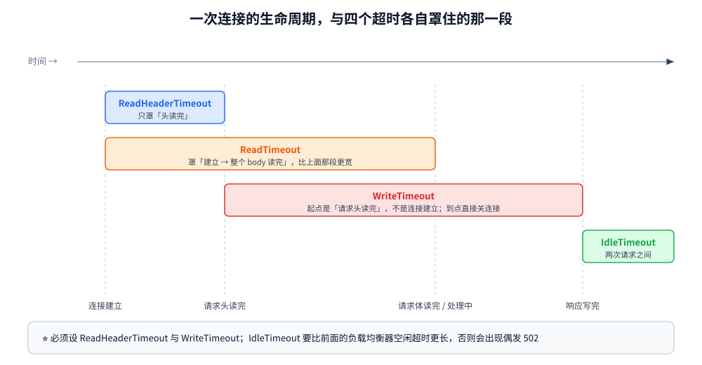
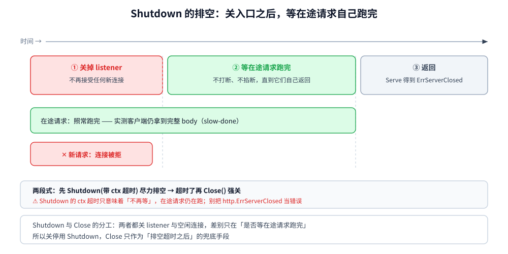

# HTTP 服务端与优雅关停

> 本篇覆盖 Go 的**服务端侧** `net/http`：`http.Server` 五个超时各防什么、`Handler` / `HandlerFunc` 与中间件的装饰器写法、
> **1.22 起的 `ServeMux` 路由增强**（方法 + 通配 + 优先级）、`Shutdown` 的排空语义与它自己的超时、`WriteTimeout` 打断慢响应、
> 以及 `http.Error` 这类响应侧细节。
> ⭐ 与 [HTTP客户端与连接池.md](HTTP客户端与连接池.md) 是**同一套库的两侧**：那篇讲"发请求"，本篇讲"收请求"。
>
> 内容整理自个人学习笔记，素材见 [素材清单.md](../../../素材清单.md)。

---

## 一、`http.Server` 由哪些参数构成

**本节要点**：`http.Server` 的零值**可以直接用**（有合理默认值），但**超时全都不限**——
这是生产事故的头号来源。这一节把每个超时"防的是什么"划清楚。

### 1.1 五个超时分别拦在哪一段

一个 HTTP 连接从建立到关闭，可以切成四段，五个超时各自罩住其中一段：

| 超时 | 罩住的区间 | 防的是什么 | 不设的后果 |
|---|---|---|---|
| `ReadHeaderTimeout` | 连接建立 → **请求头读完** | **慢速头攻击**（Slowloris） | 攻击者用极慢速度发头，连接被长期占住 |
| `ReadTimeout` | 连接建立 → **整个请求体读完** | 慢速 body（大文件上传卡住） | 同上，且能占住更多资源 |
| `WriteTimeout` | **请求头读完** → 响应写完 | 慢响应 & 慢客户端吸住连接 | 见第五节实测：**客户端拿到 EOF** |
| `IdleTimeout` | 一次响应写完 → 下一次请求头到达 | keep-alive 空闲连接占资源 | 空闲连接堆积 |
| `MaxHeaderBytes` | —（不是超时，是长度） | 巨型头撑爆内存 | 默认 1 MB，通常够用 |

⚠️ 三条容易搞错的细节：

1. **`ReadTimeout` 的起点是"连接建立"**，不是"收到第一个字节"——所以它**会**覆盖 `ReadHeaderTimeout` 的区间。
   两个都设时，`ReadHeaderTimeout` 实际上更严格（它只看头）。
2. **`WriteTimeout` 的起点是"请求头读完"**，对 **HTTPS** 来说启动时刻还要更晚一点（要等握手+读头）。
3. **`IdleTimeout` 只在 keep-alive 下有意义**；如果你返回了 `Connection: close`，连接用完就关，这个值不起作用。

⭐⭐ 实践口径：**`ReadHeaderTimeout` 和 `WriteTimeout` 一定要设**（它们是抗慢速攻击的基本盘），
`IdleTimeout` 按你前面的负载均衡器配置来（**必须比 LB 的空闲超时更长**，否则会出现"服务端先关连接"导致的偶发 502）。



### 1.2 其余几个值得设的字段

| 字段 | 作用 |
|---|---|
| `Handler` | 为 nil 时用 `http.DefaultServeMux`（⚠️ 全局变量，测试之间会互相污染） |
| `BaseContext` | 给每个连接一个基础 `context`（注入 trace / 关闭信号） |
| `ConnState` | 连接状态回调，用来数"当前有多少活跃连接" |
| `ErrorLog` | `*log.Logger`，默认走标准库 `log`（⚠️ 和 `slog` 是两套，见往下） |
| `MaxHeaderBytes` | 默认 `DefaultMaxHeaderBytes` = 1 MB |

⚠️ `ErrorLog` 默认写标准库 `log`（不带结构、不带级别）。要用 `slog` 得自己包一层 ——
细节见 [日志与错误规范.md](../工程实践/日志与错误规范.md)。

---

## 二、`Handler`、`HandlerFunc` 与中间件

**本节要点**：`net/http` 没有"框架式中间件"，它的扩展点只有**一个接口**：
`http.Handler`。所有中间件都是"接收一个 Handler、返回一个 Handler"的函数。

### 2.1 三层抽象

```go
// ① 接口：唯一的方法就是 ServeHTTP
type Handler interface {
    ServeHTTP(ResponseWriter, *Request)
}

// ② 函数适配器：把普通函数变成 Handler
type HandlerFunc func(ResponseWriter, *Request)

func (f HandlerFunc) ServeHTTP(w ResponseWriter, r *Request) { f(w, r) }

// ③ 路由器：ServeMux 本身也实现 Handler
var mux http.ServeMux
var _ http.Handler = &mux // ✅
```

⭐ 第 ③ 点是 `net/http` 组合能力的来源：**`ServeMux` 是 Handler，所以它也能被中间件包起来**，
也能被挂到另一个 `ServeMux` 的子路径下。

### 2.2 中间件就是装饰器

```go
func wrap(name string) func(http.Handler) http.Handler {
    return func(next http.Handler) http.Handler {
        return http.HandlerFunc(func(w http.ResponseWriter, r *http.Request) {
            // 进入：请求前
            next.ServeHTTP(w, r)
            // 退出：响应后
        })
    }
}
```

实测包裹顺序（**洋葱模型**）：

```text
  嵌套写法 A(B(handler)) → A-进入 → B-进入 → handler → B-退出 → A-退出
  切片写法 [A B]        → A-进入 → B-进入 → handler → B-退出 → A-退出
```

⭐ 两条实用结论：

1. **两种写法等价** —— 嵌套写法和"切片 + 反向包裹"只是可读性差别；中间件多时用切片写法（便于按配置增删）。
2. **"先进入的，最后退出"** —— 这决定了**顺序的语义**：
   日志 / 恢复 panic 的中间件要放在**最外层**（这样它能覆盖所有内层），
   鉴权 / 限流放在**订阅者之前**但**日志之内**（这样被拒的请求也有日志）。

⚠️ 一个高频事故：**`ResponseWriter` 被中间件包一层后，`http.Flusher` / `http.Hijacker` 这些可选接口会丢失** ——
除非你的包装类型显式转发它们。SSE / WebSocket 场景要特别注意。

---

## 三、1.22 起的路由增强

**本节要点**：Go 1.22 给 `ServeMux` 加了**方法匹配**和**路径通配**，
从此"用标准库起 API 服务"不再必须配第三方路由 —— 但**优先级规则必须记清**，否则会写出诡异的兜底行为。

### 3.1 模式语法与实测

```go
mux := http.NewServeMux()
mux.HandleFunc("GET /users/{id}", func(w http.ResponseWriter, r *http.Request) {
    fmt.Fprintf(w, "id=%s", r.PathValue("id"))
})
mux.HandleFunc("GET /users/me", func(w http.ResponseWriter, r *http.Request) {
    fmt.Fprint(w, "me")
})
mux.HandleFunc("POST /submit", func(w http.ResponseWriter, r *http.Request) {
    fmt.Fprint(w, "submitted")
})
```

实测（容器 go1.26.8）：

```text
  GET   /users/42    → 200 id=42
  GET   /users/me    → 200 me
  POST  /users/42    → 405 Method Not Allowed
  GET   /submit      → 405 Method Not Allowed
  GET   /nope        → 404 404 page not found
```

⭐ 三点从读数里直接读出来的结论：

1. **方法写进模式里**（`"GET /users/{id}"`）→ 路径匹配但方法不匹配时返回 **405**（而不是 404）；
   标准库会顺便带上 `Allow` 头。
2. **字面量段优先于通配**：`/users/me` 是字面量、`/users/{id}` 是通配，
   所以 `/users/me` 走前者 —— **不需要**像老框架那样靠"注册顺序"决定。
3. 路径和方法都不匹配才给 **404**，响应体是 `404 page not found`。

### 3.2 优先级规则

1.22 起的规则是**"最具体的模式胜出"**（不是注册顺序），具体程度从高到低：

```text
字面量段  >  {name}（单段通配）  >  {name...}（多段通配，只能放末尾）
```

⚠️ 三条坑：

1. **模式冲突会 panic**（在注册时，不是运行时）——比如注册了 `POST /x` 和 `POST /x/`。
   这是好事：早失败。
2. **`{name...}` 只能出现在模式末尾**；
3. **`r.PathValue("id")` 只在匹配到带该名字的模式时才有值**，取不到就是空字符串（**不报错**）——
   很容易把"没匹配上"静默当成"id 是空"。

### 3.3 与网关路由的分工

本仓另有一篇讲**网关侧**的路由：[网关路由匹配.md](网关路由匹配.md)，
它讲的是"三种 path 语义（精确 > 正则 > 最长前缀）+ 顺序写反会让兜底抢走请求"。

⭐ 分工判据：

| | 本篇（服务端 `ServeMux`） | [网关路由匹配.md](网关路由匹配.md) |
|---|---|---|
| 匹配什么 | 方法 + 路径（含单段/多段通配） | 前缀 / 正则 / 精确，**不含方法** |
| 谁在用 | 业务服务自己的 API 路由 | 反向代理转发到哪个上游 |
| 优先级来源 | **规范定义**（最具体胜出） | **你写的顺序**（易错） |
| 典型错误 | `PathValue` 取空静默通过 | 兜底 `/` 抢走所有请求 |

---

## 四、`Shutdown`：优雅关停的语义

**本节要点**：`Shutdown` 做两件事 —— **关掉入口（不再接新连接）** + **等在途请求跑完**。
它**不会**打断正在处理的请求，也不会杀长连接。

### 4.1 排空做了什么

实测：一个要跑 1.2 秒的 handler，在它跑到 150ms 时调用 `Shutdown(ctx)`（无超时）。

```text
Shutdown 返回 err = <nil>
  在途请求的客户端拿到 200 与完整 body？ true body="slow-done"
  排空期间新发起的请求是否失败？ true
  Serve 返回值是 http.ErrServerClosed？ true
```

⭐ 四个读数各自说明一件事：

| 读数 | 说明 |
|---|---|
| `Shutdown` 返回 `<nil>` | 它**阻塞到了在途请求跑完**才返回 |
| 在途请求拿到完整 body | 排空**不打断**正在处理的请求 |
| 新请求失败 | listener 已关闭，新连接直接被拒（`connection refused`） |
| `Serve` 返回 `http.ErrServerClosed` | ⚠️ 这是**正常退出**的信号，**不要当成错误处理** |

⚠️ 最后一条是极高频的 bug：很多人写

```go
if err := srv.ListenAndServe(); err != nil {
    log.Fatal(err) // ❌ 优雅关停时也会走到这里，然后进程以非零码退出
}
```

正确写法是显式排除：

```go
if err := srv.ListenAndServe(); err != nil && !errors.Is(err, http.ErrServerClosed) {
    log.Fatalf("listen: %v", err)
}
```



### 4.2 `Shutdown` 自己的超时

`Shutdown` 接受一个 `context`，**它自己的等待也受这个 ctx 约束**：

```text
handler 要 2s，Shutdown 的 ctx 只给 300ms：
  Shutdown 返回 err = context deadline exceeded
  errors.Is(err, context.DeadlineExceeded) = true
  它等满 ctx 才返回吗（0.2s < elapsed < 1s）？ true
```

⭐ 关键语义：**`Shutdown` 超时不会杀掉在途请求**，只是"不再等"然后返回错误。
返回之后，那些请求**仍在跑**，你需要自己决定是继续等还是 `Close()` 强杀。

⚠️ 所以标准的关停流程是**两段式**：

```text
① Shutdown(带超时)  → 尽力排空
② 如果它超时了      → 打日志说明"还有 N 个请求没跑完"，然后才 Close
```

### 4.3 `Shutdown` 和 `Close` 的区别

| | `Shutdown(ctx)` | `Close()` |
|---|---|---|
| 关 listener | ✅ | ✅ |
| 等在途请求 | ✅（受 ctx 约束） | ❌ 立刻切断 |
| 关空闲连接 | ✅ | ✅ |
| 返回 `ErrServerClosed` 的来源 | 两者都让 `Serve` 返回它 | 同 |

⭐ 结论：**关停用 `Shutdown`，`Close` 只作为"排空超时后的兜底"**。

---

## 五、`WriteTimeout` 与慢响应

**本节要点**：`WriteTimeout` 到点后的表现**不是"返回 500"**，而是**直接关连接** ——
客户端看到的是 `EOF`（响应不完整），而不是一个错误状态码。

```text
WriteTimeout=200ms，handler 睡 600ms 才写：
  客户端 err != nil？ true
  是 EOF 类错误？ true
  code=0 body=""
```

⭐ 这一点很重要：**超时是"连接级"的，不是"请求级"的**。
所以：

1. **客户端必须把 `EOF` 当作"服务端放弃了"** 来处理（幂等重试 / 降级），而不是当成"响应为空"；
2. **慢接口不能靠调大 `WriteTimeout` 解决** —— 应该改成异步任务（立刻返回 202 + 任务 ID）；
3. ⚠️ `WriteTimeout` 是**服务端视角**的"我从读完头开始算"，它**不包含**客户端读得慢的时间
   （那是 TCP 发送缓冲，由内核和进度控制）—— 但连接被它关掉后，客户端同样拿不到完整响应。

⚠️ 与 [HTTP客户端与连接池.md](HTTP客户端与连接池.md) 的 `Client.Timeout` 对照：
**两边都有超时，任何一边先到都会表现为"请求失败"**。
排查超时问题时必须把服务端 `WriteTimeout`、LB 超时、客户端超时**三个数放在一起看**。

---

## 六、响应侧的三件小事

**本节要点**：都是"不写也能跑，写错很难查"的细节。

### 6.1 `http.Error` 到底写了什么

```text
status = 418
Content-Type = "text/plain; charset=utf-8"
body = "boom happened\n"（注意结尾的换行）
```

⭐ 它会替你：**设 `Content-Type`、调 `WriteHeader`、并在正文末尾补一个 `\n`**。
最后这个换行是 `net/http` 的惯例（便于 curl 观察），但如果你在和前端对齐错误格式（JSON），
**不要用它** —— 自己写 `w.Header().Set("Content-Type", "application/json")` 再 `Write`。

### 6.2 响应头必须在 `Write` 之前设

```go
w.Header().Set("X-Trace-Id", id) // ✅ Header() 返回的是"将要发出的头"
w.Write([]byte("ok"))            // ⚠️ 这次 Write 会触发 WriteHeader(200)
w.Header().Set("X-Late", "x")    // ❌ 已经晚了，会被忽略（且无任何报错）
```

⚠️ 这个错误**完全静默**：头没发出去，日志里也没有痕迹。
所以中间件里**所有**要设的头，都必须在调用内层 handler **之前**设好。

### 6.3 服务端也要管请求体的关闭

`http.Server` 会自动关闭请求体，但**如果你提前返回（比如鉴权失败）而不读完 body**，
`net/http` 可能无法复用这条连接（会尝试 drain，但有上限）。
如果请求体很大且你不需要它，最后 `defer r.Body.Close()` 是个便宜的习惯。

---

## 使用：一份可抄的优雅关停骨架

**本节要点**：把超时、路由、中间件、信号处理、两段式关停收在一个文件里。

```go
package main

import (
	"context"
	"errors"
	"log/slog"
	"net/http"
	"os"
	"os/signal"
	"syscall"
	"time"
)

func main() {
	mux := http.NewServeMux()
	mux.HandleFunc("GET /healthz", func(w http.ResponseWriter, r *http.Request) {
		w.WriteHeader(http.StatusOK)
	})
	mux.HandleFunc("GET /users/{id}", func(w http.ResponseWriter, r *http.Request) {
		id := r.PathValue("id")
		if id == "" { // ⚠️ 取不到名字时是空串，不报错 —— 要自己判
			http.Error(w, "id required", http.StatusBadRequest)
			return
		}
		w.Write([]byte("user " + id))
	})

	srv := &http.Server{
		Addr:              ":8080",
		Handler:           recoverMW(logMW(mux)), // 顺序：recover 在最外、log 在内
		ReadHeaderTimeout: 5 * time.Second,       // ⭐ 抗慢速头
		ReadTimeout:       30 * time.Second,
		WriteTimeout:      30 * time.Second, // ⭐ 覆盖慢响应
		IdleTimeout:       90 * time.Second, // ⭐ 要比 LB 的空闲超时更长
		BaseContext: func(net.Listener) context.Context {
			return context.Background()
		},
	}

	// 监听放到独立的 goroutine，主流程去等信号
	errCh := make(chan error, 1)
	go func() {
		if err := srv.ListenAndServe(); err != nil && !errors.Is(err, http.ErrServerClosed) {
			errCh <- err
		}
		close(errCh)
	}()

	ctx, stop := signal.NotifyContext(context.Background(), os.Interrupt, syscall.SIGTERM)
	defer stop()

	select {
	case err := <-errCh:
		slog.Error("server failed", "err", err)
		os.Exit(1)
	case <-ctx.Done():
		slog.Info("shutdown signal received")
	}

	// 两段式关停：先尽力排空，超时了再强关
	shutCtx, cancel := context.WithTimeout(context.Background(), 20*time.Second)
	defer cancel()
	if err := srv.Shutdown(shutCtx); err != nil {
		slog.Warn("graceful shutdown timed out, forcing close", "err", err)
		_ = srv.Close()
	}
	slog.Info("server stopped")
}
```

**六条可以固化进团队规范的**：

1. **`ReadHeaderTimeout` / `WriteTimeout` / `IdleTimeout` 必须显式设**，且 `IdleTimeout` > LB 的空闲超时；
2. **`ErrServerClosed` 不是错误** —— 别让优雅关停走到 `log.Fatal`；
3. **关停两段式**：`Shutdown(带超时)` → 失败再 `Close()`；
4. **中间件顺序**：recover / 日志在最外层，鉴权 / 限流在内层；
5. **`PathValue` 取空要自己判**（它不报错）；
6. **响应头在 `Write` 之前设完**（晚了会被静默忽略）。

---

## 延伸追问

- **`http.Server` 的零值能用吗？** → 能用（`Handler` 为 nil 时落到 `DefaultServeMux`，地址默认 `:http`），
  但**超时全都不限**，生产上必须显式设（第一节）。
- **`ReadTimeout` 和 `ReadHeaderTimeout` 要都设吗？** → 要。前者覆盖整个请求体、后者只管头，
  抗 Slowloris 靠的是后者（它更严格）。
- **`ServeMux` 的模式匹配靠注册顺序吗？** → **不靠**。1.22 起是"最具体胜出"（字面量 > 单段通配 > 多段通配），
  实测 `/users/me` 优先于 `/users/{id}`（3.1）。模式冲突会在**注册时 panic**。
- **`Shutdown` 会打断正在处理的请求吗？** → 不会。它关掉入口后**等着**在途请求跑完（4.1 实测：客户端仍拿到完整 body）。
  只有它自己的 `ctx` 超时才会"不再等"。
- **`Shutdown` 超时后在途请求会怎样？** → 仍在跑。需要自己决定继续等还是 `Close()` 强杀（4.2）。
- **优雅关停时 `ListenAndServe` 返回什么？** → `http.ErrServerClosed`。
  ⚠️ 它表示"正常退出"，不判断会让进程以非零码结束（4.1）。
- **`WriteTimeout` 到点客户端收到什么？** → `EOF`（连接被关），**不是**错误状态码，`code=0`（第五节实测）。
- **`http.Error` 能用来返回 JSON 错误吗？** → 不推荐。它固定 `text/plain` 且**末尾补换行**（6.1 实测）。
- **中间件包了 `ResponseWriter` 后 SSE 为什么用不了？** → 可选的 `http.Flusher` / `http.Hijacker` 接口在包装类型上丢失了，
  需要显式实现并转发（2.2）。

## 关联

- [HTTP客户端与连接池.md](HTTP客户端与连接池.md) — **同一套库的另一侧**：`Client`/`Transport`/连接池与超时三件套
- [net包与TCP-UDP编程.md](net包与TCP-UDP编程.md) — 更底层：粘包拆包、deadline、`bufio`
- [网关路由匹配.md](网关路由匹配.md) — **网关侧**路由：前缀 / 正则 / 精确与顺序陷阱（与第三节目的一节做分工对照）
- [从零实现网关.md](从零实现网关.md) — 服务端在网关里的另一副面孔（反向代理）
- [不使用protoc的gRPC.md](不使用protoc的gRPC.md) — HTTP/2 之上的另一套服务端写法
- [context.md](../工程实践/context.md) — `BaseContext`、请求级 ctx 与超时预算
- [日志与错误规范.md](../工程实践/日志与错误规范.md) — `slog` 与 `Server.ErrorLog` 两套日志怎么统一
- [测试与Mock.md](../工程实践/测试与Mock.md) — `httptest` 两种用法（`NewServer` / `NewRecorder`）
- [README.md](../README.md) — 本目录导读
- [素材清单.md](../../../素材清单.md) — 素材来源登记
