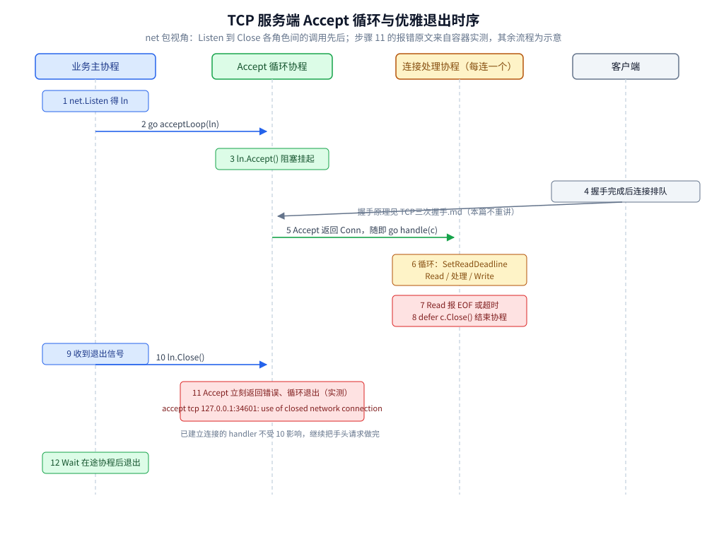
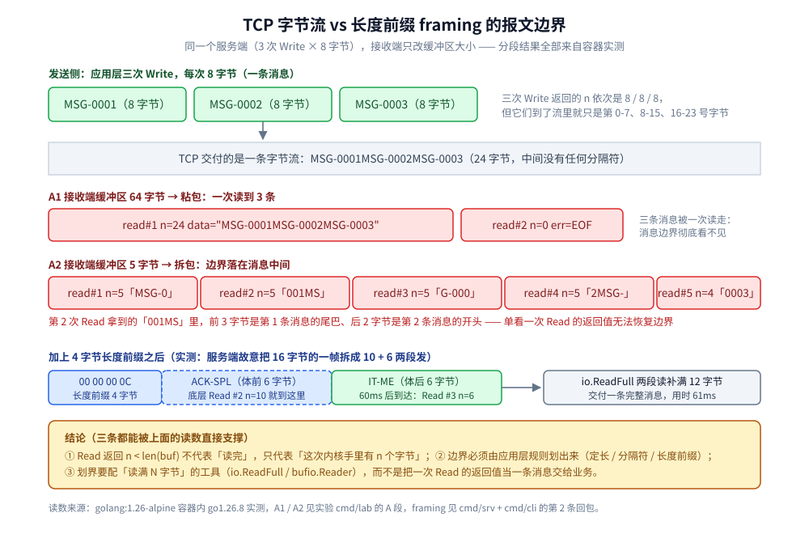

# net包与TCP-UDP编程

> 从 `net` 包的 `Listener` / `Conn` / `PacketConn` 三个接口出发，讲 TCP/UDP 在 Go 里**怎么写**：
> 监听与 Accept 循环、读写循环、粘包拆包的三种解法、deadline 与超时、socket 选项默认值、
> UDP 报文语义与丢包实测、Unix domain socket。TCP/UDP 的协议层原理（握手、挥手、窗口、可靠性）
> 本篇一律不重讲，只给一句结论加链接。
>
> 内容整理自个人学习笔记，素材见 [素材清单.md](../../../素材清单.md)。
>
> ⚠️ 本篇全部读数来自容器 `golang:1.26-alpine`（`go version go1.26.8 linux/amd64`）真跑，
> 服务端与客户端**都在同一个容器里连 127.0.0.1**；源码摘录取自该容器的 `/usr/local/go/src`，
> 用 `cat` / `grep` 取出后原样复制。

---

## 一、net 包的三个核心抽象是什么？

**本节要点**：`net` 包把一切协议收敛成三种对象——**面向流的 `Conn`、面向报的 `PacketConn`、负责进门的 `Listener`**。
后面所有写法（骨架、超时、拆包）都建立在这三个接口上。

### 1.1 三个接口的方法集（源码原样）

`Listener` 最短，整个接口如下（`/usr/local/go/src/net/net.go`，注释未删）：

```go
// A Listener is a generic network listener for stream-oriented protocols.
//
// Multiple goroutines may invoke methods on a Listener simultaneously.
type Listener interface {
	// Accept waits for and returns the next connection to the listener.
	Accept() (Conn, error)

	// Close closes the listener.
	// Any blocked Accept operations will be unblocked and return errors.
	Close() error

	// Addr returns the listener's network address.
	Addr() Addr
}
```

`Conn`（流）与 `PacketConn`（报文）的方法签名**原样**如下，注释从略（核验方式见本节末）：

```go
type Conn interface {
	Read(b []byte) (n int, err error)
	Write(b []byte) (n int, err error)
	Close() error
	LocalAddr() Addr
	RemoteAddr() Addr
	SetDeadline(t time.Time) error
	SetReadDeadline(t time.Time) error
	SetWriteDeadline(t time.Time) error
}

type PacketConn interface {
	ReadFrom(p []byte) (n int, addr Addr, err error)
	WriteTo(p []byte, addr Addr) (n int, err error)
	Close() error
	LocalAddr() Addr
	SetDeadline(t time.Time) error
	SetReadDeadline(t time.Time) error
	SetWriteDeadline(t time.Time) error
}
```

三行结论：

- `Conn` 的文档注释写明 **"Conn is a generic stream-oriented network connection"**，一次 `Read` 与
  一条消息**没有任何对应关系**——这是第四节全部内容的根源；
- `PacketConn` 没有 `Read`/`Write`，只有 `ReadFrom`/`WriteTo`，**每次调用恰好一个报文**，
  报文边界由接口保留（第八节实测）；
- 两个接口都声明 **Multiple goroutines may invoke methods on a ... simultaneously**，
  即并发调用安全，但**不保证同一连接上的写交错成什么顺序**（4.2 的写锁就是补这个）。

> 核验方式：`docker run --rm golang:1.26-alpine cat /usr/local/go/src/net/net.go`（接口定义在 400~424 行附近）；
> 带全注释版本用 `docker run --rm golang:1.26-alpine go doc net.Conn` 取得。

### 1.2 network 与 address 怎么写

`Listen` / `Dial` 的第一个参数 `network`、第二个参数 `address` 的组合规则：

| network | 语义 | address 示例 |
|---|---|---|
| `tcp` | TCP，双栈优先（见 7.4） | `:8080`、`127.0.0.1:8080` |
| `tcp4` / `tcp6` | 强制 IPv4 / 只收 IPv6 | `[::1]:8080`（IPv6 必须方括号） |
| `udp` / `udp4` / `udp6` | 同上，数据报 | `:53`、`127.0.0.1:53` |
| `unix` / `unixgram` / `unixpacket` | Unix 域 socket（流/报/SOCK_SEQPACKET） | `/tmp/app.sock`（路径就是地址） |

地址里可以不带端口（`":8080"` 通配所有网卡）；`ResolveTCPAddr` 会先做 DNS 再拆结构，
容器实测（`net.ResolveTCPAddr` 输出，`Network` 方法为 Go 1.25+ 形态）：

```text
=== E. ResolveTCPAddr 的解析结果 ===
ResolveTCPAddr("tcp", "localhost:80") -> Network=tcp IP=127.0.0.1 Port=80
ResolveTCPAddr("tcp4", "localhost:80") -> Network=tcp IP=127.0.0.1 Port=80
ResolveTCPAddr("tcp", "127.0.0.1:8080") -> Network=tcp IP=127.0.0.1 Port=8080
```

两个容易踩的点：`tcp4` 解析后 `Network()` 也显示 `tcp`（族信息落在 `IP` 的内容里，不在字符串里）；
`ResolveTCPAddr` 这类 `Resolve*Addr` 是**会做 DNS 的**，`Dial("tcp", "域名:端口")` 内部就是它——
所以「Dial 卡住」有一半时间在等 DNS，排障时先把域名换成 IP 验证（DNS 本身见
[DNS解析.md](../../../02-计算机基础/网络/DNS解析.md)）。

## 二、TCP 服务端的最小骨架长什么样？

**本节要点**：`Listen → Accept → 每连接一协程 → 读写循环 → Close` 五步；
外加一个必须实测才知道的行为——`Listener.Close()` 会把阻塞中的 `Accept` 唤醒。

### 2.1 二十行骨架

```go
func handle(c net.Conn) {
	defer c.Close() // ⑤ 无论怎么结束都关掉这条连接
	for {
		// ④ 帧格式：4 字节大端长度 + 消息体（见 4.2）
		var head [4]byte
		if _, err := io.ReadFull(c, head[:]); err != nil {
			return // EOF / 超时 / 对端重置，一律退循环
		}
		n := binary.BigEndian.Uint32(head[:])
		body := make([]byte, n)
		if _, err := io.ReadFull(c, body); err != nil {
			return
		}
		if _, err := c.Write(append(head[:], body...)); err != nil {
			return // echo 回原帧
		}
	}
}

func main() {
	ln, err := net.Listen("tcp", ":8080") // ① 进门
	if err != nil {
		log.Fatal(err)
	}
	defer ln.Close() // ② 退出时唤醒 Accept（行为见 2.3）
	for {
		c, err := ln.Accept() // ③ 阻塞等待「已完成握手」的连接
		if err != nil {
			log.Println("accept 退出:", err)
			return
		}
		go handle(c) // ④ 每条连接一个协程
	}
}
```

`Accept` 拿到的是**三次握手已完成、已在内核 accept 队列里排队**的连接；握手本身由内核完成，
Go 代码感知不到半连接（握手与 backlog 的协议原理见
[TCP三次握手.md](../../../02-计算机基础/网络/tcp/TCP三次握手.md)）。

### 2.2 「每连接一协程」是什么模型？

阻塞的 `Accept` / `Read` **不占用操作系统线程**：连接注册进 netpoll（epoll/kqueue/IOCP），
协程 park，数据到达时由 netpoll 唤醒——机制与 `net.Listener` 的挂起点见
[IO多路复用.md](../../../02-计算机基础/网络/IO多路复用.md)。所以一机数万条连接的常规写法就是
一连接两协程（读协程 + 写协程，或一读循环一发送队列），连接数、读写超时、优雅退出的完整协程
组织方式见 [goroutine实战模式.md](../并发编程/goroutine实战模式.md)。

### 2.3 Close 之后阻塞中的 Accept 会怎样？（实测）

容器实测：起 `Listen`，一个协程阻塞在 `Accept`，100 ms 后主协程调 `ln.Close()`——

```text
=== B. 协程阻塞在 Accept 时 Close 监听器 ===
ln.Close() 返回: <nil>
阻塞中的 Accept 返回: accept tcp 127.0.0.1:34601: use of closed network connection
```

三个结论：`Close` 唤醒 `Accept` 且报错固定为 `use of closed network connection`；
`Accept` 收到错误后**必须自己判错退出循环**，否则死循环刷错误；
已经 `Accept` 出来的连接**不受 `ln.Close()` 影响**，handler 可以继续把手头请求做完。

由此得到优雅退出的标准三步（时序见图）：



图怎么读：四条竖线是四个角色（业务主协程、Accept 循环协程、每连接一个的处理协程、客户端）。
1~5 是启动与接流量：`net.Listen` 拿到 `ln` → `go acceptLoop` → `Accept` 挂起 →
客户端握手完成、连接入队 → `Accept` 返回 `Conn` 并立刻 `go handle(c)`。
6~8 是单条连接的一生：设 deadline 的读处理写循环，`Read` 报 EOF 或超时后 `defer c.Close()`。
9~12 是退出：收到信号后 `ln.Close()`（第 10 步），`Accept` **立刻**带着
`use of closed network connection` 返回（第 11 步，容器实测原文），主协程再等待在途
handler 结束。图中只有第 11 步的报错原文来自实测，其余步骤为流程示意。

```go
// main 里的优雅退出（signal 包在容器里同样可用）
stop := make(chan os.Signal, 1)
signal.Notify(stop, syscall.SIGINT, syscall.SIGTERM)
<-stop
ln.Close()   // 停接新连接，Accept 循环按实测报错退出
wg.Wait()    // 等在途的 handle 收尾（每个 handle 里 wg.Done）
```

另一种写法用 `context`：`net.ListenConfig{}.Listen(ctx, ...)` 的 ctx 只管**解析与监听建立阶段**，
管不了已建立的连接；要「ctx 取消即断连」得配合 `SetDeadline` 或 `Close`（见 6.3 与
[context.md](../工程实践/context.md)）。

## 三、客户端的连接与超时怎么写？

**本节要点**：`net.Dial` 没有总超时；报错原文长什么样、`Dialer` 各字段管哪一段。

### 3.1 Dial 与 DialTimeout

```go
conn, err := net.Dial("tcp", "127.0.0.1:8080")          // 无超时（除 OS 级 SYN 重试）
conn, err := net.DialTimeout("tcp", addr, 3*time.Second) // 带 connect 超时
```

连一个没人监听的端口，回环上内核立刻回 RST，报错原文（容器实测）：

```text
=== A. 连一个没人听的端口 ===
Dial err = dial tcp 127.0.0.1:34599: connect: connection refused
```

`connection refused` 与 `i/o timeout` 是两类问题：前者是**对端明确说没有**（进程没起、端口错），
秒回；后者通常是中间被丢包（防火墙 drop、IP 不通）。`DialTimeout` 只覆盖「建连」这一段，
**不管建连之后的读写**——读写超时是第六节的 deadline 的事。

### 3.2 Dialer 的字段

需要超时、keep-alive、本地地址、DNS 回调等任何一项时，就别用包级函数，改用 `Dialer`：

```go
d := net.Dialer{
	Timeout:   5 * time.Second, // 覆盖 DNS + 握手
	KeepAlive: 30 * time.Second, // 零值 = 默认 15s，负值 = 关闭，见 7.2
	LocalAddr: &net.TCPAddr{Port: 0},
}
conn, err := d.DialContext(ctx, "tcp", "api.example.com:443") // ctx 取消即放弃建连
```

`DialContext` 的 ctx 只能取消「还没连上」的阶段；连上以后想按 ctx 断流，见 6.3。

## 四、粘包与拆包怎么真实地发生、怎么解？

**本节要点**：`Conn.Read` 一次读到多少由内核接收缓冲区此刻有多少字节决定；
消息边界必须由应用层规则划出来。以下全部是容器实测原文。

### 4.1 形态实测：并包与拆包

发送端把三条 8 字节消息分三次 `Write`（`MSG-0001`、`MSG-0002`、`MSG-0003`），
**只改接收端缓冲区大小**：64 字节缓冲一次读走了全部 24 字节（并包），
5 字节缓冲则把消息从中间切开（拆包）：

```text
A1 接收端缓冲区 64 字节（三条都已到达）：
  read#1 n=24 data="MSG-0001MSG-0002MSG-0003"
  read#2 n=0 data=""
  read#3 err=EOF

A2 接收端缓冲区 5 字节（同样三条都已到达）：
  read#1 n=5 data="MSG-0"
  read#2 n=5 data="001MS"
  read#3 n=5 data="G-000"
  read#4 n=5 data="2MSG-"
  read#5 n=4 data="0003"
  read#6 n=0 data=""
  read#7 err=EOF
```

注意 `read#2` 里的 `"001MS"`——前 3 字节是第一条消息的尾巴、后 2 字节是第二条的开头，
**单看一次 `Read` 的返回值无法恢复消息边界**。两个方向还有更极端的实测：
两个 goroutine 各裸写 4 条 7 字节消息（共 8 条），服务端一次 `Read(4096)` 把 8 条全读回来——
「一次 `Read` 一条消息」的假设直接破产；反过来，一条声明长度 300 的帧，
用 8 字节小缓冲去读，`Read` 调了 **38 次**才凑满（每次内核手里有多少就给多少）：

```text
=== 实验 1：Conn.Read 是流不是消息（两个 goroutine 并发裸写 8 条）===
[1] 服务端把每次 Read 的返回当成一条消息，收到 1 条：
    #1 len=56 "AAAA-1;AAAA-2;AAAA-3;AAAA-4;BBBB-1;BBBB-2;BBBB-3;BBBB-4;"

=== 实验 4：一条 300 字节的 framed 消息，小缓冲区要读多少次 ===
    声明长度 300；8 字节缓冲的 Read 调用 38 次，累计 300 字节
```

### 4.2 三种划界规则与代码



图怎么读：上半部分是 4.1 的两组实测读数（A1 并成一次读、A2 切成五次读），
中间灰条强调「三条消息进了流就只是第 0~23 号字节」；下半部分是一帧 `00 00 00 0C + 12字节体`
被服务端**故意**拆成 10+6 两段发出（间隔 60 ms），接收端用 `io.ReadFull` 两段补齐、
61 ms 后交付一条完整消息。图内读数与 4.1、4.2 的容器实测一致。

| 划界规则 | 读法 | 上限坑 |
|---|---|---|
| **定长**（每帧固定 N 字节） | `io.ReadFull(c, buf[:N])` | 变长字段要填充，带宽浪费；协议一旦改长度要双端同步 |
| **分隔符**（如换行） | `bufio.Scanner` 一行一条 | 正文里不能出现分隔符（要转义）；默认单 token 上限 **64 KB**（见 4.3） |
| **长度前缀**（头 + 体） | `io.ReadFull` 先读头再按头读体 | 头本身要定长（常见 4 字节大端）；必须校验声明长度上限，否则一个坏头就分配天文数字内存 |

长度前缀的一对函数（`## 使用` 节的完整程序用的就是它们）：

```go
func readFrame(r io.Reader) ([]byte, error) {
	var head [4]byte
	if _, err := io.ReadFull(r, head[:]); err != nil {
		return nil, err
	}
	n := binary.BigEndian.Uint32(head[:])
	if n > 4<<20 { // 上限防护
		return nil, fmt.Errorf("帧长超限: %d", n)
	}
	body := make([]byte, n)
	if _, err := io.ReadFull(r, body); err != nil {
		return nil, err
	}
	return body, nil
}

func writeFrame(w io.Writer, body []byte) error {
	buf := make([]byte, 4+len(body))
	binary.BigEndian.PutUint32(buf, uint32(len(body)))
	copy(buf[4:], body)
	_, err := w.Write(buf) // 整帧一次 Write，不在 syscall 层交错
	return err
}
```

拆包后还能补齐的实测（服务端把一帧 4+12 字节故意拆成 10 + 6 两段发、间隔 60 ms）：

```text
N. 一帧 4+12 字节被服务端故意拆成 10+6 两段发（间隔 60ms），接收端用 io.ReadFull：
  声明长度 12，io.ReadFull 最终拿到 "ACK-SPL IT-M"，err=<nil>，用时 61ms
```

**写侧两条纪律**（都有实验支撑）：`writeFrame` 把 header 和 body 拼进同一个切片一次写出——
若分成两次 `Write` 且多 goroutine 并发，另一 goroutine 的头可能插在你头尾之间（本次实测 8 帧
侥幸完好，但没有任何机制保证；交错后长度头会变成垃圾值，所以上面的 `n > 4<<20` 防护不是摆设）；
同一连接上多 goroutine 写时，**整帧写出外面还要包一层写互斥锁**，实测「长度头 + 整帧一次
Write + 写锁」后服务端完整收齐 8/8 帧。字节流的这些性质与序列化格式怎么选无关——
长度前缀本身就是最朴素的自描述帧，更多方案见
[数据序列化.md](../../../02-计算机基础/网络/数据序列化.md)。

### 4.3 bufio.Scanner 的 64KB 上限（实测）

按行协议直接用 `bufio.NewScanner` 很省事，但默认上限一撞就炸（服务端先读 4 字节的
`ping` 行、再读一条 70000 字节的长行；容器实测原文，`err` 行为 `Scanner.Err()`）：

```text
=== G. bufio.Scanner 按行拆包：默认上限 64KB ===
默认上限、行长 70000：成功扫出 1 行 [4]，Scanner 报错原文 = bufio.Scanner: token too long
sc.Buffer 放宽到 128KB、行长 70000：成功扫出 2 行 [4 70000]，err = read tcp 127.0.0.1:34610->127.0.0.1:38044: i/o timeout
默认上限、行长 60000：成功扫出 2 行 [4 60000]，err = read tcp 127.0.0.1:34610->127.0.0.1:46670: i/o timeout
```

后两行的 `i/o timeout` 是实验本身设的 5 秒读超时（行读完后对端不再发数据），不是分帧失败。
上限常量在标准库里写着（`/usr/local/go/src/bufio/scan.go`，注释原样）：

```go
	// MaxScanTokenSize is the maximum size used to buffer a token
	// unless the user provides an explicit buffer with [Scanner.Buffer].
	// The actual maximum token size may be smaller as the buffer
	// may need to include, for instance, a newline.
	MaxScanTokenSize = 64 * 1024
```

超限后 `Scan()` 返回 false、`Err()` 即上面那句 `bufio.Scanner: token too long`——
**注意 Scanner 一旦报错就不可恢复，只能关连接**；对端一行没写完就断线时 `Scan()` 也只是
安静地返回 false，要区分「正常 EOF」和「半行」得看 `Err()`。放宽的方式是 `sc.Buffer(buf, max)`
（实测 128 KB 后 70000 字节行正常扫出，见上面第二行），但这等于给每条连接的内存开了个
max 的下注——**上限要和连接数一起算**，按行喂数据的来源不可控时优先考虑长度前缀。

## 五、什么时候必须用 bufio.Reader/Writer？

**本节要点**：`Conn` 每次 `Read` 至少一趟 netpoll 往返；逐字节读流必须套缓冲，搬运大块数据直接 `io.Copy`。

容器实测：服务端一条连接写完 200000 字节后关闭，客户端用三种方式读干净，同一程序跑 3 次
（耗时受宿主调度影响有波动，只断言量级趋势）：

| 客户端读法 | 单次运行耗时（3 次区间） |
|---|---|
| 逐字节：裸 `c.Read`，1 字节缓冲 | 430 ~ 826 ms |
| 逐字节：`bufio.Reader.Read`，1 字节缓冲 | 2.24 ~ 3.57 ms |
| 块读：裸 `c.Read`，32 KB 缓冲 | 0.55 ~ 0.93 ms |
| `io.Copy(io.Discard, c)` | 0.81 ~ 1.08 ms |

其中一次运行的原样输出：

```text
=== H. 读完 200000 字节：逐字节裸 Read vs bufio vs 32KB 块 ===
  逐字节 c.Read(1字节缓冲)              826.30 ms
  逐字节 bufio.Reader.Read            3.57 ms
  32KB 缓冲 c.Read                   0.93 ms
  io.Copy(Discard) 复制 200000 字节      1.08 ms
```

趋势断言：**逐字节裸 `Read` 比其余读法慢约两个数量级**（每字节一次接口调用 + 一次 netpoll
往返，见 [IO多路复用.md](../../../02-计算机基础/网络/IO多路复用.md)）；`bufio` 把「一次一字节」
摊薄成「一次一屏」。判据：

- **按字节 / 按行 / 按分隔符消费流**（自定义文本协议、RESP、HTTP 头解析）→ 必须 `bufio.Reader`；
  反过来，**块大小本来就够大、一次 `Read` 收满整块**时套 `bufio` 是白拷一遍内存；
- **连接 → 连接搬运**（代理、转发）→ 直接 `io.Copy` / `io.CopyBuffer`，别自己写循环；
  `*TCPConn` 之间还能靠 `ReadFrom`/`WriteTo` 接口走 splice 零拷贝路径；
- 写侧同理：`bufio.Writer` 攒满或显式 `Flush` 才落内核——**忘 Flush 数据就停在用户态**，
  进程崩溃即丢；对「写完立刻可见」有要求的（如心跳）要么小缓冲要么勤 Flush。

## 六、deadline 与超时长什么样？

**本节要点**：三种 deadline 的真实报错原文、超时判定的标准写法、续期与 Context 取消连接。

### 6.1 真实报错与判定写法

容器实测：`Accept` 后设 200 ms 读超时、对端不发数据，`Read` 的返回与三种判定：

```text
=== C. SetReadDeadline 超时后的报错原文 ===
Read n=0 err = read tcp 127.0.0.1:34602->127.0.0.1:48460: i/o timeout
errors.As(*net.OpError): true
errors.As(net.Error) 且 Timeout(): true
errors.Is(err, os.ErrDeadlineExceeded): true
续期后再 Read: n=0 err=read tcp 127.0.0.1:34602->127.0.0.1:48460: i/o timeout（对端仍没发数据，300ms 后又是一次 i/o timeout）
```

`net` 包文档对超时的承诺（`/usr/local/go/src/net/net.go` 的 `Conn.SetDeadline` 注释，原样）：

```go
	// If the deadline is exceeded a call to Read or Write or to other
	// I/O methods will return an error that wraps os.ErrDeadlineExceeded.
	// This can be tested using errors.Is(err, os.ErrDeadlineExceeded).
	// The error's Timeout method will return true, but note that there
	// are other possible errors for which the Timeout method will
	// return true even if the deadline has not been exceeded.
	//
	// An idle timeout can be implemented by repeatedly extending
	// the deadline after successful Read or Write calls.
```

落地判据：**区分「超时」与「对端关闭」用 `errors.Is(err, os.ErrDeadlineExceeded)`**
（对端正常关闭拿到的是 `EOF`，异常重置是 `read: connection reset by peer`）；
`net.Error.Timeout()` 也能用，但文档明说它会把非 deadline 引起的偶发超时也算进来。
三种 deadline 是独立设置的：`SetReadDeadline` / `SetWriteDeadline` 各管一边，
`SetDeadline` 两边同时设；`SetWriteDeadline` 的注释提醒超时的 `Write` 可能已经写出去一部分
（`n > 0`），**不能假定「写超时 = 什么都没写」**。

### 6.2 续期的正确写法

deadline 是**一个绝对时刻**，不是「空闲多久」——超时之后连接并没有作废，把时刻推回未来即可
继续用（上面实测第 5 行：续期后再次 `Read`，得到的是新一次超时而不是 `use of closed`）。
空闲超时的标准写法是**每轮成功后重设**：

```go
for {
	_ = c.SetReadDeadline(time.Now().Add(30 * time.Second)) // 每轮续期 = 空闲 30s 超时
	if _, err := readFrame(c); err != nil {
		return
	}
}
```

只在连接建立时设一次 `SetDeadline(now+30s)`，等于 30 秒后**必死**，连接再忙也一样。

### 6.3 用 Context 取消连接

建连阶段直接 `Dialer.DialContext(ctx, ...)`（ctx 取消 = 放弃握手，报错原文为
`dial tcp ...: i/o timeout` 一类，随取消时机而异，本篇未逐种实测）。已建立的连接没有
context 参数，标准做法是用 `context.AfterFunc`（Go 1.21+）把「ctx 结束」翻译成「关连接」：

```go
stop := context.AfterFunc(ctx, func() { _ = conn.Close() })
defer stop()
```

`Close` 会按接口文档的承诺唤醒阻塞中的 `Read`（报 `use of closed network connection`，
即 2.3 实测的同一种错误）。另一条路是 `SetDeadline(time.Now())` 触发一次 i/o timeout 后退循环；
区别在于 **`Close` 之后不能再用，deadline 续期后可以**——想「软中断」连接（先让当前读写报错、
再决定关不关）就用后者。更多 ctx 用法见 [context.md](../工程实践/context.md)。

## 七、TCP 连接的选项默认值 Go 都替我设了吗？

**本节要点**：`TCP_NODELAY` 默认开、keep-alive 默认 15 s、监听器默认 `SO_REUSEADDR`、
`":8080"` 实际绑双栈——四条全部有源码或实测依据。

### 7.1 TCP_NODELAY：默认就是关 Nagle（源码）

`/usr/local/go/src/net/tcpsock.go`，每个新 `TCPConn` 的第一行（原样）：

```go
func newTCPConn(fd *netFD, keepAliveIdle time.Duration, keepAliveCfg KeepAliveConfig, preKeepAliveHook func(*netFD), keepAliveHook func(KeepAliveConfig)) *TCPConn {
	setNoDelay(fd, true)
```

`SetNoDelay` 的文档注释也写明默认值（原样）：

```go
// packet transmission in hopes of sending fewer packets (Nagle's
// algorithm).  The default is true (no delay), meaning that data is
// sent as soon as possible after a Write.
func (c *TCPConn) SetNoDelay(noDelay bool) error {
```

即：**Go 默认每次 `Write` 尽快发出，不攒包**。Nagle 算法本身的机制（攒小包、延迟确认交互、
请求-响应协议上的 40 ms 卡顿）本篇不展开，见
[TCP的Nagle与延迟确认.md](../../../02-计算机基础/网络/tcp/TCP的Nagle与延迟确认.md)。
`SetNoDelay(false)` 的开/关延迟对比**未实测**——容器回环上 ACK 即达，Nagle 的等待窗口无法稳定复现。

### 7.2 SO_KEEPALIVE：默认开，空闲 15 秒探测（源码）

`/usr/local/go/src/net/dial.go` 常量块（原样）：

```go
	// defaultTCPKeepAliveIdle is a default constant value for TCP_KEEPIDLE.
	// See go.dev/issue/31510 for details.
	defaultTCPKeepAliveIdle = 15 * time.Second

	// defaultTCPKeepAliveInterval is a default constant value for TCP_KEEPINTVL.
	// It is the same as defaultTCPKeepAliveIdle, see go.dev/issue/31510 for details.
	defaultTCPKeepAliveInterval = 15 * time.Second

	// defaultTCPKeepAliveCount is a default constant value for TCP_KEEPCNT.
	defaultTCPKeepAliveCount = 9
```

`Dialer.KeepAlive` 字段的文档（原样节选）：零值按默认 15 秒发探测、**负值直接关闭 keep-alive**；
Go 的 15 s 比 Linux 内核默认的 7200 s（2 小时）激进得多——`SO_KEEPALIVE` 探测的是
「对端协议栈还在不在」，**不等于应用层心跳**，对比表见
[TCP的Nagle与延迟确认.md](../../../02-计算机基础/网络/tcp/TCP的Nagle与延迟确认.md)；
逐连接精细控制探测参数用 `Dialer.KeepAliveConfig`（Go 1.23+），落地写法见
[TCP滑动窗口.md](../../../02-计算机基础/网络/tcp/TCP滑动窗口.md) 的「使用一」一节。

### 7.3 SO_REUSEADDR：监听器默认设置（源码 + 实测）

调用点 `/usr/local/go/src/net/sock_posix.go:152`：

```go
	if err = setDefaultListenerSockopts(fd.pfd.Sysfd); err != nil {
```

Linux 上的实现 `/usr/local/go/src/net/sockopt_linux.go`（原样）：

```go
func setDefaultListenerSockopts(s int) error {
	// Allow reuse of recently-used addresses.
	return os.NewSyscallError("setsockopt", syscall.SetsockoptInt(s, syscall.SOL_SOCKET, syscall.SO_REUSEADDR, 1))
}
```

效果实测：让服务端**主动关闭**一条已建立的连接（本地四元组进入 TIME_WAIT），随即关掉监听器、
立刻重新 `Listen` 同一地址——

```text
=== F. 服务端先关连接留下 TIME_WAIT 后立刻重新监听同端口 ===
立刻重新 Listen(127.0.0.1:34606): err = <nil>
      重新绑定的地址 = 127.0.0.1:34606
```

默认就能重绑，不用像某些语言那样手动开 `SO_REUSEADDR`。注意这只解决「重启秒 bind」；
**多进程共用同一端口的 `SO_REUSEPORT` 负载均衡 `net` 包没有暴露**（需要 `golang.org/x/sys/unix`
手设，本篇未实测）。

### 7.4 IPv6 双栈：`":8080"` 实际绑到哪（实测）

容器内分别用 `tcp` / `tcp4` / `tcp6` 监听 `":0"`（随机端口），再各用 v4、v6 回环去连（实测原文，
端口号每次运行会变）：

```text
=== D. tcp / tcp4 / tcp6 通配监听与跨地址族连接 ===
tcp  Listen("tcp", ":0") 实际绑定 = [::]:45329
      Dial("tcp4", 127.0.0.1:45329) 成功
      Dial("tcp6", [::1]:45329) 成功
tcp4 Listen("tcp4", ":0") 实际绑定 = 0.0.0.0:43681
      Dial("tcp4", 127.0.0.1:43681) 成功
      Dial("tcp6", [::1]:43681) 失败: dial tcp6 [::1]:43681: connect: connection refused
tcp6 Listen("tcp6", ":0") 实际绑定 = [::]:44599
      Dial("tcp4", 127.0.0.1:44599) 失败: dial tcp4 127.0.0.1:44599: connect: connection refused
      Dial("tcp6", [::1]:44599) 成功
```

判读：`network` 传 `tcp` 的通配监听**绑到 `[::]` 且开着双栈**（`IPV6_V6ONLY=0`，IPv4 以映射地址
进来）；显式 `tcp6` 会设 `IPV6_V6ONLY=1`，**v4 客户端直接连不上**——想只服务 v6 是特性，
想兼容所有客户端就别写死 `tcp6`。写 `tcp4` 则老实绑 `0.0.0.0`。

## 八、UDP 的写法哪里和 TCP 不同？

**本节要点**：`PacketConn` 保边界、不保到达；什么时候用 UDP、坑在哪。

### 8.1 ListenPacket / ReadFrom / WriteTo 与报文边界

```go
pc, err := net.ListenPacket("udp", "127.0.0.1:8053")
buf := make([]byte, 1472) // 一个 MTU 以内，避免 IP 分片
n, from, err := pc.ReadFrom(buf) // 恰好一个报文；from 是发送方地址
pc.WriteTo(reply, from)          // 回给这个源地址，无需为对端建任何「连接」
```

没有 `Accept`、没有协程池——**一个 `ReadFrom` 循环就是整个服务端**，对端身份全靠 `from`。
报文边界保留的实测（客户端连发 2 / 100 / 1000 字节三个报文，服务端每次读一个）：

```text
=== I. UDP 报文边界：一次 ReadFrom 恰好读到一次 WriteTo 的整个报文 ===
  服务端第 1 次 ReadFrom: n=2 前缀="ab"
  服务端第 2 次 ReadFrom: n=100 前缀="abcdefgh..."
  服务端第 3 次 ReadFrom: n=1000 前缀="abcdefgh..."
```

所以 **UDP 上没有「粘包」**——但有一个更隐蔽的坑：`ReadFrom` 的缓冲区比报文小，
**多出来的部分直接被内核丢掉且 `err = nil`**（实测：发 1000 字节、64 字节缓冲去读，
返回 `n=64`，剩下 936 字节无声消失）。接收缓冲区要按「协议最大报文」分配，
或者干脆用 `ReadFromUDP` 前先约定上限。

### 8.2 丢包与乱序的实测

服务端 socket 先 `ListenPacket`（接收队列已开）但**故意睡 2 秒才开始读**；
客户端全速发 1000 个带序号的 1400 B 报文（容器实测原文）：

```text
=== J. 突发 1000 个 UDP 报文：丢不丢、乱不乱 ===
  发送 1000 个 1400B 报文耗时 10ms
  服务端收到 92 / 1000；逆序 0 次；最大序号跳跃 0（跳跃=丢了中间报文）
```

读法：内核的 UDP 接收队列灌满之后，**新报文直接丢**（本实验 1000 个里只有 92 个在队列里存活到
被读走）。丢的是尾部连续一段，所以收到的序号仍然递增、逆序 0——回环不制造乱序，只制造「来不及读」。
生产网络上队列满时同样可能把中间序号丢掉，届时会同时看到跳跃与乱序；而 TCP 侧这些都不存在，
因为协议层有重传与重排（可靠性差异见 [通信选型.md](../../../02-计算机基础/网络/通信选型.md)）。
结论：**UDP 应用层必须自带序号/重传/幂等，否则默认按「会丢」设计**。

### 8.3 对端不存在时，两种模式的报错不一样（实测）

不连接模式（`ListenPacket` + `WriteTo`）：

```text
=== K. 发到没人监听的 UDP 端口后的报错 ===
WriteTo 返回: n=4 err=<nil>（UDP 发送端此时并不知道对端不存在）
随后的 ReadFrom 返回: err=read udp 127.0.0.1:34705: i/o timeout
```

已连接模式（`DialUDP`，同一目标端口）：

```text
=== M2. 已连接（DialUDP）模式下，对 ICMP 端口不可达的报错 ===
Write 返回: n=4 err=<nil>
已连接 socket 的 Read 返回: err=read udp 127.0.0.1:55839->127.0.0.1:34798: read: connection refused
```

两种模式 `Write` 都**不会**当场报错（UDP 无确认）；区别在下一次读：已连接 socket 会收到内核
转交的 ICMP 端口不可达（`connection refused`），未连接的只能等到自己设的 deadline
（`i/o timeout`）。所以**固定对端的 UDP 客户端用 `DialUDP`**，还能顺带省掉每包传地址；
服务端要回多个对端才用 `ListenPacket`。

### 8.4 什么时候选 UDP

| 场景 | 为什么 UDP 合适 |
|---|---|
| 允许丢、不可允许延迟的实时流（音视频、弹幕推送） | 无重传、无队头阻塞 |
| 大量指标/日志上报 | 无连接成本；丢了就丢，下一周期还有 |
| 每包独立语义的探测/挑战（如按包计数的限流联动） | 报文边界即消息边界，无需 framing |
| 自己实现可靠层（QUIC 这类） | 越过中间设备的 UDP 友好性 + 完全掌控重传策略，原理见 [QUIC与HTTP3.md](../../../02-计算机基础/网络/QUIC与HTTP3.md) |

反过来说：只要「一条都不能丢、必须有序、还得对端收到」，UDP 上就得手写 TCP 已经做好的事——
别用。Go 侧用 UDP 做计数/探测联动的完整例子见 [限流器.md](../并发编程/限流器.md)；
网关侧为什么推送长连接选 TCP/WebSocket 而不是裸 UDP，见 [从零实现网关.md](从零实现网关.md)。

## 九、Unix domain socket 怎么写、快多少？

**本节要点**：`network` 写 `unix`、地址就是文件路径；同机 IPC 比 TCP 回环快一截。

写法与 TCP 完全同构（`Listener`/`Conn` 接口不变，只是 `net.Dial("unix", "/tmp/app.sock")`）。
容器实测：同一个程序里起两个 echo 服务端（TCP 回环与 unix socket），各跑 2000 轮 1 KB 往返，
整程序跑 2 次（耗时波动大，只断言趋势；RTT = 总耗时 / 2000）：

```text
=== L. Unix domain socket vs TCP 回环：同进程 echo 往返 ===
tcp    echo 2000 轮 1KB 往返总耗时 112ms，平均单次 RTT ≈ 56.1 µs
unix   echo 2000 轮 1KB 往返总耗时 50ms，平均单次 RTT ≈ 25.1 µs
tcp    echo 2000 轮 1KB 往返总耗时 75ms，平均单次 RTT ≈ 37.5 µs
---- 第二次运行 ----
tcp    echo 2000 轮 1KB 往返总耗时 94ms，平均单次 RTT ≈ 47.2 µs
unix   echo 2000 轮 1KB 往返总耗时 44ms，平均单次 RTT ≈ 21.9 µs
tcp    echo 2000 轮 1KB 往返总耗时 135ms，平均单次 RTT ≈ 67.7 µs
```

趋势断言：同机同进程两侧，**unix socket 的单次往返约为 TCP 回环的一半**——省掉协议栈
（打包/校验/路由查询），还多出文件权限做访问控制。两个实现细节实测：
同路径重复 `Listen("unix", path)` 报
`bind: address already in use`（socket 是文件，不像端口有 TIME_WAIT 概念）；
`Listener.Close()` 后 **Go 会替你删除 socket 文件**（实测 `os.Stat` 返回
`no such file or directory`），但若进程被 `kill -9`，残留文件要自己清。
典型用法：nginx 与本机后端之间、sidecar 与业务进程之间（反向代理配置见
[反向代理原理与实现.md](../../../02-计算机基础/网络/反向代理原理与实现.md)）。

## 十、新协议该裸 TCP framing 还是 HTTP/gRPC？

**本节要点**：裸 TCP 的代价是把手工活全部自己做完（本节第四、六、八节就是清单）；
有现成协议能套就不要自造。判据表：

| 维度 | 裸 TCP + 自定义帧 | HTTP/1.1 + JSON | gRPC（HTTP/2 + protobuf） |
|---|---|---|---|
| 消息边界 | 自己 framing（4.2 全套） | 现成：Content-Length / chunked | 现成：HTTP/2 帧 + Length-Prefixed Message |
| 超时/取消/流控 | 自己 deadline + 应用层 | 客户端与中间件都有约定 | ctx 端到端传播 |
| 穿透与生态（网关、鉴权、可观测） | 全要自己接 | 最省 | 生态齐全，网关侧需转码 |
| 吞吐/延迟 | 上限最高（协议开销自己定） | 中 | 高（二进制 + 多路复用） |
| 双向长连推送 | 天然 | 要 WebSocket/SSE 补丁 | 双向流，协议层现成 |
| 演进与兼容 | schema 自管 | JSON 弱类型随意 | protobuf 字段号规则 |

结论一句话：**跨团队、要过网关、要鉴权可观测 → 先 HTTP/gRPC**；
**每字节都想省的内部私有协议 → 才回来写裸 TCP**。gRPC 在 Go 里怎么不用 protoc 跑通见
[不使用protoc的gRPC.md](不使用protoc的gRPC.md)；HTTP 网关怎么把多种协议汇到一条流水线见
[从零实现网关.md](从零实现网关.md) 与 [HTTP与gRPC.md](../../../02-计算机基础/网络/HTTP与gRPC.md)。

## 使用：写一个长度前缀协议的 echo 服务

把第四节的 `readFrame`/`writeFrame`、第二节的 Accept 循环、第六节的空闲 deadline 组装成
一个可运行程序（与实测代码一致，仅去掉了示例噪音）：

```go
package main

import (
	"encoding/binary"
	"fmt"
	"io"
	"log"
	"net"
	"time"
)

const maxFrame = 4 << 20 // 帧上限 4 MB，readFrame 拒绝超限声明

func readFrame(r io.Reader) ([]byte, error) {
	var head [4]byte
	if _, err := io.ReadFull(r, head[:]); err != nil {
		return nil, err
	}
	n := binary.BigEndian.Uint32(head[:])
	if n > maxFrame {
		return nil, fmt.Errorf("帧长超限: %d", n)
	}
	body := make([]byte, n)
	if _, err := io.ReadFull(r, body); err != nil {
		return nil, err
	}
	return body, nil
}

func writeFrame(w io.Writer, body []byte) error {
	buf := make([]byte, 4+len(body))
	binary.BigEndian.PutUint32(buf, uint32(len(body)))
	copy(buf[4:], body)
	_, err := w.Write(buf)
	return err
}

func handle(c net.Conn) {
	defer c.Close()
	for {
		_ = c.SetReadDeadline(time.Now().Add(2 * time.Second)) // 空闲 2s 即断（6.2 续期写法）
		body, err := readFrame(c)
		if err != nil {
			fmt.Printf("[server] 连接 %s 结束: %v\n", c.RemoteAddr(), err)
			return
		}
		fmt.Printf("[server] 收到帧 len=%d %q\n", len(body), body)
		reply := append([]byte("echo:"), body...)
		if err := writeFrame(c, reply); err != nil {
			return
		}
	}
}
```

```go
func main() {
	ln, err := net.Listen("tcp", "127.0.0.1:34630")
	if err != nil {
		log.Fatal(err)
	}
	acceptDone := make(chan struct{})
	go func() {
		defer close(acceptDone)
		for {
			c, err := ln.Accept()
			if err != nil { // 实测原文：accept tcp ...: use of closed network connection
				fmt.Printf("[server] Accept 退出: %v\n", err)
				return
			}
			go handle(c)
		}
	}()

	c, err := net.Dial("tcp", "127.0.0.1:34630")
	if err != nil {
		log.Fatal(err)
	}
	for _, msg := range []string{"hello", "长度前缀协议", "0123456789"} {
		if err := writeFrame(c, []byte(msg)); err != nil {
			log.Fatal(err)
		}
		body, err := readFrame(c)
		if err != nil {
			log.Fatal(err)
		}
		fmt.Printf("[client] 收到回包 len=%d %q\n", len(body), body)
	}
	c.Close()

	// 优雅退出第一步：停接新连接（2.3），Close 同时唤醒阻塞中的 Accept
	fmt.Println("[server] ln.Close() 唤醒阻塞中的 Accept:", ln.Close())
	<-acceptDone
	fmt.Println("[server] 已退出")
}
```

容器内运行 `GOCACHE=/tmp/c go run echosrv/main.go`（`golang:1.26-alpine`），一次运行的
原样输出：

```text
[server] 收到帧 len=5 "hello"
[client] 收到回包 len=10 "echo:hello"
[server] 收到帧 len=18 "长度前缀协议"
[client] 收到回包 len=23 "echo:长度前缀协议"
[server] 收到帧 len=10 "0123456789"
[client] 收到回包 len=15 "echo:0123456789"
[server] Accept 退出: accept tcp 127.0.0.1:34630: use of closed network connection
[server] ln.Close() 唤醒阻塞中的 Accept: <nil>
[server] 已退出
```

⚠️ server 与 client 的打印**跨协程交错，行序每次会变**：同一段代码两次运行，
一次恰好六行、另一次在回包行之后多出一行 `[server] 连接 127.0.0.1:51048 结束: EOF`
（handler 感知到客户端 `c.Close()` 的时机与主协程收尾存在竞态——慢的话进程先退出，
那行就永远打不出来）。这属于输出时序，不是错误；断言只看「每行内容」与
`Accept 退出` 的报错原文。

## 延伸追问

- **一次 `Read` 返回 `n < len(buf)` 意味着什么？** → 只意味着「内核此刻手里有 n 个字节」，
  不代表消息结束；消息边界要靠 framing 规则划（第四节），结束只能看 `err`。
- **`SetReadDeadline` 超时之后这条连接还能继续用吗？** → 能。deadline 只是一个时刻，
  超时不会污染连接，设回未来即恢复（实测第 6.1 节第 5 行）；`Close` 掉才是不可逆的。
- **`Listener.Close()` 之后已建立的连接会被断开吗？** → 不会，handler 继续跑完；
  被唤醒的只有阻塞中的 `Accept`（报 `use of closed network connection`，2.3 实测）。
- **怎么把并发写出的帧拆散风险降到零？** → 整帧拼成一个切片一次 `Write`，
  同连接多协程再加写锁；只保证「不交错」，仍不保证 TCP 不拆包，所以读侧照旧 `io.ReadFull`。
- **对端进程被 `kill -9`，我这边的 `Read` 什么时候知道？** → TCP 层 RST/FIN 到达时报
  `connection reset by peer` 或 `EOF`；对端整机失联则只能靠 deadline 或
  keep-alive（默认 15 s 空闲起探，7.2）兜底。
- **UDP 发送从不报错，怎么发现对端不存在？** → 已连接模式下一次的 `Read` 会拿到
  `connection refused`，未连接模式只能等读超时（8.3 实测两种原文）。
- **`ReadFrom` 返回 `n` 正好等于缓冲区长度时为什么要警惕？** → 报文可能被静默截断，
  超出部分已丢且 `err = nil`（8.1 实测 `n=64`），要按协议最大报文配缓冲。
- **阻塞在 `Accept`/`Read` 的协程是不是在占线程？** → 不是，注册进 netpoll 后协程 park，
  线程去跑别的 goroutine（机制见 [IO多路复用.md](../../../02-计算机基础/网络/IO多路复用.md)）。
- **想「只收 IPv4」和「双栈」分别怎么写？** → `Listen("tcp4", ...)` 强制 v4；
  `network` 传 `tcp` 的通配监听默认双栈，`tcp6` 会设 `V6ONLY` 拒收 v4（7.4 实测）。

## 关联

- [goroutine实战模式.md](../并发编程/goroutine实战模式.md) — 每连接协程的连接数控制与读写协程组织
- [限流器.md](../并发编程/限流器.md) — 8.4 的 UDP 计数/探测联动场景的 Go 实现
- [context.md](../工程实践/context.md) — 6.3 的 AfterFunc 取消连接与 DialContext 传播
- [从零实现网关.md](从零实现网关.md) — 本篇接口在真实网关里的装配（Dialer 参数、连接池）
- [网关路由匹配.md](网关路由匹配.md) — 上层的协议选型落点：对外用 HTTP、私有协议才裸 TCP
- [不使用protoc的gRPC.md](不使用protoc的gRPC.md) — 第十节判据表里 gRPC 路线的 Go 侧跑法
- [TCP三次握手.md](../../../02-计算机基础/网络/tcp/TCP三次握手.md) — Accept 拿到连接之前的协议层
- [TCP四次挥手.md](../../../02-计算机基础/网络/tcp/TCP四次挥手.md) — Close / CloseWrite / EOF 背后的状态机
- [TCP的Nagle与延迟确认.md](../../../02-计算机基础/网络/tcp/TCP的Nagle与延迟确认.md) — 7.1 默认值背后的机制
- [TCP报文结构.md](../../../02-计算机基础/网络/tcp/TCP报文结构.md) — 协议头开销，「每字节都省」时才去对
- [IO多路复用.md](../../../02-计算机基础/网络/IO多路复用.md) — netpoll 为什么让阻塞 Read 不占线程
- [通信选型.md](../../../02-计算机基础/网络/通信选型.md) — TCP/UDP 可靠性差异的协议层视角
- [QUIC与HTTP3.md](../../../02-计算机基础/网络/QUIC与HTTP3.md) — 8.4 最后一行：在 UDP 上重建可靠层
- [HTTP与gRPC.md](../../../02-计算机基础/网络/HTTP与gRPC.md) — 第十节判据表的协议层依据
- [数据序列化.md](../../../02-计算机基础/网络/数据序列化.md) — 帧体里放什么：与 framing 正交的问题
- [反向代理原理与实现.md](../../../02-计算机基础/网络/反向代理原理与实现.md) — 第九节 unix socket 的典型用法
