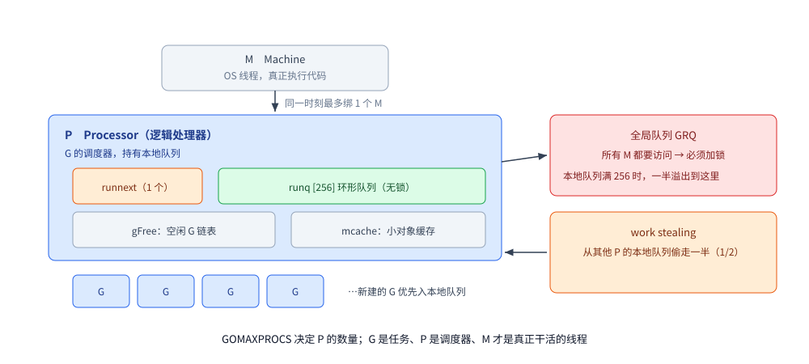
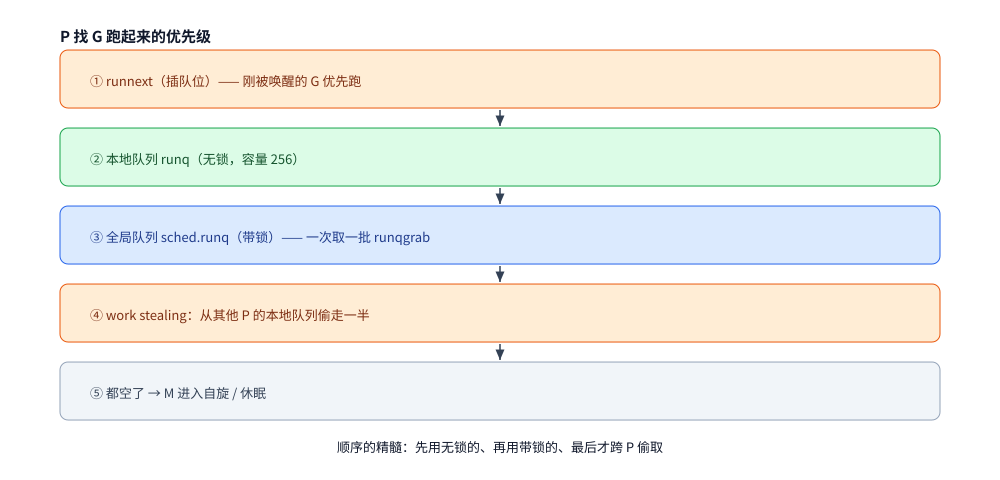
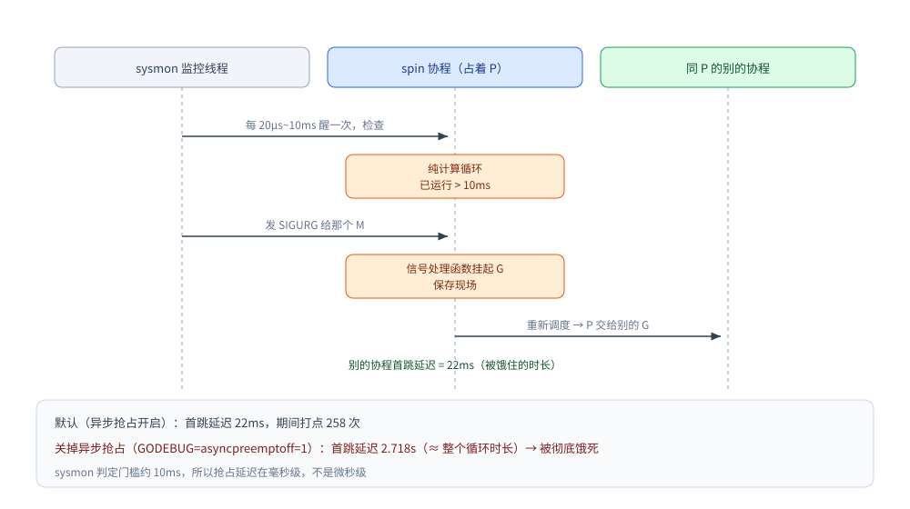

# Go GMP 调度模型

> GMP 三元组、work stealing、协程上下文切换时机
>
> 内容整理自大厂 Go 后端面试真题，并按《Go 语言核心编程》（李文塔）5.4.2 调度模型、5.4.3 并发和调度 的相关章节**补充了机制分析与实测**；参考资料与原始素材见 [素材清单](../../../素材清单.md)。

---

## 一、GMP 模型是什么？work stealing 偷多少？

**本节要点**："偷多少"这个细节能立刻区分"背过八股"和"真的看过实现"。

### GMP 三元组

| 角色 | 含义 |
|---|---|
| **G** | goroutine，一个 goroutine 对应一个 G，保存栈和状态 |
| **M** | Machine，操作系统线程，真正执行代码的实体 |
| **P** | Processor，逻辑处理器，**是 G 的调度器，持有本地队列** |

**约束**：`GOMAXPROCS` 决定 P 的数量；**一个 P 只能绑定一个 M**（同一时刻）。



### G 的入队过程

新建一个 G 时：

1. **优先放入当前 P 的本地队列（LRQ）**——因为本地队列**无锁**，不涉及资源竞争；
2. 如果本地队列**满了**，则放入**全局队列（GRQ）**——全局队列所有 M 都要访问，**必须加锁**，
   所以性能天然不如本地队列。

### G 的出队与 work stealing

1. P **优先消费本地队列**里的 G，交给绑定的 M 执行；
2. 本地队列空了 → 去**全局队列**取一批 G 填充到本地队列；
3. 全局队列也空了，但**隔壁 P 的本地队列还有很多** → 触发 **work stealing**：
   **从其他 P 的本地队列里偷走一半（1/2）的 G**，放进自己的本地队列，再执行；
4. M 拿到 G 后，调用 `goexit` / 执行 G 的函数。

> **答案：偷一半（1/2）。**
>
> 偷一半而不是全偷或偷一个，是为了**均衡负载的同时避免频繁迁移**：
> 偷太多会让对方立渴又饿，偷一个则会导致频繁触发偷取；偷一半能让双方都有一段时间的工作可做。

### 延伸追问

- **为什么需要 P 这一层？** → 解耦 G 与 M。M 阻塞（如系统调用）时可以**释放 P 给其他 M 使用**，
  避免线程被浪费；本地队列也减少了全局锁竞争。
- **G 被阻塞（如 channel 等待）时怎么办？** → G 从 P 上摘下挂到等待队列，
  P 继续执行本地队列中的下一个 G（**这就是"协程比线程轻"的关键**）。
- **什么时候一定会发生线程（M）上下文切换？** → 系统调用阻塞、`GOMAXPROCS` 抢占、
  P 上可运行的 G 太少导致 M 休眠等。（详见后续腾讯相关题目）

---

## 二、Go 协程在什么情况下一定会发生上下文切换？

**本节要点**：**先答"为什么需要切换"，再答"什么情况下切换"**——
抓住根本点，四种情况的答案就自然推出来了。

### 2.1 先抓根本：上下文切换的两个目的

| 目的 | 说明 |
|---|---|
| **① 少量资源执行超额的任务** | 一个 CPU 同一时刻只能执行一个任务。<br>要执行两个任务，就把 CPU 切成**时间片**，让任务**交替执行**。<br>→ 这是**并发（交替）**，不是**并行（同时）** |
| **② 高效利用 CPU** | 一个任务用不到那么多 CPU 时间。<br>例如文件读写时**大量时间在等磁盘、在找数据**，**只有少量时间需要 CPU**。<br>→ 把这段**空闲时间交出去执行其他任务** |

> **第一种（时间片用完）通常不用讨论**——操作系统层面本来就会做。
> **面试要讲的是第二种**：**协程因为"让出 CPU"而发生的切换**。

### 2.2 四种一定会发生协程上下文切换的情况

**核心思路**：**只要协程阻塞了，CPU 就空闲了 → 就该切出去执行别的协程。**

#### ① 系统调用导致阻塞

文件读写、网络读写等系统调用：

> 这类操作**大部分时间在等待外部设备**——
> 等磁盘 IO 返回、等网络另一端把数据传过来。
> **等待期间 CPU 是空闲的**，所以当前协程被挂起/阻塞，
> **CPU 交给其他协程去执行更多任务**。

#### ② 锁竞争

多个协程竞争同一个**互斥锁 / 读写锁**时：

> **只有一个协程能拿到锁**，其余协程**必须挂起等待**。
> 等待期间**不需要 CPU** → CPU 让出来给其他需要执行的任务。

#### ③ channel 的收发操作

> **无缓冲的 channel** 收发时，只要**无法立即完成**，
> 当前协程就会被**封装成 `sudog`**，加入 channel 的等待队列并**挂起**。
>
> → 挂起即发生上下文切换。

#### ④ CPU 主动让出（比较特殊）

| 手段 | 说明 |
|---|---|
| **`runtime.Gosched()`** | 主动让出当前协程的 CPU |
| **`time.Sleep()`** | 让出接下来的这段时间——**期间不参与 CPU 分配** |

### 2.3 ⚠️ 一个很实用的经验

> **用 `time.Sleep` 做精确定时（尤其是微秒/纳秒级别）是不可靠的。**
>
> **原因**：**CPU 调度的耗时可能比你的 sleep 时间还长**。
>
> 现象：在循环里大量 sleep 时，虽然每次 sleep 很短，
> 但**调度过程消耗了看不见的时间**，
> 导致整体耗时比理论值长得多——**测试时长会明显变长**。
>
> **实践中**：需要高精度定时不要依赖 `Sleep`；
> 做压测/性能测试时，**要给这类"隐性调度开销"留出余量**。

### 2.4 答题结构

```text
① 先讲目的：时间片轮转（并发多任务）+ 提高 CPU 利用率（填补 IO 空闲）
② 再讲四种情况：系统调用阻塞、锁竞争、channel 收发阻塞、主动让出
③ 补充经验：Sleep 精度受调度开销影响，别用它做精确计时
④ 可选：结合 GMP 说明——协程阻塞时 P 会被交给其他 M，避免线程被浪费
```

### 延伸追问

- **协程上下文切换比线程切换便宜在哪？** → **在用户态完成**（不陷入内核）、
  只需保存少量寄存器、**栈很小且可增长**、**不需要切换地址空间/页表**。
- **系统调用阻塞会让 M 也阻塞吗？** → 会，但 Go 的运行时会
  **把 P 从阻塞的 M 上摘下来交给其他 M**，从而**不影响其他协程继续运行**；
  被阻塞的 M 在系统调用返回后尝试重新获取 P。
- **`runtime.Gosched()` 和 `time.Sleep(0)` 的区别？** → 前者明确让出，
  后者语义上也是让出但更常用于"给其他 goroutine 机会"的场景；
  两者都只是**提示**调度器，不保证立即切换。

---

## 三、`GOMAXPROCS` 决定 P 的数量：并行度的硬上限

**来源**：本节为补充内容 —— 按《Go 语言核心编程》（李文塔）5.4.2 调度模型、5.4.3 并发和调度 整理，配套本机实测。

**本节要点**：前两节讲了「GMP 怎么转、什么时候切」。这一节补上**参数层** —— 书 5.4.3「并发和调度」收尾的那部分：
**P 的数量是谁定的、改它会怎样**。这题能答准，说明你不是只背了三元组。

### 3.1 三个参数的含义（实测）

```text
5a_GOMAXPROCS=8  NumCPU=8  NumGoroutine=2
```

| 调用 | 含义 |
|---|---|
| `runtime.GOMAXPROCS(0)` | **查询**当前值（传 0 = 只看不改）—— 这就是 **P 的数量** |
| `runtime.NumCPU()` | 逻辑 CPU 数（`GOMAXPROCS` 默认值的来源） |
| `runtime.NumGoroutine()` | 当前存活的 goroutine 数（**排查泄漏的常用手段**） |

### 3.2 默认值的历史：从 1 → NumCPU → 容器感知

| 版本 | 默认 `GOMAXPROCS` | 说明 |
|---|---|---|
| Go 1.5 之前 | **1** | 必须手动设置才有真正的多核并行（历史上"Go 用不上多核"的说法由此而来） |
| **Go 1.5 起** | **`NumCPU()`** | 自动吃满多核；但在**容器**里长期等于「**宿主机**的核数」，于是 `-cpu=2` 的容器里跑出了 `GOMAXPROCS=64` |
| **Go 1.25 起** | **容器感知** | 运行时开始读取 cgroup 的 CPU 限额（本机非容器环境，**此项未做实测**） |

> ⚠️ 中间那一行是**生产上真实踩过的坑**：容器 CPU 限额 2 核、`GOMAXPROCS` 却是 64，
> 结果运行时**开出了 64 个 P**，线程疯狂抢占、上下文切换飙升、延迟抖动。
> 这也是为什么"容器里要不要显式设置 `GOMAXPROCS`"曾经是个必答题。

### 3.3 ⭐ 它限制的是「并行执行」，不是「创建」

这条最容易混，但一句话能说清：

| 问题 | 答案 |
|---|---|
| `GOMAXPROCS=1` 时还能创建 10 万个 goroutine 吗？ | ✅ **能** —— 创建不受限制 |
| 同一时刻有多少个在 CPU 上**真并行**？ | 最多 **`GOMAXPROCS` 个**（= P 的数量） |
| 那其余的在哪？ | 在 P 的**本地队列** / 全局队列里排队，或在 syscall / channel 上**阻塞** |

> ⭐ 所以：**`GOMAXPROCS=1` 的程序照样能有几十万 goroutine**，只是"并行度 = 1、只剩并发"。
> 「goroutine 廉价」说的是**创建成本**，与 `GOMAXPROCS` 无关 —— 两件事别混在一起答。

### 3.4 该不该调它

| 场景 | 建议 |
|---|---|
| 默认情况 | **不要动**，`NumCPU()` 通常是合理的 |
| 容器里被限制 CPU，且 Go 版本较老（< 1.25） | 显式 `GOMAXPROCS=<限额>`，或引入 `automaxprocs` 这类库 |
| 进程内还有其它 CPU 消耗大户（如 cgo 密集） | 适度压低，给别的部分留核 |
| "以为调大就更快" | ❌ 超过物理核数只会**增加调度开销**，不会更快（`GOMAXPROCS > NumCPU` 只对 IO 阻塞型场景有意义） |

### 延伸追问

- **`GOMAXPROCS=1` 会发生什么？** → 并行度变 1：所有 goroutine 在**同一个 P** 上轮流跑，仍能并发（阻塞时切换），但没有真并行；
  如果某个 goroutine 里是**纯 CPU 死循环**，在 **Go 1.14 之前**会卡住整个程序（那时候没有抢占式调度）。
- **怎么改 P 的数量？** → `runtime.GOMAXPROCS(n)` 或环境变量 `GOMAXPROCS=n`（**环境变量的优先级更高**，且启动时就生效）。
- **M 的数量受 `GOMAXPROCS` 限制吗？** → **不受**。M 是 OS 线程，需要阻塞式系统调用时可以创建新的 M（上限 `10000`，`runtime.SetMaxThreads` 可调），P 才受 `GOMAXPROCS` 限制。

---

## 四、P 在内部长什么样？本地队列和 `runnext` 是怎么配合的？

**本节要点**：第三节讲了"G 往哪放"，这一节讲**P 里到底有哪些坑位**。能说出 `runnext`，说明真翻过 `runtime2.go`。

### 4.1 P 的关键字段

| 字段 | 作用 |
|---|---|
| `status` | P 的状态：`_Pidle` / `_Prunning` / `_Psyscall` / `_Pgcstop` / `_Pdead` |
| `m` | 当前绑在这个 P 上的 M（**同一时刻最多一个**） |
| `runqhead` / `runqtail` / `runq [256]` | **本地运行队列**：环形缓冲，**无锁**，容量 **256** |
| `runnext` | **"插队位"**：只放 1 个 G，**下一个一定先跑它** |
| `gFree` | 空闲 G（`Gdead`）的链表 —— 这就是"创建 goroutine 不用重新分配内存"的来源 |
| `mcache` | 每个 P 一份的小对象缓存（见 [内存分配器.md](内存分配器.md)） |

### 4.2 `runnext` 解决什么问题

如果只按"往队尾排"的规则，**刚刚被唤醒的那个 G** 会被排到几百个 G 后面 —— 而它往往正是"接着刚才的活干"的那个。
`runnext` 的语义是：**谁唤醒我，我就插到它的下一棒**，让 G 之间的切换更有局部性（更像"连续执行"而不是"重新排队"）。

### 4.3 P 取 G 的优先级顺序

```text
① runnext（插队位）
② 本地队列 runq（无锁）
③ 全局队列 sched.runq（带锁）—— 一次取一批（runqgrab）
④ work stealing：从其他 P 的本地队列偷走一半
⑤ 都空了 → M 进入自旋/休眠
```



### 4.4 实测：队列真的会积压（`GODEBUG=schedtrace`）

给 1000 个 goroutine 每个分配约 10 ms 的纯计算量，一次全丢出去，每 150 ms 打印一次调度器状态：

```bash
go build -o gmp.exe ./gmp                 # ⚠️ 先编译再运行（见下方「踩坑」）
GODEBUG=schedtrace=150 ./gmp.exe trace
```

```text
SCHED 357ms: gomaxprocs=8 idleprocs=0 threads=10 spinningthreads=0 needspinning=1 idlethreads=0 runqueue=355 [ 170 35 43 51 23 82 70 61 ] schedticks=[ 14 16 15 15 16 16 17 19 ]
SCHED 843ms: gomaxprocs=8 idleprocs=0 threads=10 spinningthreads=0 needspinning=1 idlethreads=0 runqueue=374 [ 151 18 23 32 3 61 51 41 ] schedticks=[ 33 33 35 34 36 37 36 39 ]
```

逐字段读：

| 字段 | 例子 | 含义 |
|---|---|---|
| `gomaxprocs=8` | 8 | P 的数量 |
| `idleprocs=0` | 0 | **空闲 P 数**——这里是 0，说明 8 个 P 全在干活 |
| `threads=10` | 10 | M（操作系统线程）总数，**可以大于 P** |
| `spinningthreads` / `needspinning` | 0 / 1 | 正在自旋找活的 M / 需要自旋的 M（`needspinning=1` 说明**活多到需要唤醒更多 M**） |
| `idlethreads=0` | 0 | 空闲线程数 |
| `runqueue=355` | 355 | **全局队列**长度 |
| `[ 170 35 43 51 23 82 70 61 ]` | —— | **每个 P 的本地队列长度**（顺序对应 P0~P7） |
| `schedticks=[...]` | —— | 每个 P 的调度次数（Go 1.26 新增字段） |

⭐ **两个可以对照的点**：
1. **P0 的本地队列最长（170 / 151）** —— 因为 goroutine 是在主协程（P0）上创建的，
   **新建的 G 优先进"当前 P"的本地队列**，本地队列满 256 才溢出到全局队列；这也解释了为什么全局队列会涨到 355；
2. **`threads=10 > gomaxprocs=8`** —— M 不受 `GOMAXPROCS` 限制，除了 8 个干活的外还有 sysmon 等系统线程。

> ⚠️ **踩坑记录**：`GODEBUG` 会**同时作用在 `go run` 工具自身进程**上，所以 `GODEBUG=schedtrace=150 go run .`
> 的输出里会混进 `go` 工具的调度器采样（时间戳非单调、`0ms` 反复出现，容易看成"队列一直是 0"）。
> **一定要先 `go build` 再运行二进制**。

### 4.5 队列空了会怎样：M 的自旋与休眠

P 找不到 G 时，M 不会立刻睡 —— 先**自旋**一段时间（占着 CPU 空转找活，避免刚睡下就有活要唤醒），
自旋也找不到才休眠。这就是 `spinningthreads` / `idlethreads` 两个字段的来源，也是
"**高并发下线程数会超过 P 数**"的原因（多出来的 M 在自旋或接力阻塞的系统调用）。

### 延伸追问

- **本地队列多大？满了怎么办？** → **256**（`runq [256]guintptr`）；满了就有**一半**溢出到**全局队列**（全局队列带锁，性能不如本地）。
- **`runnext` 是什么？** → 一个只放 1 个 G 的"插队位"，让**刚被唤醒的 G** 优先于本地队列里的老 G 执行，改善局部性。
- **P 取 G 的顺序？** → `runnext` → 本地队列 → 全局队列（一次取一批）→ 偷其他 P 的一半 → 自旋/休眠。
- **为什么 `threads` 会大于 `gomaxprocs`？** → M 不受 `GOMAXPROCS` 限制；除了干活的 M，还有 sysmon、以及正处于阻塞系统调用 / 自旋的 M。
- **`idleprocs=0` 且 `needspinning=1` 说明什么？** → 所有 P 都在忙，而且还有活没人干 —— 可以理解为"**并行度已打满**"，此时再加机器核心才会更快。

---

## 五、抢占式调度：为什么 Go 1.14 要引入异步抢占？

**本节要点**：这题在考"**Go 的调度是不是真抢占**"。答"是抢占式"还不够，要能说出**1.14 之前不是**、以及**怎么测出来**。

### 5.1 1.14 之前只有"协作式抢占"

Go 1.14 之前，抢占**只发生在函数调用的栈检查点**上：

```text
每次函数调用 → 检查栈是否要扩容 → 顺手检查「我是不是该让出了」（preempt 标志）
→ 所以：只要代码里有函数调用，就不会饿死别人
```

**漏洞**：下面这种**纯算术循环没有函数调用、也不增长栈**，老版本里谁也抢不走它的 CPU：

```go
func spin(n int64) int64 {
    var x int64
    for i := int64(0); i < n; i++ {
        x += i // 没有函数调用 → 老版本无法被抢占
    }
    return x
}
```

在 `GOMAXPROCS=1` 时，这个循环会让**同一个 P 上的其他 goroutine 全部饿死**直到它自己结束 ——
具体表现就是"GC 卡住"（GC 需要所有 G 到达安全点才能开始 STW）。

### 5.2 1.14 起：基于信号的异步抢占

运行时用 **sysmon** 线程定期检查，发现有 goroutine **连续运行超过 10ms** 就给它**发一个信号**，
在信号处理函数里把它挂起、重新入队 —— 这样**不需要任何函数调用**也能抢占。

```text
sysmon（每 20µs ~ 10ms 醒一次）
   ├─ 发现某个 G 运行超过 10ms
   ├─ 发 SIGURG（Unix）/ 特定异常（Windows）给那个 M
   ├─ 信号处理函数把 G 挂起（保存现场）
   └─ 重新调度，别的 G 上
```



### 5.3 实测：同一个程序，只差一个环境变量

`GOMAXPROCS=1`，一个 `spin` 占住 P，另一个协程每 2ms 打点；记录**打点协程从 spin 开始到自己第一次被调度**的延迟：

```bash
GOMAXPROCS=1 ./gmp.exe spin                            # A：默认（异步抢占开启）
GOMAXPROCS=1 GODEBUG=asyncpreemptoff=1 ./gmp.exe spin  # B：关掉异步抢占
```

原始输出（同一天两次运行，数值会有小幅波动）：

```text
$ GOMAXPROCS=1 ./gmp.exe spin
纯计算循环耗时 2.749s
打点协程首跳延迟 = 22ms（这就是被饿住的时长）
期间共打点 258 次（2ms 一次的话应约 1374 次）

$ GOMAXPROCS=1 GODEBUG=asyncpreemptoff=1 ./gmp.exe spin
纯计算循环耗时 2.716s
打点协程首跳延迟 = 2.718s（这就是被饿住的时长）
期间共打点 125 次（2ms 一次的话应约 1357 次）
```

| 配置 | 打点协程**首跳延迟** | 纯计算循环耗时 | 期间打点次数 |
|---|---|---|---|
| **A：默认** | **22 ms** | 2.749 s | 258 次 |
| **B：`asyncpreemptoff=1`** | **2.718 s** ⚠️ | 2.716 s | 125 次 |

⭐ **结论非常干净**：
- **A 里别的协程最多等 22 ms**（被抢占后就能跑）；
- **B 里直接等了 2.718 秒 —— 等于整个循环的时长**，也就是**被彻底饿死**，只能在 spin 返回后才轮到。

（B 的「打点 125 次」是 spin 结束之后补偿式打出来的，所以次数反而少。）

### 5.4 异步抢占也被 GC 用上

GC 要做 STW 时，需要**所有 goroutine 都到达"安全点"**。老版本遇到纯计算循环会一直等它跑到函数调用为止
（表现为"STW 时间不可控地长"）；有了异步抢占，运行时可以直接把它停下来 ——
这也是 **1.14 之后 STW 能稳定在亚毫秒**的前提之一。

### 5.5 现在还有没有"抢不走"的情况

| 情况 | 会不会被抢占 |
|---|---|
| 普通 Go 代码（含纯计算循环） | ✅ 异步抢占生效 |
| **汇编函数 / `//go:nosplit` 代码块内** | ⚠️ 可能延迟，运行时有专门处理 |
| **`cgo` 调用中** | ❌ 不能 —— 进 cgo 就离开 Go 调度器了 |
| **长时间的系统调用** | 不算"抢占"，走的是下面第六节的 P 交接机制 |

### 延伸追问

- **Go 是抢占式调度吗？** → **1.14 起是**（基于信号的异步抢占）；1.14 之前是**协作式**，只在函数调用的栈检查点让出。
- **为什么纯计算循环会成为一个问题？** → 没有函数调用就没有检查点，老版本抢不走它，同一个 P 上的其他 G 被饿死，GC 也只能干等。
- **怎么验证异步抢占真的生效？** → `GODEBUG=asyncpreemptoff=1` 对比：本机实测**打点协程首跳延迟 22 ms ↔ 2.718 s**，差两个数量级。
- **抢占的粒度是多少？** → sysmon 的检查周期是 **20µs ~ 10ms**，判定"运行过久"的门槛是**约 10ms**；所以被抢占的延迟通常在**毫秒级**，不是微秒级。
- **哪些代码抢不走？** → cgo 调用中（已离开 Go 调度器）、部分汇编 / `nosplit` 代码块，以及**阻塞式系统调用**（走 P 交接而不是抢占）。

---

## 关联

- [程序启动流程.md](程序启动流程.md) — `schedinit` 里调度器怎么初始化
- [内存分配器.md](内存分配器.md) — P 上的 mcache 与无锁分配
- [协程泄漏与死锁.md](../并发编程/协程泄漏与死锁.md) — 协程堆积的现场
- [goroutine.md](../并发编程/goroutine.md) — goroutine 本身有多轻、栈怎么长、怎么排查泄漏
- [垃圾回收机制.md](垃圾回收机制.md) — 抢占式调度为什么是 STW 能稳定在亚毫秒的前提
- [进程与线程.md](../../../02-计算机基础/linux/进程与线程.md) — 线程与协程的创建成本对照
> 反向引用（本篇被下列文档引到）：[goroutine实战模式.md](../并发编程/goroutine实战模式.md)、[并发同步原语.md](../并发编程/并发同步原语.md)
