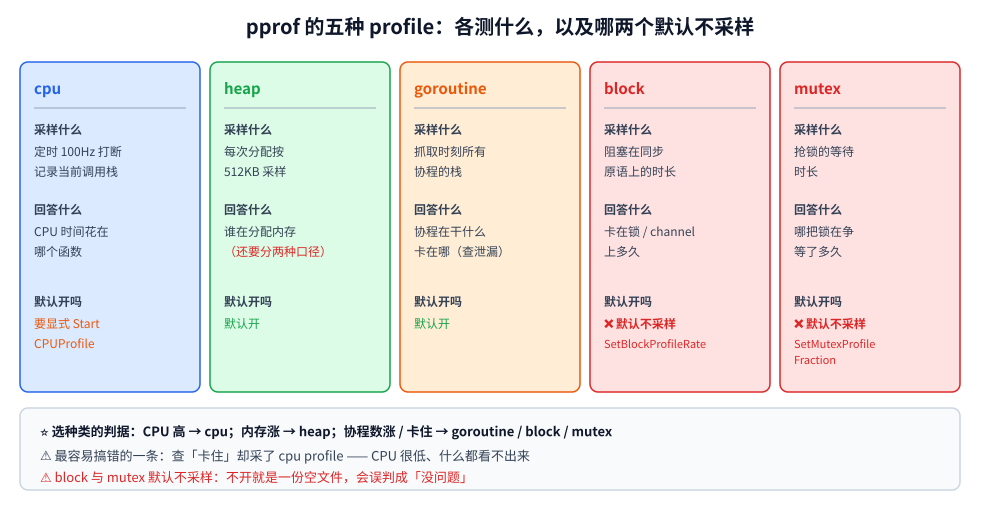

# pprof 性能分析

> 本篇覆盖 Go 的 **`pprof` 工具链**：五种 profile 各测什么、三种采集入口、无头环境（没有浏览器）下怎么读
> （`-top` / `-list` / `-peek` / `-traces` / `-diff_base`）、`heap` 的 **`alloc_space` 与 `inuse_space` 两种口径**、
> `block` 与 `mutex` 为什么要先开采样开关，以及一套能落地的优化闭环。
> ⭐ 与 [runtime调试与trace.md](runtime调试与trace.md) 分工：那篇讲 **`GODEBUG` 旋钮 + `runtime/trace` + 三套内存数**；
> 本篇只讲 **pprof 这一类「采样 → 归因」工具**。
>
> 内容整理自个人学习笔记，实测为容器 `golang:1.26-alpine`（go1.26.8 linux/amd64），素材见 [素材清单.md](../../../素材清单.md)。

---

## 一、pprof 是什么：五件事它分开做

**本节要点**：pprof 不是"一个工具"，它是**五种采样数据 + 一套查看器**。用错种类是新手最常见的无效努力 ——
拿 CPU profile 去查"为什么卡住"，一定查不出来。

### 1.1 五种 profile 各测什么

| profile | 采样什么 | 回答什么问题 | 默认开吗 |
|---|---|---|---|
| **cpu** | 定时打断（默认 100 Hz）记录当前栈 | **CPU 时间花在哪个函数** | ✅ 但要显式 `StartCPUProfile` |
| **heap** | 每次堆分配按 512 KB 采样 | **谁在分配内存**（还要再分两种口径，见第四节） | ✅ |
| **goroutine** | 抓取时刻所有协程的栈 | **协程在干什么 / 卡在哪**（排查泄漏） | ✅ |
| **block** | goroutine **阻塞在同步原语上**的时长 | 卡在锁 / channel / select 上多久 | ❌ **默认不采样** |
| **mutex** | 抢锁的**等待**时长 | 哪把锁在争 | ❌ **默认不采样** |

⭐ 一条总判据：

```text
CPU 高         → cpu
内存涨         → heap
协程数涨 / 卡住 → goroutine / block / mutex
```



⚠️ 最容易搞错的一条：**`block` 和 `mutex` 默认是关的**。
不开就直接看 profile，会得到一份"什么都没有"的文件，然后得出"没问题"的错误结论（实测见 4.3）。

### 1.2 它和 trace、GODEBUG 怎么分工

| 想回答 | 该用 | 在本仓哪篇 |
|---|---|---|
| CPU 花在哪个函数 | **pprof cpu profile** | 本篇 |
| 谁在分配、还占着多少 | **pprof heap profile** | 本篇 |
| 一次请求里五个阶段各多久 | **`runtime/trace` + region** | [runtime调试与trace.md](runtime调试与trace.md) |
| 调度器 / GC 的实时行为 | **`GODEBUG=schedtrace` / `gctrace`** | [runtime调试与trace.md](runtime调试与trace.md) |
| 给监控系统用的数 | **`runtime/metrics`** | [runtime调试与trace.md](runtime调试与trace.md) |

⭐ 一句话区分：**pprof 是"采样 + 归因"（统计学），trace 是"事件 + 时序"（全记录）**。
问"哪个函数贵"用 pprof；问"这 5 个阶段谁先谁后"用 trace。


---

## 二、怎么采：三种入口

**本节要点**：采集方式只有三种，选哪个只取决于"你的程序是什么形态"。

### 2.1 程序内 `runtime/pprof`（本篇实测用的方式）

```go
// CPU：包住要测的那一段
f, _ := os.Create("cpu.pprof")
pprof.StartCPUProfile(f)
doWork()
pprof.StopCPUProfile() // ⚠️ 必须调用，否则文件是空的
f.Close()

// 堆：抓一个快照（取 inuse 之前要先 GC）
runtime.GC()
f2, _ := os.Create("heap.pprof")
pprof.WriteHeapProfile(f2)
f2.Close()

// block / mutex：先开采样率，再写
runtime.SetBlockProfileRate(1)
runtime.SetMutexProfileFraction(1)
pprof.Lookup("block").WriteTo(f3, 0)
pprof.Lookup("mutex").WriteTo(f4, 0)
```

⚠️ 三个坑：

1. **`StopCPUProfile` 必须调用** —— 不调文件就是空的，且没有任何报错；
2. **取 `inuse_space` 之前必须先 `runtime.GC()`** —— 否则刚丢弃的对象还在统计里，"还占着多少"是虚高的；
3. **`SetBlockProfileRate` / `SetMutexProfileFraction` 要在被测代码之前设**。

### 2.2 `net/http/pprof`（长驻服务用这个）

```go
import _ "net/http/pprof" // 注册 /debug/pprof/* 到默认的 http.ServeMux
```

⚠️ 三条纪律：

1. 它挂的是 **`http.DefaultServeMux`** —— 如果你用了自己的 mux（生产上应该这么做），
   需要**手动把它的 handler 挂到你自己的路由里**，别直接把它暴露在默认 mux 上；
2. **端口不要对外** —— `/debug/pprof/` 会暴露函数名、路径甚至部分请求内容；
   常见做法是**监听内网端口**或用 ssh 隧道访问；
3. `goroutine?debug=2` 这个端点**不要在高峰**随便打（dump 全部栈有开销）。

### 2.3 `go test` 的旗标（基准测试用这个）

```bash
go test -bench=. -benchmem -cpuprofile=cpu.out -memprofile=mem.out ./pkg
```

- `-cpuprofile` / `-memprofile` 只对**基准测试**生效（单元测试不会生成有意义的数据）；
- `-benchmem` 额外给出 `B/op` 与 `allocs/op` —— ⭐ **这两个数比 `ns/op` 更稳定**，
  做前后对比时优先看它们（时间会随机器负载抖，分配次数不会）。

---

## 三、怎么读：没有浏览器时的命令集

**本节要点**：`-http=:port` 能出火焰图，但**生产环境和 CI 里没有浏览器**。
文本模式才是你真正会用到的那一套。

### 3.1 `-top`：最常用的一个

```bash
go tool pprof -top -nodecount=10 -cum cpu.pprof   # 按 cum 排
go tool pprof -top -nodecount=10 cpu.pprof        # 按 flat 排（默认）
```

⚠️ **flat 和 cum 是两件不同的事**，看错会得出相反结论：

| | 含义 | 什么时候看 |
|---|---|---|
| **flat** | 这个函数**自己**消耗的（不含它调用别人的） | 找"哪一行最贵" |
| **cum** | 这个函数**连同它调用链**一共消耗多少 | 找"哪条调用路径最贵" |

⭐ 判据：**先看 `cum` 找路径，再看 `flat` 定位到具体函数**。
典型误判：某个调度函数 `cum` 很高但 `flat` 是 0 —— 它只是"路过的入口"，不是热点。

### 3.2 定位到具体位置

| 命令 | 干什么 |
|---|---|
| `-list main.hot` | 把热点函数**逐行**列出，每行标采样值 |
| `-peek main.hot` | 只看这个函数及其**调用者/被调用者** |
| `-traces main.hot` | 列出**所有包含它**的调用栈（回答"谁在调它"） |

⭐ `-traces` 是最被低估的一个：同一个函数被两条不同路径调用，
`-top` 只给一个总数，而 `-traces` 能告诉你**是哪条路径**在拖后腿。

### 3.3 火焰图

```bash
go tool pprof -http=:8080 cpu.pprof   # 起一个本地 http 服务出 SVG 火焰图
```

⚠️ **本机/容器无浏览器环境，这一条未实测**（无法访问图形界面，也无法栅格化 SVG）。
无头环境下用上面 3.1 / 3.2 的文本命令替代 —— 它们给出的信息是等价的，只是不如图形直观。

---

## 四、四种 profile 的实测

**本节要点**：这一节全部是容器实测。
⚠️ **pprof 的采样数与耗时天然随运行波动**，所以下面只报**稳定的结论**（函数名、存在性），
具体数值引用时一律标注"一次运行的样例，会波动"。

### 4.1 CPU：定位热点

```text
=========== 实验一：CPU profile 定位热点（cum 排序） ===========
  前 4 个 main.* 函数（cum 从高到低）：
main.main
main.hot
main.warm
```

一次运行的完整 `-top`（⚠️ 数值随采样波动，只看量级与顺序）：

```text
Duration: 210.92ms, Total samples = 210ms (99.56%)
Showing nodes accounting for 210ms, 100% of 210ms total
      flat  flat%   sum%        cum   cum%
         0     0%     0%      210ms   100%  main.main
         0     0%     0%      210ms   100%  runtime.main
     180ms 85.71% 85.71%      180ms 85.71%  main.hot (inline)
      30ms 14.29%   100%       30ms 14.29%  main.warm (inline)
```

⭐ 三处从读数里直接读出来的东西：

1. **`main.main` 的 `flat` 是 0、`cum` 是 100%** —— 它是入口，不是热点（见 3.1 那条误判）；
2. **`main.hot` 的 flat ≈ 85%、warm ≈ 14%** —— 热点被精确定位；
3. **函数名后面带 `(inline)`** —— 被内联了。pprof 会把它还原成逻辑上的函数，但**行号定位时要留意内联**。

### 4.2 heap：`alloc_space` 与 `inuse_space` 是两件事

⭐ 这是本篇最核心的一节。测试程序里有两个函数：

- `allocateAndFree`：分配约 300 MB 后**立刻丢弃**；
- `retain`：分配约 300 MB 后**长期持有**。

```text
=========== 实验二：heap 的两种口径 —— alloc_space vs inuse_space ===========
  分配完就丢的 allocateAndFree：alloc_space 视角出现 1 次、inuse_space 视角出现 0 次
  分配后持有的 main.retain  ：alloc_space 视角出现 1 次、inuse_space 视角出现 1 次
```

⚠️ **`allocateAndFree` 在 `inuse_space` 视角下彻底消失了**（出现 0 次）。
一次运行的完整输出（数值随采样波动）：

```text
--- alloc_space ---
Showing nodes accounting for 606.52MB, 99.84% of 607.52MB total
  305.32MB 50.26% 50.26%   305.32MB 50.26%  main.retain (inline)
  301.19MB 49.58% 99.84%   301.19MB 49.58%  main.allocateAndFree (inline)

--- inuse_space ---
Showing nodes accounting for 305.32MB, 99.51% of 306.82MB total
  305.32MB 99.51% 99.51%   305.32MB 99.51%  main.retain (inline)
```

⭐ 四条结论：

| 口径 | 含义 | 用来回答 |
|---|---|---|
| **`alloc_space`** | 累计**分配过**多少（含已释放的） | **GC 压力大不大、分配速率高不高** |
| **`inuse_space`** | 此刻**还占着**多少 | **内存涨不涨、是不是泄漏** |
| `alloc_objects` / `inuse_objects` | 同上，但数**对象个数** | 是不是有大量小对象 |

⚠️ 判据：

- **内存持续上涨** → 看 `inuse_space`；
- **内存不涨但 GC 频繁** → 看 `alloc_space`（分配速率高，但都及时回收了 —— 这时该优化的是**分配次数**，不是"内存占用"）；
- 两者都看时，用 `-sample_index=` 切换（heap profile 有这四个可选值）。


### 4.3 `block` 与 `mutex`：默认关闭

```text
=========== 实验三：block profile（默认关闭，不打开就是空的） ===========
  前 3 个 main.* 函数：
main.blockOnChan
main.main

=========== 实验四：mutex profile（同样是默认关闭） ===========
  前 3 个 main.* 函数：
main.contendMutex
```

⭐ 打开方式的差别要记清（两个函数的参数含义完全不同）：

```go
runtime.SetBlockProfileRate(1)     // 1 = 记录每一次阻塞；0 = 关闭
runtime.SetMutexProfileFraction(1) // 1 = 记录每一次抢锁；0 = 关闭；>1 = 按 1/N 抽样
```

⚠️ **`SetBlockProfileRate(1)` 有真实开销**（每次阻塞都记一次）。
线上如果要常开，通常用 `SetBlockProfileRate(10000)`（万分之一抽样）之类的折中值，
或者**只在排查窗口内开**（这也符合「采样成本分档」的口径，见 [runtime调试与trace.md](runtime调试与trace.md)）。

⭐ 判据：

- **goroutine 数正常但吞吐上不去** → `block`（大家在等，不是在算）；
- **CPU 不高、延迟却高** → `block` / `mutex`，**不要**去查 cpu profile。

### 4.4 `goroutine`：排查泄漏的第一现场

```text
=========== 实验五：goroutine profile（排查泄漏看它） ===========
  阻塞在匿名函数上的 goroutine（top 函数名）：
main.main.func1
  这一份 profile 里样本归属的 main.* 函数：
main.main
```

⭐ 500 个永久阻塞的 goroutine 被归到同一个匿名函数 `main.main.func1` 下 ——
这正是泄漏排查要看的形态：**一堆协程停在同一行**。

⚠️ 两个用法差别：

- `go tool pprof -top goroutine.pprof` → **聚合**后的统计（按栈分组，看数量分布）；
- `curl .../debug/pprof/goroutine?debug=2` → **全量原始栈**（能看到每一个协程，量大会很大）。

判据：**先看聚合版找"停在哪一行"，再取 `debug=2` 看具体协程**。
泄漏的机制与排查流程见 [协程泄漏与死锁.md](../并发编程/协程泄漏与死锁.md)。

### 4.5 `-diff_base`：做回归对比

```bash
go tool pprof -top -nodecount=20 -cum -diff_base=cpu1.pprof cpu2.pprof
```

实测（cpu2 里 `hot` 的工作量翻倍、`warm` 缩减）：

```text
=========== 实验六：-diff_base 做回归对比 ===========
  diff 结果里 main.hot 出现 1 次、main.warm 出现 1 次
```

一次运行的完整输出（⚠️ **diff 的排序与数值随采样波动**，但"两个函数都出现"是稳定的）：

```text
Showing nodes accounting for 140ms, 70.00% of 200ms total
     160ms 80.00% 80.00%      160ms 80.00%  main.hot (inline)
         0     0% 80.00%      130ms 65.00%  main.main
```

⭐ 它的价值：**直接从噪声里挑出变化量**。优化前 / 优化后各存一份 profile，
`-diff_base` 一减，涨的那一项浮到最上面 —— 比肉眼对比两个 `-top` 可靠得多。

⚠️ 判据：**`-diff_base` 适合"同一份代码的两个版本"，不适合"两个不同的负载"**
（负载不同，总量也不同，减出来的数没有意义）。

---

## 五、优化闭环

**本节要点**：pprof 是工具，不是流程。没有闭环，采多少 profile 都是白采。

```text
① 先测，别猜
   ↓  跑一次基准或抓一份 profile，把"当前是多少"记下来
② 定位到"一个"热点
   ↓  -top(cum) 找路径 → -top(flat) 定位函数 → -list / -traces 定位到行
③ 判断它值不值得改
   ↓  ⭐ 占比低于 5% 的项，改了也测不出来
④ 改一个变量
   ↓  一次只改一处，否则不知道是哪处生效的
⑤ 再测，用 -diff_base 确认
   ↓  对比前后两份 profile，确认那一项真的降了
⑥ 回归测试兜底
      ⭐ 性能优化最容易引入正确性问题 —— 必须跑全量测试
```

⚠️ 两条纪律：

1. **一次只改一个变量** —— 同时改三处，最后不知道哪个有用、哪个有害；
2. **先验证再优化** —— 90% 的"性能问题"最后证实是别的原因（锁、IO、算法选择），
   pprof 的价值恰恰在于**先证明瓶颈在哪**。

---

## 六、六个最容易踩的坑

**本节要点**：这些坑的共同点是"看起来在做性能分析，其实在做无用功"。

| # | 坑 | 后果 | 正确做法 |
|---|---|---|---|
| 1 | 查"卡住"却采 cpu profile | CPU 很低，什么也看不出来 | 卡住 → `goroutine` / `block` / `mutex` |
| 2 | 看 `block` / `mutex` 却没开采样 | 空 profile → 误判"没问题" | 先 `SetBlockProfileRate` / `SetMutexProfileFraction` |
| 3 | 只看 `flat` 或只看 `cum` | 把入口函数当热点，或漏掉真正的热点 | 先 cum 找路径、再 flat 定位 |
| 4 | 取 `inuse_space` 前没 GC | 已丢弃的对象还在统计里，虚高 | `runtime.GC()` 之后再 `WriteHeapProfile` |
| 5 | 拿 `-diff_base` 比两个不同负载 | 减出来的数没有意义 | 只比同一负载下的两个版本 |
| 6 | 只跑一次就下结论 | 采样有随机性，结论不稳 | 多跑几次；对比优先看 `allocs/op` 这类**确定性**指标 |

⭐ 追加一条心态上的坑：**pprof 的绝对数值（ns、MB、百分比）每次运行都会变**。
正确用法是拿它**排序找热点**，而不是拿绝对数值当"性能指标"写进报告。

---

## 使用：把 pprof 接进服务（但别对外）

**本节要点**：一个能直接抄的接法 —— 内网端口 + 独立的 mux + 只在排查窗口内开。

```go
package debug

import (
	"net/http"
	"net/http/pprof" // 注意：显式 import，不是 _ 导入
	"time"
)

// RegisterPprof 把 pprof 端点挂到**你自己的** mux 上
// ⚠️ 千万别用 `_ "net/http/pprof"` —— 那会挂到 DefaultServeMux 上，等于对外暴露
func RegisterPprof(mux *http.ServeMux) {
	mux.HandleFunc("GET /debug/pprof/", pprof.Index)
	mux.HandleFunc("GET /debug/pprof/cmdline", pprof.Cmdline)
	mux.HandleFunc("GET /debug/pprof/profile", pprof.Profile) // 默认采 30 秒 CPU
	mux.HandleFunc("GET /debug/pprof/symbol", pprof.Symbol)
	mux.HandleFunc("GET /debug/pprof/trace", pprof.Trace)
}

// 独立的、只监听内网的调试端口
func StartDebugServer() *http.Server {
	dmux := http.NewServeMux()
	RegisterPprof(dmux)
	srv := &http.Server{
		Addr:              "127.0.0.1:6060", // ⭐ 只绑回环，不对 0.0.0.0
		Handler:           dmux,
		ReadHeaderTimeout: 5 * time.Second,
		WriteTimeout:      60 * time.Second, // ⭐ profile 端点要采 30 秒，别设太短
	}
	go func() { _ = srv.ListenAndServe() }()
	return srv
}
```

**排查时的三条常用命令**（无头环境，用 ssh 隧道把 6060 转到本地即可）：

```bash
# ① CPU：采 30 秒
go tool pprof -top -cum http://127.0.0.1:6060/debug/pprof/profile

# ② 内存：看「此刻还占着多少」——查泄漏用这个
go tool pprof -sample_index=inuse_space -top http://127.0.0.1:6060/debug/pprof/heap

# ③ 查卡住：先确认协程停在哪（聚合版）
go tool pprof -top http://127.0.0.1:6060/debug/pprof/goroutine
```

⚠️ 最后一条安全纪律：**`/debug/pprof/` 会暴露函数名、源码路径**，
生产上必须 ① 只绑回环地址或内网 ② 或前置鉴权。

---

## 延伸追问

- **pprof 和 trace 到底什么时候用哪个？** → 问"哪个函数贵"用 pprof（采样归因）；
  问"这几个阶段谁先谁后、一次请求里各花多久"用 `runtime/trace`（事件全记录）。
  详见 [runtime调试与trace.md](runtime调试与trace.md)。
- **`flat` 和 `cum` 看哪个？** → 先用 **`cum` 找调用路径**，再用 **`flat` 定位到具体函数**。
  `main.main` 的 cum 常常是 100% 但 flat 是 0 —— 它只是入口，不是热点（4.1 实测）。
- **为什么我的 `block` profile 是空的？** → **它默认不采样**。要先 `runtime.SetBlockProfileRate(1)`
  （`mutex` 则是 `SetMutexProfileFraction(1)`），否则拿到空文件还以为"没问题"（4.3）。
- **内存涨了，该看 `alloc_space` 还是 `inuse_space`？** → **内存涨看 `inuse_space`**；
  内存不涨但 GC 频繁才看 `alloc_space`（分配速率高但都及时回收了）。
  实测里"分配完就丢"的函数在 `inuse` 视角下**完全消失**（4.2）。
- **取 heap profile 前为什么要 `runtime.GC()`？** → 刚丢弃但还没被回收的对象仍算在 `inuse` 里，
  不 GC 会让"还占着多少"虚高（2.1）。
- **`-http` 火焰图怎么用？** → `go tool pprof -http=:8080 cpu.pprof`。
  ⚠️ **本机/容器无浏览器，这一条未实测**；无头环境下用 `-top` / `-list` / `-peek` / `-traces` 替代（3.3）。
- **`-diff_base` 能比两个不同时间点的线上 profile 吗？** → 不建议。负载不同总量也不同，
  减出来的数没有意义；它适合比**同一负载下的两个代码版本**（4.5）。
- **pprof 的数值可以直接写进报告吗？** → 不能。**采样数与耗时每次运行都变**（4.1~4.6 全部标注了波动）。
  它的正确用法是"排序找热点"，绝对数值只主张量级。

## 关联

- [runtime调试与trace.md](runtime调试与trace.md) — **分工对照篇**：`GODEBUG` 旋钮、`schedtrace` / `gctrace` 逐字段、
  `runtime/trace` 的无头解析、`MemStats` / `debug.GCStats` / `runtime/metrics` 三套数
- [垃圾回收机制.md](垃圾回收机制.md) — heap profile 里"分配速率"这一维的来龙去脉（GC 压力从哪来）
- [内存逃逸.md](内存逃逸.md) — 想减少分配时，先看对象为什么逃到堆上
- [内存分配器.md](内存分配器.md) — size class / mcache 三级分配（解释"小对象"为什么也有代价）
- [协程泄漏与死锁.md](../并发编程/协程泄漏与死锁.md) — `goroutine` profile 排查泄漏的完整流程（4.4 的机制篇）
- [测试与Mock.md](../工程实践/测试与Mock.md) — `-bench` / `-benchmem` / fuzz 与微基准的两个陷阱
- [GMP调度.md](GMP调度.md) — 理解 `block` profile 里"阻塞"到底停在哪一步
- [README.md](../README.md) — 本目录导读
- [素材清单.md](../../../素材清单.md) — 素材来源登记
