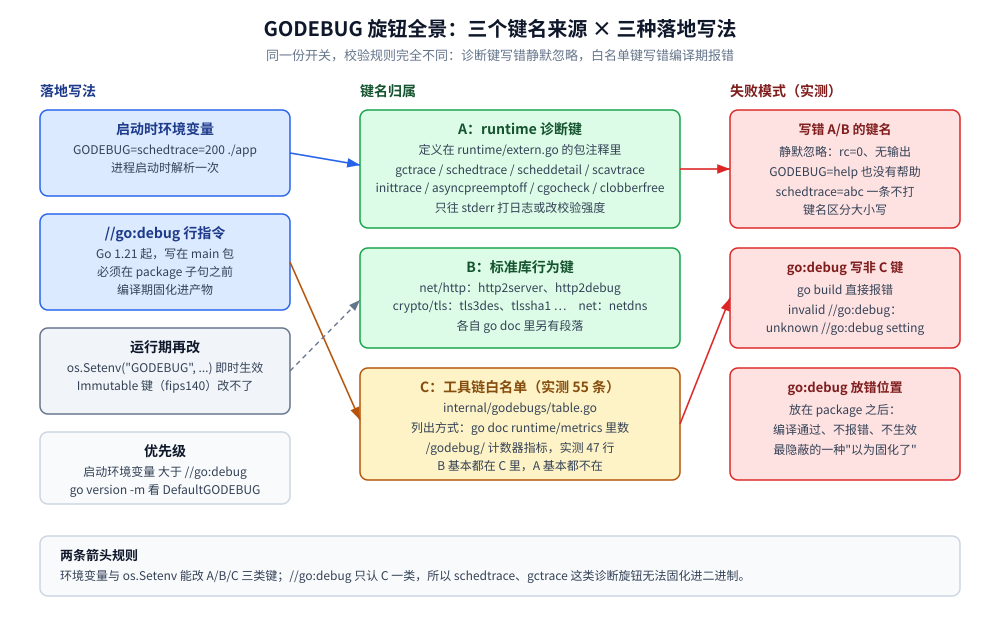
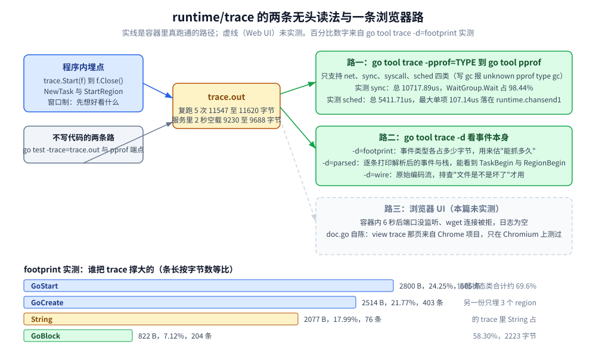

# runtime调试与trace

> Go 运行时自带的一整套"自省旋钮"：`GODEBUG` 的键从哪来、写错了会怎样、`schedtrace` / `scheddetail` / `gctrace` 每一列读什么、`runtime/trace` 在没有浏览器的环境里怎么解析，以及 `MemStats`、`debug.GCStats`、`runtime/metrics` 三套数的分工与踩坑。
>
> 内容整理自个人学习笔记，素材见 [素材清单.md](../../../素材清单.md)。
>
> ⚠️ 本篇全部读数来自容器 `golang:1.26-alpine`（`go version go1.26.8 linux/amd64`，容器内 `NumCPU=4`、`GOMAXPROCS=4`）真跑；实验代码在 `.workbuddy/tmp/exp/runtime-trace/`。`GMP调度.md`、`垃圾回收机制.md` 里的读数是宿主机 8 P 环境测的，**与本篇的数字不可混用**。

---

## 一、GODEBUG 是一套什么样的开关体系？可用项从哪里列？

**本节要点**：`GODEBUG` 不是"一个调试模式"，而是**一堆互相独立的 name=val 旋钮**，键名分散在三个地方、校验规则各不相同 —— 搞清来源才不会写出"看着生效其实没生效"的开关。

### 1.1 键名有三个来源，效力完全不同

| 来源 | 谁定义 | 列出来靠什么 | 写错键名会怎样 |
|---|---|---|---|
| runtime 自己的诊断键 | `runtime/extern.go` 的包注释（`gctrace`、`schedtrace`、`scheddetail`、`scavtrace`、`inittrace`、`asyncpreemptoff`、`cgocheck`、`invalidptr`、`clobberfree`、`gccheckmark`、`gcpacertrace`、`harddecommit`、`madvdontneed`、`memprofilerate`、`profstackdepth`、`tracebackancestors`、`tracefpunwindoff`、`panicnil`、`efence`、`sbrk`、`gcstoptheworld`、`gcshrinkstackoff`、`dontfreezetheworld`、`checkfinalizers`、`disablethp`、`decoratemappings`、`cpu.*` 等） | `sed -n '35,233p' /usr/local/go/src/runtime/extern.go`，或看 Go 安装目录里那份注释 | **静默忽略**（见 1.2） |
| 标准库借用的行为键 | `net/http`、`crypto/tls`、`net`、`time`、`go/types` 等包各自读 `GODEBUG` | `go doc net/http`、`go doc crypto/tls` 里各自有段落 | 静默忽略 |
| 工具链白名单（影响 `//go:debug` 与 `runtime/metrics`） | `internal/godebugs/table.go`（Go 1.26 容器内 **55 条**，另有 1 条已移除的 `x509sha1`） | `go doc runtime/metrics \| grep -c "/godebug/"` → **47 行**（非 Opaque 的键各导出一个计数器指标） | **`go build` 直接报错**（见 1.3） |

⭐ 一句话区分：**诊断类旋钮（trace/日志）走第一行，行为兼容类旋钮（改语义、能触发"混用版本"告警）走第三行**，两套清单只有少量交集（`panicnil` 既在 extern.go 也在白名单）。

### 1.2 实测：写错键名、写错值、甚至 `GODEBUG=help` 都不报错

```bash
go build -o rt .                                  # 先编译（见第二节为什么必须这样）
GODEBUG=nosuchkey=1 ./rt sched                    # 编不存在的键
GODEBUG=help ./rt sched                           # 想求 help
GODEBUG=schedtrace=abc ./rt sched                 # 值不是数字
```

容器实测（三次都只有一行业务输出，`rc=0`）：

```text
sched done
sched done
sched done
```

`GODEBUG` **没有 help**，`schedtrace=abc` 解析失败后**一条 SCHED 都不打**，也不告诉你为什么。所以：

- 加完开关先确认"该有的输出有没有"，**没有输出 ≠ 没问题**，很可能是键名或值写错了；
- 键名**区分大小写**（`schedTrace=150` 同样静默失效）；
- 多个键用逗号分隔，同一个键写两次以**后一个**为准。

### 1.3 `//go:debug`：把默认值烧进二进制，但只认白名单、且位置有讲究

Go 1.21 起可以在 `main` 包里写 `//go:debug` 行指令，让程序**不依赖启动环境变量**就带上默认值。实测三种写法，结果完全不同：

```bash
# 写法 A：放在 package 子句之前 + 非白名单键 → 编译期报错
GOCACHE=/tmp/c go build -o gdb ./godebugdir
```

```text
# rt/godebugdir
godebugdir/main.go:1:1: invalid //go:debug: unknown //go:debug setting "schedtrace"
```

```bash
# 写法 B：同一个键改放到 package 之后 → 编译通过，指令等于没写
# （文件形态：package main / 空行 / //go:debug schedtrace=500 / import ...）
GOCACHE=/tmp/c go build -o gdb ./godebugdir && ./gdb | head -2
```

```text
go:debug demo done
```

`go vet` 也会报写法 A 的错（`invalid //go:debug: unknown //go:debug setting`），所以**白名单校验只认写在 `package` 子句之前的行**。写法 B 连报错都没有，是最容易踩的一种"以为固化了"。

```go
//go:debug http2server=0

package main
```

白名单内的键才合法（`http2server` 在表里，`schedtrace` / `gctrace` 都不在 —— 诊断类旋钮**不能**用 `//go:debug` 固化）。烧进去的默认值可以在产物里查出来：

```bash
go version -m srv | tail -6        # srv 是上面带 //go:debug http2server=0 的程序
```

```text
	build	-compiler=gc
	build	DefaultGODEBUG=http2server=0
	build	CGO_ENABLED=0
	build	GOARCH=amd64
	build	GOOS=linux
	build	GOAMD64=v1
```

优先级实测（同一个二进制）：**启动时的 `GODEBUG` 环境变量 > `//go:debug` 默认值**。

```bash
GODEBUG=http2server=1 ./mtt | head -1   # 环境变量覆盖 go:debug
```

```text
GODEBUG env="http2server=1" (build-time default from //go:debug http2server=0)
```

而 runtime 侧还有第三种改法：`os.Setenv("GODEBUG", ...)` 之后 runtime 会收到通知并即时生效（源码 `runtime/runtime.go` 里 `syscall_runtimeSetenv` 对 `key == "GODEBUG"` 特判后调用 `godebugNotify(true)`）；个别键（表里标 `Immutable`，例如 `fips140`）**启动后改不了**。



图怎么读：中间一列是"键名归属"，左边一列是三种落地写法（启动环境变量 / `//go:debug` 行指令 / 运行期 `os.Setenv`），右边标了各自的失败模式。图上「白名单 55 条」「metrics 导出 47 个计数器」「`schedtrace` 不在白名单」三个数字来自容器实测；其余为结构示意。

---

## 二、`schedtrace` 与 `scheddetail` 的每一列是什么意思？

**本节要点**：这一节从 [GMP调度.md](GMP调度.md) 第四节的调度器背景里独立出来，专讲**输出怎么读**。`schedtrace` 一行只有十来个字段，但每一列都能直接指向一个结论：并行度够不够、队列积压在谁身上、线程数为什么会超。

### 2.1 前置动作：先 `go build` 再跑二进制

`GODEBUG` 会**同时作用在 `go run` 的工具进程**上，`GODEBUG=schedtrace=150 go run .` 的输出里会混进 `go` 命令自己的调度器采样（时间戳非单调、`0ms` 反复出现，很容易看成"队列一直是 0"）。正确做法：

```bash
GOCACHE=/tmp/c go build -o rt .
GODEBUG=schedtrace=200 ./rt sched      # 1000 个 goroutine，每个约 10ms 纯计算
```

### 2.2 实测单行与逐字段读法（容器 4 P）

```text
SCHED 0ms: gomaxprocs=4 idleprocs=3 threads=2 spinningthreads=0 needspinning=0 idlethreads=0 runqueue=0 [ 0 0 0 0 ] schedticks=[ 0 0 0 0 ]
SCHED 199ms: gomaxprocs=4 idleprocs=0 threads=5 spinningthreads=0 needspinning=1 idlethreads=0 runqueue=395 [ 114 113 114 129 ] schedticks=[ 17 16 16 11 ]
SCHED 603ms: gomaxprocs=4 idleprocs=0 threads=5 spinningthreads=0 needspinning=1 idlethreads=0 runqueue=418 [ 86 79 82 97 ] schedticks=[ 45 50 48 43 ]
SCHED 1217ms: gomaxprocs=4 idleprocs=0 threads=5 spinningthreads=0 needspinning=1 idlethreads=0 runqueue=430 [ 30 30 27 40 ] schedticks=[ 102 100 104 101 ]
SCHED 2231ms: gomaxprocs=4 idleprocs=0 threads=5 spinningthreads=0 needspinning=1 idlethreads=0 runqueue=159 [ 26 9 50 0 ] schedticks=[ 190 183 192 189 ]
```

| 字段 | 本次例子 | 含义与判据 |
|---|---|---|
| `SCHED 199ms` | 199ms | 距进程启动的时间；**间隔不等于设定值**（`schedtrace=200` 打出 199/400/603/807…，采样由 sysmon 驱动，有 ±20 ms 抖动） |
| `gomaxprocs=4` | 4 | P 的数量（容器 `NumCPU=4`） |
| `idleprocs=0` | 0 | 空闲 P 数。**为 0 = 并行度已打满**，此时加协程不会更快 |
| `threads=5` | 5 | M（OS 线程）总数，**可以大于 `gomaxprocs`**：sysmon、阻塞在系统调用里的 M、自旋找活的 M 都不占 P |
| `spinningthreads=0` / `needspinning=1` | 0 / 1 | 正在自旋找活的 M 数 / 是否有 M 该被唤醒来自旋。`needspinning=1` 且 `spinningthreads=0` 通常意味着"活多、但还没轮到接力" |
| `idlethreads=0` | 0 | 休眠中的 M 数 |
| `runqueue=395` | 395 | **全局队列**长度（带锁那一条） |
| `[ 114 113 114 129 ]` | —— | **每个 P 的本地队列长度**，顺序固定 P0~P3 |
| `schedticks=[ 17 16 16 11 ]` | —— | 每个 P 累计调度次数（较新版本 runtime 才打的这个字段，Go 1.26 实测存在），**相邻两行相减**才是这段时间的调度频率 |

⭐ 两个能直接对照的点（本次实测）：

1. **全局队列长期 400 左右、四个本地队列各 100 上下** —— 本地队列容量 256，`1000` 个协程一次全丢出来，溢出到全局队列是必然；`runqueue` 一直不降到 0，就是"积压"的直接证据；
2. **`threads=5 > gomaxprocs=4`** —— 多出来的那 1 个是 sysmon 之类的系统线程，不是"又起了一个干活的线程"。

对比宿主机 8 P 的读数（[GMP调度.md](GMP调度.md) 第四节，P0 本地队列 170/151 最长）：那次是 `gomaxprocs=8`、全局队列 355/374，**同一份代码、不同 CPU 数，绝对值不可比**，趋势一致（本地队列涨→溢出到全局→全局长期非零）。

### 2.3 `scheddetail=1`：把每一行的信息摊开成 P / M / G 三段

`schedtrace` 只给一行汇总，`scheddetail=1` 会在每次采样后打印**每个 P、每个 M、每个 G** 的状态（量很大，只在复现环境开）：

```bash
GODEBUG=schedtrace=400,scheddetail=1 ./rt sched 2>&1 | head -30
```

```text
SCHED 408ms: gomaxprocs=4 idleprocs=0 threads=6 spinningthreads=0 needspinning=1 idlethreads=1 runqueue=424 gcwaiting=false nmidlelocked=0 stopwait=0 sysmonwait=false
  P0: status=1 schedtick=34 syscalltick=0 m=4 runqsize=98 gfreecnt=21 timerslen=0
  P1: status=1 schedtick=32 syscalltick=0 m=5 runqsize=100 gfreecnt=22 timerslen=0
  P2: status=1 schedtick=33 syscalltick=0 m=0 runqsize=190 gfreecnt=24 timerslen=0
  P3: status=1 schedtick=24 syscalltick=0 m=3 runqsize=106 gfreecnt=11 timerslen=0
  M5: p=1 curg=322 mallocing=0 throwing=0 preemptoff= locks=0 dying=0 spinning=false blocked=false lockedg=nil
  M2: p=nil curg=nil mallocing=0 throwing=0 preemptoff= locks=0 dying=0 spinning=false blocked=true lockedg=nil
  M0: p=2 curg=nil mallocing=0 throwing=0 preemptoff= locks=1 dying=0 spinning=false blocked=false lockedg=nil
  G1: status=4(sync.WaitGroup.Wait) m=nil lockedm=nil
  G17: status=4(force gc (idle)) m=nil lockedm=nil
  G18: status=4(GC sweep wait) m=nil lockedm=nil
  G19: status=4(GC scavenge wait) m=nil lockedm=nil
  G33: status=4(GOMAXPROCS updater (idle)) m=nil lockedm=nil
  G34: status=4(finalizer wait) m=nil lockedm=nil
  G35: status=4(GC worker (idle)) m=nil lockedm=nil
```

| 段 | 字段 | 怎么读 |
|---|---|---|
| 汇总行新增 | `gcwaiting=false` | 有没有 P 正在为 GC 的 STW 而等待；**持续 true = 停顿在堆积** |
| | `stopwait=0` / `nmidlelocked=0` | 等待 STW 结束的 M 数 / 被锁住且空闲的 M 数；非零持续出现多半和 `LockOSThread`、cgo 有关 |
| | `sysmonwait=false` | sysmon 是否在休眠（它在睡 = 这些采样也不会按时打） |
| P 行 | `status=1` | Go 1.26 的 P 状态常量顺序：`_Pidle=0`、`_Prunning=1`、`_Pgcstop=3`、`_Pdead=4`（中间的 `2` 是已废弃的 `_Psyscall_unused` 占位，`runtime/runtime2.go`）；本次实测四个 P 全是 `status=1` |
| | `runqsize` / `gfreecnt` / `timerslen` | 本地队列长度 / 缓存的空 G 结构数 / 该 P 上挂的 timer 数（**timers 多会让这个 P 的调度延迟变大**） |
| M 行 | `p=` / `curg=` | 这个 M 绑着哪个 P、正在跑哪个 G；`p=nil curg=nil` 的 M 就是"多出来的线程" |
| | `locks` / `blocked=true` / `lockedg` | 持有 runtime 锁的层数 / 是否阻塞在系统调用 / 是否被 `LockOSThread` 独占 |
| G 行 | `status=4(名字)` | 括号里是**等待原因**。G 状态码：`_Gidle=0`、`_Grunnable=1`、`_Grunning=2`、`_Gsyscall=3`、`_Gwaiting=4`、`_Gdead=6`、`_Gcopystack=8`、`_Gpreempted=9`、`_Gleaked=10`、`_Gdeadextra=11`（`runtime/runtime2.go` 的常量注释，**核验方式：`docker run --rm golang:1.26-alpine sed -n '12,120p' /usr/local/go/src/runtime/runtime2.go`**） |

⭐ `G17 force gc (idle)`、`G18 GC sweep wait`、`G19 GC scavenge wait`、`G33 GOMAXPROCS updater`、`G34 finalizer wait`、`G35.. GC worker` 这几行**很重要**：它们是 runtime 自己的协程，是排查 `NumGoroutine` 与 `runtime/metrics` 数不一致时唯一的"底牌清单"（见 7.1）。

---

## 三、`gctrace` 的每一行怎么读？

**本节要点**：这一节从 [垃圾回收机制.md](垃圾回收机制.md) 第三节搬过来并按容器实测重做了一遍 —— `gctrace` 一行里塞了**两段时间、三段堆、一个百分比**，读错顺序会把"并发标记时长"当成"STW 停顿"。

### 3.1 实测输出（一次运行，节选 gc 1~9 中的 7 行）

```bash
GODEBUG=gctrace=1 ./rt gc        # 240 MB 分配压力，一半留在存活集
```

```text
gc 1 @0.038s 1%: 0.82+1.4+0.11 ms clock, 3.3+0/1.0/0.67+0.44 ms cpu, 4->4->3 MB, 4 MB goal, 0 MB stacks, 0 MB globals, 4 P
gc 2 @0.049s 1%: 0.25+1.9+0.090 ms clock, 1.0+0/0.28/0.048+0.36 ms cpu, 7->7->5 MB, 7 MB goal, 0 MB stacks, 0 MB globals, 4 P
gc 3 @0.060s 1%: 0.071+1.8+0.005 ms clock, 0.28+0.005/0.11/0.23+0.022 ms cpu, 10->10->7 MB, 10 MB goal, 0 MB stacks, 0 MB globals, 4 P
gc 5 @0.098s 1%: 0.032+9.9+0.045 ms clock, 0.12+0/1.4/0.90+0.18 ms cpu, 22->23->17 MB, 22 MB goal, 0 MB stacks, 0 MB globals, 4 P
gc 6 @0.130s 1%: 0.17+1.0+0.068 ms clock, 0.70+0/0.17/0.034+0.27 ms cpu, 34->34->25 MB, 34 MB goal, 0 MB stacks, 0 MB globals, 4 P
gc 8 @0.240s 1%: 0.059+3.3+0.72 ms clock, 0.23+0/0.22/0.035+2.9 ms cpu, 75->76->57 MB, 76 MB goal, 0 MB stacks, 0 MB globals, 4 P
gc 9 @0.343s 0%: 0.075+0.81+0.10 ms clock, 0.30+0/0.039/0.40+0.40 ms cpu, 112->112->84 MB, 114 MB goal, 0 MB stacks, 0 MB globals, 4 P
keep buckets: 120
```

### 3.2 逐字段对照表

| 字段 | 例子 | 含义 |
|---|---|---|
| `gc 9` | 第 9 次 | 自进程启动的 GC 序号 |
| `@0.343s` | 0.343s | 进程启动到**本次 GC 开始**的时间 |
| `0%` | 0%~3% | **到目前为止 GC 占用的 CPU 比例**（与 `MemStats.GCCPUFraction` 同一个量）；长期偏高 = 分配太猛 |
| `0.075+0.81+0.10 ms clock` | 三段墙钟 | **STW(setup) + 并发标记 + STW(termination)**；只有第 1、3 段是真正的"全局停顿" |
| `0.30+0/0.039/0.40+0.40 ms cpu` | 四段 CPU | setup + **assist/后台标记/idle** + termination；中间三段是标记工作量的来源分布 |
| `112->112->84 MB` | 三段堆 | 标记开始时的堆 → 标记结束时的堆 → **标记结束后存活堆** |
| `114 MB goal` | 目标堆 | 本次触发时的目标堆大小（由存活集 × `GOGC` 或 `GOMEMLIMIT` 算出） |
| `0 MB stacks / 0 MB globals` | 扫描量 | 栈与全局变量的扫描量；很大说明栈深或全局变量多 |
| `4 P` | 参与数 | 参与标记的 P 数量（= `GOMAXPROCS`） |

### 3.3 连跑 3 次的波动区间（同一份程序）

时序类数字必须带区间。第 8、9 次 GC 的三段墙钟，三次运行分别读到：

```text
run1  gc 8: 0.059+3.3+0.72 ms clock    gc 9: 0.075+0.81+0.10 ms clock
run2  gc 8: 0.21+3.0+0.075 ms clock    gc 9: 0.30+9.9+0.037 ms clock
run3  gc 8: 0.061+0.72+0.53 ms clock    gc 9: 0.075+4.7+0.095 ms clock
```

只能断言趋势：**两段 STW 稳定在亚毫秒级（0.03~0.82 ms），并发标记段在 0.5~10 ms 之间大幅波动**；存活集单调上涨（`4 → 112 MB`）导致 GC 间隔越拉越长（`@0.038s → @0.343s`）。**不同运行的数字不可混用**，写结论时同一次运行内比较。

⭐ 三个最该盯的数：`clock` 的第 1、3 段（停顿）、三段堆的**第 3 个**（存活集，它决定下一次目标堆）、开头的**百分比**（>20~30% 就该减少分配而不是调 GC）。

### 3.4 `scavtrace`：GC 之外还想知道"内存有没有还给操作系统"

`gctrace` 只讲回收，不讲归还。`GODEBUG=scavtrace=1` 每次 GC 左右打一行：

```bash
GODEBUG=scavtrace=1 ./rt scavenge      # 200 MB 存活 → 置 nil → runtime.GC() → debug.FreeOSMemory()
```

```text
scav 0 KiB work (bg), 0 KiB work (eager), 4344 KiB now, 99% util
peak: HeapAlloc=200 MB HeapSys=207 MB HeapIdle=7 MB
after runtime.GC(): HeapAlloc=0 MB HeapSys=207 MB HeapIdle=207 MB
scav 0 KiB work (bg), 186960 KiB work (eager), 208712 KiB now, 9% util (forced)
after debug.FreeOSMemory(): HeapAlloc=0 MB HeapSys=207 MB HeapIdle=207 MB HeapReleased=203 MB
```

- `work (bg)` / `work (eager)`：这段时间**后台归还**量 / **主动（eager）归还**量；
- `now`：当前已归还 OS 的总量（对应 `MemStats.HeapReleased`）；
- `util`：未归还堆里"真在用着"的比例 —— **`HeapIdle` 很大但 `util` 很高，说明不是碎片而是真存活**；
- 结尾带 `(forced)` 的就是被 `debug.FreeOSMemory()` 逼出来的那一次。

---

## 四、`runtime/trace` 抓的是什么？没有浏览器怎么看？

**本节要点**：trace 记的是**事件**（谁在什么时候从什么状态变成什么状态），pprof 记的是**采样归因**。所以"协程为什么没立刻被调度""这段耗时卡在等锁还是等系统调用"这类**先后顺序**问题必须用 trace。

### 4.1 三种生成方式

```go
f, err := os.Create("trace.out")
if err != nil {
	panic(err)
}
if err := trace.Start(f); err != nil { // 同一进程同时只能有一个 trace
	panic(err)
}
doWork()
trace.Stop() // 必须先 Stop 再 Close，否则尾部事件丢在缓冲区里
f.Close()
```

另外两条不写代码的路：**`go test -trace=trace.out ./pkg`**（测试态抓），和 **`net/http/pprof` 自带端点** `http://host/debug/pprof/trace?seconds=5`（线上按需抓，抓完再拿回本机看）。

实测生成：`./rt trace` 写出约 **11.5 KB** 的 `trace.out`（200 个协程、含 channel 往返与互斥锁）——
同一份代码复跑 5 次的文件字节数是 11547 / 11558 / 11567 / 11586 / 11620，
**±0.6% 的浮动来自时间戳与批事件编码，别当成规格**。服务侧同理：`GET /debug/trace?s=2`
空载复跑三次是 9230 / 9234 / 9470 字节（「使用」那一轮量到的是 9688 字节），
而同一服务先打一次 `/work`（8 MiB 堆 + 200 个睡 10ms 的协程）再抓同样的 2 秒窗口，
直接涨到 **14759 字节** —— **体积由窗口里发生了多少事件决定**，不是由 `seconds` 参数决定。

### 4.2 无头实测：`-pprof` 与 `-d` 两条不依赖浏览器的路

`go tool trace` 默认要开浏览器，但**它自带两种纯命令行输出**（`go tool trace -h` 原文，核验方式 `docker run --rm golang:1.26-alpine go tool trace -h`）：

```text
Supported profile types are:
    - net: network blocking profile
    - sync: synchronization blocking profile
    - syscall: syscall blocking profile
    - sched: scheduler latency profile

-pprof=type: print a pprof-like profile instead
-d=mode: print debug info and exit (modes: wire, parsed, footprint)
```

**路一：把 trace 里的四类"等待"倒成 pprof 再看。** 只有 `net / sync / syscall / sched` 四种，写 `gc` 会直接失败：

```bash
go tool trace -pprof=sched trace.out > /tmp/sched.pprof   # rc=0, 369 字节
go tool trace -pprof=sync  trace.out > /tmp/sync.pprof    # rc=0, 359 字节
go tool trace -pprof=gc    trace.out                      # rc=1: unknown pprof type gc
go tool pprof -top -nodecount=5 /tmp/sync.pprof
```

```text
Main binary filename not available.
Type: delay
Showing nodes accounting for 10717.89us, 100% of 10717.89us total
      flat  flat%   sum%        cum   cum%
10550.46us 98.44% 98.44% 10550.46us 98.44%  sync.(*WaitGroup).Wait
  167.42us  1.56%   100%   167.42us  1.56%  runtime.chanrecv1
```

⚠️ **`us` 数值每抓一次都不同**：上一轮那份 11586 字节的 trace 是 `14414.91us / 185.41us`，
本轮这份 11547 字节的是 `10550.46us / 167.42us`（总时长跟着程序跑到哪一步停表走）。
**能复现的只有比例**：`WaitGroup.Wait` 占 **98.4%~98.7%**、`chanrecv1` 占 1.3%~1.6%。

同一份 trace 的 `sched` 视图（调度延迟）总量 `5856.26us`，最大单项 `112.83us` 挂在
`runtime.chansend1`（上一轮是 `5411.71us` / `107.14us`，同一形状）——
**锁等待的最大项比调度延迟的最大项大近百倍**，这就是"该跑却没跑"要看 sync 而不是 sched 的判据，
全程没开浏览器。

**路二：`-d` 直接看 trace 的内部结构。** `-d=footprint` 告诉你**事件类型各占多少字节**（决定"抓多久会撑爆"）：

```text
Event                Bytes  %       Count  %
-                    -      -       -      -
GoStart              2800   24.25%  605    30.40%
GoCreate             2514   21.77%  403    20.25%
String               2077   17.99%  76     3.82%
GoUnblock            1101   9.53%   201    10.10%
GoBlock              822    7.12%   204    10.25%
GoDestroy            800    6.93%   400    20.10%
ProcStart            24     0.21%  5      0.25%
ProcSteal            7      0.06%   1      0.05%
STWBegin             4      0.03%   1      0.05%
```

协程状态类事件（`GoStart/GoCreate/GoBlock/GoUnblock/GoDestroy`）占了 **69.6%** 的体积 ——
就是那五行字节数相加：`2800+2514+1101+822+800 = 8037`，除以整份 11547 字节。
四份独立抓取的同一比值分别是 **69.35% / 69.40% / 69.54% / 69.80%**（比例稳、绝对字节数每次差几十个）。
所以**高并发服务的 trace 窗口要短**（1~3 秒），否则光协程创建销毁就能写几十 MB。
`-d=parsed` 则逐条打印解析后的事件，能直接看到 `/sched/gomaxprocs:threads` 这类指标事件与栈：

```text
M=7 P=3 G=1 Metric Time=882243152448 Name="/sched/gomaxprocs:threads" Value=Value{Uint64(4)}
```

### 4.3 region 与 task：把业务阶段写进 trace

标准库事件只讲"协程/锁/系统调用"，要看"这个阶段花了多久"得自己埋点：

- `trace.NewTask(ctx, "handleRequest")` —— 建一个**任务**（可派生子任务），返回带 region 的 ctx；
- `trace.StartRegion(ctx, "validate")` —— 手工区段，**必须 `End()`**；
- `trace.WithRegion(ctx, "store", func(){...})` —— 闭包版，不用管退出；
- `trace.Log(ctx, "db", "rows=1")` —— 打一个时间点上的事件。

埋点确实进文件了（`go tool trace -d=parsed region.out` 的原文片段）：

```text
M=626 P=1 G=1 TaskBegin Time=1355356693760 ID=1 Parent=18446744073709551615 Type="handleRequest"
M=626 P=1 G=1 RegionBegin Time=1355356724736 Task=1 Type="validate"
```

⚠️ region 的代价全在字符串表上：这份只跑了 3 个阶段的 trace，`String` 事件就占 **58.30%**（2223 字节 / 83 条），比所有状态事件加起来还多 —— 所以 **region 名要少而稳定**，不要把请求 ID、用户 ID 拼进 region 名（那等于每次调用都往 trace 里塞一个新字符串）。

### 4.4 浏览器 UI 没起来，但路由能对着源码确认

容器里 `go tool trace -http=127.0.0.1:6060 trace.out` 起了 6 秒后 **端口没有监听**（`netstat -tln` 空、`wget` 连接被拒、日志为空），**Web UI 属于未实测**。可以确认的是 `cmd/trace/main.go` 注册的这组路由 —— 打开页面后能点进去的就是这些：

| 路由 | 看什么 | 对应问题 |
|---|---|---|
| `/`（`ViewProc` + `ViewThread`） | **processor view**：每个 P 一条时间线、每个 M 一条线程线 | 有没有 P 长时间空着、CPU 有没有被占满 |
| `/trace`（trace viewer，Chrome 系） | 全局时间线 + 状态视图（runnable/running/blocking/syscall） | 一次请求在时间轴上被切成几段 |
| `/goroutines`、`/goroutine` | **goroutine view**：按协程分组的状态时长表，可下钻单个协程 | 谁睡了多久、被谁唤醒 |
| `/mmu` | **class view**（Mutator Utilization Map）：按 goroutine 类别（user / GC / syscall …）着色的热力图 | 这段时间到底是谁在吃 CPU：业务还是 GC |
| `/syscall`、`/io`、`/block`、`/sched`、`/regionio` | 四张 pprof 图 + region 版 | 各类等待的归因排序 |

`cmd/trace/doc.go` 自己也写明了这个坑：**"the trace viewer itself (the 'view trace' page) comes from the Chrome/Chromium project and is only actively tested on that browser"** —— 别的浏览器打开可能只有列表没有图。



图怎么读：实线是本次容器里真跑通的路径，虚线（浏览器 UI）是没有跑通的；`69.6%` 与 `58.30%` 两个数字来自 `-d=footprint` 的实测表，其余为结构示意。

### 4.5 pprof 与 trace 的分工判据

| 想知道什么 | 用哪个 | 为什么 |
|---|---|---|
| CPU 花在哪个函数上 | `pprof` cpu profile | 采样归因，正是它的强项；trace 没有 CPU 采样 |
| 协程为什么"该跑却没跑"（调度延迟、被谁唤醒） | **trace** | 只有 trace 记录"状态迁移 + 唤醒关系" |
| 锁等待、channel 收发阻塞的系统性原因 | pprof `-blocked`/`-mutex` 先定位，再用 trace 确认先后 | profile 给量，trace 给顺序 |
| 一次请求里 5 个阶段各花多久 | **trace + region** | pprof 没有"区间"概念 |
| 是不是 GC 抢走了时间 | `gctrace` / `pprof` gc profile / trace 的 `STWBegin` 事件 | 前两者看比例与量级，trace 看**具体落在哪一段业务代码上** |
| 内存为什么涨 / 为什么还不还给 OS | `MemStats` + `scavtrace`（见第五节） | trace 只记 `HeapAlloc`/`HeapGoal` 事件点 |
| 抓现场的成本 | profile ≈ 常驻低成本（采样率可控）；trace **窗口制**，别长期开 | 见 4.2 的体积分布 |

---

## 五、`MemStats`、`debug.GCStats`、`runtime/metrics` 三套数怎么分工？

**本节要点**：三套数**互相不等价**，同一个名字（比如"堆大小"）在三处口径不同；线上要的是"能被 Prometheus 抓走、且不会把 STW 拉长"的那一套。

### 5.1 `runtime.ReadMemStats`：字段清单与实测

`ReadMemStats` **会短暂 STW**（为了拿到一致快照），所以只适合低频打点，不适合每个请求都读。

```go
var ms runtime.MemStats
runtime.ReadMemStats(&ms)
```

| 字段组 | 含义（`go doc runtime.MemStats` 原文要点） | 用法 |
|---|---|---|
| `TotalAlloc` / `Mallocs` / `Frees` | 累计分配字节 / 对象数（**只增不减**） | 分配速率 = 两次采样相减除以时间；`Mallocs-Frees` 才是存活对象数 |
| `HeapAlloc` | 当前堆上"已分配对象"字节数，含**还没被 sweep 掉的不可达对象**，所以是平滑变化不是锯齿 | 业务侧"内存用量"首选 |
| `HeapSys` | 堆向 OS 申请过的地址空间，**官方注释：estimates the largest size the heap has had** | ⚠️ 归还后**不会回落**，别拿它判断当前占用 |
| `HeapIdle` / `HeapInuse` / `HeapReleased` | 空闲 span / 在用 span / **已归还 OS** 的字节 | `HeapIdle - HeapReleased` = 攥在手里随时能复用的量；`HeapInuse - HeapAlloc` ≈ 碎片上界 |
| `NextGC` | 下一轮 GC 的目标堆 | 和 `HeapAlloc` 一起看就知道"还剩多少余量" |
| `PauseTotalNs` / `PauseNs[256]` / `PauseEnd[256]` | STW 累计与**环形缓冲**（最近一次在 `PauseNs[(NumGC+255)%256]`） | 只有 256 个槽，长跑进程的历史会被覆盖 |
| `NumGC` / `NumForcedGC` / `GCCPUFraction` | 完成轮数 / 被 `runtime.GC()` 强制的轮数 / GC 占用的 CPU 比例 | `NumForcedGC` 非 0 要先问谁在调 `runtime.GC()` |
| `BySize[61]` | 每个 size class 的 `Mallocs/Frees` | 定位"哪一类对象分配最多"（>60 号大小不统计） |
| `StackInuse/StackSys`、`GCSys`、`OtherSys`、`BuckHashSys` | 非堆部分 | `Sys` 就是这些 `XSys` 之和 |

容器实测（`./rt memstats`：48 MB 分配压力、24 MB 存活、500 个短眠协程，三次运行）：

```text
NumGoroutine during work = 501
HeapAlloc=32 MB HeapSys=34 MB HeapObjects=1674 NumGC=5 NextGC=36 MB Sys=40 MB
HeapAlloc=32 MB HeapSys=38 MB HeapObjects=1675 NumGC=5 NextGC=36 MB Sys=44 MB
```

`HeapAlloc`/`NumGC`/`HeapObjects` 稳定（32 MB / 5 次 / 1674±1），`HeapSys`、`Sys` 每次都涨（34→38 MB、40→44 MB）—— 这正是 `HeapSys` "只记峰值"的表现，**别把它当 RSS**。

`HeapSys` 与归还的关系，实测最直观（`./rt scavenge`，见 3.4）：`runtime.GC()` 之后 `HeapIdle` 从 7 MB 涨到 207 MB，`HeapSys` **纹丝不动 207 MB**；`debug.FreeOSMemory()` 之后 `HeapReleased=203 MB`，`HeapSys` 还是 207 MB。**判断"还不还回去"要看 `HeapReleased` / `scavtrace` 的 `now`，不是 `HeapSys`。**

### 5.2 `debug.ReadGCStats`：拿分位数比拿 `PauseNs` 环形缓冲省事

```go
var gs debug.GCStats
gs.PauseQuantiles = make([]time.Duration, 5) // 先给长度，才要分位数
debug.ReadGCStats(&gs)
```

```text
debug.ReadGCStats: NumGC=5 LastGC=18:03:55.742 PauseTotal=1.458444ms len(Pause)=5 len(PauseEnd)=5
most recent pauses (Pause[0:3]) = [354.407µs 131.44µs 144.044µs]
  quantile[0] = 131.44µs   quantile[1] = 144.044µs   quantile[2] = 354.407µs
  quantile[3] = 378.015µs  quantile[4] = 450.538µs
```

- `Pause` / `PauseEnd` **最近一次在前**（`Pause[0]` 是最新，和 `MemStats.PauseNs` 的环形语义相反 —— 混用必错）；
- 想要多少分位数就给 `PauseQuantiles` 设多长，返回是**升序**（`[4]` 是最大值）；
- 三次运行的 `PauseTotal` = 840.5 µs / 1.320469 ms / 1.458444 ms，`MaxPause` = 334 / 420 / 450 µs：**只能断言"停顿在几百微秒量级"**，不要写精确值。

### 5.3 `runtime/metrics`：给监控系统用的那一套

`ReadMemStats` 要 STW，`runtime/metrics` 不用，名字还是稳定的 `/类别/名:单位` 格式（`垃圾回收机制.md` 已把"用 metrics 取代 MemStats"列为官方推荐，这里只补实测与坑）：

```go
ms := []metrics.Sample{
	{Name: "/memory/classes/heap/objects:bytes"},
	{Name: "/sched/goroutines:goroutines"},
	{Name: "/gc/heap/live:bytes"},
	{Name: "/sched/latencies:seconds"},
	{Name: "/no/such/metric:bytes"},
}
metrics.Read(ms)
```

```text
/sched/gomaxprocs:threads                        4
/sched/latencies:seconds                         histogram, buckets=162
/sched/goroutines:goroutines                     310
/memory/classes/heap/objects:bytes               21240696
/gc/heap/live:bytes                              18991384
/gc/heap/goal:bytes                              38143418
/gc/pauses:seconds                               histogram, buckets=162
/gc/cycles/total:gc-cycles                       3
/no/such/metric:bytes                            KindBad（名字不存在）
```

三个坑：**直方图字段要走 `v.Float64Histogram().Buckets`**（`metrics.Value` 上没有 `Buckets` 字段，写 `v.Buckets` 编译不过：`v.Buckets undefined (type metrics.Value has no field or method Buckets)`）；**名字写错不 panic，只给你一个 `KindBad`**；`/sched/goroutines:goroutines` 的官方释义是 "Count of live goroutines"，**口径和 `NumGoroutine` 不一样**（见 7.1）。

### 5.4 三套数的选择判据

| 场景 | 选 | 理由 |
|---|---|---|
| 命令行 / 一次性诊断，要一次拿全 | `ReadMemStats` | 字段最全（含 `BySize`），代价是一次 STW |
| 常驻服务按 15s 暴露给 Prometheus | `runtime/metrics` | 无 STW、名字稳定、直方图能算分位 |
| 只关心 GC 停顿分布 | `debug.ReadGCStats` | 直接给分位数，不用自己排环形缓冲 |
| 要看某个 size class / mcache 细节 | `ReadMemStats`（`BySize`） | metrics 没暴露这个粒度 |
| 容器内存告警阈值 | `HeapReleased` + cgroup 的 RSS，**不是 `HeapSys`** | `HeapSys` 只记峰值，见 5.1 |

---

## 六、`runtime/debug` 那几个 `Set*` 各管什么？

**本节要点**：这些函数几乎都**返回上一次的设置**，所以"读一个值"也要靠调它 —— 但要注意哪些只影响 GC、哪些是"炸得更早"的保护栏。

### 6.1 实测一览

```go
debug.SetGCPercent(100)              // 返回旧值
debug.SetMemoryLimit(80 << 20)       // 返回旧值（默认 math.MaxInt64 = 不设限）
debug.SetMaxThreads(1000)            // 返回旧值 10000
debug.SetMaxStack(32 << 20)          // 返回旧值 1000000000
debug.SetCrashOutput(nil, debug.CrashOptions{}) // 关掉"崩溃输出多写一份到某个文件"
debug.SetPanicOnFault(true)          // 返回旧值
debug.SetTraceback("all")            // 崩溃时打印所有协程（GOTRACEBACK 的运行期版）
debug.FreeOSMemory()                 // 强制一次 GC + 立即归还
```

```text
SetGCPercent(100) returned old = 100
SetMemoryLimit(80MiB) returned old = 9223372036854775807 (8796093022207 MiB)
debug.SetMaxThreads(1000): old=10000, restore=1000
debug.SetMaxStack(32MiB): old=1000000000 (=953 MiB), restore=33554432
debug.SetCrashOutput(nil) -> err=<nil>
debug.SetPanicOnFault(true) -> old=false
```

`SetMaxStack` 的默认值读数就是官方文档说的那个数（"初始 64 位系统 1 GB"）—— `restore=33554432` 是第二次调用把 32 MiB 又写回去时返回的**上一次**值，正好验证"返回值 = 旧值"这个契约。

| 函数 | 管什么 | 什么时候用 |
|---|---|---|
| `SetGCPercent` | 等价 `GOGC`，`-1` 关 GC | 压测临时改档；**调参实测见 [垃圾回收机制.md](垃圾回收机制.md) 第四节，不在此重复** |
| `SetMemoryLimit` | 等价 `GOMEMLIMIT`，`-1` 不设限、`0` 等于"永远在 GC" | 容器里给软上限。**只在实际存活集 < 限制时有意义**，见 6.2 |
| `SetMaxThreads` | OS 线程数上限（默认 **10000**），超了直接 crash | 防"线程爆炸拖垮整机"，是**自杀式保护**，不是限流 |
| `SetMaxStack` | 单协程栈上限（64 位默认 **1 GB**），超了 crash | 防无限递归吃光内存 |
| `SetCrashOutput` | 把未恢复 panic / fatal error **额外写一份**到指定文件（Go 1.22） | 标准错误被重定向掉的守护进程 |
| `SetPanicOnFault` | 把段错误变成可 recover 的 panic（配合 `recover` 做探针式读内存） | 只适合"明知地址危险"的场景 |
| `SetTraceback` | 等价 `GOTRACEBACK`；**低于环境变量值的调用会被忽略** | 线上临时要全量协程栈 |
| `FreeOSMemory` | 强制 GC + 立即把空闲堆还给 OS | 见 5.1：**它只涨 `HeapReleased`，不动 `HeapSys`** |

### 6.2 实测：`SetMemoryLimit` 低于存活集会怎样

存活集 120 MiB、限制设成 80 MiB，每 30 轮打一次（`./apib memlimit`）：

```text
after 1st GC: HeapSys=7 MiB HeapInuse=0 MiB NextGC=4 MiB NumGC=1
round  30: HeapAlloc=30 MiB HeapSys=35 MiB NumGC=4
round  60: HeapAlloc=60 MiB HeapSys=67 MiB NumGC=5
round  90: HeapAlloc=90 MiB HeapSys=95 MiB NumGC=19
round 120: HeapAlloc=120 MiB HeapSys=127 MiB NumGC=47
end: HeapAlloc=120 MiB HeapSys=127 MiB NumGC=48 GCCPUFraction=0.064
```

60→90 轮之间 GC 次数从 `5` 跳到 `19`，90→120 轮再跳到 `47`：**存活集已经超过软限制，GC 被迫连续重启**，最后 `GOGC` 的"翻倍再收"节奏完全失效。趋势可断言：限制压到存活集以下时 **GC 次数单调暴涨、`GCCPUFraction` 明显抬头**（本次 0.064）；具体次数每次运行都有波动。

### 6.3 更正：`debug.SetCrashStack` 不存在

`go doc runtime/debug`（容器 `golang:1.26-alpine`，核验方式同下）列出的全部函数是：

```text
func FreeOSMemory()
func PrintStack()
func ReadGCStats(stats *GCStats)
func SetCrashOutput(f *os.File, opts CrashOptions) error
func SetGCPercent(percent int) int
func SetMaxStack(bytes int) int
func SetMaxThreads(threads int) int
func SetMemoryLimit(limit int64) int64
func SetPanicOnFault(enabled bool) bool
func SetTraceback(level string)
func Stack() []byte
func WriteHeapDump(fd uintptr)
```

`grep -rn SetCrashStack /usr/local/go/src` **零命中** —— 崩溃时想多打印栈，能用的是 `SetTraceback("all")` / `GOTRACEBACK=all`（控制**打印哪些协程**）与 `GODEBUG=tracebackancestors=N`（把 traceback 延伸到**创建该协程的位置**），没有"设置崩溃栈大小"这个 API。同理，`runtime.Stack` 的缓冲区大小由调用者给（见 7.2），不存在"崩溃栈上限"旋钮。

---

## 七、`NumGoroutine`、`runtime.Stack`、`Gosched` 的调试用法与陷阱

**本节要点**：三个都能用来"看一眼进程内部"，但**口径都和你以为的不一样**，用错就会得出"泄漏了"或"没泄漏"的相反结论。

### 7.1 `runtime.NumGoroutine()`：不含跑在系统栈上的协程

源码（`/usr/local/go/src/runtime/debug.go`、`proc.go`，**核验方式：`docker run --rm golang:1.26-alpine sed -n '176,182p' /usr/local/go/src/runtime/debug.go`**）：

```go
func NumGoroutine() int {
	return int(gcount(false))
}

func gcount(includeSys bool) int32 {
	n := int32(atomic.Loaduintptr(&allglen)) - sched.gFree.stack.size - sched.gFree.noStack.size
	if !includeSys {
		n -= sched.ngsys.Load()
	}
	for _, pp := range allp {
		n -= pp.gFree.size
	}
	if n < 1 {
		n = 1
	}
	return n
}
```

三个直接结论：**减掉了 `sched.ngsys`（跑在系统栈上的 runtime 协程）**、减掉了各级 G 空闲表、**下限是 1**（源码注释自己写着 "the result can be inconsistent"）。

实测三方对照（`./apib count`，同时开 `scheddetail`）：

```text
SCHED 605ms: ...  （G 行共 10 条）
  G1: status=4(sleep)                     G2: status=4(force gc (idle))
  G17: status=4(GC sweep wait)            G18: status=4(GC scavenge wait)
  G33: status=4(GOMAXPROCS updater (idle)) G34: status=4(finalizer wait)
  G35..G38: status=4(GC worker (idle))
NumGoroutine at start        = 1
NumGoroutine after runtime.GC()    = 1
NumGoroutine after 500ms idle      = 1
NumGoroutine with 1 parked G       = 2
```

同一时刻 `scheddetail` 列了 **10 个 G**，`NumGoroutine` 报 **1**：那 9 个内部协程被 `ngsys` 减掉了。服务里更直接的对照（实测见「使用」一节）：**`NumGoroutine=3` 而 `/sched/goroutines:goroutines=13`**。

所以：**用 `NumGoroutine` 判泄漏是对的**（它恰好滤掉了 runtime 自己那批常驻协程），但**不能拿它和 metrics/pprof 的数字互相校验** —— 两个口径本来就不同。判泄漏看**趋势**不看绝对值（`../并发编程/协程泄漏与死锁.md` 讲的是 pprof 侧的聚类定位，本篇只补口径）。

### 7.2 `runtime.Stack`：截断不报错，缓冲区要自己估够

```go
buf := make([]byte, 4096)
n := runtime.Stack(buf, false)   // 只当前协程
```

```text
runtime.Stack(all=false): 178/4096 bytes, 5 lines
  first line: goroutine 1 [running]:
runtime.Stack into 64-byte buffer: returned 64 (silently truncated)
```

- **返回值 == 缓冲区长度就说明被截断了**，没有"再给我大一点的缓冲区我重算"的机制；
- 全量 dump 的量级实测：2000 个阻塞在 `select{}` 上的协程（`./apib stackdump`）——`NumGoroutine = 2001`，`runtime.Stack(buf, true)` 写入 **473128 字节**（1 MB 缓冲够用），约 **236 字节/协程**；协程有业务栈帧时这个值会成倍涨，所以**缓冲区按 `协程数 × 2 KB` 起估**；
- 协程上万时别在请求路径上调它（拿的是全进程快照）；崩溃现场交给 `GOTRACEBACK=all` 或 `debug.SetTraceback("all")`；
- 想要"结构化的一条一个协程"，用 `runtime.GoroutineProfile`（`GoroutineProfile(nil)` 返回需要多少个 `StackRecord`，实测 `n=1 ok=false` 就是"缓冲区不够，先告诉你要几个"）。

### 7.3 `runtime.Gosched()`：让出是免费的，**顺序不是**

```text
Gosched interleave order: [2 0 1 2 0 1 2 0 1]
100000x runtime.Gosched() = 39.858822ms (~399 ns each)
GOMAXPROCS=1 下同样顺序，耗时 23.190593ms (~232 ns each)
```

- 单次让出成本在**百纳秒量级**（两次运行 232 / 399 ns，波动接近一倍，只断言"比一次 channel 往返便宜、比一次系统调用便宜得多"）；
- 三个协程各让出 3 次，实测确实轮转成 `2 0 1` 循环 —— 但**这是调度器当前实现的结果，不是保证**：`Gosched` 只保证"我回到可运行状态、可能换个 G 跑"，**不能用来做同步或计数**（要同步就用 channel / `WaitGroup`，见 `../并发编程/并发同步原语.md`）。

### 7.4 抢占类问题的可观测证据

`GODEBUG=asyncpreemptoff=1` 关掉基于信号 asynchronous preemption，是**验证"某段循环到底能不能被抢占"的唯一开关**。`extern.go` 原文（核验方式：`docker run --rm golang:1.26-alpine sed -n '228,234p' /usr/local/go/src/runtime/extern.go`）：

```text
	asyncpreemptoff: asyncpreemptoff=1 disables signal-based
	asynchronous goroutine preemption. This makes some loops
	non-preemptible for long periods, which may delay GC and
	goroutine scheduling. This is useful for debugging GC issues
	because it also disables the conservative stack scanning used
	for asynchronously preempted goroutines.
```

- **量化对照不要在本篇复现**：同一份"打点协程首跳延迟"实验在宿主机测的是 **22 ms（开）vs 2.718 s（关）**，差两个数量级，读数和结论都在 [GMP调度.md](GMP调度.md) 第五节；
- 本篇补的是**怎么在 `schedtrace` 层看出"一个协程把 P 占死了"**：单协程烧 3 秒 CPU 时开 `schedtrace`，其余 P 全程空闲 ——

```bash
GODEBUG=schedtrace=1000,asyncpreemptoff=1 ./apib spin
```

```text
start
SCHED 1003ms: gomaxprocs=4 idleprocs=3 threads=6 spinningthreads=0 needspinning=0 idlethreads=4 runqueue=0 [ 0 0 0 0 ] schedticks=[ 9 33 11 3 ]
SCHED 2009ms: gomaxprocs=4 idleprocs=3 threads=6 spinningthreads=0 needspinning=0 idlethreads=4 runqueue=0 [ 0 0 0 0 ] schedticks=[ 9 83 11 3 ]
end
```

`runqueue=0` 但 `idleprocs=3`、`idlethreads=4`：**不是队列积压，是并发度没用满** —— 和 2.2 那种"全局队列 400、`idleprocs=0`"是两种完全相反的病灶，读 `schedtrace` 时先把这两组对照起来。

---

## 八、出问题时按什么顺序看？

**本节要点**：现场只有一份，顺序错了就抓不到。原则：**先低成本常驻指标，再窗口制采样，最后才动 `scheddetail` 这种刷屏开关**。

### 8.1 现象 → 第一手证据

| 现象 | 第一步（低成本） | 第二步 | 别急着做 |
|---|---|---|---|
| P99 延迟抖、怀疑停顿 | `gctrace=1`（一行/GC）看 STW 两段 | trace 抓 1~3 s，看 `STWBegin` 落在哪段业务上 | 不要一上来 `gcstoptheworld=1`（那是给自己制造停顿） |
| CPU 高但吞吐低 | pprof cpu profile | `scavtrace` / `metrics` 看 GC 占比与归还；`GCCPUFraction` | 不要靠 `schedtrace` 找热点函数，它没有归因 |
| 协程数单调上涨 | `NumGoroutine()` 趋势 + `/sched/goroutines:goroutines` | pprof goroutine（聚类）/`runtime.Stack(buf,true)` 全量 dump | 不要拿两个口径互相对账（7.1） |
| 请求卡住、怀疑死锁 | `GET /debug/pprof/goroutine?debug=2` | trace 看唤醒关系；`scheddetail` 找 `status=4(...)` 的等待原因 | 不要 `GOTRACEBACK` 一改就重启，现场丢了 |
| 内存 RSS 一路涨 | `MemStats`：`HeapInuse-HeapAlloc`（碎片）、`GCSys`（元数据）、`StackInuse` | `scavtrace` 的 `util`；cgo / mmap 部分 **`MemStats` 根本不计**（见 `../../../02-计算机基础/linux/内存管理.md`） | 不要用 `HeapSys` 判断当前占用 |
| 线程数超了 `GOMAXPROCS` | `schedtrace` 的 `threads` + `idlethreads` | 数 cgo / 阻塞系统调用；`debug.SetMaxThreads` 只是自杀式保护 | 不要指望调 `GOMAXPROCS` 压住线程数 |
| 启动慢、init 顺序怪 | `GODEBUG=inittrace=1` | 实测格式：`init runtime @19 ms, 4.1 ms clock, 0 bytes, 0 allocs` | 不要用 trace 去看 init（协程还没起来，事件很少） |

### 8.2 采样成本分档（决定能不能在线上开）

| 档位 | 开关 | 代价 |
|---|---|---|
| 常驻可开 | `runtime/metrics`、pprof 各 profile（默认采样率）、`NumGoroutine` | metrics 无 STW；pprof 默认档开销可控 |
| 短期可开 | `gctrace=1`、`scavtrace=1`、`schedtrace=1000` 以上间隔、`inittrace=1` | 只往 stderr 打一行；日志量是唯一成本 |
| 窗口制（几十秒内必须关） | `trace.Start`、`pprof.StartCPUProfile` | trace 体积主要来自协程状态事件（实测 69.6%）；CPU profile 要 100 Hz 采样 |
| 只在复现环境 | `scheddetail=1`、`gccheckmark=1`、`clobberfree=1`、`efence=1`、`gcstoptheworld=1`、`GOTRACEBACK=crash` | 刷屏或直接把分配器/GC 变慢几个量级，`crash` 还会发信号杀自己 |

---

## 使用：给服务接上 runtime 调试开关

**本节要点**：一个可以直接抄的骨架 —— 默认只开低成本项，trace 与快照按需触发，**开关状态与两套协程口径在 `/debug/memstats` 一眼能看出来**。`//go:debug` 只能写**白名单内的行为兼容键**（`http2server` 可以，`schedtrace` 不行），且**必须在 `package` 子句之前**（见 1.3）。

```go
//go:debug http2server=0

package main

import (
	"fmt"
	"log"
	"net/http"
	_ "net/http/pprof" // /debug/pprof/* ，含 trace?seconds=5
	"os"
	"runtime"
	"runtime/debug"
	"runtime/metrics"
	"runtime/trace"
	"strconv"
	"time"
)

func traceHandler(w http.ResponseWriter, r *http.Request) {
	secs := 3
	if v := r.URL.Query().Get("s"); v != "" {
		if n, err := strconv.Atoi(v); err == nil {
			secs = n
		}
	}
	f, err := os.Create("/tmp/trace.out")
	if err != nil {
		http.Error(w, err.Error(), http.StatusInternalServerError)
		return
	}
	if err := trace.Start(f); err != nil {
		f.Close()
		http.Error(w, err.Error(), http.StatusInternalServerError) // 已有 trace 在跑
		return
	}
	time.Sleep(time.Duration(secs) * time.Second)
	trace.Stop()
	st, _ := f.Stat()
	f.Close()
	fmt.Fprintf(w, "trace written: %s (%d bytes, %ds window)\n", "/tmp/trace.out", st.Size(), secs)
}

func memstatsHandler(w http.ResponseWriter, r *http.Request) {
	var ms runtime.MemStats
	runtime.ReadMemStats(&ms) // ⚠️ 一次 STW，只给低频打点用
	var gs debug.GCStats
	gs.PauseQuantiles = make([]time.Duration, 4)
	debug.ReadGCStats(&gs)
	samples := []metrics.Sample{
		{Name: "/memory/classes/heap/objects:bytes"},
		{Name: "/sched/goroutines:goroutines"},
		{Name: "/gc/heap/live:bytes"},
	}
	metrics.Read(samples)
	fmt.Fprintf(w, "HeapAlloc=%d MiB HeapSys=%d MiB HeapInuse=%d MiB HeapIdle=%d MiB HeapReleased=%d MiB NextGC=%d MiB\n",
		ms.HeapAlloc>>20, ms.HeapSys>>20, ms.HeapInuse>>20, ms.HeapIdle>>20, ms.HeapReleased>>20, ms.NextGC>>20)
	fmt.Fprintf(w, "NumGC=%d PauseTotal=%s MaxPause=%s NumForcedGC=%d GCCPUFraction=%.4f\n",
		ms.NumGC, gs.PauseTotal, gs.PauseQuantiles[len(gs.PauseQuantiles)-1], ms.NumForcedGC, ms.GCCPUFraction)
	fmt.Fprintf(w, "NumGoroutine=%d metrics:/sched/goroutines=%d\n",
		runtime.NumGoroutine(), samples[1].Value.Uint64())
	fmt.Fprintf(w, "metrics:/memory/classes/heap/objects=%d B metrics:/gc/heap/live=%d B\n",
		samples[0].Value.Uint64(), samples[2].Value.Uint64())
}

func main() {
	http.HandleFunc("/debug/trace", traceHandler)
	http.HandleFunc("/debug/memstats", memstatsHandler)
	log.Fatal(http.ListenAndServe(":6060", nil))
}
```

实测时另挂了一个 `/work` 端点造负载（每次请求分配 8 MiB、起 200 个睡 10 ms 的协程），输出里的 `ok kept=8 MiB` 就是它打的。容器真跑（`go build -o srv ./serverdemo && ./srv &` 后逐个 `wget`）：

```text
build	DefaultGODEBUG=http2server=0
ok kept=8 MiB
HeapAlloc=8 MiB HeapSys=19 MiB HeapInuse=9 MiB HeapIdle=10 MiB HeapReleased=3 MiB NextGC=8 MiB
NumGC=4 PauseTotal=1.158333ms MaxPause=640.774µs NumForcedGC=0 GCCPUFraction=0.0022
NumGoroutine=3 metrics:/sched/goroutines=13
metrics:/memory/classes/heap/objects=8742792 B metrics:/gc/heap/live=4507856 B
trace written: /tmp/trace.out (9688 bytes, 2s window)
goroutine profile: total 3
```

落地四条：

1. **`NumGoroutine` 与 metrics 两个数并排打出来**（3 vs 13）—— 差值是 runtime 内部协程 + 非 Go 协程，**别当泄漏看**，只看各自趋势；
2. `MaxPause=640.774µs`、`GCCPUFraction=0.0022` 这种空载量级可以直接当告警基线；
3. trace 端点**必须带窗口上限**（`?s=` 要夹住，别让人传 600），且 `trace.Start` 重复调用会返回错误，**别在服务里放两个同时抓的入口**；
4. `//go:debug` 只放**行为兼容键**，诊断键要么用启动环境变量，要么像上面这样做成 HTTP 开关。

---

## 延伸追问

- **`GODEBUG=help` 能列出所有开关吗？** → 不能，runtime 对未知键、错误值**全部静默忽略**（实测 `rc=0` 且无任何输出）。列键要分三路：`runtime/extern.go` 的注释块（诊断键）、各标准库包的 doc（行为键）、`internal/godebugs/table.go`（白名单，可用 `go doc runtime/metrics | grep -c "/godebug/"` 数出 47 个导出计数器的键）。
- **`//go:debug` 和 `GODEBUG` 环境变量谁优先？** → **启动时的环境变量优先**；`//go:debug` 是编译期固化的默认值，能用 `go version -m` 在产物的 `DefaultGODEBUG` 里查到。但 `//go:debug` **只接受白名单里的键**，写 `schedtrace` 会编译失败。
- **`schedtrace` 里 `threads` 比 `gomaxprocs` 大就是线程泄漏？** → 不一定。sysmon、阻塞系统调用的 M、自旋的 M 都不占 P；先确认 `idleprocs` 和 `idlethreads`，再看有没有 `blocked=true` 的 M（`scheddetail` 里能看到）。
- **`gctrace` 的 `clock` 三段哪一段才是停顿？** → 第 1 段（setup STW）和第 3 段（termination STW）；中间那段是**并发标记**的墙钟时长，不是全局停顿。
- **`HeapSys` 为什么不随 `FreeOSMemory` 下降？** → 它的定义是"堆申请过的地址空间、估计的历史峰值"（`go doc runtime.MemStats` 原话：HeapSys estimates the largest size the heap has had）；归还看 `HeapReleased` 或 `scavtrace` 的 `now`。
- **`NumGoroutine()` 能对上 pprof 的数字吗？** → 对不上。它 `= gcount(false)`，**减掉了跑系统栈的 runtime 协程与各级 G 空闲表**；实测同一时刻 `scheddetail` 列 10 个 G、`NumGoroutine` 报 1；服务里 `NumGoroutine=3` 而 `/sched/goroutines=13`。
- **没有浏览器怎么看 trace？** → `go tool trace -pprof={net,sync,syscall,sched} trace.out | go tool pprof -top`，或用 `-d=footprint` / `-d=parsed` 直接看事件构成。`gc`、`threadcreate` **不是** 支持的类型（实测 `unknown pprof type gc`）。
- **trace 文件为什么这么大？** → `-d=footprint` 实测协程状态类事件占 69.6% 字节（四份独立抓取 69.35%~69.80%）；埋 region 的字符串表还可能再翻一倍（示例程序里 `String` 占 58.30%）。窗口压到 1~3 秒、region 名保持有限集合。
- **`GOMEMLIMIT` 设得比存活集小会怎样？** → GC 连续重启：实测存活 120 MiB、限制 80 MiB 时，`NumGC` 从 5（60 轮）跳到 19（90 轮）再到 47（120 轮），`GCCPUFraction` 抬头到 0.064。限制只对"能腾出空间"的部分有效。
- **`GODEBUG=asyncpreemptoff=1` 现在还有效吗？** → 有效（Go 1.26 的 `extern.go` 仍列出并实测可开），关掉后**基于信号的异步抢占与保守栈扫描一起失效**，长循环会变成不可抢占；量化对照见 [GMP调度.md](GMP调度.md) 第五节。

---

## 关联

- [GMP调度.md](GMP调度.md) — 本篇第二节、第七节的调度器背景与被搬走的 `schedtrace` 实验出处（8 P 宿主机读数）
- [垃圾回收机制.md](垃圾回收机制.md) — 本篇第三节搬自其 `gctrace` 一节；`GOGC` / `GOMEMLIMIT` 的调参实测在那里
- [内存分配器.md](内存分配器.md) — `MemStats` 各 `XSys` 字段背后的 mspan / mcache / tcmalloc 结构
- [内存逃逸.md](内存逃逸.md) — 编译期就能看出"堆上要长多少东西"，与本篇的运行期观测互补
- [协程泄漏与死锁.md](../并发编程/协程泄漏与死锁.md) — pprof 侧的泄漏聚类定位；本篇只补 `NumGoroutine` 与 metrics 的口径差
- [goroutine.md](../并发编程/goroutine.md) — `NumGoroutine` 看趋势的用法与泄漏三类根因
- [编译与gcflags.md](../工程实践/编译与gcflags.md) — 编译期旗标（`-N -l`、`-gcflags`），与运行期 `GODEBUG` 是两套体系
- [调试与IDE配置.md](../工程实践/调试与IDE配置.md) — dlv 断点式调试；本篇全是"不停顿"的观测手段
- [内存管理.md](../../../02-计算机基础/linux/内存管理.md) — `MemStats` 与 RSS 的边界（cgo、mmap 不进 Go 堆）
- [性能排查.md](../../../02-计算机基础/linux/性能排查.md) — 跨语言排查动线里 Go 这一段该看哪些指标
- [可观测性选型对比.md](../../../03-数据与中间件/中间件/可观测性/可观测性选型对比.md) — 指标 / 追踪 / 日志三类信号的选型；本篇全在"指标 + 现场采样"这一侧
> 反向引用（本篇被下列文档引到）：[手写Prometheus导出器.md](../可观测性/手写Prometheus导出器.md)
