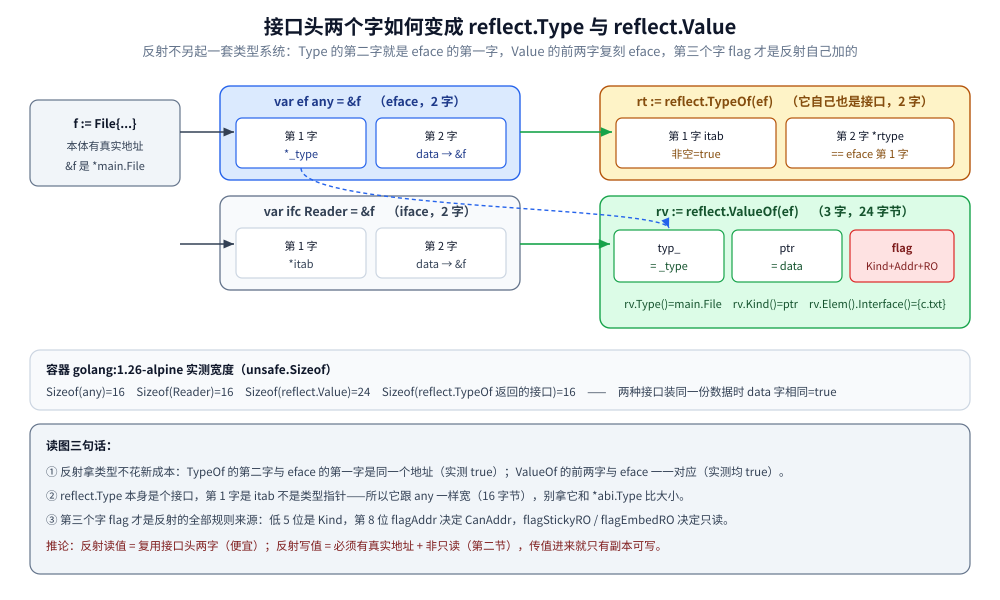
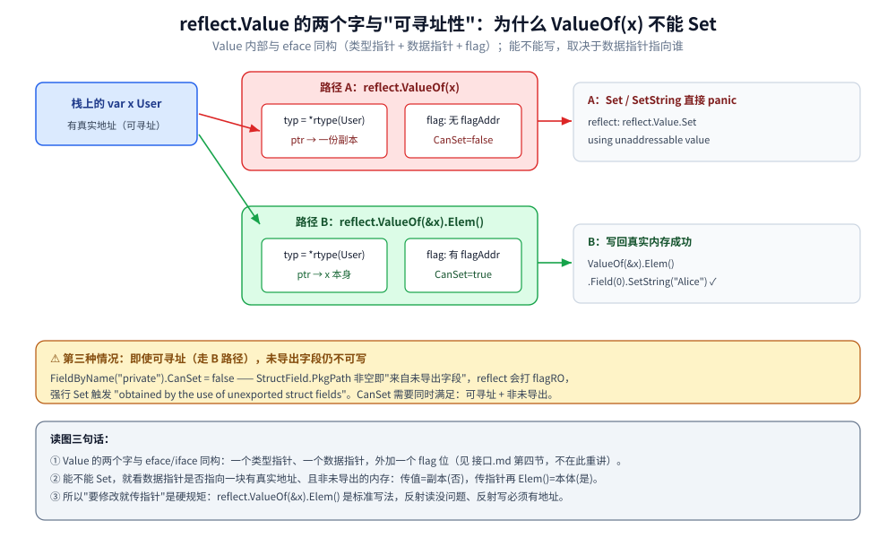
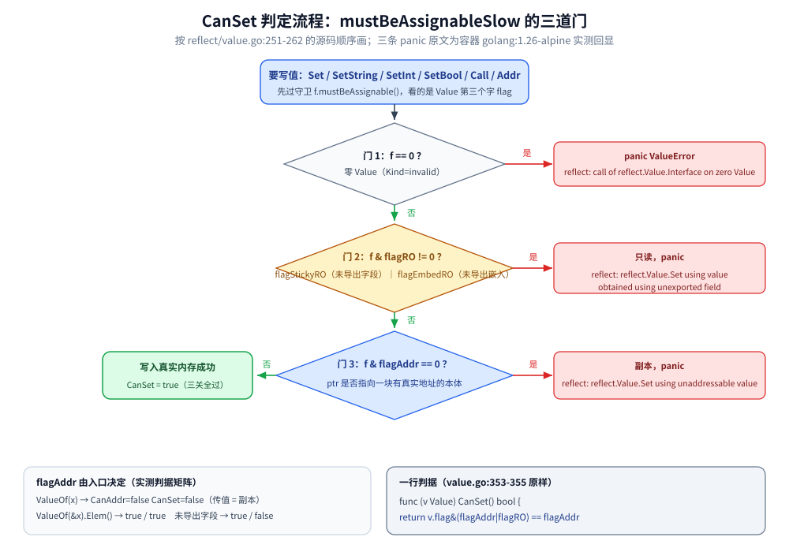
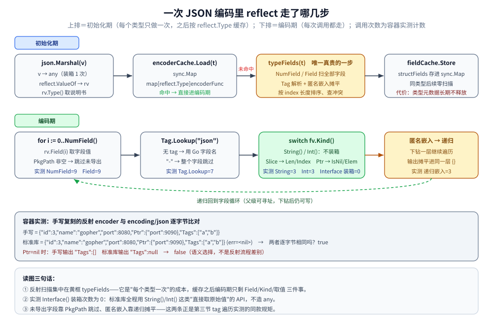

# 反射与unsafe

> 覆盖 `reflect` 的两件套（`Type` / `Value`）与 Kind/Type 分工、三条反射法则与 `CanSet` 的源码级判据、
> tag 的递归遍历形态（含匿名嵌入）、动态建实例与动态调用、`encoding/json` 背后的反射流程、
> `reflect` 与 `unsafe` 的分界线（尺寸三件套、指针掏取、`unsafe.String`/`unsafe.Slice` 内存视图），
> 以及反射的性能实测区间与「什么时候不该用反射」的判据。
>
> 内容整理自个人学习笔记，素材见 [素材清单.md](../../../素材清单.md)。
>
> ⚠️ 本篇全部读数来自容器 `golang:1.26-alpine`（`go version go1.26.8 linux/amd64`）真跑；
> panic 原文、`go vet` stderr 与 runtime 源码片段同样出自该容器。
> 已经成篇的零件不重讲：字段对齐与 padding 的字节实测见 [struct与tag.md](../类型与语法/struct与tag.md)，
> `unsafe.Sizeof` 的基础类型全表见 [基础类型与零值.md](../类型与语法/基础类型与零值.md)，
> 接口两字布局与接口调用代价见 [接口.md](../类型与语法/接口.md)，
> `uintptr` 与 GC 保活的合法模式见 [指针与引用.md](../类型与语法/指针与引用.md)。

---

## 一、反射到底是什么？它靠什么在运行时"知道"你的类型？

**本节要点**：反射不是第三套类型系统，它只是**把接口头里的两个字段翻出来给你看**。
`reflect` 提供两件东西——`Type`（类型的说明书）和 `Value`（值的三面镜子：类型、数据指针、标志位），
所有"运行时读写"都是这两件东西的组合拳。慢的根源不在"解释执行"，而在**装箱、标志位检查和无法内联**。

### 1.1 两件套：`reflect.Type` 与 `reflect.Value`

```go
type Address struct {
    City string `json:"city" validate:"required"`
    Zip  int    `json:"zip"`
    priv int    // 未导出
}

type User struct {
    Name    string         `json:"name"`
    Age     int            `json:"age"`
    Addr    Address        `json:"addr"`
    Tags    []string       `json:"tags"`
    Meta    map[string]any `json:"-"`
    Nick    string
    private int
}

var u User
rt := reflect.TypeOf(u)      // 类型侧：静态说明书
rv := reflect.ValueOf(u)     // 值侧：一个具体的值
fmt.Printf("TypeOf → %v\n", rt)
fmt.Printf("Kind   → %v\n", rt.Kind())
fmt.Printf("ValueOf.Kind → %v\n", rv.Kind())
fmt.Printf("rv.Type() == rt → %v\n", rv.Type() == rt)
for i := 0; i < rt.NumField(); i++ {
    f := rt.Field(i)         // 字段元数据（名字/类型/tag/PkgPath）
    fmt.Printf("  字段 %d: name=%-6s type=%-14s tag.json=%-6q PkgPath=%q(空=导出)\n",
        i, f.Name, f.Type, f.Tag.Get("json"), f.PkgPath)
}
```

容器实测（`User` 七个字段，包名 `reflectlab`）：

```text
TypeOf → reflectlab.User
Kind   → struct
ValueOf.Kind → struct
rv.Type() == rt → true
  字段 0: name=Name   type=string         tag.json="name" PkgPath=""(空=导出)
  字段 1: name=Age    type=int            tag.json="age"  PkgPath=""(空=导出)
  字段 2: name=Addr   type=reflectlab.Address tag.json="addr" PkgPath=""(空=导出)
  字段 3: name=Tags   type=[]string       tag.json="tags" PkgPath=""(空=导出)
  字段 4: name=Meta   type=map[string]interface {} tag.json="-"    PkgPath=""(空=导出)
  字段 5: name=Nick   type=string         tag.json=""     PkgPath=""(空=导出)
  字段 6: name=private type=int            tag.json=""     PkgPath="reflectlab"(空=导出)
```

分工要说清：**`Type` 只管类型，一个类型全局一份，可比较可当 map key；`Value` 才管值，每次 `ValueOf` 都是新造的一个结构体**。
`PkgPath` 是"导出与否"的判据——**空串是导出，非空就是未导出字段**，这一位直接决定了第二节的全部行为。

`Value` 自身长什么样（`/usr/local/go/src/reflect/value.go` 原样摘录，节选注释）：

```go
type Value struct {
	// typ_ holds the type of the value represented by a Value.
	// Access using the typ method to avoid escape of v.
	typ_ *abi.Type

	// Pointer-valued data or, if flagIndir is set, pointer to data.
	// Valid when either flagIndir is set or typ.pointers() is true.
	ptr unsafe.Pointer

	// flag holds metadata about the value.
	//
	// The lowest five bits give the Kind of the value, mirroring typ.Kind().
	//
	// The next set of bits are flag bits:
	//	- flagStickyRO: obtained via unexported not embedded field, so read-only
	//	- flagEmbedRO: obtained via unexported embedded field, so read-only
	//	- flagIndir: val holds a pointer to the data
	//	- flagAddr: v.CanAddr is true (implies flagIndir and ptr is non-nil)
	//	- flagMethod: v is a method value.
	// If !typ.IsDirectIface(), code can assume that flagIndir is set.
	//
	// The remaining 22+ bits give a method number for method values.
	// If flag.kind() != Func, code can assume that flagMethod is unset.
	flag
}
```

三个字，所以 `unsafe.Sizeof(reflect.Value{})` 是 24 字节（实测见 1.2），比接口头还宽一个字。
**注意第三个字是 `flag`，不是"数据"**——反射的读写规则全藏在这一个 `uint` 里。

核验方式（原样取源码，不靠记忆）：

```bash
MSYS_NO_PATHCONV=1 docker run --rm golang:1.26-alpine \
  sh -c 'sed -n "/^type Value struct/,/^}/p" /usr/local/go/src/reflect/value.go'
```

### 1.2 反射对象与接口头是同源的（`eface` / `iface` 视角）

[接口.md](../类型与语法/接口.md) 第四节已经用 `unsafe` 把接口头的两个字读出来过：
`eface` 是 `(*_type, data)`，`iface` 是 `(*itab, data)`，`itab._type` 就是 `eface` 的那个 `_type`。
本节把这条链**接到反射上**——反射对象并不是另起炉灶，它只是那两个字的另一种读法。

```go
type File struct{ name string }
func (f File) Read() string { return f.name }
type Reader interface{ Read() string }

func rawWords(p unsafe.Pointer) (unsafe.Pointer, unsafe.Pointer) {
    w := (*[2]unsafe.Pointer)(p)
    return w[0], w[1]
}

f := File{name: "c.txt"}
var ef any = &f
var ifc Reader = &f
tw, dw := rawWords(unsafe.Pointer(&ef))   // eface：_type, data
tt, dt := rawWords(unsafe.Pointer(&ifc))  // iface：*itab, data

rt := reflect.TypeOf(ef)
rtItab, rtWord := rawWords(unsafe.Pointer(&rt))   // Type 本身也是个接口

rv := reflect.ValueOf(ef)
rvWords := (*[3]unsafe.Pointer)(unsafe.Pointer(&rv)) // Value 的三个字
```

```text
eface 第1字(_type)非空=true 第2字(data)非空=true
iface 第1字(*itab)非空=true 第2字(data)非空=true
两种接口装同一份数据时 data 字相同=true
Sizeof(any)=16 Sizeof(Reader)=16 Sizeof(reflect.Value)=24 Sizeof(reflect.TypeOf 返回的接口)=16
reflect.TypeOf(ef) 返回的接口：第 1 字(itab)非空=true，第 2 字(*rtype) == eface 的第 1 个字？true
reflect.ValueOf(ef) 的第 1 个字 == eface 的 _type？true
reflect.ValueOf(ef) 的第 2 个字 == eface 的 data？true
rv.Type()*main.File rv.Kind()ptr rv.Elem().Interface()={c.txt}
```

三件事值得记住：

1. **`reflect.TypeOf(x)` 的第二个字 == `eface` 的第一个字**——拿类型信息不需要重新计算，就是那个 `*_type`；
2. **`reflect.ValueOf(x)` 的前两个字与 `eface` 一一对应**——第三个字（`flag`）才是反射自己加的东西；
3. `reflect.Type` 的**第一个字是 `itab` 不是类型指针**——它是 `interface{}` 装着一个 `*rtype`，
   所以 `Sizeof(reflect.TypeOf(...))=16`，跟 `any` 一样宽。拿它跟 `*abi.Type` 比大小是常见误解。



图怎么读：左边是 `var ef any = &f` 的两个字（`*_type` + `data`）；中间是 `reflect.TypeOf(ef)` 返回的接口，
它的第二字与左边的第一字**同一个地址**；右边是 `reflect.ValueOf(ef)` 的三个字，前两字复刻左边，
第三个字 `flag` 是反射独有的。底部标注实测的宽度：`any` 16 字节、`Reader` 16 字节、`reflect.Value` 24 字节。

### 1.3 `Kind` 与 `Type` 的分工：判"形状"还是判"身份"

`Kind` 是 27 个粗粒度枚举（`struct` / `slice` / `ptr`……），`Type` 是完整身份。
**写反射代码时的判据：分支用 `Kind`，报错和 map key 用 `Type`**。

```go
type MyInt int
type Seconds int

for _, v := range []any{42, MyInt(42), Seconds(7), []int{}, [3]int{}, map[string]int{}, File{}, &File{}} {
    t := reflect.TypeOf(v)
    fmt.Printf("  Type=%-22s Kind=%-7s Name=%-8q PkgPath=%-12q NumField=%d\n",
        t, t.Kind(), t.Name(), t.PkgPath(), numFieldSafe(t))
}

var nilReader Reader
var nilAny any = nilReader               // 具体类型的 nil 接口 → 仍是 nil any
fmt.Printf("  Reader(nil) 装进 any 后 TypeOf=%v，== nil Type？%v（对 nil Type 调 Kind() 会 panic）\n",
    reflect.TypeOf(nilAny), reflect.TypeOf(nilAny) == nil)
fmt.Printf("MyInt 与 Seconds 的 Kind 相同(%v=%v) 但 Type 相同吗？%v\n",
    reflect.TypeOf(MyInt(0)).Kind(), reflect.TypeOf(Seconds(0)).Kind(),
    reflect.TypeOf(MyInt(0)) == reflect.TypeOf(Seconds(0)))
fmt.Printf("reflect.TypeOf(nil) 返回什么？%v；零 Value 的 Kind()=%v\n", reflect.TypeOf(nil), reflect.Value{}.Kind())
var zeroType reflect.Type
fmt.Printf("TypeOf(nil) == nil Type？%v；对零 Type 调 String()：%s\n",
    reflect.TypeOf(nil) == zeroType, safeCall(func() string { return zeroType.String() }))
```

```text
  Type=int                    Kind=int     Name="int"    PkgPath=""           NumField=-1
  Type=main.MyInt             Kind=int     Name="MyInt"  PkgPath="main"       NumField=-1
  Type=main.Seconds           Kind=int     Name="Seconds" PkgPath="main"       NumField=-1
  Type=[]int                  Kind=slice   Name=""       PkgPath=""           NumField=-1
  Type=[3]int                 Kind=array   Name=""       PkgPath=""           NumField=-1
  Type=map[string]int         Kind=map     Name=""       PkgPath=""           NumField=-1
  Type=main.File              Kind=struct  Name="File"   PkgPath="main"       NumField=1
  Type=*main.File             Kind=ptr     Name=""       PkgPath=""           NumField=-1
  Reader(nil) 装进 any 后 TypeOf=<nil>，== nil Type？true（对 nil Type 调 Kind() 会 panic）
MyInt 与 Seconds 的 Kind 相同(int=int) 但 Type 相同吗？false
reflect.TypeOf(nil) 返回什么？<nil>；零 Value 的 Kind()=invalid
TypeOf(nil) == nil Type？true；对零 Type 调 String()：runtime error: invalid memory address or nil pointer dereference
```

读表口径：

| 现象 | 结论 |
|---|---|
| `MyInt` 与 `Seconds` 的 `Kind` 都是 `int`，`Type` 不等 | 判形状用 Kind 会**把两个业务类型混成一个**；`Name`/`PkgPath` 才区分得开 |
| `[]int` / `[3]int` / `map[string]int` 的 `Name` 与 `PkgPath` 是空串 | 只有**命名类型**有名字；组合类型靠 `String()` 或 `Elem()` 递归描述 |
| `*main.File` 的 `NumField=-1` | 指针不是 struct，`NumField` 会 panic；先 `Elem()` 再问字段 |
| `reflect.TypeOf(nil)` 返回 nil `Type`，对零 `Value` 调 `Kind()` 得 `invalid` | 反射入口**没有"null 类型"这个东西**，`Kind()==reflect.Invalid` 就是那个哨兵 |
| 对零 `Type` 调 `String()` | 是**运行时空指针**（不是 reflect 的 panic），拿到 `Type` 后先判 `t == nil` |

⚠️ 实测里那个 `Reader(nil)` 装进 `any` 后 `TypeOf` 返回 `<nil>`：
这跟 [接口.md](../类型与语法/接口.md) 第三节的"nil 接口两个字全 0"是同一件事——
装的是**nil 接口值**，两个字段都是 0，反射无从得知具体类型。

### 1.4 反射为什么慢：三条来源

1. **装箱**：`Value.Interface()` 要把 `ptr` + `typ` 组装成一个 `any`，非直插类型还要在堆上放一份数据
   （实测见第七节：反射读字段 `Int()` 零分配，换成 `Interface()` 变成 8 allocs/op）；
2. **标志位检查**：每个 `SetXxx` / `Addr` / `Call` 都要过 `mustBeAssignable` 一类守卫（第二节源码）；
3. **无法内联**：`v.Field(i).Int()` 的分支取决于运行时 `Kind`，编译器不可能像 `u.Age` 那样折叠成一条取指令，
   `reflect` 里大量函数还刻意带 `//go:noinline` 以保证 `valueMethodName()` 能取到调用方名字。

---

## 二、三条反射法则是什么？`CanSet` 到底卡在哪一位？

**本节要点**：三条法则是使用侧的心智模型，`CanSet` 是它的机器实现。
判据只有一行：**`v.flag&(flagAddr|flagRO) == flagAddr`**——可寻址 **且** 非只读，缺一不可。

### 2.1 三条法则

| 法则 | 说法 | 反向操作 |
|---|---|---|
| 一 | 反射对象 ← 接口值：`reflect.ValueOf(x)` | 反射对象 → 接口值：`v.Interface()` |
| 二 | 反射对象**能读到**就能描述：`Type()`/`Kind()`/`NumField()` 永远可用（导出与否无关） | 读不出的东西只能靠 `Type` 元数据（如未导出字段的名字与类型照样可见） |
| 三 | 想**写**就必须传进来一个指针：`ValueOf(&x).Elem()` 才 `CanSet` | 传值 = 拿到副本，`Set` 直接 panic |

法则二是新手最容易忽略的：**未导出字段"看得见但改不了"**——
`NumField()` 会把它一起数进来（实测 1.1 的字段 6），`Interface()` 拿到它却会 panic。



图怎么读：左右两条路径只有一处不同——**`ValueOf(x)` 的数据指针指向一份副本（`flag` 无 `flagAddr`），`ValueOf(&x).Elem()` 指向 `x` 本身（有 `flagAddr`）**，
所以左边 `Set` 直接 panic、右边写回真实内存成功。⚠️ 图里的第三种情况最容易漏：**即使走了右边的可寻址路径，未导出字段仍然 `CanSet == false`**
（`StructField.PkgPath` 非空即打上 `flagRO`），强行 `Set` 的报错原文见 2.5；panic 文案取自 2.4。

### 2.2 守卫的源码：`CanAddr` / `CanSet` / flag 位

以下四段是 `/usr/local/go/src/reflect/value.go` 的**原样复制**（行号也来自该文件：
flag 常量 74–84、`mustBeAssignableSlow` 251–262、`Addr` 269–277、`CanAddr` 344–346、`CanSet` 353–355）。

```go
const (
	flagKindWidth        = 5 // there are 27 kinds
	flagKindMask    flag = 1<<flagKindWidth - 1
	flagStickyRO    flag = 1 << 5
	flagEmbedRO     flag = 1 << 6
	flagIndir       flag = 1 << 7
	flagAddr        flag = 1 << 8
	flagMethod      flag = 1 << 9
	flagMethodShift      = 10
	flagRO          flag = flagStickyRO | flagEmbedRO
)
```

```go
func (v Value) CanAddr() bool {
	return v.flag&flagAddr != 0
}

func (v Value) CanSet() bool {
	return v.flag&(flagAddr|flagRO) == flagAddr
}
```

```go
func (f flag) mustBeAssignableSlow() {
	if f == 0 {
		panic(&ValueError{valueMethodName(), Invalid})
	}
	// Assignable if addressable and not read-only.
	if f&flagRO != 0 {
		panic("reflect: " + valueMethodName() + " using value obtained using unexported field")
	}
	if f&flagAddr == 0 {
		panic("reflect: " + valueMethodName() + " using unaddressable value")
	}
}
```

```go
func (v Value) Addr() Value {
	if v.flag&flagAddr == 0 {
		panic("reflect.Value.Addr of unaddressable value")
	}
	// Preserve flagRO instead of using v.flag.ro() so that
	// v.Addr().Elem() is equivalent to v (#32772)
	fl := v.flag & flagRO
	return Value{ptrTo(v.typ()), v.ptr, fl | flag(Pointer)}
}
```

核验方式：

```bash
MSYS_NO_PATHCONV=1 docker run --rm golang:1.26-alpine \
  sh -c 'grep -n -A 12 "func (f flag) mustBeAssignableSlow" /usr/local/go/src/reflect/value.go'
```

从源码能推出三条结论：

- **`CanAddr` 只看一位**，`CanSet` 看两位且要求 `flagRO` 全 0——所以"可寻址"是"可写"的必要不充分条件；
- **`Addr()` 会保留 `flagRO`**（注释里点名 #32772）——所以 `未导出字段.Addr().Elem()` 依然不可写；
- **`flagKindWidth = 5`、"there are 27 kinds"**——`Kind` 就塞在 `flag` 的低 5 位里，
  这就是 1.2 里 `rv.Kind()` 不需要查 `typ_` 也能返回的原因（`Kind()` 与 `Type().Kind()` 是同一份信息的两个副本）。

### 2.3 实测判据矩阵

```go
var u User                                  // Name string / Age int / private int / Addr Address
uv := reflect.ValueOf(u)
uptr := reflect.ValueOf(&u).Elem()
arr := [2]int{1, 2}
sl := []int{1, 2}
mp := map[string]int{"a": 1}
row("ValueOf(u)", uv)
row("ValueOf(u).Field(0) Name", uv.Field(0))
row("ValueOf(&u)", reflect.ValueOf(&u))
row("ValueOf(&u).Elem()", uptr)
row("ValueOf(&u).Elem().Field(0)", uptr.Field(0))
row("ValueOf(&u).Elem().Field(2) 未导出", uptr.Field(2))
row("ValueOf(&u).Elem().Field(3).Addr().Elem()", uptr.Field(3).Addr().Elem())
row("ValueOf(arr).Index(0)", reflect.ValueOf(arr).Index(0))
row("ValueOf(&arr).Elem().Index(0)", reflect.ValueOf(&arr).Elem().Index(0))
row("ValueOf(sl).Index(0)", reflect.ValueOf(sl).Index(0))
row("ValueOf(mp).MapIndex(k)", reflect.ValueOf(mp).MapIndex(reflect.ValueOf("a")))

// map 不能写元素，但能整体换掉某个 key 的 value：
v := reflect.ValueOf(&mp).Elem()
v.SetMapIndex(reflect.ValueOf("b"), reflect.ValueOf(2))
fmt.Printf("  ValueOf(&mp).Elem().SetMapIndex 能写 map 吗？%v\n", mp["b"] == 2)

// row 的实现：把 Kind / CanAddr / CanSet 三项并排打印
//   fmt.Printf("  %-46s Kind=%-7s CanAddr=%-5v CanSet=%v\n", name, v.Kind(), v.CanAddr(), v.CanSet())
```

容器实测：

```text
  ValueOf(u)                                     Kind=struct  CanAddr=false CanSet=false
  ValueOf(u).Field(0) Name                       Kind=string  CanAddr=false CanSet=false
  ValueOf(&u)                                    Kind=ptr     CanAddr=false CanSet=false
  ValueOf(&u).Elem()                             Kind=struct  CanAddr=true  CanSet=true
  ValueOf(&u).Elem().Field(0)                    Kind=string  CanAddr=true  CanSet=true
  ValueOf(&u).Elem().Field(2) 未导出                Kind=int     CanAddr=true  CanSet=false
  ValueOf(&u).Elem().Field(3).Addr().Elem()      Kind=struct  CanAddr=true  CanSet=true
  ValueOf(arr).Index(0)                          Kind=int     CanAddr=false CanSet=false
  ValueOf(&arr).Elem().Index(0)                  Kind=int     CanAddr=true  CanSet=true
  ValueOf(sl).Index(0)                           Kind=int     CanAddr=true  CanSet=true
  ValueOf(mp).MapIndex(k)                        Kind=int     CanAddr=false CanSet=false
  ValueOf(&mp).Elem().SetMapIndex 能写 map 吗？true
```

三个反直觉的点：

- **`ValueOf(&u)` 自己不可寻址**：指针值本身也是副本（`CanAddr=false`），必须 `Elem()` 解到本体；
- **切片元素可寻址、map 元素不可寻址**：`sl` 的 `data` 指针指向真实底层数组，而 map 元素可能在 rehash 时搬家，
  所以 reflect 直接掐掉这条路，写 map 只留 `SetMapIndex` 一个口子（判据与 map 的槽位设计见 [map.md](../类型与语法/map.md)）；
- **`.Field(3).Addr().Elem()` 可写**：导出结构体字段取地址再解回来，`flagAddr` 重新置位。



图怎么读：从 `reflect.ValueOf(...)` 出发，先判有没有 `flagAddr`（数据指针是否指向有真实地址的本体），
再判 `flagRO`（是否经过未导出字段），两个门都过才允许 `Set`/`SetString`/`SetInt`；
任一门不过就是 `mustBeAssignableSlow` 里那两条 panic 原文（图内文本与实测一致）。

### 2.4 真实失败原文

```go
fmt.Println("  --- 真实失败原文")
fmt.Printf("  Set 非地址值        → %s\n", safeCall(func() string { reflect.ValueOf(42).Set(reflect.ValueOf(7)); return "no panic" }))
fmt.Printf("  Set 未导出字段      → %s\n", safeCall(func() string { uptr.Field(2).Set(reflect.ValueOf(1)); return "no panic" }))
fmt.Printf("  Set map 元素        → %s\n", safeCall(func() string {
    reflect.ValueOf(mp).MapIndex(reflect.ValueOf("a")).Set(reflect.ValueOf(9))
    return "no panic"
}))
fmt.Printf("  Addr 非地址值       → %s\n", safeCall(func() string { reflect.ValueOf(42).Addr(); return "no panic" }))
fmt.Printf("  SetString 类型不符  → %s\n", safeCall(func() string { uptr.Field(1).SetString("x"); return "no panic" }))
fmt.Printf("  Set 类型不符        → %s\n", safeCall(func() string { uptr.Field(0).Set(reflect.ValueOf(1)); return "no panic" }))
fmt.Printf("  Interface 零 Value  → %s\n", safeCall(func() string { reflect.Value{}.Interface(); return "no panic" }))

// safeCall 把 panic 原文取出来：
//   defer func() { if r := recover(); r != nil { s = fmt.Sprintf("%v", r) } }()
```

```text
  Set 非地址值        → reflect: reflect.Value.Set using unaddressable value
  Set 未导出字段      → reflect: reflect.Value.Set using value obtained using unexported field
  Set map 元素        → reflect: reflect.Value.Set using unaddressable value
  Addr 非地址值       → reflect.Value.Addr of unaddressable value
  SetString 类型不符  → reflect: call of reflect.Value.SetString on int Value
  Set 类型不符        → reflect.Set: value of type int is not assignable to type string
  Interface 零 Value  → reflect: call of reflect.Value.Interface on zero Value
```

认 panic 前缀就能定位是哪一类问题：

| panic 前缀 | 原因类别 | 修法 |
|---|---|---|
| `reflect: ... using unaddressable value` | 传的是值、或想写 map 元素 | 改传指针 + `Elem()`；map 换 `SetMapIndex` |
| `reflect: ... using value obtained using unexported field` | 经过未导出字段 | 别反射写私有字段，改导出或加 setter |
| `reflect: call of reflect.Value.X on Y Value` | **Kind 不对**（`SetString` 打在 `int` 上） | 先 `Kind()` 再分派，或用 `Set` 配 `AssignableTo` 检查 |
| `reflect.Set: value of type A is not assignable to type B` | 值类型不匹配 | 需要显式 `Convert`，且注意 `Convertible` 不等于 `Assignable` |
| `reflect: call of ... on zero Value` | 忘了 `IsValid()` | `FieldByName` 找不到字段时返回零 `Value`，必须先 `IsValid()` |

### 2.5 未导出字段为什么被 `flagStickyRO` 挡住

`StructField.PkgPath != ""` 是"未导出"的判据（实测 1.1 字段 6）。
`Value` 从这种字段上取出来时会带上 `flagStickyRO`（"sticky"= 粘的，`Addr()`/`Elem()`/`Field()` 一路往下传都不掉），
`flagEmbedRO` 则是"经过未导出的**匿名嵌入**字段"的路径专用位。
**设计意图是守住封装**：反射能读类型元数据，但不能替你绕过语言自己的访问控制。
真要跨这个边界只剩 `Addr().UnsafePointer()` 之类的 `unsafe` 手段——它绕过 reflect 的守卫，
但**不绕过 Go 的内存模型和兼容性承诺**，属于第六节的红线区。

---

## 三、tag 在反射里是怎么被读出来的？匿名嵌入怎么遍历？

**本节要点**：`reflect` 侧的入口只有 `StructField.Tag` 一个字符串；
**语言只负责把它原样交出来，怎么拆是各家库的私事**。
本节的重心是**遍历形态**——递归、匿名嵌入、指针字段，以及 `go vet` 在中间扮演什么角色。
（`Get` 与 `Lookup` 的语义差别、各家 tag 的写法对照在 [struct与tag.md](../类型与语法/struct与tag.md) 第五、七节，不重讲。）

### 3.1 只有一个入口，而且没有"列出所有 key"的 API

```go
type Doc struct {
    Name string `json:"name" cfg:"name,required"`
}

// StructTag 只有 Get / Lookup 两个方法，没有 Keys()：想列出所有 key 只能自己扫
func tagKeys(tag string) []string {
    var out []string
    for _, p := range strings.Fields(tag) {
        if i := strings.Index(p, ":"); i > 0 {
            out = append(out, p[:i])
        }
    }
    return out
}

t := reflect.TypeOf(Doc{})
fmt.Printf("  StructTag 没有列 key 的 API —— 手写扫描 %q 得到 key：%v\n",
    string(t.Field(0).Tag), tagKeys(string(t.Field(0).Tag)))
```

实测：

```text
  StructTag 没有列 key 的 API —— 手写扫描 "json:\"name\" cfg:\"name,required\"" 得到 key：[json cfg]
```

`StructTag` 只暴露 `Get(key)` / `Lookup(key)` 两个方法，**没有 `Keys()`**：
你无法遍历一个字段上挂了哪些 tag。原因是结构性的——tag 内部可以出现空格（`json:"a b"`），
只有按引号配对扫描才能可靠切分，标准库选择不提供这个能力，逼调用方**明确知道自己要哪个 key**。
自己写解析器时至少要注意：按 `strings.Fields` 切会**误伤 value 里的空格**，
正确做法是复用 `fmt.Sprintf("%q", tag)` 之外的引号感知扫描（参考 `go vet` 里 `structtag` 分析器的实现）。

### 3.2 递归遍历：`Anonymous` 下钻、指针字段要 `Elem()`

```go
type Base struct {
    ID     int    `json:"id" cfg:"id"`
    Secret string `json:"-" cfg:"secret"`
}
type Nested struct {
    Port int `json:"port" cfg:"port,default=8080"`
}
type Conf struct {
    Base            // 匿名嵌入
    Name string `json:"name" cfg:"name,required"`
    Nested          // 匿名嵌入
    Ptr  *Nested     // 指针字段：不是 struct
    Tags []string `cfg:"tags,split=,"`
}

func walk(v reflect.Value, st *stats, prefix string) {
    t := v.Type()
    for i := 0; i < t.NumField(); i++ {
        st.fields++
        f := t.Field(i)
        if f.PkgPath != "" { // 未导出：看得见但不可写，多数遍历选择跳过
            st.unexported++
            continue
        }
        if f.Anonymous {
            st.anonymous++
        }
        name := prefix + f.Name
        vv, ok := f.Tag.Lookup("cfg")
        if ok {
            st.looked++
            st.tagged += strings.Count(vv, ",") + 1
        }
        fv := v.Field(i)
        if fv.Kind() == reflect.Struct {
            walk(fv, st, name+".")    // 下钻：匿名与否都要进
        }
    }
}
```

容器实测（入口是 `reflect.ValueOf(&Conf{}).Elem()`）：

```text
  Base               type=main.Base      anonymous=true  cfg=(无)
  Base.ID            type=int            anonymous=false cfg="id"
  Base.Secret        type=string         anonymous=false cfg="secret"
  Name               type=string         anonymous=false cfg="name,required"
  Nested             type=main.Nested    anonymous=true  cfg=(无)
  Nested.Port        type=int            anonymous=false cfg="port,default=8080"
  Ptr                type=*main.Nested   anonymous=false cfg=(无)
  Tags               type=[]string       anonymous=false cfg="tags,split=,"
  统计：扫过字段=8 匿名嵌入=2 未导出跳过=0 cfg命中=5 逗号分隔项=9
  嵌入字段提升后 FieldByName("Secret") 命中字段="Secret" tag="json:\"-\" cfg:\"secret\"" Lookup(json)=("-",true)
  外层 cfg 取值分布：Name=name,required | Tags=tags,split=,
  子结构 Nested 的 cfg 取值分布：Port=port,default=8080
  Ptr 字段忘记 Elem() 直接 NumField（Kind=ptr）→ reflect: NumField of non-struct type *main.Nested
```

遍历形态的四条规矩：

1. **外层 `NumField()` 只数"直接字段"**（这里 8 个），嵌入类型是**一个字段**而不是若干字段——
   tag 也不随嵌入继承（实测里 `Base` 那一行的 `cfg=(无)`），但 `FieldByName("Secret")` 能命中提升后的字段
   并带出它自己的 tag，两种视野不要混用（"tag 不随嵌入继承"与 `encoding/json` 的摊平差异见
   [struct与tag.md](../类型与语法/struct与tag.md) 6.2 / 6.3）；
2. **要"看起来像平坦结构"就自己递归**：上面的 `prefix` 打出 `Base.ID`，这就是很多 ORM 的字段路径写法；
3. **指针字段必须先 `Elem()`**，否则 `NumField` panic（实测最后一行原文）；`nil` 指针还要判 `IsNil()`；
4. **`walk` 用 `Value` 而不是 `Type` 起步**，是因为下钻之后还要写值（`Field(i)` 继承父级的 `flagAddr`）——
   只要入口是 `ValueOf(&x).Elem()`，整条路径上的导出字段全都 `CanSet`（第五节 uselab 实测 ⑤ 印证）。

`Conf.Tags` 那行还留了一个真坑：tag 值 `tags,split=,` 里的**分隔符本身是逗号**，
按逗号拆选项的解析器会把它读成 `["tags","split=",""]`——同一个字符既当"选项分隔符"又当"值"，
是自己设计 tag 语法时最容易踩的自引用坑。uselab 里换成 `split=;` 才正常工作（实测 ①）。

### 3.3 `go vet` 会管 tag 拼错

tag 的格式错误在编译期**不报错**（它是字符串），但 `go vet` 的 `structtag` 分析器
专门按 `reflect.StructTag.Get` 的规则复查一遍。容器实测：

```go
package main                                    // vetlab/main.go（gofmt 制表符缩进）

import (
	"fmt"
	"unsafe"
)

type Cfg struct {
	Name string `json:"name"`
	Port int    `json:port` // 第 10 行：value 少了引号
}

// uintptr 往返：指针先变成整数，运算完再变回指针
func roundTrip(p *int) int {
	u := uintptr(unsafe.Pointer(p))
	return *(*int)(unsafe.Pointer(u)) // 第 16 行：跨了语句才转回 Pointer
}

func main() {
	var x = 5
	fmt.Println(roundTrip(&x), unsafe.Sizeof(Cfg{}))
}
```

```bash
MSYS_NO_PATHCONV=1 docker run --rm -v D:/www/dev-notes:/w \
  -w /w/.workbuddy/tmp/exp/reflect-lab/vetlab golang:1.26-alpine sh -c 'GOCACHE=/tmp/c go vet ./...'
```

```text
vetlab/main.go:10:2: struct field tag `json:port` not compatible with reflect.StructTag.Get: bad syntax for struct tag value
vetlab/main.go:16:17: possible misuse of unsafe.Pointer
```

第一行就是"少引号"的后果：**这个 key 对 `Get("json")` 完全不可见**，序列化会退回 Go 字段名。
第二行是同一个文件里另一处 `uintptr` 往返写法被 `unsafeptr` 分析器抓到（第六节 6.4 讲这条）。

### 3.4 tag 是"配置 DSL"：读出来之后自己定规矩

`Get` 返回的永远是原始串，语义全靠解析方。
一个可用的最小 DSL：`key` + 逗号分隔的选项，选项里 `name=value` 形式单独解（实现见「使用」一节）：

| tag 写法 | 解析结果 | 说明 |
|---|---|---|
| `cfg:"ADDR,required"` | key=`ADDR`，选项 `required` | 缺失即报错 |
| `cfg:"PORT,default=8080"` | key=`PORT`，`default=8080` | 环境变量不存在时用默认值 |
| `cfg:"TAGS,split=;"` | key=`TAGS`，`split=";"` | 切片字段必须有分隔符 |
| `cfg:"TLS,default=false"` | key=`TLS`，`default=false` | 布尔走 `strconv.ParseBool` |

判据：**只要 tag 的 value 里可能出现分隔符本身，就不要用那个字符当选项分隔符**。

---

## 四、只用反射能做到哪一步？建实例、调方法、造类型

**本节要点**：`reflect.New` / `MakeSlice` / `MakeMapWithSize` 造对象，
`MethodByName` + `Call` 调方法，`StructOf` 造类型，`TypeOf((*I)(nil)).Elem()` 拿接口类型。
这四件事能拼出"完全不认识目标类型的通用代码"，也正是所有 ORM、序列化器、DI 容器的公共骨架。

### 4.1 动态创建：`New` / `MakeSlice` / `MakeMap`

```go
t := reflect.TypeOf(Conf{})
p := reflect.New(t)                                 // *Conf，Kind=ptr，指向新零值
fmt.Printf("  reflect.New(%v) → Type=%v Kind=%v CanSet(Elem)=%v\n", t, p.Type(), p.Kind(), p.Elem().CanSet())
p.Elem().FieldByName("Name").SetString("gopher")
p.Elem().FieldByName("ID").Set(reflect.ValueOf(7))  // ID 来自匿名嵌入的 Base
fmt.Printf("  写回后 Name=%q ID=%d（ID 来自嵌入的 Base）\n",
    p.Elem().FieldByName("Name").String(), p.Elem().FieldByName("ID").Int())

slt := reflect.MakeSlice(reflect.SliceOf(reflect.TypeOf(0)), 0, 3)
slt = reflect.Append(slt, reflect.ValueOf(1), reflect.ValueOf(2))
mkm := reflect.MakeMapWithSize(reflect.MapOf(reflect.TypeOf(""), reflect.TypeOf(0)), 2)
mkm.SetMapIndex(reflect.ValueOf("x"), reflect.ValueOf(9))
fmt.Printf("  MakeSlice+Append → %v (cap=%d)；MakeMap+SetMapIndex → %v\n", slt.Interface(), slt.Cap(), mkm.Interface())
```

```text
  reflect.New(main.Conf) → Type=*main.Conf Kind=ptr CanSet(Elem)=true
  写回后 Name="gopher" ID=7（ID 来自嵌入的 Base）
  MakeSlice+Append → [1 2] (cap=3)；MakeMap+SetMapIndex → map[x:9]
```

要点三条：**`reflect.New` 返回的是"可写字节"的唯一合法入口**（`CanSet(Elem)=true`，无需外部传指针）；
`FieldByName("ID")` 能穿过匿名嵌入命中提升字段；
`MakeSlice` 造出来的一定是**非 nil** 切片，`Append` 必须接收返回值（和 Go 语义一样，可能换底层数组）。
对照 `new(T)` 与 `&T{}` 的等价边界见 [指针与引用.md](../类型与语法/指针与引用.md) 1.3。

### 4.2 动态调用：`MethodByName` + `Call`

```go
label := p.MethodByName("Label")
fmt.Printf("MethodByName(\"Label\").IsValid=%v Call()[0]=%q\n", label.IsValid(), label.Call(nil)[0])

fv := reflect.ValueOf(func(a, b int) int { return a * b })
out := fv.Call([]reflect.Value{reflect.ValueOf(6), reflect.ValueOf(7)})
fmt.Printf("reflect.Value.Call → %v；参数个数不符的原文：%s\n",
    out[0], safeCall(func() string { fv.Call([]reflect.Value{reflect.ValueOf(6)}); return "no panic" }))
```

```text
  MethodByName("Label").IsValid=true Call()[0]="gopher"
  reflect.Value.Call → 42；参数个数不符的原文：reflect: Call with too few input arguments
```

`Call` 的参数必须是 `reflect.Value`——**这一步就是装箱的发生地**，也是第七节反射调用慢的根因。
参数顺序、个数、类型全靠你自己对齐，编译器一句都不帮你查。

### 4.3 动态造类型：`reflect.StructOf`

```go
st := reflect.StructOf([]reflect.StructField{
    {Name: "ID", Type: reflect.TypeOf(0)},
    {Name: "Label", Type: reflect.TypeOf(""), Tag: reflect.StructTag(`json:"label"`)},
})
fmt.Printf("StructOf 造出的类型 = %v，字段顺序 ID,Label 吗？第0个=%s 第1个=%s\n",
    st, st.Field(0).Name, st.Field(1).Name)
```

```text
StructOf 造出的类型 = struct { ID int; Label string "json:\"label\"" }，字段顺序 ID,Label 吗？第0个=ID 第1个=Label
```

`StructOf` 能造带 tag 的匿名 struct 类型，但**方法造不出来**（`NumMethod` 恒 0）——
Go 运行时不允许动态附加方法表，这是反射与代码生成的分水岭：
需要"动态类型 + 方法"就只能走 `go:generate` 生成代码那条路（第八节）。

### 4.4 接口类型与满足性判断

```go
mt := reflect.TypeOf((*Reader)(nil)).Elem()
fmt.Printf("TypeOf((*Reader)(nil)).Elem() → %v Kind=%v NumMethod=%d；File 满足=%v *File 满足=%v\n",
    mt, mt.Kind(), mt.NumMethod(),
    reflect.TypeOf(File{}).Implements(mt), reflect.TypeOf(&File{}).Implements(mt))
```

```text
  TypeOf((*Reader)(nil)).Elem() → main.Reader Kind=interface NumMethod=1；File 满足=true *File 满足=true
```

`(*Reader)(nil)` 这个写法是**唯一优雅的"拿到接口 Type"的办法**：
接口值本身是 `interface`，装箱后 `TypeOf` 会剥掉外层直接给出动态类型，所以要先造个 `*Reader` 再 `Elem()`。
方法集规则（值接收者进 `File` 的方法集、指针接收者只进 `*File`）在
[类型系统.md](../类型与语法/类型系统.md) 第五节，反射只是把这张表在运行时查了一遍。

另附 `DeepEqual` 的实测坑（判等常用它，但它**不是**"内容相等"）：

```text
两个等值结构体        DeepEqual=true
两个指针指向等值对象  DeepEqual=true
两个函数值            DeepEqual=false（函数永远 false）
切片 nil vs 空        DeepEqual=false
```

`func` 字段一律 false、`nil slice` 与 `[]T{}` 不等——拿 `DeepEqual` 做配置 diff 或测试断言时这两条必然踩到。

---

## 五、`encoding/json` 的序列化背后到底调了反射哪几个 API？

**本节要点**：一个能跟标准库**逐字节一致**的手写迷你反射 encoder，
加上一份反射 API 调用计数，把"序列化一次 = 遍历字段 + 读 tag + 按 Kind 取值 + 递归"这句话落实。

### 5.1 复刻一个最小 encoder

```go
func encode(rv reflect.Value, c *Counter, buf *[]byte) {
    t := rv.Type()
    *buf = append(*buf, '{')
    for i := 0; i < t.NumField(); i++ {
        c.numField++
        f := t.Field(i)
        c.fieldCall++
        if f.PkgPath != "" { // 未导出字段跳过
            continue
        }
        fv := rv.Field(i)
        if f.Anonymous && f.Type.Kind() == reflect.Struct { // 摊平嵌入
            c.recurse++
            if len(*buf) > 1 && (*buf)[len(*buf)-1] != '{' {
                *buf = append(*buf, ',')
            }
            mark := len(*buf)
            encode(fv, c, buf)
            inner := string((*buf)[mark:])
            *buf = (*buf)[:mark]
            *buf = append(*buf, strings.TrimSuffix(strings.TrimPrefix(inner, "{"), "}")...)
            continue
        }
        name, ok := f.Tag.Lookup("json")
        c.tagGet++
        if !ok {
            name = f.Name
        }
        if name == "-" {
            continue
        }
        if len(*buf) > 1 && (*buf)[len(*buf)-1] != '{' {
            *buf = append(*buf, ',')
        }
        *buf = append(*buf, `"`+name+`":`...)
        switch fv.Kind() {                    // 按 Kind 分派取值
        case reflect.String:
            *buf = append(*buf, `"`+fv.String()+`"`...)
            c.strCall++
        case reflect.Int:
            *buf = append(*buf, fmt.Sprint(fv.Int())...)
            c.intCall++
        case reflect.Slice:
            *buf = append(*buf, '[')
            for j := 0; j < fv.Len(); j++ {
                if j > 0 {
                    *buf = append(*buf, ',')
                }
                *buf = append(*buf, `"`+fv.Index(j).String()+`"`...)
                c.strCall++
            }
            *buf = append(*buf, ']')
        case reflect.Struct, reflect.Ptr:
            if fv.Kind() == reflect.Ptr {
                if fv.IsNil() {
                    *buf = append(*buf, "null"...)
                    break
                }
                fv = fv.Elem()
            }
            c.recurse++
            encode(fv, c, buf)
        default:
            *buf = append(*buf, fmt.Sprintf("%v", fv.Interface())...)
            c.ifaceBox++
        }
    }
    *buf = append(*buf, '}')
}
```

刻意没实现的东西：`omitempty`、字符串转义、`json.Number`、`Marshaler` 接口优先、map 排序——
这些是"库"和"流程演示"的差距，但**主循环的形状跟标准库一致**。

### 5.2 与标准库逐字节对照

```go
c := Conf{Name: "gopher", Tags: []string{"a", "b"}, Nested: Nested{Port: 8080}, Ptr: &Nested{Port: 9090}}
c.ID = 3
c.Secret = "s"                                  // tag 是 json:"-"，应被跳过
var out []byte
encode(reflect.ValueOf(&c).Elem(), cc, &out)
std, err := json.Marshal(c)
```

```text
  手写反射 encoder = {"id":3,"name":"gopher","port":8080,"Ptr":{"port":9090},"Tags":["a","b"]}
  encoding/json    = {"id":3,"name":"gopher","port":8080,"Ptr":{"port":9090},"Tags":["a","b"]} (err=<nil>)
  两者逐字节相同吗？true
  Ptr=nil：手写 = {"id":1,"name":"n","port":0,"Ptr":null,"Tags":[]} / 标准库 = {"id":1,"name":"n","port":0,"Ptr":null,"Tags":null} / 逐字节相同吗？false
  反射 API 调用计数：NumField=9 Field=9 Tag.Lookup=7 String=3 Int=3 Interface(装箱)=0 递归嵌入=3
```

`Secret` 因为 `json:"-"` 被跳过、`Base.ID` 与 `Nested.Port` 因为匿名嵌入被摊平、
`Ptr` 字段因为没 tag 而用 Go 名——三种规则在同一个输出里同时成立。
**唯一故意不一致的是 nil 切片**：手写版输出 `[]`，标准库输出 `null`。
这不是反射流程的差别，是"零值怎么表达"的语义选择（`omitempty` 的判据见
[struct与tag.md](../类型与语法/struct与tag.md) 7.3）。

### 5.3 一次序列化的反射调用账

计数结果（`Conf` 4 个直接字段 + 2 个嵌入字段 = 6 个可见字段）：
`NumField=9`、`Field=9`、`Tag.Lookup=7`、`String=3`、`Int=3`、`递归嵌入=3`、**装箱 `Interface()=0`**。



图怎么读：入口 `Marshal(v)` → `valueEncoder(v)` 按 `Type` 查缓存 → 未命中就 `typeFields(t)` 反射扫一遍字段
（决定顺序、tag、冲突）并生成 `structEncoder` → 编码阶段对每个字段 `rv.Field(i)` + 按 `Kind` 取值 →
匿名嵌入递归摊平、指针判 `IsNil`。左侧标注本次实测的调用计数，装箱次数为 0 是因为 `String()`/`Int()` 直接取原始值。

### 5.4 标准库靠"缓存一次"把反射摊薄

`reflect` 的字段扫描只做一次，之后按 `Type` 复用（`/usr/local/go/src/encoding/json/encode.go` 原样摘录）：

```go
var encoderCache sync.Map // map[reflect.Type]encoderFunc

var fieldCache sync.Map // map[reflect.Type]structFields

// cachedTypeFields is like typeFields but uses a cache to avoid repeated work.
func cachedTypeFields(t reflect.Type) structFields {
	if f, ok := fieldCache.Load(t); ok {
		return f.(structFields)
	}
	f, _ := fieldCache.LoadOrStore(t, typeFields(t))
	return f.(structFields)
}

func newStructEncoder(t reflect.Type) encoderFunc {
	se := structEncoder{fields: cachedTypeFields(t)}
	return se.encode
}
```

核验方式：

```bash
MSYS_NO_PATHCONV=1 docker run --rm golang:1.26-alpine \
  sh -c 'sed -n "1329,1338p;379,380p;756,759p" /usr/local/go/src/encoding/json/encode.go'
```

这条设计值得抄：**"一次性反射 + 长期缓存闭包"是反射库的标准解**。
自己写 tag 驱动的代码时，把 `typeFields` 等价物做成 `map[reflect.Type]字段表`
（并发场景用 `sync.Map` 或 `sync.OnceValue`），请求路径上就只剩 `Field(i)` + `Kind()`。
缓存的代价是**类型的元数据长期不释放**——动态造类型（`StructOf`）循环注册会让这两个 `sync.Map` 一直长大，
这与 [接口.md](../类型与语法/接口.md) 4.3 里 itab 表长大的问题是同一类内存增长来源。

---

## 六、`reflect` 与 `unsafe` 的分界线在哪？

**本节要点**：一个词概括边界——**reflect 管"我不知道类型"，unsafe 管"我知道但要绕过类型系统"**。
两者常一起出现（`Value.UnsafePointer`），但风险等级完全不同：反射的错误是 panic，`unsafe` 的错误是静默错乱。

### 6.1 尺寸三件套：只留"和反射的分工"这一栏

`unsafe.Sizeof` / `Alignof` / `Offsetof` 的**基础类型全表**在
[基础类型与零值.md](../类型与语法/基础类型与零值.md)，**字段对齐与 padding 的字节实测**在
[struct与tag.md](../类型与语法/struct与tag.md) 第一、二节，本篇不重排一遍。只讲三者的分工：

| 想知道什么 | 用谁 | 实测样例（本篇容器读数） |
|---|---|---|
| 这个类型占几字节 | `unsafe.Sizeof` 或 `reflect.Type.Size()` | `Sizeof(User)=112`，`t.Size()` 给出同一个数 |
| 这个类型/字段的对齐值 | `unsafe.Alignof` | `Alignof(User)=8` |
| 字段在第几个字节 | `unsafe.Offsetof` 或 `reflect.StructField.Offset` | `Offsetof(User.Age)=16`、`Offsetof(User.Addr)=24` |
| 运行时才知道的类型的大小 | 只有 `reflect`（`t.Size()`） | `reflect.TypeOf(x).Size()` |

`reflect.StructField.Offset` 与 `unsafe.Offsetof` 是**同一份数据的两个出口**——
前者编译期写死在字段名里，后者能用在动态拿到的 `Type` 上。
其余尺寸读数（`Sizeof(string)=16 Sizeof([]int)=24 Sizeof(*int)=8 Sizeof([2]int)=16 Sizeof(Reader)=16`）
是常量事实，跨平台不保证（32 位下宽度减半），所以别的篇目已按平台标注，这里不重复造表。

### 6.2 从 `Value` 里把指针掏出来：`Addr().UnsafePointer()`

```go
u := User{Name: "x", Age: 3}
rv := reflect.ValueOf(&u).Elem()

fmt.Printf("  对 int 字段直接 UnsafePointer → %s\n", safeCall(func() string {
    _ = (*int)(rv.Field(1).UnsafePointer())          // 不合法：Age 不是指针语义
    return "no panic"
}))

*(*int)(rv.Field(1).Addr().UnsafePointer()) = 100     // 合法：先 Addr 再掏指针
fmt.Printf("  reflect.Value.UnsafePointer 拿字段地址再解引用 → u.Age=%d\n", u.Age)
```

```text
  对 int 字段直接 UnsafePointer → reflect: call of reflect.Value.UnsafePointer on int Value
  reflect.Value.UnsafePointer 拿字段地址再解引用 → u.Age=100
```

规矩一句话：**`UnsafePointer()` 只对"值本身就是指针语义"的 Kind 开放**（`Ptr` / `Slice` / `String` / `Map` / `Chan` / `Func` / `UnsafePointer`），
想拿地址必须走 `Addr()`——而 `Addr()` 要求 `CanAddr`（第二节）。
这条链是反射与 `unsafe` 的**唯一正式接口**，`Value.Pointer()` / `UnsafeAddr()` 是它的 `uintptr` 变体，
返回值必须**立刻在同一表达式里**转回 `unsafe.Pointer`，规则见 [指针与引用.md](../类型与语法/指针与引用.md) 6.2 的模式 (5)。

### 6.3 内存视图三件套：`unsafe.String` / `StringData` / `Slice` / `SliceData`

这块内容原先写在 [零拷贝.md](零拷贝.md) 第四节 ⑤「`unsafe` 类型双关」，此处完整搬入并按 Go 1.20+ 口径整理。

老写法是**改写类型标签**（把 slice header 当 string header 用），新写法是自研 API：

```go
// 旧：靠布局等价直接改标签（Go 1.17 前唯一的办法）
func stringToBytes(s string) []byte {
    return *(*[]byte)(unsafe.Pointer(&s))   // 改写类型标签，不复制数据
}

// 新：正规 API（Go 1.20 起 unsafe.String / unsafe.Slice 稳定可用）
func stringToBytes2(s string) []byte { return unsafe.Slice(unsafe.StringData(s), len(s)) }
func bytesToString(b []byte) string  { return unsafe.String(unsafe.SliceData(b), len(b)) }
```

容器实测把"零拷贝"这件事变成可验证的断言：

```go
b := []byte("dev-notes")
s := unsafe.String(unsafe.SliceData(b), len(b))
fmt.Println(unsafe.StringData(s) == unsafe.SliceData(b))   // 数据指针相同？
cp := string(b)
fmt.Println(unsafe.StringData(cp) == unsafe.SliceData(b))  // 普通转换之后还相同吗？

nb := unsafe.Slice(unsafe.StringData("gopher"), 6)
var a [4]int
sp := unsafe.Slice(&a[0], 4)
sp[0] = 999
```

```text
  unsafe.String 转出的 s="dev-notes"，数据指针相同（零拷贝）=true
  普通 string(b) 之后的数据指针相同吗（=发生了复制）=false
  unsafe.Slice 从字符串取切片 len=6 cap=6 内容="gopher"
  unsafe.Slice 从数组首元素造切片，改 sp[0] → a[0]=999（共享同一数组）
```

**指针相同就是视图，指针不同就是复制**——这一条比任何文档措辞都可靠，
`stringToBytes2` 与 `bytesToString` 都是视图，`[]byte(s)` / `string(b)` 都是复制。

### 6.4 红线与代价

沿用 [零拷贝.md](零拷贝.md) 的结论并补实测依据：

| 红线 | 后果 | 实测/依据 |
|---|---|---|
| 视图只读，**不得 append、不得改字节** | `unsafe.String` 出来的 string 被切片写穿 → 改到原本不可变的字符串数据 | 6.3 的 `sp[0]=999` 反证：数组视图**确实**能写穿原对象 |
| 只允许布局等价 | `*(*[]byte)(unsafe.Pointer(&s))` 对 `string` 成立，对 `interface` 不成立 | 布局见 [基础类型与零值.md](../类型与语法/基础类型与零值.md) |
| 生命周期必须被原对象持有 | `b` 被 GC 回收后 `s` 仍在用 → 悬垂读，**且 GC 不会报错** | `uintptr` 不保活的实测见 [指针与引用.md](../类型与语法/指针与引用.md) 6.3 |
| `unsafe` 不在兼容性承诺内 | 未来 runtime 改 string/slice 布局就可能崩 | `go doc unsafe` 明示 |
| 必须过 `go vet` + `checkptr` | 静默错误变成立即失败 | 6.5 |

### 6.5 `go vet` 为什么管 `unsafe`

同一份实验文件里那处 `uintptr` 往返：

```go
p := uintptr(unsafe.Pointer(&v))
q := unsafe.Pointer(p)                 // 拆成两句：中间 uintptr 落在了变量里
```

`go vet` 的 `unsafeptr` 分析器报：

```text
vetlab/main.go:16:17: possible misuse of unsafe.Pointer
```

原因就在官方注释（`/usr/local/go/src/unsafe/unsafe.go` 规则 (3) 原样摘录）：

```go
// Note that both conversions must appear in the same expression, with only
// the intervening arithmetic between them:
//
//	// INVALID: uintptr cannot be stored in variable
//	// before conversion back to Pointer.
//	u := uintptr(p)
//	p = unsafe.Pointer(u + offset)
```

合法模式（同一表达式内完成，官方注释给的例子逐字抄）：

```go
//	// equivalent to f := unsafe.Pointer(&s.f)
//	f := unsafe.Pointer(uintptr(unsafe.Pointer(&s)) + unsafe.Offsetof(s.f))
//
//	// equivalent to e := unsafe.Pointer(&x[i])
//	e := unsafe.Pointer(uintptr(unsafe.Pointer(&x[0])) + i*unsafe.Sizeof(x[0]))
```

本篇 6.3 用的 `unsafe.Add` 就是这个模式的函数化封装（`指针与引用.md` 3.3 有实测）。
另一个方向的对照实测：

```go
p := unsafe.Add(unsafe.Pointer(&u), unsafe.Offsetof(u.Age))
*(*int)(p) = 99          // 不经反射、不装箱
```

```text
  unsafe.Add+Offsetof 直接改字段 → u.Age=99（不经反射、不装箱）
```

**`go vet` 过了不等于合法**（官方原话：silence from `go vet` is not a guarantee），
所以 `unsafe` 代码要额外开 `go build -gcflags=all=-d=checkptr` 或 `-race` 跑一遍，
开关的用法在 [编译与gcflags.md](../工程实践/编译与gcflags.md)。

---

## 七、反射慢多少？实测区间与两个微基准陷阱

**本节要点**：同一次 `-count=5` 运行里量到的三档比值——
**反射方法调用 ≈ 直接调用的 400 倍量级，反射读字段（`Int()`）≈ 15 倍，装箱成 `any` ≈ 80 倍**。
但**先学会别被骗**：不加 `//go:noinline` 会让接口调用被"去虚化"，不逃逸的装箱会显示 `0 allocs`。

### 7.1 测试架与硬件口径

```go
type Adder interface{ Add(a, b int) int }
type Calc struct{ base int }

func (c Calc) Add(a, b int) int { return c.base + a + b }

// 穿过 noinline 边界，避免编译器把方法体内联进循环、把动态调用「去虚化」
//
//go:noinline
func directCall(c Calc, a, b int) int { return c.Add(a, b) }

//go:noinline
func ifaceCall(x Adder, a, b int) int { return x.Add(a, b) }

// 对照组：不加 noinline，看编译器优化到什么程度
func directInline(c Calc, a, b int) int { return c.Add(a, b) }
func ifaceInline(x Adder, a, b int) int { return x.Add(a, b) }

var (
    calc     = Calc{base: 1}
    calcAny  Adder = calc
    mAdd     = reflect.ValueOf(calc).MethodByName("Add")
    boxArgs  = []reflect.Value{reflect.ValueOf(3), reflect.ValueOf(4)}
)

func BenchmarkReflectCallFresh(b *testing.B) {
    for i := 0; i < b.N; i++ {
        m := reflect.ValueOf(calc).MethodByName("Add")
        sinkSum = int(m.Call([]reflect.Value{reflect.ValueOf(3), reflect.ValueOf(4)})[0].Int())
    }
}

func BenchmarkReflectCallCached(b *testing.B) {
    for i := 0; i < b.N; i++ {
        sinkSum = int(mAdd.Call(boxArgs)[0].Int())
    }
}
```

```bash
MSYS_NO_PATHCONV=1 docker run --rm -v D:/www/dev-notes:/w -w /w/.workbuddy/tmp/exp/reflect-lab \
  golang:1.26-alpine sh -c 'GOCACHE=/tmp/c go test -run "^$" -bench "." -benchmem -count=5 .'
```

运行环境：`goos: linux`、`goarch: amd64`、`cpu: Intel(R) Core(TM) i7-6700HQ CPU @ 2.60GHz`、`-benchtime=200000x`。
**下表全部来自同一次 `-count=5` 运行的 5 个读数**，写成"最小 ~ 最大"，不跨运行取数。

方法调用三档：

| 基准 | 5 次读数区间 (ns/op) | 分配 |
|---|---|---|
| `DirectNoInline`（直接调用）| 1.893 ~ 2.774 | 0 B / 0 allocs |
| `IfaceNoInline`（接口调用）| 4.062 ~ 7.154 | 0 B / 0 allocs |
| `ReflectCallFresh`（每次 `MethodByName` + 现场装箱）| 1000 ~ 1182 | 192 B / 6 allocs |
| `ReflectCallCached`（缓存方法值 + 复用参数）| 452.7 ~ 750.8 | 40 B / 3 allocs |

趋势（只断言倍数，不断言绝对值）：
反射调用是**直接调用的约 350 ~ 530 倍**、接口调用的**约 100 ~ 200 倍**；
缓存方法值和参数能砍掉一半以上，但仍差两个数量级——**剩下的 450 ns 是 `Call` 自身的解释与守卫，缓存不掉**。

字段读写四档（每轮遍历 8 个 `Row{A,B,C int}`、读 3 个字段）：

| 基准 | 区间 (ns/op) | 分配 |
|---|---|---|
| `FieldDirect`（`r.A+r.B+r.C`）| 12.97 ~ 20.36 | 0 / 0 |
| `FieldReflectInt`（`ValueOf(r)` + `Field(i).Int()`）| 210.4 ~ 294.5 | 0 / 0 |
| `FieldReflectInterface`（`Field(i).Interface().(int)`）| 1064 ~ 1684 | 192 B / 8 allocs |
| `FieldReflectPlusUnsafe`（`ValueOf(&r).Elem()` + `Addr().UnsafePointer()`）| 995.1 ~ 1582 | 0 / 0 |
| `FieldPureUnsafe`（`unsafe.Add` 按偏移读）| 37.38 ~ 46.67 | 0 / 0 |

写一个字段：

| 基准 | 区间 (ns/op) |
|---|---|
| `SetReflect`（`ValueOf(&r).Elem().Field(0).Set(...)`，循环外预备）| 22.42 ~ 31.41 |
| `SetUnsafe`（`*(*int)(p) = 7`）| 0.4041 ~ 1.031 |

三条读数结论：

1. **`Int()` 零分配、`Interface()` 每字段一次装箱**（8 次读 = 8 allocs），后者比前者慢 5 ~ 7 倍；
2. **"用 unsafe 绕开装箱"要看绕在哪一层**：从**非地址值**出发先 `Addr()` 的路线（第 4 行）跟装箱一样贵，
   而完全不经反射的 `unsafe.Add`（第 5 行）只要 40 ns 量级；
3. **写比读贵得少**：`SetReflect` 只有 `SetUnsafe` 的 ~60 倍，而方法调用的反射开销是 ~400 倍——
   **反射的贵贱按操作分层差别极大，别把"反射慢"当成一个常数**。

### 7.2 陷阱一：去虚化——不加 `//go:noinline` 会量到"不存在"的开销

同一次运行里加了对照：

| 基准 | 区间 (ns/op) | 说明 |
|---|---|---|
| `DirectInlineOnly`（不加 noinline）| 0.7446 ~ 0.8716 | 整个调用被折叠，只剩循环与写全局 |
| `IfaceInlineOnly`（不加 noinline）| 2.357 ~ 2.790 | 比 `IfaceNoInline` 的 4.062 ~ 7.154 低一截 |
| `IfaceNoInline` | 4.062 ~ 7.154 | 真正的动态派发成本 |

不加 `noinline` 时编译器会把方法体**内联进调用方**，并且知道 `x` 实际是 `Calc` 就把接口调用**特化成直接调用**（去虚化）。
后果有两个方向：**拿被优化过的"直接调用"当分母，反射的倍数会被夸大；**
而"接口只比直接慢 1.7 倍"这种读数，可能是优化后假象（本例 `2.357` vs `0.7446`）也可能是真成本（`4.062` vs `1.893`）。
接口 vs 直接调用的绝对成本已在 [接口.md](../类型与语法/接口.md) 第五节量过（同门实验，另一次运行），本篇不重复；
**要复现"稳"的比值，用 `-gcflags=all=-l` 关掉内联，或像本篇一样显式 `//go:noinline`**（开关见
[编译与gcflags.md](../工程实践/编译与gcflags.md)）。

### 7.3 陷阱二：装箱被优化掉——`0 allocs/op` 不等于装箱免费

```go
//go:noinline
func consumeAny(v any) { _ = v }

var boxVar int

func BenchmarkBoxConstant(b *testing.B) { for i := 0; i < b.N; i++ { consumeAny(42) } }
func BenchmarkBoxVariable(b *testing.B) {
    for i := 0; i < b.N; i++ { boxVar = i; consumeAny(boxVar) }
}
```

| 基准 | 区间 (ns/op) | 分配 |
|---|---|---|
| `BoxConstant`（装箱常量 42）| 1.930 ~ 2.561 | 0 B / 0 allocs |
| `BoxVariable`（装箱包级变量）| 2.012 ~ 2.830 | 0 B / 0 allocs |

两档都**没有分配**，且耗时几乎相同。原因不是"装箱免费"，而是这个基准里**装箱根本没在堆上发生**：
`consumeAny` 的函数体是 `_ = v`，值不逃逸，接口头直接在栈/寄存器上拼好；
小整数常量还本可以从 `runtime.staticuint64s` 静态区取地址，连"造一个新对象"都不需要。
所以**用"装箱很便宜"的读数去推断反射 `Interface()` 的成本会错**——
本篇 7.1 的 `FieldReflectInterface` 是真装箱（`sinkSum` 累加之外还把 8 个 `any` 传进了断言），读数就老实给了 8 allocs。
**判据：微基准的 `0 allocs/op` 只说明"编译器证明了你不需要堆"，不说明"这条语义路线便宜"。**

### 7.4 波动怎么标

本次运行里波动最大的是 `FieldReflectInterface`（1064 ~ 1684，极差约 58%）和 `IfaceNoInline`（4.062 ~ 7.154，极差约 76%）；
最稳的是 `BoxVariable`（2.012 ~ 2.830）。这是笔记本 CPU（4 线程、无隔离核组）的正常现象：
后台任务、降频、协程被抢占都会把尾部读数抬高。
**做法：取"区间 + 数量级"两个口径，只断言倍数关系，不报单点。**
另外——同一段代码在**另一次独立运行**里 `FieldDirect` 读到 8.069 ~ 9.331 ns（本次 12.97 ~ 20.36），
差了近一倍，这就是"绝对值跨运行不可比"的直接证据；那一次的其余读数不与本表混用。

### 7.5 一张图看全部档位


图怎么读：横轴是**对数刻度**的 `ns/op`（1 / 10 / 100 / 1000 四条网格线）；
每一行的色带是该基准在**同一次 `-count=5` 运行**中 5 个读数的大小端，色带右侧照抄区间数值与 `allocs/op`。
上半是方法调用四档（含两个 `noinline` 对照组），下半是字段读写七档；
`SetUnsafe` 落在 1 ns 网格线以左，因为它只有 0.4 ~ 1.0 ns。图内数字全部来自实测，无示意值。

---

## 八、什么时候不该用反射？

**本节要点**：反射的**适用判据只有一条——类型在编译期不可知**。
超出这条的场景（配置绑定可以约定接口、依赖装配可以生成代码、热点路径可以靠泛型），
都有代价更低的替代路线。

### 8.1 判据表

| 场景 | 用反射？ | 理由与替代 |
|---|---|---|
| 序列化 / 反序列化任意结构体 | ✅ 该用 | 类型集合本质上未知（第五节就是这条路） |
| ORM 行映射、`Scanner` 接口填充 | ✅ 该用 | 目标类型由表结构决定，编译期不知道 |
| tag 驱动的字段绑定（配置、校验） | ✅ 该用 | `Lookup` + 递归遍历，成本一次性（第三节） |
| 打印 / dump 未知值（`fmt` 的 `%+v`） | ✅ 该用 | 别无出路 |
| 依赖装配 | ❌ 不该 | `wire` 生成代码，编译期报错（8.3） |
| 热点路径读字段（循环里 `Field(i).Int()`） | ❌ 不该 | 泛型或类型断言；实测 15 ~ 80 倍差距（7.1） |
| 对象池 / 缓存元素 | ❌ 不该 | `sync.Pool` 的 `any` 载荷自带装箱成本，泛型 `pool[T]` 免掉它（8.2） |
| 判断两个值"内容相等" | ⚠️ 慎用 | `DeepEqual` 对 func 恒 false、nil slice ≠ 空 slice（4.4） |
| 绕过封装写未导出字段 | ❌ 绝对不该 | `CanSet` 挡的就是这个（2.5） |
| 只是"少写几行"的 setter 拼装 | ❌ 不该 | 泛型 + 函数选项更贵一点但可读、可编译期检查 |

### 8.2 四条替代路线

| 路线 | 什么时候换过去 | 换来什么 | 失去什么 |
|---|---|---|---|
| **泛型（1.18+）** | 类型参数已知、只是要复用代码 | 零装箱、可内联、编译期检查 | 拿不到 tag（`T` 上的字段不可枚举）、不能按类型分派装配 |
| **代码生成（`go:generate` + `wire`）** | 装配关系复杂但**编译期确定** | 生成代码里全是显式调用，报错在编译期 | 多一道生成步骤、`wire_gen.go` 要纳入版本管理 |
| **`sync.Pool` → 泛型池** | 池里对象类型固定 | 免掉 `Put(x any)` 的装箱（`[]byte` 载荷实测 24 B 一次分配） | 每种类型要各写一个池 |
| **`internal/reflectlite`** | 你在写 runtime / 极底层库 | 体积与依赖砍到只留 `runtime`+`unsafe`+`internal/abi` | **内部包，禁止外部 import** |

`sync.Pool` 那条的成本出处见 [sync.Pool.md](../并发编程/sync.Pool.md) 第三节（`Put/Get` 签名是 `any`，
24 字节的 slice header 会为此分配），泛型写法见 [类型系统.md](../类型与语法/类型系统.md) 9.2。

`reflectlite` 的存在本身就是"reflect 太重"的证据（`/usr/local/go/src/internal/reflectlite/type.go` 包注释原样摘录）：

```go
// Package reflectlite implements lightweight version of reflect, not using
// any package except for "runtime", "unsafe", and "internal/abi"
package reflectlite
```

核验方式：`docker run --rm golang:1.26-alpine sed -n "1,12p" /usr/local/go/src/internal/reflectlite/type.go`。
标准库里 `encoding/json`、`fmt`、`go-cmp` 走的都是"公开 reflect + 自建缓存"，
只有 runtime 侧（panic 打印、类型名）才用 `reflectlite`——**业务代码没有资格用它**，
能借鉴的是它的**取舍思路**：只实现你需要的那几个方法。

### 8.3 依赖注入里反射的代价（三笔账）

`uber/dig` 一类容器把「分析构造函数签名」交给了反射 —— `reflect` 侧其实只有两个 API：
`reflect.TypeOf(fn).In(i)` 取每个参数的类型，`reflect.Value.Call(...)` 按类型把实例填进去。

⭐ **边界**：原理三步、三个绕不过去的问题、以及 `inject` → `dig`/`fx` → `wire` → 手动注入这条演化链，
[依赖注入.md](../工程实践/依赖注入.md) 第四、六节已经整篇讲透（含各方案完整写法与选型对比），**本篇不重讲**；
本篇只算这条链上**反射付的三笔账**：

| 这笔账 | 一句话解释 | 本篇的落点 |
|---|---|---|
| **报错太晚** | 某个类型忘了注册 → 运行期错误（`missing type: ...`），编译期完全查不出来 | 2.4 的反射运行期失败原文 —— 反射的错误**一律在运行期**炸 |
| **依赖不可见** | 看 `Invoke(func(l Logger, s Store))` 只能知道这两个参数，看不出 `Logger` 又是谁造的 | 8.4 的规矩①②：反射只在初始化期发生、入口必须校验 `Kind` |
| **调用开销** | 反射调用比直接调用慢两个数量级 —— 启动期可以忍，请求路径上不能忍 | 7.1 的三档区间表 + 7.2 / 7.3 两个微基准陷阱 |

第三笔账的量化：每次反射调用 ≈ **450 ~ 1200 ns**（缓存方法值与复用参数 452.7 ~ 750.8 ns/op，
现场 `MethodByName` + 装箱 1000 ~ 1182 ns/op，同一次 `-count=5` 的读数，见 7.1）。
一次请求路径上如果有 10 次反射派发，就是 5 µs 量级 —— **比多数业务分支都贵**。
这也是 Go 生态「能编译期确定的就不要留到运行期」这条取向的量化根据，即 `wire` 存在的理由。

### 8.4 三条落地规矩

1. **反射只在初始化期发生**：`typeFields` 式缓存（5.4）；请求路径只留 `Field(i)` + `Kind()`。
2. **入口必须校验 `Kind`**：`v.Kind() != reflect.Ptr || v.Elem().Kind() != reflect.Struct`
   这种检查提前做，报错就变成可读的 `error` 而不是 panic（见「使用」一节实测 ③）。
3. **给反射代码配 panic 兜底**：`FieldByName` 返回零 `Value`、`Call` 参数个数错误、`Set` 类型不符
   都在运行时炸（2.4 的七条原文）；对外暴露的反射 API 要 `recover` 成 `error`。

---

## 使用：用反射做一个环境变量注入器

对外 API 是一个 `any` 收口的 `LoadFromEnv(target any) error`，
只依赖 `reflect` 的公开方法：`TypeOf`/`NumField`/`Field`/`Tag.Lookup`/`CanSet`/`Set`/`SetString`/`SetInt`/`SetBool`/
`MakeSlice`/`Append`。匿名嵌入下钻、未导出跳过、`required`/`default=`/`split=` 三种选项。

```go
type Server struct {
	Addr   string   `cfg:"ADDR,required"`
	Port   int      `cfg:"PORT,default=8080"`
	TLS    bool     `cfg:"TLS,default=false"`
	Tags   []string `cfg:"TAGS,split=;"`
	secret string
}

type Deep struct {
	Server
	Name string `cfg:"NAME,required"`
}

func LoadFromEnv(target any) error {
	v := reflect.ValueOf(target)
	if v.Kind() != reflect.Ptr || v.Elem().Kind() != reflect.Struct {
		return errors.New("LoadFromEnv: 需要结构体指针，拿到的是 " + v.Kind().String())
	}
	return fill(v.Elem())
}

func fill(v reflect.Value) error {
	t := v.Type()
	for i := 0; i < t.NumField(); i++ {
		f := t.Field(i)
		fv := v.Field(i)
		if f.Anonymous && fv.Kind() == reflect.Struct {
			if err := fill(fv); err != nil { // 下钻一层，父级可寻址所以仍然 CanSet
				return err
			}
			continue
		}
		if f.PkgPath != "" { // 未导出：CanSet 恒 false，主动跳过
			continue
		}
		raw, ok := f.Tag.Lookup("cfg")
		if !ok {
			continue
		}
		parts := strings.Split(raw, ",")
		key, def, sep := parts[0], "", ""
		required, hasDefault := false, false
		for _, opt := range parts[1:] {
			switch {
			case opt == "required":
				required = true
			case strings.HasPrefix(opt, "default="):
				def, hasDefault = strings.TrimPrefix(opt, "default="), true
			case strings.HasPrefix(opt, "split="):
				sep = strings.TrimPrefix(opt, "split=")
			}
		}
		env, present := os.LookupEnv(key)
		if !present {
			switch {
			case hasDefault:
				env = def
			case required:
				return fmt.Errorf("字段 %s 需要环境变量 %s，但没有提供", f.Name, key)
			default:
				continue
			}
		}
		if !fv.CanSet() {
			return fmt.Errorf("字段 %s 不可写（CanSet=false）", f.Name)
		}
		if err := assign(fv, env, sep); err != nil {
			return fmt.Errorf("字段 %s = %q：%w", f.Name, env, err)
		}
	}
	return nil
}

func assign(fv reflect.Value, s, sep string) error {
	switch fv.Kind() {
	case reflect.String:
		fv.SetString(s)
	case reflect.Int:
		n, err := strconv.ParseInt(s, 10, 64)
		if err != nil {
			return err
		}
		fv.SetInt(n)
	case reflect.Bool:
		b, err := strconv.ParseBool(s)
		if err != nil {
			return err
		}
		fv.SetBool(b)
	case reflect.Slice:
		if sep == "" {
			return errors.New("切片字段必须声明 split= 分隔符")
		}
		out := reflect.MakeSlice(fv.Type(), 0, len(s))
		for _, item := range strings.Split(s, sep) {
			if item == "" {
				continue
			}
			out = reflect.Append(out, reflect.ValueOf(item))
		}
		fv.Set(out)
	default:
		return errors.New("不支持的 Kind: " + fv.Kind().String())
	}
	return nil
}
```

容器实测六个场景（环境变量按场景 set/unset，`TAGS="a;b;;c"`）：

```text
=== ① 正常注入（ADDR/PORT/TLS/TAGS 全部来自环境变量）
  LoadFromEnv(&s) err=<nil>
  s={Addr:0.0.0.0:9000 Port:9001 TLS:true Tags:[a b c] secret:} secret=""
=== ② 缺 required 字段
  err=字段 Addr 需要环境变量 ADDR，但没有提供
=== ③ 传值而不是传指针
  err=LoadFromEnv: 需要结构体指针，拿到的是 struct
=== ④ 类型不匹配的真实报错
  err=字段 Port = "not-a-number"：strconv.ParseInt: parsing "not-a-number": invalid syntax
=== ⑤ 匿名嵌入的字段也能写（下钻后仍 CanSet）
  err=<nil> d={Server:{Addr:127.0.0.1:8080 Port:7000 TLS:true Tags:[a b c] secret:} Name:gateway}
=== ⑥ default 生效 + 未声明 cfg 的字段保持零值
  err=<nil> d2={Server:{Addr::80 Port:8080 TLS:false Tags:[] secret:} Name:only-name}
```

读数里的四个设计点：

- ③ 是**入口校验**换来的可读错误——没有这一步，传值会在第一次 `Set` 时炸 `using unaddressable value`（2.4 原文）；
- ⑤ 印证 3.2 的第 4 条规矩：**父级 `ValueOf(&x).Elem()` 之后，整条下钻路径上的导出字段都能写**；
- ⑥ 里 `Tags:[]` 是 `MakeSlice` 造的**非 nil 空切片**（未提供 `TAGS`，也没 `default`，所以保持结构体零值——
  注意 `d2` 打印成 `Tags:[]` 而不是 `Tags:null`，因为它从未被 `Set`）；
- `secret` 全程为空：`f.PkgPath != ""` 主动跳过，**这是反射对封装的尊重**（2.5）。

---

## 延伸追问

- **`reflect.Type` 和 `reflect.Value` 谁可以当 map key？** → `Type` 可以（同类型即相等，源码注释明说 "Type values are comparable"）；`Value` **不行**，`Value` 的比较只对同一底层数据有意义，跨 `Value` 比会 panic 或给出错误结果。
- **为什么 `reflect.ValueOf(&x)` 不能直接 `Set`，还要 `Elem()`？** → 指针值本身是副本（实测 `CanAddr=false`），`Elem()` 才把 `flagAddr` 打回来并让 `ptr` 指向本体。
- **`Field(i)` 和 `FieldByName(i)` 该用哪个？** → 循环里用 `Field(i)`（少一次 map 式查找，实测 `NumField`+`Field` 成对出现）；只在"字段路径可能来自配置"时用 `FieldByName`，且必须先 `IsValid()`。
- **反射能拿到未导出字段的值吗？** → **能读值不能写**。`Interface()` 对未导出字段会 panic；能拿到的是它的名字、类型、tag（元数据层面完全公开）。
- **`reflect.MakeFunc` 和 `wire` 谁合适？** → `MakeFunc` 造的是"运行时闭包"，仍然在反射路上；装配关系固定就该生成代码。
- **`unsafe.Pointer` 和 `reflect.Value.UnsafePointer()` 的区别？** → 前者是语言级"任意类型指针"的枢纽类型；后者是"把一个反射值里的指针语义掏出来"，只对指针类 Kind 开放，掏非指针 Kind 直接 panic（实测原文见 6.2）。
- **Go 1.20 之后还需要 ` *(*[]byte)(unsafe.Pointer(&s))` 这种写法吗？** → 不需要，`unsafe.Slice(unsafe.StringData(s), len(s))` 是官方出口，且能被 `go vet` 正确判定（6.3 实测指针相同）。
- **`reflect` 会不会被泛型彻底取代？** → 不会。泛型拿不到 tag、不能枚举字段、不能按运行时类型分派；两者的分界正是 8.1 那张表。

---

## 关联

- [接口.md](../类型与语法/接口.md) — eface/iface 两字布局与 itab 的实测源头，反射对象就是这两个字的另一种读法；接口调用代价的绝对读数也在彼
- [struct与tag.md](../类型与语法/struct与tag.md) — `Get`/`Lookup` 的语义、各家 tag 写法、字段对齐与 padding 的字节实测、`omitempty` 的零值口径
- [指针与引用.md](../类型与语法/指针与引用.md) — `unsafe.Pointer` 与 `uintptr` 的五种合法模式、GC 不保活的实测、`unsafe.Add` 用法
- [基础类型与零值.md](../类型与语法/基础类型与零值.md) — `unsafe.Sizeof` 的基础类型全表与零值语义
- [类型系统.md](../类型与语法/类型系统.md) — 方法集与接口满足性的静态规则、泛型能替代反射哪些写法
- [map.md](../类型与语法/map.md) — map 元素不可寻址的底层原因（槽位与搬家）
- [零拷贝.md](零拷贝.md) — string/[]byte 视图与"哪些路径真省了拷贝"的完整判据，第六节内存视图的来处
- [内存逃逸.md](内存逃逸.md) — 装箱与 `Interface()` 返回值的逃逸分析，微基准 `0 allocs` 读数怎么解释
- [sync.Pool.md](../并发编程/sync.Pool.md) — `any` 载荷的装箱成本与泛型池替代路线
- [依赖注入.md](../工程实践/依赖注入.md) — dig/fx/wire 的完整写法与演化链全貌，本篇 8.3 只算反射的三笔账
- [编译与gcflags.md](../工程实践/编译与gcflags.md) — `-gcflags=all=-l` 关内联、`-d=checkptr` 开 unsafe 检查
- [GMP调度.md](GMP调度.md) — 微基准读数波动的来源之一（线程抢占与迁移）
