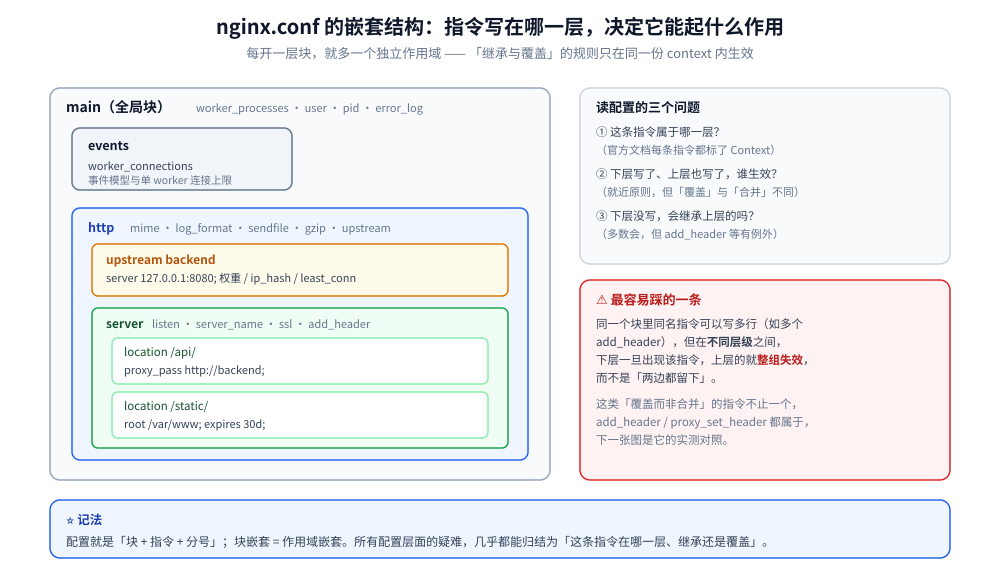
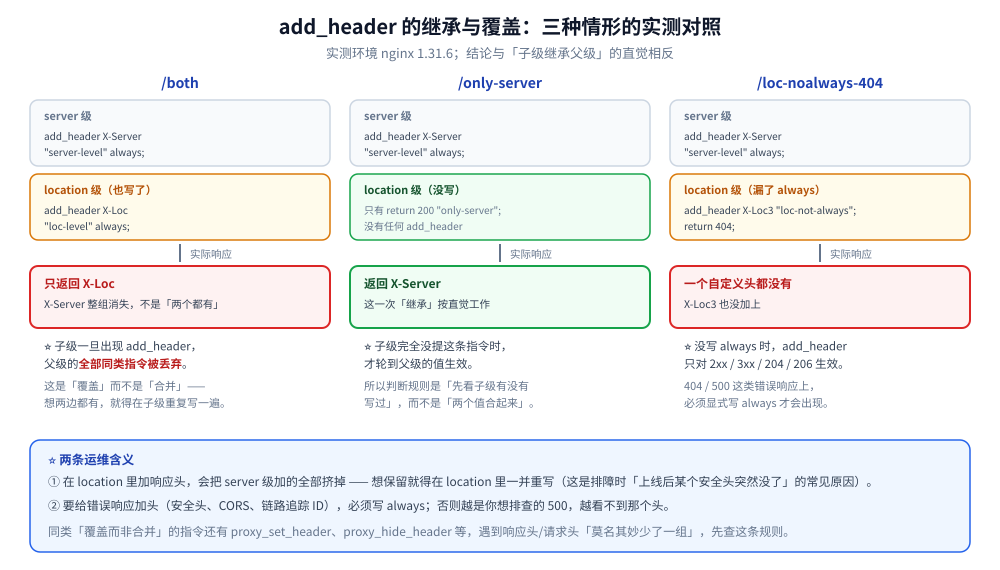

# 编译安装与配置

> 环境准备与 configure 参数、命令行控制、配置通用语法、服务与 HTTP 核心配置、
> 反向代理配置，以及 1.29~1.31 的现代配置特性（粘性会话、Early Hints、
> predicate locations、原生 JSON 解析、Control API）。
>
> 素材来源：《深入理解Nginx（第2版）》第1~2章的读后整理，**按主题归纳而非逐字摘录**；
> 现代特性基于 Nginx 官方 Release Notes（1.25.0 ~ 1.31.6）与官方文档独立整理。
> 实测口径见本目录 [README.md](README.md) 第四节；全部读数取自本机 Docker
> `nginx:mainline-alpine`（**1.31.6**）与 `nginx:1.26-alpine`（**1.26.3**）容器。

---

## 一、编译安装：configure 到底决定了什么？

**本节要点**：`nginx -V` 的那串 `--with-*` 就是「这个二进制有没有某项能力」的**唯一权威清单**
——配置里写了某指令却报 `unknown directive`，先回来查这串参数，而不是改配置。

### 1.1 环境准备与目录规划

编译前要备的不是「装个编译器」这么简单，书里列的那几项都有明确目的：

| 项 | 为什么需要 |
|---|---|
| `gcc` / `make` | 编译与链接；`pcre`、`zlib`、`openssl` 三个库分别对应 `rewrite` 正则、`gzip`、HTTPS |
| 内核参数（`somaxconn`、`tcp_max_syn_backlog`） | 决定 listen 队列长度；队列偏小则高并发下丢连接，且**表象是客户端 connect 超时**，容易误判成应用慢 |
| 磁盘目录规划 | `prefix` 决定 conf / logs / temp 位置；`proxy_temp` 打满会让大响应落盘失败 |
| 非 root 运行用户 | master 以 root 起、worker 降权到 `nobody`，是默认的安全形态 |

### 1.2 `configure` 参数：一次真实的对照

本机两个官方镜像的编译参数**差异只有三项**，但正好是「版本能力」的分界（均取自
容器内 `nginx -V`，2026-10-05）：

| 参数 | 1.31.6 | 1.26.3 | 说明 |
|---|---|---|---|
| `--with-control-api` | ✅ | ❌ | 1.31.5 新增，运行时控制接口 |
| `--with-http_json_module` | ✅ | ❌ | 1.31.5 新增，原生 JSON 解析 |
| `--with-http_v3_module` | ✅ | ✅ | 两者都有，QUIC 不是「新版才有」 |
| `--with-http_v2_module` | ✅ | ✅ | |
| `--with-threads`、`--with-compat` | ✅ | ✅ | 动态模块依赖 `--with-compat` |
| `--with-http_stub_status_module` | ✅ | ✅ | 后文 `stub_status` 实验靠它 |
| `--pid-path` | `/run/nginx.pid` | `/var/run/nginx.pid` | 只是路径搬了个位置 |

⭐ 结论：**判断「能不能用某个特性」的正确动作是 `nginx -V`**，不是看版本号猜。
⚠️ 注意 `sticky`（粘性会话）**不在** `--with-*` 列表里 —— 它在 1.29.6 之后是
upstream 模块**内置**的，所以两个镜像的差异清单里看不到它，但确实能用（见第五节）。

### 1.3 configure 执行流程

`configure` 做三件事：探测依赖与平台 → 生成 `objs/ngx_auto_config.h` 与
`objs/ngx_modules.c` → 生成 `Makefile`。`make` 按 `ngx_modules.c` 里的模块顺序编译并链接。
⭐ 记住这条的作用：**模块的调用顺序由 `ngx_modules.c` 的数组顺序决定**，而数组顺序由
`configure` 生成 —— 这也是为什么「过滤模块的注册顺序能影响输出顺序」（见
[04-HTTP框架执行流程.md](04-HTTP框架执行流程.md)）。

## 二、命令行控制

**本节要点**：`-s` 是发信号、`-t` 是只查语法、`-T` 是把**合并后**的完整配置打出来。

```bash
nginx -t                      # 只校验语法与路径可达性，不启动
nginx -T                      # 校验并 dump 合并后的完整配置（含 include 展开），排障主力
nginx -V                      # 版本 + configure 参数
nginx -v                      # 仅版本
nginx -s reload               # 等价于 kill -HUP <master>
nginx -s quit                 # 优雅退出（等价 kill -QUIT）
nginx -s stop                 # 快速退出（等价 kill -TERM）
```

本机实测（1.31.6，`nginx -t` 与 `nginx -T` 均成功退出）：

```text
nginx: the configuration file /etc/nginx/nginx.conf syntax is ok
nginx: configuration file /etc/nginx/nginx.conf test is successful
```

⭐ 一个容易忽略的点：**`nginx -t` 会真的去初始化共享内存区域**，所以「语法 ok 但
`-t` 失败」是可能的 —— 见 [05-内存管理与数据结构.md](05-内存管理与数据结构.md) 的
slab 实验（`keys_zone=8k` 语法通过、`ngx_slab_alloc() failed: no memory` 才失败）。

## 三、配置通用语法

**本节要点**：配置就是「块 + 指令 + 分号」，所有难点都在**继承与覆盖的规则**上。

### 3.1 块与嵌套

`http { server { location { } } }` 是三层最常见结构，指令可以从外向内继承。
⚠️ **不是所有指令都向下继承，且有的指令是「覆盖」而不是「合并」** —— 后者是坑，
3.3 用 `add_header` 实测。



### 3.2 单位、注释与变量

- 大小单位：`k` / `m`（如 `client_max_body_size 8m`）；时间单位：`ms` / `s` / `m` / `h` / `d`；
- 以 `#` 开头到行尾是注释；
- 变量在字符串里以 `$name` 或 `${name}` 出现，且**大多惰性求值**（只在被读取时才算，
  这是 `map` 缓存与「取处理程序」的来源，见本目录第二部分「HTTP 变量机制」一篇）；

### 3.3 继承 vs 覆盖：`add_header` 的实测

配置（1.31.6，server 级与 location 级各挂一个 `add_header`）：

```nginx
server {
    listen 8095;
    add_header X-Server "server-level" always;
    location /both {
        add_header X-Loc "loc-level" always;
        return 200 "both\n";
    }
    location /only-server {
        return 200 "only-server\n";
    }
    location /loc-noalways-404 {
        add_header X-Loc3 "loc-not-always";
        return 404;
    }
}
```

实测响应头（只列关键项）：

| 请求 | 返回的头 | 结论 |
|---|---|---|
| `/both` | **只有** `X-Loc` | ⭐ 子级出现 `add_header` 时，**父级的全部 `add_header` 被丢弃**，不是合并 |
| `/only-server` | `X-Server` | 无子级覆盖时正常继承 |
| `/loc-noalways-404` | **一个都没有** | ⭐ 没写 `always` 时只对 2xx / 3xx / 204 / 206 生效 |

⭐ 两条合起来的运维含义：**在 location 里加响应头，会把 server 级加的都挤掉**；
而给错误响应加头必须写 `always`。这与「继承」的直觉相反，是 `add_header` 最常见的坑。



## 四、服务基本配置

**本节要点**：`worker_processes` / `worker_connections` 决定并发上限，
但**上限是「进程数 × 每进程连接数」，且受 fd 上限二次约束**。

| 类 | 常用项 | 要点 |
|---|---|---|
| 运行 | `user` / `pid` / `daemon` / `master_process` | `daemon off` 是容器里的标准写法，但它会**关掉 `WINCH` 信号**（见 [02-进程模型与基础架构.md](02-进程模型与基础架构.md)） |
| 优化 | `worker_processes auto` / `worker_cpu_affinity` / `worker_rlimit_nofile` | 进程数按核数；`worker_rlimit_nofile` 要 ≥ `worker_connections`，否则连不上不是配置错而是 fd 不够 |
| 事件 | `use epoll` / `worker_connections` / `accept_mutex` / `multi_accept` | 具体见 [03-事件驱动与epoll.md](03-事件驱动与epoll.md) |

本机实测的 fd 与进程基线（1.31.6 容器内）：

```text
[notice] getrlimit(RLIMIT_NOFILE): 1048576:1048576
[notice] using the "epoll" event method
[notice] start worker process 31 / 32 / 33 / 34
[notice] start cache manager process 35
[notice] start cache loader process 36
```

⭐ 单个 worker 的空闲 RSS 实测 **3708 KB**，master **7252 KB** —— 定容量时这两个数比
「Nginx 很省内存」这句话有用（见 [05-内存管理与数据结构.md](05-内存管理与数据结构.md)）。

## 五、HTTP 核心模块配置

**本节要点**：`server_name` 的匹配是**有固定优先级链**的，不是「配置里谁在前谁赢」；
而 `location` 的优先级链与它完全不同。

### 5.1 `server_name` 匹配顺序（实测 5 例）

配置（同一个 `listen 8091` 下 4 个 server，其中后缀通配那条挂了 `default_server`）：

```nginx
server { listen 8091;                    server_name exact.example.com;    return 200 "match=exact\n"; }
server { listen 8091;                    server_name *.example.com;        return 200 "match=wildcard-head\n"; }
server { listen 8091 default_server;     server_name www.example.*;        return 200 "match=wildcard-tail\n"; }
server { listen 8091;                    server_name ~^reg\..+\.com$;      return 200 "match=regex\n"; }
```

实测（同一容器内 `curl`，逐次改 `Host` 头）：

| `Host` | 命中 | 说明 |
|---|---|---|
| `exact.example.com` | `exact` | ① 精确名优先 |
| `a.example.com` | `wildcard-head` | ② 前缀通配 `*.example.com` |
| `www.example.org` | `wildcard-tail` | ③ 后缀通配 `www.example.*` |
| `reg.foo.com` | `regex` | ④ 正则（按配置顺序，首个命中即停） |
| `other.tld` | `wildcard-tail` | ⚠️ **不是**后缀通配命中了它 |

⭐ 最后一行是本文最容易读错的地方：`other.tld` 走的是 **`default_server` 兜底**，
而不是「后缀通配」—— 只因为 `default_server` 恰好挂在那条 `www.example.*` 上，
两者的响应体才长得一样。把 `default_server` 挪到别的 server 上，这一行结果立刻会变。
**判据**：想知道一个请求到底落到哪个 server，用 `nginx -T` 确认 `default_server` 的位置，
别靠响应体反推。

### 5.2 路径、资源与限制

| 指令 | 要点 |
|---|---|
| `root` / `alias` | `alias` 是**替换**匹配到的前缀，`root` 是**拼接**；末尾斜杠写错会拼出双斜杠或多一层目录 |
| `client_max_body_size` | 超过直接 413，不进入 content 阶段 |
| `client_body_buffer_size` | 超过则落临时文件，`proxy_request_buffering off` 时尤其要关注 |
| `types` / `include mime.types` | 决定 `Content-Type`；写错会让浏览器按文本渲染 CSS/JS |
| `sendfile` / `tcp_nopush` | 静态大文件的关键组合 |

### 5.3 `location` 的优先级链

⭐ **与 `server_name` 完全不同的另一条链**，且 1.31.5 又加了一条：

```text
① 精确 = /x
② ^~ 前缀（命中即停，不再看正则）
③ 普通前缀 —— 只「记住最长的那个」，先不返回
④ 正则 ~ / ~* —— 按配置顺序，首个命中即用
⑤ predicate $var —— 1.31.5 新增，按配置顺序（见第七节）
⑥ 都没命中 → 回落到 ③ 记住的最长前缀
```

⚠️ 这条链在既有篇目里已有 **5 例本机实测**（含 `=` / `^~` / `~` / 普通前缀的交叉验证），
见 [OpenResty.md](../../../03-数据与中间件/中间件/网关与代理/OpenResty.md) 第 4.1 节 ——
本文不重复跑，只补充第五档 predicate。

## 六、反向代理配置

**本节要点**：`proxy_pass` 末尾那个斜杠决定「剥不剥前缀」；上游协议在 1.29.7 之后
**默认从 HTTP/1.0 变成了 HTTP/1.1 + keep-alive**。

### 6.1 `proxy_pass` 与末尾斜杠

`proxy_pass http://backend;` 保留完整 URI；`proxy_pass http://backend/;` 会把 location
匹配到的前缀**换掉**。这条与 `location` 优先级一样，已有 2 例本机实测，
见 [OpenResty.md](../../../03-数据与中间件/中间件/网关与代理/OpenResty.md) 第 4.2 节。

### 6.2 上游协议：1.26.3 与 1.31.6 的对照实测 ⭐

`1.29.7` 起 `proxy_http_version` 的默认值从 `1.0` 改成 `1.1`，并且**默认启用 keep-alive**。
不用看文档也能测出来：让上游把「它收到的协议版本」打在响应体里。

上游（`nginx:1.26-alpine`）配置：

```nginx
server { listen 80;   location / { return 200 "B1 proto=$server_protocol uri=$request_uri\n"; } }
server { listen 8081; location / { return 200 "B2 proto=$server_protocol uri=$request_uri\n"; } }
```

代理侧两级配置完全相同（只有镜像版本不同）：`location / { proxy_pass http://be; }`

| 代理版本 | 上游收到的 `$server_protocol` |
|---|---|
| `nginx:1.31.6` | **`HTTP/1.1`** |
| `nginx:1.26.3` | **`HTTP/1.0`** |

⭐ 这就是「默认行为变更」的实测形态。**为什么值得知道**：HTTP/1.0 上游连接**不可复用**，
每次代理都要新建 TCP；升级到 1.31.x 后默认变成长连接，后端的连接数模型（以及
`keepalive` 参数、`Connection` 头的处理）都会跟着变 —— 如果后端按「短连接」做了容量假设，
升级后可能反而看到连接堆积。

⚠️ 对照实验能成立的前提是「两次只改一个变量」，所以两个容器的 proxy 配置**逐字相同**。

### 6.3 负载均衡与 `next upstream`

- 轮询 / 加权轮询 / `ip_hash` / `least_conn`；
- ⚠️ **轮询指针是 per-worker 的**：本机实测中同一时刻 4 个 worker 对
  `up=172.27.0.2:80` 与 `:8081` 的选择各自独立，所以从客户端看到的整体序列
  **不是严格交替**（实测无 cookie 连发 6 次的落点为 `B1 B1 B2 B2 B1 B2`）。
  这解释了一个常见困惑：「两个后端，为什么不是一次一个」；
- `proxy_next_upstream` 决定哪些错误会触发换一台重试。⚠️ **写请求重试要谨慎**：
  「已写入但响应丢了」的重试会造成重复。

## 七、现代特性（1.29 ~ 1.31）

**本节要点**：1.31.5 的四项能力是一套组合拳，合起来让
**开源版 Nginx 不依赖 Lua / njs 就能按「请求体内容」路由**。

### 7.1 Sticky Sessions（粘性会话，1.29.6）

```nginx
upstream sticky_be {
    sticky cookie srv_id expires=1h path=/;
    server nl-backend:80;
    server nl-backend:8081;
}
```

实测（1.31.6，两个后端分别返回 `B1` / `B2`）：

| 请求方式 | 落点 |
|---|---|
| 首次请求 | `Set-Cookie: srv_id=d0a9a6be558769f012504870e220f907; expires=...; max-age=3600; path=/`，本命中 **B2** |
| 带该 cookie 连发 6 次 | **6/6 全为 B2** |
| 不带 cookie 连发 6 次 | `B1 B1 B2 B2 B1 B2`（退回轮询） |

⭐ 含义：**同一客户端被钉在同一台上**，且不依赖源 IP（`ip_hash` 在 NAT、移动网络、
运营商代理下会失效，cookie 不会）。代价是**后端不再无状态**：一台挂了，它的会话就断了。

### 7.2 Early Hints（103，1.29.0）

```nginx
location / {
    early_hints on;
    proxy_pass http://eh_be;
}
```

上游用裸 socket 手写 `HTTP/1.1 103 Early Hints` + `Link` 头（`python:3-alpine`），
实测客户端收到的**原始响应**：

```text
HTTP/1.1 103 Early Hints
Link: </style.css>; rel=preload; as=style

HTTP/1.1 200 OK
Server: nginx/1.31.6
...
final-body
```

⭐ 要点：**103 不是「加个头」，而是多一个响应段**，`early_hints` 的职责是把上游发来的
103 **透传**给客户端；上游不发，打开它也没用。它的价值是让浏览器在等首字节期间就开始
预加载 CSS/JS。⚠️ 客户端必须支持（`curl -i` 能看到，是因为 curl 会把中间响应打出来）。

### 7.3 predicate locations（1.31.5）⭐

```nginx
map $arg_route $pred_flag { "1" 1; default ""; }

location /            { return 200 "prefix-match\n"; }
location $pred_flag   { return 200 "predicate-match\n"; }
```

实测四种组合：

| 请求 | 命中 | 说明 |
|---|---|---|
| `/` | `prefix-match` | 变量为空 → predicate 不匹配 |
| `/?route=1` | `predicate-match` | 变量非空且非 `"0"` → 匹配 |
| `/?route=0` | `prefix-match` | ⚠️ 值为 `"0"` **不算匹配** |
| `/deep/path?route=1` | `predicate-match` | ⭐ predicate 优先于「已记住的最长前缀」 |

官方口径（`ngx_http_core_module`）：predicate 以 `$` 前置，
**在正则之后、按配置顺序**检查；匹配条件是「变量值非空且不等于 `"0"`」。
都未命中才回落到前面记住的最长前缀。⭐ 这条把路由维度从「URI 字符串」扩到了「任意变量」，
是 5.3 那条链的第五档。

### 7.4 原生 JSON 解析 + 早读请求体（1.31.5）⭐

```nginx
map $http_content_type $is_json { application/json 1; default ""; }

json_set $json_method $request_body method;
json_set $json_id     $request_body request.id;
json_set $json_item0  $request_body items[0];

server {
    listen 8090;
    client_body_early_read $is_json;
    location /json { return 200 "method=$json_method id=$json_id item0=$json_item0\n"; }
}
```

实测（POST `{"method":"tools/call","request":{"id":"req-42"},"items":["alpha","beta"]}`）：

| 场景 | 响应 |
|---|---|
| 开了 `client_body_early_read` | `method=tools/call id=req-42 item0=alpha` |
| 同配置但**不开**早读 | `method= id= item0=`（全空） |
| `Content-Type: text/plain` | 全空（早读按变量条件不生效） |
| 非法 JSON 体 | 全空（`json_set` 变量 not found，**不报错**） |

⭐ 三件事一次说清：

1. **两者必须配合**：`json_set` 从变量里取 JSON，而 `$request_body` 默认要在
   content 阶段才有值；`return` 属于 rewrite 阶段，所以不早读就是全空；
2. **早读是有条件的**：`client_body_early_read $var;` 的语义是「至少一个参数非空且
   不等于 `"0"` 时才早读」—— 所以可以按 `Content-Type` 精准开启，避免无谓地读大 body；
3. **语法上路径用点分、数组用 `[下标]`**；成员名含 `.` / `[` / `]` 或为空时要写成
   JSON 字符串形式并整体加引号（如 `json_set $x $request_body '["a.b.com"]';`）。

⚠️ 早读与两类模块**不兼容**：使用无缓冲请求体的（如 `ngx_http_grpc_module`）、
以及把请求体写文件的（如 `ngx_http_dav_module`）；此时 `client_body_in_file_only` 会被忽略。

### 7.5 Control API（1.31.5）

从 NGINX Plus 下放开源，跑在 **master** 进程内，用启动参数绑定：

```bash
nginx -l unix:/tmp/nginx.sock
curl -s --unix-socket /tmp/nginx.sock http://localhost/1/nginx
curl -s --unix-socket /tmp/nginx.sock http://localhost/1/control/processes
curl -s -X PATCH --unix-socket /tmp/nginx.sock http://localhost/1/control/config
```

本机实测（1.31.6）原始返回：

```text
GET /1/nginx                 -> {"version":"1.31.6","build":""}
GET /1/control/processes     -> [{"name":"worker process","pid":10,"exiting":false}, ... 共 4 个]
PATCH /1/control/config      -> HTTP 200
```

⭐ 三点实测观察：

1. `PATCH /1/control/config` 就是一次 **reload**，区别是**同步拿到结果**：日志里能看到它
   真的重新初始化了事件模块并起了新 worker（`using the "epoll" event method` +
   `start worker processes`）；配置有问题时返回 422 并带 `logs` 数组，不用再去翻 error.log；
2. `/1/control/processes` 的 `exiting` 字段能看出某个 worker **是否正在优雅退出** ——
   这正是平滑升级期间观察旧 worker 的抓手；
3. 每次调用都会在日志里留下 `signal 29 (SIGIO) received`：Control API 靠 SIGIO 唤醒
   master 的事件循环（源码 `case SIGIO: ngx_sigio = 1;`）。

⚠️ 这是**无鉴权**接口，官方明确建议**只绑 UNIX 域套接字**并把路径权限收紧，
不要监听网络端口。

### 7.6 编译依赖与未实测项

| 特性 | 状态 |
|---|---|
| ECH（Encrypted ClientHello，1.29.4） | ⚠️ **未实测**：需要带 ECH 的 OpenSSL 构建（`ssl_ech_file`），官方镜像不带；1.29.4 仅支持 **shared-mode** |
| MPTCP（1.29.7） | ⚠️ **未实测**：需要内核 ≥ 5.6 且 `net.mptcp.enabled=1`，容器内不可控 |
| HTTP/2 to Backend（1.29.4） | ⚠️ **未实测**：配置形态是 `proxy_http_version 2;` |
| QUIC / HTTP/3（1.25.0 实验） | 镜像已编译 `--with-http_v3_module`；⚠️ **用 OpenSSL ≤ 3.5.0 编译的 HTTP/3 有堆溢出漏洞**（`CVE-2026-90439`，1.31.6 修复），故「3.5.1+」是硬下限 |

## 使用

### 1) 先确认这个二进制有什么能力

```bash
docker run --rm nginx:mainline-alpine nginx -V 2>&1 | tr ' ' '\n' | grep -E '^--' | sort
```

### 2) 起一个可复现的实验台（配置挂载、只读）

```bash
docker network create nl-net
docker run -d --name nl-main --network nl-net \
  -v "$PWD/conf/main.conf:/etc/nginx/nginx.conf:ro" nginx:mainline-alpine
docker logs -f nl-main          # 不要 tail /var/log/nginx/error.log，那是 /dev/stderr
```

### 3) 改配置前必做

```bash
docker exec nl-main nginx -t          # 语法 + 共享内存初始化
docker exec nl-main nginx -T | less   # dump 合并后的完整配置（含 include）
docker exec nl-main nginx -s reload   # 确认无误再 reload
```

### 4) 一页排障顺序

```text
unknown directive        -> nginx -V 查是否编译进该模块
配置语法 ok 但 -t 失败   -> 多为共享内存/slab 初始化失败（见 05 篇）
改了头却没生效           -> add_header 的「子级覆盖父级」与 always（3.3）
代理到后端协议不对       -> proxy_http_version 默认值随版本变了（6.2）
路由维度不够             -> predicate location / json_set + 早读（7.3 / 7.4）
```

## 延伸追问

### 1. `configure` 与 `make` 分别做了什么？

`configure` 是**探测与生成**：找依赖库、判断平台特性、按 `--with-*` 组装模块列表，
产出 `ngx_auto_config.h`、`ngx_modules.c` 和 `Makefile`；`make` 才真正编译链接。
⭐ 所以「加了 `--with-xxx` 还是报 unknown directive」通常不是 `make` 的问题，而是
`configure` 阶段那个库没找到（比如没装 `libpcre3-dev`，`rewrite` 相关能力直接缺席）。

### 2. `proxy_pass` 后面的斜杠有什么影响？

带斜杠（`proxy_pass http://backend/;`）= **用 location 前缀去换**，即剥掉前缀；
不带斜杠 = 原样带上完整 URI。本机 2 例实测见
[OpenResty.md](../../../03-数据与中间件/中间件/网关与代理/OpenResty.md) 第 4.2 节。
⭐ 判断口诀：**「带斜杠就是 replace，不带就是 append」**，并且只对前缀型 location 成立，
正则 location 里带不带斜杠都会被整个替换。

### 3. 1.29.7 的默认行为变更对现有配置有什么影响？

上游协议从 `HTTP/1.0` 变成 `HTTP/1.1` + keep-alive（本机对照实测见 6.2）。
影响面有三处：① 后端从「每请求一条连接」变成**长连接**，后端的连接数与超时假设要重算；
② 显式写了 `proxy_set_header Connection "";` 之类的老配置可能变成**冗余甚至冲突**；
③ 依赖「请求结束即连接关闭」的后端（少见但存在）行为会变。
⭐ 升级前先在测试环境把 `$server_protocol` 打到上游日志里验证一次，比读 changelog 可靠。

### 4. predicate location 会不会把路由搞得太隐晦？

会。它的能力等价于「把 `if` 从 content 阶段提前到**路由**阶段」，表达力上去了，
但**可预测性下降**：同一个 URI 落到哪个 location 取决于变量求值结果，而变量的值可能来自
header、body、map 或共享内存。⭐ 实践建议：predicate 只用于**正交的少数维度**
（如「是不是 AI 爬虫」「body 里的 method 是不是 tools/call」），且必须配一条
**兜底的前缀 location**，否则变量一异常整条链路就 404。

## 关联

- [README.md](README.md) — 本目录的版本坐标表与实测口径
- [02-进程模型与基础架构.md](02-进程模型与基础架构.md) — `daemon off` 为什么让 `WINCH` 失效
- [03-事件驱动与epoll.md](03-事件驱动与epoll.md) — `worker_connections` 与 `accept_mutex`
- [05-内存管理与数据结构.md](05-内存管理与数据结构.md) — `keys_zone` 的最小尺寸与容量
- [OpenResty.md](../../../03-数据与中间件/中间件/网关与代理/OpenResty.md) — `location` 优先级 5 例与 `proxy_pass` 斜杠 2 例的实测
- [网关选型.md](../../../03-数据与中间件/中间件/网关与代理/网关选型.md) — Nginx 作为流量网关的能力边界四组实测
- [内存管理.md](../内存管理.md) — 操作系统侧的 slab 与 `free` 的正确读法
> 反向引用（本篇被下列文档引到）：[04-HTTP框架执行流程.md](04-HTTP框架执行流程.md)、[08-upstream与子请求.md](08-upstream与子请求.md)、[11-HTTP3与QUIC支持.md](11-HTTP3与QUIC支持.md)、[13-njs模块与动态脚本.md](13-njs模块与动态脚本.md)、[15-Tengine生态.md](15-Tengine生态.md)
