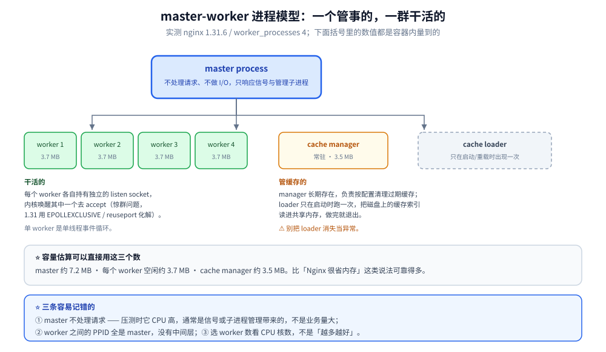
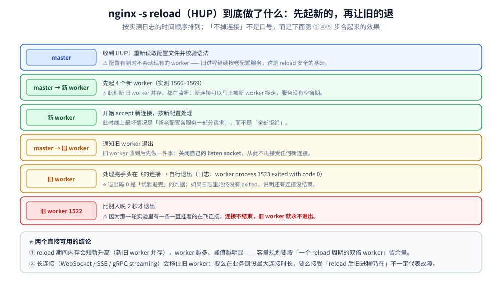

# 进程模型与基础架构

> 模块化设计、master-worker 进程模型、进程间协作（共享内存 / channel / 信号）、
> 信号表与平滑升级，以及「为什么是多进程而不是多线程」。
>
> 素材来源：《深入理解Nginx（第2版）》第8章「Nginx 基础架构」与第14章「进程间的通信机制」
> 的读后整理，**按主题归纳而非逐字摘录**；信号语义按 nginx 官方《开发指南》与
> 《Controlling nginx》核对，并对照 `ngx_process.c` 源码；实测口径见本目录
> [README.md](README.md) 第四节，容器为 `nginx:mainline-alpine`（**1.31.6**）。

---

## 一、模块化设计

**本节要点**：nginx 的一切能力都是模块；「能不能用某指令」等价于「那个模块在不在
`ngx_modules.c` 的数组里」。

### 1.1 模块分类

| 类型 | 职责 | 例子 |
|---|---|---|
| 核心模块 | 提供进程模型、事件循环、配置框架等基础设施 | `ngx_core_module`、`ngx_events_module` |
| 事件模块 | 具体的事件驱动实现 | `ngx_epoll_module`、`ngx_kqueue_module` |
| HTTP 模块 | HTTP 的 11 个阶段与各类 handler | `ngx_http_core_module`、`ngx_http_proxy_module` |
| 邮件 / stream 模块 | 四层与邮件代理 | `ngx_mail_core_module`、`ngx_stream_proxy_module` |

### 1.2 `ngx_module_t` 与注册

每个模块用 `ngx_module_t` 描述自己（`ctx`、`commands`、`init_module` 等回调），
最终由 `configure` 生成的 `objs/ngx_modules.c` 汇总成一个数组。⭐ **数组顺序即调用顺序**，
所以「哪个模块先初始化、哪个过滤模块先执行」不是随意的，而是由模块类型 + 配置顺序共同决定。

### 1.3 动态模块

`load_module modules/ngx_http_xxx_module.so;` 可以在不改主程序的情况下加载模块。
代价是**必须与主程序 ABI 兼容**（官方构建带 `--with-compat`），版本不匹配会直接拒绝启动，
不是运行时才崩。

## 二、master-worker 进程模型

**本节要点**：master **不做 I/O、只响应信号**；worker 处理连接；另有两个 helper 进程
（cache manager / cache loader）专门管缓存。

### 2.1 实测的进程视图

容器内 `ps -o pid,ppid,stat,rss,args`（1.31.6，`worker_processes 4`）：

```text
PID   PPID  STAT  RSS   COMMAND
    1     0  S     7252  nginx: master process nginx -g daemon off;
  1566     1  S     3708  nginx: worker process
  1567     1  S     3708  nginx: worker process
  1568     1  S     3708  nginx: worker process
  1569     1  S     3708  nginx: worker process
  1570     1  S     3540  nginx: cache manager process
```

启动日志（同一容器，`error_log` 级别 `info`）：

```text
[notice] built by gcc 15.2.0 (Alpine 15.2.0)
[notice] OS: Linux 6.18.40.1-microsoft-standard-WSL2
[notice] getrlimit(RLIMIT_NOFILE): 1048576:1048576
[notice] using the "epoll" event method
[notice] start worker process 31 / 32 / 33 / 34
[notice] start cache manager process 35
[notice] start cache loader process 36
```

⭐ 三点可量化的收获：

1. **worker 的空闲 RSS 约 3.7 MB**、master 约 7.2 MB —— 容量估算用这个数，
   比「Nginx 很省内存」可靠；
2. PPID 全是 1：**worker 与 helper 都是 master 的直系子进程**，没有中间层；
3. `cache loader` 只在启动时出现一次（加载缓存索引后会退出），
   长期存在的是 `cache manager` ⚠️ 别把两者的数量变化当成异常。



### 2.2 职责划分

| 进程 | 做什么 | 不做什么 |
|---|---|---|
| master | 读配置、建 listen socket、起/停 worker、处理信号、**接受 Control API 请求** | 几乎不做 I/O |
| worker | `accept`、读写、执行 11 个阶段 | 不读配置（配置由 master 解析后通过共享内存/channel 传递） |
| cache manager | 按 `inactive` / `max_size` **淘汰**缓存 | — |
| cache loader | 启动时**重建**缓存索引到共享内存 | 建完即退出 |

## 三、进程间协作

**本节要点**：nginx 内部是「**信号下命令 + channel 传数据**」两条腿，
共享内存用于需要多方同时读写的状态。

### 3.1 共享内存

`ngx_shm_zone_t` 一块区域，多个 worker 映射同一段物理内存。典型用途：
`limit_req_zone`（限流计数）、`limit_conn_zone`（连接数）、`proxy_cache_path` 的
`keys_zone`（缓存索引）。

⚠️ 共享内存的分配器是 **slab**，不是内存池 —— 两者设计目标不同，
见 [05-内存管理与数据结构.md](05-内存管理与数据结构.md)。

### 3.2 信号与 channel 的分工

⭐ nginx 官方《开发指南》原文说得很清楚：

> While all nginx worker processes are able to receive and properly handle POSIX signals,
> **the master process does not use the standard `kill()` syscall**
> **to pass signals to workers and helpers**. Instead, nginx uses
> **inter-process socket pairs** which allow sending
> messages between all nginx processes. Currently, however, messages are only sent from
> the master to its children.

所以要区分两件事：**外部给 master 发信号**（用 `kill`）与 **master 通知 worker**
（用 channel）。这也解释了一个常见现象：在容器里对 worker 直接发信号往往没用（见第四节）。

## 四、信号与平滑升级

**本节要点**：`HUP` 是「先起新的、再让旧的优雅退出」；`USR1` 会**通知到每一个 worker**；
而 `WINCH` 在容器里因为 `daemon off` 会被**完全忽略**。

### 4.1 信号表

| 信号 | 发给谁 | 语义 |
|---|---|---|
| `TERM` / `INT` | master 或 worker | 快速退出（不等在飞的请求） |
| `QUIT` | master 或 worker | 优雅退出（先停止接受新连接，处理完在飞的再退） |
| `HUP` | master | 重读配置；成功则起新 worker 并让旧的优雅退出 |
| `USR1` | master（转发给 worker） | 重开日志文件 |
| `USR2` | master | 平滑升级可执行文件（配合 `WINCH` 回滚/切换） |
| `WINCH` | master | 优雅关闭**全部** worker / helper（⚠️ 见 4.4） |
| `WINCH` | worker | ⚠️ 官方文档：**调试模式下的异常终止**，需 `debug_points` 开启 |

### 4.2 `HUP` / `reload`：新旧 worker 的交替（实测）

在 4 个 worker 的容器里发 `nginx -s reload`，日志按时间顺序：

```text
[notice] 1#1: start worker processes
[notice] 1#1: start worker process 1566 / 1567 / 1568 / 1569      <- 先起新的（4 个）
[notice] 1#1: worker process 1523 exited with code 0              <- 再让旧的退出
[notice] 1#1: worker process 1525 exited with code 0
[notice] 1#1: worker process 1524 exited with code 0
[notice] 1#1: worker process 1522 exited with code 0              <- 这条晚 2 秒
```

⭐ **`1522` 为什么晚退**：那一轮实验里有一条**一直挂着的在飞连接**。
nginx 对旧 worker 的处理是：**关闭 listen socket（不再接新连接）→ 处理完手头连接 → 退出**。
所以「平滑升级不掉连接」不是一句口号，机制就在这两步；反过来说，
**如果某条连接永不结束，旧 worker 就永不退出**（长连接/WebSocket 场景要留意）。



### 4.3 `USR1`：日志轮转的机制（实测）

发 `kill -USR1 <master>` 后，日志里出现的是 **每个 worker 各一条**：

```text
[notice] 1493#1493: reopening logs
[notice] 1494#1494: reopening logs
[notice] 1496#1496: reopening logs
[notice] 1497#1497: reopening logs
```

⭐ 这印证了 master-worker 的协作方式：**master 负责把信号转发下去**，
真正 `open()` 新日志文件的是每个 worker 自己。所以 logrotate 的正确姿势是
「**先改名 → 再 `USR1`**」，而不是先 `USR1`。

### 4.4 `WINCH` 在容器里为什么没用（源码级）

实测两个方向都无效：

| 实验 | 结果 |
|---|---|
| `kill -WINCH <master>`（PID 1），2s 后 | 4 个 worker **全部仍在** |
| `kill -WINCH <某个 worker>`，3s / 5s 后 | 该 worker **仍存活** |

⭐ 根因在 `src/os/unix/ngx_process.c` 的 `ngx_signal_handler`：

```c
case ngx_signal_value(NGX_NOACCEPT_SIGNAL):
    if (ngx_daemonized) {                 /* master / single 侧 */
        ngx_noaccept = 1;
        action = ", stop accepting connections";
    }
    break;
```

```c
case ngx_signal_value(NGX_NOACCEPT_SIGNAL):
    if (!ngx_daemonized) {                /* worker / helper 侧 */
        break;
    }
    ngx_debug_quit = 1;
    /* fall through */
case ngx_signal_value(NGX_SHUTDOWN_SIGNAL):
    ngx_quit = 1;
```

⚠️ **容器里 nginx 以 `-g "daemon off;"` 运行 → `ngx_daemonized == 0` → 两处都直接跳过**，
`WINCH` 被静默忽略。这解释了本机为什么测不出「WINCH 关闭 worker」。

⭐ 这条的实践含义：**平滑升级（`USR2` + `WINCH`）在 `daemon off` 的容器里走不通**。
要它生效，得让 nginx **守护化**运行（去掉 `daemon off`，另想办法保活），
或者放弃这套流程改用「滚动替换容器」——后者才是 K8s 里的常规做法。

### 4.5 两个顺带实测到的信号

| 信号 | 源码行为 | 观测场景 |
|---|---|---|
| `SIGIO` | master 里 `ngx_sigio = 1;` | 调 Control API 时日志出现 `signal 29 (SIGIO) received`（见 01 篇 7.5） |
| `SIGCHLD` | master 里 `ngx_reap = 1;` 并调用 `ngx_process_get_status()` | 回收子进程；`nginx: worker process ... exited with code 0` 就是它触发的 |
| `RECONFIGURE` / `CHANGEBIN` / `SIGIO` | **worker 侧归类为 `ignoring`** | 在 worker 里发这些等于石沉大海 |

## 五、为什么是多进程而不是多线程

**本节要点**：不是为了「并行」，而是为了**隔离与可运维性** —— 隔离一个 worker 的
崩溃、崩溃后不影响在飞连接、以及「一个进程一份独立的锁与状态」。

| 维度 | 多进程的取舍 |
|---|---|
| 隔离性 | 一个 worker 崩了只影响它手上的连接，master 会重新拉起；多线程一崩全崩 |
| 锁开销 | 进程间共享状态需要显式共享内存 + 原子/自旋锁，写起来麻烦；但**不需要为每个对象加线程锁**，反而少了锁竞争 |
| 平滑升级 | 新老 worker 可以**同时存在**（老的处理完旧连接才退），多线程模型里换代码要复杂得多 |
| 内存 | 每个 worker 有独立地址空间（实测**空闲 3.7 MB**），加上写时复制实际上更省；但**共享状态的代价**更高 |
| 代价 | 跨 worker 的**状态同步必须显式做**：`limit_req_zone` 这类必须放共享内存，否则每个 worker 各限各的（实际限流值 = 配置值 × worker 数） |

⚠️ 最后一条是最容易踩的运维坑：**忘了共享内存，限流就变成了「按 worker 数翻倍」。**

## 使用

### 1) 看清一个运行中的 nginx 的进程结构

```bash
docker exec nl-main ps -o pid,ppid,stat,rss,args | grep "[n]ginx:"
```

⚠️ 用 `grep "[n]ginx:"` 这种**方括号写法**：直接 `ps | grep nginx` 会把
`grep` 自己也算进去；同理 `ps -o args | awk '/nginx: worker process/'` 会**匹配到 awk 自己**
（本机实测踩过，导致「worker 数莫名多一个」）。

### 2) 平滑重载并核对新旧交替

```bash
docker exec nl-main nginx -s reload
docker logs nl-main 2>&1 | grep -E "start worker process|exited with code" | tail -12
```

判据：先出现 N 条 `start worker process`，再出现 N 条 `exited with code 0`，且 PID 全变。

### 3) 日志轮转

```bash
docker exec nl-main sh -c 'mv /var/log/nginx/access.log /var/log/nginx/access.log.1'
docker exec nl-main kill -USR1 1
docker logs nl-main 2>&1 | grep "reopening logs" | tail -5
```

⚠️ 容器里日志默认是 `/dev/stdout` 软链，这套流程要在**真实文件**上练；
先把 `access_log` 指到容器内的真实路径。

### 4) 「变了但没生效」检查单

```text
改了配置 reload 后行为没变   -> 看日志有没有 start worker process（没有 = 配置没被采用）
worker 数是配置值的 N 倍     -> 共享内存没生效，状态被每 worker 各存一份（第五节）
容器里 WINCH 无反应          -> daemon off，信号被忽略（4.4）
worker 一直不退出            -> 有长连接没结束，旧 worker 在等它（4.2）
```

## 延伸追问

### 1. 为什么 master 进程是唯一的？

因为 listen socket 由 master 统一创建、再传给 worker，配置也只有一份解析结果。
如果允许多个 master，就得解决「谁持有 listen socket、谁决定 reload」的问题，
收益为零而复杂度陡增。⭐ 顺带一个推论：**worker 不读配置文件**，
所以 `nginx.conf` 改坏之后「已经跑着的 worker」不受影响，回滚只需把文件改回来再 `HUP`。

### 2. worker 进程数量怎么设置？

`worker_processes auto` 按 CPU 核数；但**上限不只看核数**：
CPU 密集的（gzip、TLS 握手、正则）按核数；I/O 密集且大量静态文件时，
更多的 worker 未必更快（磁盘队列才是瓶颈）。⭐ 本机实测的一条参考：
单个 worker **空闲就要 3.7 MB**，加 `worker_connections` 与共享内存后更高，
在内存受限的容器里「核数乘几」之前先把内存算清楚。

### 3. Control API 与 `reload` 有什么区别？

`PATCH /1/control/config` **就是**一次 reload，区别在反馈方式：
reload 是「发信号 → 去 tail error.log 猜成功没有」，Control API 是**同步返回 JSON**，
失败时带 `logs` 数组（如 `{"logs":["[emerg] unexpected '}' in ..."]}`）。
⭐ 对自动化流水线而言这是质变：可以直接把「配置能不能用」当成一个**可断言的返回值**。
另外 `/1/control/processes` 的 `exiting` 字段让「旧 worker 退干净了没有」变得可观测 ——
这在平滑升级里原本只能靠 `ps` 盯。前提是它**无鉴权**，只能绑 UNIX 套接字。

### 4. 为什么 worker 收到 `USR1` 要自己重开日志？

因为**文件描述符是每个进程各自持有的**。master 打开新文件不会让 worker 的 fd 变新，
所以必须逐个通知。⭐ 这也是「共享内存里放不下文件句柄」的直接体现：
能共享的是**内存与 socket**，不是「打开的文件」。

## 关联

- [README.md](README.md) — 版本坐标与实测口径
- [01-编译安装与配置.md](01-编译安装与配置.md) — `worker_processes` / `worker_rlimit_nofile` 配置项
- [03-事件驱动与epoll.md](03-事件驱动与epoll.md) — worker 内部的事件循环与 `accept_mutex`
- [05-内存管理与数据结构.md](05-内存管理与数据结构.md) — 共享内存为什么用 slab 而不是内存池
- [进程与线程.md](../进程与线程.md) — 进程 / 线程 / 协程的创建成本与切换实测
- [网关选型.md](../../../03-数据与中间件/中间件/网关与代理/网关选型.md) — reload 到底掉不掉流量的四组本机实测
> 反向引用（本篇被下列文档引到）：[04-HTTP框架执行流程.md](04-HTTP框架执行流程.md)、[15-Tengine生态.md](15-Tengine生态.md)、[16-模块开发实战.md](16-模块开发实战.md)
