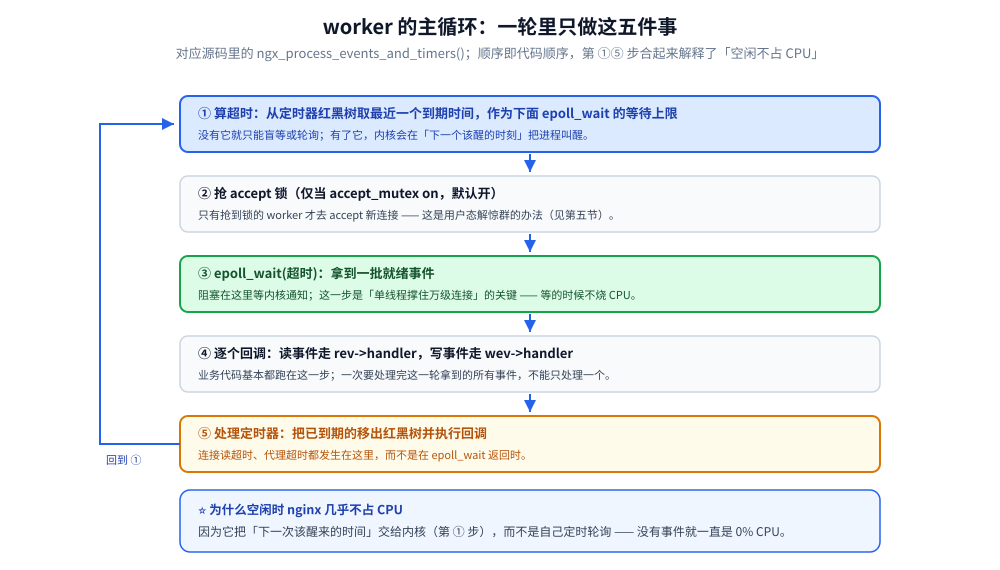
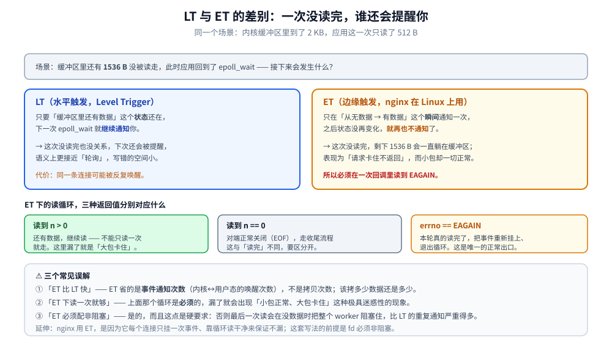

# 事件驱动与epoll

> nginx 的事件模块抽象、事件循环做什么、事件注册表与超时管理、ET 模式下的读写要求，
> 惊群问题的三种解法（`accept_mutex` / `EPOLLEXCLUSIVE` / `reuseport`），
> 以及 QUIC 给事件模型带来的变化。
>
> 素材来源：《深入理解Nginx（第2版）》第9章「事件模块」的读后整理，**按主题归纳而非逐字摘录**；
> 实测口径见本目录 [README.md](README.md) 第四节，容器为 `nginx:mainline-alpine`（**1.31.6**，4 worker）。
>
> ⚠️ **本篇不重复讲 epoll 本身**：`epoll_create` / `epoll_ctl` / `epoll_wait` 三个系统调用、
> LT 与 ET 的语义差异、Reactor 模式、以及 Go / Java 侧的完整实现，全在
> [IO多路复用.md](../../网络/IO多路复用.md)。本文只回答「**nginx 怎么把它用起来**」。

---

## 一、事件驱动的抽象：为什么要多一层

**本节要点**：nginx 把「等待 I/O 就绪」这件事抽象成了一个模块接口，
好处是同一套业务代码可以在 epoll / kqueue / select / poll 之间换实现。

| 抽象 | 作用 |
|---|---|
| `ngx_event_module_t` | 事件模块必须实现的接口（`add` / `del` / `enable` / `disable` / `process_events`） |
| `ngx_event_actions_t` | 全局函数指针表，指向**当前选中的**那套实现 |
| `ngx_event_t` | 一个事件（可读 / 可写 / 定时器 / 延迟） |
| `ngx_connection_t` | 一条连接（读事件 + 写事件 + socket fd + 缓冲区） |
| `ngx_event_timer_rbtree` | 定时器红黑树 |

⭐ 一个直接可验证的推论：**业务模块从不直接调 `epoll_ctl`**，只注册
`ngx_event_t` 的回调；所以官方的 Windows 版（IOCP）与 Linux 版可以共享绝大部分代码。
本机实测的日志行就是这套选择的结果：

```text
[notice] using the "epoll" event method
```

⚠️ 这句话来自 `info` 及以上级别的启动日志，是最省事的「确认事件模型」手段 ——
不需要 `strace`，也不依赖 `--with-*` 参数列表（事件模块不在 `nginx -V` 里列）。

## 二、事件循环：一轮里发生什么

**本节要点**：worker 的主循环只做四件事 —— 等事件、处理事件、处理定时器、检查退出标志。

书里把 `ngx_process_events_and_timers()` 的骨架讲得很细，按执行顺序归纳成五步：

1. **算超时**：从定时器红黑树取最近一个超时，作为 `epoll_wait` 的等待上限；
2. **抢 accept 锁**（若 `accept_mutex on`）：只有抢到的 worker 才 `accept` 新连接；
3. **`epoll_wait`**：拿就绪事件；
4. **逐事件回调**：读事件走 `rev->handler`、写事件走 `wev->handler`；
5. **处理定时器**：把已到期的定时器事件移出红黑树并执行其回调（连接超时就在这里发生）。

⭐ 第 1 步与第 5 步合起来解释了一个高频疑问：**为什么 nginx 空闲时不占 CPU**？
因为它把「下一次该醒来的时间」交给了内核，而不是轮询。



## 三、事件注册表与超时管理

**本节要点**：`epoll` 自己要维护「fd → 事件」的映射，而 nginx **自己又维护了一份**
（`ngx_event_t` / `ngx_connection_t`），两者用同一个 fd 关联 —— 这就是 `epoll_event.data.ptr`
指向 `ngx_connection_t` 的原因。

| 结构 | 存什么 | 为什么不能用 epoll 的现成能力 |
|---|---|---|
| `ngx_connection_t` | fd、读写事件、回调、缓冲区、所属 slot | `epoll` 只给「fd 就绪」，业务状态得自己挂 |
| 读事件 `rev` | `handler`、`ready`、`timer_set`、`delayed` | 同一个 fd 上读写的就绪语义不同，要分开记账 |
| 定时器红黑树 | 所有设置了超时的事件 | `epoll_wait` 的超时只能有一个，且只能「整体等待」，做不到「每条连接各自超时」 |
| 连接池 `free_connections` | 预分配的连接结构 | 避免每条连接都 `malloc`，这是「内存池思想」在连接层的体现 |

⭐ 关键设计点：**超时是 per-connection 的，但 `epoll_wait` 只接受一个统一超时值** ——
两者之间的桥就是那棵红黑树：循环开始前取「最近到期时间」当参数，循环结束后处理到期节点。
这也是为什么 nginx 的时间管理几乎不花钱：**只在事件循环的边界上看一次树根。**

## 四、ET 模式下的读写要求

**本节要点**：Edge Trigger 只通知「状态变化」，所以收到可读事件后**必须一直读到 `EAGAIN`**，
否则剩余数据不会再有新事件提醒 —— 表现为「请求卡住不返回」。

nginx 在 Linux 上用 ET（`EPOLLET`）。书里反复强调的那条约束，落到代码里就是
读事件回调里的循环：

```text
读到 n > 0        -> 继续读
读到 n == 0       -> 对端正常关闭（EOF），收尾
读到 errno=EAGAIN -> 本轮读完，把事件重新挂上，退出循环
```

⚠️ 三个常见误解：

- **误区一**：「ET 比 LT 快」。ET 省的是**事件通知次数**，不是拷贝次数；
  数据该拷多少还是多少。省下来的是内核态到用户态的唤醒次数。
- **误区二**：ET 下「读一次就够」。上面那条循环是**必须**的，
  漏了就会出现「小包正常、大包卡住」这种极具迷惑性的现象。
- **误区三**：ET 必须配非阻塞。是必须的 —— 否则最后一次读会在没有数据时把整个
  worker 阻塞住，这比 LT 的重复通知严重得多。



## 五、惊群与 accept：三种解法

**本节要点**：多 worker 同时等在同一个 listen socket 上，新连接到来会让**全部**
worker 被唤醒、只有一个 `accept` 成功 —— 这就是惊群。三种解法各有取舍。

| 方案 | 层次 | 机制 | 取舍 |
|---|---|---|---|
| `accept_mutex on`（默认） | 用户态 | worker 之间用共享内存里的**原子变量**抢锁，只有持锁者去 `accept`；并做了负载均衡（谁手上的连接少谁更容易拿到锁） | 规避惊群、可均衡；但引入**锁开销与唤醒延迟**，且锁本身是竞争点 |
| `EPOLLEXCLUSIVE` | 内核态 | `epoll_ctl` 时带此标志，**内核只唤醒一个**等待者 | 无用户态锁，但只在较新内核可用；且只解决「唤醒」，不解决「分给谁」 |
| `reuseport`（`listen ... reuseport;`） | 内核态 | 多个进程各自 `bind` 同一个 `ip:port`（`SO_REUSEPORT`），内核按四元组哈希把连接**直接投递**给某个进程 | 无锁、无惊群、可横向扩展；⚠️ 但**均衡由内核哈希决定**，且同一 `reuseport` 组内若进程负载不均，内核不会帮你纠偏 |

### 5.1 实测：两种配置的 accept 分布

`listen 8098;`（默认 `accept_mutex`）与 `listen 8099 reuseport;` 各起一个 server，
响应体返回处理它的 worker PID（`return 200 "worker=$pid\n"`）。

**A. 顺序 250 条连接 × 2 轮**（每条一个新连接）：

| 端口 | round1 | round2 |
|---|---|---|
| 8098（`accept_mutex`） | 60 / 64 / 64 / 62 | 64 / 64 / 64 / 58 |
| 8099（`reuseport`） | 59 / 66 / 57 / 68 | 62 / 61 / 58 / 69 |

**B. 120 条并发连接 × 3 轮**：

| 端口 | round1 | round2 | round3 |
|---|---|---|---|
| 8098（`accept_mutex`） | 34 / 34 / 19 / 33 | 31 / 28 / 36 / 25 | 32 / 35 / 26 / 27 |
| 8099（`reuseport`） | 33 / 22 / 31 / 34 | 28 / 27 / 35 / 30 | 26 / 35 / 27 / 32 |

⚠️ **诚实的结论**：两组都在理论值附近摆动（250/4 ≈ 62、120/4 ≈ 30），
`reuseport` 的**波动幅度略大**（并发那组出现过 22 与 19 的低点）；
**在本机这个连接量级（百级/轮）下，两种方案区分不出优劣**。
要测出差异需要**极高的连接建立速率**（万级/秒以上），容器内单机压不出来。

⭐ 所以本篇的写法是：**分布结果只用于证明「两种配置都工作且都大致均衡」**，
性能差异按官方与文献口径陈述。这条也再次印证一句实验纪律：
**反例/差异测不出来时，先怀疑实验设计的量级够不够，而不是急着下结论。**

### 5.2 队列与连接状态：`stub_status` 的实测

`location /status { stub_status; }`（需 `--with-http_stub_status_module`，本机镜像已编译）。
用 8 条「连上但不发请求」的半开连接占住 worker 后：

```text
Active connections: 9
server accepts handled requests
 290 290 281
Reading: 0 Writing: 1 Waiting: 8
```

⭐ 读法：`Active = Reading + Writing + Waiting`；
这 8 条半开连接落在 **`Waiting`**（已建立但无请求可读），
第 9 条是正在取 `stub_status` 的那条（`Writing`）。
同一次观测里某个 worker 的 RSS 从 **3708 KB 涨到 3892 KB**（+184 KB / 8 条 ≈ 23 KB 每条），
这是「连接本身有内存成本」的直接读数。

## 六、QUIC 对事件模型的影响

**本节要点**：TCP 里「一条连接 = 一个 fd = 一个 `ngx_connection_t`」的对应关系，
在 QUIC 下**不再成立**。

| 维度 | TCP | QUIC |
|---|---|---|
| 连接标识 | 四元组（内核维护） | **Connection ID**（nginx 自己维护映射） |
| 一个 socket 上有几条连接 | 1 | **多条**（都跑在同一个 UDP socket 上） |
| 连接迁移 | 不支持 | 支持（改 IP/端口后靠 CID 找回连接） |
| 事件类型 | 可读 / 可写 fd 事件 | UDP 报文 + **定时器**（重传、ACK、PTO） |

⭐ 两个直接后果：

1. `accept` 这个概念在 QUIC 下没有了 —— 客户端与服务端的「连接」是靠带 CID 的报文
   建立的，nginx 要维护一张 **CID → 连接状态** 的映射表；
2. **定时器的比重大幅上升**：丢包重传、ACK 延迟、PTO 都靠定时器驱动，
   所以第三节那棵红黑树在 QUIC 场景下承担的工作量比 TCP 时重得多。
3. 0-RTT 与事件循环的交互体现在：**0-RTT 数据可能和握手报文在同一批就绪事件里到达**，
   需要在处理握手的同时把 early data 投递给上层。

⚠️ 以上为机制层面的归纳；QUIC 协议本身（流级重传、0-RTT 的代价、连接迁移）
见 [QUIC与HTTP3.md](../../网络/QUIC与HTTP3.md)，Nginx 侧的具体配置未在本机实测
（镜像虽含 `--with-http_v3_module`，但 UDP 端口、证书与 QUIC 连接管理器实验
未纳入本轮口径）。

## 使用

### 1) 确认当前用的是哪种事件方法

```bash
docker exec nl-main nginx -T | grep -n "^events" -A4     # 看配置里写了 use 什么
docker logs nl-main 2>&1 | grep 'event method'           # 看运行时实际选了哪个
```

### 2) 复现 accept 分布实验

```bash
# 配置里放两个 server：listen 8098; 与 listen 8099 reuseport;，都 return "worker=$pid"
for p in 8098 8099; do
  echo "--- $p ---"
  i=0; while [ $i -lt 250 ]; do i=$((i+1)); curl -s "http://127.0.0.1:$p/"; done \
    | sed -n 's/^worker=//p' | sort -n | uniq -c
done
```

⚠️ 用 `curl` 而不是 `nc`：`nc` 在 stdin EOF 时就会退出，
在代理类请求上会被判成「客户端提前关闭连接」（本机踩过，见 [README.md](README.md) 第四节）。

### 3) 看连接状态分布

```bash
docker exec nl-main curl -s http://127.0.0.1:8090/status
```

`Waiting` 高说明「连接建立了但没在发请求」（长连接空闲 / 慢客户端 / 连接泄漏）；
`Reading` 长期不为 0 且响应慢，则要看是不是请求体太大或客户端在慢慢发。

### 4) 调参的三个前提

```text
worker_rlimit_nofile >= worker_connections     否则 fd 不够（报错在 error.log）
worker_connections 是「每个 worker」的上限   总上限 = worker_connections × worker_processes
accept_mutex off 之前先想清楚                  关掉它省了锁，但惊群回来了；更高连接率下考虑 reuseport
```

## 延伸追问

### 1. `epoll` 为什么比 `select` / `poll` 高效？

`select` 的 fd 集合是**每次调用都要重传**的位图且有 1024 上限；`poll` 改成数组但仍要
每次把整个数组拷进内核并线性扫描；`epoll` 把「注册」与「等待」拆开，就绪事件由内核
主动放进就绪链表，`epoll_wait` 只取就绪的那部分 —— **复杂度从 O(总 fd) 降到 O(就绪 fd)**。
⭐ nginx 侧的呼应：正因为 `epoll` 需要「事先注册」，才有第三节那张
`ngx_connection_t` 表（`epoll_event.data.ptr` 必须能指回连接状态）。
完整对比与 LT/ET 的实测见 [IO多路复用.md](../../网络/IO多路复用.md)。

### 2. ET 模式下如何保证数据读完？

按第四节那个循环读到 `EAGAIN`。**实践判据**：如果出现「小响应正常、大响应卡住」
或「偶尔少读一段」，第一嫌疑就是读循环没读到 `EAGAIN`。
另外注意 `SO_RCVLOWAT`、`TCP_QUICKACK` 这些选项不改变「必须读到 EAGAIN」这条约束。

### 3. `accept_mutex` 与 `reuseport` 该怎么选？

本机在百级连接量级下**测不出差别**（5.1 的诚实结论）。可用的判断依据：
① 需要**跨多台机器/多进程精确均衡**、且不想有用户态锁 → `reuseport`；
② 需要 nginx 自己按「手上连接数」来分配（避免某个 worker 被塞满） → 保持
`accept_mutex on`（默认）；③ 单 worker 或 `worker_processes 1` 时两者都无意义。
⚠️ `reuseport` 与「平滑升级」有个副作用：
**新 worker 在旧 worker 还持有 listen socket 时就得能 bind 同一端口**，
这也是它需要 `SO_REUSEPORT` 的原因之一；反过来，
一旦启用了 `reuseport`，**`accept_mutex` 就不再参与**了。

### 4. 为什么 nginx 空闲时几乎不占 CPU？

因为「等待」这一步交给了内核：`epoll_wait` 的**超时参数由定时器红黑树的最小值决定**，
没有待处理事件、也没有定时器时，worker 就在内核里睡着。
对比一下「每 10ms 轮询一次」的实现：后者即使空闲也要每秒醒来 100 次 × N 个 worker。
这也解释了为什么**定时器设计差会直接体现为空转 CPU 高**。

## 关联

- [README.md](README.md) — 版本坐标与实测口径
- [IO多路复用.md](../../网络/IO多路复用.md) — `epoll` 三个系统调用、LT/ET、Reactor 与 Go/Java 实现（本篇的前置知识）
- [02-进程模型与基础架构.md](02-进程模型与基础架构.md) — worker 进程与 master 的分工
- [04-HTTP框架执行流程.md](04-HTTP框架执行流程.md) — 事件就绪之后，请求如何走完 11 个阶段
- [05-内存管理与数据结构.md](05-内存管理与数据结构.md) — 定时器为什么用红黑树、连接为什么从池里取
- [QUIC与HTTP3.md](../../网络/QUIC与HTTP3.md) — QUIC 的协议机制
> 反向引用（本篇被下列文档引到）：[01-编译安装与配置.md](01-编译安装与配置.md)、[11-HTTP3与QUIC支持.md](11-HTTP3与QUIC支持.md)
