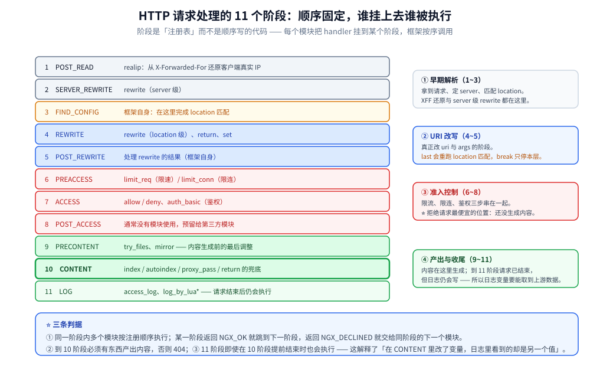
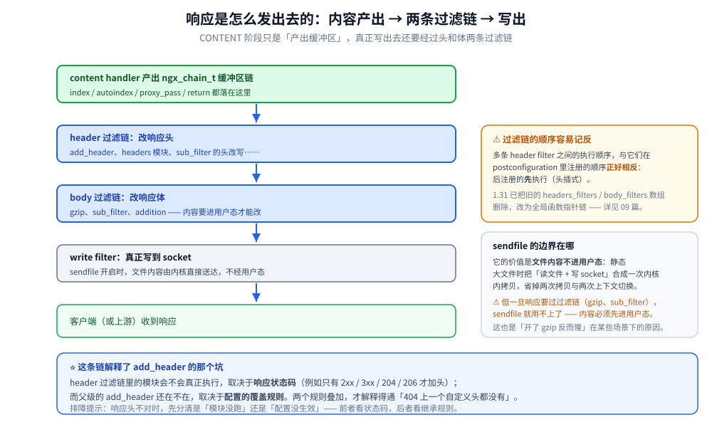

# HTTP框架执行流程

> HTTP 框架的初始化、请求的异步读取与解析、11 个处理阶段、响应的生成与发送，
> 以及 Early Hints（103）在框架中的位置。
>
> 素材来源：《深入理解Nginx（第2版）》第10章「HTTP 框架的初始化」与第11章
> 「HTTP 框架的执行流程」的读后整理，**按主题归纳而非逐字摘录**；实测口径见本目录
> [README.md](README.md) 第四节，容器为 `nginx:mainline-alpine`（**1.31.6**）。

---

## 一、框架初始化

**本节要点**：初始化分三段 —— 模块按序 `init_module`、配置解析与合并、监听端口建立。

| 阶段 | 做什么 | 关键点 |
|---|---|---|
| `init_module` | 每个模块创建自己的主配置结构体 | 顺序由 `ngx_modules.c` 数组决定；HTTP 核心模块要先于其子模块 |
| 配置解析 | 按 `ngx_command_t` 表把指令写进 `main_conf` / `srv_conf` / `loc_conf` | ⚠️ 三级配置**不是同一块内存**，取值时要按当前 `server` / `location` 去合并 |
| 配置合并 | 把父级配置填进子级未设置的位置 | ⚠️ 合并只对「未显式设置」的项生效，所以会出现「子级一写就把父级整体覆盖」的情况（见第五节） |
| 监听建立 | master 创建 listen socket 并传给 worker | worker 通过 channel 拿到 fd，不自己 bind |

⭐ 一个直接的推论：**worker 不读配置文件**（见 [02-进程模型与基础架构.md](02-进程模型与基础架构.md)）
—— 配置在 master 里解析、合并完成后才分发下去。所以「改坏配置文件」不会影响在跑的 worker，
回滚只需改回文件再 `HUP`。

## 二、请求处理流程

**本节要点**：请求行、请求头、请求体是**分阶段异步读取**的，中间会让出事件循环。

```text
TCP 连接可读
   -> 读请求行       （不完整则挂回事件循环，等下次可读）
   -> 读请求头       （同上；超过 client_header_buffer_size 会申请大 header 缓冲）
   -> 匹配 server / location
   -> 读请求体       （可能落临时文件；client_body_early_read 可提前到匹配之前）
   -> 依次执行 11 个阶段
   -> 生成响应 -> 发送响应头 -> 发送响应体
```

⭐ 三个容易忽略的点：

1. **「一个请求」不等于「一次事件回调」**：请求行没读全就返回事件循环，
   所以 nginx 的 worker 不会被慢客户端占住；
2. **header 超大是单独的错误路径**（`client_header_buffer_size` / `large_client_header_buffers`），
   报的是 400/414，不会进入 11 个阶段；
3. **请求体默认在 content 阶段才被消费**；1.31.5 的 `client_body_early_read` 允许把它提前到
   **location 匹配之前** —— 这是「按 body 路由」的前提（见 01 篇 7.4）。

## 三、11 个处理阶段

**本节要点**：阶段是**注册表**而不是顺序代码 ——
每个模块把自己的 handler 挂到某个阶段上，框架按阶段顺序调用。

| 顺序 | 阶段 | 典型模块 |
|---|---|---|
| 1 | `POST_READ` | `realip`（从 `X-Forwarded-For` 还原客户端 IP） |
| 2 | `SERVER_REWRITE` | `rewrite`（server 级） |
| 3 | `FIND_CONFIG` | 框架自身：完成 location 匹配 |
| 4 | `REWRITE` | `rewrite`（location 级）、`return`、`set` |
| 5 | `POST_REWRITE` | 处理 rewrite 的结果 |
| 6 | `PREACCESS` | `limit_req` / `limit_conn` |
| 7 | `ACCESS` | `allow` / `deny` / `auth_basic` |
| 8 | `POST_ACCESS` | — |
| 9 | `PRECONTENT` | `try_files`、`mirror` |
| 10 | `CONTENT` | `index` / `autoindex` / `proxy_pass` / `return` 的兜底 |
| 11 | `LOG` | `access_log`、`log_by_lua*` |



### 3.1 用 `rewrite_log on` 把阶段「看」出来（实测）

配置：

```nginx
server {
    listen 8094;
    rewrite_log on;                          # 输出到 error_log（notice 级）
    location /stage {
        rewrite ^/stage/a$ /stage/b last;    # last：重跑 location 匹配
        rewrite ^/stage/b$ /stage/c break;   # break：停止本 location 后续 rewrite 指令
        return 200 "stage-done uri=$uri\n";
    }
}
```

实测日志（请求 `GET /stage/a`，逐条来自 `error_log`）：

```text
[notice] "^/stage/a$" matches "/stage/a"
[notice] rewritten data: "/stage/b", args: ""
[notice] "^/stage/a$" does not match "/stage/b"        <- last 之后，rewrite 链从头再跑一遍
[notice] "^/stage/b$" matches "/stage/b"
[notice] rewritten data: "/stage/c", args: ""
[error]  open() "/etc/nginx/html/stage/c" failed (2: No such file or directory)
```

实际返回 **`HTTP/1.1 404`**。

⭐ 从这 6 行能读出三件事：

1. **`last` 会让 location 匹配重做、rewrite 指令链从头执行**（日志里 `^/stage/a$` 跑了两遍）；
2. ⭐ **`break` 跳过了同一 location 里写在它后面的 `return`** —— 所以请求没被 `return` 短路，
   而是落到了 CONTENT 阶段的静态文件处理器，找不到文件才 404。
   这是 `break` 与 `last` 最容易踩混的地方：`break` 切断的是
   **同一 location 内后续的 rewrite 阶段指令**（含 `return` / `set` / `if`），
   不只是「停止重写 URL」；
3. access_log 里记的是 `$request_uri`（仍是 `/stage/a`），而真正被处理的 URI 已经是
   `/stage/c` —— 排障时要分清「原始请求行」与「改写后的 URI」。

### 3.2 阶段的另一条实测线索：`error_page`

`error_page` 依赖「某个阶段返回了错误码」才会触发，所以它天然是一个阶段观察器：
如果 `return 500` 写在 rewrite 阶段，`error_page 500` 随即在框架层接管；
而 ACCESS 阶段被 `deny` 挡下的请求（403）走的是另一条分支。
⭐ 实践含义：**在哪个阶段出错，决定了 `error_page` 能不能接住、以及 `add_header` 有没有生效**
（后者见第四节）。

## 四、响应的生成与发送

**本节要点**：响应头由**过滤模块链**改写，而过滤模块是否生效与**状态码**有关 ——
这正是 `add_header` 那个坑的来源。

### 4.1 发送路径

```text
content handler 产出 ngx_chain_t 缓冲区链
   -> header 过滤链（add_header / sub_filter 等改头）
   -> body 过滤链（gzip / sub_filter / addition 等改体）
   -> write filter 写出去（sendfile 时文件内容零拷贝直达 socket）
```

⭐ `sendfile` 的价值在于**文件内容不进用户态**：静态大文件时它把「读文件 + 写 socket」
合成一次内核内拷贝。⚠️ 但一旦响应需要被过滤（gzip、`sub_filter`），
`sendfile` 就用不上了 —— 因为内容必须先进用户态。

### 4.2 `add_header` 与状态码的关系（实测）

配置与两组响应头实测结果（完整对照见
[01-编译安装与配置.md](01-编译安装与配置.md) 3.3）：

| 请求 | 返回的头 | 原因 |
|---|---|---|
| `/both`（server 与 location 都写了 `add_header ... always`） | **只有 location 那个** | 子级出现 `add_header` 时**父级的全部被丢弃**，不合并 |
| `/loc-noalways-200`（没写 `always`，状态 200） | 有 | 默认只对 2xx / 3xx / 204 / 206 生效 |
| `/loc-noalways-404`（没写 `always`，状态 404） | **一个都没有** | 不在上述状态码集合里，且子级覆盖导致父级的也没了 |

⭐ 这条串起了「配置继承」与「响应发送」两件事：
**过滤模块参与与否取决于状态码，而配置的覆盖规则决定了父级的头还在不在。**
两个规则叠加才解释得通上面的表。



## 五、Early Hints（103）在框架中的位置

**本节要点**：103 是**多一个响应段**，不是普通响应头；nginx 的职责是把上游的 103 透传出去。

```nginx
location / {
    early_hints on;
    proxy_pass http://eh_be;
}
```

上游（裸 socket 手写 103）→ 客户端实测收到的原始响应：

```text
HTTP/1.1 103 Early Hints
Link: </style.css>; rel=preload; as=style

HTTP/1.1 200 OK
Server: nginx/1.31.6
...
final-body
```

⭐ 机制上的位置：103 属于**响应头阶段之前的一个额外响应**，所以它：

- 必须由**上游发出**（`early_hints on` 只是允许透传，不生成内容）；
- 不影响 11 个阶段的顺序 —— 它是在「已确定要转发、但最终响应还没到」的窗口里
  提前写出去的一段；
- 用在「首字节很慢但静态资源依赖已知」的场景（如后端要查库才渲染 HTML，
  但 CSS/JS 是固定的）。

⚠️ 客户端必须支持；`curl -i` 能看到是因为它会把中间响应打出来，浏览器侧要看
DevTools 的 Early Hints 支持情况。

## 使用

### 1) 打开阶段日志

```bash
# 配置：error_log /var/log/nginx/error.log info;  以及 location 内 rewrite_log on;
docker exec nl-main sh -c "printf 'GET /stage/a HTTP/1.1\r\nHost: r.example.com\r\nConnection: close\r\n\r\n' | nc -w 3 127.0.0.1 8094"
docker logs nl-main 2>&1 | grep -iE "rewrite|matches" | tail -10
```

### 2) 确认某个头到底发出去没有

```bash
curl -si -H 'Host: a.example.com' http://127.0.0.1:8095/both | sed -n '1p;/^[Xx]-/p'
curl -si -H 'Host: a.example.com' http://127.0.0.1:8095/loc-noalways-404 | sed -n '1p;/^[Xx]-/p'
```

### 3) 定位「响应不对」时的阶段归因

```text
404 / 403 / 500 出现在哪个阶段？
  rewrite 阶段的 return        -> 由框架接管，error_page 可以接住
  ACCESS 阶段的 deny           -> 403，error_page 403 可接住
  CONTENT 阶段找不到文件       -> 静态 404（如第三节那个例子）
头没发出去
  add_header 写了但状态码非 2xx/3xx/204/206 且没 always   -> 见 4.2
  子级写了 add_header 把父级挤掉                            -> 见 4.2
响应大文件时 CPU 高
  是不是 gzip / sub_filter 参与了，导致 sendfile 失效       -> 见 4.1
```

## 延伸追问

### 1. 11 个阶段中哪些可以返回错误？

理论上任何阶段的 handler 都可以返回错误码，但**语义上**分三类：
① 路由类（`FIND_CONFIG` / `REWRITE`）出错 = 路由失败；
② 准入类（`PREACCESS` / `ACCESS`）出错 = 被拒绝（限流 503、鉴权 403）；
③ 内容类（`CONTENT`）出错 = 资源问题（404 / 500）。
⭐ 记住这条的用处：**看到状态码就能大致反推卡在哪个阶段**，
不用开日志就能缩小范围。

### 2. `rewrite` 在哪个阶段执行？

两处：`SERVER_REWRITE`（server 块里的）与 `REWRITE`（location 块里的）。
⭐ 这解释了一个常见困惑：**server 级 rewrite 会在 location 匹配之前执行**，
所以它可以改变「匹配哪个 location」；而 location 级 rewrite 的 `last` 会再触发一次匹配
（第三节实测里日志中 `^/stage/a$` 跑两遍就是这个机制）。

### 3. `break` 与 `last` 到底该怎么选？

- 只想**改写 URI 后就地处理**（不再换 location）→ `break`。
  ⚠️ 但要记住它会跳过同 location 后续的 rewrite 指令（本机的 404 实测就是后果）；
- 想**改写 URI 后重新匹配 location** → `last`。
⭐ 实践建议：**`break` 后面不要再写 `return` / `set`**，否则它们会被静默跳过；
需要「改写 + 直接返回」时，用 `last` 或把 `return` 移到 `break` 之前。

### 4. Early Hints 适合什么场景？

适合「**最终响应慢、但它的静态依赖提前已知**」：后端要查库才渲染 HTML（几百毫秒），
而页面引用的 CSS/JS 是固定的 —— 此时把 `Link: rel=preload` 提前发出去，
浏览器可以并行下载，省掉「等 HTML → 再下 CSS」的串行时间。
⚠️ 不适合：响应本来就快（多一段 103 反而增加往返）、或者依赖不确定（发错了白下载）。
另外它是**上游驱动的**，nginx 只是透传，所以**上游不发就完全没效果**。

## 关联

- [README.md](README.md) — 版本坐标与实测口径
- [01-编译安装与配置.md](01-编译安装与配置.md) — `add_header` 继承实测、Early Hints 与 predicate location 配置
- [02-进程模型与基础架构.md](02-进程模型与基础架构.md) — 为什么 worker 不读配置
- [03-事件驱动与epoll.md](03-事件驱动与epoll.md) — 请求读取为什么是异步的
- [OpenResty.md](../../../03-数据与中间件/中间件/网关与代理/OpenResty.md) — 11 个阶段与 Lua 阶段的对应关系及本机实测
- [反向代理原理与实现.md](../../网络/反向代理原理与实现.md) — 代理侧的头部治理
> 反向引用（本篇被下列文档引到）：[05-内存管理与数据结构.md](05-内存管理与数据结构.md)、[07-配置解析与请求上下文.md](07-配置解析与请求上下文.md)、[08-upstream与子请求.md](08-upstream与子请求.md)、[09-HTTP过滤模块.md](09-HTTP过滤模块.md)、[11-HTTP3与QUIC支持.md](11-HTTP3与QUIC支持.md)
