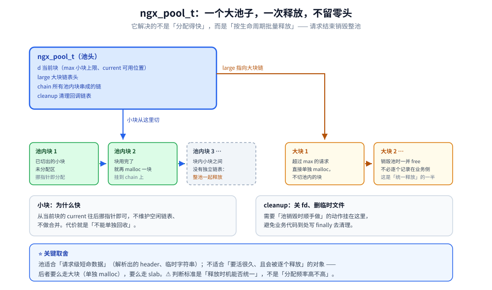
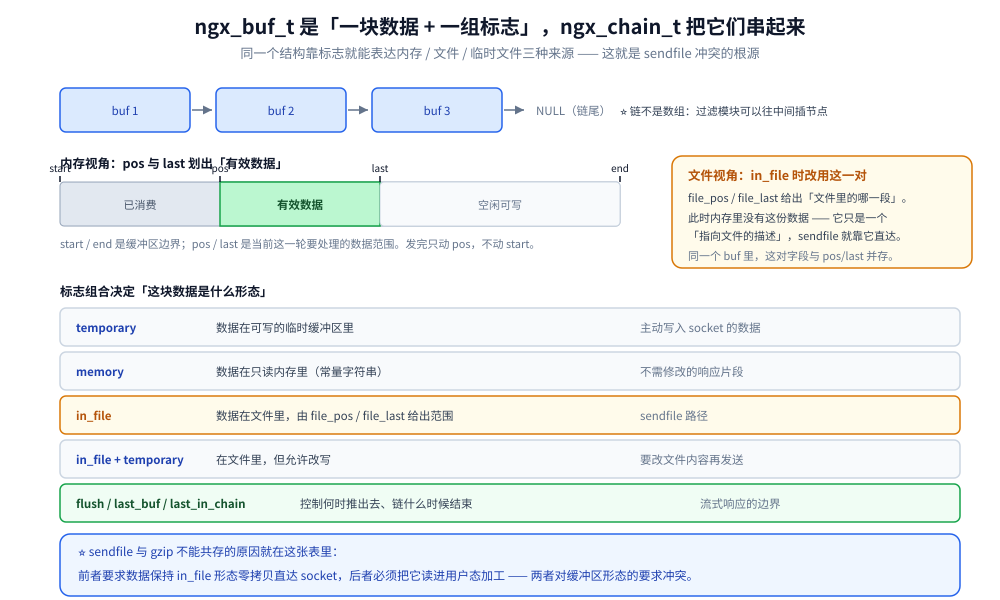

# 内存管理与数据结构

> 内存池 `ngx_pool_t`、slab 共享内存、缓冲区与缓冲区链 `ngx_buf_t` / `ngx_chain_t`，
> 以及数组 / 链表 / 队列 / 哈希 / 红黑树这几件容器，附进程与连接的实测内存开销。
>
> 素材来源：《深入理解Nginx（第2版）》第7章「Nginx 提供的高级数据结构」与第16章
> 「内存池」的读后整理，**按主题归纳而非逐字摘录**；实测口径见本目录
> [README.md](README.md) 第四节，容器为 `nginx:mainline-alpine`（**1.31.6**）。
>
> ⚠️ 本篇讲的是 **nginx 自己实现的分配器**；操作系统的 Buddy / Slab、
> 分页与 `free` 的正确读法见 [内存管理.md](../内存管理.md) —— 两者名字像，设计目标不同。
> 两者的差别正是第二节的重点。

---

## 一、内存池 `ngx_pool_t`

**本节要点**：池子解决的不是「分配得快」，而是「**按生命周期批量释放**」——
一次 `free` 掉整棵池，把「谁释放、什么时候释放」从业务代码里拿掉。

### 1.1 设计目标

| 目标 | 做法 |
|---|---|
| 小块内存快 | 从池的当前块里「挪指针」分配，不做链表维护 |
| 统一释放 | 池本身是一个生命周期对象；请求结束就销毁整池，**池内小块不单独释放** |
| 大小分治 | 小块从池内切；**大块单独 `malloc` 并挂到池的大块链表**，销毁池时一并 free |
| 可挂清理回调 | `ngx_pool_cleanup_t`，用于「池销毁时要顺手做的事」（如关闭 fd、删除临时文件） |

⭐ 关键取舍：**池里的内存不能单独回收**。所以「池」适合**请求级**的短命数据
（解析出来的 header、临时字符串），不适合「要活很久、且会被逐个释放」的对象 ——
后者要么用大块（单独 malloc），要么用 slab。



### 1.2 与操作系统 slab 的关系

| | OS 的 slab（Buddy 之上） | nginx 的 `ngx_slab` |
|---|---|---|
| 服务对象 | 内核对象缓存（`task_struct` 等） | **多 worker 共享的一块固定内存区** |
| 目标 | 减少伙伴系统的碎片与初始化成本 | 让多个进程安全地在**同一段内存**里分配不定长小块 |
| 谁在用 | 内核自己 | `limit_req_zone` / `limit_conn_zone` / `proxy_cache_path` 的 `keys_zone` |

⚠️ 名字相同、层次完全不同：一个是内核给对象用的缓存，一个是应用自己实现的共享内存分配器。

## 二、slab 共享内存

**本节要点**：slab 的分配器把「线程/进程安全」的成本前置到了区域的划分上，
所以它有一个**硬性的最小尺寸**，小到一定程度连元数据都放不下。

### 2.1 为什么需要它

多 worker 要共享计数（限流）或索引（缓存 key）。共享内存解决了「同一段物理内存」，
但**分配**仍需一个跨进程安全的分配器：

- 每个 slab 页（默认 4 KB）内部按固定大小切成槽位，页与页用空闲链表串起来；
- 分配时按 sizes 数组找到合适的页类型，**同一页内不做碎片整理**；
- ⚠️ **一页只能属于一个 zone**，所以 zone 太小就会「有空间但放不下元数据」。

### 2.2 实测：`keys_zone` 的最小可用尺寸 ⭐

用同一个 `proxy_cache_path` 只改 `keys_zone` 大小，逐个跑 `nginx -t`
（`nginx:mainline-alpine`，1.31.6）：

| `keys_zone` 大小 | `nginx -t` 结果 |
|---|---|
| `4k` | ❌ `[emerg] keys zone "keys_zone=z:4k" is too small` |
| `8k` | ❌ **`[crit] ngx_slab_alloc() failed: no memory`** |
| `10k` | ❌ 同上 |
| `12k` | ✅ 通过 |
| `16k` / `20k` / `24k` / `32k` / `64k` | ✅ 通过 |

⭐ 这张表有两处值得记住：

1. **两个失败档位性质不同**：`4k` 是**配置校验阶段就拒绝**（`[emerg]`）；
   `8k` / `10k` 是**语法通过、初始化时才失败**（`[crit]`）。
   这正是 [01-编译安装与配置.md](01-编译安装与配置.md) 第二节那句
   「语法 ok 但 `-t` 失败」的本来面目：**`nginx -t` 会真的初始化共享内存**；
2. **本机最小可用值是 12k**（不是 4k 也不是 8k）。⚠️ 这个数字依赖 slab 页大小与
   内部元数据开销，**换平台的绝对值会变，但「存在一个最小尺寸、且比直觉大」这条不会变**。

### 2.3 实测：`keys_zone` 能装多少条 ⭐

配置要点（三个都写对才有意义）：

```nginx
proxy_cache_path /tmp/nl_cache keys_zone=nl_cache:64k max_size=20m inactive=1h;
...
proxy_cache nl_cache;
proxy_cache_valid 200 10m;      # ⚠️ 不写这行默认不缓存，X-Cache 永远 MISS
```

灌入 800 条不同 URL 后回访：

| 回访的 key | `X-Cache` |
|---|---|
| `item/1`、`item/50`、`item/100`、`item/200`、`item/300` | **MISS**（已被挤掉） |
| `item/400`、`item/500`、`item/600`、`item/650`、`item/700`、`item/750`、`item/800` | **HIT** |

缓存目录里实际保留下来的文件数：**447**。

⭐ 三条结论：

1. **64 KiB 的 keys zone 大约只能容纳 400 多条**（实测 447），换算约 **146 字节/条**
   —— 包含 key 字符串、slab 页内元数据与链表指针；
2. **淘汰是「最老的先走」**：1~300 被挤掉而 400 以后留着，说明是 LRU 式回收；
3. ⚠️ **zone 满时不会报任何错**（日志里没有 slab 相关记录）——
   表现只是「缓存命中率莫名上不去」。这条比那个数字重要得多。

⚠️ **实验设计上的一个坑（本机踩过）**：第一次做这个实验时 `inactive=1m`，
而灌 800 条 URL 本身要花约 60 秒 —— 于是最早那批是被**时间**淘汰的，
不是被**容量**淘汰的，结论会完全错。**测容量必须先把时间因素排除**（改成 `inactive=1h`）。

## 三、缓冲区与链表 `ngx_buf_t` / `ngx_chain_t`

**本节要点**：`ngx_buf_t` 是「一块数据 + 一组标志」，`ngx_chain_t` 把它们串成链；
**同一个 `ngx_buf_t` 靠标志就能表达内存、文件、临时文件三种来源**。

| 标志 | 含义 | 用在哪 |
|---|---|---|
| `temporary` | 数据在可写的临时缓冲区里 | 主动写入 socket 的数据 |
| `memory` | 数据在**只读**内存里（如常量字符串） | 不修改的响应片段 |
| `in_file` | 数据在**文件**里，`file_pos` / `file_last` 给出范围 | `sendfile` 路径 |
| `in_file` + `temporary` | 在文件里，但**允许改写** | 需要修改文件内容再发送 |
| `flush` / `last_buf` / `last_in_chain` | 控制何时推出去、链结束 | 流式响应的边界 |

⭐ 两个高频问题的答案都在这张表里：

- **「为什么 `sendfile` 不能和 gzip 一起用」**：`sendfile` 要求数据以 `in_file` 形态
  零拷贝直达 socket；而 gzip 必须**读进用户态**加工，双方对缓冲区的形态要求冲突；
- **「大响应会不会全进内存」**：不会 —— 上游内容超出 `proxy_buffers` 时落到
  `proxy_temp_path`，缓冲区只是「指向临时文件的一段」（`in_file`），
  ⚠️ 所以 `proxy_temp_path` 所在磁盘打满会导致大响应失败，且报错位置往往看不出是磁盘问题。

⚠️ `ngx_chain_t` 是**链**不是数组：模块可以往链中间插节点（过滤模块就这么干），
但**插进来的节点必须由插入者管理生命周期**——这是过滤模块内存管理最容易出错的地方
（见本目录第二部分「HTTP 过滤模块」一篇）。



## 四、容器类数据结构

| 结构 | 特点 | 用途 |
|---|---|---|
| `ngx_array_t` | 动态数组，满了**翻倍扩容**（有 `pool` 归属） | 配置解析时收集指令、模块列表 |
| `ngx_list_t` | 元素本身是「小数组」的链表，**分配时一次给一批** | 请求头（header 数量不确定） |
| `ngx_queue_t` | 侵入式双向链表：把 `ngx_queue_t` 塞进业务结构体即可 | 空闲链表、LRU |
| `ngx_hash_t` | **静态**散列表：建好后不可增删 | 一次性建好的映射，如虚拟主机的精确名 |
| `ngx_rbtree_t` | 红黑树，带插入回调 | 定时器树、`ip_hash` 的节点环 |
| `ngx_radix_tree_t` | 基数树，前缀匹配 | CIDR 段匹配（`geo`、`deny 10.0.0.0/8`） |

⭐ 两点设计意图值得记：

1. **`ngx_hash_t` 是静态的**：因为「配置解析一次、运行期只读」的假设让它可以
   预先算好容量、避免任何锁与扩容开销；
2. **`ngx_queue_t` 是侵入式的**：不额外分配节点、没有指针间接层，
   代价是**一个节点只能同时属于一个链表**——这也解释了为什么 LRU 要自己维护链表而不能
   直接复用某个通用容器。

## 五、进程与连接的实测内存

**本节要点**：容量规划的起点是「一个空闲 worker 要多少」，终点是「连接数上线后的增量」。

### 5.1 空闲基线（1.31.6，`worker_processes 4`）

```text
master process            RSS 7252 KB
worker process  × 4       RSS 3708 KB  (每个)
cache manager process     RSS 3540 KB
```

⭐ 用途：`worker_processes` 从 4 调到 16，**光空闲开销就多 12 × 3.7 MB ≈ 44 MB**，
还没算共享内存与连接。在内存受限的容器里，先算这个再谈「按核数开」。

### 5.2 连接的内存增量

用 8 条「连上但不发请求」的半开连接占住 worker 后：

| 观测 | 值 |
|---|---|
| 某个 worker 的 RSS | 3708 KB → **3892 KB**（+184 KB） |
| 换算每条连接 | 约 **23 KB** |

⚠️ 这是**单个 worker + 8 条连接**的粗测（样本小、有噪声），量级参考可以，
不要当成精确常数。连接的内存主要花在读写的临时缓冲区上，所以**真正吃内存的是在传数据的连接**，
空转的长连接成本低得多。

### 5.3 顺带的连接状态读数

同一时刻的 `stub_status`：

```text
Active connections: 9
server accepts handled requests
 290 290 281
Reading: 0 Writing: 1 Waiting: 8
```

⭐ `Active = Reading + Writing + Waiting`；8 条半开连接全落在 **`Waiting`**
（已建立、无请求可读）。⚠️ 所以 `Waiting` 高不等于有问题 —— 长连接与 keep-alive 池
正常就会有；要看的是它**单调上涨且不回落**。

## 使用

### 1) 探测某块共享内存的最小可用尺寸

```bash
# 只改 keys_zone 大小，逐个跑 nginx -t，看 [emerg] 还是 [crit]
for s in 4k 8k 10k 12k 16k 32k; do
  sed "s/keys_zone=z:[0-9]*k/keys_zone=z:$s/" conf/slab/nginx.conf > /tmp/t.conf
  printf '%-5s ' "$s"
  docker run --rm -v /tmp/t.conf:/etc/nginx/nginx.conf:ro nginx:mainline-alpine nginx -t 2>&1 \
    | grep -oE "too small|no memory|test is successful" | head -1
done
```

### 2) 测 keys zone 的容量上限（务必排除时间因素）

```bash
# proxy_cache_path ... keys_zone=nl_cache:64k inactive=1h;
# location 内：proxy_cache nl_cache; proxy_cache_valid 200 10m; add_header X-Cache $upstream_cache_status;
i=0; while [ $i -lt 800 ]; do i=$((i+1)); curl -s -o /dev/null "http://127.0.0.1:8097/item/$i"; done
for k in 1 100 300 400 800; do
  printf 'item/%-4s ' "$k"
  curl -s -D - -o /dev/null "http://127.0.0.1:8097/item/$k" | sed -n 's/^[Xx]-[Cc]ache: //p'
done
docker exec nl-main sh -c 'ls /tmp/nl_cache | wc -l'     # 实际留下的条目数
```

### 3) 看内存构成

```bash
docker exec nl-main ps -o pid,ppid,rss,args | grep "[n]ginx:"
docker exec nl-main curl -s http://127.0.0.1:8090/status
```

### 4) 三个「配了但没生效」的自查

```text
限流值看起来是配置的 N 倍          -> 共享内存没生效，每 worker 各存一份（见 02 篇第五节）
缓存命中率上不去且日志干净         -> keys zone 满，静默 LRU 淘汰（2.3）
大响应偶尔 500 且日志无共同点      -> proxy_temp_path 所在磁盘满（第三节）
```

## 延伸追问

### 1. 内存池为什么能提高性能？

三点：① **分配几乎只是挪指针**，不做链表查找与合并；② **不需要为每个小块记账**，
所以没有每块的头部开销；③ **释放是常数时间**（销毁整池）。
⭐ 但要看清代价：**池内小块无法单独回收**，所以「申请了再释放、再申请」这种模式在池上
会持续膨胀。判断标准是**生命周期是否一致**：请求级的临时数据非常适合池，
而「活过多个请求、且会被逐个删掉」的对象应该用 slab 或大块单独管理。

### 2. slab 和内存池有什么区别？

| | 内存池 | slab |
|---|---|---|
| 作用域 | **单个**进程内的一个生命周期（如一次请求） | **多个** worker 共享的固定内存区 |
| 能否单独释放 | 基本不能（要么整池销毁，要么大块单独 free） | **可以**，且能回收再分配 |
| 释放粒度 | 整池 | 单个槽位（页内） |
| 典型用途 | 请求级临时数据 | 限流计数、缓存 key 索引、连接统计 |
⭐ 一句话：**池管「一次性的」，slab 管「长期共享且会反复增删的」。**
用错方向的后果很具体：把限流计数放进池 → 每个请求一份、统计全废；
把请求级临时字符串放进 slab → 手工释放漏一处就是内存泄漏。

### 3. `ngx_buf_t` 的 `in_file` 标志在什么场景下使用？

三类：① **`sendfile`**：静态文件零拷贝发出（此时必须是纯 `in_file`）；
② **响应落到临时文件**：上游内容超过 `proxy_buffers` 时写进 `proxy_temp_path`，
后续读取时用 `in_file` 指向文件区间；③ **`in_file|temporary`**：内容在文件里但**允许改写**
（如过滤模块要改文件内容再发）。
⭐ 实践含义：**看到 `in_file` 就意味着「这块数据要先读磁盘」**，
所以「响应体很大且 `sendfile` 用不上」时，瓶颈会从网络转到磁盘 ——
这也是为什么静态大文件要避免叠加 gzip / `sub_filter`（见
[04-HTTP框架执行流程.md](04-HTTP框架执行流程.md) 4.1）。

### 4. 为什么定时器用红黑树而不是堆？

两者都能 O(log n) 取出最小值；红黑树的优势是**删除任意节点也是 O(log n) 且常数小、实现成熟**
—— 而 nginx 恰好需要「任意删除」（连接关闭、超时重置都要删定时器）。
⚠️ 顺带一条：红黑树节点是**侵入式**的（`ngx_rbtree_node_t` 内嵌在 `ngx_event_t` 里），
所以「删一个事件」不需要额外查表。这与 [03-事件驱动与epoll.md](03-事件驱动与epoll.md)
第三节那棵 `ngx_event_timer_rbtree` 是同一件事。

## 关联

- [README.md](README.md) — 版本坐标与实测口径
- [内存管理.md](../内存管理.md) — 操作系统侧的 Buddy / Slab、分页与 `free` 的读法（对照阅读）
- [01-编译安装与配置.md](01-编译安装与配置.md) — 「语法 ok 但 `nginx -t` 失败」的成因
- [02-进程模型与基础架构.md](02-进程模型与基础架构.md) — 共享内存为什么是跨 worker 状态的唯一载体
- [03-事件驱动与epoll.md](03-事件驱动与epoll.md) — 定时器红黑树与连接池
- [04-HTTP框架执行流程.md](04-HTTP框架执行流程.md) — 缓冲区链在响应发送中的走向
- [基数与频率估计.md](../../数据结构/高级数据结构/基数与频率估计.md) — 计数类共享结构的另一条思路（近似算法）
> 反向引用（本篇被下列文档引到）：[06-HTTP模块开发入门.md](06-HTTP模块开发入门.md)、[09-HTTP过滤模块.md](09-HTTP过滤模块.md)、[16-模块开发实战.md](16-模块开发实战.md)
