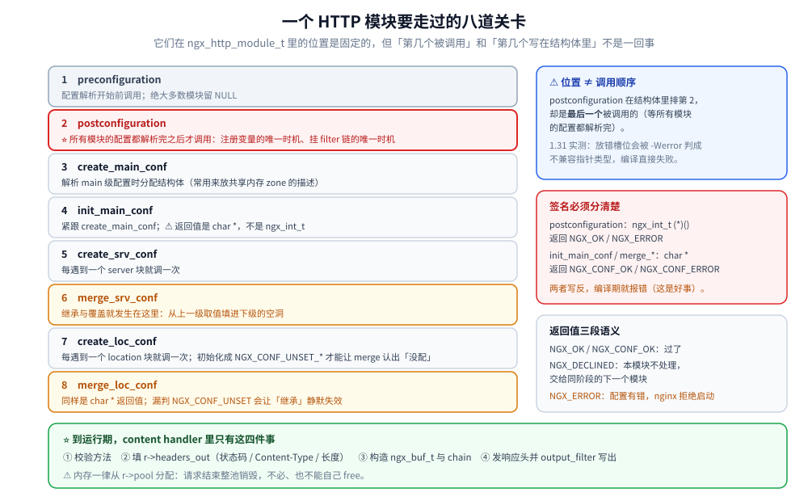
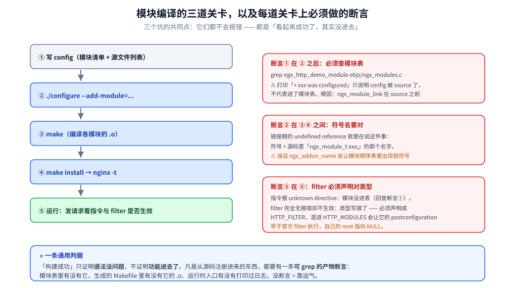

# HTTP模块开发入门

> 一个 HTTP 模块最少需要什么、`config` 文件怎么写、怎么把定制模块编译进 nginx，
> 以及 content handler 的完整链路。
>
> 素材来源：《深入理解Nginx（第2版）》第 3 章与第 4 章「error 日志」部分的读后整理，
> **按主题归纳而非逐字摘录**；与 1.31 实测不一致的地方已按源码订正并标注。
> 实测口径见本目录 [README.md](README.md) 第四节；本模块读数取自本机 Docker
> `nginx-dev:1.31.6`（自建镜像，`gcc 14.2.0 (Alpine)` + nginx **1.31.6** 源码）。

---

## 一、一个 HTTP 模块最少需要什么？

**本节要点**：最小可编译的模块 = **一个 `ngx_module_t` 变量** + **一张指令表** + **一个 `ngx_http_module_t` 上下文**。
三者缺一，模块要么编译不过，要么被编译进来却不参与任何处理。

### 1.1 三个必需件与它们的职责

| 件 | 类型 | 作用 | 缺了会怎样 |
|---|---|---|---|
| 模块定义 | `ngx_module_t` | 模块的身份与生命周期回调 | 链接期 `undefined reference`（模块表引用的符号不存在） |
| 指令表 | `ngx_command_t[]` | 声明本模块认识的配置指令 | 配置里写指令报 `unknown directive` |
| 模块上下文 | `ngx_http_module_t` | 8 个钩子：配置创建/合并/初始化 | 配置无法被存储与继承 |

⭐ **`ngx_module_t` 的字段顺序是位置敏感的协议**，官方用 `NGX_MODULE_V1` 宏填前 8 项、`NGX_MODULE_V1_PADDING` 填末尾预留位，**中间的 11 项必须逐个写全**（哪怕全是 `NULL`）：

```c
ngx_module_t  ngx_http_demo_module = {
    NGX_MODULE_V1,            /* 版本魔数等 8 项，宏展开 */
    &ngx_http_demo_module_ctx, /* ctx：模块上下文 */
    ngx_http_demo_commands,    /* commands：指令表 */
    NGX_HTTP_MODULE,           /* type：挂在 HTTP 层（另有 CORE / EVENT / MAIL / STREAM） */
    NULL,                      /* init master */
    NULL,                      /* init module */
    NULL,                      /* init process */
    NULL,                      /* init thread */
    NULL,                      /* exit thread */
    NULL,                      /* exit process */
    NULL,                      /* exit master */
    NGX_MODULE_V1_PADDING      /* 预留位，不要动 */
};
```

### 1.2 指令表：六个字段，参数个数拼在 `type` 里

⭐ **这是与书里差异最大的一处**。书（对应 1.9~1.17）里 `ngx_command_t` 是七个字段、`NGX_CONF_TAKE1` 单独占一个位置；**1.31 实测只有六个字段**（`src/core/ngx_conf_file.h`）：

```c
struct ngx_command_s {
    ngx_str_t             name;   /* 指令名 */
    ngx_uint_t            type;   /* ⭐ 允许出现在哪写 + 参数个数，用位或拼起来 */
    char               *(*set)(ngx_conf_t *cf, ngx_command_t *cmd, void *conf);
    ngx_uint_t            conf;   /* 存到哪个配置数组 */
    ngx_uint_t            offset; /* 存到结构体里的哪个成员 */
    void                 *post;
};
```

按书里的七字段写法会直接编译失败：

```text
/work/mod/ngx_http_confctx_module.c:47:7: error: initialization of 'long unsigned int'
  from 'char * (*)(ngx_conf_t *, ngx_command_t *, void *)' makes integer from pointer
  without a cast [-Wint-conversion]
/work/mod/ngx_http_confctx_module.c:50:7: error: excess elements in struct initializer
```

⭐ 那"参数个数"在哪？**拼进 `type`**：

| 常量 | 值 | 含义 |
|---|---|---|
| `NGX_CONF_NOARGS` | `0x00000001` | 不带参数（`demo;`） |
| `NGX_CONF_TAKE1` | `0x00000002` | 带 1 个参数（`filterdemo on;`） |
| `NGX_CONF_TAKE12` | `TAKE1\|TAKE2` | 1 个或 2 个 |
| `NGX_CONF_ARGS_NUMBER` | `0x000000ff` | 参数个数的掩码（低 8 位） |
| `NGX_CONF_BLOCK` | `0x00000100` | 允许带块 |
| `NGX_CONF_FLAG` | `0x00000200` | on/off 型 |
| `NGX_CONF_ANY` | `0x00000400` | 任意 |

**正确写法**（本模块实测通过）：

```c
static ngx_command_t  ngx_http_demo_commands[] = {

    { ngx_string("demo"),
      NGX_HTTP_LOC_CONF|NGX_CONF_NOARGS,   /* ⭐ 层级与参数个数一起 OR */
      ngx_http_demo_set_handler,
      0,                                    /* conf / offset 由 set 函数自己决定 */
      0,
      NULL },

      ngx_null_command                      /* ⭐ 官方哨兵宏，别手写 */
};
```

⭐ 哨兵必须用 `ngx_null_command`（展开为 `{ ngx_null_string, 0, NULL, 0, 0, NULL }`）；
手写 `{ ngx_null_string, 0, NULL, 0, 0, NULL, NULL }`（多一个 `NULL`）同样报
`excess elements in struct initializer`。

### 1.3 content handler 的注册入口只有一个

⭐ 常见误解是「模块上下文里有个 handler 槽位」。**没有**。content handler 只能通过**指令的 `set` 函数**挂到 core 模块的 location 配置上：

```c
static char *
ngx_http_demo_set_handler(ngx_conf_t *cf, ngx_command_t *cmd, void *conf)
{
    ngx_http_core_loc_conf_t  *clcf;

    /* ⭐ 取的是 core 模块的 loc_conf —— 不是本模块的 */
    clcf = ngx_http_conf_get_module_loc_conf(cf, ngx_http_core_module);
    clcf->handler = ngx_http_demo_handler;

    return NGX_CONF_OK;
}
```

官方最简范例是 `ngx_http_empty_gif_module.c`（全文不到 100 行），照它抄不会错。



## 二、handler 里到底要写哪几步？

**本节要点**：填响应头 → 引用计数 +1 → 从 request pool 取 buf → 先发头再发体。
**顺序错了不会报错，只会得到空响应或段错误。**

### 2.1 四步链路

```c
static ngx_int_t
ngx_http_demo_handler(ngx_http_request_t *r)
{
    static const char  hello[] = "hello from demo module\n";
    size_t             len = sizeof(hello) - 1;
    ngx_buf_t         *b;
    ngx_chain_t        out;
    /* ⭐ ngx_string() 是**初始化列表**（{ len, data }），只能出现在声明处；
     *   写成赋值语句会报 `expected expression before '{' token` */
    ngx_str_t          ct = ngx_string("text/plain");

    if (!(r->method & (NGX_HTTP_GET|NGX_HTTP_HEAD|NGX_HTTP_POST))) {
        return NGX_HTTP_NOT_ALLOWED;
    }

    /* 1. 填响应头 */
    r->headers_out.status = NGX_HTTP_OK;
    r->headers_out.content_length_n = (off_t) len;
    r->headers_out.content_type = ct;

    /* 2. ⭐ 引用计数 +1：handler 里只要碰了异步（上游 / 定时器 / 子请求）就必须加，
     *    否则请求可能在异步回调回来之前就被 nginx 回收 */
    r->main->count++;

    /* 3. 从 request pool 取 buf —— 随请求结束统一释放，不需要 free */
    b = ngx_pcalloc(r->pool, sizeof(ngx_buf_t));
    if (b == NULL) {
        return NGX_ERROR;
    }
    b->pos = (u_char *) hello;
    b->last = b->pos + len;
    b->memory = 1;      /* 内容在内存，不是文件 */
    b->last_buf = 1;    /* 这是最后一块 */

    out.buf = b;
    out.next = NULL;

    /* 4. ⭐ 先发头、再发体，顺序不能反 */
    if (ngx_http_send_header(r) == NGX_ERROR) {
        return NGX_ERROR;
    }
    return ngx_http_output_filter(r, &out);
}
```

### 2.2 三个返回值的语义

`return NGX_DECLINED` 不是"什么都不做"，而是**把请求交回给同阶段的下一个 handler**
—— 这是 content 阶段最常用的一手：模块发现自己不负责这个 URI 时返回 `NGX_DECLINED`，
nginx 继续找（最终落到静态文件）。阶段二的 [07-配置解析与请求上下文.md](07-配置解析与请求上下文.md)
会看到一个真实的用法：slab 分配失败时**降级放行**而不是报错。

`NGX_DONE` 表示"我接管了，但还没完成"（异步场景）。
`NGX_ERROR` 表示不可恢复。

### 2.3 buf 的三个标志怎么选

| 标志 | 含义 | 什么时候置 |
|---|---|---|
| `memory` | 内容在内存 | 自己生成的响应体 |
| `in_file` | 内容是文件（走 sendfile） | 静态文件、`alias` 后的输出 |
| `last_buf` | 这是最后一块 | **最后一块必须置，否则响应不结束** |

⚠️ `last_buf` 只在最后一块置；多块响应时中间块用 `flush`（透传但不等满）。
漏置 `last_buf` 的典型症状是**客户端一直挂着连接直到超时**。

## 三、config 文件：让 nginx 认识你的模块

**本节要点**：**能编译成 `.o` ≠ 进了模块表**。判据只有一条 ——
`grep <模块名> objs/ngx_modules.c`。

### 3.1 一段最小可用的 config

```sh
# mod/config
ngx_module_incs="$ngx_addon_dir"
ngx_module_deps="$ngx_addon_dir/ngx_http_moddemo.h"
ngx_module_libs=

ngx_module_type=HTTP
ngx_module_name="ngx_http_demo_module"
ngx_module_srcs="$ngx_addon_dir/ngx_http_demo_module.c"
. auto/module
```

配合 `./configure --add-module=/path/to/mod` 即可。

### 3.2 ⭐⭐ 三个静默失败，全部实测踩过

**① `ngx_module_link` 在 source 你的 config 之前已被设为 `ADDON`**

`auto/modules` 的 addon 循环（约 1340 行起）：

```sh
ngx_module_link=ADDON          # ← 先设变量
. $ngx_addon_dir/config        # ← 再 source 你的 config
echo " + $ngx_addon_name was configured"
```

所以 config 里写 `if test -n "$ngx_module_link"` **恒为真** —— 判断这个变量没有意义。
不设 `ngx_module_name` 时 `auto/module` 会用默认名 `ngx_<目录名>_module` 写进
`ngx_module_order[]`，链接期报：

```text
ld: objs/ngx_modules.o:(.data.rel+0x1b0): undefined reference to `ngx_http_moddemo_module'
```

**② configure 打印"was configured"不代表模块进了模块表**

`echo " + $ngx_addon_name was configured"` 在 addon 循环里**无条件执行**，
它只说明「找到并 source 了 config 文件」。实测踩过：configure 报成功、make 也成功，
但 `objs/ngx_modules.c` 里**根本没有**模块 —— 于是配置里写指令报
`unknown directive`，或者模块编进来了却完全不参与处理。

⭐ **唯一判据**（本目录实验脚本已内置为断言）：

```bash
./configure ... --add-module=/work/mod >/dev/null 2>&1
grep -c "ngx_http_demo_module" objs/ngx_modules.c   # 必须 > 0，否则后面都是白干
```

**③ 模块名必须是源码里的真实符号**

`ngx_module_name` 写的是 `ngx_module_t` 那个**全局变量名**，不是文件名、也不是目录名。
写错 → 链接期 `undefined reference`（错误信息里会直接给出它期望的那个符号名，很好认）。



### 3.3 静态编译 vs 动态模块

| 方式 | configure 参数 | 产物 | 什么时候用 |
|---|---|---|---|
| 静态 | `--add-module=<dir>` | 符号直接链进 nginx 二进制 | 开发期、要确定性 |
| 动态 | `--add-dynamic-module=<dir>` | `modules/<名>.so`，配 `load_module` 加载 | 发行版分包、要按需启停 |

动态模块额外的两条硬约束：
① `auto/module` 的 `DYNAMIC` 分支要求 `ngx_module_order`（filter 类模块会被自动补上
`ngx_http_copy_filter_module`），**顺序错了 filter 会插到错误的位置**；
② 必须 `--with-compat` 编译 nginx，否则 `.so` 与主程序的模块结构体大小对不上。

## 使用

**1. 从零建一个模块的最小步骤**（本目录实测流程，可整段照跑）：

```bash
# ① 建目录，写 config + 模块源码
mkdir -p /work/mod
cat > /work/mod/ngx_http_demo_module.c <<'EOF'
#include <ngx_config.h>
#include <ngx_core.h>
#include <ngx_http.h>
/* …见上文 1.1 / 1.3 / 2.1 三段拼起来… */
EOF
cat > /work/mod/config <<'EOF'
ngx_module_name="ngx_http_demo_module"
ngx_module_srcs="$ngx_addon_dir/ngx_http_demo_module.c"
ngx_module_type=HTTP
. auto/module
EOF

# ② 在 nginx 源码树里 configure（⚠️ 必须带断言）
cd /src/nginx
./configure --prefix=/work/build --with-compat --add-module=/work/mod
grep -c ngx_http_demo_module objs/ngx_modules.c   # 0 就别往下走了

# ③ 编译安装
make -j"$(nproc)" && make install
```

**2. 报错速查**（全部来自本机实测）：

```text
unknown directive "demo"              → 模块没进 ngx_modules.c（看 3.2 ①②）
undefined reference to `xxx_module'   → ngx_module_name 与源码符号名不一致
excess elements in struct initializer  → 指令表字段数写错（1.31 是 6 个）
expected expression before '{' token   → 把 ngx_string() 当赋值语句用了
'-Werror=unused-function'              → handler 定义了但没挂进 clcf->handler
```

**3. 验证模块真的生效**（不依赖任何第三方工具）：

```bash
nginx -t                       # 语法就够发现「指令不存在」
curl -i http://127.0.0.1:8080/demo    # 看响应体 + 响应头
docker logs <容器> | grep -i 你的模块名  # 自定义日志才是最强证据
```

## 延伸追问

### 1. 为什么内容模块要挂在 `clcf->handler` 而不是自己注册到某个阶段？

因为 content 阶段是**唯一允许产生响应体**的阶段，而 nginx 保证"每个 location 至多一个
content handler"—— 这个"唯一性"最自然的表达就是**一个函数指针**。挂到阶段数组里反而要
自己处理"多个 handler 谁赢"的问题。⭐ 反过来，**过滤模块就必须挂在链上**（可以有多个），
所以它用的是完全不同的注册方式（见 [09-HTTP过滤模块.md](09-HTTP过滤模块.md)）。

### 2. `r->main->count++` 到底防的是什么？

防的是「请求结构体在异步回调回来之前被释放」。nginx 在 `ngx_http_finalize_request()`
里按 `count` 递减，**归零才真正结束请求**。所以规则是：
**每多一个"将在未来某个时刻回调的"操作，就 +1；回调里做完事就 -1**。
⭐ 典型的坑是"加了 +1 但异常路径没 -1"，现象是连接一直不释放（`stub_status` 的
`Waiting` 只涨不落）。

### 3. 模块要支持 `POST` 请求体，要不要自己读？

先看两件事：① 请求体可能已经被别人读过（`r->request_body != NULL`）；
② 是否需要全部读完（小体可直接读，大体必须异步）。
⭐ 1.31.5 起多了个更省事的入口：`client_body_early_read`（见
[01-编译安装与配置.md](01-编译安装与配置.md) 第七节）—— 让 nginx 在匹配 location
**之前**就把 body 读进来，配合 `ngx_http_json_module` 直接抽字段，这条路
比自己写异步读体代码短得多。

## 关联

- [README.md](README.md) — 本目录导读、版本坐标与实测口径
- [05-内存管理与数据结构.md](05-内存管理与数据结构.md) — `ngx_pool_t` / buf / chain 的细节
- [07-配置解析与请求上下文.md](07-配置解析与请求上下文.md) — 配置项定义、三级 merge、请求上下文
- [09-HTTP过滤模块.md](09-HTTP过滤模块.md) — 过滤链的注册方式（与 content handler 完全不同）
- [10-HTTP变量机制.md](10-HTTP变量机制.md) — 注册变量与 `get_handler`
- [16-模块开发实战.md](16-模块开发实战.md) — 把本篇的零件拼成一个生产级模块
- [OpenResty.md](../../../03-数据与中间件/中间件/网关与代理/OpenResty.md) — 不写 C 的另一条路（Lua）
