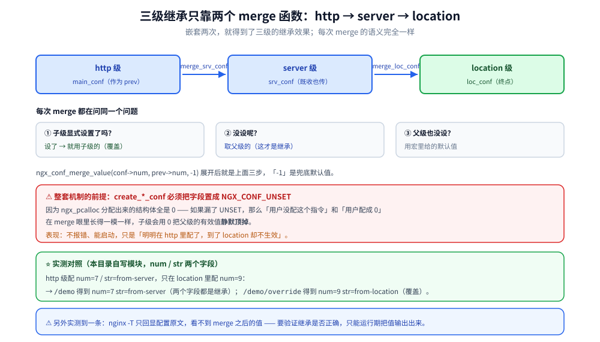
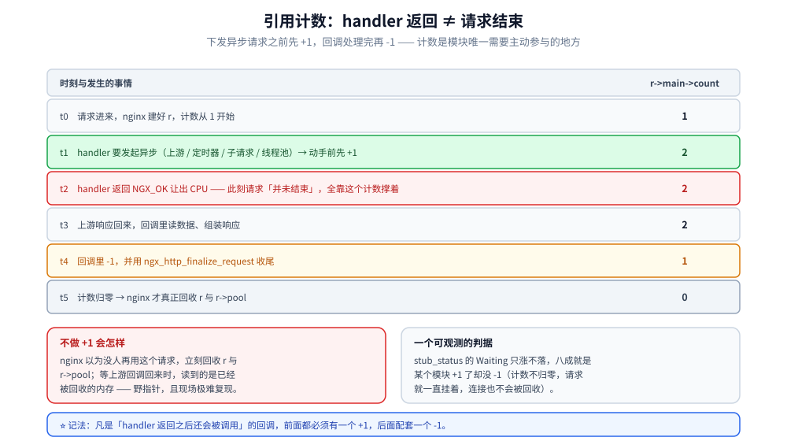

# 配置解析与请求上下文

> 配置项怎么定义与存储、`http → server → location` 的继承与覆盖在代码里怎么实现、
> error 日志怎么打，以及 `ngx_http_request_t` 的生命周期与引用计数。
>
> 素材来源：《深入理解Nginx（第2版）》第 4 章的读后整理，**按主题归纳而非逐字摘录**；
> 指令与变量的关系、`postconfiguration` 签名等按 1.31 实测订正。
> 实测口径见本目录 [README.md](README.md) 第四节；本模块读数取自本机 Docker
> `nginx-dev:1.31.6`（自建镜像，nginx **1.31.6**）。

---

## 一、配置项是怎么被定义和存储的？

**本节要点**：指令表的一行只做三件事 —— **声明能写在哪**、**声明取几个参数**、
**声明存到哪**。存储位置只有两种，搞混了值就写丢。

### 1.1 把一行指令拆开看

```c
{ ngx_string("demo_num"),
  NGX_HTTP_MAIN_CONF|NGX_HTTP_SRV_CONF|NGX_HTTP_LOC_CONF|NGX_CONF_TAKE1,
  ngx_conf_set_num_slot,
  NGX_HTTP_LOC_CONF_OFFSET,
  offsetof(ngx_http_confctx_loc_conf_t, num),
  NULL },
```

| 字段 | 值 | 管什么 |
|---|---|---|
| `name` | `demo_num` | 指令名 |
| `type` | `MAIN\|SRV\|LOC\|TAKE1` | 允许出现的层级 + 参数个数 |
| `set` | `ngx_conf_set_num_slot` | 官方现成 setter（另有 `set_str_slot` / `set_flag_slot`） |
| `conf` | `NGX_HTTP_LOC_CONF_OFFSET` | ⭐ 存到 `cf->ctx` 的**哪个数组** |
| `offset` | `offsetof(..., num)` | 存到该结构体的**哪个成员** |
| `post` | `NULL` | 1.31 的预留字段（旧版没有） |

### 1.2 `conf` 字段的两种写法，含义完全不同

这是最容易被抄错的一处：

| 写法 | 含义 | 什么时候用 |
|---|---|---|
| `NGX_HTTP_LOC_CONF_OFFSET` | ⭐ `cf->ctx->loc_conf` 这个**数组**，本模块的 element 由 setter 的 `conf` 参数**直接给出** | 大多数情况 |
| `NGX_HTTP_MAIN_CONF_OFFSET` | 存到 `cf->ctx->main_conf` | main 级配置 |

⭐ 还有第三种：**直接写数字 0**（如 `ngx_http_empty_gif` 的 `demo;` 指令）——
表示"不用 conf，setter 自己找地方存"。content handler 走的就是这条（见
[06-HTTP模块开发入门.md](06-HTTP模块开发入门.md) 1.3）。

写法与层级不匹配的典型报错是配置解析期直接失败，或者值被写进错误的结构体里
（现象：`nginx -t` 通过、运行时读到 0 或乱码）。

### 1.3 ⭐⭐ 用自定义 setter 而不是官方 setter 的场合

官方 `ngx_conf_set_num_slot` / `set_str_slot` / `set_flag_slot` 覆盖了九成场景。
需要自定义的情况有两类：

**① 要校验取值范围或做跨字段约束**（官方 setter 只做类型转换，不做业务校验）：

```c
static char *
ngx_http_filterdemo_on(ngx_conf_t *cf, ngx_command_t *cmd, void *conf)
{
    ngx_http_filterdemo_loc_conf_t  *flcf = conf;
    /* ⭐ conf 就是 cmd->conf 指定的偏移解析出来的指针 —— 不用自己算 */
    ngx_str_t  *value = cf->args->elts;   /* value[0] 是指令名，value[1] 起才是参数 */
    ngx_str_t  *v = &value[1];

    if (ngx_strcasecmp(v->data, (u_char *) "on") == 0) {
        flcf->enabled = 1;
    } else if (ngx_strcasecmp(v->data, (u_char *) "off") == 0) {
        flcf->enabled = 0;
    } else {
        /* ⚠️ 报配置错误必须用 ngx_conf_log_error + 返回 NGX_CONF_ERROR，
         *    nginx 会把出错的文件与行号一起打出来；
         *    直接 printf / 返回错误码而不打日志，运维那边只会看到 "test failed" */
        ngx_conf_log_error(NGX_LOG_EMERG, cf, 0,
                           "invalid value \"%V\" in \"%V\"", v, &cmd->name);
        return NGX_CONF_ERROR;
    }
    return NGX_CONF_OK;
}
```

**② 参数要拆成多个字段存**（官方 setter 一次只能写一个 slot）。
⭐ 那就拆成多条指令，别硬塞 —— 一条指令取 4 个参数却只能写进 1 个 slot，
是新手最常见的返工点。

## 二、`http → server → location` 的继承是怎么实现的？

**本节要点**：只有**两级 merge 函数**，但经过两次嵌套就得到三级效果。
关键是 `create_*_conf` 里**必须置 `NGX_CONF_UNSET`** —— 漏了这一步，
继承链会**静默失效**（不报错，只是值不对）。

### 2.1 三级是怎么变成两级的

```text
http{} 的 main_conf  ──作为 prev──▶ merge_srv_conf()  ──▶ srv_conf
                                                              │
                                     作为 prev ──────────────┘
                                            ▼
                                     merge_loc_conf()  ──▶ loc_conf
```

所以 `ngx_http_module_t` 里只有 `merge_srv_conf` 与 `merge_loc_conf` 两个合并钩子。
每次 merge 的语义完全一样：

```c
ngx_conf_merge_value(conf->num, prev->num, -1);
/* 展开后等价于：
 *   if (conf->num == NGX_CONF_UNSET) {
 *       conf->num = (prev->num == NGX_CONF_UNSET) ? -1 : prev->num;
 *   }
 * 也就是「子级已显式设置 → 用子级的；否则继承父级的；父级也没设 → 用默认值」 */
```

### 2.2 ⭐⭐ 漏置 `NGX_CONF_UNSET` 的后果

```c
static void *
ngx_http_confctx_create_loc(ngx_conf_t *cf)
{
    ngx_http_confctx_loc_conf_t  *lcf;

    lcf = ngx_pcalloc(cf->pool, sizeof(ngx_http_confctx_loc_conf_t));  /* ⭐ 已清零 */
    if (lcf == NULL) {
        return NULL;
    }
    /* ⚠️⚠️ 不加下面这行，继承链整个失效：
     *   ngx_pcalloc 已经把它清成 0，而 merge 的判断是「== NGX_CONF_UNSET」，
     *   0 != NGX_CONF_UNSET（-1） → merge 认为「子级已设置」→ 永远不继承。
     *   现象：所有 location 都拿到 0，而不是 server 级配的值。 */
    lcf->num = NGX_CONF_UNSET;
    lcf->str.data = NULL;
    return lcf;
}
```

`ngx_conf_merge_str_value` 判的是 `data == NULL`，`ngx_conf_merge_value` 判的是
`== NGX_CONF_UNSET` —— **两种类型要各按各的规矩初始化**。

### 2.3 实测：继承与覆盖

配置（`conf/mod.conf`，`demo_srv 100` / `demo_str from-server` / `demo_num 7`
写在 server 级）：

```text
server {
    demo_srv   100;
    demo_str   from-server;
    demo_num   7;

    location /demo {                            # 什么都不设 → 继承
        demo;
        return 200 "loc=/demo  num=$demo_num  str=$demo_str\n";
    }

    location /demo/override {                   # 显式设置 → 覆盖
        demo_str   from-location;
        demo_num   9;
        return 200 "loc=/demo/override  num=$demo_num  str=$demo_str\n";
    }
}
```

实测输出（`curl` 结果，`nginx-dev:1.31.6` 容器）：

```text
/demo          → loc=/demo  num=7  str=from-server
/demo/override → loc=/demo/override  num=9  str=from-location
```

⭐ **一个必须知道的观测限制**：`nginx -T`（dump 完整配置）**只回显配置文件原文**，
它把 server 级的 `demo_num 7` 原样打出来，**看不到 merge 之后 location 的实际取值**。
想看合并结果只能靠运行期输出（响应体或 `log_format`）。



### 2.4 ⭐⭐ 指令不是变量

删掉 confctx 模块里注册变量的那段代码后，配置能通过 `-t`，但一访问就报：

```text
nginx: [emerg] unknown "demo_num" variable
```

**指令与变量是两套独立的命名空间**，配了 `demo_num 7` 不等于有 `$demo_num`。
官方模块的经典解法是**注册一个同名变量**，`get_handler` 里从 `loc_conf` 把值读出来：

```c
static ngx_int_t
ngx_http_confctx_num_var(ngx_http_request_t *r,
    ngx_http_variable_value_t *v, uintptr_t data)
{
    ngx_http_confctx_loc_conf_t  *lcf;
    u_char                      *p;

    /* 拿「合并后」的最终值 —— 这正是 2.1 那两级 merge 的成果 */
    lcf = ngx_http_get_module_loc_conf(r, ngx_http_confctx_module);

    p = ngx_pnalloc(r->pool, NGX_INT64_LEN);
    if (p == NULL) {
        return NGX_ERROR;
    }
    v->data = p;
    v->len = ngx_sprintf(p, "%i", lcf->num) - p;
    v->valid = 1;
    v->no_cacheable = 0;
    v->not_found = 0;
    return NGX_OK;
}
```

这样"配置怎么写"与"运行时怎么读"共用一套名字，配置和代码不会脱节。
⭐ 变量注册的细节与 `NOCACHEABLE` 的语义见 [10-HTTP变量机制.md](10-HTTP变量机制.md)。

## 三、error 日志

**本节要点**：日志第一参数必须是 `cf`（配置期）或 `r->connection->log`（运行期）。
用错对象的现象是**日志写进了错误的地方或丢失**。

### 3.1 两个时机、两个日志对象

| 时机 | 用哪个 log | 示例 |
|---|---|---|
| 配置解析期（`-t` 与启动时） | `cf->log`（`ngx_conf_log_error` 自带） | `invalid value "%V"` |
| 请求处理期 | `r->connection->log` | `slab full, fail-open` |

```c
/* 配置期：ngx_conf_log_error 会自动带上文件名 + 行号 */
ngx_conf_log_error(NGX_LOG_EMERG, cf, 0, "invalid value \"%V\"", v);

/* 运行期：带连接与请求上下文 */
ngx_log_error(NGX_LOG_ERR, r->connection->log, 0,
              "prodemo: slab full, fail-open");
```

### 3.2 日志级别与"该不该打"

| 级别 | 什么时候用 |
|---|---|
| `NGX_LOG_EMERG` | 配置错误、启动失败（进程直接退出） |
| `NGX_LOG_ALERT` / `NGX_LOG_CRIT` | 资源耗尽但仍能跑 |
| `NGX_LOG_ERR` | 单次请求失败（业务级错误） |
| `NGX_LOG_WARN` | 降级、异常但已处理（**排查时的主力**） |
| `NGX_LOG_NOTICE` | 生命周期事件（worker 起落、zone 初始化完成） |
| `NGX_LOG_INFO` | 常规信息（体积大，生产一般不开） |
| `NGX_LOG_DEBUG_*` | 需要 `--with-debug` 编译 |

⭐ **格式化占位符是 nginx 自己的一套**（不是 printf）：

| 占位符 | 类型 | 备注 |
|---|---|---|
| `%V` | `ngx_str_t *` | 最常用 |
| `%s` | `char *`（NUL 结尾） | |
| `%d` / `%i` | `int` / `ngx_int_t` | |
| `%ui` / `%uz` | `ngx_uint_t` / `size_t` | ⭐ `%u` 不能单独用 |
| `%p` | 指针 | |
| `%*s` | 指定长度的字符串 | 参数要额外传长度 |

⚠️ `ngx_log_error` 的**第三个参数 `err`** 只在描述系统调用错误时才传
（`ngx_errno`），传了它 nginx 会自动把 `(2: No such file or directory)` 之类
追加到行尾。普通业务日志传 `0`。

### 3.3 ⭐ 实测的两个坑

① **官方镜像把 `error_log` 软链到 `/dev/stderr`** —— `tail -f /var/log/nginx/error.log`
会挂死。容器里读日志一律 `docker logs <容器>`。

② **`NGX_LOG_WARN` 及以上默认可见，`INFO` 需要显式开**。本目录实验里为了看
filter 是否进链，把 `error_log /dev/stderr info;` 写进配置，然后用
`docker logs | grep FILTERDEMO` —— 这一手比加断点快得多，是本目录定位
"模块到底有没有被调用"的主力手段。

## 四、请求上下文 `ngx_http_request_t`

**本节要点**：请求对象由 nginx 分配与管理，模块只读它的字段、只改该改的。
**引用计数是唯一需要主动参与的地方。**

### 4.1 模块最常打交道的字段

| 字段 | 含义 | 典型用途 |
|---|---|---|
| `r->method` | 请求方法位掩码 | 校验 `NGX_HTTP_GET` 等 |
| `r->uri` / `r->args` | 路径与查询串 | 路由判断 |
| `r->headers_in` / `r->headers_out` | 入/出 header 链 | 读客户端头、加响应头 |
| `r->connection` | 连接对象（含 `addr_text`、`log`） | 取客户端 IP、打日志 |
| `r->pool` | 请求级内存池 | 所有临时分配 |
| `r->main` | 主请求（子请求指向主请求） | ⭐ 引用计数与子请求 |
| `r->count` | **主请求**的引用计数 | 见 4.2 |
| `r->loc_conf[]` / `r->srv_conf[]` | 按模块下标取配置 | `ngx_http_get_module_loc_conf` |

⭐ `r->main->count` 与 `r->count` 是同一个东西的两种写法 —— 官方宏
`r->main->count` 强调"计数记在主请求上"，子请求共用主请求的计数。

### 4.2 引用计数的三个规则

```text
① handler 里做了异步（上游 / 定时器 / 子请求 / 线程池）→ 动手前 +1
② 异步回调里处理完 → -1（并用 ngx_http_finalize_request 收尾）
③ 计数归零 → nginx 真正结束这个请求
```

**为什么要这样**：nginx 是事件驱动的，`return NGX_OK` 只表示"我这个 handler 让出了
CPU"，不表示请求结束。如果模块发起了一个 NST（比如去上游取数据）就返回，
而 nginx 不知道"还有人在用这个请求"，就会立刻回收 `r` 和 `r->pool` —— 回调回来时
访问的就是野指针。

⭐ **实测可见的间接证据**：`stub_status` 的 `Waiting` 计数只涨不落，八成是某个模块
`+1` 了没 `-1`（第 04 篇实测过 `Reading` / `Writing` / `Waiting` 的正确读法）。



### 4.3 请求的生命周期

```text
accept 连接
  └─ 建 r（从连接池 / 请求池分配）
      └─ 11 个阶段依次推进（见 04 篇）
          └─ content 阶段产生响应体
              └─ log 阶段写 access_log
                  └─ ngx_http_free_request() 释放 r 与 r->pool
```

⚠️ 两个跨阶段的陷阱：
① **变量求值可能发生在相隔很远的两个阶段**（content 阶段算响应体、log 阶段写日志）
—— 值的内存必须活到最后，细节见 [10-HTTP变量机制.md](10-HTTP变量机制.md)；
② `r->pool` 是**请求级**的，比 `r->connection` 短命；
**不能把 `r->pool` 的指针存到连接级结构里**。

## 使用

**1. 三级配置的最小可跑骨架**（`create` 里置 UNSET → `merge` 里用官方宏）：

```c
static void *
create_loc_conf(ngx_conf_t *cf)
{
    my_loc_conf_t  *lcf = ngx_pcalloc(cf->pool, sizeof(my_loc_conf_t));
    if (lcf == NULL) { return NULL; }
    lcf->num = NGX_CONF_UNSET;        /* ⭐ 漏了这行 → 继承失效 */
    lcf->str.data = NULL;             /* ⭐ 字符串判 NULL */
    return lcf;
}

static char *
merge_loc_conf(ngx_conf_t *cf, void *parent, void *child)
{
    my_loc_conf_t  *prev = parent, *conf = child;
    ngx_conf_merge_value(conf->num, prev->num, -1);
    ngx_conf_merge_str_value(conf->str, prev->str, "default");
    return NGX_CONF_OK;
}
```

**2. 改了配置怎么快速验证继承对不对**（不要只看 `-t`）：

```bash
docker exec <容器> nginx -t                    # 只查语法
docker exec <容器> nginx -T | grep demo_       # 只回显原文，看不到 merge 结果
curl -s http://127.0.0.1:8080/your/location    # ⭐ 唯一能看到合并值的办法
```

**3. 日志排查三板斧**：

```bash
# ① 模块到底有没有被调用
docker logs <容器> 2>&1 | grep -i 你的模块名
# ② 配置期错误（文件 + 行号都在）
docker exec <容器> nginx -t
# ③ 运行期详细日志（临时把级别调到 info/notice 再复现）
error_log /dev/stderr info;      # 写进 http{} 块
```

## 延伸追问

### 1. 为什么 nginx 要搞三级配置，而不是每层各一份？

因为运维的心智模型本来就是**"共同默认 + 局部例外"**：证书、日志格式想写一次就管全站，
个别 location 再改。三级 + merge 让"写一次管全站"成为默认行为，也顺带避免了
配置文件里的复制粘贴。⭐ 代价就是本节讲的这套 `UNSET` 约定 ——
它把"是否显式设置"编码进了变量的**取值**里，所以初始化错了就完全静默。

### 2. 配置合并发生在启动时还是 reload 时？

**每次解析配置都会完整走一遍** `create → merge`，也就是启动、reload、`nginx -t`
（`-t` 走完整解析但不启动 worker）都会执行。⭐ 所以：
① `create/merge` 里**不要做有副作用的初始化**（建文件、连数据库），那是
`init_process` 的职责；② `-t` 能查出配置错误，但查不出 `init_process` 里的错误
（后者真要启动 worker 才会执行）。

### 3. 为什么 `postconfiguration` 是 `ngx_int_t`，而 `init_main_conf` 是 `char *`？

两套返回值体系并存是历史包袱：`ngx_int_t` 的钩子（`preconfiguration` /
`postconfiguration`）用 `NGX_OK` / `NGX_ERROR`；`char *` 的钩子
（`init_main_conf` / `merge_*_conf`）用 `NGX_CONF_OK` / `NGX_CONF_ERROR`。
⚠️ **写反了会被 `-Werror` 判成不兼容指针类型**，实测报错长这样：

```text
error: initialization of 'char * (*)(ngx_conf_t *, void *, void *)'
  from incompatible pointer type 'ngx_int_t (*)(ngx_conf_t *)'
  [-Wincompatible-pointer-types]
```

### 4. 模块之间怎么取别人的配置？

用 `ngx_http_conf_get_module_loc_conf(cf, 别的模块)`（配置期）或
`ngx_http_get_module_loc_conf(r, 别的模块)`（运行期）。
⭐ 前提是**目标模块必须声明 `ngx_module_t` 且被 `extern`**，同时顺序上要求
对方先解析完 —— 实际做法是把本模块的 `postconfiguration` 放在后面，
或者干脆等运行期再取。

## 关联

- [README.md](README.md) — 本目录导读与实测口径
- [04-HTTP框架执行流程.md](04-HTTP框架执行流程.md) — 配置在 11 个阶段里的位置
- [06-HTTP模块开发入门.md](06-HTTP模块开发入门.md) — 指令表与 content handler 注册
- [10-HTTP变量机制.md](10-HTTP变量机制.md) — 把配置暴露成变量的完整写法
- [16-模块开发实战.md](16-模块开发实战.md) — 三级配置在真实模块里的用法
- [OpenResty.md](../../../03-数据与中间件/中间件/网关与代理/OpenResty.md) — Lua 侧的配置与阶段对应
