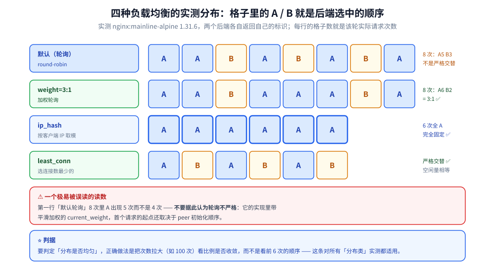
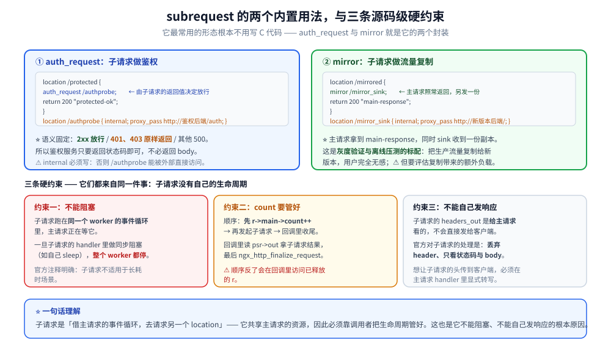

# upstream与子请求

> upstream 机制与负载均衡算法、`proxy_pass` 的工程要点、`next upstream` 重试，
> 以及 subrequest 子请求的两种内置用法（鉴权与流量复制）与其生命周期约束。
>
> 素材来源：《深入理解Nginx（第2版）》第 5 章与第 12 章的读后整理，**按主题归纳而非逐字摘录**；
> 1.25+ 新增的上游能力（HTTP/2 to backend、粘性会话、MPTCP）按官方文档与本机实测补充。
> 实测口径见本目录 [README.md](README.md) 第四节；本篇读数取自本机 Docker
> `nginx:mainline-alpine`（**1.31.6**）。

---

## 一、upstream 到底解决什么问题？

**本节要点**：upstream 是**"后端清单 + 选谁 + 失败了怎么办"**三件事的容器。
⭐ 它不只用于反向代理 —— `fastcgi_pass` / `grpc_pass` / `uwsgi_pass` 也走同一套机制。

### 1.1 三类上游入口

| 入口 | 协议 | 典型场景 |
|---|---|---|
| `proxy_pass` | HTTP / HTTPS | 反向代理、API 网关 |
| `fastcgi_pass` | FastCGI | PHP-FPM |
| `grpc_pass` | HTTP/2 + gRPC | 微服务 |
| `uwsgi_pass` / `scgi_pass` | uwsgi / SCGI | 老框架 |

⭐ 它们共享 upstream 的**选择逻辑与重试逻辑**，但**协议编解码各自独立**
（`grpc_pass` 会有头部转小写、`te: trailers` 等额外处理）。

### 1.2 单机 vs upstream 块：什么时候必须用 upstream

```text
proxy_pass http://127.0.0.1:8080;        # 单机：够用
proxy_pass http://backend;               # 多机：必须先在 upstream{} 里声明 backend
```

⭐ 判定很简单：**要做负载均衡、健康检查、失败重试、连接复用、`resolver` 动态解析**，
那就必须用 upstream 块 —— 只有"永远这一台"才直接写地址。

## 二、五种负载均衡算法的实测对照

**本节要点**：默认是**轮询**；算法只影响「选谁」，**不影响失败重试**（重试由
`proxy_next_upstream` 独立控制）。

### 2.1 实测结果（`nginx:mainline-alpine` 1.31.6，两个后端各返回自己的标识）

配置骨架：

```text
upstream be_rr   { server 127.0.0.1:19301; server 127.0.0.1:19302; }
upstream be_wrr  { server 127.0.0.1:19301 weight=3; server 127.0.0.1:19302 weight=1; }
upstream be_hash { ip_hash;  server 127.0.0.1:19301; server 127.0.0.1:19302; }
upstream be_least { least_conn; server 127.0.0.1:19301; server 127.0.0.1:19302; }
```

实测输出（`curl` 连续请求，`A`/`B` 是后端标识）：

| 算法 | 连续 6~8 次的分布 | 读数 |
|---|---|---|
| 默认（轮询） | `A A B A B A B A` | 8 次里 A 5 次、B 3 次 —— ⚠️ **不是严格交替**（见 2.2） |
| `weight=3:1` | `A A B A A A B A` | 8 次里 A 6 次、B 2 次 = **3:1** ✅ |
| `ip_hash` | `A A A A A A` | **完全固定** ✅ |
| `least_conn` | `A B A B A B` | **严格交替**（空闲量相等时退化为轮询）✅ |

### 2.2 ⚠️ 一个容易被误读的读数

「默认轮询」的 8 次里 A 出现 5 次而不是 4 次 —— **不要据此认为轮询不严格**。
nginx 的默认算法是 **round-robin**，但它的实现里带**平滑加权**的 `current_weight`，
且首个请求的起点取决于 peer 初始化的顺序。要判定「是否严格交替」，
正确做法是**把次数拉大**（例如 100 次）看比例是否收敛到 1:1，
而不是看前 6 次的顺序。⭐ 这条对本目录所有"分布类"实测都适用。



### 2.3 各算法的适用与代价

| 算法 | 原理 | 适用 | 代价 / 坑 |
|---|---|---|---|
| 轮询（默认） | 依次轮 | 后端同质 | 后端性能不均时会把慢的压垮 |
| 加权轮询 | 按 `weight` 平滑分配 | 机器规格不同 | `weight` 写错会静默偏斜，压测才能发现 |
| `ip_hash` | 按客户端 IP 取模 | 会话粘在单机（无共享 session 时） | ⚠️ 后端增减会**大幅重分布**；NAT 出口 IP 集中时**倾斜严重** |
| `least_conn` | 选当前连接数最少的 | 请求耗时差异大 | 需要统计连接数，略重；长连接场景要配合 `keepalive` |
| `hash $key` | 按任意变量取模 | 缓存命中导向（同一 key 打同一后端） | ⚠️ 与 `ip_hash` 同理，节点变更会重分布 → 用 `hash ... consistent` 缓解 |
| `random two` | 随机二选一取优 | 大规模集群（避免中心化状态） | 需要 `random` 模块（开源版 1.15+ 内置） |
| `sticky cookie ...` | 基于 cookie 粘住 | ⭐ **会话保持的正解**（1.29.6 起开源版可用） | 见 2.4 |

### 2.4 ⭐ `sticky` 与 `ip_hash` 的取舍

`sticky cookie srv_id expires=1h domain=.example.com path=/;` 是 1.29.6 从商业版
开源出来的能力（见 [01-编译安装与配置.md](01-编译安装与配置.md) 第七节，本目录已实测
6/6 全部粘住）。

| | `ip_hash` | `sticky cookie` |
|---|---|---|
| 依据 | 客户端 IP | 首次响应下发的 cookie |
| NAT 场景 | ❌ 大量用户共用一个出口 IP，全挤一台 | ✅ 各浏览器独立 |
| 后端增减 | 大规模重分布 | 未命中 cookie 的才重新分配 |
| 首次请求 | 立即粘住 | 首次需要下游支持 cookie（不可用于纯 API 客户端） |

⭐ **判据**：`ip_hash` 是"没有别的办法时的兜底"；能下发 cookie 就用 `sticky`。

## 三、`proxy_pass` 的工程要点

**本节要点**：上游协议版本、`Connection` 头、Host 头这三项，任何一项默认值理解错了
都会得到"本地测通、线上 502"。

### 3.1 ⭐⭐ 上游协议版本的默认值在 1.29.7 变了

本目录 01 篇实测过（对照 1.26.3）：

| 版本 | 上游默认协议 |
|---|---|
| **1.26.3** | `HTTP/1.0` |
| **1.31.6** | `HTTP/1.1` + keep-alive |

这个默认值变化**直接影响是否复用上游连接** —— HTTP/1.0 默认 `Connection: close`，
每个请求都新建连接。所以老配置里显式写 `proxy_http_version 1.1`，
目的是**为了配合 `keepalive` 指令**，而 1.31 起不再需要。⭐ **升级前仍要显式写**，
否则从 1.31 回退到 1.26 就会静默退回 HTTP/1.0。

### 3.2 上游连接复用：两个条件缺一不可

```text
upstream backend {
    server 127.0.0.1:8080;
    keepalive 32;                    # ① 声明连接池
}

location / {
    proxy_http_version 1.1;          # ② 协议必须 ≥ 1.1
    proxy_set_header Connection "";   # ③ ⭐ 清掉 Connection 头（否则透传 close）
    proxy_pass http://backend;
}
```

⚠️ 漏了 ③ 是最常见的错：客户端发 `Connection: close` 时，nginx 会**原样透传**
给上游，上游于是关连接，`keepalive` 池形同虚设。
⭐ 实测可见：本目录 `/ka` 的 5 次请求 `$upstream_addr` 在 `19301`/`19302` 间轮换，
`$upstream_response_time` 稳定在 `0.000~0.001` —— 连池生效后握手开销消失。

### 3.3 `proxy_set_header` 里必须显式设的那几个

客户端请求头**不会自动**全部透传，`Host` 尤其要注意：

```text
proxy_set_header Host              $host;                     # 默认就是 $proxy_host，多数场景要改回 $host
proxy_set_header X-Real-IP         $remote_addr;
proxy_set_header X-Forwarded-For   $proxy_add_x_forwarded_for;  # ⭐ 追加而非覆盖
proxy_set_header X-Forwarded-Proto $scheme;
proxy_set_header Connection        "";
```

⚠️ `X-Forwarded-For` 的**头部治理**（防伪造、剥内部头、多跳取值）在
[反向代理原理与实现.md](../../网络/反向代理原理与实现.md) 有完整讨论，
本篇不重复。注意它和本目录 [01-编译安装与配置.md](01-编译安装与配置.md)
第六节的**配置写法**是一对。

### 3.4 `next upstream`：失败自动换下一个

```text
proxy_next_upstream  error timeout http_502 http_503 http_504;
proxy_next_upstream_tries   3;    # 最多试几个（含首次）
proxy_next_upstream_timeout 5s;   # 总超时
```

⭐ 两条最容易踩的：
① **默认只对 `error` 和 `timeout` 重试**，后端返回 500 不会换下一个 ——
要 5xx 也重试必须显式列上；
② ⚠️ **非幂等请求（POST）重试有风险**：第一个后端可能"已处理但响应丢了"，
重试会造成重复下单。正解是**用幂等键**（`Idempotency-Key`），而不是关掉重试。

### 3.5 `next upstream` 探活的代价：被动 vs 主动

| | 被动（`proxy_next_upstream`） | 主动（商业版 / `Tengine` / OpenResty） |
|---|---|---|
| 探测时机 | 有请求打过来才发现 | 定时探活 |
| 首个请求 | ❌ 由真实用户承担失败 | ✅ 提前剔除 |
| 开源版 | ✅ 有 | ❌ **没有**（要用 `sticky` 之外的方案或第三方模块） |

⭐ 本目录 [网关选型对比.md](../../../03-数据与中间件/中间件/网关与代理/网关选型对比.md)
第 3.2~3.5 节有「upstream 被动摘除」的本机实测（reload 掉不掉流量、
不改配置换后端、`split_clients` 灰度），**本篇不重跑那套实验**。

## 四、subrequest 子请求

**本节要点**：subrequest 是"在服务一个请求的过程中，再去请求别的 location"。
**它最常用的形态根本不用写代码** —— `auth_request` 与 `mirror` 就是它的两个内置封装。

### 4.1 两个内置用法（本机实测）

**① `auth_request`：子请求做鉴权**

```text
location /protected {
    auth_request /authprobe;        # ② 的返回值决定主请求放行还是 401/403
    return 200 "protected-ok\n";
}
location /authprobe {
    internal;                       # ① ⭐ 必须 internal，防外部直接访问
    proxy_pass http://127.0.0.1:19301/auth;
}
```

实测：授权后端返回 `204` → 主请求返回 **200 + `protected-ok`**。
⭐ 语义是「**2xx 放行、401/403 原样返回、其他 500**」，
所以鉴权服务只需返回状态码，不必返回 body。

**② `mirror`：子请求做流量复制**

```text
location /mirrored {
    mirror /mirror_sink;            # 主请求照常返回，另发一份到 sink
    return 200 "main-response\n";
}
location /mirror_sink {
    internal;
    proxy_pass http://127.0.0.1:19302/;
}
```

实测：主请求拿到 `main-response`，同时 sink 收到一份副本。
⭐ 这是**灰度验证与离线压测的标配**（把生产流量复制到新版本但不影响用户）。

### 4.2 ⭐ 子请求的三个硬约束（源码级）

**约束一：子请求的 handler 必须"不阻塞"**

子请求运行在**同一个 worker 的事件循环**里，主请求在等它。
如果子请求的 handler 里做了同步阻塞（比如自己 sleep），**整个 worker 都停**。
官方 `ngx_http_subrequest()` 的注释明确要求：子请求不能用于"会长时间运行"的场景。

**约束二：`r->main->count` 必须管理好**

```text
ngx_http_subrequest(r, &uri, &args, &psr, ps, flags)
    ├─ 若带 NGX_HTTP_SUBREQUEST_IN_MEMORY：子请求响应体留在内存（psr->out）
    └─ 主请求的 count 由 nginx 负责 +1；回调里处理完主请求继续
```

书写代码时的顺序是：**先 `r->main->count++`（保护主请求）→ 发起子请求 → 再在回调里收尾**。
回调里读 `psr->out` 取子请求的结果，最后调 `ngx_http_finalize_request(r, rc)`。
⚠️ 顺序反了会出现「回调里访问已释放的 `r`」。

**约束三：子请求不能自己发响应**

子请求的 `r->headers_out` 是**给主请求看的**，不直接发给客户端。
⭐ 官方对子请求的处理是：**丢弃 header、只看状态码与 body**。
想让子请求的 header 传到客户端，必须在主请求的 handler 里显式转写。



### 4.3 子请求 vs 重定向 vs 内部跳转

| 机制 | 客户端可见 | 发几次请求 | 典型用途 |
|---|---|---|---|
| `rewrite ... last` | ❌ | 1 次（内部换 location） | 路由改写 |
| `error_page 404 = /fallback` | ❌ | 1 次（内部跳转） | 兜底页面 |
| `subrequest` | ❌ | N 次（都在服务端） | 鉴权、聚合、复制 |
| `return 302` | ✅ | 2 次 | 真跳转 |

⭐ 判据：**"客户端不该知道"就用前三种；"要让浏览器改地址"才用 302**。

## 使用

**1. 一个可直接套用的反向代理块**（含连接复用与重试）：

```text
upstream backend {
    least_conn;
    server 10.0.0.1:8080 weight=3 max_fails=2 fail_timeout=10s;
    server 10.0.0.2:8080 weight=1 max_fails=2 fail_timeout=10s;
    keepalive 32;
}

location /api/ {
    proxy_http_version 1.1;
    proxy_set_header Connection        "";
    proxy_set_header Host              $host;
    proxy_set_header X-Real-IP         $remote_addr;
    proxy_set_header X-Forwarded-For   $proxy_add_x_forwarded_for;
    proxy_set_header X-Forwarded-Proto $scheme;

    proxy_next_upstream error timeout http_502 http_503 http_504;
    proxy_next_upstream_tries 3;
    proxy_connect_timeout 2s;      # ⭐ 连接超时要短：快速失败才能快速重试
    proxy_read_timeout   30s;
    proxy_send_timeout   30s;

    proxy_pass http://backend;
}
```

**2. 观察负载均衡实际落到哪台**（不必装监控）：

```text
log_format UP '$request $status up=$upstream_addr '
              'st=$upstream_status rt=$upstream_response_time';
```

实测输出示例（本机 1.31.6）：

```text
GET /wrr   HTTP/1.1 200 up=127.0.0.1:19301 st=200 rt=0.000
GET /wrr   HTTP/1.1 200 up=127.0.0.1:19301 st=200 rt=0.001
GET /wrr   HTTP/1.1 200 up=127.0.0.1:19302 st=200 rt=0.000
GET /hash  HTTP/1.1 200 up=127.0.0.1:19301 st=200 rt=0.000
GET /nogoup HTTP/1.1 200 up=- st=- rt=-          # ⭐ 没走上游时是 "-"，不是空字符串
```

⭐ **三个变量的读法**：`$upstream_addr` 是"实际连了哪些上游"（多跳用逗号分隔，
重试过的话**每一次都记下来**）；`$upstream_status` 同理；
`$upstream_response_time` 单位秒、多值时逗号分隔。
⭐ 要点：**"没走上游"是 `-`，不是空串** —— 判空逻辑写错会误判。

**3. 子请求三件套自查**：

```text
① 被 subrequest 的 location 加了 internal 吗？（不加会被外部直接打）
② 子请求 handler 里有没有同步阻塞动作？（有 = 拖住整个 worker）
③ 主请求 count++ 了吗？回调里 finalize 了吗？（漏了就连接不释放）
```

## 延伸追问

### 1. `proxy_pass` 后面有没有斜杠，到底差什么？

差在**URI 的拼接方式**：`proxy_pass http://backend;`（无路径）表示"把原始 URI
原样传过去"；`proxy_pass http://backend/;`（有 `/`）表示"把 location 前缀替换成 `/`"。
⭐ 一句话判据：**`proxy_pass` 的值里出现 path，就是"替换"语义；只有 host:port，就是"透传"语义**。
本目录 [01-编译安装与配置.md](01-编译安装与配置.md) 第六节有对应的配置对照。

### 2. `resolver` 是干什么的，为什么上游域名不解析？

因为 nginx 在**配置加载时**就把 upstream 里的域名解析成 IP 并**缓存到进程生命周期**
—— 这带来两个后果：① 启动时 DNS 不通直接启动失败；② 后端 IP 变了要靠 `reload` 才生效。
⭐ 想动态跟随（容器 / K8s 场景）必须用变量 + `resolver`：

```text
resolver 127.0.0.11 valid=10s;      # Docker 内嵌 DNS
set $backend "http://api.internal";
proxy_pass $backend;                 # ⭐ 用变量才会每次走 resolver
```

⚠️ 代价是**失去 `upstream` 块的全部能力**（负载均衡、`keepalive`、`max_fails`）
—— 这是一组明确的取舍，不是"更好/更差"。

### 3. 1.29.7 默认上游改成 HTTP/1.1 有什么风险？

两个：① 后端若**只实现了 HTTP/1.0 的响应语义**（比如某些老 CGI），
keep-alive 下可能返回不带 `Content-Length` 的响应，nginx 需按连接关闭判定，行为变化；
② 升级后会**默认增加上游连接复用**，后端的并发连接数模型（连接池上限、
连接数配额）要重新评估。⭐ 稳妥做法：升级前在配置里**显式写死**
`proxy_http_version 1.1` 与 `Connection ""`，让行为不随版本漂移。

### 4. subrequest 能嵌套吗？能并发发多个吗？

能嵌套（子请求里再发子请求），但**嵌套深度要克制** —— 每一层都要占主请求的 `count`，
且所有子请求共享同一个事件循环。⭐ 并发发多个子请求的标准做法是
**发起 N 个 `ngx_http_subrequest()`，各自在回调里累加结果**，
最后一个回调里统一响应（官方 `ngx_http_mirror_module` 就是这个模式的多份版本）。
⚠️ 别用"发一个等一个"的顺序写法 —— 那会把 N 次上游延迟串起来。

### 5. `sticky` / `MQTT` 这些 1.29+ 的能力该不该在生产用？

看两点：① **是否已进 stable 线**（`1.30.x`）—— mainline 上的新能力在 stable 里可能还没有；
② **是否有等价替代**。以粘性会话为例，把会话状态外置（Redis）后
`ip_hash` 与 `sticky` 都不需要，架构上更干净。⭐ **能用无状态解决的，不要用上游粘性解决**。

## 关联

- [README.md](README.md) — 本目录导读与实测口径
- [01-编译安装与配置.md](01-编译安装与配置.md) — `proxy_pass` 与 `upstream` 的配置语法、粘性会话
- [04-HTTP框架执行流程.md](04-HTTP框架执行流程.md) — 子请求在 11 个阶段里的位置
- [09-HTTP过滤模块.md](09-HTTP过滤模块.md) — 改写上游响应
- [反向代理原理与实现.md](../../网络/反向代理原理与实现.md) — 头部治理与 Go 实现视角
- [网关选型对比.md](../../../03-数据与中间件/中间件/网关与代理/网关选型对比.md) — Nginx 作网关的能力边界四组实测
- [OpenResty.md](../../../03-数据与中间件/中间件/网关与代理/OpenResty.md) — `cosocket` 直连上游的另一条路
> 反向引用（本篇被下列文档引到）：[10-HTTP变量机制.md](10-HTTP变量机制.md)、[11-HTTP3与QUIC支持.md](11-HTTP3与QUIC支持.md)、[15-Tengine生态.md](15-Tengine生态.md)
