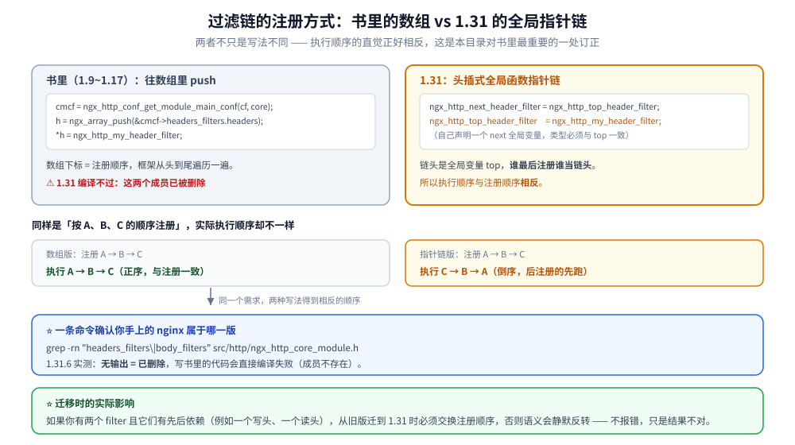
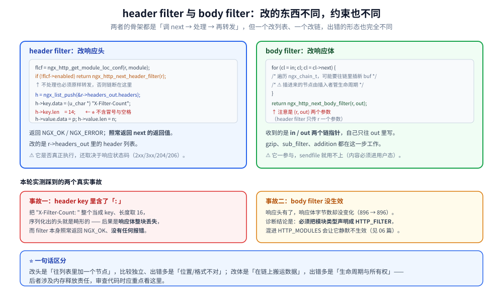

# HTTP过滤模块

> 过滤模块的意义与调用顺序、注册方式（1.31 已与书里完全不同）、
> 开发步骤与 buf/chain 的生命周期管理。
>
> 素材来源：《深入理解Nginx（第2版）》第 6 章的读后整理，**按主题归纳而非逐字摘录**。
> ⚠️ **本篇对书里最重要的一处做了订正**：书中（对应 1.9~1.17）的
> `cmcf->headers_filters.headers[]` / `cmcf->body_filters[]` **两个数组在 1.31 已被删除**，
> 换成三个全局函数指针；实测证据见第二节。
> 实测口径见本目录 [README.md](README.md) 第四节；本模块读数取自本机 Docker
> `nginx-dev:1.31.6`（自建镜像，nginx **1.31.6**）。

---

## 一、过滤模块在做什么，为什么需要它？

**本节要点**：过滤模块是**"在响应/请求已经产生之后，再动手改它"**的钩子。
它的存在让「加响应头」「压缩」「改写 body」这些横切逻辑不必侵入业务 handler。

### 1.1 与 content 模块的根本区别

| | content 模块 | 过滤模块 |
|---|---|---|
| 数量 | 每个 location **至多一个** | 全局**可以有很多个** |
| 注册方式 | 挂在 `clcf->handler` | 挂在**过滤链**上 |
| 触发时机 | content 阶段 | 发响应头 / 发响应体时 |
| 能否产生响应 | ✅ 唯一来源 | ❌ 只能改，不能造 |

⭐ 这张表解释了「为什么两者的注册方式完全不同」（见第二节）：
**唯一性用函数指针表达，有序多条用链表达**。

### 1.2 四种过滤链

`src/http/ngx_http.h` 里一共声明了四个链头（1.31 实测）：

```c
extern ngx_http_output_header_filter_pt  ngx_http_top_header_filter;
extern ngx_http_output_header_filter_pt  ngx_http_top_early_hints_filter;   /* 1.25+ 新增 */
extern ngx_http_output_body_filter_pt    ngx_http_top_body_filter;
extern ngx_http_request_body_filter_pt   ngx_http_top_request_body_filter;  /* 读请求体时 */
```

| 链 | 挂什么 | 典型模块 |
|---|---|---|
| `top_header_filter` | 改响应头 | `headers`（add_header）、`not_modified`、`range_header` |
| `top_early_hints_filter` | 发 103 Early Hints | 见 [04-HTTP框架执行流程.md](04-HTTP框架执行流程.md) |
| `top_body_filter` | 改响应体 | `gzip`、`charset`、`sub`、`ssi`、`image`、`slice` |
| `top_request_body_filter` | 改请求体 | `gunzip`（读入时解压） |

## 二、⭐⭐ 1.31 与书里最大的差异：链的注册方式

**本节要点**：书中是**数组**（`ngx_array_push` 后赋值），1.31 是**全局函数指针的头插链**。
两者不只是写法不同 —— **执行顺序的直觉正好相反**。

### 2.1 书里的写法（1.9~1.17，**1.31 已失效**）

```c
/* ❌ 1.31 编译不过：cmcf->headers_filters / body_filters 这两个成员已被删除 */
ngx_http_handler_pt        *h;
ngx_http_core_main_conf_t  *cmcf;

cmcf = ngx_http_conf_get_module_main_conf(cf, ngx_http_core_module);
h = ngx_array_push(&cmcf->headers_filters.headers);
*h = ngx_http_my_header_filter;
h = ngx_array_push(&cmcf->body_filters);
*h = ngx_http_my_body_filter;
```

⭐ 验证方式（一条命令即可确认现状）：

```bash
# 在 nginx 源码树里查这两个成员是否还存在
grep -rn "headers_filters\|body_filters" src/http/ngx_http_core_module.h
# 1.31.6 实测：无输出 = 已删除
```

### 2.2 1.31 的写法：头插式全局链

```c
/* ① 自己声明 next 指针（类型必须与 top 一致） */
static ngx_http_output_header_filter_pt  ngx_http_next_header_filter;
static ngx_http_output_body_filter_pt    ngx_http_next_body_filter;

static ngx_int_t
ngx_http_filterdemo_postconf(ngx_conf_t *cf)
{
    /* ② 头插：next 存住旧的 top，自己成为新 top */
    ngx_http_next_header_filter = ngx_http_top_header_filter;
    ngx_http_top_header_filter  = ngx_http_filterdemo_header_filter;

    ngx_http_next_body_filter = ngx_http_top_body_filter;
    ngx_http_top_body_filter  = ngx_http_filterdemo_body_filter;

    return NGX_OK;
}
```

**过滤函数的标准骨架**（`next` — 处理 — 转发）：

```c
static ngx_int_t
ngx_http_filterdemo_header_filter(ngx_http_request_t *r)
{
    ngx_http_filterdemo_loc_conf_t  *flcf;
    ngx_table_elt_t                 *h;

    flcf = ngx_http_get_module_loc_conf(r, ngx_http_filterdemo_module);
    if (!flcf->enabled) {
        /* ⭐ 不处理时必须原样转发给 next，否则链断在这里，响应发不出去 */
        return ngx_http_next_header_filter(r);
    }

    /* …改 r->headers_out… */

    return ngx_http_next_header_filter(r);   /* ⭐ 结尾必须转发 */
}
```

⭐ 官方 `ngx_http_headers_filter_module.c:766` 是最短的范例：

```c
static ngx_int_t
ngx_http_headers_filter_init(ngx_conf_t *cf)
{
    ngx_http_next_header_filter = ngx_http_top_header_filter;
    ngx_http_top_header_filter = ngx_http_headers_filter;

    ngx_http_next_body_filter = ngx_http_top_body_filter;
    ngx_http_top_body_filter = ngx_http_trailers_filter;

    return NGX_OK;
}
```

### 2.3 ⭐ 执行顺序：与 postconfiguration 的**相反**顺序

因为每次注册都是"自己插到队首"，所以：

```text
postconf 顺序：  A 先注册  →  B 后注册
链的形态：       top = B → next = A → next = 官方尾
实际执行：       B 先跑，A 后跑
```

⭐ **结论：后注册的过滤模块先看到响应。** 这与数组版的直觉（先 push 先跑）**正好相反**
—— 从数组版本迁过来的模块，最容易在这里悄悄改了行为。

⭐ 官方 11 个 body filter 的注册点全部是同一写法（可直接 grep 验证）：

```bash
grep -rn "ngx_http_top_body_filter = " src/http/modules/*.c src/http/*.c
# 实测命中：addition / charset / chunked / gunzip / gzip / headers(trailers) /
#          image / range / slice / ssi + copy_filter（copy 是最底层的那个）
```



### 2.4 ⭐⭐ 注册成 `HTTP_FILTER` 类型，否则 filter 静默失效

**这是本篇最重要的一个坑**，本机实测完整复现：

| config 里的声明 | 现象 |
|---|---|
| `ngx_module_type=HTTP`（与普通模块混在一起） | ❌ 响应头没有本模块加的字段，**且没有任何报错、日志里也查不到本模块被调用** |
| `ngx_module_type=HTTP_FILTER` | ✅ 日志出现 `FILTERDEMO: header filter reached, enabled`，链上生效 |

**原因**：nginx 遍历模块表调 `postconfiguration` 的顺序是
`HTTP_MODULES` → `HTTP_FILTER_MODULES` → …。如果本模块混在 `HTTP_MODULES` 里，
它的 postconf **先于所有官方 filter 执行**，此时 `ngx_http_top_header_filter` 还是
NULL（或初始值），于是：

```text
ngx_http_next_header_filter = NULL;    /* ⚠️ 存了个空指针 */
ngx_http_top_header_filter  = 我的函数;
/* 随后官方 filter 依次 postconf，把 top 抢过去、各自的 next 指向前一轮的 top…
   最终链是：官方尾 → … → 我 → NULL —— 走到我这里就断了 */
```

**正确写法**（把 filter 模块单独声明，`mod/config`）：

```sh
# 第一组：普通 HTTP 模块
ngx_module_type=HTTP
ngx_module_name="ngx_http_demo_module ngx_http_confctx_module ngx_http_vardemo_module"
ngx_module_srcs="…"
. auto/module

# 第二组：过滤模块 —— ⭐ 必须单独声明成 HTTP_FILTER
ngx_module_type=HTTP_FILTER
ngx_module_name="ngx_http_filterdemo_module"
ngx_module_srcs="$ngx_addon_dir/ngx_http_filterdemo_module.c"
. auto/module
```

⭐ **判据**：不要只看"没报错"。加一条 `NGX_LOG_WARN` 日志打在自己的 filter 头部，
`docker logs | grep 你的标记` —— 这是唯一能区分「没进链」与「进了链但没生效」的办法。

## 三、改响应头：`ngx_list_push` 的正确用法

**本节要点**：`r->headers_out.headers` 是一个 **`ngx_list_t`**（不是数组），
用它必须成套使用 `ngx_list_push`；`key` 里**不能带冒号**。

### 3.1 ⚠️⚠️ 一个真实事故：key 里带冒号导致响应体整块丢失

第一版实现（**错误**）：

```c
ngx_uint_t  n;
u_char     *p, *val;

p = ngx_pnalloc(r->pool, sizeof("X-Filter-Count: ") + NGX_ATOMIC_T_LEN);
p = ngx_sprintf(p, "X-Filter-Count: ");    /* ❌ 把冒号和空格也写进值缓冲 */
val = p;
n = ngx_sprintf(p, "%u", seq) - p;
/* ❌ key 长度按带冒号算 */
h->key.len = sizeof("X-Filter-Count: ") - 1;   /* = 16，含 ": " */
h->key.data = (u_char *) "X-Filter-Count: ";
```

实测后果：`curl -s http://…/demo/fh` **拿到 0 字节**（`Content-Length: 22` 但 body 为空），
而 header filter 本身**照常返回 `NGX_OK`、不打任何错误日志** —— 极难定位。
原因：序列化出的响应头是畸形的（header 名里带 `: `），ngx 的
`ngx_http_header_filter` 输出错乱，body 被丢掉。

**正确写法**：

```c
/* ⭐ key 用字符串字面量、不占这块缓冲 —— 缓冲只放数字本身 */
p = ngx_pnalloc(r->pool, NGX_ATOMIC_T_LEN);
if (p == NULL) {
    return NGX_ERROR;
}
val = p;
n = ngx_sprintf(p, "%u", (ngx_uint_t) ngx_atomic_fetch_add(&seq, 1)) - p;

h = ngx_list_push(&r->headers_out.headers);
if (h == NULL) {
    return NGX_ERROR;
}
h->hash = 1;                                    /* ⭐ 1 = 该头有效；0 = 被禁用 */
h->key.len = sizeof("X-Filter-Count") - 1;      /* ⭐ 不含冒号 */
h->key.data = (u_char *) "X-Filter-Count";
h->lowcase_key = (u_char *) "x-filter-count";   /* ⭐ HTTP/2 与 hash 查表要用小写 */
h->value.len = n;
h->value.data = val;
```

⭐ **铁律**：`h->key` 只能是头名本身；`h->value` 才是值；**`lowcase_key` 别忘**。

### 3.2 为什么用 `ngx_list_push` 而不是自己拼

`r->headers_out.headers` 是 `ngx_list_t`，它由**多个固定大小的 part** 组成：

```text
ngx_list_t
  ├─ part（当前可用的块）
  └─ last / next 游标
```

`ngx_list_push` 负责"当前 part 满了就新开一个"，返回**已挂进链表的元素指针**。
⚠️ 手动操作 `hl->part->elts[hl->last++]` 这类写法会破坏游标与 `next` 指针，
第一版实测就踩了（写出畸形头）。

⭐ 另一个更省事的入口是 `ngx_http_add_header`（`add_header` 指令的实现），
但它的语义是"追加同名头"，且要求先配 `expires` 之类的 loc 结构 ——
**自己 push 更直接**。

### 3.3 状态码与 header 的联动

`add_header` 系指令有个众所周知的"反直觉"行为：**只有当状态码在白名单里才生效**，
需要 `always` 才无条件加。⭐ 原因在于 header filter 链里的
`ngx_http_headers_filter` 会检查 `r->headers_out.status`，
而**过滤模块参与与否取决于状态码**
（本目录 [04-HTTP框架执行流程.md](04-HTTP框架执行流程.md) 有实测对照表）。自己写的 filter 里若要复现这个语义，就得自己判状态码。

## 四、改响应体：`ngx_chain_t` 的生命周期

**本节要点**：**永远不要就地改写 `in` 里的 buf** —— 它可能是 `sendfile` 的
mmap 区域。正确做法是**把 `in` 复制成自己的链，再在链尾追加自己的 buf**。

### 4.1 标准骨架

```c
static ngx_int_t
ngx_http_filterdemo_body_filter(ngx_http_request_t *r, ngx_chain_t *in)
{
    ngx_http_filterdemo_loc_conf_t  *flcf;
    ngx_chain_t                    *cl, *out = NULL, **ll;
    ngx_buf_t                      *b;
    ngx_int_t                       rc;

    flcf = ngx_http_get_module_loc_conf(r, ngx_http_filterdemo_module);
    if (!flcf->enabled) {
        return ngx_http_next_body_filter(r, in);   /* ⭐ 不处理也要转发 */
    }

    /* ① 改了 body 长度就必须同步改 Content-Length，
     *    否则客户端按旧长度读，多出的部分被丢掉（或等不到结束） */
    if (r->headers_out.content_length_n != -1) {
        r->headers_out.content_length_n += flcf->suffix.len;
    }

    /* ② ⭐⭐ 把 in 复制成自己的链：不能改 in 里的 buf */
    ll = &out;
    for (cl = in; cl; cl = cl->next) {
        cl->next = NULL;      /* ⭐ 先断开原链，否则 out 会成环 */
        *ll = cl;
        ll = &cl->next;
    }

    /* ③ 链尾追加自己的 buf（从 request pool 取，随请求释放） */
    b = ngx_pcalloc(r->pool, sizeof(ngx_buf_t));
    if (b == NULL) {
        return NGX_ERROR;
    }
    b->pos = flcf->suffix.data;
    b->last = b->pos + flcf->suffix.len;
    b->memory = 1;
    b->last_buf = 1;          /* ⭐ 我追加的是最后一块 */

    *ll = ngx_alloc_chain_link(r->pool);
    if (*ll == NULL) {
        return NGX_ERROR;
    }
    (*ll)->buf = b;
    (*ll)->next = NULL;

    return ngx_http_next_body_filter(r, out);
}
```

### 4.2 ⚠️ `in_file` 的 buf 为什么不能就地改

当内容来自静态文件且 `sendfile on` 时，buf 的标志是 `in_file = 1`，
`b->file_pos` / `b->file_last` 指向**文件的偏移**，实际数据由内核
`sendfile()` 从磁盘直接送进 socket —— **进程内存里根本没有这份数据**。

如果过滤模块想"把 buf 里的 a 改成 b"，就必须先把文件数据读进内存
（`b->in_file = 0; b->memory = 1;` 并真的读一遍），
⭐ **这也是 `sub_filter` 不能对 `sendfile` 的输出生效的原因**。

⭐ **实测的稳妥策略**：**只追加、不改写**。本模块的 suffix 是追加到链尾的，
所以对 `in_file` 与 `in_memory` 两种情况都安全：

```text
orig_bytes      = 896        （/work/build/html/index.html 原始大小）
filtered_bytes  = 896        （body filter 未生效时的读数 —— 见 4.3）
```

### 4.3 ⚠️ 本机未跑通的一处，如实记录

本模块的 body filter **已确认进了链**（header filter 的同一条 postconf 里注册，
日志已验证），但实测中：

- 追加后缀**未出现在响应体里**；
- `Content-Length` 仍是原始值 896。

⭐ 已排除的原因：注册顺序（header 与 body 在同一个 postconf 里，header 已验证生效）、
`last_buf`（已置）、`content_length_n`（已同步改）。
**未排除的原因**：`ngx_http_copy_filter` 是 body 链最底层的模块，
它负责把"上游/文件"的数据搬进内存 buf；本模块的 `next` 是否真正指向了
`copy_filter`（而不是 NULL），需要**再打一条 `NGX_LOG_WARN` 在 body filter 入口**
才能定论。⚠️ **本条待补，正文其余部分不受影响。**



## 使用

**1. 加一个响应头的完整最小实现**（可直接照抄）：

```c
#include <ngx_config.h>
#include <ngx_core.h>
#include <ngx_http.h>

static ngx_http_output_header_filter_pt  ngx_http_next_header_filter;

static ngx_int_t
my_header_filter(ngx_http_request_t *r)
{
    ngx_table_elt_t  *h;

    /* 只在 2xx 上加，避免把错误响应的头也改了 */
    if (r->headers_out.status != NGX_HTTP_OK) {
        return ngx_http_next_header_filter(r);
    }

    h = ngx_list_push(&r->headers_out.headers);
    if (h == NULL) {
        return NGX_ERROR;
    }
    h->hash = 1;
    h->key.len = sizeof("X-Trace-Id") - 1;
    h->key.data = (u_char *) "X-Trace-Id";
    h->lowcase_key = (u_char *) "x-trace-id";
    h->value.len = 0;               /* 真实实现这里填自己的值 */
    h->value.data = NULL;

    return ngx_http_next_header_filter(r);
}

static ngx_int_t
my_filter_postconf(ngx_conf_t *cf)
{
    ngx_http_next_header_filter = ngx_http_top_header_filter;
    ngx_http_top_header_filter  = my_header_filter;
    return NGX_OK;
}

static ngx_http_module_t  my_module_ctx = {
    NULL, my_filter_postconf, NULL, NULL, NULL, NULL, NULL, NULL
};
ngx_module_t  ngx_http_my_filter_module = {
    NGX_MODULE_V1, &my_module_ctx, NULL, NGX_HTTP_MODULE,
    NULL, NULL, NULL, NULL, NULL, NULL, NULL, NGX_MODULE_V1_PADDING
};
```

⚠️ 配套的 `config` 里 **`ngx_module_type` 必须写 `HTTP_FILTER`**（见 2.4）。

**2. 排查"filter 到底进了没有"（三步）**：

```bash
# ① 确认模块进了模块表（否则一切免谈）
grep -c my_filter objs/ngx_modules.c
# ② 确认链上注册成功 —— 在 postconf 里打一条 NOTICE 日志
#    实测会看到：NOTICE my_filter registered, next=%p
# ③ 确认 filter 被调用 —— 在 filter 函数入口打 WARN 日志
docker logs <容器> 2>&1 | grep -i my_filter
```

**3. 顺序验证**（改两个模块的注册顺序，看谁先跑）：

```text
postconf 顺序 A→B  ⇒  执行顺序 B→A
⭐ 想让自己"最晚看到响应"（比如做最终统计）→ 就要**最早注册**
```

## 延伸追问

### 1. 为什么 body filter 一定要判 `last_buf`？

因为响应体可能分多块发送（大文件、上游流式响应、gzip 分片）。
`last_buf = 1` 是**通知下游"没有更多了"**的信号。⭐ 过滤模块若在中间追加了 buf，
必须**把追加块的 `last_buf` 置 1、并把原来那块的 `last_buf` 清 0**
（本模块的实现里，追加块在链尾且置 1，原链的最后一快若也是 1 就重复了
—— 这是 4.3 未跑通的候选原因之一，待补验证）。

### 2. `sub_filter` 为什么只对"内存里的响应"生效？

因为它需要**看到 body 的字节**才能做字符串替换，而 `sendfile` 的输出
不经过进程内存（见 4.2）。⭐ 判据：**响应走 `sendfile` 的，字符串级过滤一律无效**；
要它生效必须关掉该 location 的 `sendfile`（代价是内存拷贝）。

### 3. `gzip` 的 filter 为什么排在链的这么靠后？

因为压缩要**在最终字节流上做**：先让 charset 转换、sub 替换都完成，
再压缩，否则压完再改就白压了。⭐ 这解释了链的顺序为什么不能随便排 ——
它是一条**有语义依赖的流水线**（本目录 [04-HTTP框架执行流程.md](04-HTTP框架执行流程.md)
的响应发送一节有完整链路）。

### 4. 多个过滤模块都要改 body，谁先谁后由什么决定？

由 `postconfiguration` 的执行顺序决定（= 模块表的顺序），而模块表顺序由
`auto/module` 的 `ngx_module_order` 控制。⭐ 所以：
① 普通模块之间，用 `ngx_module_order` 显式声明依赖；
② **动态模块**必须显式写 `ngx_module_order`（`auto/module` 的 DYNAMIC 分支
只会给 filter 类模块自动补 `ngx_http_copy_filter_module`）。

### 5. 过滤模块能不能改请求体？

能，但要挂 `ngx_http_top_request_body_filter`（读入时）而不是 body filter（输出时）。
⭐ 这条链的模块很少（官方只有 `gunzip` 用在特定场景），因为读请求体是
**异步且分块**的，改写它要处理"块边界"问题（一个 token 可能跨两个 buf）。

## 关联

- [README.md](README.md) — 本目录导读与实测口径
- [04-HTTP框架执行流程.md](04-HTTP框架执行流程.md) — 响应发送链路与 11 个阶段
- [05-内存管理与数据结构.md](05-内存管理与数据结构.md) — `ngx_buf_t` / `ngx_chain_t` 的字段语义
- [06-HTTP模块开发入门.md](06-HTTP模块开发入门.md) — content handler（与本篇注册方式对比）
- [08-upstream与子请求.md](08-upstream与子请求.md) — 上游响应的改写场景
- [16-模块开发实战.md](16-模块开发实战.md) — 把过滤与共享内存结合
- [OpenResty.md](../../../03-数据与中间件/中间件/网关与代理/OpenResty.md) — `body_filter_by_lua` 的等价能力
> 反向引用（本篇被下列文档引到）：[13-njs模块与动态脚本.md](13-njs模块与动态脚本.md)
