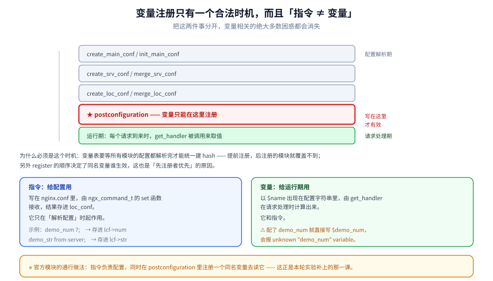
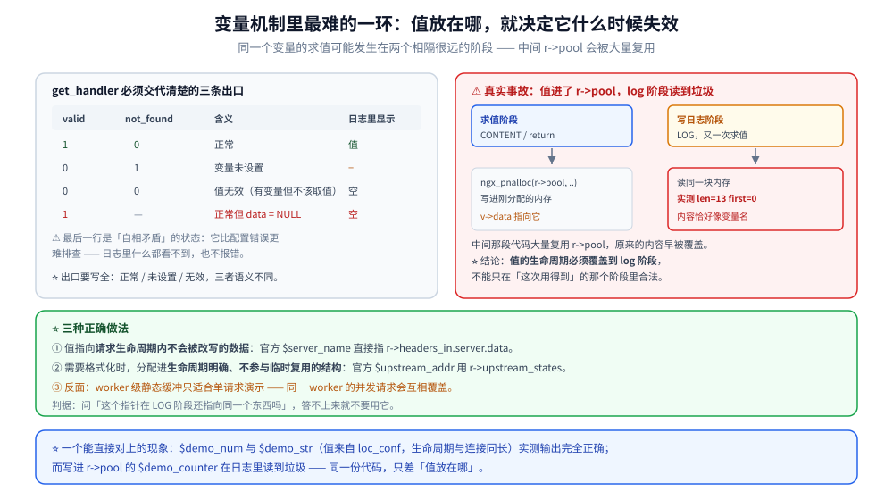

# HTTP变量机制

> HTTP 变量的分类、注册方式与惰性求值、值的三条出口、缓存机制与作用域，
> 以及在模块里支持自定义变量的完整写法。
>
> 素材来源：《深入理解Nginx（第2版）》第 15 章的读后整理，**按主题归纳而非逐字摘录**；
> 变量值的生命周期一节为本机实测新增（书中未展开）。
> 实测口径见本目录 [README.md](README.md) 第四节；本模块读数取自本机 Docker
> `nginx-dev:1.31.6`（自建镜像，nginx **1.31.6**）。

---

## 一、变量是什么，和配置项是什么关系？

**本节要点**：变量是**"运行时按需算出来的命名值"**；配置项是**"启动时定下来的设置"**。
⭐ 两者是**完全独立的命名空间** —— 这一条是本篇最实用的结论。

### 1.1 一个真实报错

配置里写了自定义指令 `demo_num 7;`，然后在 `return` 里引用 `$demo_num`：

```text
nginx: [emerg] unknown "demo_num" variable
nginx: configuration file /work/conf/mod.conf test failed
```

⭐ **配了指令 ≠ 有了变量**。要让 `$demo_num` 可用，必须**额外注册一个同名变量**，
在它的 `get_handler` 里把配置值读出来。这是官方模块的通用做法
（`$proxy_read_timeout`、`$limit_rate` 等都是这么实现的）。

### 1.2 三类变量

| 类 | 来源 | 举例 |
|---|---|---|
| 内置变量 | nginx 自己在 postconf 里注册 | `$uri`、`$args`、`$host`、`$remote_addr`、`$upstream_addr` |
| 指令产生的变量 | 模块的 `set_handler` 写值 | `set $x 1;`（rewrite 模块）、`map` 模块 |
| 模块注册的只读变量 | 模块自己的 `get_handler` | `$demo_num`、`$proxy_protocol_addr` |
| 带前缀的变量 | `NGX_HTTP_VAR_PREFIX` 注册 | `$upstream_http_*`、`$arg_*`、`$cookie_*` |

⭐ 第四类是**用一种注册覆盖无穷多名字**的技巧：注册 `upstream_http_` 前缀，
之后任何 `$upstream_http_xxx` 都能命中同一个 handler，由它去查 `xxx` 对应的头。
本目录 [08-upstream与子请求.md](08-upstream与子请求.md) 用到的
`$upstream_addr` / `$upstream_status` / `$upstream_response_time` 就是这一类。

### 1.3 变量值的类型：只有字符串

```c
typedef struct {
    unsigned    len:28;          /* 值长度（28 位 = 256MB 上限） */
    unsigned    valid:1;         /* 值是否有效 */
    unsigned    no_cacheable:1;  /* 是否禁止缓存 */
    unsigned    not_found:1;     /* 变量是否根本不存在/未设置 */
    unsigned    escape:1;        /* 是否需要转义（log 用） */
    u_char     *data;            /* 值的起始地址 —— ⭐ 不要求 NUL 结尾 */
} ngx_http_variable_value_t;
```

⚠️ **`data` 不保证 NUL 结尾**，长度只看 `len`。所以拿它当 C 字符串用是错的
（实测踩过：把 `v->data` 直接喂给 `strlen` 会读到越界）。

## 二、变量只能在一个时机注册

**本节要点**：唯一入口是 **`postconfiguration`**。写在别处（`create_*_conf` /
`merge_*_conf` / `init_process`）都不会生效或直接崩。

### 2.1 注册代码

```c
/* ① 变量表：哨兵是 ngx_http_null_variable，不是 NULL */
static ngx_http_variable_t  ngx_http_vardemo_variables[] = {

    { ngx_string("demo_counter"), NULL, ngx_http_vardemo_counter, 0,
      NGX_HTTP_VAR_NOCACHEABLE, 0 },

    { ngx_string("demo_static"), NULL, ngx_http_vardemo_static, 0,
      0, 0 },

      ngx_http_null_variable      /* { ngx_null_string, NULL, NULL, 0, 0, 0 } */
};

/* ② 只能在 postconfiguration 里注册 */
static ngx_int_t
ngx_http_vardemo_postconf(ngx_conf_t *cf)
{
    ngx_http_variable_t  *var, *v;

    for (v = ngx_http_vardemo_variables; v->name.len; v++) {
        var = ngx_http_add_variable(cf, &v->name, v->flags);
        if (var == NULL) {
            return NGX_ERROR;
        }
        var->get_handler = v->get_handler;
        var->data = v->data;
    }

    return NGX_OK;
}

static ngx_http_module_t  ngx_http_vardemo_module_ctx = {
    NULL,                    /* preconfiguration */
    ngx_http_vardemo_postconf, /* ⭐ 唯一正确的注册时机 */
    NULL, NULL,              /* create / init main conf */
    NULL, NULL,              /* create / merge srv conf */
    NULL, NULL               /* create / merge loc conf */
};
```

⭐ `ngx_http_variable_t` 是**六个字段**（`name` / `set_handler` / `get_handler` /
`data` / `flags` / `index`），顺序写错就是 `-Werror=incompatible-pointer-types`。

### 2.2 为什么必须是 postconfiguration

因为 `ngx_http_add_variable` 要往 `cmcf->variables_keys` 这个**哈希表**里插元素，
而这个哈希表在 `postconfiguration` 之前**还没建好**（它由 core 模块的 postconf 初始化）。
⭐ 顺序是：**所有模块的 postconf 依次跑 → 每次 add_variable 往表里插 → 最后 core 模块 postconf 里把表建成 hash**。所以早于此时机调用，插进去的东西会被丢掉。

### 2.3 `NGX_HTTP_VAR_NOCACHEABLE` 到底改变了什么

| flags | 同一请求内多次引用 `$var` | handler 被调用次数 |
|---|---|---|
| 不带（可缓存） | 只算一次，结果存进 `r->variables[index]`，后续读缓存 | **1 次** |
| `NOCACHEABLE` | 每次引用都重新求值 | **N 次** |

⭐ **判据**：值在**一个请求内**会变的，必须打 `NOCACHEABLE`
（例如 `$upstream_addr` —— 重试前后不一样）；值在一个请求内恒定的，
不要打（白费 CPU）。

### 2.4 另外三个 flags

| flags | 值 | 含义 |
|---|---|---|
| `NGX_HTTP_VAR_CHANGEABLE` | 1 | 允许 `set` 覆盖（否则被 `set` 时报警告） |
| `NGX_HTTP_VAR_NOCACHEABLE` | 2 | 禁止缓存 |
| `NGX_HTTP_VAR_INDEXED` | 4 | 按**下标**注册（`$1`~`$9` 这类捕获组） |
| `NGX_HTTP_VAR_NOHASH` | 8 | 不进哈希表（只用下标访问，省内存） |



## 三、get_handler 怎么写，值放哪

**本节要点**：**值的存放位置决定了它什么时候失效** —— 这是变量机制里
最容易出错、也最难排查的一环。

### 3.1 三条出口，一个都不能漏

```c
static ngx_int_t
ngx_http_confctx_num_var(ngx_http_request_t *r,
    ngx_http_variable_value_t *v, uintptr_t data)
{
    ngx_http_confctx_loc_conf_t  *lcf;
    u_char                      *p;

    /* 取「合并后」的 loc_conf —— 三级 merge 的成果（见 07 篇） */
    lcf = ngx_http_get_module_loc_conf(r, ngx_http_confctx_module);

    p = ngx_pnalloc(r->pool, NGX_INT64_LEN);
    if (p == NULL) {
        return NGX_ERROR;              /* ① 出错 */
    }
    v->data = p;
    v->len = ngx_sprintf(p, "%i", lcf->num) - p;
    v->valid = 1;                      /* ② 正常 */
    v->no_cacheable = 0;
    v->not_found = 0;
    return NGX_OK;
}
```

三个字段的组合语义：

| `valid` | `not_found` | 含义 | `log_format` 里显示 |
|---|---|---|---|
| 1 | 0 | 正常 | 值 |
| 0 | 1 | 变量未设置 | `-` |
| 0 | 0 | 值无效 | 空 |
| 1 | — | 正常但 `data = NULL` | 空（⚠️ 自相矛盾的状态，会误导排查） |

⭐ **最常漏的是 `v->len`**：不设它 → `len` 是上一次的垃圾值 →
响应体或日志里出现乱码/截断。

### 3.2 ⭐⭐ 值的生命周期：本机实测的一个真事故

**场景**：`$demo_counter` 想返回一个进程级自增序号，第一版这样写：

```c
static ngx_atomic_t   seq;
u_char              *p;

p = ngx_pnalloc(r->pool, NGX_ATOMIC_T_LEN);   /* 从请求池分配 */
v->data = p;
v->len = ngx_sprintf(p, "%u", (ngx_uint_t) ngx_atomic_fetch_add(&seq, 1)) - p;
v->valid = 1;
v->no_cacheable = 1;
v->not_found = 0;
return NGX_OK;
```

**实测现象**：响应体与 `access_log` 里读到的**不是数字**，诊断日志显示：

```text
[warn] VARDEMO counter: len=13 first=0 ptr=000071F077F8E138
```

即 `len` 被读成 13、值的首字节是 `0`（NUL），内容恰好像变量名。

**根因**：变量求值发生在**两个相隔很远的阶段**：

```text
content 阶段（return 算响应体）  ──┐
                                   ├── 同一请求，两次调用 get_handler
log 阶段（写 access_log）        ──┘
```

`r->pool` 是**请求级**的，在这两个阶段之间被**大量复用**（每个阶段都在分配临时内存）。
第一版的值存进 `r->pool` 的块 → content 阶段写进去、log 阶段再读时**那块已被别的分配覆盖**。

**⭐ 正确做法**（按优先级）：

| 方案 | 做法 | 适用 |
|---|---|---|
| a) 指向稳定数据 | `v->data = r->headers_in.server.data`（官方 `$server_name` 的做法） | 值本身就是已有数据，不用格式化 |
| b) 用生命周期明确的结构 | 官方 `$upstream_addr` 用 `r->upstream_states`（随请求走、但不参与临时复用） | 需要跨阶段保持一致 |
| c) 模块自己持有 | worker 级静态缓冲 | ⚠️ 仅单请求演示；**并发请求会互相覆盖** |

**对照：成功的一组读数** —— `$demo_num` / `$demo_str` 走的是**方案 a 的变体**
（值来自 `loc_conf`，指向的是配置解析期分配的、**不会被复用**的内存），
实测输出完全正确：

```text
/demo          → loc=/demo  num=7  str=from-server
/demo/override → loc=/demo/override  num=9  str=from-location
```

⭐ **这两组读数放在一起才是完整的结论**：
**「值来自配置」对，「值临时算在请求池里」错** —— 差别不在代码风格，而在**内存寿命**。

### 3.3 用变量名反查下标

`get_handler` 的 `data` 参数是注册时传进去的 `uintptr_t`。
想拿到"当前在解析哪个变量"，标准做法是注册时用
`ngx_http_get_variable_index(cf, &name)` 拿到下标再传进 `data`：

```c
static ngx_int_t
my_get(ngx_http_request_t *r, ngx_http_variable_value_t *v, uintptr_t data)
{
    ngx_uint_t  index = (ngx_uint_t) data;     /* 注册时传下来的下标 */

    if (r->variables[index].not_found) {        /* 走快路径读缓存 */
        return NGX_OK;
    }
    /* … */
}
```

⭐ 这条路适用于"一次注册、多个名字"的场景（前缀变量）。
普通模块不必绕这一圈。



## 四、变量的取值与作用域

**本节要点**：变量的"作用域"**不是语法作用域**，而是**"请求作用域"** ——
每个请求各有一份缓存值，子请求与主请求**各算各的**。

### 4.1 一个请求一份 `r->variables[]`

```text
r->variables[]                ← 按 index 存缓存值
  ├─ index=3  → $uri    的值
  └─ index=17 → 你的变量 的值

主请求 r
  └─ 子请求 psr
       └─ psr->variables[]    ← ⭐ 独立的数组，不共享！
```

⭐ **父子请求的变量是隔离的**。这是官方文档明确的行为，原因是：
子请求的 URI、参数不同，`$uri` / `$args` 这类变量的值本来就该不同。
若想让子请求的某个值传回主请求，必须**在 `post_subrequest` 回调里显式拷贝**
（见 [08-upstream与子请求.md](08-upstream与子请求.md) 4.2）。

### 4.2 取值的三个入口

| 入口 | 用途 | 特点 |
|---|---|---|
| `$var`（配置里） | `return` / `log_format` / `proxy_set_header` | 由 rewrite 与各模块解析 |
| `ngx_http_get_indexed_variable(r, index)` | 模块内部读 | ⭐ **最快**，绕过哈希查找 |
| `ngx_http_get_variable(r, &name, key)` | 模块内部按名字读 | 需要哈希查找，但不必提前拿 index |

⭐ 官方模块在热路径上一律用**带 index 的那个**；需要在运行期按名字动态查
（比如 `proxy_set_header` 的值）才用哈希版本。

### 4.3 `valid` / `not_found` 的真实用途

`not_found = 1` 不只是"没值"，它能让 **`set $x $notfound_var` 这类逻辑短路**，
以及让 **`if ($var) {}`** 判断为假。⭐ 所以自定义变量时，
**"没有值"要老实置 `not_found = 1`**，别用 `len = 0` 糊弄 —— 两者在下游逻辑里
行为不同。

## 使用

**1. 给配置项配一个同名变量的完整模板**（本目录实测通过）：

```c
/* ① 变量表 */
static ngx_http_variable_t  my_variables[] = {
    { ngx_string("my_timeout"), NULL, my_timeout_var, 0, 0, 0 },
      ngx_http_null_variable
};

/* ② postconf 注册 */
static ngx_int_t
my_postconf(ngx_conf_t *cf)
{
    ngx_http_variable_t  *var, *v;

    for (v = my_variables; v->name.len; v++) {
        var = ngx_http_add_variable(cf, &v->name, v->flags);
        if (var == NULL) {
            return NGX_ERROR;
        }
        var->get_handler = v->get_handler;
    }
    return NGX_OK;
}

/* ③ handler：值来自 loc_conf（⭐ 稳定内存，不会跨阶段失效） */
static ngx_int_t
my_timeout_var(ngx_http_request_t *r,
    ngx_http_variable_value_t *v, uintptr_t data)
{
    my_loc_conf_t  *lcf = ngx_http_get_module_loc_conf(r, my_module);
    u_char         *p;

    p = ngx_pnalloc(r->pool, NGX_ATOMIC_T_LEN);
    if (p == NULL) {
        return NGX_ERROR;
    }
    v->data = p;
    v->len  = ngx_sprintf(p, "%i", lcf->timeout) - p;
    v->valid = 1;
    v->no_cacheable = 0;
    v->not_found = 0;
    return NGX_OK;
}
```

**2. 观察变量的实际取值（不要只信响应体）**：

```text
# ⭐ 用 log_format 一次看全多个变量 —— 比在 return 里写可靠
#   （return 里的 $ 会被 shell 吞掉，本目录实测踩过）
log_format V '$remote_addr "$request" $status '
             'counter=$demo_counter static=$demo_static '
             'num=$demo_num str=$demo_str';
access_log /dev/stdout V;
```

**3. 变量没值时怎么表现（三态自查）**：

```text
响应体是空         → 可能是 valid=0 或 data=NULL
响应体是 "-"       → not_found=1
响应体是乱码/截断  → ⭐ v->len 没设或设错（最高频）
响应体是旧值/垃圾  → ⭐ 值缓冲被复用（见 3.2）
```

## 延伸追问

### 1. 为什么变量是"惰性求值"？直接算好不行吗？

因为变量的数量与代价都不小：`$upstream_response_time` 要统计上游耗时、
`$bytes_sent` 要查连接计数、前缀变量要扫 header 链。
⭐ 一个请求的配置里可能引用了十几个变量，但**大部分请求根本用不到全部**。
惰性求值让"没被引用 = 零成本"，这是 nginx 高性能的一部分。
⚠️ 代价是**求值时机不可控** —— 3.2 那个事故就是它带来的。

### 2. `map` 的变量为什么会被缓存？它和 `NOCACHEABLE` 矛盾吗？

不矛盾。`map` 做的是"按输入值查表"，**同一请求内输入不变 → 输出也不变**，
所以**该缓存**（§ 2.3 的判据：请求内恒定 → 不要打 NOCACHEABLE）。
⭐ 如果要给 `map` 的结果打 NOCACHEABLE，说明你在用它做"依赖请求过程的计算"，
那是用错了工具 —— 应该写模块变量。

### 3. 子请求里的变量怎么隔离的？

见 4.1：**父子请求各有一份 `r->variables[]`**。⭐ 所以：
① 子请求里 `set $x 1;` 不会影响主请求的 `$x`；
② 想让结果传回去，必须在 `post_subrequest` 回调里把 `psr->variables[i]`
或子请求的响应体显式搬到主请求。

### 4. `$var` 在 `if` 里和 `if` 外行为一样吗？

⚠️ **不一样**。`if` 块在 rewrite 阶段执行，此时很多变量（如 `$upstream_addr`）
**还没被赋值** —— 在 `if` 里读它拿到的是空值。这就是官方
「if is evil」警告的核心原因之一。⭐ 判据：要用上游相关的变量，
就放在 `log_format` / `add_header` / `proxy_set_header` 这些"晚阶段"的位置，
别放在 `if` 里做路由判断。

### 5. `escape` 标志是给谁用的？

给 `log_format` 用：值为 1 时，写日志前会对内容做转义
（避免日志注入 —— 客户端在 URI 里塞 `\n` 伪造日志行）。
⭐ 自定义变量若可能包含客户端输入，**要置 `escape = 1`**。

## 关联

- [README.md](README.md) — 本目录导读与实测口径
- [07-配置解析与请求上下文.md](07-配置解析与请求上下文.md) — 三级配置与「指令≠变量」
- [06-HTTP模块开发入门.md](06-HTTP模块开发入门.md) — 模块骨架与 `postconfiguration`
- [08-upstream与子请求.md](08-upstream与子请求.md) — `$upstream_*` 前缀变量的实际用法
- [16-模块开发实战.md](16-模块开发实战.md) — 变量在完整模块里的角色
- [OpenResty.md](../../../03-数据与中间件/中间件/网关与代理/OpenResty.md) — Lua 侧 `ngx.var` 的用法与差异
> 反向引用（本篇被下列文档引到）：[13-njs模块与动态脚本.md](13-njs模块与动态脚本.md)
