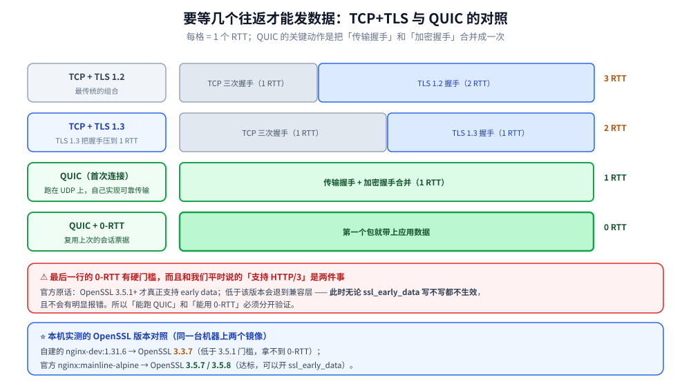
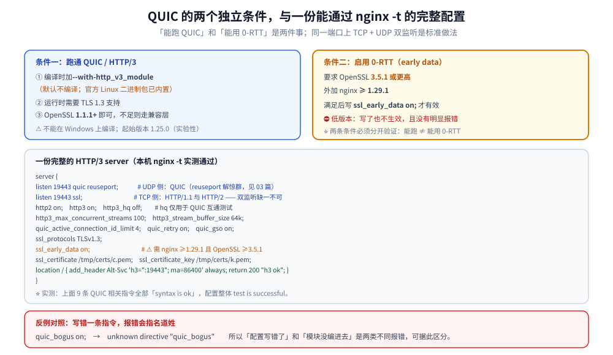

# HTTP3与QUIC支持

> Nginx 对 QUIC / HTTP/3 的支持范围、编译依赖、`listen quic` 与全部 QUIC 指令、
> 0-RTT 的版本门槛，以及 QUIC 对 Nginx 自身架构的影响。
>
> ⚠️ **本篇只讲 Nginx 侧「怎么编译、怎么配、有什么约束」**。
> QUIC 协议本身（流级重传、连接迁移、0-RTT 的代价、浏览器怎么发现 h3）
> 见 [QUIC与HTTP3.md](../../网络/QUIC与HTTP3.md)，本篇不重复。
>
> 现代特性基于 Nginx 官方文档（`quic.html` / `ngx_http_v3_module.html`）与
> 官方 Release Notes（1.25.0 ~ 1.31.6）独立整理。实测口径见本目录
> [README.md](README.md) 第四节；本篇读数取自本机 Docker
> `nginx-dev:1.31.6`（自建镜像，OpenSSL **3.3.7**）与
> `nginx:mainline-alpine`（nginx **1.31.6**，OpenSSL **3.5.7/3.5.8**）。

---

## 一、支持范围与编译依赖

**本节要点**：HTTP/3 需要 `--with-http_v3_module`；**0-RTT 另有一条 OpenSSL 3.5.1 的硬门槛**
—— 这两个条件经常被混为一谈。

### 1.1 模块与版本

| 项 | 事实 |
|---|---|
| 起始版本 | **1.25.0**（实验性，官方原话 "caveat emptor applies"） |
| 编译开关 | `--with-http_v3_module`（**默认不编译**） |
| 运行依赖 | TLS 1.3（`ssl_protocols` 默认含 TLSv1.3） |
| Win32 | ⚠️ **不能在 Windows 上编译** |
| 包安装 | Linux 官方二进制包**已内置**该模块 |

⭐ 实测确认（`nginx -V` 逐项过滤）：

```text
--with-http_ssl_module
--with-http_v2_module
--with-http_v3_module
```

### 1.2 ⭐⭐ OpenSSL 版本：两件事别混

官方文档的原话（`quic.html`）是：

```text
The OpenSSL library version 3.5.1 or higher is recommended to build nginx with QUIC
support. Otherwise, the OpenSSL compatibility layer will be used that does not
support early data.
```

拆开看是**两个独立条件**：

| 目标 | 需要的条件 |
|---|---|
| 跑通 QUIC / HTTP/3 | OpenSSL **1.1.1+**（不足则走兼容层） |
| 启用 **0-RTT（early data）** | OpenSSL **3.5.1+**，⛔ 低版本**无论 `ssl_early_data on` 写不写都不生效** |

⭐ 本机实测正好构成一组对照：

| 镜像 | OpenSSL 版本 | 0-RTT |
|---|---|---|
| `nginx-dev:1.31.6`（自建，用 alpine 系统 openssl） | **3.3.7**（`OpenSSL 3.3.7 7 Apr 2026`） | ❌ **低于 3.5.1** |
| `nginx:mainline-alpine`（官方） | **3.5.7 / 3.5.8** | ✅ 达到门槛 |

⚠️ **为什么是 3.5.1 这个精确数字**：1.31.6（2026-09-15）修的是
`CVE-2026-90439` —— HTTP/3 在 **OpenSSL 3.5.0 及更早**版本下的堆溢出。
所以 3.5.1 不是"推荐"，是**事实下限**。

**替代 TLS 库**（都用同样三个 `configure` 参数）：

```text
./configure --with-http_v3_module \
  --with-cc-opt="-I../boringssl/include" \
  --with-ld-opt="-L../boringssl/build -lstdc++"        # BoringSSL
# 或 -I/-L 指向 quictls/build 或 libressl/build 的 include 与 lib
```

⭐ 选哪个：**BoringSSL**（Google，性能与 0-RTT 完备）、
**QuicTLS**（OpenSSL 的 QUIC 分支，API 最接近）、**LibreSSL**（OpenBSD）。
⚠️ 三个都**不是**长期 ABI 稳定的通用库，升级要重新编译 nginx —— 这是生产选型的实际成本。

### 1.3 另一个版本门槛：0-RTT 何时才真正可用

官方「已知问题」里还有一条：

```text
Before version 1.29.1, 0-RTT support could not be enabled with OpenSSL regardless
of the ssl_early_data directive value.
```

⭐ 也就是说，**要开 0-RTT，需要三个条件同时满足**：

```text
nginx ≥ 1.29.1   +   OpenSSL ≥ 3.5.1   +   ssl_early_data on;
```



## 二、配置：一个完整的 HTTP/3 server

**本节要点**：**同一端口上「TCP + UDP 双监听」**是标准做法；
`listen ... quic` 开 UDP 监听，`http3 on`（默认就是 on）负责协议协商。

### 2.1 完整配置（本机 `nginx -t` 实测通过）

```text
server {
    listen 19443 quic reuseport;     # ⭐ UDP 侧：QUIC
    listen 19443 ssl;                # ⭐ TCP 侧：HTTP/1.1 与 HTTP/2
    http2 on;
    http3 on;
    http3_hq off;                    # 仅 QUIC 互操作测试用（HTTP/0.9 over QUIC）
    http3_max_concurrent_streams 100;
    http3_stream_buffer_size 64k;
    quic_active_connection_id_limit 4;
    quic_retry on;
    quic_gso on;
    ssl_protocols TLSv1.3;
    ssl_early_data on;               # ⚠️ 需 nginx ≥1.29.1 且 OpenSSL ≥3.5.1
    ssl_certificate     /tmp/certs/c.pem;
    ssl_certificate_key /tmp/certs/k.pem;

    location / {
        add_header Alt-Svc 'h3=":19443"; ma=86400' always;
        return 200 "h3 ok\n";
    }
}
```

同一次 `nginx -t` 的读数：

```text
nginx: the configuration file /tmp/h3.conf syntax is ok
nginx: configuration file /tmp/h3.conf test is successful
```

⭐ **反例对照**（把一条指令写错，验证"报错会指名道姓"）：

```text
$ nginx -t -c /tmp/bad.conf     # 里面写了 quic_bogus on;
nginx: [emerg] unknown directive "quic_bogus" in /tmp/bad.conf:4
```

⭐ 两条合起来是一个实用的排查手法：**先 `-t` 校验指令集，再看证书错误**
——`-t` 报错是**按配置出现顺序**逐个来的，**只报证书错说明前面的指令全部合法**。

### 2.2 全部 QUIC / HTTP/3 指令

| 指令 | 默认值 | 上下文 | 说明 |
|---|---|---|---|
| `http3` | `on` | http, server | 启用 HTTP/3 协议协商 |
| `http3_hq` | `off` | http, server | HTTP/0.9 over QUIC，仅互操作测试 |
| `http3_max_concurrent_streams` | `128` | http, server | 单连接最大并发请求流 |
| `http3_stream_buffer_size` | `64k` | http, server | 单流读写缓冲 |
| `quic_active_connection_id_limit` | `2` | http, server | 服务端可保存的客户端 CID 数 |
| `quic_bpf` | `off` | **main** | 用 eBPF 路由 QUIC 包，**需 Linux 5.7+**，是连接迁移的前提 |
| `quic_gso` | `off` | http, server | 批发送（需网卡支持 `UDP_SEGMENT`） |
| `quic_host_key` | 每次随机 | http, server | 加密无状态重置与地址校验 token 的密钥；⚠️ **reload 换新 key，旧 token 全失效** |
| `quic_retry` | `off` | http, server | 地址校验（发 Retry 包 / NEW_TOKEN） |

⭐ 两个容易忽略的点：
① **`quic_bpf` 在 `main` 上下文**，不在 server 里；
② **`quic_host_key` 不配的话每次 reload 都换**，靠 token 的重连优化会在 reload 后失效
—— 生产建议配成固定文件。

### 2.3 `Alt-Svc`：让浏览器知道 h3 存在

```text
add_header Alt-Svc 'h3=":443"; ma=86400' always;
```

⭐ 语义：**"同一个域名，UDP 443 上也有服务，缓存 86400 秒"**。

| 要点 | 说明 |
|---|---|
| `always` | ⭐ 必须加，否则只在默认状态码白名单内生效（见 [04-HTTP框架执行流程.md](04-HTTP框架执行流程.md)） |
| 端口 | ⚠️ 必须与 `listen ... quic` 的端口一致；用非标端口时浏览器可能拒绝 |
| 首次访问 | ⚠️ 第一次仍走 TCP（HTTP/1.1 或 h2），**第二次才升 h3** —— 所以压测时"首访慢"是正常的 |
| 内置变量 | `$http3` = `h3`（HTTP/3）/ `hq`（HQ）/ 空串（非 QUIC 连接），可写进 `log_format` 区分协议 |



## 三、QUIC 对 Nginx 架构的影响

**本节要点**：QUIC 把"一条连接 = 一个 socket = 一个 fd"的模型打破了 ——
**连接不再锚定在 IP:端口上**，这对事件模型与负载均衡都有连带影响。

### 3.1 连接标识从五元组变成 Connection ID

| | TCP | QUIC |
|---|---|---|
| 连接标识 | `(源IP, 源端口, 目的IP, 目的端口, 协议)` | **Connection ID（客户端可选、服务端可发多个）** |
| 网络切换 | ❌ 连接断 | ✅ **连接迁移**（WiFi → 5G 不断） |
| 事件模型 | 一个 fd 一个连接 | 一个 UDP fd 承载**多条** QUIC 连接 |

⭐ 后者是实现的难点：`ngx_connection_t` 原先与 fd 一一对应，
而 QUIC 下**一个 fd 上挂着多连接**，需要额外的"CID → 连接"映射表。
这也是官方把 QUIC 标为实验性的技术原因之一。

### 3.2 与 upstream 的关系

⚠️ **上游仍是 TCP**。QUIC 是**下游**（客户端 ↔ nginx）的协议；
nginx → 后端这一段用 `proxy_pass`，协议由 `proxy_http_version` 决定
（1.31.6 默认 HTTP/1.1，见 [08-upstream与子请求.md](08-upstream与子请求.md) 3.1）。

⭐ 所以「HTTP/3 端到端」需要后端的支持，nginx 只解决了一半。

### 3.3 三条容易踩的运维约束

① **防火墙必须放行 UDP** —— `iptables -A INPUT -p udp --dport 443 -j ACCEPT`
（`firewall-cmd --add-port=443/udp` / `ufw allow 443/udp`）。
⚠️ 只放 TCP 的现象是**"h2 正常、h3 从来不生效"**，且没有任何错误日志。

② **内核缓冲要调大**（QUIC 走 UDP，丢包由用户态处理）：

```text
net.core.rmem_max = 2500000
net.core.wmem_max = 2500000
```

③ **排障要开 debug 日志**：官方给了一组编译宏，日志里所有 QUIC 相关行都带 `quic` 前缀：

```text
./configure --with-debug --with-cc-opt="-DNGX_QUIC_DEBUG_PACKETS -DNGX_QUIC_DEBUG_CRYPTO"
```

⭐ 官方排障顺序建议：**先确认编译进去了 → 再用 `ngtcp2` 之类的命令行客户端打通**，
最后才用浏览器（浏览器对证书与端口很挑剔，容易把配置问题误判成协议问题）。

## 使用

**1. 从零起一个可用的 HTTP/3 服务**（本机实测语法通过的最简版）：

```text
# ① 起一个带 http_v3 的 nginx（官方镜像已内置该模块）
docker run -d --name nginx-h3 -p 443:443/tcp -p 443:443/udp \
  -v $PWD/h3.conf:/etc/nginx/nginx.conf:ro nginx:mainline-alpine
# ⚠️ 必须显式映射 /udp，只映射 /tcp 会导致 h3 永远不生效

# ② 起之前先校验（先查指令集，再看证书）
docker run --rm -v $PWD/h3.conf:/etc/nginx/nginx.conf:ro \
  nginx:mainline-alpine nginx -t
```

**2. 确认 h3 是否真的生效**（三级证据，由弱到强）：

```text
① 配置层：nginx -t 通过 + nginx -V 里有 --with-http_v3_module
② 监听层：ss -lun | grep 443        # ⭐ UDP 必须真的在听
③ 协议层：curl --http3 https://example.com    # 或浏览器 DevTools 的 Protocol 列看 h3
   ⭐ 服务端侧：log_format 里加 $http3，看它是不是 "h3"
```

**3. QUIC 起不来时的排查顺序**（官方给的顺序，本机按重要性重排）：

```text
1. nginx -V | grep http_v3         → 编译进去了吗
2. nginx -t                        → 指令集与证书对吗（证书错前面全合法）
3. ss -lun | grep <端口>            → UDP 在监听吗
4. 防火墙 / 安全组放行 udp 了吗      → 最常见的"没报错但不生效"
5. nginx -V | grep "built with"    → TLS 库是什么版本，0-RTT 够不够
6. 用 ngtcp2 直连                   → 排除浏览器因素
```

## 延伸追问

### 1. HTTP/3 一定比 HTTP/2 快吗？

**不一定**。QUIC 的收益集中在：高丢包网络下的队头阻塞消除、连接建立轮次减少、
网络切换不断连。⭐ 在**低丢包、有连接复用**的机房内网里，h3 的提升可能很小，
甚至因为用户态协议栈更耗 CPU 而略慢。判据是**看你的用户网络质量**，
不是看基准测试的分数。协议本身的取舍见 [QUIC与HTTP3.md](../../网络/QUIC与HTTP3.md)。

### 2. 为什么官方推荐 BoringSSL 而不是 OpenSSL？

因为 **OpenSSL 的 QUIC API 支持来得最晚**（3.5 才逐步完整，0-RTT 要 3.5.1+），
而 BoringSSL / QuicTLS 早就提供了完整的 QUIC 接口。⭐ 但这是**短期建议**：
随着 3.5.1+ 普及，"用系统 OpenSSL"会重新成为主流选择。
⚠️ 代价提醒：换成 BoringSSL 后，**依赖 OpenSSL 的其他模块要一起重新适配**。

### 3. 0-RTT 有什么安全风险？

**重放攻击**：0-RTT 的数据在第一次飞轮里就发出，服务端无法区分"这是新请求"
还是"攻击者重放的旧请求"。⭐ 所以：
① **只对幂等请求开**（GET / HEAD），写操作不能走 0-RTT；
② 服务端要看 `Early-Data` 头（`proxy_set_header Early-Data $ssl_early_data`），
必要时返回 **425 Too Early** 让客户端重试；
⚠️ ③ 开 `ssl_early_data` 就意味着**接受这个风险** —— 它是配置者的决定，不是 nginx 能自动保护的。

### 4. `listen ... quic` 和 `http3 on` 各管什么？

`listen ... quic` 负责**打开 UDP 监听**；`http3 on` 负责**在已建立的 QUIC 连接上协商 HTTP/3**。
⭐ 两个都要有：只写 `listen quic` 不写 `http3`（默认 on，所以常见于显式 `off`）
会让连接建起来但不说 HTTP/3。

### 5. 用 K8s 部署 HTTP/3 要注意什么？

三件事：① **Service 要同时暴露 TCP 与 UDP**（很多默认配置只有 TCP）；
② **`quic_bpf` 与连接迁移在容器网络里可能不可用**（需要节点内核 ≥5.7 且
eBPF 可用，且常见 CNI 会做 NAT 破坏源地址）；
③ ⚠️ **负载均衡器可能不支持 QUIC** —— 这会把 h3 降级回 h2，
表现为"配了但用户始终用 h2"。判据：**在 LB 之后要看 `$http3` 的实际值**，
不要只看配置文件。

## 关联

- [README.md](README.md) — 本目录导读与实测口径
- [01-编译安装与配置.md](01-编译安装与配置.md) — `configure` 依赖与 `listen` 参数
- [03-事件驱动与epoll.md](03-事件驱动与epoll.md) — QUIC 对事件模型的影响（一 fd 多连接）
- [04-HTTP框架执行流程.md](04-HTTP框架执行流程.md) — `add_header ... always` 与状态码白名单
- [08-upstream与子请求.md](08-upstream与子请求.md) — 下游是 QUIC、上游仍是 TCP
- [QUIC与HTTP3.md](../../网络/QUIC与HTTP3.md) — **协议本身**（流级重传、0-RTT 代价、连接迁移）
- [网关选型对比.md](../../../03-数据与中间件/中间件/网关与代理/网关选型对比.md) — Nginx 作网关的能力边界
> 反向引用（本篇被下列文档引到）：[14-OpenResty生态.md](14-OpenResty生态.md)、[15-Tengine生态.md](15-Tengine生态.md)
