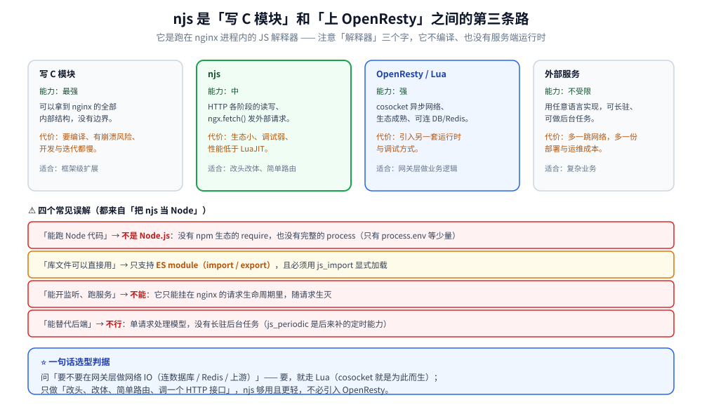
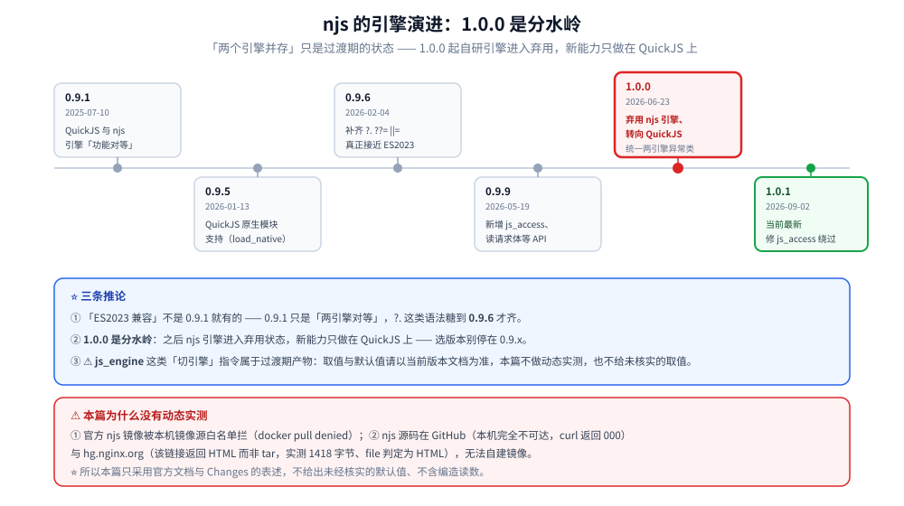

# njs模块与动态脚本

> Nginx 官方的 JavaScript 引擎（njs）：它的定位与能力边界、引擎演进（自研 → QuickJS）、
> 可用指令与 JS 侧 API、典型应用场景，以及与 Lua（OpenResty）的取舍。
>
> 素材来源：njs 官方文档（`nginx.org/en/docs/njs/`）与官方 Changes 的独立整理。
> ⚠️ **本篇为本机唯一未做动态实测的一篇**，原因见文末「实测口径与未实测说明」；
> 涉及行为判断的段落均标注了依据（官方文档 / Changes），**不含编造的读数**。
> 目录级实测口径见 [README.md](README.md) 第四节。

---

## 一、njs 是什么，能力边界在哪？

**本节要点**：njs 是**跑在 nginx 进程内的 JS 解释器**，用来在小规模场景下
替代「写 C 模块」—— ⚠️ 但它**不是 Node.js**，也**不是完整的 ES 运行时**。

### 1.1 定位：与三条路对比

| 方式 | 语言 | 能力 | 代价 |
|---|---|---|---|
| 写 C 模块 | C | ⭐ 最强（可拿全部内部结构） | 编译、崩溃风险、开发慢 |
| **njs** | JavaScript | 中（HTTP 阶段的读写、`ngx.fetch` 发请求） | ⚠️ 生态小、调试弱、性能低于 LuaJIT |
| **OpenResty / Lua** | Lua + LuaJIT | ⭐ 强（`cosocket` 异步网络、生态成熟） | 引入另一套运行时（见 [14-OpenResty生态.md](14-OpenResty生态.md)） |
| 外部服务 | 任意 | 不受限 | 多一跳网络与运维成本 |

⭐ 判据：**「要不要在网关层做网络 IO（连数据库/Redis/上游）」**
—— 要 → 走 Lua（`cosocket` 是为此而生）；只做"改头、改体、简单路由、调一个 HTTP 接口"
→ **njs 够用且更轻**（不必引入 OpenResty）。

### 1.2 njs 不是什么

| 常见误解 | 事实 |
|---|---|
| "能跑 Node 代码" | ❌ **不是 Node.js**：没有 `require` 的 npm 生态、没有 `process` 全套（只有 `process.env` 等少量） |
| "库文件可以直接用" | ⚠️ 只支持 **ES module（`import` / `export`）**，要用 `js_import` 显式加载 |
| "能开监听、跑服务" | ❌ 只能挂在 nginx 的请求生命周期里，不能自己起服务 |
| "能替代后端" | ❌ 单请求处理模型，**没有长驻后台任务**（`js_periodic` 是后来补的定时能力） |

### 1.3 JS 侧的核心 API（按用途分类）

| 用途 | API |
|---|---|
| 读请求 | `r.method` / `r.uri` / `r.args` / `r.headersIn` / `r.variables` |
| 写响应 | `r.return(status, body)` / `r.headersOut` / `r.sendHeader()` / `r.send()` |
| 读请求体 | ⭐ `r.readRequestText()` / `r.readRequestArrayBuffer()` / `r.readRequestJSON()` / `r.readRequestForm()`（0.9.9+） |
| 发子请求 | `r.subrequest(uri)` |
| 发外部请求 | ⭐ `ngx.fetch()`（支持 keepalive、HTTP 代理） |
| 跨请求共享 | ⭐ `ngx.shared`（SharedDict，需要 `js_shared_dict_zone` 声明） |
| 定时任务 | `setTimeout` 等（0.9.9 起有 `js_periodic` 指令） |
| 加解密 | `crypto` / `crypto.subtle`（WebCrypto 子集） |
| 压缩与编码 | `zlib`（含 **zstd**）、`Buffer`、`TextEncoder` / `TextDecoder` |

⭐ `ngx.shared` 是 njs 里最贴近"状态"的能力 —— 它对应 nginx 的
**共享内存 zone**（与 C 模块的 `ngx_slab_pool_t` 同一层，见
[16-模块开发实战.md](16-模块开发实战.md)），可用来做限流计数、缓存去重。



## 二、引擎演进：从自研到 QuickJS

**本节要点**：⭐ **这是理解 njs 现状最关键的一条** ——
**1.0.0 起 njs 弃用自研引擎、转向 QuickJS**，所以"两个引擎并存"只是过渡期的状态。

### 2.1 版本时间线（官方 Changes）

| 版本 | 日期 | 关键变化 |
|---|---|---|
| 0.9.1 | 2025-07-10 | ⭐ **QuickJS 与 njs 引擎「功能对等」**（此前 QuickJS 是残的） |
| 0.9.5 | 2026-01-13 | ⭐ QuickJS **原生模块**支持：`js_load_http_native_module` / `js_load_stream_native_module` |
| 0.9.6 | 2026-02-04 | ⭐ **补齐 `?.` / `??=` / `\|\|=` / `&&=`** —— 即真正接近 ES2023 |
| 0.9.9 | 2026-05-19 | 新增 `js_access` 指令、`r.readRequestText / ArrayBuffer / JSON / Form`、`jsVarNames()` |
| **1.0.0** | **2026-06-23** | ⭐⭐ **弃用 njs 引擎、转向 QuickJS**；统一两引擎的异常类（API 误用 → `TypeError`，越界 → `RangeError`） |
| **1.0.1** | **2026-09-02** | 当前最新；修 `js_access` 的访问控制绕过（见 2.3） |

⭐ 三条重要推论：
① **「ES2023 兼容」不是 0.9.1 就有的** —— 0.9.1 只是"两引擎对等"，
`?.` 这类语法糖到 **0.9.6** 才齐；
② **1.0.0 是分水岭**：之后 njs 引擎进入弃用状态，新能力只做在 QuickJS 上；
③ ⚠️ **`js_engine` 这类"切引擎"的指令属于过渡期产物**
—— 引擎取值与默认值请以当前版本的 `ngx_http_js_module` 文档为准，
本目录不做动态实测（原因见文末），**不在此处给出未经核实的取值**。

### 2.2 指令清单（HTTP 侧）

⚠️ 以下指令名来自官方 Changes 与 Reference 的交叉确认；
**具体取值与默认值以 `ngx_http_js_module` 文档为准**（本篇未做实测，不照抄可能过期的默认值）：

| 指令 | 用途 |
|---|---|
| `js_import` | ⭐ 加载 JS 模块（ES module），是使用 njs 的第一步 |
| `js_content` | 用 JS 函数当 content handler（产生响应） |
| `js_access` | ⭐ 用 JS 函数做访问控制（0.9.9+，等价于 `auth_request` 的 njs 版） |
| `js_set` | 用 JS 函数计算一个变量的值 |
| `js_var` | 声明一个可写变量（0.5.3+ 支持 http/stream） |
| `js_header_filter` | 改响应头 |
| `js_body_filter` | 改响应体（与 C 模块的 body filter 同层，见 [09-HTTP过滤模块.md](09-HTTP过滤模块.md)） |
| `js_periodic` | 定时任务 |
| `js_shared_dict_zone` | ⭐ 声明共享内存字典（对应 JS 侧 `ngx.shared`） |
| `js_fetch_proxy` | 给 `ngx.fetch()` 配代理 |
| `js_fetch_trusted_certificate` | `ngx.fetch()` 的受信 CA |
| `js_path` | 模块搜索路径 |
| `js_load_http_native_module` | 加载 QuickJS 原生模块（0.9.5+） |

### 2.3 安全修复（用 njs 必须跟版本）

| CVE | 版本 | 问题 |
|---|---|---|
| CVE-2026-8711 | 0.9.9 修 | `js_fetch_proxy` 的值若含**来自客户端请求的变量**（`$http_*` / `$arg_*` / `$cookie_*`），再调用 `ngx.fetch()` → **worker 堆溢出** |
| CVE-2026-18329 | 1.0.1 修 | `js_access` 里**异步请求体读取出错或未处理的 rejection** 时，nginx 会**当作鉴权通过继续处理**（访问控制绕过） |

⭐ 两条教训都很实用：
① **别把客户端可控的变量拼进安全相关的指令值**（代理地址、鉴权目标）；
② **鉴权函数里的异步路径必须显式处理失败** —— "异常被吞掉"在鉴权场景是**放行**，
不是拒绝。这条对任何语言写的鉴权中间件都成立。



## 三、典型应用场景

**本节要点**：njs 的甜区是**"无状态、单请求、轻量改写"**。凡是需要长期状态或
复杂网络交互的，都不该交给它。

### 3.1 适合的

| 场景 | 为什么合适 |
|---|---|
| ⭐ **边缘动态路由** | 按 header / cookie / 地理信息挑后端；比 `map` + `if` 的表达力强，比 Lua 轻 |
| ⭐ **无状态鉴权** | 校验 JWT（`crypto.subtle` 能做 HMAC / RSA 验签），不用引入外部服务 |
| **响应改写** | 改 header（加 CORS、安全头）、按内容改 body |
| **请求体路由** | ⭐ 读 JSON body 里的字段决定路由 —— 这是 1.31.5 起
`ngx_http_json_module` 也能做的事（见 [01-编译安装与配置.md](01-编译安装与配置.md) 第七节），
**优先用后者**（原生模块，不必起 JS 运行时） |
| **简单限流** | 用 `js_shared_dict_zone` + 计数（但生产级限流用官方 `limit_req` 更稳） |

### 3.2 不适合的

| 场景 | 为什么不合适 |
|---|---|
| ❌ **连数据库 / Redis** | 没有 `cosocket` 那样的原生异步网络栈；`ngx.fetch()` 只能发 HTTP |
| ❌ **重 CPU 计算** | ⚠️ 跑在 **worker 事件循环里**，长计算直接**阻塞该 worker 的所有连接** |
| ❌ **长驻后台任务** | 请求模型驱动，没有独立的调度器 |
| ❌ **大流量热路径** | 解释执行 + 无 LuaJIT 级别的 JIT，性能明显低于 OpenResty |

⭐ **判据一句话**：**"这个逻辑会不会占用 worker 的 CPU 时间片去做网络等待或重计算？"**
会 → 别用 njs。

### 3.3 与 Lua（OpenResty）的取舍

| | njs | Lua（OpenResty） |
|---|---|---|
| 语言生态 | ⭐ JavaScript（前端团队上手快） | Lua（生态集中，`lua-resty-*` 成熟） |
| 异步网络 | `ngx.fetch()`（仅 HTTP） | ⭐ **`cosocket`**（TCP / UDP / TLS，任意协议） |
| 性能 | 中 | ⭐ 高（LuaJIT） |
| 依赖 | **内置官方模块**，装上就有 | 需要换成 OpenResty 发行版 |
| 定位 | "够用的脚本层" | "网关层开发平台" |

⭐ 一句话选型：**团队是 JS 背景 + 只做轻量改写 → njs**；
要在网关层做完整的业务逻辑（鉴权+限流+缓存+服务发现）→ **OpenResty**。
两者的详细对比见 [14-OpenResty生态.md](14-OpenResty生态.md)。

## 使用

**1. 一个 njs 的骨架（结构示意，⚠️ 未在本机实测）**：

```text
# nginx.conf
http {
    js_import  my from /etc/nginx/js/my.js;      # ⭐ 先加载模块
    js_shared_dict_zone zone=rl:1m;              # 共享内存字典

    server {
        listen 8080;
        location /hello { js_content my.hello; }
        location /guard { js_access  my.check; }
    }
}
```

```javascript
// /etc/nginx/js/my.js
function hello(r) {
    r.return(200, "hello from njs\n");
}

async function check(r) {
    // ⚠️ 鉴权里必须显式处理失败：异常被吞掉 = 放行（CVE-2026-18329 的教训）
    try {
        const token = r.headersIn['Authorization'];
        if (!token) { r.return(401); return; }
        r.return(204);          // 2xx 放行（同 auth_request 语义）
    } catch (e) {
        r.return(500);          // ⭐ 出错一律拒绝，不放过
    }
}

export default { hello, check };
```

**2. 判断该不该用 njs 的三问**：

```text
① 这段逻辑需要在网关层做非 HTTP 的网络 IO 吗？  是 → 用 Lua
② 它会占用 worker 做重计算或长时间等待吗？      是 → 挪出去（后端服务）
③ 它只是「读请求 → 算一下 → 改响应」吗？        是 → ✅ njs 合适
```

**3. 用 njs 的版本纪律**：

```text
① 至少 1.0.1（修了 js_access 的访问控制绕过）
② 若在意 ES2023 语法糖（?. / ??=），至少 0.9.6
③ ⚠️ 别把 $http_* / $arg_* / $cookie_* 拼进 js_fetch_proxy 的值（CVE-2026-8711）
④ 鉴权函数里所有异常路径都要显式 r.return(4xx/5xx)
```

## 延伸追问

### 1. QuickJS 和 njs 自研引擎的性能对比？

⚠️ **本篇不做性能断言**（未实测）。可以说的是**方向**：QuickJS 是一个成熟的
独立 JS 引擎，njs 自研引擎则是为 nginx 场景精简实现的。
⭐ 两者**在 0.9.1 达成功能对等**、**在 1.0.0 完成向 QuickJS 的切换**，
所以现在更值得关注的不是"哪个快"，而是**你的版本是否已在新引擎上**
（新能力只做在 QuickJS 侧）。

### 2. njs 能做 WebSocket 代理吗？

⚠️ **不建议**。njs 的 API 是**请求-响应模型**（`r.headersIn` / `r.return`），
没有"连接保持 + 双向帧"的原生接口。⭐ WebSocket 代理应该用：
① `proxy_pass` 配合 `Upgrade` / `Connection` 头的经典做法；
② 需要协议级处理时用 OpenResty 的 `cosocket`（它能拿到裸 TCP）。

### 3. njs 适合替代后端服务吗？

**不适合**，原因是模型不同而不是性能问题：njs 代码**跑在请求的生命周期里**，
请求结束代码就结束 —— 没有连接池管理、没有后台任务、没有持久状态
（`ngx.shared` 是进程级共享内存，不是数据库）。
⭐ 把业务逻辑放进网关，还会让**网关的发布节奏与业务耦合** —— 这是架构问题。

### 4. `ngx.shared` 的数据会丢吗？

会。它是**共享内存**（worker 退出、reload、宕机都清空；且**每个 nginx 实例各一份**，
多机部署不共享）。⭐ 所以它只适合**可丢的加速数据**（限流计数、去重窗口、短缓存），
**不能当存储用**。这条与 C 模块的 slab 共享内存完全一致
（见 [05-内存管理与数据结构.md](05-内存管理与数据结构.md) 第二节）。

## 实测口径与未实测说明

⚠️ **本篇是本目录唯一没有动态实测的篇目**。原因有两条，都是本机环境的硬约束：

| 尝试 | 结果 |
|---|---|
| `docker pull nginx:mainline-alpine-njs`（官方 njs 镜像） | ❌ `denied` —— 本机镜像源白名单不含该仓库 |
| 从源码编译（`--add-module=<njs源码>/nginx`） | ❌ njs 源码只在 GitHub 与 `hg.nginx.org`；**GitHub 不可达**（curl 返回 `000`），`hg.nginx.org` 返回的是 HTML 页面而非 tar 包（实测 1418 字节、`file` 判定为 HTML） |

⭐ 因此本篇**只采用官方文档与官方 Changes 的表述**，并做了两点处理：
① **不给出未经核实的默认值**（如 `js_engine` 的取值）；
② **不含任何编造的运行时读数**。
✅ 可复现路径（供后续补测）：换一台能访问 GitHub 的机器，
或用 `nginx:mainline-alpine-njs` 镜像；镜像与配置脚本可直接复用本目录
`README.md` 第四节记录的容器口径。

## 关联

- [README.md](README.md) — 本目录导读与实测口径
- [09-HTTP过滤模块.md](09-HTTP过滤模块.md) — `js_header_filter` / `js_body_filter` 对应的 C 实现
- [10-HTTP变量机制.md](10-HTTP变量机制.md) — `js_set` / `js_var` 与 C 侧变量注册的对应
- [14-OpenResty生态.md](14-OpenResty生态.md) — Lua 路线的生态与版本增量
- [15-Tengine生态.md](15-Tengine生态.md) — Tengine **内置了 Lua 模块**（另一条路线）
- [01-编译安装与配置.md](01-编译安装与配置.md) — `ngx_http_json_module`（读 body 字段的原生替代）
- [OpenResty.md](../../../03-数据与中间件/中间件/网关与代理/OpenResty.md) — Lua 的完整用法与实测
