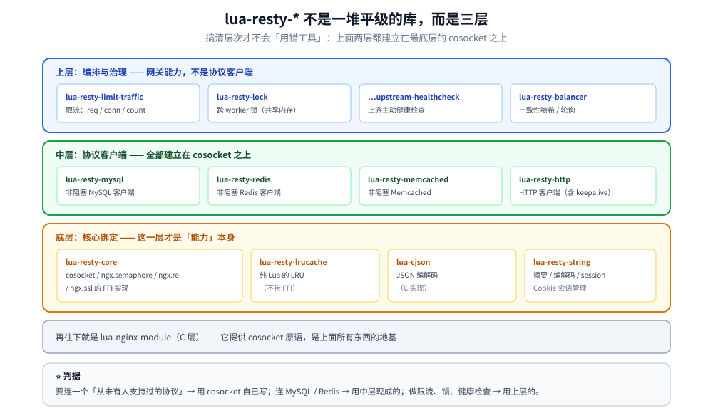
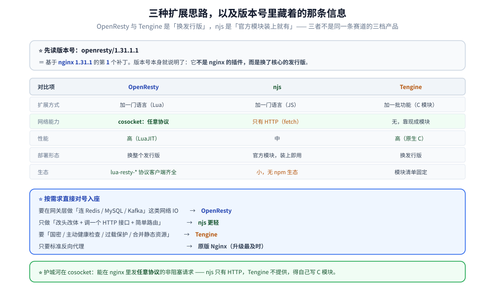

# OpenResty生态

> **只写生态与版本增量**：LuaJIT 的定位、`lua-resty-*` 的分层地图、
> 1.31.1.1 的变更清单，以及与 njs / Tengine 内置 Lua 的取舍。
>
> ⚠️ **本篇不重复 Lua 语法、11 阶段模型、`cosocket` 三条硬限制、典型应用** ——
> 那些在 [OpenResty.md](../../../03-数据与中间件/中间件/网关与代理/OpenResty.md)（800+ 行、带本机实测）里。
> 本篇只回答「**1.29.2 → 1.31.1 又多了什么、生态里有什么、该不该选它**」。
>
> 素材来源：OpenResty 官方 Release Notes（`openresty.org/cn/changelog-1031001.html`）
> 与官方博客独立整理。实测口径见本目录 [README.md](README.md) 第四节；
> 本篇读数取自本机 Docker `openresty/openresty:1.31.1.1-alpine`。

---

## 一、版本坐标：1.31.1.1 是什么

**本节要点**：OpenResty 的版本号是 **`<nginx版本>.<补丁号>`**，
所以 `1.31.1.1` 读作「基于 **nginx 1.31.1** 的第 1 个补丁」。

### 1.1 本机实测的版本全貌

```text
$ openresty -v
nginx version: openresty/1.31.1.1

$ openresty -V          # 关键行
built by gcc 15.2.0 (Alpine 15.2.0)

$ luajit -v
LuaJIT 2.1.ROLLING -- Copyright (C) 2005-2026 Mike Pall. https://luajit.org/
```

⭐ **版本号本身就说明了它与 Nginx 的关系**：OpenResty **不是** nginx 的插件，
而是**换了核心的发行版**（自己编译 nginx + 打进 Lua 模块）。

### 1.2 1.29.2 → 1.31.1 的核心变化

| 组件 | 变化 |
|---|---|
| **nginx 核心** | **1.29.2 → 1.31.1** |
| **OpenSSL** | **3.5.5 → 3.5.6**（⭐ 已过 3.5.1，HTTP/3 的 0-RTT 门槛，见 [11-HTTP3与QUIC支持.md](11-HTTP3与QUIC支持.md) 1.2） |
| **LuaJIT** | **v2.1-20260415**（`LuaJIT 2.1.ROLLING`）：新增 `ffi.abi("dualnum")` |
| lua-nginx-module | **v0.10.31** |
| stream-lua-nginx-module | **v0.0.19** |
| lua-resty-core | **v0.1.34**（release notes 写 `v0.1.34rc2`，⭐ **实测回显是 `0.1.34`**） |

⭐ 附带读数：`ngx.config.ngx_lua_version` 实测为 **`10031`** —— 这是
`v0.10.31` 的数字编码（`10031` = `10` + `031`）。
**它可以在运行期核对 lua-nginx-module 的实际版本**，比只看 `nginx -V` 更直接：

```text
$ curl ... /restycore
lua-resty-core = 0.1.34 ngx.config.ngx_lua_version = 10031
```

### 1.3 1.31.1.1 的新增能力（逐项实测）

**① `precontent_by_lua` 指令（新增阶段）**

配置里使用后 `nginx -t` 通过 —— **指令存在且被接受**：

```text
$ nginx -t -c /tmp/or.conf
nginx: the configuration file /tmp/or.conf syntax is ok
nginx: configuration file /tmp/or.conf test is successful
```

⭐ 它的意义：在 **`content` 阶段之前**插一个 Lua 阶段，用来做
「先算好数据、再交给 content 阶段（或上游）」。对应官方文档里
「11 个阶段 + Lua 专属阶段」的映射（那个映射见既有
[OpenResty.md](../../../03-数据与中间件/中间件/网关与代理/OpenResty.md)，
**本篇不重复**）。

**② `proxy_ssl_verify_by_lua*` 指令（新增）**

⭐ **实测拿到一个明确的语义约束**——把它配在非 https 的代理 location 上会直接报错：

```text
$ nginx -t -c /tmp/or.conf      # 该 location 里 proxy_pass http://...
nginx: [emerg] proxy_ssl_verify_by_lua* should be used with proxy_pass https url
```

⭐ 而配成 `proxy_pass https://…` 之后**校验通过**（`syntax is ok` / `test is successful`）。
这条读数的价值在于：**报错信息本身就说明"指令被识别了、只是前置条件不满足"**
—— 这是判断「指令到底存不存在」的实用方法。

**③ LuaJIT `ffi.abi("dualnum")`（新增 API）**

```text
$ luajit -e 'local ffi=require("ffi"); print(ffi.abi("dualnum"), ffi.abi("64bit"), ffi.abi("gc64"))'
true    true    true
```

⭐ `ffi.abi()` 是 **LuaJIT 提供的 ABI 自省接口**：写 FFI 代码时可以用它判断
「当前构建启用了哪些特性」（`dualnum` = 双精度数字拆分表示、`gc64` = 64 位 GC），
避免为不同架构写两套宏。⚠️ 本机实测**三个都是 true**，
说明这个 Alpine x86_64 构建启用了 `DUALNUM` 与 `GC64`。

### 1.4 其余变更（官方 Release Notes 摘录）

| 能力 | 说明 |
|---|---|
| 取 server random / master key 的 Lua API | TLS 调试与自研协议用得上 |
| `tcpsock:getsslsession` / `tcpsock:settrustedstore()` | ⭐ **每次握手可指定受信 CA**（多租户网关场景有用） |
| `sock:getsslpointer()` / `sock:getsslctx()` | 拿到裸 SSL 指针，可写更深的 TLS 逻辑 |
| TCP `keepintvl` / `keepcnt` | 与 `keepidle` 配套，控制探活次数与间隔 |
| 下游套接字实现 `serversslhandshake` | stream 子系统用 |
| UDP cosocket 支持 `reuseport` | 多 worker 绑同一 UDP 端口（QUIC 场景） |
| `ngx.header['WWW-Authenticate']` 支持 table 多值 | 多认证方案的质询头 |
| 修复：QUIC 连接关闭 / worker 关闭 / SSL 缓存相关的多个崩溃 | ⭐ 用 QUIC 的要注意这条 |

## 二、`lua-resty-*` 分层地图

**本节要点**：`lua-resty-*` 不是一堆平级的库，而是**三层**：
**核心 FFI 绑定层 → 协议客户端层 → 上下层框架**。搞清层次才不会"用错工具"。

### 2.1 三层结构

```text
┌─ 上层：编排与治理 ────────────────────────────────────────┐
│  lua-resty-limit-traffic   限流（req/conn/count）         │
│  lua-resty-lock            跨 worker 锁（基于共享内存）    │
│  lua-resty-upstream-healthcheck  上游健康检查             │
│  lua-resty-balancer        一致性哈希 / 轮询              │
│  （这些是"网关能力"，不是"协议客户端"）                    │
├─ 中层：协议客户端 ────────────────────────────────────────┤
│  lua-resty-mysql / -redis / -memcached / -http            │
│  ⭐ 全部建立在 cosocket 之上（非阻塞 TCP/TLS）            │
├─ 底层：核心绑定 ──────────────────────────────────────────┤
│  lua-resty-core        ⭐ cosocket / ngx.semaphore /       │
│                          ngx.re / ngx.ssl 的 FFI 实现      │
│  lua-resty-lrucache    纯 Lua 的 LRU（无 FFI）            │
│  lua-cjson             JSON 编解码（C 实现）               │
│  lua-resty-string      摘要 / 编解码                       │
│  lua-resty-session     Cookie 会话管理                     │
└───────────────────────────────────────────────────────────┘
        ↑ 再往下就是 lua-nginx-module（C 层，提供 cosocket 原语）
```

⭐ **判据**：**「我要连一个从未支持的协议」→ 用 cosocket 自己写**；
「连 MySQL / Redis → 用中层现成的」；「做限流、锁、健康检查 → 用上层的」。

### 2.2 本机实测的两个组件版本

```text
lua-resty-core = 0.1.34
ngx.config.ngx_lua_version = 10031
```

⭐ `lua-resty-core` 是**必须最先关注**的组件 —— 它是 cosocket 等能力的
FFI 实现，**与 lua-nginx-module 的版本强耦合**：
⚠️ 版本不匹配的典型症状是 `attempt to index global 'ngx'` 之类的方法找不到，
或者在升级 OpenResty 时只换了部分组件。

### 2.3 其他组件（1.31.1.1 的升级清单，官方 Release Notes）

```text
ngx_postgres            → v1.1
xss-nginx-module        → v0.07（新增动态模块构建支持）
lua-resty-mysql         → v0.30（⭐ 新增 ed25519 支持）
echo-nginx-module       → v0.64
lua-upstream-nginx-module      → v0.08
lua-resty-upstream-healthcheck → v0.09
lua-resty-string        → v0.17（⭐ 新增 AES-256-CTR 绑定）
lua-cjson               → v2.1.0.17（⭐ 解码允许注释 / 编码可缩进）
drizzle-nginx-module    → v0.1.13
```

⭐ 三条值得注意的：
① **`lua-resty-mysql` 加 ed25519** —— 对应 MySQL 8 的
`caching_sha2_password` 认证插件，**用 Lua 连 MySQL 8 时的常见坑**；
② **`lua-cjson` 允许注释** —— 现实中的 JSON 常带注释，这条省掉一次预处理；
③ **`lua-resty-string` 加 AES-256-CTR** —— 之前只有更弱的模式。



## 三、OpenResty / njs / Tengine 的取舍

**本节要点**：三者是**三种不同的扩展思路**，不是同一条赛道的三档产品。

### 3.1 三种思路

| | OpenResty | njs | Tengine |
|---|---|---|---|
| 扩展方式 | **加一门语言**（Lua + LuaJIT） | **加一门语言**（JS / QuickJS） | **加一批功能**（C 模块） |
| 网络能力 | ⭐ **`cosocket`**：TCP / UDP / TLS 任意协议 | 只有 `ngx.fetch()`（HTTP） | 无（用现成模块） |
| 性能 | ⭐ 高（LuaJIT） | 中 | ⭐ 高（原生 C） |
| 部署形态 | ⭐ **换整个 nginx 发行版** | 官方模块，装上就有 | 换发行版 |
| 生态 | ⭐ `lua-resty-*`（协议客户端齐全） | 小（无 npm 生态） | 模块清单固定 |

### 3.2 判据

```text
要在网关层做「连 Redis / MySQL / Kafka」这类网络 IO  → ⭐ OpenResty
只做「改头改体 + 调一个 HTTP 接口 + 简单路由」       → njs 更轻
要「国密 / 主动健康检查 / 过载保护 / 合并静态资源」   → Tengine
只要标准反向代理                                     → 原版 Nginx（升级最及时）
```

⭐ 关键区别在 **`cosocket`**：它是 OpenResty 的护城河。
**能在 nginx 里发任意协议的非阻塞请求**这件事，njs 做不到（只有 HTTP），
Tengine 不提供（要靠 C 模块自己写）。

### 3.3 一个容易被忽略的组合

⭐ **Tengine 内置了 `ngx_http_lua_module`**（本目录
[15-Tengine生态.md](15-Tengine生态.md) 2.1 实测：`modules/` 目录里有
`ngx_http_lua_module`）。也就是说「Lua + Tengine 的增强模块」是可以叠加的
—— 但要自己编译，且**这样就不再是 OpenResty 的 `lua-resty-*` 生态**
（版本与兼容性都要自己兜）。



## 使用

**1. 确认你的 OpenResty 到底是什么版本**（比看文档可靠）：

```text
# 三行拿到全部关键版本
openresty -v                                   # nginx + OpenResty 版本号
luajit -v                                      # LuaJIT 版本
# 运行期核对（⭐ 最准，因为它读的是真实加载的模块）
location /ver {
    content_by_lua_block {
        ngx.say("lua-resty-core=", require("resty.core").version)
        ngx.say("ngx_lua_version=", ngx.config.ngx_lua_version)
    }
}
```

**2. 判断某个新指令是否存在**（不用翻文档）：

```text
把它写进一个最小配置 → nginx -t
无输出 / 语法 ok          → ✅ 存在
unknown directive "xxx"   → ❌ 不存在
其他语义错误               → ✅ 存在，但用法不对
   例：proxy_ssl_verify_by_lua* should be used with proxy_pass https url
```

⭐ 第三条（"其他语义错误"）最容易被误判成"没有这个指令"——
**语义错误恰恰证明指令被识别了**。

**3. 检查 LuaJIT 的构建特性**（写 FFI 前必做）：

```bash
luajit -e 'local ffi=require("ffi")
  for _, k in ipairs({"dualnum","64bit","gc64","win","softfp","hardfp","le","instvm"}) do
    print(k, tostring(ffi.abi(k)))
  end'
```

## 延伸追问

### 1. cosocket 和 `ngx.fetch` 的区别？

⭐ **能力范围不同**，不是性能差异：
① `cosocket` 支持 **TCP / UDP / TLS** 三种传输，**可以连任意后端**（MySQL、Redis、Kafka、自研协议）；
② `ngx.fetch`（njs）**只能发 HTTP**。
⚠️ 另一条区别是**生态**：OpenResty 已经把常用后端都封装好了
（`lua-resty-mysql` / `-redis` …），njs 侧没有对应的库，
**要自己按协议手搓**。所以「能不能连」是能力问题，
「有没有现成库」才是效率问题。协议的完整约束见
[OpenResty.md](../../../03-数据与中间件/中间件/网关与代理/OpenResty.md)。

### 2. OpenResty 的性能瓶颈在哪？

三个方向（按常见程度）：
① ⭐ **Lua 代码里的同步阻塞** —— 一旦用了阻塞 IO（`io.read`、`os.execute`），
**整个 worker 的事件循环就停了**（`cosocket` 存在的全部意义就是避免这件事）；
② **`lua-resty-lrucache` 的命中率** —— 它是 per-worker 的，多 worker 命中率会摊薄；
③ **FFI 的边界开销** —— 大量小 cdata 对象的分配与 GC。
⭐ 判据：**先用 `ngx.now()` 分段计时**（本目录既有 OpenResty 篇有这套方法），
别凭感觉优化。

### 3. 什么时候选 OpenResty 而不是 njs？

三条判据，**满足任一条就选 OpenResty**：
① 要连**非 HTTP 的后端**（数据库 / 缓存 / 消息队列）；
② 要在网关层做**完整的业务编排**（而不只是改写）；
③ 团队已有 Lua / OpenResty 经验（迁移成本为零）。
⭐ 反之，如果只是「加个 CORS 头 + 简单 JWT 校验」，
**引入 OpenResty 是过度设计** —— 那会把你绑在一个自己的 nginx 发行版上。

### 4. 1.31.1.1 的 `precontent_by_lua` 该配合什么用？

⚠️ **本篇不猜测组合用法**（增量视角，只报"这个阶段存在"）。
可以说的是**它解决的问题**：在 **content 阶段之前**准备好数据，
让 content 阶段（或上游代理）直接使用 —— 也就是把「准备」与「产出」分开。
⭐ 具体能与哪些阶段/模块组合，以官方文档的
「Lua 指令与 nginx 阶段的映射」为准（既有
[OpenResty.md](../../../03-数据与中间件/中间件/网关与代理/OpenResty.md) 里有完整的阶段映射表）。

### 5. 为什么 OpenResty 要自己维护 OpenSSL？

因为它**需要比系统版本更新的 TLS 能力**。⭐ 本机实测的编译参数就能看出来：
`-I/usr/local/openresty/openssl3/include`、`-Wl,-rpath,/usr/local/openresty/openssl3/lib`
—— 它**自带一份 OpenSSL 3**（本版本 3.5.6）。
好处是「版本可控、QUIC/国密等特性齐」；
⚠️ 代价是**系统 OpenSSL 的安全更新不会自动到 OpenResty 上**，
要跟着 OpenResty 的发布升级。

## 关联

- [README.md](README.md) — 本目录导读与实测口径
- [13-njs模块与动态脚本.md](13-njs模块与动态脚本.md) — njs 路线（另一种"加语言"）
- [15-Tengine生态.md](15-Tengine生态.md) — Tengine 内置 Lua 模块（另一种组合）
- [11-HTTP3与QUIC支持.md](11-HTTP3与QUIC支持.md) — OpenSSL 3.5.1 门槛与本版本 3.5.6 的关系
- [16-模块开发实战.md](16-模块开发实战.md) — 共享内存 / 限流在 C 模块里怎么写（与 Lua 侧对照）
- [OpenResty.md](../../../03-数据与中间件/中间件/网关与代理/OpenResty.md) — **完整用法**（Lua 语法、11 阶段、cosocket 硬限制、六个典型应用，均带实测）
- [网关选型对比.md](../../../03-数据与中间件/中间件/网关与代理/网关选型对比.md) — Nginx 作网关的能力边界四组实测
