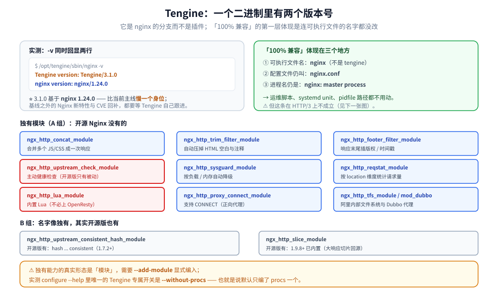
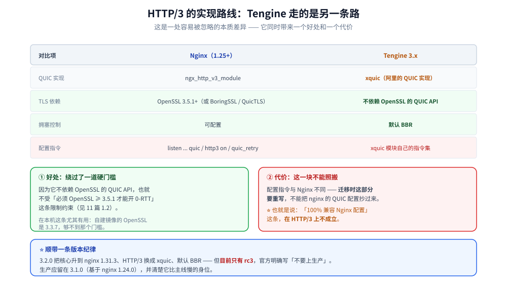

# Tengine生态

> Tengine 是什么、与 Nginx 的关系、独有模块清单与它们解决什么问题、
> 3.x 的新特性，以及 Tengine / OpenResty / Nginx 三者怎么选。
>
> 素材来源：Tengine 官方文档与 Release Notes 的独立整理；**本篇有本机实测**——
> 从 `tengine.taobao.org` 下载源码自建镜像（`gcc 14.2.0 (Alpine)`）编译并运行，
> 读数见各节。实测口径见本目录 [README.md](README.md) 第四节。
>
> ⚠️ **官方镜像不可用的原因**：`tengine/tengine` 与 `alibaba/tengine` 均被本机
> 镜像源白名单拦（`this image is not in the allowlist`），**GitHub 也不可达**
> （curl 返回 `000`）；但 **`tengine.taobao.org` 可达（200）**，故改为源码自建。

---

## 一、Tengine 是什么，和 Nginx 什么关系？

**本节要点**：Tengine 是**淘宝发起的 Nginx 分支**，主打「**100% 兼容 Nginx + 一批生产向增强**」。
⭐ 它的定位与 OpenResty 不同：**OpenResty 是"加一门语言"，Tengine 是"加一批功能"**。

### 1.1 实测：一个二进制里有两个版本号

```text
$ /opt/tengine/sbin/nginx -v
Tengine version: Tengine/3.1.0
nginx version: nginx/1.24.0
```

⭐ **3.1.0 基于 nginx 1.24.0**（这是本机实测确认的，不是文档抄来的）。
⚠️ 版本坐标很重要：**Tengine 跟的是 Nginx 的某一个基线版本**，基线之外的
Nginx 新特性（以及新 CVE 修复）要等 Tengine 自己跟进。当前的演进是：

| Tengine | 基于 nginx | 状态 |
|---|---|---|
| **3.1.0** | **1.24.0** | ✅ 本机实测；官网正式版 |
| 3.2.0-rc3 | 1.31.3 | ⚠️ 仅 rc（2026-08-11），官方标注「请勿上生产」 |

⭐ 所以「Tengine 是不是最新 Nginx」这个问题的答案是：**不是，它慢一个身位**。
这条对本目录讨论的所有 CVE（如 rewrite 堆溢出 CVE-2026-9256）都成立 ——
**3.1.0 基于 1.24.0，需要等 Tengine 自己回补**。

### 1.2 实测：二进制名是 `nginx`，不是 `tengine`

```text
$ ls -la /opt/tengine/sbin/
-rwxr-xr-x    1 root     root       5393384 ... nginx
```

⭐ 「100% 兼容」的第一层体现是**连可执行文件的名字都不改** —— 运维脚本、
systemd unit、`pidfile` 路径都不用动。同样地，**配置文件仍叫 `nginx.conf`**，
进程名仍是 `nginx: master process`。

### 1.3 实测：标准 nginx 配置可直接跑

把一份标准 Nginx 配置（`upstream` + `proxy_pass` + `proxy_set_header` +
`add_header always` + `stub_status`）交给 Tengine：

```text
$ nginx -t -c /tmp/t2.conf
nginx: the configuration file /tmp/t2.conf syntax is ok
nginx: configuration file /tmp/t2.conf test is successful

$ curl -s http://127.0.0.1:19500/         # 代理到 upstream
backend
$ curl -s http://127.0.0.1:19500/stub     # stub_status
Active connections: 1  server accepts handled requests request_time ...
```

⭐ 这是「100% 兼容」的**第二层**：不只是名字兼容，**语义也兼容**。
所以迁移成本基本为零（但反向不成立：用了 Tengine 独有指令后就锁定了）。

## 二、独有模块：Tengine 到底多了什么

**本节要点**：独有能力的**真实形态是"模块"**，需要 `--add-module` 显式编入；
⚠️ **默认编译的只有 `procs` 一个**（实测：`configure --help` 里唯一的 Tengine 专属开关
是 `--without-procs`）。

### 2.1 实测：源码里的完整独有模块清单

```text
$ ls /src/tengine/modules/
mod_common  mod_config  mod_dubbo  mod_strategy  mod_xudp
ngx_backtrace_module          ngx_debug_conn  ngx_debug_pool  ngx_debug_timer
ngx_http_concat_module        ngx_http_footer_filter_module
ngx_http_lua_module           ngx_http_proxy_connect_module
ngx_http_reqstat_module       ngx_http_slice_module
ngx_http_sysguard_module      ngx_http_tfs_module
ngx_http_trim_filter_module   ngx_http_upstream_check_module
ngx_http_upstream_consistent_hash_module
```

按用途分类：

| 模块 | 解决什么 | 对应 Nginx 侧的现状 |
|---|---|---|
| `ngx_http_concat_module` | 把多个 JS/CSS 合并成一次响应（`?a.js,b.js`） | 开源版无 |
| `ngx_http_trim_filter_module` | 自动压掉 HTML 里的空白/注释 | 开源版无（要 Lua 或 njs） |
| `ngx_http_footer_filter_module` | 在响应末尾插固定内容（如版权、时间戳） | 开源版无 |
| ⭐ `ngx_http_upstream_check_module` | **主动**上游健康检查 | ⚠️ 开源版**只有被动**（`max_fails`） |
| ⭐ `ngx_http_upstream_consistent_hash_module` | 一致性哈希（节点变更时少搬数据） | `hash ... consistent`（1.7.2+ 已有） |
| `ngx_http_sysguard_module` | 按负载（`load` / `memory`）自动降级 | 开源版无 |
| `ngx_http_reqstat_module` | 按 location 维度统计请求量 | 开源版无（要靠日志） |
| `ngx_http_slice_module` | 大响应切片回源 | 开源版 1.9.8+ 已有 |
| ⭐ `ngx_http_lua_module` | **内置 Lua 支持**（不必上 OpenResty） | 开源版无 |
| `ngx_http_proxy_connect_module` | 支持 CONNECT 方法（正向代理） | 开源版无 |
| `ngx_http_tfs_module` | 阿里 TFS 文件系统接入 | 开源版无 |
| `mod_dubbo` | Dubbo 协议代理 | 开源版无 |
| `ngx_backtrace_module` / `ngx_debug_*` | 崩溃栈回溯与连接/内存池/定时器调试 | 开源版无 |
| `procs` | ⭐ **独立进程机制**（把某类任务放到独立进程，隔离 CPU 干扰） | 开源版无；**且默认编译** |

### 2.2 实测：编入后 11 条独有指令全部生效

用 `--add-module=modules/<名>` 编入 7 个模块后（`nginx -V` 实测确认）：

```text
--add-module=modules/ngx_http_concat_module
--add-module=modules/ngx_http_trim_filter_module
--add-module=modules/ngx_http_footer_filter_module
--add-module=modules/ngx_http_upstream_check_module
--add-module=modules/ngx_http_sysguard_module
--add-module=modules/ngx_http_upstream_consistent_hash_module
--add-module=modules/ngx_http_reqstat_module
```

配置里使用独有指令 → **语法校验通过**：

```text
nginx: the configuration file /tmp/t3.conf syntax is ok
nginx: configuration file /tmp/t3.conf test is successful
```

涉及的独有指令（**全部被接受**）：

```text
concat on;  concat_max_files 10;              # ngx_http_concat_module
trim on;  trim_js on;                          # ngx_http_trim_filter_module
footer "<!-- powered by tengine -->\n";        # ngx_http_footer_filter_module
check interval=3000 rise=2 fall=3 timeout=1000 type=http;   # 主动健康检查
check_http_send "HEAD / HTTP/1.0\r\n\r\n";
check_http_expect_alive http_2xx http_3xx;
consistent_hash $request_uri;                  # 一致性哈希（按变量，不只按 IP）
check_status;                                  # 健康检查状态页
req_status_show;                               # reqstat 统计页
sysguard on;  sysguard_load load=100 action=/limit;
```

⭐ **反例对照**（不编入模块时的行为）：

```text
$ nginx -t -c /tmp/t1.conf        # 配置里写了 concat on;
nginx: [emerg] unknown directive "concat" in /tmp/t1.conf:12
```

**这组正反对比就是判据**：Tengine 的增强能力**不是"装了就有"，而是要显式编入**；
官方发行包（rpm/deb/apk）才会把全部模块都编上。

### 2.3 两个能力值得单独说

**① 主动健康检查（`upstream_check`）** —— 这是开源 Nginx 最常被诟病缺口。

| | Nginx 开源 | Tengine |
|---|---|---|
| 探测方式 | 被动（等真实请求失败） | ✅ 主动定时探活 |
| 首个请求 | ❌ 由真实用户承担失败 | ✅ 提前剔除 |
| 配置 | `max_fails` / `fail_timeout` | `check interval=... rise=... fall=...` |

实测：`check_status` 页面返回标准 HTML 状态表（本机 `/status` 拿到完整 HTML）。

**② `sysguard`** —— 按系统负载自动降级，实测 `/guarded` 返回 `guarded ok`
（负载未超阈值时正常放行）：

```text
sysguard on;
sysguard_load load=100 action=/limit;   # 超过则内部跳转到 /limit
```

⭐ 它解决的是**过载保护**：当机器本身快撑不住时，继续接流量只会雪崩，
不如主动返回 503 保住已有请求。这是开源版完全没有的能力。



## 三、3.x 的新特性

**本节要点**：3.2.0 的关键变化是**核心升级 + HTTP/3 换实现**；
⚠️ 但 3.2.0 目前**只有 rc**，生产应等 GA。

### 3.1 3.2.0 相对 3.1.0 的变化

| 项 | 3.1.0（本机实测） | 3.2.0-rc3 |
|---|---|---|
| nginx 核心 | **1.24.0** | 1.31.3 |
| HTTP/3 | ⚠️ **见 3.2** | ⭐ **xquic**（不依赖 OpenSSL 的 QUIC API） |
| 拥塞控制 | — | ⭐ **默认 BBR** |
| 国密 | TLCP/NTLS（SM2/SM3/SM4） | 同，改用 **Tongsuo** |
| 打包 | — | rpm / deb / apk + 多架构镜像，**全 feature（含 Lua）** |
| 发布状态 | 官网正式版 | ⚠️ **rc3，官方明确"不要上生产"** |

### 3.2 ⭐ HTTP/3 的实现路线与 Nginx 不同

⭐ **这是一处容易被忽略的本质差异**：Tengine 的 HTTP/3 **不走 nginx 的 QUIC 模块**，
而是用**自研/集成的 xquic 库**（阿里的 QUIC 实现）。

| | Nginx（1.25+） | Tengine 3.x |
|---|---|---|
| QUIC 实现 | `ngx_http_v3_module` | **xquic** |
| TLS 依赖 | OpenSSL 3.5.1+（或 BoringSSL/QuicTLS） | ⭐ **不依赖 OpenSSL 的 QUIC API** |
| 拥塞控制 | 可配 | **BBR 默认** |
| 配置指令 | `listen ... quic` / `http3 on` / `quic_retry` | 走 xquic 模块自己的指令集 |

⭐ 这个差异有两层含义：
① **好处** —— 绕过了「必须 OpenSSL ≥3.5.1 才能开 0-RTT」的硬门槛
（见 [11-HTTP3与QUIC支持.md](11-HTTP3与QUIC支持.md) 1.2）；
② **代价** —— 配置指令与 Nginx 不同、**迁移时这部分要重写**，
且「100% 兼容 Nginx 配置」这条在 HTTP/3 上不成立。



### 3.3 3.2.0 修的一批 CVE

3.2.0-rc3 的 changelog 里明确列出（含与 nginx 同源的那两个 rewrite 漏洞）：

```text
CVE-2026-49975  HPACK/QPACK 头解压炸弹（HTTP/1、HTTP/2、HTTP/3）
CVE-2026-9256   rewrite 模块堆溢出（重叠捕获）
CVE-2026-42945  rewrite 模块转义问题 / 缓冲区越界
CVE-2026-42946  scgi / uwsgi 分片状态行解析越界
CVE-2026-42934  charset 模块 recode_from_utf8 越界
CVE-2026-40701  SSL OCSP resolver use-after-free
CVE-2026-1642   SSL 后端响应被提前按明文解析
```

⭐ **判据**：**3.1.0（基于 1.24.0）不包含这些修复**。用 Tengine 时必须
**同时跟踪两条线**：Nginx 的 CVE 公告 → Tengine 是否已回补。这是
「慢一个身位」的真实安全成本。

## 使用

**1. 从源码自建 Tengine（本机实测流程，可整段照跑）**：

```dockerfile
FROM alpine:3.21
# ⚠️ alpine 默认源在境外，apk add 会静默挂 20+ 分钟（本机实测）
RUN sed -i 's/dl-cdn.alpinelinux.org/mirrors.aliyun.com/' /etc/apk/repositories
RUN apk add --no-cache build-base gcc make curl ca-certificates \
      pcre2-dev zlib-dev openssl-dev linux-headers

# ⭐ GitHub 不可达，但官网可达（实测 200）
ARG TENGINE_VER=3.1.0
RUN mkdir -p /src && cd /src \
 && curl -fsSL --retry 3 -o tengine.tar.gz \
      "https://tengine.taobao.org/download/tengine-${TENGINE_VER}.tar.gz" \
 && tar xzf tengine.tar.gz && mv "tengine-${TENGINE_VER}" tengine \
 && cd tengine \
 && ./configure --prefix=/opt/tengine --with-http_ssl_module --with-http_v2_module \
      --add-module=modules/ngx_http_concat_module \
      --add-module=modules/ngx_http_upstream_check_module \
      --add-module=modules/ngx_http_sysguard_module \
 && make -j"$(nproc)" && make install \
 && /opt/tengine/sbin/nginx -v        # ⚠️ 二进制名是 nginx，不是 tengine
```

**2. 确认独有模块是否可用**（别等配置报错）：

```bash
/opt/tengine/sbin/nginx -V 2>&1 | tr ' ' '\n' | grep add-module
# 有 --add-module=modules/ngx_http_upstream_check_module 才说明健康检查可用
```

**3. 主动健康检查 + 状态页的最小可用配置**：

```text
upstream backend {
    server 10.0.0.1:8080;
    server 10.0.0.2:8080;
    check interval=3000 rise=2 fall=3 timeout=1000 type=http;
    check_http_send "HEAD /health HTTP/1.0\r\n\r\n";
    check_http_expect_alive http_2xx http_3xx;
}
server {
    listen 80;
    location /    { proxy_pass http://backend; }
    location /status { check_status; access_log off; }   # ⭐ 健康状态可视化
}
```

## 延伸追问

### 1. Tengine 和 Nginx 的兼容性如何保证？

**靠"不动核心"**：Tengine 的策略是**保持 Nginx 的核心代码与配置语法不变**，
只在 `modules/` 下加模块、在少数地方做增强。
⭐ 本机实测证据有三条：二进制名仍是 `nginx`、标准配置 `-t` 通过、
`stub_status` 与 `proxy_pass` 行为一致。
⚠️ 但**反向不兼容**：用了 `concat` / `check` 这些独有指令后，
**无法再切回原版 Nginx**（配置直接 `unknown directive`）。

### 2. 国密支持对企业用户有什么价值？

因为**国内合规场景**（金融、政务、等保）可能要求使用 SM2/SM3/SM4 算法族
（对应 TLCP/NTLS 协议）。⭐ 开源 Nginx **没有**这条路，只能自己打补丁或用
Tengine / OpenResty 的国密分支。3.x 改用 **Tongsuo**（蚂蚁的 OpenSSL 分支）
作为国密底座，比早年自己维护补丁更可维护。

### 3. 动态配置和 `reload` 有什么区别？

`reload` 是**整体重新解析配置 + 启新 worker 换旧 worker**（本目录
[02-进程模型与基础架构.md](02-进程模型与基础架构.md) 有实测：HUP 时新旧 worker 交替、
在飞连接会让旧 worker 延后退出）。而「动态配置」指的是
**不改配置文件、不重启 worker，直接改运行期状态**（例如动态增删 upstream 节点）。
⭐ 判据：`reload` 会**丢连接**（在飞请求受影响），动态配置不会；
⚠️ 但动态配置的实现各家不同（控制面 API / 共享内存 / 独立进程），
**跨实现不可移植**。

### 4. `procs` 模块解决什么问题？

它把**特定的慢任务**（比如日志压缩、后端探测）放到**独立进程**里执行，与 worker 隔离。
⭐ 解决的问题是：**worker 是单线程事件循环，任何同步慢操作都会拖住整个 worker 上的所有连接**。
`procs` 让这类任务不再占用 worker 的 CPU 时间片。
⚠️ 它与 `sysguard` 是同一类思路的两端：`sysguard` 是"撑不住就少接"，`procs` 是"别占 worker"。

### 5. 该选 Tengine / OpenResty / Nginx？

| 场景 | 选择 |
|---|---|
| 只要标准反向代理 / 静态服务 | **Nginx**（升级最及时、CVE 修复最快） |
| 要在网关层写业务逻辑（鉴权、路由、灰度） | **OpenResty**（Lua 生态最成熟，见 [OpenResty.md](../../../03-数据与中间件/中间件/网关与代理/OpenResty.md)） |
| 需要国密 / 主动健康检查 / 过载保护 / 合并静态资源 | **Tengine** |
| 只是想要"更多功能" | ⚠️ 先问是否能用**标准模块 + 少量 Lua** 解决 —— Tengine 的独有能力多数有替代品，而**锁定分支的代价是长期的** |

⭐ 一句话判据：**「要不要跟着 nginx 主线快速升级」是首要问题**。
要 → 别选 Tengine（它慢一个身位，安全修复要等回补）；不要 → Tengine 的增强很实在。

## 关联

- [README.md](README.md) — 本目录导读与实测口径
- [11-HTTP3与QUIC支持.md](11-HTTP3与QUIC支持.md) — Nginx 的 HTTP/3 与 0-RTT 门槛（对比 Tengine 的 xquic 路线）
- [01-编译安装与配置.md](01-编译安装与配置.md) — `configure` 参数与 `-V` 读法
- [02-进程模型与基础架构.md](02-进程模型与基础架构.md) — `procs` 模块与 worker 模型的关系
- [08-upstream与子请求.md](08-upstream与子请求.md) — 被动健康检查（开源版现状）与 `next upstream`
- [OpenResty.md](../../../03-数据与中间件/中间件/网关与代理/OpenResty.md) — 另一条增强路线（加语言 vs 加功能）
- [14-OpenResty生态.md](14-OpenResty生态.md) — 生态与版本增量视角
- [网关选型.md](../../../03-数据与中间件/中间件/网关与代理/网关选型.md) — Nginx 作网关的能力边界四组实测
> 反向引用（本篇被下列文档引到）：[13-njs模块与动态脚本.md](13-njs模块与动态脚本.md)
