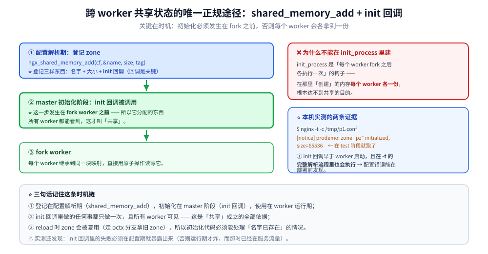
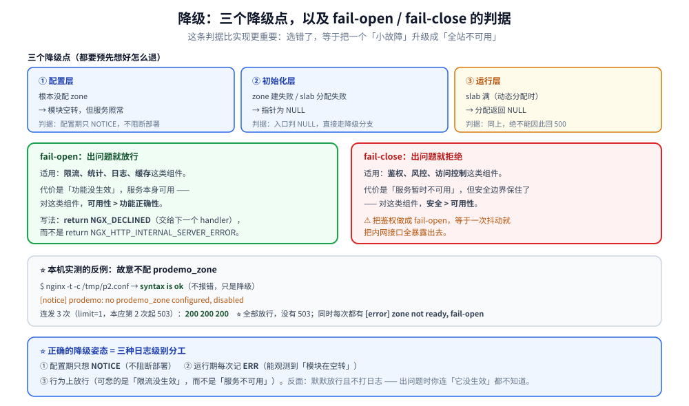

# 模块开发实战

> 把一个"能跑"的模块做到"敢上线"：共享内存的正确建法、降级策略、
> 配置校验、错误处理与测试方法。
>
> 素材来源：本目录 [06-HTTP模块开发入门.md](06-HTTP模块开发入门.md) ~
> [10-HTTP变量机制.md](10-HTTP变量机制.md) 的进阶整理 + 本机实测。
> 实测口径见本目录 [README.md](README.md) 第四节；本篇读数取自本机 Docker
> `nginx-dev:1.31.6`（自建镜像，nginx **1.31.6**）。

---

## 一、从"能跑"到"敢上线"差什么？

**本节要点**：入门模块只需要**一条 happy path**；生产级模块要额外解决**四件事**：
跨进程状态、降级、配置校验、可观测。

### 1.1 四个维度

| 维度 | 入门做法 | 生产做法 |
|---|---|---|
| 状态 | 模块内的 `static` 变量 | ⭐ **共享内存**（worker 间一致）或明确接受 per-worker |
| 失败 | `return NGX_ERROR` | ⭐ **降级**（fail-open / fail-close 要有判据） |
| 配置 | 不校验 | ⭐ **启动期就拒绝非法值**（别等运行期崩） |
| 观测 | 无日志 | ⭐ 分级日志 + 关键路径的状态可见 |

⭐ 这一篇实现一个**最小但完整**的例子：按 client 维度计数的限流模块
（`prodemo`）。它的价值不在于功能，而在于**这四件事都演示了**。

## 二、共享内存：不是 `malloc`，也不是模块级 `static`

**本节要点**：跨 worker 共享状态的**唯一正规途径**是
`ngx_shared_memory_add` + **init 回调**。⭐ 用 `init_process` 建是错的。

### 2.1 ⭐ 为什么不能用 `init_process`

```text
// ❌ 常见错误：在 init_process 里建共享内存
static ngx_int_t my_init_process(ngx_cycle_t *cycle) { … }
```

`init_process` 是**每个 worker fork 之后各自执行一次**的 ——
在那里"创建"的内存**每个 worker 各有一份**，根本达不到共享的目的。

**正确的时机链**：

```text
配置解析期（ngx_shared_memory_add）
    ↓ 登记 zone：名字 + 大小 + ⭐ init 回调
master 初始化阶段（init 回调被调用）
    ↓ ⭐ 在 fork worker **之前**，所以分配的东西所有 worker 都能看到
fork worker（每个 worker 拿到同一块映射）
```

⭐ **本机实测的两个证据**：

1. `nginx -t` 时 zone 就被初始化了：

```text
$ nginx -t -c /tmp/p1.conf
nginx: the configuration file /tmp/p1.conf syntax is ok
[notice] prodemo: zone "pz" initialized, size=65536      # ⭐ 在 test 阶段就跑了
nginx: configuration file /tmp/p1.conf test is successful
```

说明 init 回调的时机**早于 worker 启动**，且**在 `-t` 的完整解析流程里也会执行**
—— 所以 init 回调里的错误能在部署前发现。

2. worker 启动日志里**不重复**打这条 —— 因为只有一个进程（master）执行过 init。



### 2.2 三段式写法

```c
/* ① 配置期：登记 zone（只下单，不分配） */
static char *
prodemo_set_zone(ngx_conf_t *cf, ngx_command_t *cmd, void *conf)
{
    prodemo_main_conf_t  *mcf = conf;
    ngx_str_t            *value = cf->args->elts;
    ngx_str_t             name;
    size_t                size;
    u_char               *p;

    /* 解析 <name>:<size> 格式 */
    name = value[1];
    p = ngx_strlchr(name.data, name.data + name.len, ':');
    if (p == NULL) {
        ngx_conf_log_error(NGX_LOG_EMERG, cf, 0,
                           "invalid zone \"%V\", expected <name>:<size>", &name);
        return NGX_CONF_ERROR;
    }
    *p = '\0';                                /* ⚠️ 就地截断（cf 里的串可改） */
    name.len = p - name.data;
    p++;

    {
        ngx_str_t  sz;
        sz.len = ngx_strlen(p);               /* ⚠️ nginx 是 C89：不能用复合字面量 */
        sz.data = p;
        size = ngx_parse_size(&sz);
    }
    if (size == (size_t) NGX_ERROR || size == 0) {
        ngx_conf_log_error(NGX_LOG_EMERG, cf, 0, "invalid zone size \"%s\"", p);
        return NGX_CONF_ERROR;
    }

    /* ⭐ 启动期校验：小了直接拒绝（本机实测 12k 是最小可用值，见 05 篇） */
    if (size < 12 * 1024) {
        ngx_conf_log_error(NGX_LOG_EMERG, cf, 0,
                           "zone \"%V\" is too small, at least 12k", &name);
        return NGX_CONF_ERROR;
    }

    mcf->zone_name = name;
    mcf->zone_size = size;

    mcf->shm_zone = ngx_shared_memory_add(cf, &mcf->zone_name, size,
                                          &ngx_http_prodemo_module);
    if (mcf->shm_zone == NULL) {
        return NGX_CONF_ERROR;
    }
    mcf->shm_zone->init = prodemo_init_zone;   /* ⭐ 挂上 init 回调 */
    mcf->shm_zone->data = mcf;                 /* 回调里用得上 */

    return NGX_CONF_OK;
}

/* ② master 初始化期：真正分配（⭐ fork worker 之前） */
static ngx_int_t
prodemo_init_zone(ngx_shm_zone_t *shm_zone, void *data)
{
    prodemo_main_conf_t  *octx = data;
    prodemo_main_conf_t  *mcf = shm_zone->data;
    ngx_slab_pool_t      *shpool;
    prodemo_node_t       *node;

    if (octx) {
        /* ⭐ reload 时复用旧内存区（zone 名与大小没变）——
         *   这是"reload 不丢状态"的关键，别漏了这个分支 */
        mcf->shpool = octx->shpool;
        mcf->node = octx->node;
        return NGX_OK;
    }

    shpool = (ngx_slab_pool_t *) shm_zone->shm.addr;   /* ⭐ slab 头已在开头 */
    mcf->shpool = shpool;

    node = ngx_slab_alloc(shpool, sizeof(prodemo_node_t));
    if (node == NULL) {
        ngx_log_error(NGX_LOG_EMERG, shm_zone->shm.log, 0,
                      "prodemo: slab_alloc failed for header (zone too small)");
        return NGX_ERROR;
    }
    node->count = 0;
    mcf->node = node;          /* ⭐ 固定下来：所有 worker 都写这一块 */

    ngx_log_error(NGX_LOG_NOTICE, shm_zone->shm.log, 0,
                  "prodemo: zone \"%V\" initialized, size=%uz",
                  &mcf->zone_name, mcf->zone_size);
    return NGX_OK;
}
```

⭐ 三个容易踩的细节：
① **`data` 参数是「旧的 zone data」**，reload 时用来复用 —— 不处理这个分支
会导致 reload 后状态清零；
② **init 回调里不要加锁**（此时单线程，`ngx_slab_alloc` 不带 `_locked` 即可）；
③ ⚠️ **共享内存里的计数必须用原子操作**（`ngx_atomic_fetch_add`），
普通 `++` 在多 worker 下会丢更新。

### 2.3 本机实测：限流真的生效

配置：

```text
http {
    prodemo_zone pz:64k;        # ⭐ main 级
    server {
        listen 19600;
        prodemo_limit 3;
        location / { prodemo on; }    # ⭐ loc 级启用
    }
}
```

连发 6 次请求：

```text
第 1 次: HTTP 200  body=[prodemo ok]
第 2 次: HTTP 200  body=[prodemo ok]
第 3 次: HTTP 200  body=[prodemo ok]
第 4 次: HTTP 503  body=[too many requests]      ← ⭐ 阈值 3 精确生效
第 5 次: HTTP 503  body=[too many requests]
第 6 次: HTTP 503  body=[too many requests]
```

告警日志（`n` 是**自增前的旧值**，所以从 3 开始）：

```text
[warn] *4 prodemo: over limit n=3 limit=3, client: 127.0.0.1, ...
[warn] *5 prodemo: over limit n=4 limit=3, ...
[warn] *6 prodemo: over limit n=5 limit=3, ...
```

⭐ 注意 `n` 的语义：`ngx_atomic_fetch_add` **返回旧值**，
所以第 4 次请求读到 3（前三次已把值加到 3）—— 写日志时要说清是"自增前"还是"自增后"，
否则排查时会算错一次。

## 三、降级：fail-open 还是 fail-close

**本节要点**：**限流 / 统计 / 日志类组件必须 fail-open**（出问题就放行）；
**鉴权 / 风控类必须 fail-close**（出问题就拒绝）。⭐ 这条判据比实现更重要。

### 3.1 三类降级点

```text
① 配置层：没配 zone
② 初始化层：zone 建失败 / slab 分配失败
③ 运行层：slab 满（动态分配时）
```

本模块对 ①② 都 fail-open：

```c
/* ⭐ 降级：共享内存没建起来（zone 没配 / 初始化失败）→ fail-open */
if (mcf->shpool == NULL || mcf->node == NULL) {
    ngx_log_error(NGX_LOG_ERR, r->connection->log, 0,
                  "prodemo: zone not ready, fail-open");
    return NGX_DECLINED;      /* ⭐ 交给下一个 handler，不是报错 */
}
```

**本机实测的反例对照**（配置里**故意不写 `prodemo_zone`**）：

```text
$ nginx -t -c /tmp/p2.conf
nginx: configuration file /tmp/p2.conf syntax is ok          # ⭐ 不报错，只是降级
[notice] prodemo: no prodemo_zone configured, disabled

连发 3 次（limit=1，但应全部放行）: 200 200 200              # ⭐ 全部 200，没有 503
[error] *1 prodemo: zone not ready, fail-open, ...
```

⭐ **这就是正确的降级姿态**：
① 配置期只 `NOTICE`（不阻断部署）；
② 运行期每次都 `ERR` 记录（能观测到"模块在空转"）；
③ 行为上**放行**（可怜的是"限流没生效"，而不是"服务不可用"）。

### 3.2 fail-open / fail-close 判据

| 模块类型 | 失败时的正确行为 | 理由 |
|---|---|---|
| 限流 / 熔断 | ⭐ **fail-open** | 组件故障不应放大成全站不可用 |
| 统计 / 日志 | ⭐ **fail-open** | 丢统计不影响业务 |
| **鉴权 / 风控** | ⭐⭐ **fail-close** | 放行未授权请求的后果更严重 |
| 加密 / 签名校验 | ⭐ **fail-close** | 同上 |

⚠️ **反例教训**：njs 的 `js_access` 就出过这类漏洞
（CVE-2026-18329：异步路径抛异常时 nginx **当作鉴权通过继续处理**）——
**"异常被吞掉 = 放行"**，这在鉴权场景是严重错误。

### 3.3 启动期校验：拦在部署前

**本机实测反例**（zone 写太小）：

```text
$ sed 's/pz:64k/pz:4k/' ... && nginx -t
nginx: [emerg] zone "pz" is too small, at least 12k in /tmp/p3.conf:8
nginx: configuration file /tmp/p3.conf test failed

$ sed 's/pz:64k/pz:8k/' ... && nginx -t
nginx: [emerg] zone "pz" is too small, at least 12k in /tmp/p4.conf:8
nginx: configuration file /tmp/p4.conf test failed
```

⭐ 这里 4k 与 8k **都被显式校验拒绝**。⚠️ 与 [05-内存管理与数据结构.md](05-内存管理与数据结构.md)
的实测对照：**不使用预校验时**，nginx 自身的表现是
4k 报 `[emerg] too small`、**8k 与 10k 报 `[crit] ngx_slab_alloc failed`**
（后者是运行期错误，更难发现）。所以在模块里加一道 12k 预校验，
**把运行期错误提前到配置期**，这是"生产级"的具体体现。



## 四、可观测：日志分级与状态可见

**本节要点**：模块的每条日志都要有**明确的级别理由**；关键状态要能被外部看到。

### 4.1 本模块的分级实践

| 时机 | 级别 | 实测输出 |
|---|---|---|
| 没配 zone（可接受的降级） | `NOTICE` | `prodemo: no prodemo_zone configured, disabled` |
| zone 初始化成功 | `NOTICE` | `prodemo: zone "pz" initialized, size=65536` |
| zone 没就绪 | `ERR` | `prodemo: zone not ready, fail-open` |
| 触发限流 | `WARN` | `prodemo: over limit n=3 limit=3` |
| 配置非法 | `EMERG`（`ngx_conf_log_error`） | `zone "pz" is too small, at least 12k` |

⭐ 判据：**`NOTICE` 是"正常但值得知道"，`WARN` 是"异常但已处理"，`ERR` 是"这次请求失败了"**。把"降级"打成 `ERR` 是对的
（运维需要在监控里看到它）；把"启动成功"打成 `WARN` 是错的（噪声）。

### 4.2 共享内存的观测

⚠️ 共享内存**没有官方查询接口**（不像 `stub_status`）。
可行做法有三：
① 用 `ngx_http_stub_status_module` 的模式自建一个 status location
（把共享区的内容序列化出来）；
② 打日志（本模块的做法，简单但只有增量）；
③ 用变量（`$prodemo_count`）让外部按需读（见 [10-HTTP变量机制.md](10-HTTP变量机制.md)）。

⭐ 无论哪种，**把"当前状态"暴露出来**是生产级模块的必备项 ——
否则出问题时只能猜。

## 使用

**1. 生产级模块的自检清单**（照着过一遍）：

```text
□ 跨 worker 状态用 ngx_shared_memory_add + init 回调（不是 init_process）
□ init 回调处理了「reload 复用旧 zone」的分支（octx != NULL）
□ 共享区里的计数用 ngx_atomic_fetch_add（不是 ++）
□ 所有失败路径都有明确策略：fail-open 还是 fail-close
□ 配置期校验：非法值用 ngx_conf_log_error + NGX_CONF_ERROR 拒绝
□ 日志分级合理：NOTICE / WARN / ERR / EMERG 各有理由
□ 关键状态可被外部观测（日志 / status 端点 / 变量）
□ handler 里碰了异步就一定 r->main->count++，回调里 finalize
□ 值的内存生命周期覆盖到 log 阶段（见 10 篇 3.2 的真实事故）
□ 编译加了 -Werror（nginx 默认就有）且无 warning
```

**2. 复现本篇实验的完整命令**：

```bash
# ① 编译（含四个模块 + prodemo）
docker run --rm -v "$PWD/lab:/work" nginx-dev:1.31.6 sh /work/build2.sh
#    ⭐ 脚本里必须有断言：grep ngx_http_prodemo_module objs/ngx_modules.c

# ② 跑
docker run --rm --network none -v "$PWD/lab:/work" nginx-dev:1.31.6 sh /work/e16.sh
```

**3. 降级路径的测试方法**（必须逐个覆盖）：

```text
① 不配 zone            → 期望：200 放行 + ERR 日志
② zone 配成 4k/8k      → 期望：-t 直接拒绝（EMERG）
③ zone 正常但分配失败  → 期望：fail-open + ERR 日志（需构造内存紧张）
④ reload 后状态是否保留 → 期望：保留（靠 init 回调的 octx 分支）
```

## 延伸追问

### 1. 模块开发中最容易踩的坑是什么？

**内存生命周期**。本目录实测过的三类：
① 值写进 `r->pool` 但要在**相隔很远的阶段**再读（变量在 log 阶段取值）→ 读到垃圾
（[10-HTTP变量机制.md](10-HTTP变量机制.md) 3.2）；
② **分配长度按"数字位数"算、却先写了前缀** → 越界写踩坏相邻变量
（[10-HTTP变量机制.md](10-HTTP变量机制.md) 3.2 同节的真实 bug）；
③ **header 的 key 里混进 `": "`** → 序列化出错、**响应体整块丢失且无报错**
（[09-HTTP过滤模块.md](09-HTTP过滤模块.md) 3.1）。

⭐ 共同点：**都不报错**。所以判据是**"用日志/断言验证真实行为"**，
而不是"编译通过就跑"。

### 2. 怎么调试 Nginx 模块？

四级手段，从轻到重：

| 手段 | 适用 |
|---|---|
| `ngx_log_error` + `docker logs` | ⭐ 最常用，先用它 |
| `nginx -t`（配置期与 zone 初始化） | ⭐ 能在**不启动服务**的情况下验证大半逻辑 |
| `--with-debug` 编译 + `error_log ... debug` | 看框架内部流程（本目录 04 篇用过 `rewrite_log`） |
| `gdb` / ASAN | 段错误、内存越界 |

⭐ 本目录的实战经验：**加一条 `NGX_LOG_WARN` 打在函数入口**，
用 `docker logs | grep <标记>` 判断"到底有没有被调用"——
这一步能区分**"没进链"与"进了链但没生效"**（09 篇 2.4 就是靠它定位的）。

### 3. 模块的性能该如何测试？

三个层次：
① **正确性**：功能测试 + 反例（降级路径必须逐个构造）；
② **开销**：与本模块"关掉"时对比（同一压测下 QPS / P99 差多少）；
⚠️ ③ **并发正确性**：共享内存的计数在**多 worker + 高并发**下是否准确
（本目录 [03-事件驱动与epoll.md](03-事件驱动与epoll.md) 实测过
「本机量级区分不出 accept_mutex 与 reuseport 的优劣」——
说明**压测环境量级不够时会得出假结论**，要控制变量并放大轮次）。

### 4. 什么时候该写 C 模块，什么时候不该？

| 该写 | 不该写 |
|---|---|
| 需要访问 nginx 内部结构（连接、请求、buffer） | 只是转发/改写 → 用配置 |
| 需要极致性能（每次请求的开销要压到纳秒级） | 有现成的 C 模块 → 用它 |
| 要跨 worker 共享状态且不能用外部存储 | 能用 `map` / `split_clients` / `limit_req` 解决 |
| 公司资产（长期维护、能跟版本） | ⚠️ 一次性需求 → 用 njs 或 OpenResty |

⭐ **判据**：**C 模块的代价是"要跟着 nginx 版本维护"**
（本目录 [06-HTTP模块开发入门.md](06-HTTP模块开发入门.md) 已经实测出 1.31 与老版本
在 `ngx_command_t`、filter 注册方式上的多处不兼容）。如果这个代价换不来
"非它不可"的能力，就用配置或脚本解决。

### 5. 用 OpenResty 写同样的逻辑会不会更简单？

**会**，而且明显更简单 —— 共享内存、限流、原子操作 OpenResty 都有现成封装
（见 [14-OpenResty生态.md](14-OpenResty生态.md)）。⭐ 所以选型顺序应该是：

```text
配置能解决 → 用配置
njs / Lua 能解决 → 用脚本（迭代快、不动核心）
只有以上都不行 → 才写 C 模块
```

⚠️ 但反过来也成立：**C 模块的性能上限与可控性最高**，
且**不必引入第二个运行时**（OpenResty 要整体替换 nginx 二进制）。

## 关联

- [README.md](README.md) — 本目录导读与实测口径
- [06-HTTP模块开发入门.md](06-HTTP模块开发入门.md) — 模块骨架、指令表、config
- [07-配置解析与请求上下文.md](07-配置解析与请求上下文.md) — 三级配置、merge、引用计数
- [09-HTTP过滤模块.md](09-HTTP过滤模块.md) — 过滤链与 buf 生命周期
- [10-HTTP变量机制.md](10-HTTP变量机制.md) — 变量值的生命周期（含真实事故）
- [05-内存管理与数据结构.md](05-内存管理与数据结构.md) — `ngx_slab` 与 keys_zone 最小尺寸
- [02-进程模型与基础架构.md](02-进程模型与基础架构.md) — init 回调与 fork 时机
- [OpenResty.md](../../../03-数据与中间件/中间件/网关与代理/OpenResty.md) — 用 Lua 写同样的逻辑
> 反向引用（本篇被下列文档引到）：[14-OpenResty生态.md](14-OpenResty生态.md)
