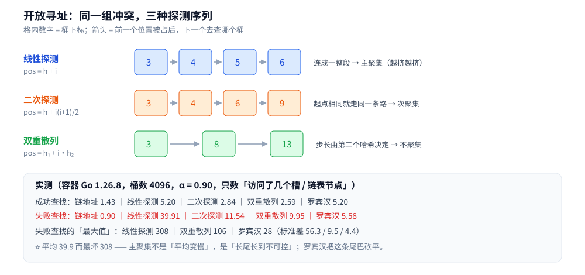

# 开放寻址与冲突解决

> 哈希冲突没有「避免」这回事，只有「解决」—— 链地址、开放寻址、Cuckoo Hashing 三条路线
> 各自把冲突元素**放到哪里**，以及由此产生的**查找代价长什么样**。
>
> ⭐ 边界先说清：上游原理（为什么可以 O(1)、退化的两条路径、工程上的四道闸门）在
> [散列表.md](散列表.md)，本篇**只讲冲突解决的实现层**：探测序列、装填因子与期望探测长度、
> 聚集现象、删除的墓碑问题、Robin Hood 与 Cuckoo 的行为差异。
> Go 的落地实现（开放寻址 + 溢出桶链）见 [map.md](../../../01-编程语言/go/类型与语法/map.md)，
> Redis 的链地址落地见 [底层结构.md](../../../03-数据与中间件/数据存储/NoSQL/Redis/底层结构.md)。
>
> 内容整理自个人学习笔记，素材见 [素材清单](../../../素材清单.md)。

---

## 一、冲突解决的三条路线分别把冲突放到哪里？

**本节要点**：区别只有一个 —— 冲突的元素是**另找一个空槽**（开放寻址），还是**挂在同一个位置上**（链地址）；Cuckoo 则是「先占位，占了再踢」。

| 路线 | 冲突元素去哪 | 数据结构 | 有什么附带要求 |
|---|---|---|---|
| **链地址** | 挂到该桶的**链表 / 数组**上 | 桶数组 + 每桶一条链 | 需要额外的指针 / 槽位开销；链长了要能升级（如树化） |
| **开放寻址** | 按**探测序列**往后找一个空槽 | 一个数组，**不放指针** | ⚠️ **删除必须留墓碑**；⚠️ **装填因子不能高** |
| **Cuckoo Hashing** | 有**两个**候选桶；都满就**踢走**其中一个、让它去自己的另一个桶 | 两个哈希 + 桶数组 | ⚠️ **负载上限约 0.5**，超了就踢出失败 → 必须扩容 |

⭐ **一句话判据**：

```text
能接受指针开销、且删除频繁  → 链地址（工程里最常见）
要省内存、且以查找为主     → 开放寻址（数组紧凑、缓存友好）
要不成功查找也接近 O(1)     → Cuckoo（代价是负载上限低）
```

⚠️ 一条容易被忽略的事实：**开放寻址的正变换成本全部压在「表满」这件事上**。
链地址在 α=0.9 时失败查找只要 0.90 次比较（就是平均链长），
而线性探测在同一个 α 下要 **39.91** 次 —— **差 44 倍**（下面第三节的实测）。

---

## 二、开放寻址的三种探测序列有什么区别？

**本节要点**：三种探测的差别只在「下一个去哪」这个函数上 —— 而**这个函数决定了会不会聚集**。

设 `h(k)` 是理想位置，`i = 0, 1, 2, …` 是第几次探测：

| 探测法 | 下一个位置 | 缺点 |
|---|---|---|
| **线性探测** | `(h + i) mod m` | ⚠️ **主聚集**：被占的连续段越来越长，新元素被吸进去 |
| **二次探测** | `(h + i(i+1)/2) mod m` | ⚠️ **次聚集**：起点相同就走**同一条**探测路径 |
| **双重散列** | `(h₁ + i·h₂) mod m` | 需要**第二个**哈希函数；⚠️ `h₂` 必须与 `m` 互质，否则探不全表 |



⚠️ **两个必须自己盯住的边界**：

1. **线性探测探不完整个表吗？** 探得完 —— 只要表里**至少有一个空槽**，`(h+i) mod m` 走 `m` 步必然覆盖所有槽。
2. **二次探测 / 双重散列的覆盖**：`i(i+1)/2 mod 2^k` 恰好遍历 `0..2^k−1`（这是三角数的性质），
   所以**桶数取 2 的幂**时二次探测能覆盖全表；而双重散列的 `h₂` **必须是奇数**（与 `2^k` 互质）才保证覆盖 ——
   否则会出现「表还有空槽、这个 key 却怎么探都探不进去」的静默死循环。

---

## 三、为什么装填因子一高，开放寻址就崩？

**本节要点**：因为期望探测长度不是线性增长 —— **线性探测是 `1/(1−α)²` 量级，α 到 0.9 就接近两位数**；而且它不只是「平均变慢」，是**长尾长得不可控**。

### 3.1 实测：同一张表、五种做法

**✅ 实测口径**：容器 `golang:1.26-alpine`，Go 1.26.8，纯标准库、无第三方依赖；两遍运行逐行相同。
桶数固定 **4096**（2 的幂），哈希用确定性 splitmix64，`h₂` 落在 `[1, m−1]` 的奇数上。
**探测次数口径**：访问一个槽（或一个链表节点）记 1 次；「成功」= 查已插入的 key，「失败」= 查没插入过的 key。

| 装填因子 α | 链地址 成功 / 失败 | 线性探测 | 二次探测 | 双重散列 | 罗宾汉 |
|---|---|---|---|---|---|
| 0.50 | **1.22 / 0.50** | 1.48 / 2.56 | 1.41 / 2.19 | 1.34 / 1.97 | 1.48 / 1.76 |
| 0.75 | 1.35 / 0.76 | 2.57 / 8.56 | 1.96 / 4.65 | 1.86 / 4.01 | 2.57 / 2.98 |
| 0.90 | 1.43 / **0.90** | 5.20 / **39.91** | 2.84 / 11.54 | 2.59 / 9.95 | 5.20 / **5.58** |

⭐ **三处值得记住的对照**：

- **链地址的失败查找恰好等于 α**（0.50 / 0.76 / 0.90）—— 理论值就是「平均链长 α」；成功查找是 `1 + α/2`，实测 1.22 / 1.35 / 1.43，吻合。
- **双重散列的失败查找 ≈ `1/(1−α)`**：α=0.9 时理论 10，实测 9.95。**几乎就是理论值**。
- **线性探测爆炸**：α 从 0.5 到 0.9，成功查找只涨 3.5 倍，**失败查找涨 15.6 倍**（2.56 → 39.91）。
  这就是为什么开放寻址的负载因子阈值通常压在 **0.5~0.75**，而不是「快满了再说」。

### 3.2 主聚集不是「平均慢」而是「最坏很长」

同一次实测里，看**失败查找的分布**（α=0.90）：

| 探测法 | 平均 | 最大 | 标准差 |
|---|---|---|---|
| 线性探测 | 39.9 | **308** | 56.3 |
| 双重散列 | 9.9 | 106 | 9.5 |
| 罗宾汉 | 5.6 | **28** | 4.4 |

⭐⭐ **线性探测的最大值 308 是平均值的 7.7 倍** —— 一次探测横穿 308 个槽，在缓存与硬实时场景里就是一次事故。
结论要落到**判据**上：**看开放寻址的表，不能只看平均探测长度，要看最坏那一次**；
主聚集的危害集中在长尾，而长尾正是 P99 延迟的来源。

---

## 四、删除为什么必须留墓碑？

**本节要点**：开放寻址的查找靠「遇到**真空槽**就停」，所以**直接清空会切断后面元素的探测链**；只能留一个「已删除」标记（墓碑）——而墓碑又会让表**永远显得比实际满**。

看这个场景（线性探测，`h` 相同的三个 key 依次落位）：

```text
插入 A → 落在 3
插入 B → 3 被占 → 落在 4
插入 C → 4 被占 → 落在 5

现在 3 被 A 占。把 A 直接删成「空」会怎样？

查找 C：从 3 开始 → 遇到空 → 判定「不存在」    ✗✗ 错了！
```

所以开放寻址的删除只能写成**墓碑**（deleted 标记）：查找遇到墓碑**继续往后面探**，插入可以**复用**墓碑槽。代价是这三点：

| 影响 | 说明 |
|---|---|
| 失败查找变贵 | 墓碑不会终止探测，等于「没被清掉的障碍」 |
| 插入可能选到更远的槽 | 墓碑槽可以复用，但探测路径仍要走过它 |
| **表不会因为删除而变空** | 负载因子看的是「被占用的槽（含墓碑）」，不是「元素个数」 |

**✅ 实测**（容器，线性探测，桶数 4096）：

| 状态 | 表内元素 | 失败查找平均探测 |
|---|---|---|
| 表 A：插入 2048 个（α = 0.50） | 2048 | 2.56 |
| 表 A：再删掉 1024 个（留墓碑） | 1024 | **2.56** ← 元素少了一半，代价**一点没降** |
| 表 B：另建一张表只装这 1024 个（α = 0.25，无墓碑） | 1024 | **1.36** |

⭐ **同样是「表内 1024 个元素」，带墓碑的那张贵 1.88 倍** —— 这就是墓碑的真实代价：
**它把删除省下来的空间成本，又原封不动加回到探测上**。

⚠️ 工程对策只有两条：**① 记录墓碑比例，超过阈值就重建（rehash）**；② 用**向后移位删除**（把聚集段整体前移一格）——
后者能做到「真删除」，代价是每次删除多几次搬移。**具体选哪个看实现，但「直接清空了事」一定错。**

---

## 五、Robin Hood 为什么能把最坏情况压平？

**本节要点**：给每个元素记一个「离家多远」的距离，**插入时谁穷谁先占位** —— 于是探测长度被抹平成一条窄带。

Robin Hood 的核心规则只有一句：

```text
插入时若当前位置上那位的「距离」比我还小（它比我更接近它的家），
就把它的位子抢过来，让它继续往后找位子。
```

于是**「距离」这个量在表里被抹平了**：不可能出现「一个元素离家 300 格，而它附近的元素都在家门口」的极端情况。
这带来两个后果（上面的实测都印证了）：

- **成功查找的代价不变**（5.20，与线性探测完全一样）—— 元素该在哪儿还是在哪儿，只是「谁占位」换了人；
- **失败查找的代价被大幅压平**：平均 5.58（线性探测 39.91），**最坏 28（线性探测 308）**，标准差从 56.3 掉到 4.4。

⭐ 还有一条别处少见的性质：**Robin Hood 的「成功查找」与「失败查找」代价几乎相等**（5.20 vs 5.58）——
因为探查一个 key 时，一旦遇到「比我更富足」的槽就可以立刻判定它不在后面（**早停剪枝**），
这让不成功的查找不需要走完整段聚集。

⚠️ 代价：**每次插入最多搬移 O(探测长度) 个元素**，写入变贵、也更难做无锁并发。
它适合**读多写少、且要求延迟可预期**的开放寻址表。

---

## 六、Cuckoo Hashing 为什么能保证查找 O(1)？

**本节要点**：每个 key **只可能出现在两个桶里**，所以查找**固定看两次**；代价是插入要「踢人」，而踢人的链一长就会失败 → **负载上限被卡在 ~0.5**。

规则：

```text
① 每个 key 算两个桶：i₁ = h₁(k)，i₂ = h₁(k) XOR h₂(指纹)
② 插入：两个桶有空位就放；都满 → 把 i₁ 里的元素踢出来，
   让它去「自己的另一个桶」；若那边也满，继续踢……
③ 踢到一定次数还放不下 → 判定插入失败（真实实现的反应是扩容）
```

⭐ **查找为什么是 O(1)**：key 若存在，**只可能在 `i₁` 或 `i₂`** 这两处 ——
最多看两次，**与元素总数无关**，而且**失败查找也是两次**（这点比线性探测强得多）。

⚠️ **`i₂` 为什么写成 XOR**：因为 `x XOR y XOR y = x` ——
从 `i₁` 出发能算出 `i₂`，从 `i₂` 出发**也能算回 `i₁`**（对合性）。踢人时才知道「该往哪儿踢」，
否则被踢出的元素就找不到自己的另一个桶了。**这个性质要求桶数是 2 的幂**（XOR 完不能越界）。

**✅ 实测**（容器，2 桶 × 1 槽，桶数 4096）：

| 目标负载 α | 插入成功 | 插入失败 | 累计踢出次数 |
|---|---|---|---|
| 0.45 | 1843 | 0 | 219 |
| 0.50 | 2048 | 0 | 457 |
| 0.55 | 2250 | 2 | 2 017 |
| 0.60 | 2448 | 9 | 6 603 |
| 0.65 | 2625 | 37 | 21 758 |

⭐ **结论不是某个具体 α，而是「拐点的形状」**：`0.50 → 0.55` 之间，
失败开始出现、**踢出次数涨了 4.4 倍**；到 0.65 时踢出次数是 0.55 时的 **10.8 倍**。
所以 Cuckoo 的实现必须**在负载还没到临界时提前扩容** —— 否则一次插入可能连锁踢出几十次。

⚠️ 两个增强手段（工程实现里常见）：

- **每桶放多槽**（如每桶 4 个）：负载上限能从 ~0.5 提到 **~0.95**（桶内先线性找，满了才踢）；
- **踢出链带上限 + 随机选桶**：避免固定顺序下的循环踢（A 踢 B、B 踢回 A）。

---

## 七、工程上怎么选、怎么防？

**本节要点**：先按「删除频繁度 + 内存预算」选路线，再按「装填因子上限 + 最坏探测»设监控与阈值。

```text
□ 删除频繁、且要能随时恢复空间？
│   └─ 链地址（配「链长超阈值就树化」）—— 工程里最常见
□ 以查找为主、内存紧、要缓存友好？
│   ├─ 删除少/可重建 → 线性探测（阈值压在 0.5~0.75）
│   ├─ 要最坏可控   → 罗宾汉（最坏被压平，写变贵）
│   └─ 要不成功也 O(1) → Cuckoo（负载上限 ~0.5，必须提前扩容）
□ 表非常大、想省指针？
    └─ 开放寻址，但**必须**把「墓碑比例 + 最大探测长度」纳入监控
```

⭐ **三个必须设的监控 / 阈值**：

| 项 | 为什么 |
|---|---|
| **装填因子上限** | 开放寻址的失败查找在 α→1 时发散；链地址则是平均链长线性变长 |
| **最大探测长度 / 最大链长** | 平均值骗人 —— 实测线性探测平均 39.9 而最坏 308 |
| **墓碑比例**（开放寻址） | 墓碑不释放槽位，比例高 = 表「虚满」，失败查找白白变贵 |

⚠️ 最后一件事：**哈希函数本身要防「敌意构造」**（攻击者灌入大量同哈希值的键，把 O(1) 打成 O(n)）。
防御方向是给哈希加**随机种子 / 扰动** —— **具体机制各语言实现不同，以官方文档与源码为准**。

---

## 使用：这些实现在哪些系统里

**本节要点**：三种路线在真实系统里都有，选哪种取决于该系统的**读写比与删除模式**。

| 系统 | 走哪条路 | 说明 |
|---|---|---|
| **Go map** | **开放寻址 + 溢出桶链** | 每个 bucket 若干个槽，满了挂溢出桶 —— 兼有开放寻址的紧凑与链地址的弹性（见 [map.md](../../../01-编程语言/go/类型与语法/map.md)） |
| **Redis dict** | **链地址** | `index = hash & sizemask`，冲突挂链；配合渐进式 rehash 避免一次性搬迁（见 [底层结构.md](../../../03-数据与中间件/数据存储/NoSQL/Redis/底层结构.md)） |
| **Java HashMap** | **链地址 + 树化** | 链长超过阈值就把该桶的链表换成红黑树，把最坏 O(m) 拉回 O(log m)（见 [集合容器.md](../../../01-编程语言/java/集合容器.md)） |
| **布谷鸟过滤器** | **Cuckoo 的「指纹」形态** | 同一个 Cuckoo 思想用在「集合存在性判断」上：不存 key 只存指纹，换来可删除（见 [布谷鸟过滤器.md](../高级数据结构/布谷鸟过滤器.md)） |
| **数据库哈希索引** | 取决于引擎 | 哈希索引只支持等值查找，范围查询仍要 B+ 树（见 [索引设计与EXPLAIN.md](../../../03-数据与中间件/数据存储/关系型/MySQL/索引设计与EXPLAIN.md)） |

⚠️ **本篇的写法说明**：上表是按**算法性质**给出的对应关系，**具体实现细节与参数以各自源码 / 文档为准**。

---

## 延伸追问

- **链地址和开放寻址怎么选？** → 删除频繁选链地址（墓碑会拖垮开放寻址）；内存紧、以查找为主选开放寻址。判据见第七节。
- **为什么开放寻址的负载因子必须压低？** → 失败查找的期望探测长度在 α→1 时发散（线性探测是 `1/(1−α)²` 量级）；α=0.9 时实测已达 39.9 次。
- **二次探测为什么也有「聚集」？** → 它消除了「连续段」，但**起点相同的两个 key 会走完全相同的探测路径**（次聚集），所以失败查找仍比双重散列贵（11.54 vs 9.95）。
- **墓碑和「直接删除」差在哪？** → 直接清空会切断后面元素的探测链，导致查找**静默判成不存在**；墓碑就是为保住这条链而付的代价。
- **Robin Hood 为什么成功查找没变快？** → 它只改「谁占哪个位子」，不改「一个 key 会走多远」；换来的是失败查找的长尾被压平（最坏 308 → 28）。
- **Cuckoo 的负载上限为什么是 ~0.5？** → 每个 key 只有两个候选桶，桶数固定时「两桶都满」的概率随负载快速上升；实测 0.50 → 0.55 之间踢出次数涨 4.4 倍、开始出现插入失败。
- **为什么 Cuckoo 的第二个桶要用 XOR？** → 为了**对合**：从 `i₁` 能算 `i₂`，从 `i₂` 也能算回 `i₁`，踢人时才找得到「另一个桶」；这也要求桶数是 2 的幂。
- **哈希攻击是什么？** → 构造大量同哈希值的键把 O(1) 打成 O(n)；防御靠给哈希加随机扰动，机制以各语言实现为准。

---

## 关联

- [散列表.md](散列表.md) — **上游原理**：为什么可以 O(1)、退化的两条路径、工程上的四道闸门
- [数组与链表.md](../线性结构/数组与链表.md) — 桶数组与链地址的两个底层零件
- [平衡树.md](../树/平衡树.md) — 「链太长就树化」用到的实现层
- [布谷鸟过滤器.md](../高级数据结构/布谷鸟过滤器.md) — 同一个 Cuckoo 思想用在「集合存在性」上的形态
- [位图与布隆过滤器.md](../高级数据结构/位图与布隆过滤器.md) — 不用桶的另一种「存在性」方案
- [map.md](../../../01-编程语言/go/类型与语法/map.md) — Go map 的开放寻址 + 溢出桶链落地
- [底层结构.md](../../../03-数据与中间件/数据存储/NoSQL/Redis/底层结构.md) — Redis 的链地址 + 渐进式 rehash
- [集合容器.md](../../../01-编程语言/java/集合容器.md) — Java HashMap 的拉链 + 树化
- [查找与排序对比.md](../../算法/基础算法/查找与排序对比.md) — 各查找结构的横向对照
- [索引设计与EXPLAIN.md](../../../03-数据与中间件/数据存储/关系型/MySQL/索引设计与EXPLAIN.md) — 哈希索引与 B+ 树索引的分工
- [README.md](../README.md) — 数据结构目录的选型总表
