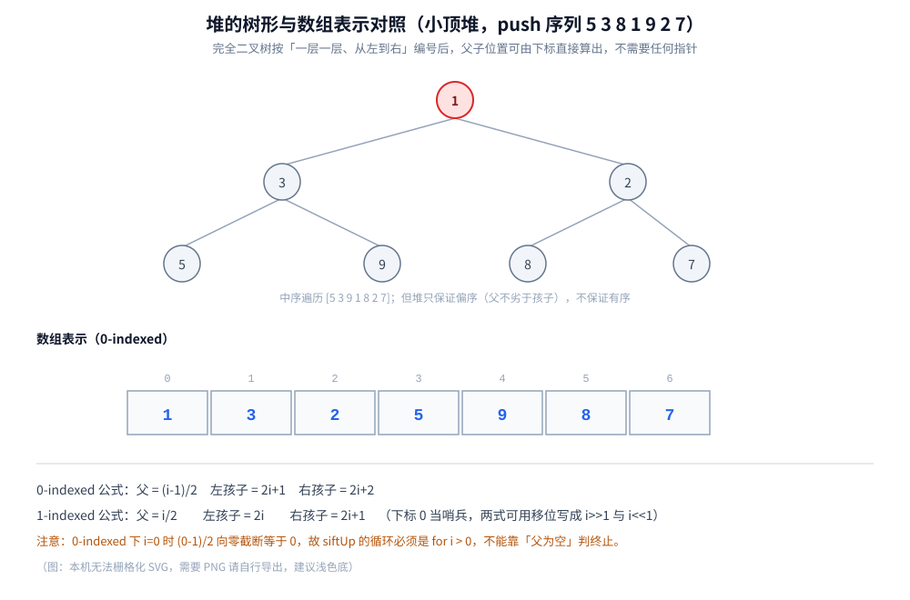

# 堆与优先队列

> 二叉堆怎么塞进一个数组：下标公式、上浮与下沉的完整实现、`push` / `pop` 的 `O(log n)`，
> 以及那个最容易讲错的问题 —— **建堆为什么是 `O(n)` 而不是 `O(n log n)`**。
>
> ⭐ 边界先说清：堆在八大结构全景里的位置见 [README.md](../README.md)（选型对照表 + 隐藏代价总表），
> **「堆适合解决什么问题」的应用清单在本篇 1.4**；
> **「Top-K 该用多大的堆」的选型判据**见 [查找与排序对比.md](../../算法/基础算法/查找与排序对比.md) 第四节。
> 本篇只讲**实现与复杂度**：下标怎么算、上浮下沉怎么终止、`O(n)` 的求和怎么收敛、`container/heap` 与 `PriorityQueue` 怎么用。
> 「堆在算法里怎么被用掉」（Dijkstra / Prim / 霍夫曼编码 / BFS 的容器）见各自篇目，本篇不重讲。
>
> 内容整理自个人学习笔记，素材见 [素材清单](../../../素材清单.md)。复杂度口径见 [复杂度分析.md](../../算法/基础算法/复杂度分析.md)。
>
> 📎 本篇所有输出均为本机实跑逐字抄录：**Go 1.26.5（windows/amd64）** 与 **JDK 1.8.0_321** 各实现一份，
> 核心实验输出**逐行对齐**（去掉耗时行后 `diff` 为空）。

---

## 一、二叉堆为什么能用数组表示？

**本节要点**：堆是**完全二叉树**——把节点按「一层一层、从左到右」编号后，编号之间满足一组固定的算术关系，于是**存进数组就够了、不需要任何指针**。看懂下标公式，就看懂了后面所有操作。

### 1.1 两条性质：偏序 + 完全二叉树

| 性质 | 含义 | 后果 |
|---|---|---|
| **偏序** | 任一节点不大于（小顶堆）/ 不小于（大顶堆）它的孩子 | 只能快速拿到**极值**，不能按序枚举 |
| **完全二叉树** | 除最后一层外每层都满，最后一层**靠左**连续填满 | 编号连续、无空位 → **数组紧凑存放，浪费为 0** |

⭐ **第二条才是"能用数组"的根本原因**。如果是一棵普通二叉树（可能退化成一条链、中间大量空位），编号就得跳着来，数组里会塞满空洞，只能改用指针。**完全二叉树保证了「节点数 = 数组长度」且「父子位置可由下标直接算出」**。

### 1.2 下标公式：0-indexed 还是 1-indexed？

同一棵堆，两种编号方式只是「起始下标」不同。以 `push 序列 5 3 8 1 9 2 7` 为例（本机实跑）：

```text
===== 实验一：数组表示与下标公式 =====
push 序列        : 5 3 8 1 9 2 7
0-indexed 数组   : 1 3 2 5 9 8 7
0-indexed 公式：parent=(i-1)/2，left=2i+1，right=2i+2
  下标 5（值 8）：parent(5)=(5-1)/2=2 → a[2]=2；left=11、right=12（均越界）
1-indexed 公式：parent=i/2，left=2i，right=2i+1（下标 0 当哨兵）
  同一节点下标 6（值 8）：parent(6)=6/2=3 → a[3]=5；left=12、right=13（均越界）
```

同一棵树，两种编号对照：

```text
            1              （层序：根 1，左 3，右 2，……）
          /   \
         3     2
        / \   / \
       5   9 8   7

0-indexed :  a[0]=1 a[1]=3 a[2]=2 a[3]=5 a[4]=9 a[5]=8 a[6]=7
1-indexed :  a[1]=1 a[2]=3 a[3]=2 a[4]=5 a[5]=9 a[6]=8 a[7]=7   （a[0] 空着当哨兵）
```

| 关系 | 0-indexed（Go / Java 数组） | 1-indexed（教科书） |
|---|---|---|
| 父 | `(i-1) / 2` | `i / 2` |
| 左孩子 | `2*i + 1` | `2*i` |
| 右孩子 | `2*i + 2` | `2*i + 1` |

### 1.3 ⭐ 为什么 1-indexed 的公式「更简洁」

1-indexed 的两个式子可以用**移位**表达，一组公式两两对称：

```text
parent   i / 2        →  i >> 1
left     2 * i        →  i << 1
right    2 * i + 1    →  (i << 1) | 1        ← 左孩子下标 +1 就是右孩子
```

而 0-indexed 是 `i/2` 之外的每条式子都带着 `±1` 的偏移：左孩子 `2i+1`、右孩子 `2i+2`（既有加 1 又有加 2）。更麻烦的是**父公式的边界**：`i = 0` 时 `(0-1)/2 = (-1)/2`，在 Go / Java 里整数除法**向零截断**，结果是 `0` —— 于是「下标 0 的父是它自己」。**所以循环必须写成 `for i > 0`，而不是「直到父节点为空」**：

```go
func (h *MinHeap) siftUp(i int) {
	for i > 0 {                          // ⚠️ 必须是 i > 0：i=0 时 (0-1)/2 == 0，会自环
		p := (i - 1) / 2
		if h.a[p] <= h.a[i] {
			break
		}
		h.a[p], h.a[i] = h.a[i], h.a[p]
		i = p
	}
}
```

⚠️ 但**工程实现仍然用 0-indexed**：Go 的 slice、Java 的数组都是 0 起，为了省一个哨兵位而整体平移下标，只会引入更多 `±1` 换算错误。**Go 标准库 `container/heap` 用的就是 0-indexed 公式**。记法：**公式好不好看是次要的，边界对不对才是主要的**。

### 1.4 ⭐ 堆适合解决什么问题（应用清单）

**本节要点**：堆的能力边界只有一句话 —— **它只保证「堆顶是极值」，别的都不保证**。所以凡是「只要极值、不要全序」的问题，堆都是最优解；凡是要范围/等值查找的，堆都不合适。

| 应用 | 用到堆的哪一条性质 | 展开在哪 |
|---|---|---|
| **堆排序** | 反复取堆顶即是「从有序到无序的归位」 | 本篇第六节 |
| **优先级队列** | 堆顶 = 当前最高优先级，`push` / `pop` 均 `O(log n)` | 本篇第七节、[栈与队列.md](../线性结构/栈与队列.md)（优先队列是牺牲 FIFO 换极值） |
| **海量数据 Top-K** | 大小为 K 的小顶堆：比堆顶大才换进去 | 本篇第七节、[查找与排序对比.md](../../算法/基础算法/查找与排序对比.md) 第四节 |
| **第 K 大 / 第 K 小** | 同上，堆顶就是「第 K 大」 | 本篇 7.3 |
| **动态集合的中位数** | ⭐ **对顶堆**（大顶堆装小的一半 + 小顶堆装大的一半）—— 只有「随时插入 + 随时取分位数」的需求下堆才不可替代 | 本篇 7.2（堆 vs 平衡树 vs 快排分区的对照） |
| **最短路的松弛容器** | 每次取「当前距离最小的未定稿点」 | [Dijkstra.md](../../算法/图论算法/最短路/Dijkstra.md)、[Prim.md](../../算法/图论算法/最小生成树/Prim.md) |
| **霍夫曼编码** | 每轮取频率最小的两个节点合并 | [霍夫曼编码.md](../../算法/贪心/霍夫曼编码.md) |

> ⚠️ 反面清单（**堆救不了的场景**）：要**范围查询**（`[a, b]` 之间所有元素）→ 用平衡树或跳表；要**等值查找**某个任意值 → 堆不是搜索结构，只能扫；要**按序枚举全部元素** → 堆排序是 `O(n log n)` 且丢失了结构，不如直接用平衡树的中序遍历。
> 一句话：**「取一个极值」找堆，「取一片区间」找树。**

---

## 二、上浮与下沉怎么写才不出错？

**本节要点**：堆只有两个原子动作 —— **上浮（sift-up）**：新元素从底部往上顶；**下沉（sift-down）**：堆顶被换走后从顶部往下沉。两个循环的**终止条件**就是全部难点。

### 2.1 上浮：新元素往上顶

`push` 把新元素放到数组末尾（完全二叉树要求的新位置），再让它**和父节点比较，比父更优就交换**、一路上顶，直到「父不比自己差」或「已经到根」。

```go
// siftUp：把 i 处的元素往上顶，直到不再小于父节点
func (h *MinHeap) siftUp(i int) {
	for i > 0 { // 终止条件一：到根
		p := (i - 1) / 2
		if h.a[p] <= h.a[i] { // 终止条件二：父 <= 自己
			break
		}
		h.a[p], h.a[i] = h.a[i], h.a[p]
		i = p
	}
}
```

### 2.2 下沉：堆顶被换走后往下沉

`pop` 不能直接删 `a[0]`（那样整棵树就散了）。做法是：**把末尾元素搬到根上**，然后让它和**两个孩子中更优的那个**比较、更优的孩子上浮、自己下沉。

⚠️ 这里有个**必须写对的地方**：每轮要和「两个孩子里更优的那个」比，而不是随便挑一个。比错了会破坏堆序。

```go
// siftDown：把 i 处的元素往下沉，直到不再大于任一孩子
func (h *MinHeap) siftDown(i int) {
	n := len(h.a)
	for {
		l, r := 2*i+1, 2*i+2
		small := i
		if l < n && h.a[l] < h.a[small] { // 边界：只有存在左孩子才比
			small = l
		}
		if r < n && h.a[r] < h.a[small] { // 右孩子可能不存在
			small = r
		}
		if small == i { // 终止条件：两个孩子都不更小
			break
		}
		h.a[i], h.a[small] = h.a[small], h.a[i]
		i = small
	}
}
```

⭐ **两个循环的对称性**：`siftUp` 每轮只和**一个**父亲比（`i > 0` 保证父亲存在）；`siftDown` 每轮要和**两个**孩子比（`l < n`、`r < n` 保证孩子存在）。**「孩子可能只有一个」是下沉独有的边界** —— 完全二叉树的最后一个内部节点可能只有左孩子。

### 2.3 push / pop 的过程与 O(log n)

| 操作 | 步骤 | 复杂度 | 为什么 |
|---|---|---|---|
| `push(v)` | ① 追加到末尾 ② `siftUp(末尾)` | `O(log n)` | 上浮最多走「树高」层 = ⌊log₂n⌋ |
| `pop()` | ① 取 `a[0]` ② 末尾搬到根 ③ `siftDown(0)` | `O(log n)` | 下沉同样最多走树高层 |
| `peek()` | 直接读 `a[0]` | `O(1)` | 极值就在根上 |
| 建堆 | 见第三节 | **`O(n)`** | 求和收敛 |

⭐ 关键：**树高是 ⌊log₂n⌋**，因为堆是完全二叉树、每一层都填满，没有任何一层是空的。**树高就是 `O(log n)` 的全部来源**。

---

## 三、建堆为什么是 O(n) 而不是 O(n log n)？

**本节要点**：逐个 `push` 建堆确实是 `O(n log n)`，但从**最后一个非叶节点往前逐个下沉**只要 `O(n)`。差别不在「操作的次数」，而在**「每层的节点数 × 该层要沉的高度」这个乘积收敛**。

### 3.1 自下而上建堆

给定一个**乱序数组**，把它整理成堆：**从最后一个非叶节点（下标 `n/2 - 1`）开始，倒着对每个节点做一次 `siftDown`，一直做到下标 0**。

```go
// buildHeap：O(n) 建堆 —— 从最后一个非叶节点（n/2-1）往前逐个下沉
func buildHeap(a []int) {
	for i := len(a)/2 - 1; i >= 0; i-- {
		h := &MinHeap{a: a}
		h.siftDown(i)
	}
}
```

⭐ **为什么从 `n/2 - 1` 开始**：完全二叉树里，下标 `≥ n/2` 的节点全是**叶子**（没有孩子），对叶子做 `siftDown` 是空转。所以只需要处理前一半的**内部节点**。叶子天然是「合法的堆」，从下往上、把每个内部节点修好，整棵树就都是堆了。



### 3.2 求和为什么收敛到 O(n)

⚠️ 一个很自然的错误推理是：「有 `n/2` 个内部节点，每个 `siftDown` 是 `O(log n)`，所以是 `O(n log n)`」。**错在用同一个高度去乘所有节点** —— 越靠下的节点，它能沉的高度越小。

**按「高度」分类再求和**（高度 `h` 指子树高，`h` 层节点下沉最多走 `h` 步）：

| 层（从底部数的子树高度） | 该层节点数（上界） | 每个最多下沉 | 该层总代价 |
|---|---|---|---|
| `h = 0`（叶子） | `n/2` | 0 | 0 |
| `h = 1` | `n/4` | 1 | `n/4` |
| `h = 2` | `n/8` | 2 | `2n/8` |
| … | … | … | … |
| `h` | `n / 2^(h+1)` | `h` | `h · n / 2^(h+1)` |

总代价 = `Σ_h  h · n / 2^(h+1) = (n/2) · Σ_h h/2^h`。而 **`Σ_{h≥0} h/2^h = 2`**（收敛级数），所以

```text
总代价 ≤ (n/2) · 2 = n        →  O(n)
```

⭐ **一句话直觉**：**节点越多的地方，每个节点能沉的高度越小**。底层节点数量大但几乎不用动，顶层节点要沉得多但数量极少 —— 两个方向刚好抵消，乘出来的和收敛到常数倍 `n`。

### 3.3 实测：递减输入 vs 随机输入

⚠️ **这个 `O(n)` 优势有多明显，高度依赖输入顺序**。n = 1000000、每项重复 20 轮累计（本机实跑）：

```text
===== 实验三：O(n) 建堆 vs 逐个 push（耗时对照）=====
n = 1000000，每项重复 20 轮，累计总耗时（本机 time.Now 分辨率约 1ms）

【A 递减序列（插入的最坏情况：每个新元素都上浮到根）】
  拷贝基线(20 轮)  : 53 ms
  逐个 push        : 822 ms  （净 769 ms）
  O(n) 建堆        : 228 ms  （净 175 ms）
  push / build 倍数: 4.39
【B 随机序列（插入的期望情况：平均只上浮约 1 层）】
  拷贝基线(20 轮)  : 34 ms
  逐个 push        : 480 ms  （净 446 ms）
  O(n) 建堆        : 401 ms  （净 367 ms）
  push / build 倍数: 1.22
```

### 3.4 ⭐ 一个反直觉的实测结论

**换一种输入，`O(n)` 的"优势"几乎消失**。这是本篇最值得记住的一点：

| 输入 | 逐个 push 为什么慢/快 | 净耗时比 |
|---|---|---|
| **递减序列**（`n, n-1, …, 1`） | 每个新元素都**小于全部现有元素**，`siftUp` 一路顶到根 → 每次真走满 `log n` 层 | push 是 build 的 **4.39 倍** |
| **随机序列** | 新元素平均只上浮 **约 1 层**（插到堆底时，父节点比它小的概率很高） | push 只比 build 慢 **1.22 倍** |

⭐ **这说明**：`O(n log n)` 是**上界**、不是"每次都跑满"。逐个 `push` 的**期望**代价接近 `O(n)`（因为平均上浮距离是常数），只有在**恶意输入**（递减）下才兑现那个 `log n`。而 `O(n)` 建堆**对任何输入都是 `O(n)`** —— 它的价值是**最坏情况保证**，不只是"随机输入下更快"。

⚠️ 时序数字**只断言单调趋势**，绝对值随机器与负载波动（本机 Go 侧 `push/build` 在递减输入下实测落在 4~6 倍区间）。**"递减序列是 push 的最坏情况"这个结论是可以在纸上证明的，不依赖测速。**

> 复现提示：两语言用的是**同一个 LCG**（`s = s*6364136223846793005 + 1442695040888963407`，取 `>>33`）生成同一串数，所以非计时输出逐行一致。

---

## 四、Go 的 container/heap 与 Java 的 PriorityQueue 怎么用？

**本节要点**：标准库都只给你「骨架」，但 Go **必须自己实现五个方法**、Java 则**默认是小顶堆** —— 这两点是最常被用错的地方。

### 4.1 container/heap 必须实现五个方法

Go 的 `container/heap` **不是一个堆类型**，而是一组**能在你的类型上生效的操作**。要使用它，你的类型（通常是 slice）必须实现这五个方法：

| 方法 | 作用 | 接收者 |
|---|---|---|
| `Len() int` | 元素个数 | 值 |
| `Less(i, j int) bool` | 谁在堆顶（⭐ **决定方向**） | 值 |
| `Swap(i, j int)` | 交换两个元素 | 值 |
| `Push(x any)` | 追加一个元素 | **指针** |
| `Pop() any` | 取出并删除末尾元素 | **指针** |

```go
type IntHeap []int

func (h IntHeap) Len() int           { return len(h) }
func (h IntHeap) Less(i, j int) bool { return h[i] < h[j] } // ⭐ 「<」= 小顶堆
func (h IntHeap) Swap(i, j int)      { h[i], h[j] = h[j], h[i] }

func (h *IntHeap) Push(x any) { *h = append(*h, x.(int)) } // ⚠️ 指针接收者
func (h *IntHeap) Pop() any {
	old := *h
	n := len(old)
	x := old[n-1]
	*h = old[:n-1]
	return x
}
```

⭐ **`Less` 的写法就是堆的方向**：写 `h[i] < h[j]` 得到**小顶堆**，写 `>` 得到大顶堆。这是 Go 与 Java 最大的口子差异 —— Go **连方向都要你自己定**。

### 4.2 ⚠️ Push / Pop 必须用指针接收者

这是 `container/heap` 最容易踩的坑：

- `Len` / `Less` / `Swap` 只**读长度、比较、换元素**，不改变 slice 头，值接收者就够；
- `Push` / `Pop` 要**改 slice 头**（`append` 可能换底层数组、`Pop` 要截断长度），**必须用指针接收者** `*IntHeap`。用值接收者的话，改的是副本，堆根本不会变（而且 `heap.Interface` 的签名对不上，编译就过不去）。

⚠️ **另一个反直觉处**：`heap.Pop` 内部**不是**直接删堆顶，而是把末尾和堆顶交换后再调整 —— 所以你的 `Pop()` 方法只需**返回并删掉末尾元素**，堆序由 `container/heap` 负责。

### 4.3 heap.Init 与 heap.Fix

- `heap.Init(h)`：把**任意乱序数组**原地整理成堆（内部就是第三节的 `O(n)` 建堆）；
- `heap.Fix(h, i)`：**下标 `i` 的元素被修改后**，就地恢复堆序 —— 这正是 Dijkstra「减少某个点的距离」时要用的操作（见 4.4 的实测）。

```text
===== heap.Fix：改一个元素后就地恢复堆序（Dijkstra 的 decrease-key 用它）=====
Init 后         : [10 20 30 40 50]（堆顶 10）
把 a[2] 改成 5  : [10 20 5 40 50]（此时已不是合法堆）
heap.Fix(h2, 2) : [5 20 10 40 50]（堆顶变成 5）
```

### 4.4 Java PriorityQueue 默认是小顶堆

⚠️ **很多人以为 Java 的 `PriorityQueue` 是「大的优先」—— 错，它默认是小顶堆**。这意味着 `poll()` 出来的顺序是**从小到大**：

```text
===== PriorityQueue 默认行为：小顶堆（很多人以为是大的）=====
offer 顺序       : [5, 3, 8, 1, 9, 2, 7]
底层数组         : [1, 3, 2, 5, 9, 8, 7]
peek()（堆顶）   : 1
poll() 顺序      : [1, 2, 3, 5, 7, 8, 9]
```

另一个细节：`toArray()` 打出来的**不是有序数组，而是堆的内部数组**（`[1, 3, 2, 5, 9, 8, 7]`）—— 只保证堆序，不保证有序。**要按序输出只能反复 `poll()`。**

---

## 五、大顶堆怎么用最小堆模拟？

**本节要点**：Go 的 `container/heap` 与 Java 的 `PriorityQueue` 都只给「最小」这一侧。要最大堆有两条路：**改数据**（存相反数）或**改比较器**（反转 `Less` / 传 `Comparator`）。

### 5.1 存相反数（最省事）

入堆时存 `-v`、出堆时再取反，就把「最小」翻转成了「最大」（本机实跑）：

```text
===== 大顶堆怎么用最小堆模拟：存相反数 =====
存 -v 后的数组  : [-9 -8 -7 -1 -3 -2 -5]
出堆再取反      : [9 8 7 5 3 2 1]（从大到小）
```

⚠️ **代价**：元素类型必须是能安全取反的（整数、浮点），且**溢出边界要小心**（`-math.MinInt64` 会溢出），还要多一次取反运算。优点是**不改比较逻辑**，Go 里连 `Less` 都不用动。

### 5.2 反转比较器 / 改 Less

Java 侧把比较器反一下就行（`Comparator.reverseOrder()` 或 `(a, b) -> b - a`）：

```text
===== 自定义 Comparator 反成大顶堆 =====
peek()（堆顶）   : 9
poll() 顺序      : [9, 8, 7, 5, 3, 2, 1]

===== Comparator 的等价写法（大顶堆）=====
poll() 顺序      : [9, 8, 7, 5, 3, 2, 1]
```

Go 侧则把 `Less` 里的 `<` 换成 `>`。⭐ **两种做法等价**，选哪种只看「元素类型是否方便取反」。⚠️ 注意 `(a, b) -> b - a` 这种写法在**整数相差可能溢出**时有隐患（`b - a` 超出 `int` 范围），更稳的是 `Integer.compare(b, a)`。

### 5.3 自定义对象进堆

带权图的边、Top-K 的候选，进堆的往往是**复合对象**。Java 用 `Comparator` 比较某个字段：

```java
// 分数小的在堆顶（小顶堆）：Top-K 里当「门槛」用
PriorityQueue<int[]> byScore = new PriorityQueue<>((a, b) -> a[1] - b[1]);
```

---

## 六、堆排序是怎么做的？

**本节要点**：堆排序 = **建堆 + 反复取堆顶**。最坏也是 `O(n log n)`、额外空间 `O(1)`；代价是**不稳定**、且常数比快排大。

### 6.1 建堆 + 反复取堆顶（实测 pop 序列）

流程只有两步：① `buildHeap` 把数组整理成小顶堆；② 反复 `pop`，弹出的序列**天然升序**（本机实跑）：

```text
===== 实验二：逐次 pop 的输出序列（验证小顶堆）=====
输入数组     : 5 3 8 1 9 2 7 4 6 0
建堆后数组   : 0 1 2 4 3 8 7 5 6 9
pop 序列     : 0 1 2 3 4 5 6 7 8 9
是否升序     : true
```

⭐ 注意对照：**输入是乱序的 `5 3 8 1 9 2 7 4 6 0`，建堆后不是有序的 `0 1 2 4 3 8 7 5 6 9`，但 `pop` 出来严格升序** —— 这就是「堆只保证偏序、但反复取极值能拼出全序」的直接证据。

### 6.2 为什么不稳定、空间为什么是 O(1)

| 维度 | 说明 |
|---|---|
| **时间** | 建堆 `O(n)` + 取 `n` 次堆顶、每次 `O(log n)` → `O(n log n)`（最坏也是） |
| **空间** | ⭐ **`O(1)`** —— 直接在原数组上做（原地交换），不像归并要额外 `O(n)` |
| **稳定性** | ❌ **不稳定** —— 建堆与下沉阶段的远距离交换会打乱相等元素的相对次序 |

⭐ **`O(1)` 空间是它相对归并的最大优势**：归并稳定但要 `O(n)` 额外空间，堆排原地但有最坏保证 —— 这是标准库里「深层递归转堆排序」兜底的原因（见 [查找与排序对比.md](../../算法/基础算法/查找与排序对比.md) 第四节）。

### 6.3 什么时候选它

⚠️ **实际排序几乎不会手写堆排序**：库函数（`slices.Sort`、`Arrays.sort`）已经是高度优化的混合排序（见 [查找与排序对比.md](../../算法/基础算法/查找与排序对比.md)）。堆排的真正用途是**「只取前 K 个」**（下一节）和**「要最坏保证、又不想占额外空间」**的兜底场景。

---

## 七、Top-K 与第 K 大该怎么选？

**本节要点**：全排序、大小为 K 的小顶堆、快排分区 —— 三者不是「谁更快」，而是**「数据能不能全部装下」**决定的。

### 7.1 实测：全排序 vs 大小为 K 的堆

n = 1000000、K = 10（本机实跑）：

```text
===== 实验四：Top-K 两种做法对照 =====
n = 1000000，K = 10，数据范围 [0, 10000000)
全排序取前 K   : 9999976 9999968 9999952 9999948 9999936 9999928 9999925 9999921 9999909 9999890   耗时 295 ms
大小 K 小顶堆  : 9999976 9999968 9999952 9999948 9999936 9999928 9999925 9999921 9999909 9999890   耗时 1 ms
结果一致       : true
```

⭐ **结果完全一致、耗时差两个数量级**。原因就是 `O(n log n)` vs `O(n log k)`：`log n ≈ 20`、`log k ≈ 3.3`，再乘上「排序要动整个数组、堆只维护 K 个元素」。

⚠️ **更关键的是内存**：全排序要**装下全部 n 个数**，堆只占 **K 个**。数据是流式到达（日志、传感器、消息队列）时，堆是**唯一能做的选项** —— 全排序根本存不下。

### 7.2 堆 vs 平衡树 vs 快排分区

同样是「第 K 大」，三种结构各有位置：

| 做法 | 时间 | 内存 | 能流式吗 | 拿到什么 |
|---|---|---|---|---|
| 全排序取前 K | `O(n log n)` | `O(n)` | ❌ | 前 K 且**内部有序** |
| **大小为 K 的小顶堆** | **`O(n log k)`** | **`O(k)`** | ✅ | 前 K，内部**无序**（要再排一次） |
| 平衡树（红黑树） | `O(n log k)` | `O(k)` | ✅ | 前 K，**天然有序**、支持删除/范围（见 [平衡树.md](../树/平衡树.md)） |
| 快速选择（分区） | 平均 `O(n)`、最坏 `O(n²)` | `O(1)`~`O(log n)` | ❌ 需随机访问全量 | 前 K 的集合，无序、会打乱原数组 |

⭐ **堆 vs 平衡树的判据**：只要「取前 K、不需要删除、不需要范围」，用**堆**（常数小、实现简单、无指针开销）。如果还要**边取边删**（比如「滑动窗口的第 K 大」）、或要**范围/排名查询**，那平衡树更合适。**堆是「偏序 + 只取极值」的最省方案，别拿它干范围查询的活。**

### 7.3 「小顶堆」为什么能让第 K 大都对

⚠️ **最容易被问倒的一点**：Top-K 用**小顶堆**，堆顶是「**当前 K 个候选里最小的那个**」，也就是「现在的第 K 大」：

- 新元素 `v` 来时，**只和堆顶比一次**（`O(1)` 判断）：`v > 堆顶` 才够格进来；
- 够格就**替换堆顶并下沉**（`O(log k)`）。

⭐ **用大顶堆会怎样**：堆顶是最大值，判断「够不够格」就得**把 K 个元素扫一遍**。**堆顶要当「门槛」用，所以门槛必须是当前候选里最小（也就是第 K 大）的那个 —— 这就是「求最大用最小堆」的原因。**

---

## 使用：堆在你的系统里以什么形式出现

堆是**「被用」远多于「自己写」**的结构，它以三个层次出现在你的系统里：

**第一层：库里的优先队列**。Java 的 `PriorityQueue`、Go 的 `container/heap`、Python 的 `heapq`、C++ 的 `std::priority_queue` —— 你写的绝大多数「取极值」逻辑都落在这里。⚠️ 记住两个方向坑：**Java 默认小顶堆**、**Go 要自己写 `Less`**。

**第二层：定时器 / 任务调度**。延迟队列、超时检测、`Timer`/`ScheduledExecutor` 的底层都是**按到期时间排序的堆**：每轮看堆顶「最近要触发的任务」，还没到就等待、到了就弹出。相关篇目见 [go/](../../../01-编程语言/go/) 与 [java/](../../../01-编程语言/java/) 目录下并发与集合容器篇。

**第三层：算法里的「前沿集合」**。Dijkstra 用堆取「当前距离最小的点」、Prim 用堆取「离树最近的点」、霍夫曼编码用堆取「频率最小的两个」、BFS 的进阶变体用双端队列替代堆 —— **它们的共同点是「每轮只需要当前极值」**，这正是堆的偏序能提供的全部。

⭐ **归纳成一条判据**：**「只要当前极值、不要全局有序」→ 用堆；「要能按序枚举 / 范围查询 / 删除任意元素」→ 用平衡树。** 堆的 `O(1)` 取极值、`O(log n)` 增删、几乎零额外指针，都是「放弃有序性」换来的。

---

## 延伸追问

- **堆为什么能用数组存，而普通二叉树不行？** → 因为堆是**完全二叉树**：除最后一层外每层填满、最后一层靠左连续，所以「节点数 = 数组长度」，且父子位置能用下标公式（`(i-1)/2`、`2i+1`、`2i+2`）直接算出，不需要指针。普通二叉树会有大量空位，只能改用节点 + 指针。
- **为什么 `siftUp` 的循环条件必须是 `i > 0`？** → 因为 `i = 0` 时 `(0-1)/2` 在 Go / Java 里整数除法**向零截断**，结果是 `0` —— 「下标 0 的父是它自己」，循环会自环。所以终止条件不能是「父为空」，必须是「到根」。
- **建堆到底 `O(n)` 还是 `O(n log n)`？** → **自下而上建堆是 `O(n)`**：按高度分层求和，`Σ h·n/2^(h+1) = (n/2)·Σ h/2^h = (n/2)·2 = n`。错把「`n/2` 个内部节点 × 每次 `O(log n)`」相乘，是忽略了「越靠下的节点能沉的高度越小」。
- **为什么实测里建堆有时看不出比逐个 push 快很多？** → 因为**逐个 push 的期望代价接近 `O(n)`**（随机输入下平均只上浮约 1 层），只有**递减序列**这种最坏输入才让每次 `push` 真走满 `log n`。本机实测：递减输入下 push 是 build 的 4.39 倍，随机输入下只差 1.22 倍。`O(n)` 建堆的价值是**最坏情况保证**。
- **Go 的 `container/heap` 为什么要求五个方法、`Push`/`Pop` 还要指针接收者？** → 它不是一个堆类型，而是一组「作用于你类型的操作」。`Len`/`Less`/`Swap` 只读不改 slice 头，值接收者够；`Push`/`Pop` 要改 slice 头（`append` 可能换底层数组、`Pop` 要截断），必须指针接收者，否则改的是副本、堆不会变。
- **Java 的 `PriorityQueue` 是大顶堆还是小顶堆？** → **默认小顶堆**，`poll()` 从小到大。要最大堆得传 `Comparator.reverseOrder()` 或 `(a, b) -> b - a`。⚠️ `(a, b) -> b - a` 在整数可能溢出时不可靠，更稳的是 `Integer.compare(b, a)`。
- **大顶堆怎么用最小堆模拟？** → 两条路：**存相反数**（入堆取反、出堆再取反，Go 里连 `Less` 都不用改，但要注意 `-MinInt64` 溢出）或**反转比较器**（Java 传 `Comparator`、Go 把 `Less` 里的 `<` 改成 `>`）。
- **Top-K 为什么用小顶堆？堆顶代表什么？** → 堆顶是「当前 K 个候选里最小的」，也就是**当前的第 K 大**，它当**门槛**用：新元素只要和堆顶比一次就知道够不够格（`O(1)`），够格再 `O(log k)` 替换。用大顶堆的话，堆顶是最大值，判断就得扫遍 K 个元素。
- **堆排序为什么是 `O(1)` 空间却不稳定？** → 它**原地**在原数组上交换，所以空间 `O(1)`；但建堆和下沉阶段的**远距离交换**会打乱相等元素的相对次序，所以不稳定（「快希选堆」四个不稳定的排序之一）。
- **什么时候该用平衡树而不是堆？** → 只要还需要**删除任意元素、范围查询、按序枚举、或取第 K 大之外的排名**，堆就不够（它只保证偏序）。堆是「只取极值」的最省方案，超出这个范围就该换平衡树（见 [平衡树.md](../树/平衡树.md)）。

---

## 关联

- [README.md](../README.md) — 堆在八大结构里的位置与选型总表（本篇是实现层展开）
- [栈与队列.md](../线性结构/栈与队列.md) — 队列一侧：优先队列是「牺牲 FIFO 换重要任务先跑」的那条线
- [查找与排序对比.md](../../算法/基础算法/查找与排序对比.md) — 第四节：**Top-K 该用多大的堆**的判据与「全排序 vs 堆」对照表
- [复杂度分析.md](../../算法/基础算法/复杂度分析.md) — `O(log n)` 与「求和收敛」的推导口径、摊还分析
- [霍夫曼编码.md](../../算法/贪心/霍夫曼编码.md) — 最小堆的头号用户之一：每轮取频率最小的两个合并建树
- [Dijkstra.md](../../算法/图论算法/最短路/Dijkstra.md) — 小顶堆取「当前 dist 最小」；含「稠密图上堆反而不如朴素扫描」的实测
- [Prim.md](../../算法/图论算法/最小生成树/Prim.md) — 与 Dijkstra 几乎同一份代码，同样靠堆取「离树最近的点」
- [BFS广度优先遍历.md](../../算法/图论算法/图的遍历/BFS广度优先遍历.md) — 队列 / 双端队列这条线：0-1 BFS 用双端队列**替代**堆
- [平衡树.md](../树/平衡树.md) — 与堆的对照：平衡树要**全局有序**，堆只要**偏序**；Top-K 之外的排名/范围查询走平衡树
- [索引与优化.md](../../../03-数据与中间件/数据存储/关系型/MySQL/索引与优化.md) — 「堆表」与 B+ 树组织表的差别（同名不同物，注意别混）
> 反向引用（本篇被下列文档引到）：[树的形态与选型.md](../树/树的形态与选型.md)、[单调栈与单调队列.md](../高级数据结构/单调栈与单调队列.md)、[拓扑排序.md](../../算法/图论算法/拓扑排序.md)、[Bellman-Ford.md](../../算法/图论算法/最短路/Bellman-Ford.md)、[区间调度.md](../../算法/贪心/区间调度.md)、[活动选择.md](../../算法/贪心/活动选择.md)、[Go算法题.md](../../../07-面试/Go算法题.md)
