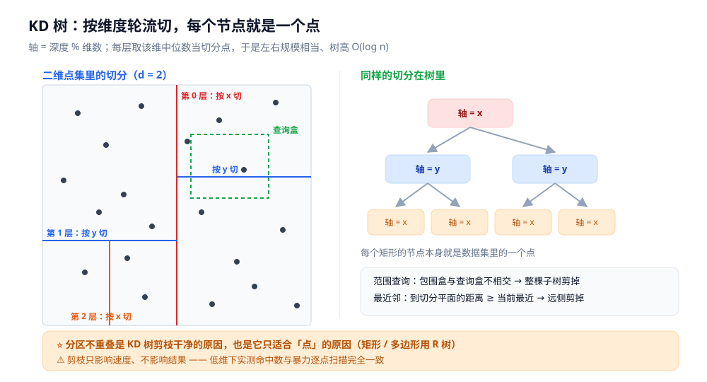
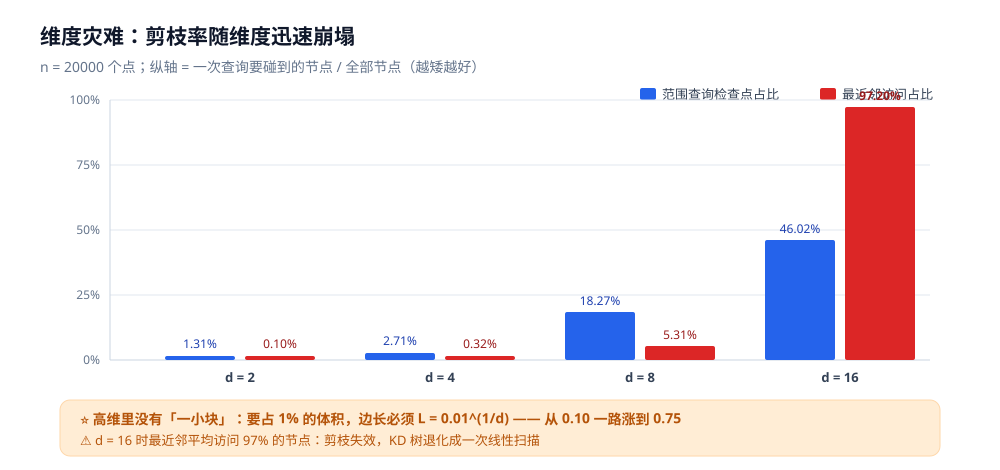

# KD 树与高维索引

> 二维空间没有全序，怎么给点集建一棵能剪枝的树？
> —— **KD 树**（k-dimensional tree）的答案是：**按维度轮流切**。
> 它在低维很好用，但维度一高就迅速失效 —— 这后半段就是「**维度灾难**」，也是向量检索转向近似算法的原因。

> ⭐ 边界先说清：本篇讲**点集的逐维切分索引**与其在高维的失效，以及替代方案的定位。
> 另一条空间索引路线（自适应包围矩形、任意几何体）见 [空间索引与R树.md](空间索引与R树.md)；
> 全目录的选型框架见 [树的形态与选型.md](树的形态与选型.md)；
> 区间统计那类「一维连续切分」的结构见 [区间与索引树.md](区间与索引树.md)。
>
> 内容整理自个人学习笔记，素材见 [素材清单](../../../素材清单.md)。复杂度口径见 [复杂度分析.md](../../算法/基础算法/复杂度分析.md)。
>
> 📎 本篇读数来自**自写的最小 KD 树实现**，在本机**容器**里实跑逐字抄录：**Go 1.26.8（linux/amd64，`golang:1.26-alpine`）**。
> ⚠️ 实验**只数访问 / 检查的节点数、不依赖计时**；数据由固定 seed 的本地随机源生成，同一程序连跑两遍**逐行相同**。

---

## 一、KD 树解决什么问题？

**本节要点**：KD 树把**点集**装进一棵二叉树，回答两类查询 —— **范围查询**（落在某区域内的点）
与**最近邻**（离某点最近的 k 个）。它与 R 树同属空间索引，但**切分思路相反**：
R 树**自适应**（跟着数据长出矩形），KD 树**按维度轮流切**（切分线是固定的超平面）。

一维搜索树（BST）靠**一个全序**递归切分；二维没有全序，但有一个替代办法：

```text
第 0 层按 x 切  →  第 1 层按 y 切  →  第 2 层按 x 切  →  …（轴 = 深度 % 维数）
每一层取该维的「中位数」当切分点，把点集一分为二
```

⭐ **取中位数的效果**：左右两半规模相当 ⇒ 树是**平衡**的，树高 `O(log n)`。

### 1.1 与 R 树最本质的区别：节点是不是数据

| | KD 树 | R 树 |
|---|---|---|
| **内部节点存什么** | **每个节点自己就是一个数据点** | 只存 MBR（包围矩形），**不存数据** |
| **划分依据** | **超平面**（一维是一条直线） | **最小外接矩形** |
| **区域会重叠吗** | ✅ **不会**（超平面干净切开） | ❌ **会**（矩形近似的固有代价） |
| **剪枝判据** | 点到**超平面**的距离 | 矩形是否**相交** |

⭐ 这两条差异决定了它们的适用面：**分区不重叠 ⇒ KD 树的剪枝很干净，但只适合「点」**；
**能包住任意形状 ⇒ R 树的适用面更广，但代价是重叠导致的剪枝损失**。

### 1.2 各自适合什么

| 场景 | 选谁 |
|---|---|
| **静态点集、低维**（≤ 10 维） | **KD 树** |
| 对象是**矩形 / 多边形**，或要频繁增删 | [R 树 / R\* 树](空间索引与R树.md) |
| 点数据、分布均匀、实现要最简 | [四叉树](空间索引与R树.md) |

---

## 二、KD 树怎么建、怎么查？

**本节要点**：建树是 **`O(n log² n)` 的一次性成本**（每层排序）；查询靠**包围盒剪枝**（范围查询）
和**到切分超平面的距离剪枝**（最近邻）。后者的剪枝判据更松，所以 kNN 比范围查询贵。

### 2.1 建树

1. 第 `depth` 层选轴 `axis = depth % d`；
2. 按该维**排序取中位数**，中位点成为当前节点；
3. 左右两半递归（下一层换下一个轴）；
4. ⭐ 每个节点额外维护**子树包围盒**（各维 min / max）—— **这是剪枝的全部依据**。

### 2.2 范围查询：包围盒不相交就整棵剪掉

```text
query(node, 查询盒):
    若 node 的包围盒与查询盒不相交  →  整棵子树剪掉（直接返回）
    否则：
        检查 node 自己的点是否落在盒内
        对两个子节点重复
```

⭐ **收益全在第一步**：一次包围盒判断就能砍掉一整棵子树，不必逐点检查。

### 2.3 最近邻（kNN）：先近侧，再按「到平面的距离」决定要不要去远侧

```text
knn(node, 目标点 t):
    先算 node 的点到 t 的距离，更新「当前最近」
    按 t 在切分轴的哪一侧，先递归「近侧」子节点
    递归返回后，算「t 到切分超平面」的垂直距离：
        若 该距离 < 当前最近距离  →  远侧可能藏着更近的点，必须递归「远侧」
        否则                     →  远侧整棵剪掉
```

⚠️ **剪枝用的是「到平面的距离」而不是「到点的距离」** ——
因为「远侧的所有点」都被那个平面隔开，只要平面本身离得够远，那一边就不可能更近。
这个判据比「点到点的距离」**更松**（更容易不满足），所以 **kNN 的剪枝效率低于范围查询**。



---

## 三、本机实测：低维确实很有效

**本节要点**：`n = 20000` 个均匀分布的点，维数从 2 爬到 16 ——
低维时 KD 树把候选压掉一两个数量级，高维时几乎退化成全扫。

```text
=========== KD 树：范围查询与最近邻随维度的变化 ===========
数据：n = 20000 个点，坐标均匀分布 [0,1]^d；树为「每节点存一个点」的经典 KD 树
范围查询盒：各维居中、边长 L = 0.01^(1/d)（这样每维都占 1% 的『体积比』，期望命中 ≈ 200 个点）

d   L        命中       检查点       检查占比        相对全扫        建树比较
2   0.1000   214      263       1.31%       76.0x       2158618
4   0.3162   216      541       2.71%       37.0x       2149319
8   0.5623   193      3653      18.27%      5.5x        2152762
16  0.7499   204      9204      46.02%      2.2x        2145343
```

**三点读法**：

- **低维（d = 2）时检查点只占 1.31%** —— 约 **76 分之一**，这正是 KD 树的价值所在；
- **命中数在各维度都稳定在 ~200** —— 说明「查询盒的语义」被正确保持了
  （每维边长都按 `0.01^(1/d)` 放大，保证体积占比恒为 1%）。**这是个重要的实验设计**：
  如果保持边长不变而提高维度，命中数会崩塌，那就变成了「查询盒太小」而不是「维度灾难」；
- **建树比较次数在各维度都约 `2 150 000`** —— 与维度几乎无关（因为每层都是对 `n` 个点排序），
  它是一次性成本。

紧接着看**最近邻**（每维 100 个随机查询点）：

```text
=========== 最近邻：随机 100 个查询点，平均访问多少个节点 ===========
d   平均访问节点       相对全扫         结论
2   20.1         993.0x       剪枝有效
4   63.1         316.8x       剪枝有效
8   1061.7       18.8x        剪枝有效
16  19440.3      1.0x         剪枝基本失效
```

⭐ **从 20 个节点涨到 19440 个节点（总节点 20000）** ——
**d = 16 时 kNN 平均要访问 97% 的节点**，剪枝彻底失效，KD 树退化成一次线性扫描。

**正确性自证**（低维下与暴力逐个比对，确保上面的加速不是「算错了」）：

```text
=========== 正确性自证：与暴力逐个比对（d = 2 与 d = 8） ===========
d = 2   范围查询：KD 205 命中 / 暴力 205 命中 → 一致 true ；最近邻 5 次查询 → 一致 true
d = 8   范围查询：KD 193 命中 / 暴力 193 命中 → 一致 true ；最近邻 5 次查询 → 一致 true
```

### 3.1 一个「数据对不对」的检查点

⚠️ **低维跑得太快时，第一反应应该是「是不是剪枝剪错了」**。
本机实验里三次命中数与暴力完全一致 —— 这是「剪枝只影响速度、不影响结果」的直接证据。
⭐ 写空间索引类实验，**必须同时输出「与暴力一致」这个布尔值**，否则加速倍数没有意义。

---

## 四、维度灾难：为什么高维就失效了

**本节要点**：剪枝依赖「查询区域只覆盖一小块空间」。而在 d 维里，**要保持同样的体积占比，边长必须随 d 迅速趋近于 1** ——
也就是说，**高维空间里根本不存在「一小块」**。



### 4.1 算一笔账：体积占比与边长

`d` 维超立方体里，边长 `L` 的盒子所占的体积占比是 `L^d`。反过来，要占 `p` 的比例，边长必须是：

```text
L = p^(1/d)
```

取 `p = 1%`：

| 维数 d | 需要的边长 L | 含义 |
|---|---|---|
| 2 | 0.100 | 一条细条 |
| 4 | 0.316 | |
| 8 | 0.562 | |
| 16 | 0.750 | 已经覆盖 3/4 |
| 100 | 0.955 | 几乎就是全域 |

⭐ **本机实测与这笔账完全吻合**：边长从 `0.10` 涨到 `0.75` 的同时，
检查点的占比从 `1.31%` 涨到 `46.02%`（第三节那张表）。

### 4.2 另一半原因：高维里「近」和「远」不再有区别

剪枝的判据是「用**当前最近距离**去卡远处的点」。这依赖一个隐含前提：
**最近的点明显比大多数点近**。而在高维里——

⚠️ **距离集中现象**：随着维度升高，任意两点距离的分布迅速收窄，
「最近邻的距离」和「最远点的距离」趋于同量级。
于是「用一个半径去剪掉一圈」这件事失去区分度，剪枝自然失效。

⭐ **一句话**：**维度灾难不只是「空间太大」，而是「距离失去了区分度」**。
这也解释了为什么高维下换什么树（KD / R / 四叉树）都没用 —— 它们都依赖距离或坐标的比较。

---

## 五、高维怎么办：从「精确」转向「近似」

**本节要点**：高维**精确**最近邻在理论上就很难，工业界的答案是**近似最近邻（ANN）** ——
放弃「保证找到最近邻」，改为「高概率找到足够近的邻居」。四条主流路线：

| 方案 | 思路 | 何时用 |
|---|---|---|
| **球树 / VP 树** | 不用坐标切，改用**球**或**到锚点的距离**划分 | **中维**（约 10~50 维）、只要能定义距离（度量空间） |
| **LSH**（局部敏感哈希） | 设计一个哈希函数，使相近的点**高概率落进同一桶** | 高维、只要近似、喜欢简单 |
| **IVF-PQ**（倒排 + 乘积量化） | 先聚类分桶（倒排），桶内向量用**量化编码**压缩，用近似的距离算 | 大规模（百万级）、**内存是瓶颈** |
| **HNSW**（分层可导航小世界图） | 用**图**代替树：上层稀疏做长跳、下层稠密做精修 | ⭐ 当前工业界向量检索的主流（召回 / 延迟折中最好） |

⭐ **选型判据（按维度与数据量）**：

```text
维度 ≤ 10 且要精确        → KD 树 / R 树
维度 10~50、只要能定义距离 → 球树 / VP 树
维度 > 50，或数据量大      → 放弃精确，转近似：LSH / IVF-PQ / HNSW
```

⚠️ **为什么必须放弃精确**：在 `d` 维上做精确最近邻，最坏复杂度里的指数项随 `d` 增长
（这是「维度灾难」在算法层面的表述）。所以工程上不是「近似更好」，而是「**精确在高维不可行**」。

⭐ **一个反直觉的结论**：**HNSW 比 KD 树快的根本原因，不是它「更聪明」，而是它「不再要求精确」**。
它用图把「可能更近」的候选控制在一个小集合里，用一个可控的召回率换掉了不可行的精确性。

---

## 六、KD 树 vs R 树 vs 四叉树

**本节要点**：「二维没有全序」这个母题有三种应对 ——
**R 树套矩形**（自适应）、**KD 树切平面**（轮流切）、**四叉树四等分**（固定）。
三者在**剪枝判据**与**适合的数据**上互不相同。

| 维度 | KD 树 | R 树（含 R\*） | 四叉树 |
|---|---|---|---|
| **划分依据** | **超平面** | **最小外接矩形** | **固定四等分** |
| **节点存什么** | 每节点**一个点** | 内部节点只存 MBR | 桶（容量满才分裂） |
| **区域重叠** | ✅ 不重叠 | ❌ 会重叠 | ✅ 不重叠 |
| **剪枝判据** | 点到超平面的距离 | 矩形是否相交 | 象限是否落在查询区内 |
| **适合数据** | **静态点集、低维** | **任意几何体**、可动态 | 点、**分布均匀** |
| **增删** | ⚠️ 会失衡（要重建） | 有分裂 / 重插维护 | 简单 |
| **维度灾难** | ⚠️ 严重 | ⚠️ 同样严重 | ⚠️ 同样严重 |

⭐ **一句话分工**：**对象是「点」用 KD 树，是「任意形状」用 R 树，要最简实现用四叉树**；
⚠️ 但**只要维度上去了，三者一起失效** —— 这也是为什么高维检索最终都换成了图或哈希（第五节）。

### 6.1 与「一维切分」那类结构的区别

⚠️ 别把 KD 树和 [区间与索引树.md](区间与索引树.md) 里的线段树混起来：

| | KD 树 | 线段树 / 树状数组 |
|---|---|---|
| 切分的是 | **空间维度**（x、y、z…） | **一维下标区间** |
| 回答的问题 | 「哪些点在这个区域里」 | 「这个区间的和 / 最值是多少」 |
| 树的形态 | 不平衡的索引树（节点各占一个点） | 完全二叉树（固定划分） |

---

## 七、最容易踩的坑有哪些？

**本节要点**：KD 树的坑集中在**剪枝判据**（用哪个距离、要不要看远侧）与**适用边界**（维度、动态增删）。

| 坑 | 症状 | 怎么避免 |
|---|---|---|
| **切分轴忘了 `% d`** | 只在少数几维上循环，树退化、剪枝失效 | 轴 = `depth % d` |
| **kNN 不去看远侧** | 答案**错**（漏掉更近的点） | 必须比较「到切分平面的距离 < 当前最近距离」才剪掉远侧 |
| **kNN 的剪枝判据用「到点的距离」** | 剪得太狠 → 结果错 | 剪枝用的是**到平面的垂直距离**（更松、更安全） |
| **不维护 / 维护错包围盒** | 剪枝判据失效：要么结果错，要么退化成全扫 | 每个节点存子树 min / max，建树时自底向上合并 |
| **动态增删后不重建** | 树失衡，查询越来越慢 | 静态场景一次建好；动态改 R 树，或定期重建 |
| **高维还用 KD 树求精确最近邻** | 退化成全扫（本机实测 d = 16 时访问 97% 节点） | 先看维度；高维改近似索引（第五节） |
| **边界用 `<` 还是 `≤`** | 边界上的点被漏掉或重复计入 | 按查询语义定；「闭区间」用 `<=` |
| **浮点坐标直接比相等** | 极少数点被分到错误的一侧 | 用**距离平方**比较，避免开方与相等判断 |

### 一条「实验设计」层面的坑

⚠️ **不要用「命中数」当维度灾难的判据**，它会误导。
本机实验特意让查询盒的**体积占比恒为 1%**（边长 `L = 0.01^(1/d)`），
这样各维度命中数都稳定在 ~200 —— **变量被控制住了，才能真正看出「检查点占比」随维度的上升**。
⭐ 如果保持边长不变，高维时命中数会掉到 0，那测出来的是「盒子太小」，不是「剪枝失效」。

---

## 使用：这些索引在哪些系统里

**第一层：你直接调用的库。** `scipy.spatial.cKDTree`、`sklearn.neighbors.KDTree` / `BallTree`、
点云库（PCL）、计算几何库（CGAL）里都有 KD 树。**先问「维度多高、要不要精确」**，
再决定用 KD 树还是 BallTree。

**第二层：什么时候它不该出现。** ⚠️ **维度超过 20 左右就该先量一下**：
如果一次查询访问了大部分节点（本机 d = 16 时是 97%），那就说明 KD 树在这个维度上**没有意义**了 ——
此时要么降维（PCA 等），要么换近似索引。

**第三层：它示范了一条通用方法。**
「**没有全序的维度，就轮流切**」—— 这是把一维搜索树推广到多维最直接的办法；
另一条是 R 树的「给数据套一个可比较的代理（MBR）」（见 [空间索引与R树.md](空间索引与R树.md) 的使用段）。
⭐ 两条路殊途同归：**遇到「原生不可比较」的数据，先想办法给它造一个可比较的代理**。

---

## 延伸追问

- **KD 树和 R 树最本质的区别是什么？** → **节点是不是数据**。KD 树的每个节点就是一个数据点，切分线是超平面、分区不重叠；R 树的内部节点只存包围矩形、不存数据，分区会重叠。前者剪枝干净但只适合点，后者适用面广但要为重叠付代价。
- **为什么用中位数切分？** → 保证左右两半规模相当 ⇒ 树平衡 ⇒ 树高 `O(log n)`。⚠️ 若按固定坐标（比如每层都取 0.5）切，数据倾斜时树会退化成链 —— 这与 BST 的退化是同一回事（见 [二叉搜索树.md](二叉搜索树.md)）。
- **kNN 的剪枝为什么用「到平面的距离」而不是「到点的距离」？** → 因为「远侧」的所有点都被那个切分平面隔开：只要**平面本身**离目标点比「当前最近距离」还远，那一侧的**任何点**都不可能更近。用平面距离是**安全的放松**（更容易满足 ⇒ 更少误剪）。
- **维度灾难的本质是什么？** → 两个层面：① **体积**层面 —— 要保持同样的体积占比，边长必须随维度趋近于 1，高维里没有「一小块」；② **距离**层面 —— 任意两点距离的分布随维度收窄，「最近」与「最远」趋于同量级，用半径剪枝失去区分度。⭐ 后者才是根本原因。
- **球树比 KD 树好在哪？** → 它**不依赖坐标轴**：用「球」或「到锚点的距离」划分，因此能处理**任意度量空间**（只要能定义距离），而且在中等维度上剪枝衰减更慢。代价是建树更贵、常数更大。⚠️ 它是「缓解」不是「解决」维度灾难。
- **HNSW 为什么比 KD 树快？** → ⭐ **因为它的目标不一样**。HNSW 是**近似**算法（不保证找到最近邻），它用分层图把候选搜索限制在一个小集合里；KD 树是**精确**算法，在高维上精确本身就不可行。**快的原因是「放弃了保证」，不是「结构更聪明」**。
- **KD 树能不能做动态增删？** → 形式上能（像 BST 一样插删），但**每次插删都可能破坏平衡**，且包围盒要沿路径更新。实践中动态场景改用 R 树（有分裂 / 重插维护）或定期整树重建。⚠️ 这也是 KD 树「适合静态点集」这个结论的来源。
- **为什么向量检索都用近似算法？** → 因为在 `d` 维上做**精确**最近邻，最坏复杂度里的指数项随 `d` 增长 —— 高维精确查询理论上就不可行。工业界把「保证最近」放宽成「高概率足够近」（ANN），用可控的召回率换取可用的延迟。**这是被维度灾难逼出来的选择，不是偏好。**
- **k-d 树对倾斜分布的数据还灵吗？** → 比均匀分布差。极端倾斜下「中位数切分」仍保证平衡，但**切出来的区域形状会很不规则** → 包围盒变大 → 剪枝效率下降。⭐ 与 R 树「MBR 重叠变大」是同一类现象（见 [空间索引与R树.md](空间索引与R树.md) 第二节）。

---

## 关联

- [README.md](README.md) — **上级导读**：树目录十三篇的清单、阅读路径与选型三问
- [空间索引与R树.md](空间索引与R树.md) — **正面对照**：自适应 MBR 路线、四叉树、GeoHash，以及「附近的车为什么用网格」
- [树的形态与选型.md](树的形态与选型.md) — 全目录**选型总纲**：九族成员全景与隐藏代价总表
- [二叉搜索树.md](二叉搜索树.md) — **一维原型**：KD 树就是一维 BST「按键值切分」推广到多维「按维度轮流切」
- [区间与索引树.md](区间与索引树.md) — **易混对照**：线段树切的是「一维下标」不是「空间维度」
- [平衡树.md](平衡树.md) — 「树高退化」的一般机制（KD 树动态增删会失衡）
- [查找与排序对比.md](../../算法/基础算法/查找与排序对比.md) — 查找结构对照表（KD 树在其中属「空间」一栏）
- [复杂度分析.md](../../算法/基础算法/复杂度分析.md) — `O(log n)` 与「维度灾难」里指数项的口径
- [素材清单.md](../../../素材清单.md) — 素材来源登记
> 反向引用（本篇被下列文档引到）：[计算几何.md](../../算法/数学基础/计算几何.md)
