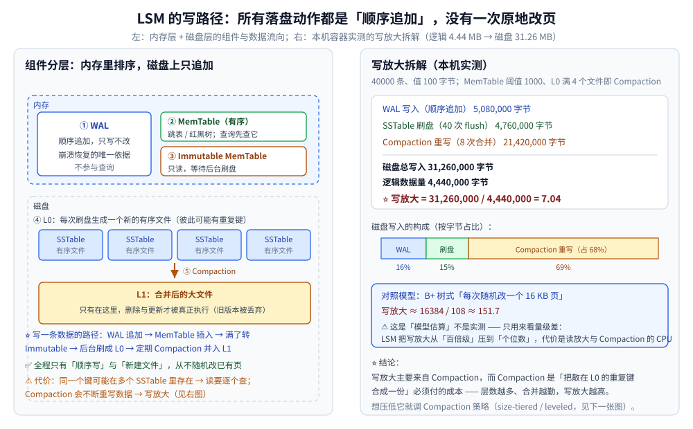
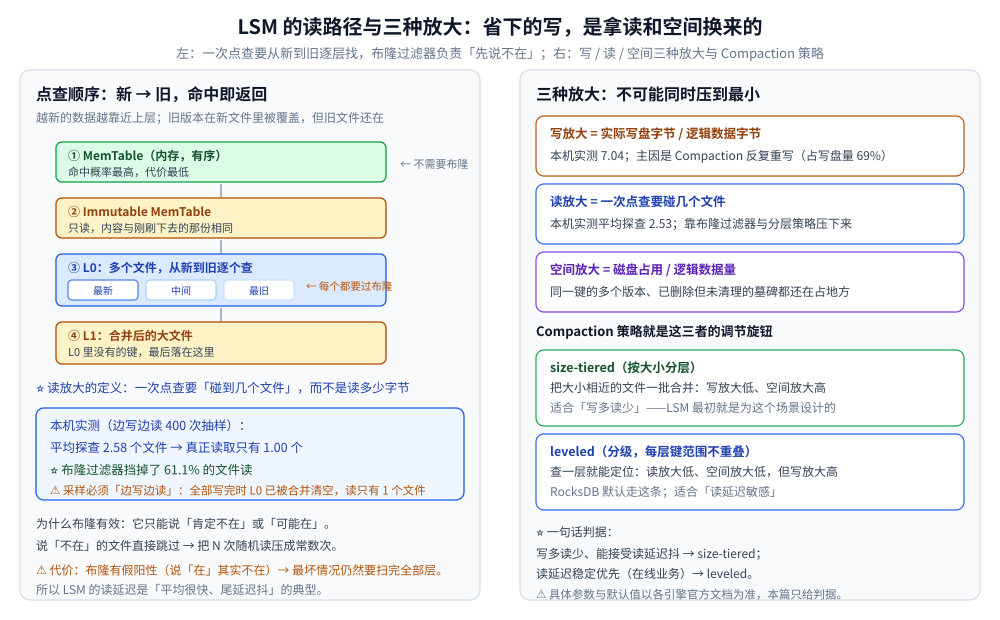

# LSM 树

> Log-Structured Merge Tree：**用「顺序写」换「读放大」** 的存储引擎核心，
> 回答「B+ 树在写多读少的场景为什么会输、LSM 为此付出了什么代价」。
>
> ⭐ 边界先说清：本篇讲**存储引擎层的结构与代价**（MemTable / SSTable / Compaction / 三种放大）。
> 「B+ 树为什么是磁盘索引首选」的完整推导见 [B树与B+树.md](B树与B+树.md)；
> 全目录选型总纲见 [树的形态与选型.md](树的形态与选型.md)。
>
> 内容整理自个人学习笔记，素材见 [素材清单](../../../素材清单.md)。
>
> 📎 本篇读数来自**自写的极简 LSM 实现**（MemTable + WAL + 两级 SSTable + Compaction），在本机**容器**里实跑逐字抄录：**Go 1.26.8（linux/amd64，`golang:1.26-alpine`）**。
> ⚠️ 读路径抽样依赖随机数 → 一律用「固定 seed 的本地随机源」（Go ≥ 1.24 的 `rand.Seed` 已不再影响全局随机源，用它写实验会「看起来可复现、其实每次都不同」）；**两个确定性数字（写放大 7.04 / 字节数）整篇重跑逐字相同**。
>
> ✅ **实测口径**：写 40000 条，键 `key%08d`（11 字节）、值 100 字节 → 逻辑数据 4,440,000 字节；
> MemTable 阈值 1000 条；L0 超过 4 个文件触发 Compaction。可整篇重跑，数字不变。
> ⚠️ **仍未实测**：真实引擎（RocksDB / LevelDB）的具体参数、真实布隆位数组的误判率、真实磁盘 I/O 时序。

---

## 一、B+ 树的痛点是"原地改页"，为什么这会致命？

**本节要点**：B+ 树为「读」优化 —— 一页放满路由项、一次 I/O 命中一层。但这套优化对**写**是不利的：
**改一个键，就要把整页读进来、改、再写回去。**

B+ 树的写路径（细节见 [B树与B+树.md](B树与B+树.md) 第二节）：

1. 定位键所在的叶子页 → **随机读 1 页**；
2. 改页内内容 → **随机写 1 页**；
3. 页满了要**分裂** → 再多写 1~2 页 + 更新父页。

⭐ **三个结构性问题**：

| 问题 | 后果 |
|---|---|
| **写入顺序 = 键顺序**，业务上键往往是随机的 | 每次写都是**随机 I/O**（机械盘时代致命，SSD 上表现为写放大与寿命） |
| **最小写入单位是一页**（InnoDB 默认 16 KB） | 改 100 字节也要写 16 KB → 天然写放大 |
| **分裂 + 空间碎片** | 页利用率降到 ~50% 是常态，空间放大跟着上来 |

⚠️ 顺带一个常被忽略的点：**改 100 字节写 16 KB** 这件事本身就把写放大推到了百倍级。
下面的「对照模型」把它算成一个参考量级（**是模型估算，不是实测**）。

**LSM 的破局点**：既然「随机改」贵，那就**永远不原地改** ——
所有写都变成**顺序追加**（写到日志、写到新文件），把"整理"这件事**推迟到后台批量做**。

---

## 二、LSM 的五个组件各自解决什么？

**本节要点**：五个组件不是并列的，而是沿「内存 → 磁盘」的一条流水线，每个组件解决**上一环留下的一个问题**。

| 组件 | 位置 | 解决什么问题 |
|---|---|---|
| **WAL**（Write-Ahead Log） | 内存（追加写文件） | 内存数据**还没落盘就崩了**怎么办 → 先顺序写日志，重启回放 |
| **MemTable** | 内存 | 需要**有序**才能刷成有序文件 → 用跳表 / 红黑树（见 [平衡树.md](平衡树.md) 第六节为什么跳表合适） |
| **Immutable MemTable** | 内存 | MemTable 刷盘时**不能阻塞写入** → 满了转成只读，新开一个继续写 |
| **SSTable** | 磁盘 | 内存放不下的数据 → 刷成**内部有序**的文件，永不修改 |
| **Compaction** | 磁盘（后台） | 同一个键散在多个文件里 + 旧版本没清 → **合并**成更大的有序文件 |

⭐ **一条贯穿全篇的设计原则**：**"不变"是效率的来源**。
SSTable 一旦写出就**永不修改**（immutable），因此可以顺序写、可以压缩、可以由多个读者并发读。
所有"更新"与"删除"都只是**写一条新的记录**（删除是墓碑 `tombstone`），靠 Compaction 在后台真正生效。



### 2.1 MemTable 为什么要"有序"

因为刷盘时要写成**内部有序**的 SSTable（这样后续才能二分查找、才能顺序合并）。
如果 MemTable 是无序的哈希表，刷盘前还得整体排序一次 → 内存峰值与延迟都会变差。

⭐ **跳表比红黑树更适合 MemTable** 的两条理由（对照见 [平衡树.md](平衡树.md) 第六节）：

1. **写多**：跳表增删只动局部指针，不像红黑树要变色 + 旋转；
2. **并发友好**：跳表的无锁实现远比平衡树的旋转容易做。

### 2.2 删除为什么是"写一条墓碑"

既然 SSTable 不可修改，就**没有地方能"擦掉"一个键**。所以删除只能写成一条特殊记录：
「`key` 被删除了」。查询时若先遇到墓碑，就返回"不存在"，即使更旧的文件里还有这个键。

⚠️ 墓碑会一直占地方，直到 Compaction 把它和它遮蔽的旧值一起清掉 —— 这是**空间放大**的主要来源之一。

---

## 三、写路径与读路径分别是怎样的？

**本节要点**：写路径**全是顺序操作**（这是 LSM 的全部价值）；读路径**要从新到旧逐层找**（这是它付出的代价）。

### 3.1 写路径（六步）

| 步骤 | 动作 | 特点 |
|---|---|---|
| ① | 追加到 **WAL** | 顺序写，只写不改 |
| ② | 插入 **MemTable** | 内存操作，有序结构 |
| ③ | MemTable 满了 → 转成 **Immutable** | 只读，等待刷盘 |
| ④ | 后台线程把它刷成 **L0 SSTable** | 顺序写一个新文件 |
| ⑤ | L0 文件数超阈值 → **Compaction** | 合并 + 去重 + 丢旧版本 |
| ⑥ | 合并结果写入更下一层（**L1**） | 依然是顺序写新文件 |

⭐ **第 ⑤ 步是唯一"重写数据"的地方** —— 也是 LSM 全部写放大的来源（见第四节实测）。

### 3.2 读路径（从新到旧）

| 顺序 | 位置 | 说明 |
|---|---|---|
| ① | **MemTable** | 最新数据，命中率最高 |
| ② | **Immutable MemTable** | 内容与刚刷下去的那份重复 |
| ③ | **L0 SSTable**（新 → 旧） | 每个文件都可能含目标键，要逐个查 |
| ④ | **L1**（及更下层） | L0 都没有才轮到 |

⭐ **两个关键优化**：

- **布隆过滤器**：每个 SSTable 配一个位数组，查询前先问「这个键**肯定不在**吗」；
  答"不在"就跳过整个文件（本机实测挡掉了 **61.1%** 的文件读，见第四节）；
- **分层有序**（leveled）：让每一层的键范围**互不重叠** → 每层只需查 1 个文件。代价是写放大变高。

⚠️ **读延迟的形态**：LSM 的平均读很快，但**尾延迟会抖**（最坏情况要扫完全部层）。
这是它做在线业务的硬伤，也是数据库（如 TiDB、MyRocks）把它与 B+ 树混用的原因。

### 3.3 核心实现的骨架

⭐ 下面是本机实测所用**极简 LSM** 的写路径核心（自写、约 200 行；此处只摘「写 / 刷盘 / 合并」三段）：

```go
func (l *LSM) Put(k, v string) {
	l.walBytes += int64(len(k) + len(v) + 16) // ① WAL：顺序追加，只累加不回头改
	l.disk.bytesWritten += int64(len(k) + len(v) + 16)
	l.logicalBytes += int64(len(k) + len(v))

	l.mem[k] = v // ② MemTable：内存中有序结构
	if len(l.mem) >= l.memLimit {
		l.flush() // ③ 满了就刷
	}
}

// 把 MemTable 排好序刷成一个 L0 SSTable（④）
func (l *LSM) flush() {
	keys := make([]string, 0, len(l.mem))
	for k := range l.mem {
		keys = append(keys, k)
	}
	sort.Strings(keys)
	entries := make([]kv, 0, len(keys))
	bf := newBloom(len(keys), 0.01) // ⭐ 每个文件配一个布隆过滤器
	for _, k := range keys {
		entries = append(entries, kv{k, l.mem[k]})
		bf.Add(k)
	}
	l.disk.WriteSSTable(entries) // 顺序写一个**新**文件，不碰旧文件
	l.mem = map[string]string{}

	if len(l.disk.files) > l.l0MaxFiles {
		l.compact() // ⑤⑥ L0 满了就合并
	}
}

// 合并：把所有 L0 + 旧 L1 归并成一个新 L1，旧的整批丢弃（⑤⑥）
func (l *LSM) compact() {
	merged := map[string]string{}
	for i := 0; i < len(l.disk.files); i++ {
		for _, e := range l.disk.files[i] {
			merged[e.k] = e.v // 越新越优先：后读到的覆盖先读到的
		}
	}
	// ... 排序、写成新的 L1、把 l.disk.files 置空（旧文件被丢弃）
}
```

⚠️ 这段是**教学用简化实现**：真实引擎要处理「层内有序 + 层间 keyspace 划分」、并发 Compaction、
限速（Compaction 抢 I/O 会拖慢前台）、崩溃一致性（MANIFEST / 版本编辑）。**它只用来量代价，不要照抄上线。**

---

## 四、三种放大怎么权衡？

**本节要点**：写放大、读放大、空间放大**不可能同时压到最小**。Compaction 策略就是那个旋钮。

### 4.1 本机实测：写放大 7.04

```text
===== 极简 LSM 的写放大与读放大 =====
写入 40000 条，值长 100 字节，MemTable 阈值 1000 条，L0 超过 4 个文件触发 Compaction

[写路径]
  WAL 写入            : 5080000 字节（顺序追加）
  SSTable 刷盘         : 4760000 字节（40 次 flush）
  Compaction 重写      : 21420000 字节（8 次合并）
  ── 磁盘总写入        : 31260000 字节
  ── 逻辑数据量        : 4440000 字节
  ⭐ 写放大            : 7.04  （= 磁盘总写入 / 逻辑数据量）
```

**读法**：

- 逻辑上只写了 **4.44 MB**，磁盘上却实写了 **31.26 MB** → 写放大 **7.04**；
- 其中 **Compaction 一项就占了 21.42 MB（写盘量的 69%）** —— 写放大的主因非常明确；
- WAL 与刷盘各只占 16% / 15%，**而且全是顺序写**。

**对照模型（⚠️ 模型不是实测）**：若改成「每次随机改一个 16 KB 页」（B+ 树式原地改），
写放大 ≈ `16384 / 108 ≈ 151.7`。⭐ 量级差在 **20 倍以上** —— 这就是 LSM 存在的理由。

### 4.2 本机实测：读放大与布隆过滤

```text
[读路径] 边写边读：全程每 500 条抽 5 次点查，共 400 次
  每次点查平均要「探查」2.58 个文件（MemTable 命中记 0）
  其中真正发生读取的只有 1.00 个（布隆说「肯定不在」的直接跳过）
  ⭐ 布隆过滤器挡掉了 61.1% 的文件读
```

⚠️ **一个实验设计上的坑（本机踩过）**：如果**全部写完再测读**，此时 Compaction 已把 L0 并空，
读只会碰到 1 个文件、"读放大"看起来等于 1 —— 结论完全失真。
⭐ **必须「边写边读」采样**，才能覆盖「L0 里堆着好几个文件」的真实状态。

### 4.3 三种放大的三角

| 放大 | 定义 | 本机实测 | 主要来源 |
|---|---|---|---|
| **写放大** | 实际写盘字节 / 逻辑数据字节 | **7.04** | Compaction 反复重写（占 69%） |
| **读放大** | 一次点查要碰几个文件 | 平均**探查 2.58**、实读 1.00 | 同一个键散在多层多个文件里 |
| **空间放大** | 磁盘占用 / 逻辑数据量 | 未单独度量 | 多版本未合并 + 墓碑未清理 |

**Compaction 策略就是旋钮**：

| 策略 | 做法 | 换来什么 / 付出什么 |
|---|---|---|
| **size-tiered**（按大小分层） | 把大小相近的文件成批合并 | 写放大**低**、空间放大**高**；适合写多读少 |
| **leveled**（分级、每层键范围不重叠） | 每层内键范围不重叠，逐层下压 | 读放大**低**、空间放大**低**，但写放大**高**；RocksDB 默认，适合读延迟敏感 |

⭐ **一句话判据**：**写多读少、能接受读延迟抖 → size-tiered；读延迟稳定优先（在线业务）→ leveled。**
⚠️ 各引擎的具体参数与默认值以官方文档为准，本篇只给判据。



---

## 五、LSM 会取代 B+ 树吗？

**本节要点**：不会。两者的取舍是**读写比例 + 延迟要求**，不是"新旧"。真实系统越来越倾向于**两者混用**。

| 维度 | B+ 树 | LSM 树 |
|---|---|---|
| **写** | 原地改页，随机写，页分裂 | 顺序追加，吞吐高 |
| **读** | 稳定 `O(log n)`，层数即 I/O 次数 | 可能扫多个 SSTable；平均好、**尾延迟抖** |
| **空间** | 页利用率约 50%（分裂造成） | 多版本 + 墓碑，但可压缩（同层文件易压） |
| **写放大** | 改 100 字节写 16 KB（**模型 ≈ 151.7**） | 本机实测 **7.04** |
| **实现复杂度** | 成熟、并发控制方案固定 | Compaction 策略 / 限速 / 崩溃恢复，**调参空间大、坑也多** |
| **典型产品** | MySQL InnoDB、PostgreSQL | RocksDB、LevelDB、Cassandra、HBase 的底层 |

⭐ **两条选型判据**：

1. **看读写比**：写远多于读（日志、时序、消息、KV 写入密集）→ LSM；读写均衡或读多 → B+ 树；
2. **看延迟要求**：在线业务要**可预测的 P99** → 优先 B+ 树；能接受尾延迟抖动、要极高写吞吐 → LSM。

⚠️ **"取代"这个问法本身有问题**：两者都是**为不同工作负载优化**的引擎。
近年的方向是**融合**：MySQL 上的 MyRocks（LSM）、TiDB 的 TiKV（RocksDB）与 TiFlash（列存）并存、
以及 B+ 树引擎引入 LSM 式的「写缓冲 + 批量刷」来减少随机写。

---

## 使用：LSM 在你的系统里以什么形式出现

**第一层：你用的数据库可能已经是 LSM。** Cassandra / HBase / ScyllaDB / RocksDB 系的嵌入式存储（TiKV、CockroachDB、MyRocks）都是。判断方式很直接：**看它有没有「墓碑删除」和「Compaction」这两个概念**。

**第二层：你可以直接用它当本地存储引擎。** RocksDB 有大量语言的绑定，适合「写多、需要范围扫描、单机」的场景 —— 例如时序数据、日志索引、消息队列的持久化层。

**第三层：参数调优的三件事。** 见到 LSM 引擎，值得先看三个旋钮：**MemTable 大小**（影响刷盘频率）、**Compaction 策略与并发度**（影响写放大与读尾延迟）、**布隆过滤器开关**（影响读放大）。本节给的是判据方向，具体默认值以各引擎官方文档为准。

**第四层：它的教训可以外推。** LSM 的核心思想 —— **"把随机写变成顺序写，把整理推迟到后台批量做"** —— 在任何写入密集的系统里都值得借用（例如：先写日志再异步整理、批量提交代替逐条更新）。这与 [平衡树.md](平衡树.md) 里「跳表用概率换掉旋转」是同一种思维方式：**把"必须维持的不变量"换成"代价更低的近似或延后"**。

---

## 延伸追问

- **LSM 树的读放大怎么优化？** → 三条一起上：① **布隆过滤器**（本机实测挡掉 61.1% 的文件读）；② **leveled 分层**让每层键范围不重叠，每层只查 1 个文件；③ **Compaction 控制层数**（层数越少，最坏情况要碰的文件越少）。⚠️ 前两条都会推高写放大或实现复杂度。
- **Compaction 策略有哪些？** → 主流两类：**size-tiered**（把大小相近的文件成批合并，写放大低、空间放大高）与 **leveled**（每层键范围不重叠，读放大低、写放大高，RocksDB 默认）。此外还有 tiered+leveled 的混合策略。⭐ 判据是「写多读少 → size-tiered；读延迟敏感 → leveled」。
- **为什么 LSM 树适合写多读少？** → 因为它把写路径上的所有动作都变成了**顺序写**（WAL 追加 + 刷成新文件），彻底避开了 B+ 树「随机改页」的随机 I/O；而它为此付的代价（读放大、空间放大）正好是"读多"场景才会踩到的痛点。**代价与场景错位，所以它在写多的场景赢。**
- **为什么 LSM 的删除是"写一条墓碑"，不能直接删？** → 因为 SSTable **不可修改**（这是它能顺序写、能压缩、能被多读并发读的前提）。所以删除只能表现为「写一条新记录」；查询时墓碑遮蔽更旧文件里的同键值，直到 Compaction 把它们一起清掉。⚠️ 代价是墓碑会长期占用空间。
- **LSM 会取代 B+ 树吗？** → 不会。两者是为**不同读写比与延迟要求**优化的引擎：LSM 赢在写吞吐（实测写放大 7.04 vs 模型 151.7），B+ 树赢在读延迟可预测与实现成熟。真实趋势是**混用**（如 MyRocks / TiKV 用 LSM，TiFlash 用列存），而不是替代。
- **MemTable 为什么常用跳表而不是红黑树？** → 两个理由都在「写」上：① 跳表增删只动局部指针，不需要像红黑树那样变色 + 旋转；② 跳表的无锁并发实现远比平衡树的旋转容易做。⚠️ 但它牺牲了最坏情况保证 —— 这在内存、写多的 MemTable 场景是可以接受的（详见 [平衡树.md](平衡树.md) 第六节）。

---

## 关联

- [B树与B+树.md](B树与B+树.md) — **本篇的直接对照面**：B+ 树的五步推导与「写多读少改用 LSM」这条失效边界的展开
- [平衡树.md](平衡树.md) — MemTable 为什么用跳表：六节的「用概率代替旋转」与跳表的并发优势
- [跳跃表.md](../高级数据结构/跳跃表.md) — MemTable 那个「跳表」的本体篇：多层链表形态、随机层数分布实测、插入只改局部指针的完整机制
- [树的形态与选型.md](树的形态与选型.md) — 全目录**选型总纲**：各类树的分工与隐藏代价总表
- [二叉树结构与性质.md](二叉树结构与性质.md) — 基础篇：树高、层数与 `O(log n)` 的前提
- [索引设计与EXPLAIN.md](../../../03-数据与中间件/数据存储/关系型/MySQL/索引设计与EXPLAIN.md) — B+ 树索引在 MySQL 的落地（回表、覆盖索引、页分裂与合并）
- [存储选型.md](../../../03-数据与中间件/数据存储/存储选型.md) — 存储引擎层的横向选型（LSM 在其中的位置）
- [索引原理.md](../../../03-数据与中间件/数据存储/搜索与分析/Elasticsearch/索引原理.md) — 另一条路线：倒排索引与 FST（同样是"不可变段 + 合并"的思路）
- [淘汰策略.md](../../../03-数据与中间件/数据存储/NoSQL/Redis/淘汰策略.md) — 内存侧的对照：LRU / LFU 与 LSM 的"延迟整理"是同一类权衡
- [README.md](../README.md) — 数据结构目录总纲：选型对照表与「结构 × 隐藏代价」总表
> 反向引用（本篇被下列文档引到）：[空间索引与R树.md](空间索引与R树.md)、[架构与存储引擎.md](../../../03-数据与中间件/数据存储/列式数据库/ClickHouse/架构与存储引擎.md)、[时序数据库选型对比.md](../../../03-数据与中间件/数据存储/时序数据库/时序数据库选型对比.md)
