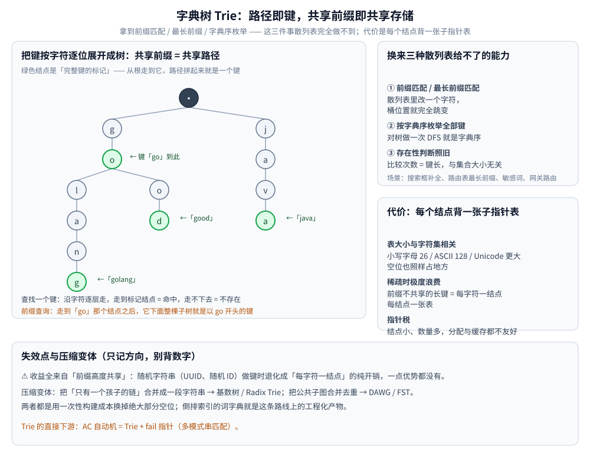

# Trie

> 覆盖「把键按字符逐位展开成树、共享前缀即共享路径」的结构：换来**前缀匹配 / 最长前缀 / 字典序枚举**，
> 这是散列表完全给不了的；代价是**每个节点都背一张子指针表**，稀疏时极度浪费。
>
> ⭐ 本篇是**结构篇**：讲形态、能力边界与内存代价。两个直接下游 ——
> [AC自动机.md](../../算法/字符串匹配/AC自动机.md)（Trie + fail 指针做多模式匹配）与
> [区间与索引树.md](区间与索引树.md) 第五节（压成 Radix 后替网关做路由的最长前缀匹配）。
>
> 素材来源：博客 [数据结构](https://blog.csdn.net/weixin_43837229/article/details/103222660)（2019-11-24）——
> 本篇取该文「补充结构」一节的字典树部分；**工程动机**为本次整理补充，
> 参考《数据结构和算法图解》（杰伊·温格罗）与《算法图解》（巴尔加瓦）。逐篇登记见 [素材清单](../../../素材清单.md)。
>
> 全目录的判据与选型总表见 [README.md](../README.md)；树的选型总纲见 [树的形态与选型.md](树的形态与选型.md)。

---

## 一、字典树（Trie）与前缀匹配换来什么能力？

**本节要点**：把键按字符逐位展开成树，共享前缀即共享路径——于是拿到**前缀匹配 / 最长前缀 / 字典序枚举**，这是散列表完全给不了的。

**结构**：把键按字符逐位展开成树，从根到某个标记节点的路径就是一个完整键；共享前缀自然共享路径。

**它换来什么能力**：**前缀匹配 / 最长前缀匹配 / 按字典序枚举**——这些是散列表完全做不到的（散列表里改一个字符，桶位置就完全跳变）。典型场景：搜索框自动补全、IP 路由表最长前缀匹配、敏感词匹配、网关按 path 前缀路由。

**内存代价在哪**（定性讲，别背数字）：

| 成本项 | 说明 |
|---|---|
| 每节点一个"子指针表" | 表大小与**字符集**相关（小写字母 26 / ASCII 128 / Unicode 更大），空位也占地方 |
| 稀疏时极度浪费 | 前缀不共享的长键，等于每个字符一个节点、每个节点背一张表 |
| 指针税 | 节点小、数量多，分配与缓存都不友好 |

**压缩变体（只记方向）**：把"只有一个孩子的链"合并成一段字符串（**基数树 / Radix Trie**），或把公共子图合并去重做成 **DAWG/FST**——用一次性构建成本换掉绝大部分空位。倒排索引的词字典就是这条路线上的工程化产物（见 [索引原理.md](../../../03-数据与中间件/数据存储/搜索与分析/Elasticsearch/索引原理.md)）。

> ⚠️ 失效点：Trie 的收益来自**前缀高度共享**。随机字符串（如 UUID、随机 ID）做键时它退化成"每字符一节点"的纯开销，一点优势都没有。

## 使用：Trie 在你的系统里以什么形式出现

**第一层：搜索框的自动补全。** 用户输入 `/api` 要立刻列出「以它开头的所有键」——这正是 Trie 的定义域。⚠️ 真正难的不是遍历，而是**给结果排序**（按热度 / 频率），所以工程实现通常是「Trie 定前缀 + 每个节点挂 Top-K 候选」。

**第二层：网关与 IP 路由表的「最长前缀匹配」。** 路由要的从来不是等值命中，而是"走得越深越优先"，所以底层用的是 Trie 的压缩形态 Radix（比较次数 = **路径段数**而非字符数，几千条路由也不会慢）。机制与实测见 [区间与索引树.md](区间与索引树.md) 第五节。

**第三层：敏感词与多模式匹配。** Trie 是 AC 自动机的底座——把 Trie 的失配跳转补成 fail 指针，就得到"一次扫描命中全部模式"的能力（见 [AC自动机.md](../../算法/字符串匹配/AC自动机.md)）。⚠️ **这两篇不重复**：Trie 讲结构与代价，AC 自动机讲 fail 怎么算。

**第四层：`git` 与编译器的字符串去重。** 把公共子串合并成有向无环图的 DAWG / FST，是"词典省内存"的通用手段——判据是**这份词典要被反复加载几次**，一次构建成本要靠多次加载摊回来。

---

## 延伸追问

- **Trie 和散列表都能做"存在性判断"，差别在哪？** → 散列表只能等值；Trie 天生支持**前缀匹配 / 最长前缀**，代价是每个节点都背一组子指针，内存开销大。
- **Trie 的内存在什么情况下会爆？** → 键长且前缀不共享时（随机串、UUID）：节点数 ≈ 字符总数，每个节点还各背一张子表。解法是缩小字符集（把 `[26]int` 换成哈希 / 压缩边）、或用基数树 / DAWG 合并独苗链与公共子图。
- **Trie 和 Radix Tree 该怎么选？** → 要**逐字符**的细粒度操作（如敏感词逐位回退）用 Trie；只要**最长前缀匹配**且路径是长字符串（URL、IP）用 Radix —— 比较次数从"字符个数"降到"路径段数"。⚠️ 代价是插入 / 删除要处理**边的分裂与合并**。
- **为什么网关路由不用哈希表？** → 哈希命中即结束，回答不了"哪个候选前缀最长"；Radix 必须走到走不动为止，最后记下的那个才是最长前缀（详见 [区间与索引树.md](区间与索引树.md) 第五节）。
- **Trie 能替代 B+ 树做磁盘索引吗？** → 不能。Trie 的节点小而多、指针追逐，**无法按页打包**，磁盘上每次下探就是一次随机 I/O；磁盘索引的活归 [B树与B+树.md](B树与B+树.md)。

---

## 关联

- [区间与索引树.md](区间与索引树.md) — Radix 压缩（同一组词节点数 9 → 6）与网关最长前缀匹配的完整推演
- [AC自动机.md](../../算法/字符串匹配/AC自动机.md) — Trie + fail 指针（多模式匹配），Trie 的直接下游
- [KMP.md](../../算法/字符串匹配/KMP.md) — 单模式匹配的对应物（前缀函数），与 fail 指针同源
- [散列表.md](../哈希表/散列表.md) — Trie 要替代的那个「等值命中」
- [树的形态与选型.md](树的形态与选型.md) — 本目录（树）的**选型总纲**：各类树的分工与隐藏代价
- [索引原理.md](../../../03-数据与中间件/数据存储/搜索与分析/Elasticsearch/索引原理.md) — 词典 FST 的工程落地
- [README.md](../README.md) — 数据结构目录的选型总表（操作 × 隐藏代价 × 场景）
> 反向引用（本篇被下列文档引到）：[空间索引与R树.md](空间索引与R树.md)、[倒排索引.md](../高级数据结构/倒排索引.md)
