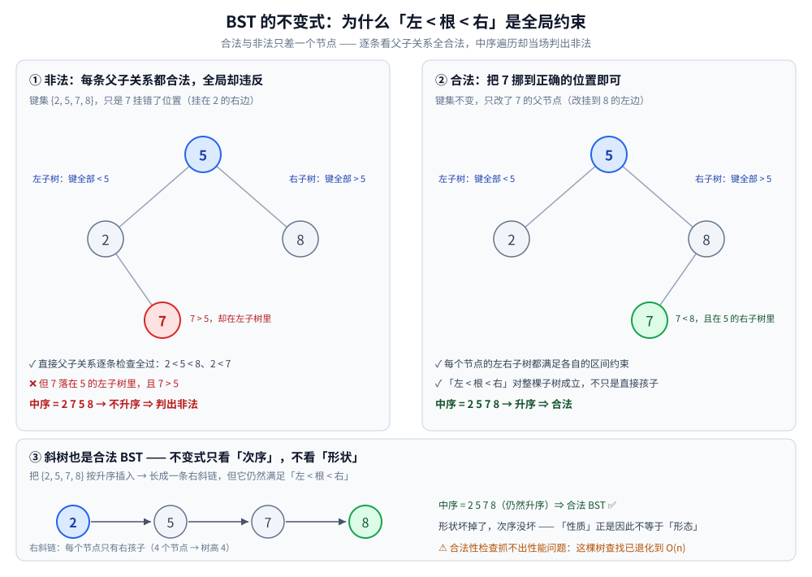
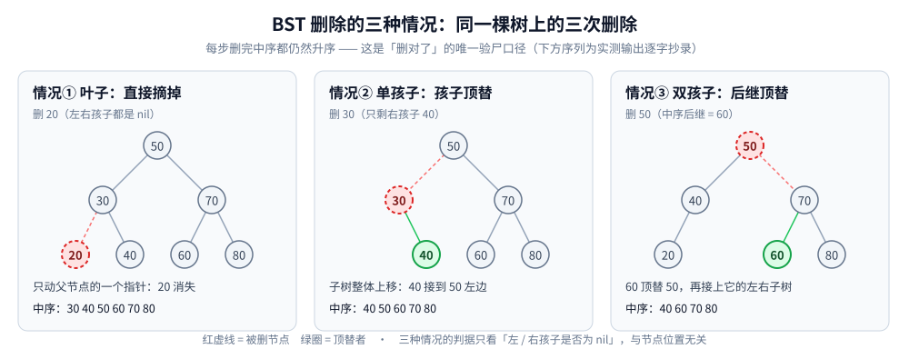
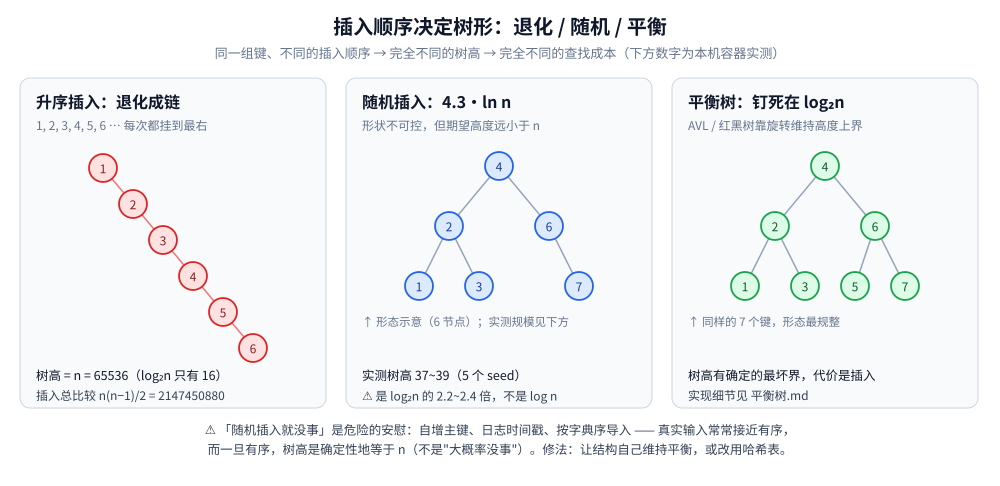

# 二叉搜索树

> 二叉搜索树，简称 BST（Binary Search Tree）也叫「二叉查找树」「二叉排序树」。
> 
> BST 的结构性质与四个核心操作 —— **查找、插入、删除、前驱/后继**，
> 以及「中序有序」这条性质如何支撑范围查询与合法性校验。
>
> ⭐ 边界先说清：本篇只讲 **BST 本身的操作与性质**。
> 基础结构（术语、存储、公式）见 [二叉树结构与性质.md](二叉树结构与性质.md)；
> 遍历机制见 [树的遍历.md](树的遍历.md)；
> **BST 退化后怎么修复**见 [平衡树.md](平衡树.md)；
> 用 BST 解题（验证、LCA、树形 DP）见 [树与二叉搜索树算法.md](../../算法/基础算法/树与二叉搜索树算法.md)；
> 全目录的选型总纲见 [树的形态与选型.md](树的形态与选型.md)。
>
> 内容整理自个人学习笔记，素材见 [素材清单](../../../素材清单.md)。复杂度口径见 [复杂度分析.md](../../算法/基础算法/复杂度分析.md)。
>
> 📎 本篇输出均为本机**容器**实跑逐字抄录：**Go 1.26.8（linux/amd64，`golang:1.26-alpine`）**。
> 全部是**确定性计数**（节点数 / 树高 / 访问数 / 比较次数，**无耗时项**），连跑两遍 `diff` 为空；
> 随机数据一律来自「固定 seed 的**本地**随机源」（⚠️ Go ≥ 1.24 起 `rand.Seed` 不再影响全局随机源，
> 用全局源写"可复现"是假的）。

---

## 一、BST 的不变式：为什么「左 < 根 < 右」是全局约束？

**本节要点**：BST 的价值全压在一句话上 —— **对任意节点都成立**。
理解成「每个节点比左孩子大、比右孩子小」是**最常见也最致命**的误解：
那样训出来的检查器会放过非法树，而非法树上一切查询都会静默给错答案。

**定义**：一棵二叉树是二叉搜索树（BST），当且仅当对**每个**节点 `x` 都满足

- `x.Left` 子树里**所有**键 < `x.Key`；
- `x.Right` 子树里**所有**键 > `x.Key`。

⚠️ 两个「所有」是全部关键 —— 约束的是**整棵子树**，不是直接孩子。

**实测（反面构造）**：一棵 4 节点的树，`5` 为根、左 `2` 右 `8`、`2` 的右孩子是 `7`：

```text
        5
      /   \
     2     8
      \
       7        ← 7 在 5 的左子树里，7 > 5 ⇒ 全局违反
```

逐条检查**父子关系**：`2 < 5 < 8` ✅、`2 < 7` ✅ —— 每条都合法；
但**中序遍历**给出 `2 7 5 8`，**不升序** ⇒ 中序判据当场判出「非法」，父子判据判不出来。

**中序遍历 ⇒ 升序序列**，这是 BST 最核心的性质（也是它的定义式判据）。
实测：随机插入 1000 个键后中序遍历，节点数 1000、**严格升序** ✅。



> ⚠️ 「BST 是性质而不是形态」：它约束**键的大小关系**，不约束形状 ——
> 所以**斜树也是合法 BST**（见第一节末的构造）。这一句是第七节「退化」的伏笔。
> 详见 [二叉树结构与性质.md](二叉树结构与性质.md) 第三节。

---

## 二、查找为什么是 O(h) 而不是 O(log n)？

**本节要点**：`O(log n)` 里混进了**一个 BST 自己保证不了的前提 —— 平衡**。
`h` 是树高，随机插入时 `h ≈ 4.311 ln n`（≈ 2.99 log₂ n），
所以真实代价是「`O(log n)` 的 1.3~1.4 倍」而不是「等于 `log n`」。

```go
// 迭代版：一路比较到底，无递归、无栈溢出风险（推荐）
func (t *BST) Find(key int) *Node {
	cur := t.Root
	for cur != nil {
		switch {
		case key == cur.Key:
			return cur          // 命中
		case key < cur.Key:
			cur = cur.Left
		default:
			cur = cur.Right
		}
	}
	return nil                  // 走到空指针 = 缺席
}
```

递归版只有三行（`key == cur.Key ? cur : Find(cur.Left/Right)`），
但**深链会把递归深度推到 `h`** —— 升序插入 65536 个键时 `h = 65536`，
递归版会吃满 65536 层栈帧；迭代版只是循环 65536 次。**工程上迭代更稳**。

**查找路径长度 = 树高**：比较次数最多 `h` 次，平均是「成功查找的平均路径长」。
实测（n = 100000 随机 BST，树高 **42**）：

| 指标 | 实测值 | 对照 |
|---|---|---|
| 成功查找平均比较次数 | **21.92** 次 | `2·ln(n) = 23.03`、`log₂(n) = 16.61` |
| 最坏比较次数（= 树高） | **42** 次 | 同一棵树 |
| 平均值 / 完美平衡理论最优 | **1.32 倍** | —— |

⭐ 注意 21.92 这个数字**贴着 `2 ln n`** —— 这不是巧合：
随机 BST 的**平均路径长**渐近等于 `2 ln n ≈ 1.386 log₂ n`，
比完美平衡树的 `log₂ n` 多出约 **39%**。这就是「`O(log n)` 的常数其实是 1.39」的来源。

---

## 三、插入：为什么「插入顺序」就决定了树形？

**本节要点**：BST 的插入**不做任何结构调整** —— 它只是「一路比较到空位，挂上」。
于是**同一组键、不同插入顺序，会得到完全不同形状的树**，性能也随之天差地别。

```go
// 迭代插入：一路比较到空位，挂在父节点下
func (t *BST) Insert(key int) {
	var parent *Node
	cur := t.Root
	for cur != nil {
		parent = cur
		if key < cur.Key {
			cur = cur.Left
		} else if key > cur.Key {
			cur = cur.Right
		} else {
			return // 重复键不插入（BST 的键集合语义）
		}
	}
	n := &Node{Key: key, Parent: parent}
	switch {
	case parent == nil:
		t.Root = n          // 第一个键成为根
	case key < parent.Key:
		parent.Left = n
	default:
		parent.Right = n
	}
}
```

⭐ **插入顺序如何决定树形 —— 实测（n = 65536）**：

| 插入顺序 | 树高 | 与 `log₂(n) = 16` 的差 |
|---|---|---|
| 升序 `1, 2, 3, …, 65536` | **65536** | **4096 倍** |
| 随机（seed = 100/101/102/103/104） | 39 / 37 / 39 / 39 / 37 | 约 2.3~2.4 倍 |

升序插入的总比较次数是 **2147450880**，正好等于 `n(n−1)/2`
（第 i 次插入要比较 `i−1` 次：`0 + 1 + … + (n−1)`）——
⭐ **一次插入的代价 `O(h)` 乘以 n 次插入，在退化时就是 `O(n²)`**：
6.5 万个键、21 亿次比较，这就是"退化"的账单。

⚠️ **不是"插入没写好"，而是"插入根本不管平衡"** —— 这是设计取舍，不是 bug。

---

## 四、删除为什么分三种情况？

**本节要点**：删除的复杂度全在「**摘掉一个节点后，谁替它的位置**」。
孩子数为 0 / 1 时答案唯一（空或那个孩子）；**孩子数为 2 时 BST 不允许随便挑** ——
顶替者必须满足「左子树全部 < 它 < 右子树全部」，只有**中序前驱/后继**两个候选。

| 情况 | 判定 | 做法 |
|---|---|---|
| **① 叶子** | 无孩子 | 直接从父节点摘掉 |
| **② 只有一个孩子** | 左或右为 `nil` | 用**那个孩子顶替**（子树整体挂到祖父下） |
| **③ 两个孩子** | 左右都在 | 用**中序后继**（右子树最左节点）顶替，再删掉后继原位 |



**逐步实测**（一棵 7 节点树，三种情况依次触发；每步只看中序序列）：

```text
初始插入 [50 30 70 20 40 60 80]
  中序：20 30 40 50 60 70 80

删除 20 → 情况① 叶子：直接摘掉              中序：30 40 50 60 70 80
删除 30 → 情况② 单孩子：右孩子 40 顶替       中序：40 50 60 70 80
删除 50 → 情况③ 双孩子：中序后继 60 顶替     中序：40 60 70 80
          + 摘掉后继原位（后继无左孩子，用它的右孩子接上）
```

⭐ **三种情况的判据只看「左 / 右孩子是否为 nil」**，与节点的深度、位置无关。
每一步删完中序**仍然升序** —— 这正是「删对了」的唯一验尸口径。

```go
// 关键辅助：把 u 的位置直接交给 v（只动 3 个指针）
func (t *BST) transplant(u, v *Node) {
	switch {
	case u.Parent == nil:
		t.Root = v
	case u == u.Parent.Left:
		u.Parent.Left = v
	default:
		u.Parent.Right = v
	}
	if v != nil {
		v.Parent = u.Parent
	}
}

// 情况③：后继 y 顶替 z
y := minNode(z.Right) // 中序后继 = 右子树最左
if y.Parent != z {    // ⚠️ 后继不是 z 的直接右孩子时，先把它自己的右孩子接上
	t.transplant(y, y.Right)
	y.Right = z.Right
	y.Right.Parent = y
}
t.transplant(z, y)
y.Left = z.Left
y.Left.Parent = y
```

⚠️ **三个最容易写错的地方**：

1. **`y.Parent != z` 这个分支**：后继不是 `z` 的右孩子时（右子树有左分支），
   要先把后继的**右孩子**接到后继父节点上；漏掉这一步会在树里留下一条悬空指针，
   而且**中序可能仍然升序**（错误被隐藏），直到某次查找走进死路才暴露。
2. **`transplant` 必须维护 `v.Parent`**：否则"向上找祖先"的前驱/后继会沿错误的父链走。
3. **后继顶替后 `y.Left = z.Left` 不能忘**：只接右子树会丢掉整棵左子树。

**为什么用后继而不是前驱？** 两者**都正确**（后继 = 右子树最左 = 最小的比 `z` 大的键；
前驱 = 左子树最右 = 最大的比 `z` 小的键，都满足不变式）。
唯一的理由是**一致性**：全库统一选一个，读者/测试只需记一条规则。
`CLRS` 与绝大多数教材选**后继**，本篇跟随。

---

## 五、前驱与后继怎么找？

**本节要点**：两条路径，判据只看「**那一侧子树在不在**」：
有右子树 → 后继是**右子树最左**；没有 → **向上找第一个「我是左孩子」的祖先**。
第二条是面试高频，也是删除操作的依赖项。

```go
// 中序后继：比 n 大的键里最小的那个
func successor(n *Node) *Node {
	if n.Right != nil {                 // 情形 A：有右子树
		m := n.Right
		for m.Left != nil {
			m = m.Left                  // 一路向左
		}
		return m
	}
	cur, p := n, n.Parent               // 情形 B：没有右子树
	for p != nil && cur == p.Right {    // 只要「我是右孩子」就继续往上
		cur, p = p, p.Parent
	}
	return p                            // 停下时 cur 是左孩子 ⇒ p 就是后继；p 为 nil ⇒ 无后继（n 是最大元）
}
```

⭐ **情形 B 的正确性直觉**：一路往上跳过的是「我属于它们右子树」的祖先 ——
这些祖先都比 `n` **小**；第一个「我是左孩子」的祖先，说明 `n` 落在它的**左**子树里，
所以它比 `n` **大**，且是满足这一点的**最靠下**的祖先 ⇒ 就是最小的更大者。

**实测（1000 节点随机树，逐节点与中序相邻项对账）**：

| 操作 | 正确数 | 走「子树最左/最右」 | 走「向上找祖先」 |
|---|---|---|---|
| `successor` | **1000 / 1000** | 510 次 | 490 次 |
| `predecessor` | **1000 / 1000** | 489 次 | 511 次 |

⭐ **交叉验证**：走「向上找祖先」的次数必须**恰好等于「没有右子树（左子树）的节点数」**——
实测无右子树节点 **490** 个 = 后继走祖先路径 **490** 次 ✅（前驱侧 **511** = 511 ✅）。
这条恒等式是**结构层面的自检**：两类计数只要不等，代码必然错了。

⚠️ 边界：**最大元没有后继、最小元没有前驱**（返回 `nil`）——
循环结束时 `p == nil` 正是这个信号，别把它当错误。平均代价同样是 `O(h)`。

---

## 六、范围查询为什么比哈希表强？

**本节要点**：BST 的中序本身就是升序，所以「输出 `[a, b]` 之间的键」不需要扫描全表 ——
**两个剪枝判据把整棵子树一次性排除**，访问量降到「命中数 + 两条边界路径」。

```go
// 范围查询：中序 + 剪枝
func (t *BST) RangeQuery(lo, hi int) []int {
	var out []int
	var walk func(n *Node)
	walk = func(n *Node) {
		if n == nil {
			return
		}
		if n.Key > lo {          // 剪枝①：n.Key <= lo ⇒ 左子树全部 <= lo，整棵不进
			walk(n.Left)
		}
		if lo <= n.Key && n.Key <= hi {
			out = append(out, n.Key)
		}
		if n.Key < hi {          // 剪枝②：n.Key >= hi ⇒ 右子树全部 >= hi，整棵不进
			walk(n.Right)
		}
	}
	walk(t.Root)
	return out
}
```

⭐ 两个判据的本质：**BST 的子树有区间上界/下界** ——
「左子树全部 < `n.Key`」这条不变式让「已经不可能命中」的子树能被**整棵**扔掉，
而不是"进去看一眼再决定"。这正是哈希表给不了的能力。

**实测（n = 100000 随机 BST，树高 41）**：

| 查询区间 | 命中数 | 访问节点数 | 剪掉 | 与「全遍历后过滤」结果一致 |
|---|---|---|---|---|
| `[40000, 50000]` | 10001 | **10015** | 89.98% | ✅ |
| `[49990, 50010]`（窄区间） | 21 | **40** | **99.96%** | ✅ |
| `[0, 99999]`（全范围） | 100000 | 100000 | 0.00% | ✅ |

⭐ **关键读数不是"剪掉 90%"，而是「访问数 10015 ≈ 命中数 10001」** ——
访问的节点几乎**全部是答案本身**，多出来的 14 个就是两条边界路径的长度（约 `2h`）。
窄区间更能说明问题：命中 21 个只访问了 40 个节点，`100000` 个节点里有 `99960` 个
**一次都没被看**。全范围查询作为对照：剪枝率 0%（本来就要全看），结果正确 ✅。

**有序输出**更直接：一次中序遍历就是全部键的升序序列（见第一节实测）。

---

## 七、BST 会退化成什么样？随机插入能救吗？

**本节要点**：退化是**确定性的**（有序插入 → 链，`O(n)`），不是"概率问题"。
随机插入确实好得多，但**它也不是 `log n`** —— 随机 BST 的期望高度是 `4.311 ln n`。
⚠️ 而"随机插入"这个前提在真实数据上**经常不成立**（自增 ID、时间戳、字典序输入）。

**① 有序插入 → 退化成链**（实测，n = 65536）：

```text
树高 65536（= n）、总比较次数 2147450880 = n(n-1)/2、log2(n) = 16、差 4096 倍
```

⭐ 这条读数与 [平衡树.md](平衡树.md) 1.1 的实测**完全一致**（同为 `n = 65536`、同为 `65536`）；
树高是**确定性量**（不依赖随机源与平台），这正是"可整篇重跑"的底气。

**② 随机插入好多少 —— 实测（每个规模跑 200 次取平均，seed = 0..199）**：

| n | 实测平均高度 | `4.311·ln(n)` | `log₂(n)` | 实测 / 理论 |
|---|---|---|---|---|
| 1000 | 21.97 | 29.78 | 9.97 | 0.738 |
| 10000 | 31.22 | 39.71 | 13.29 | 0.786 |
| 100000 | 40.58 | 49.63 | 16.61 | 0.818 |



⭐ 三个必须读出来的信息：

1. **随机 BST 的高度是 `log₂n` 的 2.2~2.4 倍**（1000 → 100000：2.20 / 2.35 / 2.44），
   而不是教科书常被简化成的那句"平衡时是 `log₂n`"。
2. **渐近常数是 `4.311 ≈ 2.99 log₂ n`，但小 n 时还远远够不到**：
   实测比值 0.738 → 0.786 → 0.818 单调上升，说明 `n = 10⁵` 仍在"收敛路上"。
   写文档时把渐近值当成实测值，是最容易犯的错。
3. `4.311 ln n` 不是 `2 ln n` 的笔误：**树高**由"最长路径"决定（极值统计，系数 ~4.31），
   **平均路径长**才是 `2 ln n`（第二节的 21.92 次）。两者常被混为一谈。

⚠️ **「随机插入就没事」是危险的安慰**：真实数据流常常**接近有序**（
自增主键、日志时间戳、按字典序遍历的键、从有序文件导入）。
一旦输入有序，树高**确定性地**等于 `n`，而不是"大概率没事"。

**修复方向**：把"维持高度"变成结构的**职责** —— 旋转（AVL / 红黑树）、
掷骰子（跳表）、分裂合并（B 树 / B+ 树）、完全不管（LSM）。
完整实现与代价见 [平衡树.md](平衡树.md)，
磁盘侧见 [B树与B+树.md](B树与B+树.md)，选型见 [树的形态与选型.md](树的形态与选型.md)。

---

## 八、BST 与哈希表怎么选？

**本节要点**：判据只有一句话 —— **需求里有没有「序」**。
有「序」（范围、有序输出、前驱后继、排名）→ BST 系；只要等值命中 → 哈希表。

| 维度 | BST | 哈希表 |
|---|---|---|
| 等值查找 | `O(h)`：随机 `≈ 1.39 log₂n`，最坏 `O(n)` | **摊销 `O(1)`**，最坏 `O(n)` |
| 范围查询 `[a, b]` | ✅ 中序 + 剪枝 | ❌ 只能全扫 |
| 有序输出 | ✅ 一次中序 | ❌ 要额外排序 `O(n log n)` |
| 前驱 / 后继 | ✅ `O(h)` | ❌ 不存在"相邻键"的概念 |
| 键的空间 | 每节点 3 个指针（键 + 左 + 右 + 父） | 桶数组 + 链/树，负载因子是旋钮 |
| 实现复杂度 | 中（删除三种情况、旋转） | 低（但要处理扩容 / rehash） |

⚠️ 两条容易说错的补充：

- **哈希的 `O(1)` 是"摊销"的**，且最坏会退化到 `O(n)`（全冲突）。
  所以"BST 最坏 `O(n)`、哈希 `O(1)`"这个对比**不成立** —— 两边都有最坏情况，
  只是**退化的触发条件不同**（BST：输入有序；哈希：哈希函数差 / 负载因子失控）。
- **两者都缓存不友好**：都是指针跳转。真要"顺序访问 + 局部性"，
  比的是**排序数组 + 二分**（查询 `O(log n)`、插入 `O(n)`）——
  这也是 [查找与排序对比.md](../../算法/基础算法/查找与排序对比.md) 里的第三条路线。

⭐ 一句话：**要"序"才上 BST；只要"命中"就别付维护有序的代价。**
哈希表的退化与扩容见 [散列表.md](../哈希表/散列表.md)；
全结构的横向选型见 [树的形态与选型.md](树的形态与选型.md) 第三节。

---

## 使用：BST 在你的系统里以什么形式出现

**本节要点**：裸 BST 几乎**不出现在生产环境**，但它的**接口语义**无处不在 ——
工程上用的是「保证平衡的 BST」（红黑树）或它的替代品。

| 场景 | 实际用什么 | 为什么不是裸 BST |
|---|---|---|
| Java 有序映射 | `TreeMap` / `TreeSet`（红黑树） | 键可能按序到来，裸 BST 会退化 |
| C++ 有序映射 | `std::map` / `std::set`（红黑树） | 同上 |
| Go 有序映射 | 标准库**没有**；用 `btree` / `skiplist` 类库，或排序切片 | 官方选择"不内置"（见下） |
| 内存态索引 / 区间调度 | 按开始时间排序的平衡树、跳表 | 需要"前驱后继"来判重叠 |
| 数据库索引 | **磁盘上是 B+ 树**（不是 BST） | 层数即 I/O 次数，扇出必须大 |
| 文件系统目录树 | 树形结构 + 哈希/平衡树索引 | 需要按名有序列举 |

⚠️ **Go 为什么没有内置有序 map**：官方 FAQ 的口径是"**没有一种实现能对所有负载都好**"，
把选择权交给库（`google/btree`、`tidwall/btree`、跳表实现）；
Go 1.21+ 的 `slices` 包则让"排序切片 + `slices.BinarySearch`"这条路线更顺手 ——
**小而只读**的数据集，排序切片往往胜过任何树。

⭐ **一个反直觉的工程判据**：如果数据集**插入极少、查询极多**，
「排序数组 + 二分」的缓存局部性可能直接赢过红黑树 —— 树的价值在于**动态插入**。
判据与实测见 [数组与链表.md](../线性结构/数组与链表.md) 与
[查找与排序对比.md](../../算法/基础算法/查找与排序对比.md)。

---

## 延伸追问

- **BST 的查找为什么是 `O(h)` 而不是 `O(log n)`？** → 因为 `h` 由插入顺序决定，
  BST 自己**不保证** `h = O(log n)`：升序插入时 `h = n`（实测 65536），随机插入时 `h ≈ 4.311 ln n`
  （实测 n = 10⁵ → 平均 40.58）。写 `O(log n)` 时省掉的前提才是重点。
- **删除有两个孩子的节点时，为什么用后继？** → 前驱、后继**都正确**（都满足不变式），
  选哪个纯粹为了一致性；`CLRS` 与多数教材选后继。真正必须记住的是
  「后继不是直接右孩子时要先接上它的右孩子」这个易漏分支（第四节）。
- **验证 BST 为什么不能只比较父子节点？** → 因为不变式是**全局**的：
  实测那棵 `5 → (2 → 7)` 的树，每条父子关系都合法，但中序 `2 7 5 8` 不升序。
  中序（用上下界/前驱值做**单调性检查**）才是 O(n) 的正确判据 —— 见
  [树与二叉搜索树算法.md](../../算法/基础算法/树与二叉搜索树算法.md)。
- **同样是有序结构，BST 和跳表怎么选？** → 跳表用**概率**替代旋转，实现更简单、并发更好写
  （Redis 的 zset、LSM 的 MemTable 都用它）；红黑树的**最坏界是确定的**、内存更省。
  经验判据：要**确定性最坏界** → 红黑树；要**实现简单 / 并发友好** → 跳表。
  详见 [平衡树.md](平衡树.md) 第六节。
- **有序插入为什么会退化？怎么避免？** → 因为插入不调整结构，升序输入每次都挂在**最右**，
  于是长出一条右斜链，总比较次数 `n(n−1)/2`（实测 2147450880）。避免的三条路：
  ① 用**平衡树**（让结构自己修）；② **显式打乱输入**（洗牌后再插入，只适用于离线建树）；
  ③ 换成**哈希表**（不要"序"就别付这份代价）。见 [平衡树.md](平衡树.md)。

---

## 关联

- [二叉树结构与性质.md](二叉树结构与性质.md) — 地基：术语、深度与高度、两种存储结构、四条公式
- [树的遍历.md](树的遍历.md) — 中序遍历为什么在 BST 上有序、Morris 的 `O(1)` 空间
- [平衡树.md](平衡树.md) — BST 退化后怎么修：AVL 四种旋转、红黑树五性质、跳表
- [B树与B+树.md](B树与B+树.md) — 「有序查找」搬到磁盘上的版本（高扇出、层数即 I/O）
- [树的形态与选型.md](树的形态与选型.md) — 全目录选型总纲：三问定结构、隐藏代价总表
- [树与二叉搜索树算法.md](../../算法/基础算法/树与二叉搜索树算法.md) — 用 BST 解题：验证、LCA、树形 DP
- [散列表.md](../哈希表/散列表.md) — 等值查找的对照面：退化的两条路径、四道闸门
- [复杂度分析.md](../../算法/基础算法/复杂度分析.md) — `O(h)` 与 `O(log n)` 的口径
> 反向引用（本篇被下列文档引到）：[KD树与高维索引.md](KD树与高维索引.md)、[可持久化数据结构.md](可持久化数据结构.md)、[霍夫曼树.md](霍夫曼树.md)
