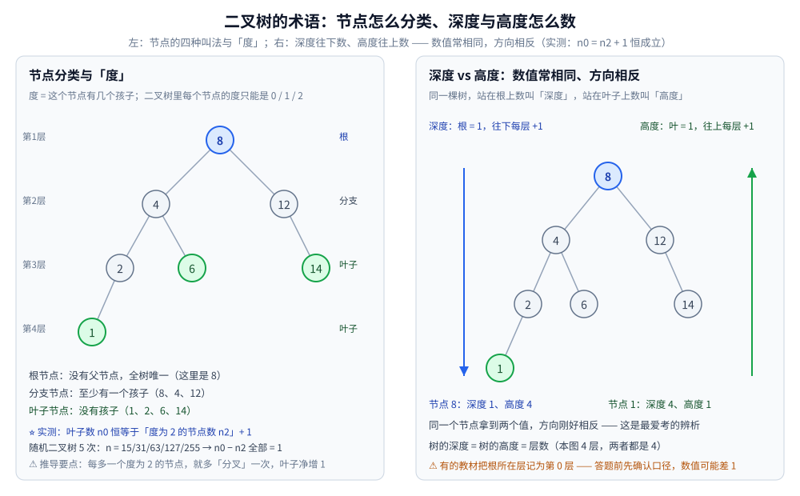
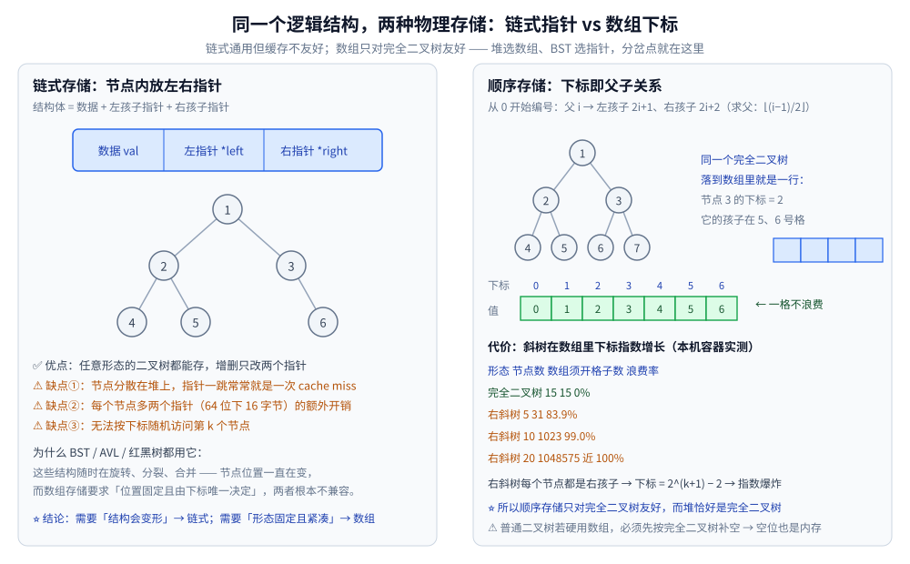
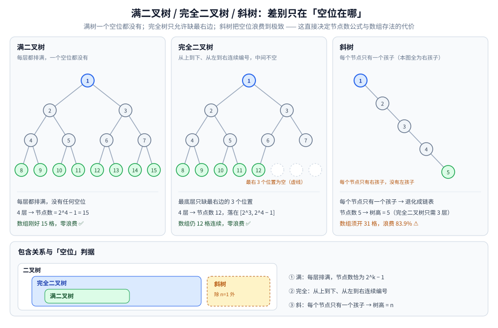

# 二叉树结构与性质

> 树结构的**地基**：术语怎么定、深度与高度怎么数、同一棵树为什么有两种存法、满 / 完全 / 斜树差在哪，
> 以及四条高频公式的来历与边界。
>
> ⭐ 边界先说清：本篇只讲**物理结构与基础性质**。遍历机制见 [树的遍历.md](树的遍历.md)；
> 平衡与旋转（AVL / 红黑树）见 [平衡树.md](平衡树.md)；全目录的选型总纲见 [树的形态与选型.md](树的形态与选型.md)；
> 多路与磁盘索引见 [B树与B+树.md](B树与B+树.md)。
>
> 内容整理自个人学习笔记，素材见 [素材清单](../../../素材清单.md)。
>
> 📎 本篇输出均为本机**容器**实跑逐字抄录：**Go 1.26.8（linux/amd64，`golang:1.26-alpine`）**。
> ⚠️ **随机数据一律来自「固定 seed 的本地随机源」**（`rand.New(rand.NewSource(...))`）——Go ≥ 1.24 的 `rand.Seed` 已**不再影响全局随机源**，用它写实验会「看起来可复现、其实每次都不同」（实测踩过）；本篇结构性数字整篇重跑**逐字相同**。
> ⚠️ 其中「顺序存储浪费率」是纯组合事实，与随机无关；「n0 / n1 / n2」表来自固定 seed 的随机二叉树。

---

## 一、树与二叉树的定义：为什么"一对多"要用递归描述？

**本节要点**：二叉树是**递归定义**的结构 —— 「一个根 + 左右两棵二叉树」。整个树的术语体系（深度、高度、度）都是为了给这个递归提供**度量**。

**递归定义**：二叉树是 `n ≥ 0` 个节点的有限集合，它要么为空，要么由一个**根节点**和两棵**互不相交**的、分别称为**左子树**与**右子树**的二叉树组成。

⭐ 这个定义里有两个词是别处没有的：**左右有序**（左子树和右子树不能互换）与**递归**（子树本身还是二叉树）。
前者让它区别于「普通的树」，后者解释了为什么树上的几乎所有算法都写成递归。

**关键术语**：

| 术语 | 含义 | 注意 |
|---|---|---|
| **节点的度** | 该节点拥有的**孩子个数** | 二叉树里只能是 0 / 1 / 2 |
| **叶子节点** | 度为 0 的节点 | 也叫终端节点 |
| **分支节点** | 度不为 0 的节点 | 也叫非终端节点 |
| **层次（level）** | 根在第 1 层，往下每层 +1 | ⚠️ 有的教材从第 0 层开始，见 1.2 |
| **深度（depth）** | 从**根**往下数到该节点 | 「根 = 1」 |
| **高度（height）** | 从**叶子**往上数到该节点 | 「叶子 = 1」 |
| **树的深度 / 高度** | 全部节点的最大层数 | 两者数值相同 |

⭐ **深度与高度是一对镜像概念**：数值通常相同，但**计算方向相反** —— 这是最常被追问的一处辨析。



### 1.1 为什么"深度 = 高度"却要分两个词

设树共 4 层：

- **根节点**：深度 = 1（它在最上面），高度 = 4（它离最远的叶子有 4 层）；
- **最深的叶子**：深度 = 4，高度 = 1；
- **整棵树**：深度 = 高度 = 4。

⭐ 判据：**同一个节点拿到两个值，方向刚好相反**。根拿到的「深度最小、高度最大」，叶子反之。
所以「求树高」与「求最大深度」是同一个问题，但「求某节点的高度」与「求它的深度」是两个不同的问题。

### 1.2 两处口径容易差 1

| 口径 | 常见说法 | 影响 |
|---|---|---|
| 根所在层 | 第 1 层（主流） | 换成第 0 层时，深度、树高**全部差 1** |
| 空树的高度 | 0（主流） | 换成 −1 时，递归式 `h = max(hl, hr) + 1` 的基准要跟着改 |
| 单节点树 | 高度 1 / 深度 1 | 若定义空树高度为 −1，单节点树高度就是 0 |

⚠️ **做题先确认口径**：这些差异不影响任何算法正确性，只影响最后那个数字。写代码时**基准情形与返回值必须自洽**。

---

## 二、同一种二叉树，为什么有两种存储结构？

**本节要点**：**链式**用「指针」表达父子关系，**顺序**用「下标算术」表达父子关系。判据只有一条 —— **这棵树会不会变形**。

| 维度 | 链式存储 | 顺序存储（数组） |
|---|---|---|
| 父子关系 | `node->left` / `node->right` | 父 `i` → 左 `2i+1`、右 `2i+2`（求父：`⌊(i−1)/2⌋`） |
| 任意形态 | ✅ 都能存 | ❌ 非完全二叉树要先补空位 |
| 空间开销 | 每节点多 2 个指针（64 位下 16 字节） | 只存数据；但空位也占格子 |
| 随机访问第 k 个节点 | ❌ 要沿指针走 | ✅ 直接下标命中 |
| 缓存友好度 | ❌ 指针追逐，常一次 miss | ✅ 连续内存，可预取 |
| 结构会变形时 | ✅ 旋转 / 分裂只改指针 | ❌ 位置由下标唯一决定，改不动 |

⭐ **选型判据一句话**：**需要「结构会变形」→ 链式；需要「形态固定且紧凑」→ 数组**。
所以 BST / AVL / 红黑树一律链式（它们随时旋转），而**堆**用数组（堆是完全二叉树、形态天然规整）。



### 2.1 顺序存储的代价有多夸张（实测）

⭐ 数组存**完全二叉树**时一格不浪费；但存**斜树**时下标**指数增长**（本机实测）：

```text
形态        节点数   数组须开格子数   浪费率
完全二叉树      15              15        0%
右斜树          5              31     83.9%
右斜树         10            1023     99.0%
右斜树         20         1048575      近 100%
```

**为什么是指数**：右斜树里每个节点都是「右孩子」，下标满足 `i_k = 2·i_{k−1} + 2` →
解出 `i_k = 2^(k+1) − 2` → **20 个节点就要开到 100 万格**。
⚠️ 结论不是「数组存树很差」，而是「**只对完全二叉树友好**」——而堆恰好就是完全二叉树。

### 2.2 树高与下标的关系

完全二叉树还有一个顺带的好处：**下标与层数可以直接换算**。

- 最后一个节点的下标是 `n−1` → 它的层数 = `⌊log₂(n−1+1)⌋ + 1 = ⌊log₂n⌋ + 1`；
- 所以数组存法下**求树高是 O(1)**，不用递归。

---

## 三、满二叉树、完全二叉树、斜树差在哪？

**本节要点**：三种形态的差别在于**"空位在哪"** —— 满树一个空位都没有；完全二叉树只允许空位出现在**最右**；斜树把空位浪费到极致。

| 形态 | 定义 | 关键性质 |
|---|---|---|
| **满二叉树** | 每层都排满，所有分支节点的度都是 2，叶子全在最底层 | 深度 `k` → 恰好 `2^k − 1` 个节点 |
| **完全二叉树** | 从上到下、从左到右**连续**编号，中间不空 | 深度 `k` → 节点数在 `[2^(k−1), 2^k − 1]` |
| **斜树** | 每个节点只有一个孩子 | 退化成链表，树高 = `n` |
| **二叉搜索树（BST）** | 附加约束：**左 < 根 < 右** | 中序有序；但可能退化成斜树 |

⭐ **三者的包含关系**：`满二叉树 ⊂ 完全二叉树 ⊂ 二叉树`。
⚠️ 反过来不成立：「完全二叉树」不要求满 —— 最底层可以缺右边若干个。



**BST 是"性质"而不是"形态"**：它约束的是**键的大小关系**，不约束形状。
（**BST 的完整操作** —— 查找 / 插入 / 删除 / 前驱后继 / 范围查询 —— 见 [二叉搜索树.md](二叉搜索树.md)。）
所以同一组键可以构成很多棵合法的 BST，其中「斜树」也是合法的 BST ——
**这正是需要平衡树的根本原因**（完整推导见 [平衡树.md](平衡树.md)）。

### 3.1 为什么堆必须建立在完全二叉树上

堆的两条要求叠加起来，正好把「完全二叉树」逼出来：

1. **偏序**：父节点 ≥（或 ≤）两个孩子 —— 保证堆顶是极值；
2. **数组化存储**：要求下标与父子关系是**算术关系** —— 只有完全二叉树满足。

倘若允许「最底层随便缺中间某个节点」，下标公式 `2i+1 / 2i+2` 立刻失效，堆就得改用指针 → 丢掉 O(1) 取顶与缓存友好的全部好处。
（堆的完整实现见 [堆与优先队列.md](堆与优先队列.md)。）

### 3.2 完全二叉树的高度能不能直接算

⭐ 能，而且只在完全二叉树上能（实测已验证）：

```text
       n   ⌊log₂n⌋+1   数组实际高度   相等
       7          3             3    true
       8          4             4    true
      15          4             4    true
      16          5             5    true
    1000         10            10    true
    1023         10            10    true
    1024         11            11    true
```

⚠️ 注意 `n = 7`（满三层）与 `n = 8`（刚进第四层）的分界：`⌊log₂7⌋+1 = 3`、`⌊log₂8⌋+1 = 4` ——
**高度台阶出现在 `2^k` 而不是 `2^k − 1`**，这是最容易记反的一处。

---

## 四、四条高频公式是怎么来的？

**本节要点**：四条公式都不是背的 —— 它们各自对应一个**构造上界**或**计数不变量**的论证。记住论证比记住式子可靠。

### 4.1 第 i 层最多 2^(i−1) 个节点

**论证**：根（第 1 层）1 个 = `2^0`；每个节点最多带 2 个孩子 → 每往下走一层，节点数**最多翻倍**。
所以第 `i` 层上界 = `2^(i−1)`。⭐ **这是"同一层内"的上界，不是累计的。**

### 4.2 深度为 k 的二叉树最多 2^k − 1 个节点

**论证**：把 4.1 的每层上界求和 —— `Σ_{i=1..k} 2^(i−1) = 2^k − 1`（等比数列）。
⭐ **这是"整棵树"的上界**，并且**取到上界时的形态就是满二叉树**。

### 4.3 ⭐ n0 = n2 + 1

**论证（边数法，最干净）**：设 `n0 / n1 / n2` 分别是度为 0 / 1 / 2 的节点数。

1. **节点总数**：`n = n0 + n1 + n2`；
2. **边数**：除根之外的每个节点都恰有一条「来自父亲的边」→ `边数 = n − 1`；另一方面，每条边由一个孩子提供，而度为 `d` 的节点贡献 `d` 条边 → `边数 = 0·n0 + 1·n1 + 2·n2`；
3. 两式相等：`n0 + n1 + n2 − 1 = n1 + 2n2` → **`n0 = n2 + 1`**。

⭐ 本机实测（随机二叉树 5 次，每次都成立）：

```text
节点数n   n0   n1   n2   n0-n2
    15     7    2    6      1
    31    10   12    9      1
    63    24   16   23      1
   127    47   34   46      1
   255    95   66   94      1
```

⚠️ **公式对任意二叉树成立**（不要求满、不要求完全），与形态无关 —— 这正是它好用的原因。

### 4.4 具有 n 个节点的完全二叉树，高度为 ⌊log₂n⌋ + 1

**论证**：完全二叉树的高度为 `h` 时，前 `h−1` 层是满的（`2^(h−1) − 1` 个），第 `h` 层至少有 1 个。
所以 `2^(h−1) ≤ n ≤ 2^h − 1` → 取对数得 `h−1 ≤ log₂n < h` → `h = ⌊log₂n⌋ + 1`。∎

⭐ **这是"数组存堆，O(1) 求高"的依据**（见 2.2 与 3.2 的实测）。

---

## 使用：这些性质在哪些工程决策里真正被用到

**第一层：选存储结构。** 判据就是第二节那张表 —— 「这棵树会不会旋转 / 分裂」。会 → 链式；不会且形态规整 → 数组。堆、线上段树、完全二叉树类的索引都吃这个判据。

**第二层：估算内存与高度上限。** 要开多大的数组（`4n` 还是 `2n`）、树高大概几层、递归深度够不够 —— 都直接用第四节四条公式。例如「10 万个节点的完全二叉树高度只有 17」，这句话直接决定递归不会爆栈。

**第三层：校验实现对不对。** `n0 = n2 + 1` 是一个**随手可用的断言**：任何一次建树 / 插入删除之后跑一遍计数，不等就说明结构被写坏了。它比「看起来对」可靠得多（对照 [平衡树.md](平衡树.md) 3.3 的红黑树校验器思路）。

**第四层：判断退化风险。** 「斜树也是合法 BST」这句话意味着：**只看合法性判不出性能问题**。所以工程上要么用平衡树，要么显式控制插入顺序 —— 见 [平衡树.md](平衡树.md) 1.1 的退化实测。

---

## 延伸追问

- **深度和高度有什么区别？** → 数值通常相同、**方向相反**：深度从根往下数（根深度 = 1），高度从叶子往上数（叶子高度 = 1）。同一节点拿到两个值，根「深度最小、高度最大」。⚠️ 两处口径会差 1：根算第 0 层还是第 1 层、空树高度是 0 还是 −1。
- **为什么堆用数组存而不是链表？** → 因为堆是**完全二叉树**：形态规整 → 下标与父子关系能写成算术式（`2i+1 / 2i+2`）→ 连续内存、可预取、求高 O(1)。换成链表这三样全失去，而且堆的「上浮下沉」需要频繁随机定位父节点，链表只能靠自己存父指针。
- **完全二叉树和满二叉树的区别？** → 满二叉树**每层都排满**（节点数必须是 `2^k − 1`）；完全二叉树只要求「从上到下、从左到右连续」，最底层可以缺右边若干个。包含关系是 `满 ⊂ 完全 ⊂ 二叉树`。
- **`n0 = n2 + 1` 对斜树成立吗？** → 成立。斜树里 `n0 = 1`（唯一的叶子）、`n2 = 0`，`1 = 0 + 1` ✅。这条公式**只依赖边的计数方式**，与形态无关（实测 5 种规模全部 = 1）。
- **为什么「斜树也是合法 BST」这件事很危险？** → 因为它说明 BST 的 `O(log n)` 有一个**它自己保证不了的前提 —— 平衡**。合法性检查（中序有序）通不过任何性能问题的检查，所以工程上要么换平衡树，要么控制插入顺序（见 [平衡树.md](平衡树.md)）。
- **顺序存储只对完全二叉树友好，那普通二叉树怎么办？** → 要么先补空位（代价见 2.1 实测：20 个节点的右斜树要开 100 万格），要么直接改链式。判断标准是「空位占比」：接近满就数组，稀疏就指针。

---

## 关联

- [树的遍历.md](树的遍历.md) — 顺着本篇的结构定义展开**遍历机制**（前 / 中 / 后 / 层序 + Morris）
- [树的形态与选型.md](树的形态与选型.md) — 全目录**选型总纲**：二叉树 → BST → AVL → 红黑树 → B+ 树 → LSM → R 树 → Trie 的分工
- [平衡树.md](平衡树.md) — **实现与性质层**：BST 退化实测、AVL 四种旋转、红黑五性质校验、跳表
- [B树与B+树.md](B树与B+树.md) — 二叉树搬到磁盘上的形态（高扇出、一页一节点）与索引推导
- [堆与优先队列.md](堆与优先队列.md) — 完全二叉树 + 偏序的落地：数组下标公式、上浮下沉、O(n) 建堆
- [README.md](../README.md) — 数据结构目录总纲：判据与选型总表（操作 × 隐藏代价 × 场景）
- [复杂度分析.md](../../算法/基础算法/复杂度分析.md) — `O(log n)` 与树高、层数的口径
- [递归与分治.md](../../算法/基础算法/递归与分治.md) — 树的递归定义与递归三要素的对应关系
> 反向引用（本篇被下列文档引到）：[LSM树.md](LSM树.md)、[二叉搜索树.md](二叉搜索树.md)、[树与二叉搜索树算法.md](../../算法/基础算法/树与二叉搜索树算法.md)
